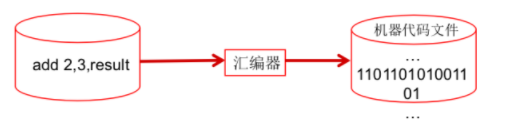
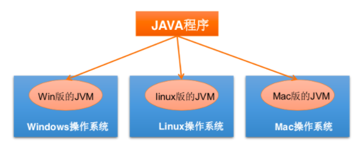
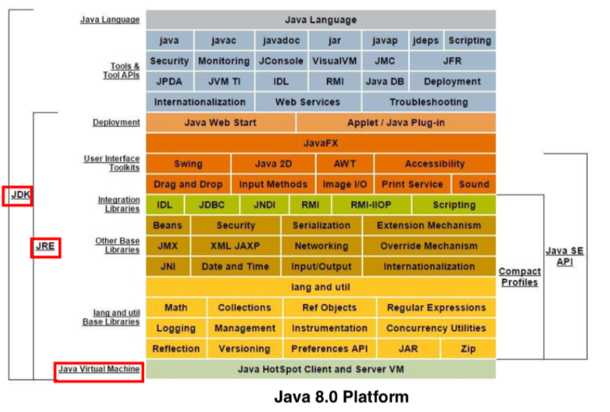
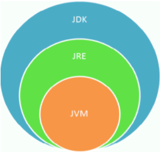
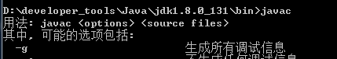
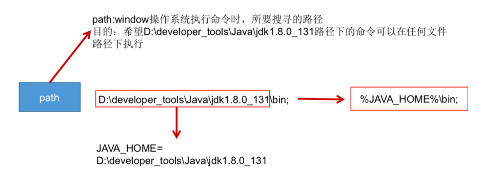
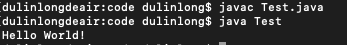
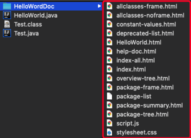
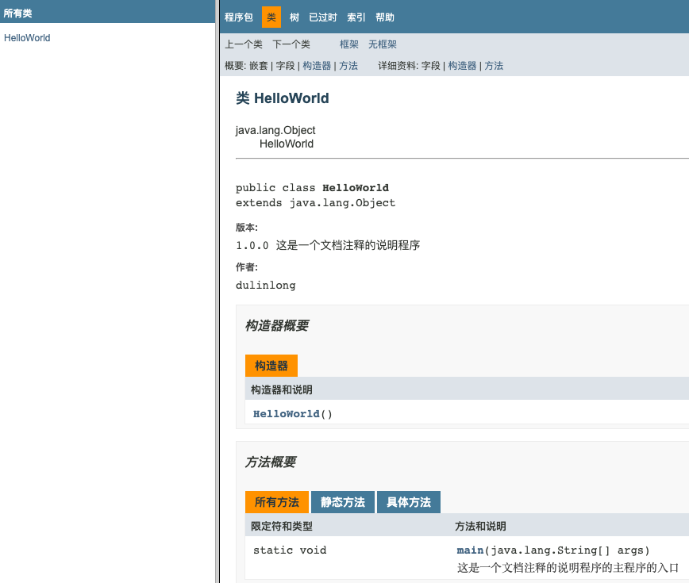

[TOC]

# 软件开发介绍

## 软件开发

一系列按照特定顺序组织的计算机数据和指令的集合。有**系统软件**和**应用软件**之分

## 人机交互方式

- 图形化界面（==G==raphical ==U==ser ==I==nterface ==GUI==）这种方式简单直观，使用者易于接受，容易上手操作。

- 命令行方式（==C==ommand ==L==ine ==I==nterface ==CLI==）需要有一个控制台，输 入特定的指令，让计算机完成一些操作。较为麻烦，需要记录住一些 命令。 

# 计算机编程语言介绍

1. 第一代语言：机器语言。指令二进制代码形式存在。

2. 第二代语言：汇编语言。使用助记符表示一条机器指令。

   

3. 第三代语言:高级语言

   C、Pascal、Fortran面向过程的语言

   C++面向过程/面向对象

   Java跨平台的纯面向对象的语言

   .NET跨语言的平台

   Python、Scala...

## Java语言概述

是SUN(==S==tanford ==U==niversity ==N==etwork，斯坦福大学网络公司 ) 1995年推出的一门高级编程语言。

是一种面向Internet的编程语言。Java一开始富有吸引力是因为Java程序可以 在Web浏览器中运行。这些Java程序被称为Java小程序(applet)。applet使用现代的图形用户界面与Web用户进行交互。 applet内嵌在HTML代码中。

随着Java技术在web方面的不断成熟，已经成为Web应用程序的首选开发语言。

后台开发:Java、PHP、Python、Go、Node.js

## Java简史

* 1991年 Green项目，开发语言最初命名为Oak (橡树)
* 1994年，开发组意识到Oak 非常适合于互联网
* 1996年，发布JDK 1.0，约8.3万个网页应用Java技术来制作
* 1997年，发布JDK 1.1，JavaOne会议召开，创当时全球同类会议规模之最
* 1998年，发布JDK 1.2，同年发布企业平台J2EE
* 1999年，Java分成J2SE、J2EE和J2ME，JSP/Servlet技术诞生
* 2004年，==发布里程碑式版本:JDK 1.5，为突出此版本的重要性，更名为JDK 5.0==
* 2005年，J2SE -> JavaSE，J2EE -> JavaEE，J2ME -> JavaME
* 2009年，Oracle公司收购SUN，交易价格74亿美元
* 2011年，发布JDK 7.0
*  2014年，==发布JDK 8.0，是继JDK 5.0以来变化最大的版本==
* 2017年，发布JDK 9.0，最大限度实现模块化
* 2018年3月，发布JDK 10.0，版本号也称为18.3
* 2018年9月，发布JDK 11.0，版本号也称为18.9

## Java技术体系平台

* **Java SE(Java Standard Edition)标准版**

  支持面向桌面级应用(如Windows下的应用程序)的Java平台，提供了完整的Java核心API，此版本以前称为J2SE

* **Java EE(Java Enterprise Edition)企业版**

  是为开发企业环境下的应用程序提供的一套解决方案。该技术体系中包含的技术如:Servlet 、Jsp等，主要针对于Web应用程序开发。版本以前称为J2EE

* **Java ME(Java Micro Edition)小型版**

  支持Java程序运行在移动终端(手机、PDA)上的平台，对Java API有所精简，并加 入了针对移动终端的支持，此版本以前称为J2ME

* **Java Card**

  支持一些Java小程序(Applets)运行在小内存设备(如智能卡)上的平台

## Java在各领域的应用

- **企业级应用**

  主要指复杂的大企业的软件系统、各种类型的网站。Java的安全机制以及 它的跨平台的优势，使它在分布式系统领域开发中有广泛应用。应用领域包括金融、电 信、交通、电子商务等。

- **Android平台应用**

  Android应用程序使用Java语言编写。Android开发水平的高低 很大程度上取决于Java语言核心能力是否扎实。

- **大数据平台开发**

  各类框架有Hadoop，spark，storm，flink等，就这类技术生态圈来讲，还有各种中间件如flume，kafka，sqoop等等 ，这些框架以及工具大多数 是用Java编写而成，但提供诸如Java，scala，Python，R等各种语言API供编程。

- **移动领域应用**

  主要表现在消费和嵌入式领域，是指在各种小型设备上的应用，包括手机、PDA、机顶盒、汽车通信设备等。

## Java语言的诞生

java之父James Gosling团队在开发"Green"项目时，发现C缺少垃圾回收系统，还有可移植的安全性、分布程序设计和多线程功能。最后，他们想要一种易于移植到各种设备上的平台。

Java确实是从C语言和C++语言继承了许多成份，甚至可以将Java看成是==类C语言==发展和衍生的产物。比如Java语言的变量声明，操作符形式，参数传递，流程控制等方面和C语言、C++语言完全相同。但同时，Java是一个==纯粹的面向对象==的程序设计语言，它继承了C++语言 面向对象技术的核心。Java==舍弃了C语言中容易引起错误的指针==(以 引用取代)、运算符重载(operator overloading)、多重继承 (以接口取代)等特性，==增加了垃圾回收器功能==用于回收不再被引用的对象所占据的内存空间。JDK1.5又引入了泛型编程(Generic Programming)、类型安全的枚举、不定长参数和自动装/拆箱

## Java的主要特性

- **Java语言是易学的**

  Java语言的语法与C语言和C++语言很接近，使得大多数程序员很容易学习和使用Java。

- **Java语言是强制面向对象的**

  Java语言提供类、接口和继承等原语，为了简单起见，只支持类之间的单继承，但支持接口之间的多继承，并支持类与接口之间的实现机制 (关键字为implements)。

- **Java语言是分布式的**

  Java语言支持Internet应用的开发，在基本的Java应用编程接口中有一个网络应用编程接口(java net)，它提供了用于网络应用编程的类库，包括URL、URLConnection、Socket、ServerSocket等。Java的RMI(远程方法激活)机制也是开发分布式应用的重要手段。

- **Java语言是健壮的**

  Java的强类型机制、异常处理、垃圾的自动收集等是Java程序健壮性的重要保证。对指针的丢弃是Java的明智选择。

- **Java语言是安全的**

  Java通常被用在网络环境中，为此，Java提供了一个安全机制以防恶意代码的攻击。如:安全防范机制(类ClassLoader)，如分配不同的名字空间以防替代本地的同名类、字节代码检查。

- **Java语言是体系结构中立的**

  Java程序(后缀为java的文件)在Java平台上被编译为体系结构中立的字节码格式(后缀为class的文件)，然后可以在实现这个Java平台的任何系统中运行。

- **Java语言是解释型的**

  如前所述，Java程序在Java平台上被编译为字节码格式，然后可以在实现这个Java平台的任何系统的解释器中运行。

- **Java是性能略高的**

  与那些解释型的高级脚本语言相比，Java的性能还是较优的。

- **Java语言是原生支持多线程的**

  在Java语言中，线程是一种特殊的对象，它必须由Thread类或其子(孙)类来创建。

## Java程序运行机制及运行过程

### Java语言的特点

1. 面向对象

   * 两个基本概念：类、对象
   * 三个特性：封装、继承、多态

2. 健壮性

   吸收了C/C++语言的优点，但去掉了影响程序健壮性的部分（如指针、内存的申请与释放等），提供了一个相对安全的内存管理和访问机制

3. 跨平台性

   通过Java语言编写的应用程序在不同的系统平台上都可以运行。”**Write Once，Run Anywhere**“

   原理：只要在需要运行Java应用程序的操作系统上，先安装一个Java虚拟机（JVM ==J==ava ==V==irual ==M==achine）。由JVM来负责Java程序在该系统中的运行。

   

   因为有了JVM，同一个Java程序在三个不同的操作系统中都可以执行。这样就实现了Java 程序的跨平台性。

### Java两种核心机制

1. Java虚拟机（Java Virtual Machine）

   * ==JVM是一个虚拟的计算机，具有指令集并使用不同的存储区域。负责执行指令，管理数据、内存、寄存器。==

   * 对于不同的平台，有不同的虚拟机。

   * 只有某平台提供了对应的java虚拟机，java程序才可在此平台运行。

   * Java虚拟机机制屏蔽了底层运行平台的差别，实现了“==一次编译，到处运行==”。

     
     
     

   

2. 垃圾收集机制（Garbage Collection）

   * 不再使用的内存空间应回收—— 垃圾回收。

     在C/C++等语言中，由程序员负责回收无用内存。

     Java 语言消除了程序员回收无用内存空间的责任:它提供一种系统级线程跟踪存储空间的分配情况。并在JVM空闲时，检查并释放那些可被释放的存储空间。

   * 垃圾回收在Java程序运行过程中自动进行，程序员无法精确控制和干预。

   * ==Java程序还会出现内存泄漏和内存溢出问题吗? Yes!==

## Java语言环境搭建

### 什么是JDK、JRE

JDK(==J==ava ==D==evelopment ==K==it Java开发工具包)

JDK是提供给Java开发人员使用的，其中包含了java的开发工具，也包括了JRE。所以安装了JDK，就不用在单独安装JRE了。其中的开发工具:编译工具(javac.exe) 打包工具(jar.exe)等

JRE(==J==ava ==R==untime ==E==nvironment Java运行环境)

包括Java虚拟机(JVM Java Virtual Machine)和Java程序所需的核心类库等， 如果想要运行一个开发好的Java程序，计算机中只需要安装JRE即可。

### JDK、JRE、JVM关系





- JDK = JRE + 开发工具集(例如Javac编译工具等)

- JRE = JVM + Java SE标准类库

### 配置环境变量 path

* 在dos命令行中敲入javac，出现错误提示

  ​										

* 错误原因:当前执行的程序在当前目录下如果不存在，windows系统会在系统中已有的一个名为path的环境变量指定的目录中查找。如果仍未找到，会出现以上的错误提示。所以进入到 jdk安装路径\bin目录下，执行javac，会看到javac参数提示信息。

  ​												

* 配置方法

  我的电脑--属性--高级系统设置--环境变量

  编辑 path 环境变量，在变量值开始处加上java工具所在目录，后面用 “ ; ”和其他值分隔开即可。

  打开DOS命令行，任意目录下敲入javac。如果出现javac 的参数信息，配置成功。

  

## 开发体验-HelloWorld

### 步骤

1. 将 Java 代码==编写==到扩展名为 .java 的文件中。

2. 通过 javac 命令对该 java 文件进行==编译==。

3. 通过 java 命令对生成的 class 文件进行==运行==。


### 步骤一：编写

选择最简单的编辑器:记事本。

敲入代码 classTest{ }将文件保存成Test.java，这个文件是存放 java 代码的文件，称为源文件。

```java
public class Test{
	public static void main(String[] args) { 
		System.out.println("Hello World!");
	}
}
```

### 步骤二：编译

```
javac Test.java
```

有了java源文件，通过编译器将其编译成JVM可以识别的字节码文件。
在该源文件目录下，通过javac编译工具对Test.java文件进行编译。
如果程序没有错误，没有任何提示，但在当前目录下会出现一个Test.class文件，该文件称为字节码文件，也是可以执行的java的程序。

### 步骤三：运行

```
java Test
```



有了可执行的java程序(Test.class字节码文件)，通过运行工具java.exe对字节码文件进行执行。

## 注释

### Java中的注释类型

* 单行注释            格式：//注释文字

* 多行注释            格式：/* 注释文字 */

  对于单行和多行注释，被注释的文字，不会被JVM(java虚拟机)解释执行。

  多行注释里面不允许有多行注释嵌套。

* 文档注释 (java特有) 

  格式:

  /**

  ​		@author 指定java程序的作者

  ​		@version 指定源文件的版本

  */

  注释内容可以被JDK提供的工具 javadoc 所解析，生成一套以网页文件形式体现的该程序的说明文档。

### 文档注释

```java
/**
	@author dulinlong
	@version 1.0.0
	这是一个文档注释的说明程序
*/
public class HelloWorld{
	/**
		这是一个文档注释的说明程序的主程序的入口
	*/
	public static void main(String[] args) { 
		System.out.println("Hello World!");
	}
}
```

将代码保存到 HelloWorld.java 文件，然后命令行执行

```
javadoc -d HelloWordDoc -author -version HelloWorld.java
```

生成如下文件



打开 index.html，可以看见自动生成的文档



# 小结

* Java源文件以"java"为扩展名。源文件的基本组成部分是类(class)，如 本例中的HelloWorld类。

* Java语言严格区分大小写。

* 一个源文件中最多只能有一个public类。其它类的个数不限，如果源文件包含一个public类，则文件名必须按该类名命名。

# Java API的文档

API (Application Programming Interface,应用程序编程接口)是 Java 提供的基本编程接口。

Java语言提供了大量的基础类，因此 Oracle 也为这些基础类提供了相应的API文档，用于告诉开发者如何使用这些类，以及这些类里包含的方法。

下载API:http://www.oracle.com/technetwork/java/javase/downloads/index.html 

Additional Resources-Java SE 8 Documentation下载。


# Java开发工具

## 文本编辑工具

记事本、UltraEdit、EditPlus、TextPad、NotePad

## Java集成开发环境(IDE)

JBuilder、NetBeans、==Eclipse==、MyEclipse、==IntelliJ IDEA==

#### 


