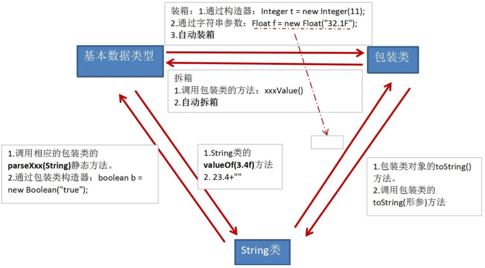
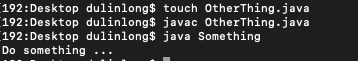

面向对象学习思路：

类的成员：属性、方法、构造器、代码块、内部类

面向对象的特征：封装、继承、多态

关键字：this、super、package、impot、instanceof、 ==（equals）、static、final、abstract


# 面向过程与面向对象

## 何为"面向对象"的编程思想

首先解释一下"思想"。

先问一个问题：你想做个怎么样的人？

你可能的回答：我想做个好人，孝敬父母，尊敬长辈，关爱朋友......

其实你的回答就是思想。这个是做人的思想，或者说，这是你做人的原则。

做人有做人的原则，编程也有编程的原则。这些编程的原则，就是编程的思想。

## 面向过程与面向对象

二者都是一种思想，面向对象是相对于面向过程而言的

* 面向过程（POP）Procedure Oriented Programming

  ==强调的是功能行为，以函数为最小单位，考虑怎么做==。

* 面向对象（OOP）Object Oriented Programming

  将功能封装进对象，==强调具备了功能的对象，以类/对象为最小单位，考虑谁来做==。

  面向对象更加强调运用人类在日常的思维逻辑中采用的思想方法与原则，如抽象、分类、继承、聚合、多态等

* 例子:人把大象装进冰箱

  * 面向过程

    ```
    1.打开冰箱
    2.把大象装进冰箱
    3.把冰箱门关住
    ```

  * 面向对象

    ```
    人{
    	打开(冰箱){
    		冰箱.开门();
    	}
    	操作(大象){
    		大象.进入(冰箱);
    	}
    	关闭(冰箱){
    		冰箱.关门();
    	}
    }
    
    冰箱{
    	开门(){}
    	关门(){}
    }
    
    大象{
    	进入(冰箱){}
    }
    ```

## 面向对象的思想概述

* 程序员从面向过程的==执行者==转化成了面向对象的==指挥者==
* 面向对象分析方法分析问题的思路和步骤：
  1. 根据问题需要，选择问题所针对的==现实世界中的实体==
  2. 从实体中寻找解决问题相关的属性和功能，这些属性和功能就形成了==概念世界中的类==
  3. 把抽象的实体用计算机语言进行描述，==形成计算机世界中类的定义==。即借助某种程序语言，把类构造成计算机能够识别和处理的数据结构
  4. 将==类实例化成计算机世界中的对象==。对象是计算机世界中解决问题的最终工具
* 类(Class)和对象(Object)是面向对象的==核心概念==
  * 类是对一类事物的描述，是==抽象的==、概念上的定义
  * 对象是==实际存在==的该类事物的每个个体，因而也称为==实例==(instance)
* "万事万物皆对象"
  1. 在 Java 语言范畴中，我们将功能、结构等封装到类中，通过类的实例化来调用具体的功能结构
     1. Scanner，String等
     2. 文件：File
     3. 网络资源：URL
  2. 涉及到 Java 语言与前端 Html、后端的数据交互时，前后端的结构在 Java 层面交互时，都体现为类、对象

# 对象的创建和使用

## 内存分析

```java
class Person{//人类
  String name;//姓名
  int age = 1;//年龄
  boolean isMale;//是否是男性 
}
class PersonTest{ 
  public static void main(String[] args){
		Person p = new Person(); 
    Person p1 = new Person(); 
    p1.name = "Tom";
		Person p2 = p1;
	} 
}
```


## 匿名对象

* 我们也可以不定义对象的句柄，而直接调用这个对象的方法。这样的对象叫做匿名对象

  如:==new Person().shout();==

* 使用情况

  如果对一个对象只需要进行一次方法调用，那么就可以使用匿名对象

  我们经常将匿名对象作为实参传递给一个方法调用

# 类的成员之一：属性

## 语法格式

修饰符 数据类型 属性名 = 初始化值 ;

- 说明1：修饰符
  - 常用的权限修饰符有:private、缺省、protected、public
  - 其他修饰符:static、final 
- 说明2：数据类型
  - 任何基本数据类型(如int、Boolean) 或 任何引用数据类型
- 说明3：属性名
  - 属于标识符，符合命名规则和规范即可

## 变量的分类 - 按声明的位置

==在方法体外，类体内声明的变量称为成员变量==。

==在方法体内部声明的变量称为局部变量==。


**注意：二者在初始化值方面的异同**

​	同：都有生命周期

​	异：局部变量除形参外，需显式初始化

### 成员变量（属性）和局部变量的区别

|              | 成员变量                         | 局部变量                                      |
| ------------ | -------------------------------- | --------------------------------------------- |
| 声明的位置   | 直接声明在类中                   | 方法形参或内部、代码块内、构造器内等          |
| 修饰符       | private、public、static、final等 | 不能用权限修饰符修饰和static，可以用final修饰 |
| 初始化值     | 有默认初始化值                   | 没有默认初始化值，必须显式赋值，方可使用      |
| 内存加载位置 | 堆空间 或 静态域内               | 栈空间                                        |

## 属性赋值的位置

1. 默认初始化
2. 显示初始化
3. 在代码块中赋值
4. 构造器中初始化
5. 有了对象之后，可以通过"对象.属性"或"对象.方法"的方式，进行赋值

执行顺序：1 - 2/3 - 4 - 5  ( 2/3 看代码顺序)

# 类的成员之二：方法

## 方法的重载Overload

| 重载的概念 | 在同一个类中，允许存在一个以上的同名方法，只要它们的参数个数或者参数类型不同即可 |
| ---------- | ------------------------------------------------------------ |
| 重载的特点 | 与返回值类型无关，只看参数列表，且参数列表必须不同。(参数个数或参数类型)。调用时，根据方法参数列表的不同来区别 |
| 重载的示例 | //返回两个整数的和<br /> int add(int x,int y){return x+y;}<br />//返回三个整数的和<br />int add(int x,int y,int z){return x+y+z;}<br />//返回两个小数的和<br />double add(double x,double y){return x+y;} |

注意：方法能够在同一个类中或者在一个子类中被重载

## 可变个数的形参

JavaSE 5.0 中提供了Varargs(variable number of arguments)机制，允许直接定义能和多个实参相匹配的形参。从而，可以用一种更简单的方式，来传递个数可变的实参

//JDK 5.0以前:采用数组形参来定义方法，传入多个同一类型变量

```java
public static void test(int a ,String[] books);
```

//JDK5.0：采用可变个数形参来定义方法，传入多个同一类型变量

```java
public static void test(int a ,String...books);
```


* 声明格式：方法名(参数的类型名 ...参数名)

* 可变参数：方法参数部分指定类型的参数个数是可变多个:0个，1个或多个
* 可变个数形参的方法与同名的方法之间，彼此构成重载
* 可变参数方法的使用与方法参数部分使用数组是一致的
* 方法的参数部分有可变形参，需要放在形参声明的最后
* 在一个方法的形参位置，最多只能声明一个可变个数形参

```java
public void test1(String book){
	System.out.println("****与可变形参方法构成重载的test1方法****");
}
public void test1(String ... books){
	System.out.println("****形参长度可变的test1方法****");
}

public static void main(String[] args){
	TestOverload to = new TestOverload();  
  to.test1();//调用第二个可变形参test1方法
  to.test1("aa");////调用第一个test1方法
	to.test1("aa" , "bb"); //调用第二个可变形参test1方法
}
```

## 方法参数的值传递机制

* 方法，必须由其所在类或对象调用才有意义。若方法含有参数
  * 形参：方法声明时的参数
  * 实参：方法调用时实际传给形参的参数值

* ==Java的实参值如何传入方法呢？==

  Java里方法的参数传递方式只有一种：==值传递==。 即将实际参数值的副本 (复制品)传入方法内，而参数本身不受影响

  * 形参是==基本数据类型==：将实参基本数据类型变量的"==数据值=="传递给形参
  * 形参是==引用数据类型==：将实参引用数据类型变量的"==地址值=="传递给形参

  

# 类的成员之三：构造器（或构造方法）

## 构造器的特征

* 它具有与类相同的名称
* 它不声明返回值类型。(与声明为void不同)
* 不能被static、final、synchronized、abstract、native修饰，不能有return语句返回值

## 构造器的作用

创建对象;给对象进行初始化

* 如:Order o = new ==Order()==; Person p = new ==Person("Peter",15)==;

## 构造器分类

根据参数不同，构造器可以分为如下两类：

* 隐式无参构造器(系统==默认==提供)
* ==显式==定义一个或多个构造器(无参、有参)

## 注意

* Java语言中，每个类都至少有一个构造器
* 默认构造器的修饰符与所属类的修饰符一致
* 一旦显式定义了构造器，则系统==不再==提供默认构造器
* 一个类可以创建多个==重载==的构造器
* 父类的构造器不可被子类继承

# 类的成员之四：代码块

* 作用
  * ==对Java类或对象进行初始化==
* 代码块(或初始化块)的分类
  * 静态代码块(static block)：一个类中代码块若有修饰符，则只能被static修饰
  * 非静态代码块
* 静态代码块
  * 可以有输出语句
  * 可以对类的属性、类的声明进行初始化操作
  * 不可以对非静态的属性初始化。即:不可以调用非静态的属性和方法
  * 若有多个静态的代码块，那么按照从上到下的顺序依次执行
  * 静态代码块的执行要先于非静态代码块
  * 静态代码块随着类的加载而加载，且只执行一次
* 非静态代码块
  * 可以有输出语句
  * 可以对类的属性、类的声明进行初始化操作
  * 除了调用非静态的结构外，还可以调用静态的变量或方法
  * 若有多个非静态的代码块，那么按照从上到下的顺序依次执行
  * 每次创建对象的时候，都会执行一次。且先于构造器执行

# 类的成员之五：内部类

* 代码中允许一个类 A 声明在另一个类 B 中，则 A 是内部类，类 B 称为外部类 

* 内部类的分类
  * 成员内部类(静态、非静态) 
  *  局部内部类(方法内，构造器内，代码块内)

## 成员内部类

* 一方面，作为外部类的成员
  * 可以调用外部类的结构
  * 可以被 static 修饰，但此时就不能再使用外部类的非 static 的成员变量
  * 可以被权限访问修饰符修饰
* 另一方面，作为一个类
  * 可以在内部定义属性、方法、构造器等结构
  * 可以声明为 abstract 类 ，因此可以被其它的内部类继承
  * 可以声明为 final 的
  * 编译以后生成 OuterClass$InnerClass.class 字节码文件(也适用于局部内部类)

## 局部内部类

* 如何声明局部内部类

```java
class Outer {
	public void method() {
    class Inner {
      public void function() {}
    }
		Inner inner = new Inner();
		inner.function();
	}
}
```

* 如何使用局部内部类
  * 只能在声明它的方法或代码块中使用，而且是先声明后使用。除此之外的任何地方都不能使用该类
  * 但是它的对象可以通过外部方法的返回值返回使用，返回值类型只能是局部内部类的父类或父接口类型
* 局部内部类的特点
  * 内部类仍然是一个独立的类，在编译之后内部类会被编译成独立的.class文件，但是前面冠以外部类的类名和$符号，以及数字编号
  * 只能在声明它的方法或代码块中使用，而且是先声明后使用。除此之外的任何地方都不能使用该类
  * 局部内部类可以使用外部类的成员，包括私有的
  * ==局部内部类可以使用外部方法的局部变量，但是必须是final的==。由局部内部类和局部变量的声明周期不同所致
  * 局部内部类和局部变量地位类似，不能使用public,protected,缺省,private
  * 局部内部类不能使用static修饰，因此也不能包含静态成员

## 匿名内部类(匿名子类对象)

- 匿名内部类不能定义任何静态成员、方法和类，只能创建匿名内部类的一个实例。一个匿名内部类一定是在new的后面，用其隐含实现一个接口或实现一个类

- 格式

  ```java
  new 父类或接口() {
  	//进行方法的重写
  };
  ```

  ```java
  interface Animal {
  	void eat();
  	}
  public class Demo {
  	public static void main（String[] args）{
  		new Animal(){
  			@Override
  			public void eat() {
  				System.out.println("吃");
  			}
  		}.eat();
  	}
  }
  ```

- 匿名内部类的特点

  * 匿名内部类必须继承父类或实现接口
  * 匿名内部类只能有一个对象
  * 匿名内部类对象只能使用多态形式引用

思考：

如何实例化成员内部内对象

如何在成员内部类中区分调用外部类的结构

开发中局部内部类的使用

# 面向对象特征之一：封装和隐藏

* ==为什么需要封装？封装的作用和含义？==

  我要用洗衣机，只需要按一下开关和洗涤模式就可以了。有必要了解洗衣机内部的结构吗?有必要碰电动机吗?

* 我们程序设计追求"高内聚，低耦合"
  * 高内聚：类的内部数据操作细节自己完成，==不允许外部干涉==
  * 低耦合：仅对外暴露少量的方法用于使用
* 隐藏对象内部的复杂性，只对外公开简单的接口。便于外界调用，从而提高系统的可扩展性、可维护性。通俗的说，==把该隐藏的隐藏起来，该暴露的暴露出来。这就是封装性的设计思想==

## 四种访问权限修饰符

Java权限修饰符public、protected、(缺省)、private置于类的成员定义前， 用来限定对象对该类成员的访问权限。 

| 修饰符    | 类内部 | 同一个包 | 不同包的子类 | 同一个工程 |
| --------- | ------ | -------- | ------------ | ---------- |
| private   | Yes    |          |              |            |
| (缺省)    | Yes    | Yes      |              |            |
| protected | Yes    | Yes      | Yes          |            |
| public    | Yes    | Yes      | Yes          | Yes        |

对于class的权限修饰只可以用public和default(缺省)。 

* public类可以在任意地方被访问。

* default类只可以被同一个包内部的类访问。 

# 面向对象的特征之二：继承性（inheritance）

* ==为什么要有继承?==

  多个类中存在相同属性和行为时，将这些内容抽取到单独一个类中， 那么多个类无需再定义这些属性和行为，只要继承那个类即可

* 此处的多个类称为==子类(派生类)==，单独的这个类称为==父类(基类或超类)==。可以理解为:“子类 is a 父类”

* 作用

  * 继承的出现减少了代码冗余，提高了代码的==复用性==
  * 继承的出现，更有利于==功能的扩展==
  * 继承的出现让类与类之间产生了关系，提供了==多态的前提==

* 注意：不要仅为了获取其他类中某个功能而去继承

* Java只支持==单继承和多层继承==，不允许多重继承

## 方法的重写Override

* 定义

  在子类中可以根据需要对从父类中继承来的方法进行改造，也称为方法的重置、覆盖。在程序执行时，子类的方法将覆盖父类的方法

* 要求

  * 子类重写的方法==必须==和父类被重写的方法具有相同的==方法名称、参数列表==

  * 子类重写的方法使用的==访问权限不能小于==父类被重写的方法的访问权限
    * 子类不能重写父类中声明为private权限的方法
  * 子类重写的方法的==返回值类型不能大于==父类被重写的方法的返回值类型（返回本类或子类）
  * 子类方法抛出的异常不能大于父类被重写方法的异常（抛出本类或子类）

* 注意

  子类与父类中同名同参数的方法必须同时声明为非static的(即为重写)，或者同时声明为static的(不是重写)。因为static方法是属于类的，子类无法覆盖父类的方法

# 面向对象的特征之三：多态

* 多态性，是面向对象中最重要的概念，在Java中的体现

  ==对象的多态性：父类的引用指向子类的对象==

  * 可以直接应用在抽象类和接口上

* Java引用变量有两个类型：==编译时类型==和==运行时类型==。编译时类型由声明该变量时使用的类型决定，运行时类型由实际赋给该变量的对象决定。简称：==编译时，看左边；运行时，看右边==

  * ==若编译时类型和运行时类型不一致，就出现了对象的多态性(Polymorphism)==

  * 多态情况下，"看左边"：看的是父类的引用(父类中不具备子类特有的方法)

    ​						"看右边"：看的是子类的对象(实际运行的是子类重写父类的方法)

* 对象的多态 — 在Java中,==子类==的对象可以替代==父类==的对象使用

  * 一个变量只能有一种确定的数据类型
  * 一个引用类型变量可能指向(引用)多种不同类型的对象

  ```java
  Person p = new Student();
  Object o = new Person();//Object类型的变量o，指向Person类型的对象 
  o = new Student(); //Object类型的变量o，指向Student类型的对象
  ```

* 子类可看做是特殊的父类，所以父类类型的引用可以指向子类的对象：向上转型(upcasting)

* 一个引用类型变量如果声明为父类的类型，但实际引用的是子类对象，那么该变量就==不能==再访问子类中添加的属性和方法

  ```java
  Student m = new Student();
  m.school = "pku"; //合法,Student类有school成员变量 
  Person e = new Student();
  e.school = "pku"; //非法,Person类没有school成员变量
  ```

  ==属性是在编译时确定的，编译时e为Person类型，没有school成员变量，因而编译错误。==

## 多态性应用举例

* 方法声明的形参类型为父类类型，可以使用子类的对象作为实参调用该方法

```java
public class Test {
	public void method(Person e) {
			e.getInfo();
	}
	public static void main(Stirng args[]) {
		Test t = new Test();
		Student m = new Student();
		t.method(m); // 子类的对象m传送给父类类型的参数e
	}
}
```

* 虚拟方法调用(Virtual Method Invocation)

  * 正常的方法调用

    ```java
    Person e = new Person();
    e.getInfo();
    Student e = new Student(); 
    e.getInfo();
    ```

  * 虚拟方法调用(多态情况下)

    子类中定义了与父类同名同参数的方法，在多态情况下，将此时父类的方法称为虚拟方法，父类根据赋给它的不同子类对象，动态调用属于子类的该方法。这样的方法调用在编译期是无法确定的。

    ```java
    Person e = new Student();
    e.getInfo(); //调用Student类的getInfo()方法
    ```

  * 编译时类型和运行时类型

    编译时e为Person类型，而方法的调用是在运行时确定的，所以调用的是Student类的getInfo()方法。==——动态绑定==

# 小结

## 方法的重载和重写

1. 二者的定义细节

2. 从编译和运行的角度看

   重载，是指允许存在多个同名方法，而这些方法的参数不同。编译器根据方法不同的参数表，对同名方法的名称做修饰。对于编译器而言，这些同名方法就成了不同的方法。==它们的调用地址在编译期就绑定了==。Java的重载是可以包括父类和子类的，即子类可以重载父类的同名不同参数的方法。 

   所以：

   对于重载而言，在方法调用之前，编译器就已经确定了所要调用的方法， 这称为=="早绑定"或"静态绑定"==;

   而对于多态，只有等到方法调用的那一刻，解释运行器才会确定所要调用的具体方法，这称为=="晚绑定"或"动态绑定"==。

## 多态小结

* 作用：提高了代码的通用性，常称作接口重用
* 前提：
  * 需要存在继承或者实现关系
  * 有方法的重写
* 成员方法
  * 编译时：要查看==引用变量所声明的类==中是否有所调用的方法
  * 运行时：调用实际==new的对象所属的类==中的重写方法
* 成员变量
  * 不具备多态性，只看引用变量所声明的类

# 包装类(Wrapper)的使用

* 针对八种基本数据类型定义相应的引用类型—包装类(封装类)

* 有了类的特点，就可以调用类中的方法，Java才是真正的面向对象

  

## 基本数据类型包装成包装类的实例 - 装箱

* 通过包装类的构造器实现
  * int i = 500; Integer t = new Integer(i);
* 还可以通过字符串参数构造包装类对象
  * Float f = new Float("4.56");

## 获得包装类对象中包装的基本类型变量 - 拆箱

* 调用包装类的.xxxValue()方法
  * boolean b = bObj.booleanValue();
* JDK1.5之后，支持自动装箱，自动拆箱。但类型必须匹配

## 字符串转换成基本数据类型

* 通过包装类的构造器实现
  * int i = new Integer("12");
* 通过包装类的parseXxx(String s)静态方法
  * Float f = Float.parseFloat("12.1");

## 基本数据类型转换成字符串

* 调用字符串重载的valueOf()方法
  * String fstr = String.valueOf(2.34f);
* 更直接的方式
  * String intStr = 5 + "";

## 总结



**简易版**

基本数据类型 <---> 包装类：JDK 5.0 新特性 自动装箱 自动拆箱

基本数据类型、包装类 ---> String： String类的valueOf()

String ---> 基本数据类型、包装类：包装类的parseXxx(String)

# 扩展知识

## JavaBean

* JavaBean是一种Java语言写成的可重用组件
* 所谓javaBean，是指符合如下标准的Java类
  * ==类是公共的==
  * ==有一个无参的公共的构造器==
  * ==有属性，且有对应的get、set方法==
* 用户可以使用JavaBean将功能、处理、值、数据库访问和其他任何可以用Java代码创造的对象进行打包，并且其他的开发者可以通过内部的JSP页面、Servlet、其他JavaBean、applet程序或者应用来使用这些对象。用 户可以认为JavaBean提供了一种随时随地的复制和粘贴的功能，而不用关心任何改变

## UML类图


+ +表示 public 类型， - 表示 private 类型，#表示protected类型
+ 方法的写法：
  方法的类型(+、-) 方法名(参数名：参数类型)：返回值类型

# 关键词 - this

使用this，调用属性、方法

使用this，调用本类的构造器注意：

* 可以在类的构造器中使用"this(形参列表)"的方式，调用本类中重载的其他的构造器
* 明确：构造器中不能通过"this(形参列表)"的方式调用自身构造器
* 如果一个类中声明了n个构造器，则最多有 n - 1个构造器中使用了"this(形参列表)"
* "this(形参列表)"必须声明在类的构造器的首行
* 在类的一个构造器中，最多只能声明一个"this(形参列表)"

# 关键字 - super

* 在Java类中使用super来调用父类中的指定操作:
  * super可用于访问父类中定义的属性
  * super可用于调用父类中定义的成员方法
  * super可用于在子类构造器中调用父类的构造器
* 注意
  * 尤其当子父类出现同名成员时，可以用super表明调用的是父类中的成员
  * ==super的追溯不仅限于直接父类==
  * super和this的用法相像，this代表本类对象的引用，super代表父类的内存空间的标识

* 调用父类的构造器
  * 子类中所有的构造器==默认==都会访问父类中==空参数的构造器==
  * 当父类中没有空参数的构造器时，子类的构造器必须通过==this(参数列表)==或者==super(参数列表)==语句指定调用本类或者父类中相应的构造器。同时，只能"二选一"，且必须放在构造器的首行
  * 如果子类构造器中既未显式调用父类或本类的构造器，且父类中又没有无参的构造器，则==编译出错==

## this和super的区别

| No.  | 区别点     | this                                                   | super                                    |
| ---- | ---------- | ------------------------------------------------------ | ---------------------------------------- |
| 1    | 访问属性   | 访问本类中的属性，如果本类没有此属性则从父类中继续查找 | 直接访问父类中的属性                     |
| 2    | 调用方法   | 访问本类中的方法，如果本类没有此方法则从父类中继续查找 | 直接访问父类中的方法                     |
| 3    | 调用构造器 | 调用本类构造器，必须放在构造器的首行                   | 调用父类构造器，必须放在子类构造器的首行 |

## 子类对象实例化全过程

* 从结果上看

  子类继承父类以后，就获得了父类中声明的属性或方法

  创建子类的对象，在堆空间中，就会加载所有父类中声明的属性

* 从过程上看

  当我们通过子类的构造器创建子类时，我们一定会直接或间接的调用父类的构造器，进而调用父类的父类构造器，直至调用到 java.lang.Object 类中空参的构造器为止，正因为加载过所有的父类的结构，所以才可以内存中父类的结构，子类对象才可以进行调用。

* 注意

  虽然创建子类对象时，调用了父类的构造器，但自始至终就创建了一个对象，即为 new 的子类对象

# 关键字 - package

package语句作为Java源文件的第一条语句，指明该文件中定义的类所在的包

包的作用：

* 包帮助管理大型软件系统：将功能相近的类划分到同一个包中。比如:==MVC的设计模式==
* 包可以包含类和子包，划分项目层次，便于管理
* 解决类命名冲突的问题
* 控制访问权限

# 关键字 - import

为使用定义在不同包中的 Java 类，需用 import 语句来引入指定包层次下所需要的类或全部类(.*)。==import 语句告诉编译器到哪里去寻找类==

* 在源文件中使用 import 显式的导入指定包下的类或接口
* 声明在包的声明和类的声明之间。
* 如果需要导入多个类或接口，那么就并列显式多个 import 语句即可
* 举例：可以使用 java.util.* 的方式，一次性导入 util 包下所有的类或接口。
* 如果导入的类或接口是 java.lang 包下的，或者是当前包下的，则可以省略此 import 语句。
* 如果在代码中使用不同包下的同名的类。那么就需要使用类的全类名的方式指明调用的是哪个类。
* 如果已经导入 java.a.* 包下的类。那么如果需要使用a包的子包下的类的话，仍然需要导入。
* ==import static==组合的使用：调用指定类或接口下的静态的属性或方法

# 关键字 - instanceof 

x instanceof A：检验x是否为类A的对象，返回值为boolean型。

* 使用场景：我们在进行向下转型之前，先进性 instanceof 的判断，一旦返回true，才进行向下转型，否则转型出现 ClassCastException 异常

* 如果x instanceof A 为true，且B是A的父类，则x instanceof B值也为true
* 要求x所属的类与类A必须是子类和父类的关系，否则编译错误

# 操作符 == 

* 基本类型比较值：只要两个变量的值相等，即为true
* 引用类型比较引用(是否指向同一个对象)：只有指向同一个对象时，==才返回true
* 用"\=="进行比较时，符号两边的==数据类型必须兼容==(可自动转换的基本数据类型除外)，否则编译出错

```java
int i = 10;
int j = 10;
float d = 10.0f;
System.out.println(i == j);//true
System.out.println(i == d);//true

boolean b = true;
//System.out.println(i == b);//编译报错

char c = 10;
System.out.println(i == c);//true

char c1 = 'A';
char c2 = 65;
System.out.println(c1 == c2);//true

//引用类型
Base base1 = new Base();
Base base2 = new Base();
System.out.println(base1 == base2);//false

String str1 = new String("123");
String str2 = new String("123");
System.out.println(str1 == str2);//false
```

## equals()

* 是一个方法，而非运算符

* 只能适用于引用数据类型

* Object 类中定义的 equals() 和 == 的作用是相同的：比较两个对象的地址值是否相同

  ```java
  public boolean equals(Object obj) {
  	return (this == obj);
  }
  ```

* 类File、String、Date及包装类 (Wrapper Class)来说，是比较类型及内容而不考虑引用的是否是同一个对象，重写了 Object 类中的 equals 方法

## 重写equals()方法的原则

* ==对称性==：如果x.equals(y)返回是"true"，那么y.equals(x)也应该返回是 "true"
* ==自反性==：x.equals(x)必须返回是"true"
* ==传递性==：如果x.equals(y)返回是"true"，而且y.equals(z)返回是"true"，那么z.equals(x)也应该返回是"true"
* ==一致性==：如果x.equals(y)返回是"true"，只要x和y内容一直不变，不管你重复x.equals(y)多少次，返回都是"true"
* 任何情况下，x.equals(null)，永远返回是"false";x.equals(和x不同类型的对象)永远返回是"false"

# 关键字 - static

## 使用范围

在Java类中，可用static修饰==属性、方法、代码块、内部类==

## 使用static修饰属性：静态变量(或类变量)

* 按是否使用 static 修饰，分为：静态属性(类变量) 或 非静态属性(实例变量)

  * 实例变量：我们创建多个对象，每个对象都独立的拥有一套类中的非静态属性。当修改其中一个对象的非静态属性时，不会导致其他对象中同样的属性值的修改。
  * 类变量：我们创建多个对象，多个对象共享同一静态变量。当修改其中一个对象的静态变量时，会导致其他对象中同样的属性值被修改。

* static 修饰属性的其他说明

  * 静态变量随着类的加载而加载，可以通过"类.静态变量"的方式进行调用

  * 静态变量的加载要早于对象的创建

  * 由于类只会加载一次，则静态变量在内存中也只会存在一份：存在方法区的静态域中

  * |      | 类变量 | 实例变量 |
    | ---- | ------ | -------- |
    | 类   | yes    | no       |
    | 对象 | yes    | yes      |

* 静态属性举例：System.out;  Math.PI;

## 使用 static 修饰方法：静态方法

* 随着类的加载而加载，可以通过"类.静态方法"的方式进行调用

* |      | 静态方法 | 非静态方法 |
  | ---- | -------- | ---------- |
  | 类   | yes      | no         |
  | 对象 | yes      | yes        |

* 静态方法中，只能调用静态的方法或属性

  非静态的方法中，既可以调用非静态的方法或属性，也可以调用静态的方法或属性

static注意点：

* 在静态的方法内，不能使用this，super关键字
* 关于静态属性和静态方法的使用，大家都从声明周期的角度去理解

## 小结

* 随着类的加载而加载
* 优先于对象存在
* 修饰的成员，被所有对象所共享
* 访问权限允许时，可不创建对象，直接被类调用

## 开发中，如何确定是否要声明为 static？

* 属性
  * 属性可被多个对象所共享的，不会随着对象的不同而不同(银行账户类中银行的利率，最小存款数)
* 方法
  * 操作静态属性的方法，通常设置为 static
  * 工具类中的方法，习惯上声明为 static 比如 Math、Arrays、Collections

## 单例 (Singleton)设计模式

### 设计模式概念

设计模式==是在大量的实践中总结和理论化之后优选的代码结构、编程风格、 以及解决问题的思考方式==。设计模免去我们自己再思考和摸索。就像是经典 的棋谱，不同的棋局，我们用不同的棋谱。=="套路"==

### 单例设计模式

#### 概念

采取一定的方法保证在整个的软件系统中，对某个类只能存在一个对象实例，并且该类只提供一个取得其对象实例的方法

#### 方式

* 首先必须将类的==构造器的访问权限设置为private==，这样，就不能用new操作符在类的外部产生类的对象了，
* 但在类内部仍可以产生该类的对象。因为在类的外部开始还无法得到类的对象，只能==调用该类的某个静态方法==以返回类内部创建的对象， 静态方法只能访问类中的静态成员变量，所以，指向类内部产生的==该类对象的变量也必须定义成静的==。

#### 饿汉式

```java
class Singleton {
	// 1.私有化构造器
	private Singleton() { }
	// 2.内部提供一个当前类的实例
	// 4.此实例也必须静态化
	private static Singleton single = new Singleton();
	// 3.提供公共的静态的方法，返回当前类的对象 
  public static Singleton getInstance() {
		return single;
  }
}
```

#### 懒汉式

```java
class Singleton {
	// 1.私有化构造器
	private Singleton() {	}
	// 2.内部提供一个当前类的实例
	// 4.此实例也必须静态化
	private static Singleton single;
	// 3.提供公共的静态的方法，返回当前类的对象 
  public static Singleton getInstance() { //懒汉式暂时还存在线 程安全问题，多线程时，可修复
    if(single == null) {
      single = new Singleton();
    }
		return single;
  }
}
```

#### 优点

由于单例模式只生成一个实例，==减少了系统性能开销==，当一个对象的 产生需要比较多的资源时，如读取配置、产生其他依赖对象时，则可 以通过在应用启动时直接产生一个单例对象，然后永久驻留内存的方式来解决

#### 应用场景

- ==网站的计数器==，一般也是单例模式实现，否则难以同步。
- ==应用程序的日志应用==，一般都使用单例模式实现，这一般是由于共享的日志文件一直处于打开状态，因为只能有一个实例去操作，否则内容不好追加。
- ==数据库连接池==的设计一般也是采用单例模式，因为数据库连接是一种数据库资源。
- 项目中，==读取配置文件的类==，一般也只有一个对象。没有必要每次使用配置文件数据，都生成一个对象去读取。
- ==Application 也是单例的典型应用==
- Windows的==Task Manager (任务管理器)==就是很典型的单例模式
- Windows的==Recycle Bin (回收站)==也是典型的单例应用。在整个系统运行过程中，回收站一直维护着仅有的一个实例。

# 关键字 - final

在 Java 类中，可用 final 修饰==类、属性、方法==

* ==final 标记的类不能被继承==，提高安全性，提高程序的可读性
  * String类、System类、StringBuffer类
* ==final 标记的方法不能被子类重写==
  * 比如：Object 类中的 getClass()
* ==final 标记的变量(成员变量或局部变量)即称为常量==。名称大写，且只能被赋值一次
  * final 标记的成员变量必须在声明时或在每个==构造器中或代码块==中==显式赋值==，然后才能使用
  * final double MY_PI = 3.14;
  * static final：全局常量

# 关键字 - abstract

* 用 abstract 关键字来修饰一个类，这个类叫做==抽象类==
* 用 abstract 来修饰一个方法，该方法叫做==抽象方法==
  * 抽象方法：只有方法的声明，没有方法的实现。以分号结束
  * 比如：==public abstract void talk();==
* 含有抽象方法的类必须被声明为抽象类
* 抽象类不能被实例化。抽象类是用来被继承的，抽象类的子类必须重写父类的抽象方法，并提供方法体。若没有重写全部的抽象方法，仍为抽象类

使用注意：

* 不能修饰属性、代码块、构造器
* 不能修饰私有方法、静态方法、final的方法、final的类

## 模板方法设计模式(TemplateMethod)

抽象类体现的就是一种模板模式的设计，抽象类作为多个子类的通用模板，子类在抽象类的基础上进行扩展、改造，但子类总体上会保留抽象类的行为方式。

**解决的问题**

* 当功能内部一部分实现是确定的，一部分实现是不确定的。这时可以把不确定的部分暴露出去，让子类去实现
* ==换句话说，在软件开发中实现一个算法时，整体步骤很固定、通用， 这些步骤已经在父类中写好了。但是某些部分易变，易变部分可以抽象出来，供不同子类实现。这就是一种模板模式==

```java
abstract class Template {
    public final void getTime() {
			long start = System.currentTimeMillis();
			code();
			long end = System.currentTimeMillis(); 
      System.out.println("执行时间是:" + (end - start));
	}
	public abstract void code(); 
}

class SubTemplate extends Template { 
	public void code() {
		for (int i = 0; i < 10000; i++) { 
				System.out.println(i);
		}
	}
} 
```

模板方法设计模式是编程中经常用得到的模式。各个框架、类库中都有他的 影子，比如常见的有:

* 数据库访问的封装
* Junit 单元测试
* JavaWeb 的 Servlet 中关于 doGet/doPost 方法调用
* Hibernate 中模板程序
* Spring 中 JDBCTemlate、HibernateTemplate 等

# 关键字 - interface

## 接口的概述

* 一方面，有时必须从几个类中派生出一个子类，继承它们所有的属性和方法。但是，Java 不支持多重继承。有了接口，就可以得到多重继承的效果
* 另一方面，有时必须从几个类中抽取出一些共同的行为特征，而它们之间又没有is-a的关系，仅仅是具有相同的行为特征而已。例如：鼠标、键盘、打 印机、扫描仪、摄像头、充电器、MP3机、手机、数码相机、移动硬盘等都支持USB连接
* 接口就是规范，定义的是一组规则，体现了现实世界中"如果你是/要...则 必须能..."的思想。==继承是一个"是不是"的关系，而接口实现则是"能不能"的关系==
* ==接口的本质是契约，标准，规范，就像我们的法律一样==。制定好后大家都要遵守

## 接口的特点

* 接口使用 interface 定义
* 接口中的所有成员变量都==默认==是由 public static final 修饰的
* 接口中的所有抽象方法都==默认==是由public abstract修饰的
* ==接口中没有构造器==
* 接口采用多继承机制

## 接口的实现

* 定义Java类的语法格式:先写extends，后写implements

  ```java
   class SubClass extends SuperClass implements InterfaceA{ }
  ```

* 一个类可以实现多个接口，接口也可以继承其它接口

* 实现接口的类中必须提供接口中所有方法的具体实现内容，方可实例化。否则，仍为抽象类

* 接口的主要用途就是被实现类实现。==(面向接口编程)==

*  与继承关系类似，接口与实现类之间存在多态性

* 接口和类是并列关系，或者可以理解为一种特殊的类。从本质上讲， 接口是一种特殊的抽象类，这种抽象类中==只包含常量和方法的定义(JDK7.0及之前)==，而没有变量和方法的实现

## Java8中接口的改进

Java 8中，你可以为接口添加==静态方法==和==默认方法==。从技术角度来说，这是完 Java 8中关于接口的改进全合法的，只是它看起来违反了接口作为一个抽象定义的理念

* 静态方法

  使用 ==static== 关键字修饰。==可以通过接口直接调用静态方法==，并执行其方法体。我们经常在相互一起使用的类中使用静态方法。你可以在标准库中找到像 Collection/Collections 或者 Path/Paths 这样成对的接口和类

* 默认方法

  默认方法使用 ==default== 关键字修饰。可以通过实现类对象来调用。 我们在已有的接口中提供新方法的同时，还保持了与旧版本代码的兼容性。 比如：java 8 API中对Collection、List、Comparator等接口提供了丰富的默 方法

```java
public interface AA {
	double PI = 3.14;
	public default void method() {
		System.out.println("北京"); 
  }
	default String method1() {
		return "上海"; 
  }
	public static void method2() {
		System.out.println("hello lambda!"); 
	}
}
```

### 接口中的默认方法

* 若一个接口中定义了一个默认方法，而另外一个接口中也定义了一个同名同参数的方法(不管此方法是否是默认方法)，在实现类同时实现了这两个接口时，会出现：==接口冲突==
  * 解决办法：实现类必须覆盖接口中同名同参数的方法，来解决冲突
* 若一个接口中定义了一个默认方法，而父类中也定义了一个同名同参数的非抽象方法，则不会出现冲突问题。因为此时遵守：==类优先原则==。接口中具有相同名称和参数的默认方法会被忽略

```java
//练习:接口冲突的解决方式
interface Filial {// 孝顺的 
  default void help() {
		System.out.println("老妈，我来救你了"); 
  }
}
interface Spoony {// 痴情的 
  default void help() {
		System.out.println("媳妇，别怕，我来了"); 
  }
}
class Man implements Filial, Spoony { 
  @Override
	public void help() { 
    System.out.println("我该怎么办呢?");
    Filial.super.help(); //老妈，我来救你了
    Spoony.super.help(); //媳妇，别怕，我来了
	}
}
```

# 理解main方法的语法

* 由于 Java 虚拟机需要调用类的 main() 方法，所以该方法的访问权限必须是 public，又因为 Java 虚拟机在执行main() 方法时不必创建对象，所以该方法必须是 static 的，该方法接收一个 String 类型的数组参数，该数组中保存执行 Java 命令时传递给所运行的类的参数。
* 又因为 main() 方法是静态的，我们不能直接访问该类中的非静态成员，必须创建该类的一个实例对象后，才能通过这个对象去访问类中的非静态成员，这种情况，我们在之前的例子中多次碰到

## 命令行参数用法举例

```java
public class CommandPara {
	public static void main(String[] args) {
		for (int i = 0; i < args.length; i++) { 
			System.out.println("args[" + i + "] = "+ args[i]);
		} 
	}
}
```


# 面试题

1. 什么是方法的重载？

2. 说明 Java 方法中的参数传递机制的具体体现？

3. 成员变量和局部变量在声明的位置上、默认值初始化值上、权限修饰符修饰上、内存分配的位置上有何不同？

4. 谈谈使用 return 关键字的使用

5. 貌似是考查方法的参数传递 

   ```java
   public class Test {
   	public static void main(String[] args) {
       int a = 10;
       int b = 10;
       method(a,b);//需要在method方法被调用之后，仅打印出a=100，b=200,请写出method方法的代码
       System.out.println("a="+a);
       System.out.println("b="+b);
     }
   }
   ```

   答案一

   ```java
   public static void method (int a, int b) {
     a *= 10;
     b *= 20;
     System.out.println("a="+a);
     System.out.println("b="+b);
   	System.exit(0);
   }
   ```

   答案二

   ```java
   public static void method(int a, int b) {
   	PrintStream ps = new PrintStream(System.out) {
       @Override
       public void println(String x) {
         if ("a=10".equals(x)) {
           x = "a=100";
         } else if ("b=10".equals(x)) {
           x = "b=200";
         }
         super.println(x);
   		}
   	};
   	System.setOut(ps);
   }
   ```

6. 定义一个int型的数组:int[] arr = new int[]{12,3,3,34,56,77,432};让数组的每个位置上的值去除以首位置的元素，得到的结果，作为该位置上的 新值。遍历新的数组

   错误答案：

   ```java
   for(int i = 0; i < arr.length; i++) {
     arr[i]=arr[i] / arr[0];
   }
   ```

   正确答案一：

   ```java
   for(int i = arr.length - 1; i > 0; i--) {
     arr[i]=arr[i] / arr[0];
   }
   ```

   正确答案二：

   ```java
   int temp = arr[0];
   for(int i = 0; i < arr.length; i++) {
     arr[i]=arr[i] / temp;
   }
   ```

7. 打印

   ```java
   int[] arr = new int[10]; 
   System.out.println(arr);//public void println(Object x) 地址值 [I@61bbe9ba
   char[] arr1 = new char[10]; 
   System.out.println(arr1); //public void println(char x[])  abc
   ```

8. 多态性代码分析

   ```java
   class Base {
       int count = 10;
       public void display() {
           System.out.println(this.count);
       }
   }
   
   class Sub extends Base {
       int count = 20;
       public void display() {
           System.out.println(this.count);
       }
   }
   
   public class FieldMethodTest {
       public static void main(String[] args) {
           Sub s = new Sub();
           System.out.println(s.count); // 20
           s.display(); // 20
           Base b = s;
           System.out.println(b == s); // true
           System.out.println(b.count); // 10 成员变量不具备多态性，只看引用变量所声明的类
           b.display(); // 20
       }
   }
   ```

   若子类重写了父类方法，就意味着子类里定义的方法彻底覆盖了父类里的同名方法，系统将不可能把父类里的方法转移到子类中

   对于实例变量则不存在这样的现象，即使子类里定义了与父类完全相同的实例变量，这个实例变量依然不可能覆盖父类中定义的实例变量

   ```java
   public class OverrideTest {
       public static void main(String[] args) {
           Base1 base = new Sub1();
           base.add(1, 2, 3);//sub1_add1 走的重写
   
           Sub1 sub = (Sub1) base;
           sub.add(1, 2, 3);//sub1_add2 走的重载
       }
   }
   
   class Base1 {
       public void add(int a, int... arr) {
           System.out.println("base1");
       }
   }
   
   class Sub1 extends Base1 {
       public void add(int a, int[] arr) {
           System.out.println("sub1_add1");
       }
   
       public void add(int a, int b, int c) {
           System.out.println("sub1_add2");
       }
   }
   ```

9. == 和 equal 的区别

   1. == 既可以比较基本类型也可以比较引用类型。对于基本类型就是比较值，对于引用类型就是比较内存地址
   2. equals 的话，它是属于 java.lang.Object 类里面的方法，如果该方法没有被重写过默认也是==；我们可以看到 String 等类的 equals 方法是被重写过的，而且 String 类在日常开发中用的比较多，久而久之，形成了equals 是比较值的错误观点
   3. 具体要看自定义类里有没有重写 Object 的 equals 方法来判断
   4. 通常情况下，重写 equals 方法，会比较类中的相应属性是否都相等

10. 如下两个题目输出结果相同吗?各是什么

    ```java
    Object o1 = true ? new Integer(1) : new Double(2.0);
    System.out.println(o1);//1.0
    ```

    ```java
    Object o2;
    if (true)
    	o2 = new Integer(1);
    else
    	o2 = new Double(2.0);
    System.out.println(o2);//1
    ```

11. 打印一下输出

    ```java
    Integer i = new Integer(1);
    Integer j = new Integer(1);
    System.out.println(i == j);//false
    Integer m = 1;
    Integer n = 1; 
    System.out.println(m == n);//true
    Integer x = 128;//相当于 new 了一个Integer 对象
    Integer y = 128;//相当于 new 了一个Integer 对象
    System.out.println(x == y);//false
    ```

    Integer 中定义了 IntegerCache 类, static final Integer cache[] 缓存了 [-128,127]的 Integer 类型，可以直接使用数组中的元素，不用再去 new 了。目的：提高效率

12. 谈谈对多态性的理解

    1. 实现代码的通用性

    2. Object 类中定义的 public boolean equals(Object obj) { }，调用的时候都是传递的子类

       JDBC：使用 Java 程序操作(获取数据库连接、CRUD)数据库(MySQL、Oracle、DB2、SQL Server)

    3. 抽象类、接口的使用肯定体现了多态性。(抽象类、接口不能实例化）

13. 多态吹牛思路

    两个方面：向上转型（多态性），向下转型

    口述：多态性理解 -》 何为多态 -》多态性的使用 -》多态的使用前提 -》多态的应用举例 -》多态的使用注意

    多态性理解：可以理解为一个事物的多种形态

    何为多态：对象的多态性：父类的引用指向子类的对象

    多态性的使用：方法形参为父类，传递实参为子类；虚拟方法调用

    多态的使用前提：类的继承，方法的重写

    多态的应用举例：Object equals方法，JDBC：使用 Java 程序操作(获取数据库连接、CRUD)数据库(MySQL、Oracle、DB2、SQL Server)

    多态的使用注意：只适用于方法，不适用于属性

    向下转型：

    口述：为什么使用向下转型 -》如何实现向下转型 -》 使用时候的注意 -》instanceof 使用

    为什么使用向下转型：有了对象的多态性之后，内存中实际上加载了子类特有的属性和方法，但是变量声明为父类类型，导致编译时，只能调用父类中声明的属性和方法，子类特有的属性和方法不能调用

    如何实现向下转型：使用强制类型转换符（）

    使用时候的注意：使用时可能出现 ClassCastException，为了避免，使用前先进行 instanceof 判断

    instanceof 使用：1、2、3

14. 多态是编译行为还是==运行时行为==？

    ```java
    import java.util.Random;
    
    //面试题：多态是编译时行为还是运行时行为？
    //证明如下：
    class Animal {
        protected void eat() {
            System.out.println("animal eat food");
        }
    }
    
    class Cat extends Animal {
        protected void eat() {
            System.out.println("cat eat fish");
        }
    }
    
    class Dog extends Animal {
        public void eat() {
            System.out.println("Dog eat bone");
        }
    }
    
    class Sheep extends Animal {
        public void eat() {
            System.out.println("Sheep eat grass");
        }
    }
    
    public class InterviewTest {
        public static Animal getInstance(int key) {
            switch (key) {
                case 0:
                    return new Cat();
                case 1:
                    return new Dog();
                default:
                    return new Sheep();
            }
        }
    
        public static void main(String[] args) {
            int key = new Random().nextInt(3);
            System.out.println(key);
            Animal animal = getInstance(key);
            animal.eat();
        }
    }
    ```

15. 包装类吹牛思路

    为什么要有包装类 -》 应用场景举例 -》基本数据类型与对应的包装类 -》类型间的转换

    为什么要有包装类：为了基本数据类型具有类的特征，引入包装类

    应用场景举例：Vector添加元素，只定义了形参为 Object 类的方法

    ​	v.addElement(Object obj)：基本数据类型 -> 包装类 -> 使用多态

16.代码块的执行顺序分析

```java
class Father {
    static {
        System.out.println("11111111111");
    }

    {
        System.out.println("22222222222");
    }

    public Father() {
        System.out.println("33333333333");
    }
}

public class Son extends Father {
    static {
        System.out.println("44444444444");
    }

    {
        System.out.println("55555555555");
    }

    public Son() {
        System.out.println("66666666666");
    }
    
    public static void main(String[] args) { // 由父及子 静态先行
        System.out.println("77777777777");
        System.out.println("************************");
        new Son();
        System.out.println("************************");

        new Son();
        System.out.println("************************");
        new Father();
    }
}
```

执行结果

```cmd
11111111111
44444444444
77777777777
************************
22222222222
33333333333
55555555555
66666666666
************************
22222222222
33333333333
55555555555
66666666666
************************
22222222222
3333333333
```

17. 下述程序是否正常编译、运行？

    此处，Something类的文件名叫OtherThing.java

    ```java
    class Something {
    	public static void main(String[] something_to_do) {
    		System.out.println("Do something ..."); 
      }
    }
    ```

    


抽象类和接口的异同？


排错

```java
interface A {
  int x = 0;
}
class B {
	int x = 1;
}
class C extends B implements A {
	public void pX() {
		System.out.println(x); //编译报错，不能明确是哪一个x
	}
	public static void main(String[] args) {
		new C().pX();
	} 
}
```

```java
interface Playable {
    void play();
}

interface Bounceable {
    void play();
}

interface Rollable extends Playable, Bounceable {
    Ball ball = new Ball("PingPang");
}

class Ball implements Rollable {
    private String name;

    public String getName() {
        return name;
    }

    public Ball(String name) {
        this.name = name;
    }

    public void play() {
        ball = new Ball("Football"); //编译报错 final的ball不能重新赋值
        System.out.println(ball.getName());
    }
}
```

