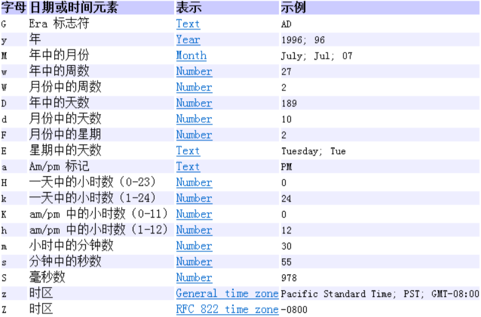
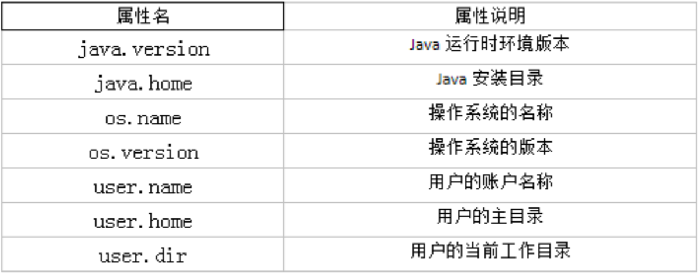

# 一、JDK8之前日期时间API 


## 1、java.lang.System类 

System类提供的`public static long currentTimeMillis()`用来返回当前时 间与1970年1月1日0时0分0秒之间以毫秒为单位的时间差。 

 ```java
//1.System类中的currentTimeMillis()
@Test
public void test1(){
    long time = System.currentTimeMillis();
    //返回当前时间与1970年1月1日0时0分0秒之间以毫秒为单位的时间差。
    //称为时间戳
    System.out.println(time);
}
 ```

## 2、java.util.Date类 

表示特定的瞬间，精确到毫秒

* 构造器

```java
Date();//使用无参构造器创建的对象可以获取本地当前时间。
Date(long date);
```

* 常用方法 

```java
getTime();//返回自 1970 年 1 月 1 日 00:00:00 GMT 以来此 Date 对象表示的毫秒数。
toString();//把此 Date 对象转换为以下形式的 String: dow mon dd hh:mm:ss zzz yyyy 其中: dow 是一周中的某一天 (Sun, Mon, Tue,Wed, Thu, Fri, Sat)，zzz是时间标准。
//其它很多方法都过时了。
```


```java
/*
    java.util.Date类
           |---java.sql.Date类

    1.两个构造器的使用
        >构造器一：Date()：创建一个对应当前时间的Date对象
        >构造器二：创建指定毫秒数的Date对象
    2.两个方法的使用
        >toString():显示当前的年、月、日、时、分、秒
        >getTime():获取当前Date对象对应的毫秒数。（时间戳）

    3. java.sql.Date对应着数据库中的日期类型的变量
        >如何实例化
        >如何将java.util.Date对象转换为java.sql.Date对象
     */
@Test
public void test2(){
    //构造器一：Date()：创建一个对应当前时间的Date对象
    Date date1 = new Date();
    System.out.println(date1.toString());//Sat Feb 16 16:35:31 GMT+08:00 2019

    System.out.println(date1.getTime());//1550306204104

    //构造器二：创建指定毫秒数的Date对象
    Date date2 = new Date(155030620410L);
    System.out.println(date2.toString());

    //创建java.sql.Date对象
    java.sql.Date date3 = new java.sql.Date(35235325345L);
    System.out.println(date3);//1971-02-13

    //情况一：
    //        Date date4 = new java.sql.Date(2343243242323L);
    //        java.sql.Date date5 = (java.sql.Date) date4;
    //如何将java.util.Date对象转换为java.sql.Date对象
    //情况二：
    Date date6 = new Date();
    java.sql.Date date7 = new java.sql.Date(date6.getTime());
}
```

## 3、java.text.SimpleDateFormat类 

* Date类的API不易于国际化，大部分被废弃了，java.text.SimpleDateFormat 类是一个==不与语言环境有关的方式来格式化和解析日期的具体类==。 

* 它允许进行格式化：日期->文本、解析：文本->日期 

* 格式化 

```java
SimpleDateFormat();//默认的模式和语言环境创建对象
public SimpleDateFormat(String pattern);//该构造方法可以用参数pattern指定的格式创建一个对象
public String format(Date date);//方法格式化时间对象date
```

* 解析 

```java
public Date parse(String source);//从给定字符串的开始解析文本，以生成一个日期。
```



```java
/*
    SimpleDateFormat的使用：SimpleDateFormat对日期Date类的格式化和解析

    1.两个操作：
    1.1 格式化：日期 --->字符串
    1.2 解析：格式化的逆过程，字符串 ---> 日期

    2.SimpleDateFormat的实例化

     */
@Test
public void testSimpleDateFormat() throws ParseException {
    //实例化SimpleDateFormat:使用默认的构造器
    SimpleDateFormat sdf = new SimpleDateFormat();

    //格式化：日期 --->字符串
    Date date = new Date();
    System.out.println(date);//Mon Nov 11 11:32:31 CST 2019

    String format = sdf.format(date);
    System.out.println(format);//19-11-11 上午11:32

    //解析：格式化的逆过程，字符串 ---> 日期
    String str = "19-12-18 上午11:43";
    Date date1 = sdf.parse(str);
    System.out.println(date1);//Wed Dec 18 11:43:00 CST 2019

    //*************按照指定的方式格式化和解析：调用带参的构造器*****************
    //        SimpleDateFormat sdf1 = new SimpleDateFormat("yyyyy.MMMMM.dd GGG hh:mm aaa");
    SimpleDateFormat sdf1 = new SimpleDateFormat("yyyy-MM-dd hh:mm:ss");
    //格式化
    String format1 = sdf1.format(date);
    System.out.println(format1);//2019-11-11 11:32:31
    //解析:要求字符串必须是符合SimpleDateFormat识别的格式(通过构造器参数体现),
    //否则，抛异常
    Date date2 = sdf1.parse("2020-02-18 11:48:27");
    System.out.println(date2);//Tue Feb 18 11:48:27 CST 2020
}
```


```java
/*
    练习一：字符串"2020-09-08"转换为java.sql.Date
     */
@Test
public void testExer() throws ParseException {
    String birth = "2020-09-08";

    SimpleDateFormat sdf1 = new SimpleDateFormat("yyyy-MM-dd");
    Date date = sdf1.parse(birth);
    System.out.println(date);//Tue Sep 08 00:00:00 CST 2020

    java.sql.Date birthDate = new java.sql.Date(date.getTime());
    System.out.println(birthDate);//2020-09-08
}
```


## 4、java.util.Calendar(日历)类

* Calendar是一个抽象基类，主用用于完成日期字段之间相互操作的功能。 


* 获取Calendar实例的方法
  * 使用`Calendar.getInstance()`方法
  * 调用它的子类`GregorianCalendar`的构造器。 

* 一个Calendar的实例是系统时间的抽象表示，通过`get(int field)`方法来取得想要的时间信息。比如YEAR、MONTH、DAY_OF_WEEK、HOUR_OF_DAY 、 MINUTE、SECOND 

```java
public void set(int field,int value);
public void add(int field,int amount);
public final Date getTime();
public final void setTime(Date date);
```

* ==注意==
  * 获取月份时：一月是0，二月是1，以此类推，12月是11 
  * 获取星期时：周日是1，周二是2 ， 。。。。周六是7 


```java
/*
    Calendar日历类(抽象类）的使用
     */
@Test
public void testCalendar(){
    //1.实例化
    //方式一：创建其子类（GregorianCalendar）的对象
    //方式二：调用其静态方法getInstance()
    Calendar calendar = Calendar.getInstance();
    System.out.println(calendar.getClass());//class java.util.GregorianCalendar

    //2.常用方法
    //get()
    int days = calendar.get(Calendar.DAY_OF_MONTH);
    System.out.println(days);//11
    System.out.println(calendar.get(Calendar.DAY_OF_YEAR));//315

    //set()
    //calendar可变性
    calendar.set(Calendar.DAY_OF_MONTH,22);
    days = calendar.get(Calendar.DAY_OF_MONTH);
    System.out.println(days);//22

    //add()
    calendar.add(Calendar.DAY_OF_MONTH,-3);
    days = calendar.get(Calendar.DAY_OF_MONTH);
    System.out.println(days);//19

    //getTime():日历类---> Date
    Date date = calendar.getTime();
    System.out.println(date);//Tue Nov 19 11:55:11 CST 2019

    //setTime():Date ---> 日历类
    Date date1 = new Date();
    calendar.setTime(date1);
    days = calendar.get(Calendar.DAY_OF_MONTH);
    System.out.println(days);//11
}
```


# 二、JDK8中新日期时间API 

## 1、新增的背景

如果我们可以跟别人说:"我们在1502643933071见面，别晚了!"那么就再简单不过了。但是我们希望时间与昼夜和四季有关，于是事情就变复杂了。JDK 1.0中包含了 一个java.util.Date类，但是它的大多数方法已经在JDK 1.1引入Calendar类之后被弃用 了。而Calendar并不比Date好多少。它们面临的问题是: 

* 可变性：像日期和时间这样的类应该是不可变的。 

* 偏移性：Date中的年份是从1900开始的，而月份都从0开始。 

* 格式化：格式化只对Date有用，Calendar则不行。 

* 此外，它们也不是线程安全的;不能处理闰秒等。 

总结:对日期和时间的操作一直是Java程序员最痛苦的地方之一。 

```java
@Test
public void testDate(){
    //偏移量
    Date date1 = new Date(2020 - 1900,9 - 1,8);
    System.out.println(date1);//Tue Sep 08 00:00:00 GMT+08:00 2020
}
```

## 2、新时间日期API 

* 第三次引入的API是成功的，并且Java 8中引入的java.time API 已经纠正了过去的缺陷，将来很长一段时间内它都会为我们服务。 
* Java 8 吸收了 Joda-Time 的精华，以一个新的开始为 Java 创建优秀的 API。 新的 java.time 中包含了所有关于==本地日期(LocalDate)、本地时间 (LocalTime)、本地日期时间(LocalDateTime)、时区(ZonedDateTime) 和持续时间(Duration)的类==。历史悠久的 Date 类新增了 `toInstant()` 方法， 用于把 Date 转换成新的表示形式。这些新增的本地化时间日期 API 大大简 化了日期时间和本地化的管理。 

```java
java.time – 包含值对象的基础包 
java.time.chrono – 提供对不同的日历系统的访问 
java.time.format – 格式化和解析时间和日期 
java.time.temporal – 包括底层框架和扩展特性 
java.time.zone – 包含时区支持的类
```

说明：大多数开发者只会用到基础包和format包，也可能会用到temporal包。因此，尽管有68个新的公开类型，大多数开发者，大概将只会用到其中的三分之一。 

## 3、LocalDate、LocalTime、LocalDateTime

* LocalDate、LocalTime、LocalDateTime 类是其中较重要的几个类，它们的实例是==不可变的对象==，分别表示使用 ISO-8601日历系统的日期、时间、日期和时间。 它们提供了==简单的本地日期或时间==，并不包含当前的时间信息，也不包含与时区相关的信息。 
  * LocalDate代表IOS格式(yyyy-MM-dd)的日期,可以存储 生日、纪念日等日期。
  * LocalTime表示一个时间，而不是日期。
  * LocalDateTime是用来表示日期和时间的，这是一个==最常用的类之一==。 

注：ISO-8601日历系统是国际标准化组织制定的现代公民的日期和时间的表示法，也就是公历。 

### [1]、常用方法

| 方法                                                         | 描述                                                         |
| ------------------------------------------------------------ | ------------------------------------------------------------ |
| now() / * now(ZoneId zone)                                   | 静态方法，根据当前时间创建对象/指定时区的对象                |
| of()                                                         | 静态方法，根据指定日期/时间创建对象                          |
| getDayOfMonth()/getDayOfYear()                               | 获得月份天数(1-31) /获得年份天数(1-366)                      |
| getDayOfWeek()                                               | 获得星期几(返回一个 DayOfWeek 枚举值)                        |
| getMonth()                                                   | 获得月份, 返回一个 Month 枚举值                              |
| getMonthValue() / getYear()                                  | 获得月份(1-12) /获得年份                                     |
| getHour()/getMinute()/getSecond()                            | 获得当前对象对应的小时、分钟、秒                             |
| withDayOfMonth()/withDayOfYear()/ withMonth()/withYear()     | 将月份天数、年份天数、月份、年份修改为指定的值并返回新的对象 |
| plusDays(), plusWeeks(), plusMonths(), plusYears(),plusHours() | 向当前对象添加几天、几周、几个月、几年、几小时               |
| minusMonths() / minusWeeks()/ minusDays()/minusYears()/minusHours() | 从当前对象减去几月、几周、几天、几年、几小时                 |

### [2]、相关案例

```java
/*
    LocalDate、LocalTime、LocalDateTime 的使用
    说明：
        1.LocalDateTime相较于LocalDate、LocalTime，使用频率要高
        2.类似于Calendar
     */
@Test
public void test1(){
    //now():获取当前的日期、时间、日期+时间
    LocalDate localDate = LocalDate.now();
    LocalTime localTime = LocalTime.now();
    LocalDateTime localDateTime = LocalDateTime.now();

    System.out.println(localDate);//2019-11-11
    System.out.println(localTime);//16:14:05.228
    System.out.println(localDateTime);//2019-11-11T16:14:05.228

    //of():设置指定的年、月、日、时、分、秒。没有偏移量
    LocalDateTime localDateTime1 = LocalDateTime.of(2020, 10, 6, 13, 23, 43);
    System.out.println(localDateTime1);//2020-10-06T13:23:43


    //getXxx()：获取相关的属性
    System.out.println(localDateTime.getDayOfMonth());//11
    System.out.println(localDateTime.getDayOfWeek());//MONDAY
    System.out.println(localDateTime.getMonth());//NOVEMBER
    System.out.println(localDateTime.getMonthValue());//11
    System.out.println(localDateTime.getMinute());//14

    //体现不可变性
    //withXxx():设置相关的属性
    LocalDate localDate1 = localDate.withDayOfMonth(22);
    System.out.println(localDate);//2019-11-11
    System.out.println(localDate1);//2019-11-22


    LocalDateTime localDateTime2 = localDateTime.withHour(4);
    System.out.println(localDateTime);//2019-11-11T16:14:05.228
    System.out.println(localDateTime2);//2019-11-11T04:14:05.228

    //不可变性
    LocalDateTime localDateTime3 = localDateTime.plusMonths(3);
    System.out.println(localDateTime);//2019-11-11T16:14:05.228
    System.out.println(localDateTime3);//2020-02-11T16:14:05.228

    LocalDateTime localDateTime4 = localDateTime.minusDays(6);
    System.out.println(localDateTime);//2019-11-11T16:14:05.228
    System.out.println(localDateTime4);//2019-11-05T16:14:05.228
}
```

## 4、瞬时：Instant

* Instant：时间线上的一个瞬时点。 这可能被用来记录应用程序中的事件时间戳。
* 在处理时间和日期的时候，我们通常会想到年,月,日,时,分,秒。然而，这只是 时间的一个模型，是面向人类的。第二种通用模型是面向机器的，或者说是连续的。在此模型中，时间线中的一个点表示为一个很大的数，这有利于计算机处理。==在UNIX中，这个数从1970年开始，以秒为的单位;同样的，在Java中， 也是从1970年开始，但以毫秒为单位。==  
* `java.time`==包通过值类型Instant提供机器视图，不提供处理人类意义上的时间单位==。Instant表示时间线上的一点，而不需要任何上下文信息，例如，时区。 概念上讲，==它只是简单的表示自1970年1月1日0时0分0秒(UTC)开始的秒数==。因为java.time包是基于纳秒计算的，所以Instant的精度可以达到纳秒级。 
* (1 ns = 10-9 s) 1秒 = 1000毫秒 =10^6^微秒=10^9^纳秒 

### [1]、常用方法

| 方法                          | 描述                                                         |
| ----------------------------- | ------------------------------------------------------------ |
| now()                         | 静态方法，返回默认UTC时区的Instant类的对象                   |
| ofEpochMilli(long epochMilli) | 静态方法，返回在1970-01-01 00:00:00基础上加上指定毫秒 数之后的Instant类的对象 |
| atOffset(ZoneOffset offset)   | 结合即时的偏移来创建一个 OffsetDateTime                      |
| toEpochMilli()                | 返回1970-01-01 00:00:00到当前时间的毫秒数，即为时间戳        |

时间戳是指格林威治时间1970年01月01日00时00分00秒(北京时间1970年01月01 日08时00分00秒)起至现在的总秒数。 

### [2]、相关案例

```java
/*
    Instant的使用
    类似于 java.util.Date类
     */
@Test
public void test2(){
    //now():获取本初子午线对应的标准时间
    Instant instant = Instant.now();
    System.out.println(instant);//2019-11-11T09:02:15.425Z

    //添加时间的偏移量
    OffsetDateTime offsetDateTime = instant.atOffset(ZoneOffset.ofHours(8));
    System.out.println(offsetDateTime);//2019-11-11T17:02:15.425+08:00

    //toEpochMilli():获取自1970年1月1日0时0分0秒（UTC）开始的毫秒数  ---> Date类的getTime()
    long milli = instant.toEpochMilli();
    System.out.println(milli);//1573462935425

    //ofEpochMilli():通过给定的毫秒数，获取Instant实例  -->Date(long millis)
    Instant instant1 = Instant.ofEpochMilli(1573462935425L);
    System.out.println(instant1);//2019-11-11T09:02:15.425Z
}
```


## 5、格式化与解析日期或时间 

`java.time.format.DateTimeFormatter` 类：该类提供了三种格式化方法: 

* 预定义的标准格式。如： ISO_LOCAL_DATE_TIME;ISO_LOCAL_DATE;ISO_LOCAL_TIME 
* 本地化相关的格式。如：`ofLocalizedDateTime(FormatStyle.LONG) `
* ==自定义的格式。如：==`ofPattern("yyyy-MM-dd hh:mm:ss") `

### [1]、常用方法

| 方法                       | 描述                                                 |
| -------------------------- | ---------------------------------------------------- |
| ofPattern(String pattern)  | 静态方法，返回一个指定字符串格式的 DateTimeFormatter |
| format(TemporalAccessor t) | 格式化一个日期、时间，返回字符串                     |
| parse(CharSequence text)   | 将指定格式的字符序列解析为一个日期、时间             |

### [2]、相关案例

```java
/*
    DateTimeFormatter:格式化或解析日期、时间
    类似于SimpleDateFormat
     */
@Test
public void test3(){
    //方式一：预定义的标准格式。如：ISO_LOCAL_DATE_TIME;ISO_LOCAL_DATE;ISO_LOCAL_TIME
    DateTimeFormatter formatter = DateTimeFormatter.ISO_LOCAL_DATE_TIME;
    //格式化:日期-->字符串
    LocalDateTime localDateTime = LocalDateTime.now();
    String str1 = formatter.format(localDateTime);
    System.out.println(localDateTime);//2019-11-11T17:13:54.782
    System.out.println(str1);//2019-11-11T17:13:54.782

    //解析：字符串 -->日期
    TemporalAccessor parse = formatter.parse("2019-11-11T17:13:54.782");
    System.out.println(parse);//{},ISO resolved to 2019-11-11T17:13:54.782

    //方式二：
    //本地化相关的格式。如：ofLocalizedDateTime()
    //FormatStyle.LONG / FormatStyle.MEDIUM / FormatStyle.SHORT :适用于LocalDateTime
    DateTimeFormatter formatter1 = DateTimeFormatter.ofLocalizedDateTime(FormatStyle.LONG);
    //格式化
    String str2 = formatter1.format(localDateTime);
    System.out.println(str2);//2019年11月11日 下午05时14分38秒


    //本地化相关的格式。如：ofLocalizedDate()
    //FormatStyle.FULL / FormatStyle.LONG / FormatStyle.MEDIUM / FormatStyle.SHORT : 适用于LocalDate
    DateTimeFormatter formatter2 = DateTimeFormatter.ofLocalizedDate(FormatStyle.MEDIUM);
    //格式化
    String str3 = formatter2.format(LocalDate.now());
    System.out.println(str3);//2019-11-11


    //重点： 方式三：自定义的格式。如：ofPattern(“yyyy-MM-dd hh:mm:ss”)
    DateTimeFormatter formatter3 = DateTimeFormatter.ofPattern("yyyy-MM-dd hh:mm:ss");
    //格式化
    String str4 = formatter3.format(LocalDateTime.now());
    System.out.println(str4);//2019-11-11 05:14:38

    //解析
    TemporalAccessor accessor = formatter3.parse("2019-11-11 05:14:38");
    System.out.println(accessor);//{MilliOfSecond=0, MinuteOfHour=14, MicroOfSecond=0, SecondOfMinute=38, HourOfAmPm=5, NanoOfSecond=0},ISO resolved to 2019-11-11
}
```


## 6、其它API 

 ZoneId：该类中包含了所有的时区信息，一个时区的ID，如 Europe/Paris

ZonedDateTime：一个在ISO-8601日历系统时区的日期时间，如 2007-12-03T10:15:30+01:00 Europe/Paris。
 								其中每个时区都对应着ID，地区ID都为"{区域}/{城市}"的格式，例如: Asia/Shanghai等 

Clock：使用时区提供对当前即时、日期和时间的访问的时钟。 

Duration：持续时间，用于计算两个"时间"间隔。

Period：日期间隔，用于计算两个"日期"间隔。

TemporalAdjuster：时间校正器。有时我们可能需要获取例如：将日期调整到"下一个工作日"等操作。

TemporalAdjusters：该类通过静态方法 (`firstDayOfXxx()/lastDayOfXxx()/nextXxx()`)提供了大量的常用 TemporalAdjuster 的实现。 


```java
//ZoneId:类中包含了所有的时区信息
// ZoneId的getAvailableZoneIds():获取所有的ZoneId 
Set<String> zoneIds = ZoneId.getAvailableZoneIds(); 
for (String s : zoneIds) {
	System.out.println(s); //Asia/Aden America/Cuiaba Etc/GMT+9 ...
}
// ZoneId的of():获取指定时区的时间
LocalDateTime localDateTime = LocalDateTime.now(ZoneId.of("Asia/Tokyo")); System.out.println(localDateTime);///2019-11-11T21:40:26.503

//ZonedDateTime:带时区的日期时间
//ZonedDateTime的now():获取本时区的ZonedDateTime对象
ZonedDateTime zonedDateTime = ZonedDateTime.now(); 
System.out.println(zonedDateTime);//2019-11-11T20:40:27.039+08:00[Asia/Shanghai]
//ZonedDateTime的now(ZoneId id):获取指定时区的ZonedDateTime对象 
ZonedDateTime zonedDateTime1 = ZonedDateTime.now(ZoneId.of("Asia/Tokyo")); System.out.println(zonedDateTime1);//2019-11-11T21:40:27.040+09:00[Asia/Tokyo]
```


```java
//Duration:用于计算两个“时间”间隔，以秒和纳秒为基准
LocalTime localTime = LocalTime.now();
LocalTime localTime1 = LocalTime.of(15, 23, 32); 
//between():静态方法，返回Duration对象，表示两个时间的间隔 
Duration duration = Duration.between(localTime1, localTime); 
System.out.println(duration);////PT5H40M36.5S

System.out.println(duration.getSeconds()); //20436
System.out.println(duration.getNano());//500000000

LocalDateTime localDateTime = LocalDateTime.of(2016, 6, 12, 15, 23, 32); 
LocalDateTime localDateTime1 = LocalDateTime.of(2017, 6, 12, 15, 23, 32);

Duration duration1 = Duration.between(localDateTime1, localDateTime); System.out.println(duration1.toDays());//-365
```


```java
//Period:用于计算两个“日期”间隔，以年、月、日衡量 
LocalDate localDate = LocalDate.now();
LocalDate localDate1 = LocalDate.of(2028, 3, 18);

Period period = Period.between(localDate, localDate1); 
System.out.println(period);//P8Y4M7D

System.out.println(period.getYears()); //8
System.out.println(period.getMonths());//4 
System.out.println(period.getDays());//7

Period period1 = period.withYears(2); 
System.out.println(period1);//P2Y4M7D
```


```java
// TemporalAdjuster:时间校正器
// 获取当前日期的下一个周日是哪天?
TemporalAdjuster temporalAdjuster = TemporalAdjusters.next(DayOfWeek.SUNDAY); 
LocalDateTime localDateTime = LocalDateTime.now().with(temporalAdjuster); 
System.out.println(localDateTime);
// 获取下一个工作日是哪天?
LocalDate localDate = LocalDate.now().with(new TemporalAdjuster() {
    @Override
    public Temporal adjustInto(Temporal temporal) {
        LocalDate date = (LocalDate) temporal;
    	if (date.getDayOfWeek().equals(DayOfWeek.FRIDAY)) {
            return date.plusDays(3);
    	}  else if (date.getDayOfWeek().equals(DayOfWeek.SATURDAY)) {
    		return date.plusDays(2); 
        } else {
    		return date.plusDays(1); 
        }
        }
});
System.out.println("下一个工作日是:" + localDate);
```

## 7、与传统日期处理的转换 

| 类                                                        | To 遗留类                             | From 遗留类                 |
| --------------------------------------------------------- | ------------------------------------- | --------------------------- |
| java.time.Instant与java.util.Date                         | Date.from(instant)                    | date.toInstant()            |
| java.time.Instant与java.sql.Timestamp                     | Timestamp.from(instant)               | timestamp.toInstant()       |
| java.time.ZonedDateTime与 java.util.GregorianCalendar     | GregorianCalendar.from(zonedDateTime) | cal.toZonedDateTime()       |
| java.time.LocalDate与java.sql.Time                        | Date.valueOf(localDate)               | date.toLocalDate()          |
| java.time.LocalTime与java.sql.Time                        | Date.valueOf(localDate)               | date.toLocalTime()          |
| java.time.LocalDateTime与 java.sql.Timestamp              | Timestamp.valueOf(localDateTime)      | timestamp.toLocalDateTime() |
| java.time.ZoneId与java.util.TimeZone                      | Timezone.getTimeZone(id)              | timeZone.toZoneId()         |
| java.time.format.DateTimeFormatter与 java.text.DateFormat | formatter.toFormat()                  | 无                          |


# 三、Java比较器 

* 在Java中经常会涉及到对象数组的排序问题，那么就涉及到对象之间的比较问题。
* Java实现对象排序的方式有两种：
  * 自然排序：java.lang.Comparable 
  * 定制排序：java.util.Comparator  

## 1、方式一：自然排序

==java.lang.Comparable== 

* Comparable接口强行对实现它的每个类的对象进行整体排序。这种排序被称为类的自然排序。 
* 实现 Comparable 的类必须实现 `compareTo(Object obj)` 方法，两个对象即通过 `compareTo(Object obj)` 方法的返回值来比较大小。==如果当前对象this大于形参对象obj，则返回正整数，如果当前对象this小于形参对象obj，则返回负整数，如果当前对象this等于形参对象obj，则返回零。== 
* 实现Comparable接口的对象列表(和数组)可以通过 `Collections.sort` 或 `Arrays.sort`进行自动排序。实现此接口的对象可以用作有序映射中的键或有序集合中的元素，无需指定比较器。 
* 对于类 C 的每一个 e1 和 e2 来说，当且仅当 e1.compareTo(e2) == 0 与 e1.equals(e2) 具有相同的 boolean 值时，类 C 的自然排序才叫做与 equals 一致。建议(虽然不是必需的)==最好使自然排序与 equals 一致==。 

* Comparable 的典型实现:(==默认都是从小到大排列的==) 
  * String:按照字符串中字符的Unicode值进行比较 
  * Character：按照字符的Unicode值来进行比较 
  * 数值类型对应的包装类以及BigInteger、BigDecimal:按照它们对应的数值大小进行比较 
  * Boolean：true 对应的包装类实例大于 false 对应的包装类实例 
  * Date、Time等：后面的日期时间比前面的日期时间大 


```java
/*
    Comparable接口的使用举例：  自然排序
    1.像String、包装类等实现了Comparable接口，重写了compareTo(obj)方法，给出了比较两个对象大小的方式。
    2.像String、包装类重写compareTo()方法以后，进行了从小到大的排列
    3. 重写compareTo(obj)的规则：
        如果当前对象this大于形参对象obj，则返回正整数，
        如果当前对象this小于形参对象obj，则返回负整数，
        如果当前对象this等于形参对象obj，则返回零。
    4. 对于自定义类来说，如果需要排序，我们可以让自定义类实现Comparable接口，重写compareTo(obj)方法。
       在compareTo(obj)方法中指明如何排序
     */
@Test
public void test1(){
    String[] arr = new String[]{"AA","CC","KK","MM","GG","JJ","DD"};
    Arrays.sort(arr);
    System.out.println(Arrays.toString(arr));//[AA, CC, DD, GG, JJ, KK, MM]
}
```


```java
class Goods implements Comparable {
    private String name;
    private double price;
	//按照价格，比较商品的大小 
    @Override
	public int compareTo(Object o) {
		if(o instanceof Goods) {
		Goods other = (Goods) o;
        if (this.price > other.price) {
            return 1;
        } else if (this.price < other.price) {
            return -1; 
        }
            return 0; 
        }
		throw new RuntimeException("输入的数据类型不一致"); 
    }
	//构造器、getter、setter、toString()方法略 
}

...

@Test
public void test2(){
    Goods[] arr = new Goods[3];
    arr[0] = new Goods("lenovoMouse",34);
    arr[1] = new Goods("dellMouse",43);
    arr[2] = new Goods("xiaomiMouse",12);

    Arrays.sort(arr);
	System.out.println(Arrays.toString(arr));//[Goods{name='xiaomiMouse', price=12.0}, Goods{name='lenovoMouse', price=34.0}, Goods{name='dellMouse', price=43.0}]
}

```

## 2、方式二：定制排序 

==java.util.Comparator== 

* ==当元素的类型没有实现`java.lang.Comparable`接口而又不方便修改代码， 或者实现了`java.lang.Comparable`接口的排序规则不适合当前的操作，那 么可以考虑使用 Comparator 的对象来排序==，强行对多个对象进行整体排序的比较。 
* 重写`compare(Object o1,Object o2)`方法，比较o1和o2的大小：==如果方法返回正整数，则表示o1大于o2;如果返回0，表示相等;返回负整数，表示o1小于o2。== 
* 可以将 Comparator 传递给 sort 方法(如 `Collections.sort` 或 `Arrays.sort`)， 从而允许在排序顺序上实现精确控制 。
* 还可以使用 Comparator 来控制某些数据结构(如有序 set或有序映射)的顺序，或者为那些没有自然顺序的对象 collection 提供排序。 


```java
@Test
public void test4(){
    Goods[] arr = new Goods[4];
    arr[0] = new Goods("lenovoMouse",34);
    arr[1] = new Goods("dellMouse",43);
    arr[2] = new Goods("huaweiMouse",65);
    arr[3] = new Goods("huaweiMouse",224);

    Arrays.sort(arr, new Comparator() {
        //指明商品比较大小的方式:按照产品名称从低到高排序,再按照价格从高到低排序
        @Override
        public int compare(Object o1, Object o2) {
            if(o1 instanceof Goods && o2 instanceof Goods){
                Goods g1 = (Goods)o1;
                Goods g2 = (Goods)o2;
                if(g1.getName().equals(g2.getName())){
                    return -Double.compare(g1.getPrice(),g2.getPrice());
                }else{
                    return g1.getName().compareTo(g2.getName());
                }
            }
            throw new RuntimeException("输入的数据类型不一致");
        }
    });

    System.out.println(Arrays.toString(arr));//[Goods{name='dellMouse', price=43.0}, Goods{name='huaweiMouse', price=224.0}, Goods{name='huaweiMouse', price=65.0}, Goods{name='lenovoMouse', price=34.0}]
}
```


# 四、System类 

* System类代表系统，系统级的很多属性和控制方法都放置在该类的内部。 该类位于java.lang包。 
* 由于该类的构造器是private的，所以无法创建该类的对象，也就是无法实例化该类。其内部的成员变量和成员方法都是static的，所以也可以很方便的进行调用。 
* 成员变量
  * System类内部包含in、out和err三个成员变量，分别代表标准输入流(键盘输入)，标准输出流(显示器)和标准错误输出流(显示器)。 
* 成员方法 

```java
native long currentTimeMillis();//该方法的作用是返回当前的计算机时间，时间的表达格式为当前计算机时 间和GMT时间(格林威治时间)1970年1月1号0时0分0秒所差的毫秒数。
void exit(int status);//该方法的作用是退出程序。其中status的值为0代表正常退出，非零代表异常退出。使用该方法可以在图形界面编程中实现程序的退出功能等。
void gc();//该方法的作用是请求系统进行垃圾回收。至于系统是否立刻回收，则 取决于系统中垃圾回收算法的实现以及系统执行时的情况。
String getProperty(String key);//该方法的作用是获得系统中属性名为key的属性对应的值。系统中常见的属性名以及属性的作用如下表所示:
```

 


```java
@Test
public void test1() {
    String javaVersion = System.getProperty("java.version");
    System.out.println("java的version:" + javaVersion);//java的version:1.8.0_221

    String javaHome = System.getProperty("java.home");
    System.out.println("java的home:" + javaHome);//java的home:/Library/Java/JavaVirtualMachines/jdk1.8.0_221.jdk/Contents/Home/jre

    String osName = System.getProperty("os.name");
    System.out.println("os的name:" + osName);//os的name:Mac OS X

    String osVersion = System.getProperty("os.version");
    System.out.println("os的version:" + osVersion);//os的version:10.14.6

    String userName = System.getProperty("user.name");
    System.out.println("user的name:" + userName);//user的name:dulinlong

    String userHome = System.getProperty("user.home");
    System.out.println("user的home:" + userHome);//user的home:/Users/dulinlong

    String userDir = System.getProperty("user.dir");
    System.out.println("user的dir:" + userDir);//user的dir:/Users/dulinlong/eclipse-workspace/JavaSenior/day04
}
```


# 五、Math类 

java.lang.Math提供了一系列静态方法用于科学计算。其方法的参数和返回值类型一般为double型。 

| 方法名                                        | 作用                                |
| --------------------------------------------- | ----------------------------------- |
| abs                                           | 绝对值                              |
| acos,asin,atan,cos,sin,tan                    | 三角函数                            |
| sqrt                                          | 平方根                              |
| pow(double a,doble b)                         | a的b次幂                            |
| log                                           | 自然对数                            |
| exp                                           | e为底指数                           |
| max(double a,double b),min(double a,double b) | 最大最小                            |
| random()                                      | 返回0.0到1.0的随机数                |
| long round(double a)                          | double型数据a转换为long型(四舍五入) |
| toDegrees(double angrad)                      | 弧度—>角度                          |
| toRadians(double angdeg)                      | 角度—>弧度                          |

# 六、BigInteger与BigDecimal 

## 1、BigInteger类 

* Integer类作为int的包装类，能存储的最大整型值为2^31^-1，Long类也是有限的， 最大为2^63^-1。如果要表示再大的整数，不管是基本数据类型还是他们的包装类都无能为力，更不用说进行运算了。 
*  java.math包的==BigInteger可以表示不可变的任意精度的整数==。BigInteger 提供所有 Java 的基本整数操作符的对应物，并提供 `java.lang.Math` 的所有相关方法。 另外，BigInteger 还提供以下运算：模算术、GCD 计算、质数测试、素数生成、 位操作以及一些其他操作。 

* 构造器

```java
BigInteger(String val);//根据字符串构建BigInteger对象
```

* 常用方法 

```java
public BigInteger abs();//返回此 BigInteger 的绝对值的 BigInteger
BigInteger add(BigInteger val);//返回其值为 (this + val) 的 BigInteger
BigInteger subtract(BigInteger val);//返回其值为 (this - val) 的 BigInteger
BigInteger multiply(BigInteger val);//返回其值为 (this * val) 的 BigInteger
BigInteger divide(BigInteger val);//返回其值为 (this / val) 的 BigInteger。整数相除只保留整数部分。
BigInteger remainder(BigInteger val);//返回其值为 (this % val) 的 BigInteger。
BigInteger[] divideAndRemainder(BigInteger val);//返回包含 (this / val) 后跟(this % val) 的两个 BigInteger 的数组。
BigInteger pow(int exponent);//返回其值为 (this的exponent幂) 的 BigInteger。
```


## 2、BigDecimal类 

* 一般的Float类和Double类可以用来做科学计算或工程计算，但在商业计算中， 要求数字精度比较高，故用到`java.math.BigDecimal`类。 
* BigDecimal类支持不可变的、任意精度的有符号十进制定点数。 
* 构造器 

```java
public BigDecimal(double val);
public BigDecimal(String val);
```

* 常用方法

```java
public BigDecimal add(BigDecimal augend);
public BigDecimal subtract(BigDecimal subtrahend);
public BigDecimal multiply(BigDecimal multiplicand);
public BigDecimal divide(BigDecimal divisor, int scale, int roundingMode);
```


```java
@Test
public void test2() {
    BigInteger bi = new BigInteger("1243324112234324324325235245346567657653");
    BigDecimal bd = new BigDecimal("12435.351");
    BigDecimal bd2 = new BigDecimal("11");
    System.out.println(bi);//1243324112234324324325235245346567657653
    //        System.out.println(bd.divide(bd2));//能除尽还行，不能除尽就需要指定小数需求
    System.out.println(bd.divide(bd2, BigDecimal.ROUND_HALF_UP));//1130.486
    System.out.println(bd.divide(bd2, 15, BigDecimal.ROUND_HALF_UP));//1130.486454545454545
}
```

