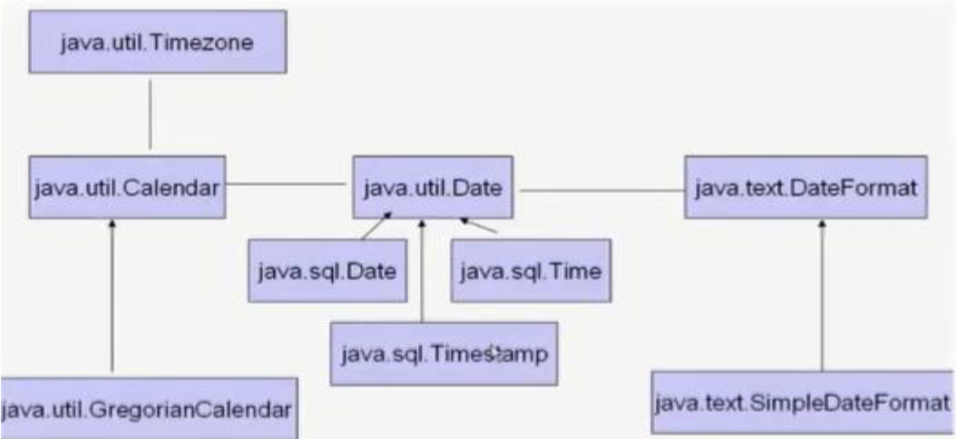
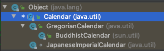

# 一、JDK8之前日期时间API 




## 1、java.lang.System类 

System类提供的`public static long currentTimeMillis()`用来返回当前时 间与1970年1月1日0时0分0秒之间以毫秒为单位的时间差。 

 ```java
//1.System类中的currentTimeMillis()
@Test
public void test1(){
    long time = System.currentTimeMillis();
    //返回当前时间与1970年1月1日0时0分0秒之间以毫秒为单位的时间差。
    //称为时间戳
    System.out.println(time);
}
 ```

## 2、java.util.Date类 

表示特定的瞬间，精确到毫秒

* 构造器

```java
Date();//使用无参构造器创建的对象可以获取本地当前时间。
Date(long date);
```

* 常用方法 

```java
getTime();//返回自 1970 年 1 月 1 日 00:00:00 GMT 以来此 Date 对象表示的毫秒数。
toString();//把此 Date 对象转换为以下形式的 String: dow mon dd hh:mm:ss zzz yyyy 其中: dow 是一周中的某一天 (Sun, Mon, Tue,Wed, Thu, Fri, Sat)，zzz是时间标准。
//其它很多方法都过时了。
```


```java
/*
    java.util.Date类
           |---java.sql.Date类

    1.两个构造器的使用
        >构造器一：Date()：创建一个对应当前时间的Date对象
        >构造器二：创建指定毫秒数的Date对象
    2.两个方法的使用
        >toString():显示当前的年、月、日、时、分、秒
        >getTime():获取当前Date对象对应的毫秒数。（时间戳）

    3. java.sql.Date对应着数据库中的日期类型的变量
        >如何实例化
        >如何将java.util.Date对象转换为java.sql.Date对象
     */
@Test
public void test2(){
    //构造器一：Date()：创建一个对应当前时间的Date对象
    Date date1 = new Date();
    System.out.println(date1.toString());//Sat Feb 16 16:35:31 GMT+08:00 2019

    System.out.println(date1.getTime());//1550306204104

    //构造器二：创建指定毫秒数的Date对象
    Date date2 = new Date(155030620410L);
    System.out.println(date2.toString());

    //创建java.sql.Date对象
    java.sql.Date date3 = new java.sql.Date(35235325345L);
    System.out.println(date3);//1971-02-13

    //情况一：
    //        Date date4 = new java.sql.Date(2343243242323L);
    //        java.sql.Date date5 = (java.sql.Date) date4;
    //如何将java.util.Date对象转换为java.sql.Date对象
    //情况二：
    Date date6 = new Date();
    java.sql.Date date7 = new java.sql.Date(date6.getTime());
}
```

## 3、java.text.SimpleDateFormat类 

* Date类的API不易于国际化，大部分被废弃了，java.text.SimpleDateFormat 类是一个不与语言环境有关的方式来格式化和解析日期的具体类。 

* 它允许进行格式化：日期->文本、解析：文本->日期 

* 格式化 

```java
SimpleDateFormat();//默认的模式和语言环境创建对象
public SimpleDateFormat(String pattern);//该构造方法可以用参数pattern指定的格式创建一个对象
public String format(Date date);//方法格式化时间对象date
```

* 解析 

```java
public Date parse(String source);//从给定字符串的开始解析文本，以生成一个日期。
```


```java
/*
    SimpleDateFormat的使用：SimpleDateFormat对日期Date类的格式化和解析

    1.两个操作：
    1.1 格式化：日期 --->字符串
    1.2 解析：格式化的逆过程，字符串 ---> 日期

    2.SimpleDateFormat的实例化

     */
@Test
public void testSimpleDateFormat() throws ParseException {
    //实例化SimpleDateFormat:使用默认的构造器
    SimpleDateFormat sdf = new SimpleDateFormat();

    //格式化：日期 --->字符串
    Date date = new Date();
    System.out.println(date);//Mon Nov 11 11:32:31 CST 2019

    String format = sdf.format(date);
    System.out.println(format);//19-11-11 上午11:32

    //解析：格式化的逆过程，字符串 ---> 日期
    String str = "19-12-18 上午11:43";
    Date date1 = sdf.parse(str);
    System.out.println(date1);//Wed Dec 18 11:43:00 CST 2019

    //*************按照指定的方式格式化和解析：调用带参的构造器*****************
    //        SimpleDateFormat sdf1 = new SimpleDateFormat("yyyyy.MMMMM.dd GGG hh:mm aaa");
    SimpleDateFormat sdf1 = new SimpleDateFormat("yyyy-MM-dd hh:mm:ss");
    //格式化
    String format1 = sdf1.format(date);
    System.out.println(format1);//2019-11-11 11:32:31
    //解析:要求字符串必须是符合SimpleDateFormat识别的格式(通过构造器参数体现),
    //否则，抛异常
    Date date2 = sdf1.parse("2020-02-18 11:48:27");
    System.out.println(date2);//Tue Feb 18 11:48:27 CST 2020
}
```


```java
/*
    练习一：字符串"2020-09-08"转换为java.sql.Date
     */
@Test
public void testExer() throws ParseException {
    String birth = "2020-09-08";

    SimpleDateFormat sdf1 = new SimpleDateFormat("yyyy-MM-dd");
    Date date = sdf1.parse(birth);
    System.out.println(date);//Tue Sep 08 00:00:00 CST 2020

    java.sql.Date birthDate = new java.sql.Date(date.getTime());
    System.out.println(birthDate);//2020-09-08
}
```


## 4、java.util.Calendar(日历)类

* Calendar是一个抽象基类，主用用于完成日期字段之间相互操作的功能。 



* 获取Calendar实例的方法
  * 使用`Calendar.getInstance()`方法
  * 调用它的子类`GregorianCalendar`的构造器。 

* 一个Calendar的实例是系统时间的抽象表示，通过`get(int field)`方法来取得想要的时间信息。比如YEAR、MONTH、DAY_OF_WEEK、HOUR_OF_DAY 、 MINUTE、SECOND 

```java
public void set(int field,int value);
public void add(int field,int amount);
public final Date getTime();
public final void setTime(Date date);
```

* 注意
  * 获取月份时：一月是0，二月是1，以此类推，12月是11 
  * 获取星期时：周日是1，周二是2 ， 。。。。周六是7 


```java
/*
    Calendar日历类(抽象类）的使用
     */
@Test
public void testCalendar(){
    //1.实例化
    //方式一：创建其子类（GregorianCalendar）的对象
    //方式二：调用其静态方法getInstance()
    Calendar calendar = Calendar.getInstance();
    System.out.println(calendar.getClass());//class java.util.GregorianCalendar

    //2.常用方法
    //get()
    int days = calendar.get(Calendar.DAY_OF_MONTH);
    System.out.println(days);//11
    System.out.println(calendar.get(Calendar.DAY_OF_YEAR));//315

    //set()
    //calendar可变性
    calendar.set(Calendar.DAY_OF_MONTH,22);
    days = calendar.get(Calendar.DAY_OF_MONTH);
    System.out.println(days);//22

    //add()
    calendar.add(Calendar.DAY_OF_MONTH,-3);
    days = calendar.get(Calendar.DAY_OF_MONTH);
    System.out.println(days);//19

    //getTime():日历类---> Date
    Date date = calendar.getTime();
    System.out.println(date);//Tue Nov 19 11:55:11 CST 2019

    //setTime():Date ---> 日历类
    Date date1 = new Date();
    calendar.setTime(date1);
    days = calendar.get(Calendar.DAY_OF_MONTH);
    System.out.println(days);//11
}
```


# 二、JDK8中新日期时间API 