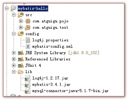
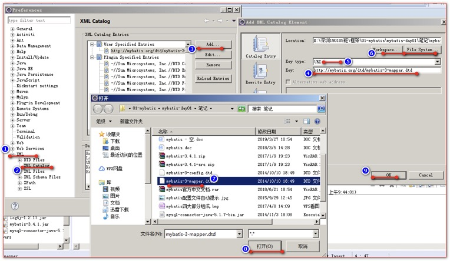

[TOC]

# 一、概述

## 1、MyBatis简介

* MyBatis 是支持定制化 SQL、存储过程以及高级映射的优秀的持久层框架
* MyBatis 避免了几乎所有的 JDBC 代码和手动设置参数以及获取结果集
* MyBatis 可以使用简单的 XML 或注解用于配置和原始映射，将接口和 Java 的 POJO（Plain Old Java Objects，普通的Java对象）映射成数据库中的记录

## 2、MyBatis历史

原是 apache 的一个开源项目 iBatis, 2010年6月这个项目由 apache software foundation 迁移到了google code，随着开发团队转投 Google Code 旗下，ibatis3.x 正式更名为Mybatis ，代码于2013年11月迁移到Github（下载地址见后）。

iBATIS 一词来源于"internet"和"abatis"的组合，是一个基于 Java 的持久层框架。iBATIS 提供的持久层框架包括SQL Maps 和 Data Access Objects（DAO）

## 3、为什么要使用MyBatis

MyBatis 是一个半自动化的持久化层框架

jdbc编程 --- 当我们使用 jdbc 持久化的时候，sql 语句被硬编码到 java 代码中。这样耦合度太高。代码不易于维护。在实际项目开发中会经常添加 sql 或者修改 sql，这样我们就只能到 java 代码中去修改

Hibernate 和 JPA：

​	长难复杂 SQL，对于 Hibernate 而言处理也不容易。

​	内部自动生产的 SQL，不容易做特殊优化。

​	基于全映射的全自动框架，javaBean 存在大量字段时无法只映射部分字段。导致数据库性能下降。

对开发人员而言，核心sql还是需要自己优化

sql 和 java 编码分开，功能边界清晰，一个专注业务、一个专注数据。

可以使用简单的 XML 或注解用于配置和原始映射，将接口和 Java 的 POJO 映射成数据库中的记录。成为业务代码+底层数据库的媒介

# 	二、MyBatis的Hello示例程序

## 1、创建一个数据库和一个单表

```SQL
drop database if exists mybatis;

create database mybatis;

use mybatis;
##############################################################################
################################### 单表 ######################################
##############################################################################
## 创建单表
create table t_user(
	`id` int primary key auto_increment,
	`last_name`	varchar(50),
	`sex` int
);

insert into t_user(`last_name`,`sex`) values('wzg168',1);

select * from t_user;
```

## 2、搭建MyBatis开发环境

创建一个Java工程



导入jar包

```XML
log4j-1.2.17.jar
mybatis-3.4.1.jar
mysql-connector-java-5.1.7-bin.jar
```

## 3、创建mybatis-config.xml核心配置文件

```xml
<?xml version="1.0" encoding="UTF-8" ?>
<!DOCTYPE configuration
  PUBLIC "-//mybatis.org//DTD Config 3.0//EN"
  "http://mybatis.org/dtd/mybatis-3-config.dtd">
<configuration>
	
  <environments default="development">
    <environment id="development">
      <transactionManager type="JDBC"/>
      <!-- 配置数据源
      		需要配置数据库的四个连接属性
       -->
      <dataSource type="POOLED">
        <property name="driver" value="com.mysql.jdbc.Driver"/>
        <property name="url" value="jdbc:mysql://localhost:3306/mybatis"/>
        <property name="username" value="root"/>
        <property name="password" value="root"/>
      </dataSource>
    </environment>
  </environments>
  <!-- 
  	mappers标签用来配置 sql 的 mapper配置文件
   -->
  <mappers>
  	<!-- mapper引入一个sql语句的配置文件
  			resource属性配置你要引入的配置文件的路径
  	 -->
    <mapper resource="com/atguigu/pojo/UserMapper.xml"/>
  </mappers>
</configuration>
```

## 4、测试生成SqlSessionFactory对象

SqlSession 完全包含了面向数据执行 Sql 命令所需的所有方法，可以通过 SqlSession 实例来直接执行已映射的 Sql 语句。

```java
@Test
	public void test1() throws Exception {

		// 读取mybatis的核心配置文件
		InputStream is = Resources.getResourceAsStream("mybatis-config.xml");
		// 通过SqlSessionFactoryBuilder对象解析xml配置文件，得到sqlSessionFactory对象
		SqlSessionFactory sqlSessionFactory = new SqlSessionFactoryBuilder().build(is);
		
		System.out.println( sqlSessionFactory );
		
	}
```

## 5、在User对象的包下，创建UserMapper.xml配置文件

```xml
<?xml version="1.0" encoding="UTF-8" ?>
<!DOCTYPE mapper
  PUBLIC "-//mybatis.org//DTD Mapper 3.0//EN"
  "http://mybatis.org/dtd/mybatis-3-mapper.dtd">
<!-- 
	namespace	名称空间（一般有两种值）
		一：对应的javaBean的全类名
		二：对应的Mapper接口的全类名
 -->
<mapper namespace="com.atguigu.pojo.User">	
	<!-- 
		select 标签表示select语句
			id 是给当前这个sql语句配置一个唯一标识
			resultType 执行了select查询语句之后，每行记录对应的javaBean对象全类名
			
		#{id} 在mybatis中点位符 ?
	 -->
  <select id="selectUserById" resultType="com.atguigu.pojo.User">
    select id,last_name lastName,sex from t_user where id = #{id}
  </select>
```

## 6、测试执行sql语句，得到User对象

```java
@Test
	public void test2() throws Exception {
		// 读取mybatis的核心配置文件
		InputStream is = Resources.getResourceAsStream("mybatis-config.xml");
		// 通过SqlSessionFactoryBuilder对象解析xml配置文件，得到sqlSessionFactory对象
		SqlSessionFactory sqlSessionFactory = new SqlSessionFactoryBuilder().build(is);
		// 通过SqlSessionFactory类创建一个Session对象
		// SqlSession相当于以前的Connection对象==每次使用完都必须要关闭
		SqlSession session = sqlSessionFactory.openSession();
		try {
			//selectOne 方法用于执行查询查询返回的结果只有一条记录的sql语句
			// 第一个参数是你要执行的sql语句（名称空间+id）
			// 第二个参数，是你要执行的sql语句的对应参数值
			User user = session.selectOne("com.atguigu.pojo.User.selectUserById", 1);
			System.out.println(user);
		} finally {
			session.close();
		}
	}
```

## 7、给MyBatis配置日记功能

1. 添加 `log4j-1.2.17.jar` 包

2. 在 config 源码目录下。创建日记配置文件 `log4j.properties`

```properties
# Global logging configuration
log4j.rootLogger=DEBUG, stdout
# Console output...
log4j.appender.stdout=org.apache.log4j.ConsoleAppender
log4j.appender.stdout.layout=org.apache.log4j.PatternLayout
log4j.appender.stdout.layout.ConversionPattern=%5p [%t] - %m%n
```

## 8、配置MyBatis配置文件的提示



# 三、传统方式的增，删，改，查实现

## 1、编写UserDao接口

```java
public interface UserDao {
	public int saveUser(User user);
	public int deleteUserById(Integer id);
	public int updateUser(User user);
	public User queryUserById(Integer id);
	public List<User> queryUsers();
}
```

## 2、编写UserMapper.xml配置文件

```xml
<?xml version="1.0" encoding="UTF-8" ?>
<!DOCTYPE mapper
  PUBLIC "-//mybatis.org//DTD Mapper 3.0//EN"
  "http://mybatis.org/dtd/mybatis-3-mapper.dtd">
<mapper namespace="com.atguigu.pojo.User">

<!-- 	public int saveUser(User user);
		insert标签配置insert语句
			id属性配置唯一的标识
			parameterType 设置方法的参数类型（可以省略，一般如果是JavaBean，不推荐省略）
 -->
	<insert id="saveUser" parameterType="com.atguigu.pojo.User">
		insert into t_user(`last_name`,`sex`) values(#{lastName},#{sex})
	</insert>
<!-- 	public int deleteUserById(Integer id); -->
	<delete id="deleteUserById">
		delete from t_user where id = #{id}
	</delete>
<!-- 	public int updateUser(User user); -->
	<update id="updateUser" parameterType="com.atguigu.pojo.User">
		update t_user set last_name=#{lastName},sex=#{sex} where id = #{id}
	</update>
<!-- 	
		select 标签配置select查询语句
			id 属性给当前的sql语句配置一个唯一标识
			resultType 属性设置查询结果每行记录对应生成的JavaBean的全类名
			parameterType 设置方法的参数类型（可以省略）
 -->
	<select id="queryUserById" parameterType="int" resultType="com.atguigu.pojo.User">
		select id,last_name lastName,sex from t_user where id = #{id}
	</select>
<!-- 	public List<User> queryUsers(); -->
	<select id="queryUsers" resultType="com.atguigu.pojo.User">
		select id,last_name lastName,sex from t_user
	</select>

</mapper>
```

## 3、编写UserDaoImpl实现类

```java
public class UserDaoImpl implements UserDao {
	// 准备一个SqlSessionFactory对象。用它来获取SqlSession对象（相当于连接Connection）
	// 使用mybatis开发，一个数据库，只能有一个SqlSessionFactory对象
	private SqlSessionFactory sqlSessionFactory;

	public UserDaoImpl(SqlSessionFactory sqlSessionFactory) {
		super();
		this.sqlSessionFactory = sqlSessionFactory;
	}

	@Override
	public int saveUser(User user) {
		SqlSession session = sqlSessionFactory.openSession();
		int result = -1;//记录数据库操作影响的行数
		try {
			// 第一个参数是 执行的sql语句（名称空间+id值）
			result = session.insert("com.atguigu.pojo.User.saveUser", user);
			session.commit();//手动提交事务
		} finally {
			// 关闭连接
			session.close();
		}
		return result;
	}

	@Override
	public int deleteUserById(Integer id) {
		SqlSession session = sqlSessionFactory.openSession();
		int result = -1;
		try {
			// 第一个参数是 执行的sql语句（名称空间+id值）
			result = session.delete("com.atguigu.pojo.User.deleteUserById", id);
			session.commit();//手动提交事务
		} finally {
			// 关闭连接
			session.close();
		}
		return result;
	}

	@Override
	public int updateUser(User user) {
		SqlSession session = sqlSessionFactory.openSession();
		int result = -1;
		try {
			// 第一个参数是 执行的sql语句（名称空间+id值）
			result = session.update("com.atguigu.pojo.User.updateUser", user);
			session.commit();//手动提交事务
		} finally {
			// 关闭连接
			session.close();
		}
		return result;
	}

	@Override
	public User queryUserById(Integer id) {
		SqlSession session = sqlSessionFactory.openSession();
		try {
			// 第一个参数是 执行的sql语句（名称空间+id值）
			return session.selectOne("com.atguigu.pojo.User.queryUserById", id);
		} finally {
			// 关闭连接
			session.close();
		}
	}

	@Override
	public List<User> queryUsers() {
		SqlSession session = sqlSessionFactory.openSession();
		try {
			// 第一个参数是 执行的sql语句（名称空间+id值）
			return session.selectList("com.atguigu.pojo.User.queryUsers");
		} finally {
			// 关闭连接
			session.close();
		}
	}

}
```

## 4、编写mybatis-config.xml核心配置文件

```xml
<?xml version="1.0" encoding="UTF-8" ?>
<!DOCTYPE configuration
  PUBLIC "-//mybatis.org//DTD Config 3.0//EN"
  "http://mybatis.org/dtd/mybatis-3-config.dtd">
<configuration>
  <environments default="development">
    <environment id="development">
      <transactionManager type="JDBC"/>
      <dataSource type="POOLED">
        <property name="driver" value="com.mysql.jdbc.Driver"/>
        <property name="url" value="jdbc:mysql://localhost:3306/mybatis"/>
        <property name="username" value="root"/>
        <property name="password" value="root"/>
      </dataSource>
    </environment>
  </environments>
  <mappers>
    <mapper resource="com/atguigu/pojo/UserMapper.xml"/>
  </mappers>
</configuration>
```

## 5、编写UserDao的测试

```java
public class UserDaoTest {

	static SqlSessionFactory sqlSessionFactory;
	static UserDao userDao;
	
	@BeforeClass
	public static void setUpBeforeClass() throws Exception {
		sqlSessionFactory = new SqlSessionFactoryBuilder().build(Resources.getResourceAsStream("mybatis-config.xml"));
		userDao = new UserDaoImpl(sqlSessionFactory);
	}

	@Test
	public void testSaveUser() {
		userDao.saveUser(new User(null, "admin", 1));
	}

	@Test
	public void testDeleteUserById() {
		userDao.deleteUserById(3);
	}

	@Test
	public void testUpdateUser() {
		userDao.updateUser(new User(3, "abcbbj", 1));
	}

	@Test
	public void testQueryUserById() {
		System.out.println( userDao.queryUserById(1) );
	}

	@Test
	public void testQueryUsers() {
		userDao.queryUsers().forEach(System.out::println);
	}

}
```

## 6、插入记录并返回主键

返回 插入之后自动生成的用户id

```xml
<!-- 	public int saveUser(User user);
		insert标签配置insert语句
			id属性配置唯一的标识
			parameterType 设置方法的参数类型（可以省略，一般如果是JavaBean，不推荐省略）
			useGeneratedKeys="true" 表示使用数据库生所的主键
			keyProperty="id" 属性设置将数据库中返回的自增id值交给哪个属性
 -->
	<insert id="saveUser" parameterType="com.atguigu.pojo.User" useGeneratedKeys="true" keyProperty="id">
		insert into t_user(`last_name`,`sex`) values(#{lastName},#{sex})
	</insert>
```

## 7、\<selectKey> 标签的使用

\<selectKey> 是一个子标签，可以设置一个 sql 语句去执行

```xml
<insert id="saveUser" parameterType="com.atguigu.pojo.User">
		<!-- 
			order属性设置selectKey里配置的sql语句的执行顺序
				AFTER		在insert语句之后执行
				BEFORE		在insert语句之前执行
				keyProperty="id" 属性设置将数据库中返回的自增id值交给哪个属性
				resultType="int" 属性表示查询之后返回的类型
				int	表示Integer类型
		 -->
		<selectKey order="AFTER" keyProperty="id" resultType="int">
			select last_insert_id()
		</selectKey>
		insert into t_user(`last_name`,`sex`) values(#{lastName},#{sex})
	</insert>
```

selectKey 返回Oracle的序列自增主键

```xml
<!-- -->
<selectKey order="BEFORE" resultType="int" keyProperty="id"> 
     select 序列名.nextval as id from dual 
</selectKey>
```

# 四、Mapper接口方式的增，删，改，查实现

## 1、Mapper接口编程的命名习惯

JavaBean			\==\==>>>>			User							\=====>>>>				Book

sql配置文件     \==\==>>>>			UserMapper.xml				\=====>>>>				BookMapper.xml

Mapper接口		\==\==>>>>			UserMapper接口				\=====>>>>				BookMapper接口

Mapper 接口实现 CRUD，不需要编写接口的实现类，只要有mapper.xml（sql配置文件）就可以使用。

## 2、Mapper接口开发有四个开发规范必须遵守

1. Mapper.xml 配置文件的名称空间值必须是 Mapper 接口的全类名
2. mapper.xml 配置文件中 id 值必须是方法名
3. Mapper.xml 配置文件中的 parameterType 参数类型必须和接口的方法参数类型一致（如果写的话）
4. Mapper.xml 配置文件中的 resultType 返回值类型必须和接口的方法返回值类型一致（javaBean才有需要）

## 3、Mapper接口

```java
public interface UserMapper {
	public int saveUser(User user);
	public int deleteUserById(Integer id);
	public int updateUser(User user);
	public User queryUserById(Integer id);
	public List<User> queryUsers();
}
```

## 4、Mapper.xml配置文件

```xml
<?xml version="1.0" encoding="UTF-8" ?>
<!DOCTYPE mapper
  PUBLIC "-//mybatis.org//DTD Mapper 3.0//EN"
  "http://mybatis.org/dtd/mybatis-3-mapper.dtd">
<mapper namespace="com.atguigu.mapper.UserMapper">
	
<!-- 	public int saveUser(User user); -->
	<insert id="saveUser" parameterType="com.atguigu.pojo.User">
		insert into t_user(`last_name`,`sex`) values(#{lastName},#{sex})
	</insert>
	
<!-- 	public int deleteUserById(Integer id); -->
	<delete id="deleteUserById" >
		delete from t_user where id = #{id}
	</delete>
	
<!-- 	public int updateUser(User user); -->
	<update id="updateUser" parameterType="com.atguigu.pojo.User">
		update t_user set last_name = #{lastName} , sex = #{sex} where id = #{id}
	</update>
	
<!-- 	public User queryUserById(Integer id); -->
	<select id="queryUserById" resultType="com.atguigu.pojo.User">
		select id,last_name lastName,sex from t_user where id = #{id}
	</select>
	
<!-- 	public List<User> queryUsers(); -->
	<select id="queryUsers" resultType="com.atguigu.pojo.User">
		select id,last_name lastName,sex from t_user
	</select>

</mapper>
```

## 5、Mapper接口的测试

```java
public class UserMapperTest {

	static SqlSessionFactory sqlSessionFactory;

	@BeforeClass
	public static void setUpBeforeClass() throws Exception {
		sqlSessionFactory = new SqlSessionFactoryBuilder().build(Resources
				.getResourceAsStream("mybatis-config.xml"));
	}

	@Test
	public void testSaveUser() {
		SqlSession session = sqlSessionFactory.openSession();
		try {
			// 得到一个UserMapper接口实现类
			UserMapper userMapper = session.getMapper(UserMapper.class);
			userMapper.saveUser(new User(null, "bbb", 0));
			session.commit();
		} finally {
			session.close();
		}
	}

	@Test
	public void testDeleteUserById() {
		SqlSession session = sqlSessionFactory.openSession();
		try {
			// 得到一个UserMapper接口实现类
			UserMapper userMapper = session.getMapper(UserMapper.class);
			userMapper.deleteUserById(7);
			session.commit();
		} finally {
			session.close();
		}
	}

	@Test
	public void testUpdateUser() {
		SqlSession session = sqlSessionFactory.openSession();
		try {
			// 得到一个UserMapper接口实现类
			UserMapper userMapper = session.getMapper(UserMapper.class);
			userMapper.updateUser(new User(5, "cccc", 0));
			session.commit();
		} finally {
			session.close();
		}
	}

	@Test
	public void testQueryUserById() {
		SqlSession session = sqlSessionFactory.openSession();
		try {
			UserMapper userMapper = session.getMapper(UserMapper.class);
			System.out.println(userMapper.queryUserById(1));
		} finally {
			session.close();
		}
	}

	@Test
	public void testQueryUsers() {
		SqlSession session = sqlSessionFactory.openSession();
		try {
			// 得到Mapper接口
			UserMapper mapper = session.getMapper(UserMapper.class);
			mapper.queryUsers().forEach(System.out::println);

		} finally {
			session.close();
		}
	}

}
```

# 五、核心配置文件相关标签

## 1、properties标签

数据库的相关配置我们一般放在 jdbc.properties中


mybatis-config.xml 要获取  jdbc.properties 中的内容，采用 \<properties> 标签

```xml
<!-- 它可以用来定义键值对的属性 
		resource属性引入属性配置文件
			当properties标签内定义了键值对，而resource引入的属性配置文件，也有相同的key的时候。以外部的属性配置文件值为准
			外部引入的属性配置文件会覆盖properties标签内定义的值
	-->
	<properties resource="jdbc.properties">
<!-- 		<property name="username" value="root"/> -->
<!-- 		<property name="password" value="root"/> -->
		<property name="url" value="jdbc:mysql://localhost:3306/test"/>
<!-- 		<property name="driver" value="com.mysql.jdbc.Driver"/> -->
	</properties>

  <environments default="development">
    <environment id="development">
      <transactionManager type="JDBC"/>
      <!-- 配置数据源
      		需要配置数据库的四个连接属性
       -->
      <dataSource type="POOLED">
        <property name="driver" value="${driver}"/>
        <property name="url" value="${url}"/>
        <property name="username" value="${username}"/>
        <property name="password" value="${password}"/>
      </dataSource>
    </environment>
  </environments>
```

## 2、settings标签

这是 MyBatis 中极为重要的调整设置，它们会改变 MyBatis 的运行时行为。下表描述了设置中各项的意图、默认值等。

| **设置参数**                     | **描述**                                                     | **有效值**                                                   | **默认值**                                                   |
| -------------------------------- | ------------------------------------------------------------ | ------------------------------------------------------------ | ------------------------------------------------------------ |
| cacheEnabled                     | 该配置影响的所有映射器中配置的缓存的全局开关。               | true \| false                                                | true                                                         |
| lazyLoadingEnabled               | 延迟加载的全局开关。当开启时，所有关联对象都会延迟加载。 特定关联关系中可通过设置fetchType属性来覆盖该项的开关状态。 | true \| false                                                | false                                                        |
| aggressiveLazyLoading            | 当启用时，对任意延迟属性的调用会使带有延迟加载属性的对象完整加载；反之，每种属性将会按需加载。 | true \| false                                                | true                                                         |
| multipleResultSetsEnabled        | 是否允许单一语句返回多结果集（需要兼容驱动）。               | true \| false                                                | true                                                         |
| useColumnLabel                   | 使用列标签代替列名。不同的驱动在这方面会有不同的表现， 具体可参考相关驱动文档或通过测试这两种不同的模式来观察所用驱动的结果。 | true \| false                                                | true                                                         |
| useGeneratedKeys                 | 允许 JDBC 支持自动生成主键，需要驱动兼容。 如果设置为 true 则这个设置强制使用自动生成主键，尽管一些驱动不能兼容但仍可正常工作（比如 Derby）。 | true \| false                                                | False                                                        |
| autoMappingBehavior              | 指定 MyBatis 应如何自动映射列到字段或属性。 NONE 表示取消自动映射；PARTIAL 只会自动映射没有定义嵌套结果集映射的结果集。 FULL 会自动映射任意复杂的结果集（无论是否嵌套）。 | NONE, PARTIAL, FULL                                          | PARTIAL                                                      |
| autoMappingUnknownColumnBehavior | Specify the behavior when detects an unknown column (or unknown property type) of automatic mapping target.NONE: Do nothingWARNING: Output warning log (The log level of'org.apache.ibatis.session.AutoMappingUnknownColumnBehavior'must be set to WARN)FAILING: Fail mapping (Throw SqlSessionException) | NONE, WARNING, FAILING                                       | NONE                                                         |
| defaultExecutorType              | 配置默认的执行器。SIMPLE 就是普通的执行器；REUSE 执行器会重用预处理语句（prepared statements）； BATCH 执行器将重用语句并执行批量更新。 | SIMPLE REUSE BATCH                                           | SIMPLE                                                       |
| defaultStatementTimeout          | 设置超时时间，它决定驱动等待数据库响应的秒数。               | Any positive integer                                         | Not Set (null)                                               |
| defaultFetchSize                 | Sets the driver a hint as to control fetching size for return results. This parameter value can be override by a query setting. | Any positive integer                                         | Not Set (null)                                               |
| safeRowBoundsEnabled             | 允许在嵌套语句中使用分页（RowBounds）。 If allow, set the false. | true \| false                                                | False                                                        |
| safeResultHandlerEnabled         | 允许在嵌套语句中使用分页（ResultHandler）。 If allow, set the false. | true \| false                                                | True                                                         |
| mapUnderscoreToCamelCase         | 是否开启自动驼峰命名规则（camel case）映射，即从经典数据库列名A_COLUMN 到经典 Java 属性名 aColumn 的类似映射。 | true \| false                                                | False                                                        |
| localCacheScope                  | MyBatis 利用本地缓存机制（Local Cache）防止循环引用（circular references）和加速重复嵌套查询。 默认值为 SESSION，这种情况下会缓存一个会话中执行的所有查询。 若设置值为 STATEMENT，本地会话仅用在语句执行上，对相同SqlSession 的不同调用将不会共享数据。 | SESSION \| STATEMENT                                         | SESSION                                                      |
| jdbcTypeForNull                  | 当没有为参数提供特定的 JDBC 类型时，为空值指定 JDBC 类型。 某些驱动需要指定列的 JDBC 类型，多数情况直接用一般类型即可，比如 NULL、VARCHAR 或 OTHER。 | JdbcType enumeration. Most common are: NULL, VARCHAR and OTHER | OTHER                                                        |
| lazyLoadTriggerMethods           | 指定哪个对象的方法触发一次延迟加载。                         | A method name list separated by commas                       | equals,clone,hashCode,toString                               |
| defaultScriptingLanguage         | 指定动态 SQL 生成的默认语言。                                | A type alias or fully qualified class name.                  | org.apache.ibatis.scripting.xmltags.XMLDynamicLanguageDriver |
| callSettersOnNulls               | 指定当结果集中值为 null 的时候是否调用映射对象的 setter（map 对象时为 put）方法，这对于有 Map.keySet() 依赖或 null 值初始化的时候是有用的。注意基本类型（int、boolean等）是不能设置成 null 的。 | true \| false                                                | false                                                        |
| logPrefix                        | 指定 MyBatis 增加到日志名称的前缀。                          | Any String                                                   | Not set                                                      |
| logImpl                          | 指定 MyBatis 所用日志的具体实现，未指定时将自动查找。        | SLF4J \| LOG4J \| LOG4J2 \| JDK_LOGGING \| COMMONS_LOGGING \| STDOUT_LOGGING \| NO_LOGGING | Not set                                                      |
| proxyFactory                     | 指定 Mybatis 创建具有延迟加载能力的对象所用到的代理工具。    | CGLIB \| JAVASSIST                                           | JAVASSIST (MyBatis 3.3 or above)                             |
| vfsImpl                          | Specifies VFS implementations                                | Fully qualified class names of custom VFS implementation separated by commas. | Not set                                                      |
| useActualParamName               | Allow referencing statement parameters by their actual names declared in the method signature. To use this feature, your project must be compiled in Java 8 with -parameters option. (Since: 3.4.1) | true \| false                                                | true                                                         |

例子:

在核心配置文件 mybatis-config.xml 配置

```xml
	<settings>
		<setting name="mapUnderscoreToCamelCase" value="true"/>
	</settings>
```

在 map.xml 中原来要使用别名的地方

```xml
<!-- 	public User queryUserById(Integer id); -->
	<select id="queryUserById" resultType="com.atguigu.pojo.User">
		select id,last_name lastName,sex from t_user where id = #{id}
	</select>
```

改为不使用别名就行，此代码就行了

```xml
<!-- 	public User queryUserById(Integer id); -->
	<select id="queryUserById" resultType="com.atguigu.pojo.User">
		select id,last_name,sex from t_user where id = #{id}
	</select>
```

## 3、typeAliases标签

```xml
<typeAliases>
		<!-- 给一个具体的类型配置别名
				type 具体的类型
				alias 别名
		<typeAlias type="com.atguigu.pojo.User" alias="user"/> -->
		<!-- 
			package标签设置通过包名来扫描，所有的类。自动的配置上别名
				默认的别名，是类名，而且首字母小写
		 -->
		<package name="com.atguigu.pojo"/>
		<package name="com.atguigu.domain"/>
	</typeAliases>
```


在 map.xml 中原来要使用全类名的地方

```xml
<!-- 	public User queryUserById(Integer id); -->
	<select id="queryUserById" resultType="com.atguigu.pojo.User">
		select id,last_name lastName,sex from t_user where id = #{id}
	</select>
```

改为别名就行

```xml
<!-- 	public User queryUserById(Integer id); -->
<!-- 类名上没有配置@Alias("user2") 的时候使用类名首字母小写 resultType="user" -->
	<select id="queryUserById" resultType="user2"> 
		select id,last_name lastName,sex from t_user where id = #{id}
	</select>
```

已经为许多常见的 Java 类型内建了相应的类型别名。它们都是大小写不敏感的，需要注意的是由基本类型名称重复导致的特殊处理。

| **别名**   | **映射的类型** |
| ---------- | -------------- |
| _byte      | byte           |
| _long      | long           |
| _short     | short          |
| _int       | int            |
| _integer   | int            |
| _double    | double         |
| _float     | float          |
| _boolean   | boolean        |
| string     | String         |
| byte       | Byte           |
| long       | Long           |
| short      | Short          |
| int        | Integer        |
| integer    | Integer        |
| double     | Double         |
| float      | Float          |
| boolean    | Boolean        |
| date       | Date           |
| decimal    | BigDecimal     |
| bigdecimal | BigDecimal     |
| object     | Object         |
| map        | Map            |
| hashmap    | HashMap        |
| list       | List           |
| arraylist  | ArrayList      |
| collection | Collection     |
| iterator   | Iterator       |

## 4、typeHandlers标签

无论是 MyBatis 在预处理语句(PreparedStatement)设置一个参数时，还是从结果集中取出一个值时，都会用类型处理器将获取的值以合适的方式转换成 Java 类型。下面表描述了一些默认的类型处理器

| **类型处理器**             | **Java** **类型**          | **JDBC** **类型**                                            |
| -------------------------- | -------------------------- | ------------------------------------------------------------ |
| BooleanTypeHandler         | java.lang.Boolean, boolean | 数据库兼容的 BOOLEAN                                         |
| ByteTypeHandler            | java.lang.Byte, byte       | 数据库兼容的 NUMERIC 或 BYTE                                 |
| ShortTypeHandler           | java.lang.Short, short     | 数据库兼容的 NUMERIC 或 SHORT INTEGER                        |
| IntegerTypeHandler         | java.lang.Integer, int     | 数据库兼容的 NUMERIC 或 INTEGER                              |
| LongTypeHandler            | java.lang.Long, long       | 数据库兼容的 NUMERIC 或 LONG INTEGER                         |
| FloatTypeHandler           | java.lang.Float, float     | 数据库兼容的 NUMERIC 或 FLOAT                                |
| DoubleTypeHandler          | java.lang.Double, double   | 数据库兼容的 NUMERIC 或 DOUBLE                               |
| BigDecimalTypeHandler      | java.math.BigDecimal       | 数据库兼容的 NUMERIC 或 DECIMAL                              |
| StringTypeHandler          | java.lang.String           | CHAR, VARCHAR                                                |
| ClobReaderTypeHandler      | java.io.Reader             | -                                                            |
| ClobTypeHandler            | java.lang.String           | CLOB, LONGVARCHAR                                            |
| NStringTypeHandler         | java.lang.String           | NVARCHAR, NCHAR                                              |
| NClobTypeHandler           | java.lang.String           | NCLOB                                                        |
| BlobInputStreamTypeHandler | java.io.InputStream        | -                                                            |
| ByteArrayTypeHandler       | byte[]                     | 数据库兼容的字节流类型                                       |
| BlobTypeHandler            | byte[]                     | BLOB, LONGVARBINARY                                          |
| DateTypeHandler            | java.util.Date             | TIMESTAMP                                                    |
| DateOnlyTypeHandler        | java.util.Date             | DATE                                                         |
| TimeOnlyTypeHandler        | java.util.Date             | TIME                                                         |
| SqlTimestampTypeHandler    | java.sql.Timestamp         | TIMESTAMP                                                    |
| SqlDateTypeHandler         | java.sql.Date              | DATE                                                         |
| SqlTimeTypeHandler         | java.sql.Time              | TIME                                                         |
| ObjectTypeHandler          | Any                        | OTHER 或未指定类型                                           |
| EnumTypeHandler            | Enumeration Type           | VARCHAR-任何兼容的字符串类型，存储枚举的名称（而不是索引）   |
| EnumOrdinalTypeHandler     | Enumeration Type           | 任何兼容的 NUMERIC 或 DOUBLE 类型，存储枚举的索引（而不是名称）。 |

## 5、environments标签

MyBatis 可以配置成适应多种环境，这种机制有助于将 SQL 映射应用于多种数据库之中， 现实情况下有多种理由需要这么做。例如，开发、测试和生产环境需要有不同的配置；或者想在具有相同 Schema 的多个生产数据库中 使用相同的 SQL 映射。有许多类似的使用场景。

```xml
	<!-- mybatis中的环境，就是数据库连接信息
		environments 可以配置多个数据库连接环境
	 -->
  <environments default="development"><!-- 此时选用的是下面的development数据库配置信息，test的没用 -->
  	<!-- environment 标签配置一个数据库环境 -->
    <environment id="development">
    	<!-- transactionManager配置事务管理
    		jdbc 有提交，和回滚
    		managed 没有提交和回滚
    	 -->
      <transactionManager type="JDBC"/>
      <!-- 
      	dataSource 配置是否使用数据库连接池
      		POOLED 表示使用数据库连接池
      		UNPOOLED	表示不使用数据库连接池
       -->
      <dataSource type="POOLED">
        <property name="driver" value="${driver}"/>
        <property name="url" value="${url}"/>
        <property name="username" value="${username}"/>
        <property name="password" value="${password}"/>
      </dataSource>
    </environment>
    
    <environment id="test">
      <transactionManager type="JDBC"/>
      <dataSource type="POOLED">
        <property name="driver" value="${driver}"/>
        <property name="url" value="jdbc:mysql://localhost:3306/test1234"/>
        <property name="username" value="${username}"/>
        <property name="password" value="${password}"/>
      </dataSource>
    </environment>
  </environments>
```

## 6、databaseIdProvider标签

MyBatis 可以根据不同的数据库厂商执行不同的语句，这种多厂商的支持是基于映射语句中的 `databaseId` 属性。 MyBatis 会加载不带 `databaseId` 属性和带有匹配当前数据库 `databaseId` 属性的所有语句。 如果同时找到带有 `databaseId` 和不带 `databaseId` 的相同语句，则后者会被舍弃。 为支持多厂商特性只要像下面这样在 mybatis-config.xml 文件中加入 `databaseIdProvider` 即可：

```xml
<databaseIdProvider type="DB_VENDOR">
		<property name="SQL Server" value="sqlserver" />
		<property name="MySQL" value="mysql" />
		<property name="DB2" value="db2" />
		<property name="Oracle" value="oracle" />
	</databaseIdProvider>
```

MyBatis 提供了一个类 VendorDatabaseIdProvider，中的 `getDatabaseId()` 方法用于获取数据库的标识。

property 标签name属性是获取数据库ID标识。

property 标签value属性是我们给mybatis定义的一个简短的标识。


在 map.xml 中 **databaseId**测试

```xml
<!-- 	如果没有databaseId这属性，则找不到匹配的情况下。就默认执行它 -->
	<select id="queryUserById" resultType="com.atguigu.pojo.User" >
		select id,last_name lastName,sex from t_user where id = #{id}
	</select>
	<!-- 
	databaseId="mysql" 表示只要你的数据库是mysql，执行queryUserById方法时就会执行当前sql语句
	 -->
	<select id="queryUserById" resultType="com.atguigu.pojo.User" databaseId="mysql">
		select id,last_name lastName,sex from t_user where id = #{id} or 1 = 1 
	</select>
		<!-- 
	databaseId="oracle" 表示只要你的数据库是oracle，执行queryUserById方法时就会执行当前sql语句
	 -->
	<select id="queryUserById" resultType="com.atguigu.pojo.User" databaseId="oracle">
		select id,last_name lastName,sex from t_user where id = #{id} or 1 = 2
	</select>
```

## 7、Mappers标签

把 mapper 配置文件注入到 mybatis-config.xml 核心配置文件中有三种常用方式。

1. 在classpath路径下引入

   ```xml
   <!-- 从classpath路径下导入指定的配置文件 -->
   	<mappers>
   		<mapper resource="org/mybatis/builder/AuthorMapper.xml" />
   		<mapper resource="org/mybatis/builder/BlogMapper.xml" />
   		<mapper resource="org/mybatis/builder/PostMapper.xml" />
   	</mappers>
   ```

2. 使用mapper接口的形式导入配置

   ```xml
   <!-- 使用mapper接口类导入配置文件 -->
   	<mappers>
   		<mapper class="org.mybatis.builder.AuthorMapper" />
   		<mapper class="org.mybatis.builder.BlogMapper" />
   		<mapper class="org.mybatis.builder.PostMapper" />
   	</mappers>
   ```

3. 使用包扫描的方式引入配置文件

   ```xml
   <!-- 扫描包下所有的配置文件
   1、接口名和Mapper配置文件名必须相同
   2、接口文件和Mapper配置文件必须在同一个包下
    	-->
   	<mappers>
   		<package name="org.mybatis.builder" />
   	</mappers>
   ```

如下：Pojo 类在 src 包下，map.xml 在 config 包下，也可以，因为编译之后，都到了 bin 包下同目录下

| -dddddddddddddddddddddddddddddddddddddddddddddddddddddddddddddddddddddddddddddddddddddddddddddddddddd | d    |
| ------------------------------------------------------------ | ---- |
|  |      |

# 六、MyBatis的注解使用方式（了解。主要使用xml）

还是使用t_user表，来实现CRUD操作

```java
public interface UserMapper {
	
	@Select("select id,last_name lastName,sex from t_user where id = #{id}")
	public User queryUserById(Integer id);

	@Select("select id,last_name lastName,sex from t_user")
	public List<User> queryUsers();

	@Update(value="update t_user set last_name=#{lastName},sex=#{sex} where id = #{id}")
	public int updateUser(User user);

	@SelectKey(statement="select last_insert_id()",before=false,keyProperty="id",resultType=Integer.class)
	@Insert(value="insert into t_user(`last_name`,`sex`) values(#{lastName},#{sex})")
	public int saveUser(User user);

	@Delete("delete from t_user where id = #{id}")
	public int deleteUserById(Integer id);

}
```

## 1、注解和xml方式共用配置sql语句

UserMapper接口修改：

```java
//	@Select("select id,last_name lastName,sex from t_user where id = #{id}")
	public User queryUserById(Integer id);
```

UserMapper.xml配置文件内容：

```xml
<?xml version="1.0" encoding="UTF-8" ?>
<!DOCTYPE mapper
  PUBLIC "-//mybatis.org//DTD Mapper 3.0//EN"
  "http://mybatis.org/dtd/mybatis-3-mapper.dtd">
<mapper namespace="com.atguigu.mapper.UserMapper">

<!-- 	public User queryUserById(Integer id); -->
  <select id="queryUserById" resultType="com.atguigu.pojo.User" >
   	 select id,last_name lastName,sex from t_user where id = #{id}
  </select>
</mapper>
```

都配置的话，会报错

| ddddddddddddddddddddddddddddddddddddddddddddddddddddddddddddddddddddddddddddddddddddddddddddddddddddddddd | d    |
| ------------------------------------------------------------ | ---- |
|  |      |


# 七、MyBatis的参数传递

## 1、一个普通数据类型

UserMapper接口：

```java
public interface UserMapper {
	public User queryUserById(Integer id);
}
```

UserMapper.xml配置文件：

```xml
<!-- 
		public User queryUserById(Integer id);
		当方法的参数类型是一个普通数据类型的时候，
		那么sql语句中配置的占位符里，可以写上参数名：#{id}
	 -->
	<select id="queryUserById" resultType="com.atguigu.pojo.User">
		select id,last_name lastName,sex from t_user where id = #{id}
	</select>
```

## 2、多个普通数据类型

UserMapper接口：

```java
/**
	 * 	根据用户名和性别查询用户信息
	 */
	public List<User> queryUsersByNameOrSex(String name, Integer sex);
```

UserMapper.xml配置文件：

```xml
<!-- 	public List<User> queryUsersByNameOrSex(String name, Integer sex);
		当方法参数是多个普通类型的时候。我们需要在占位符中写入的可用值是：0,1，param1，param2
		
		0 			表示第一个参数（不推荐使用）
		1 			表示第二个参数 （不推荐使用）
		param1		表示第一个参数（推荐使用）
		param2  	表示第二个参数（推荐使用）
		paramN		表示第n个参数（推荐使用）
 -->
	<select id="queryUsersByNameOrSex" resultType="com.atguigu.pojo.User">
		select id,last_name lastName,sex from t_user where last_name = #{param1} or sex = #{param2}
	</select>
```

## 3、@Param注解命名参数

UserMapper接口：

```java
/**
	 * 根据用户名和性别查询用户信息
	 */
	public List<User> queryUsersByNameOrSex(@Param("name") String name,
			@Param("sex") Integer sex);
```

UserMapper.xml配置文件：

```xml
<!-- 
			public List<User> queryUsersByNameOrSex(@Param("name") String name,
			@Param("sex") Integer sex);
			当方法有多个参数的时候，我们可以使用mybatis提供的注解@Param来对方法的参数进行命名。
			全名之后的使用。如下：
			@Param("name") String name			====使用>>>>				#{name}
			@Param("sex") Integer sex			====使用>>>>				#{sex}
			
			使用了@Param之后，原来的0,1就不能再使用了。
			但是Param1，和param2，可以使用。
	 -->
	<select id="queryUsersByNameOrSex" resultType="com.atguigu.pojo.User">
		select id,last_name lastName,sex from t_user where last_name = #{name} or sex = #{sex}
	</select>
```

## 4、传递一个Map对象作为参数

UserMapper接口：

```java
/**
	 * 希望Map中传入姓名和性别信息，以做为查询条件。
	 */
	public List<User> queryUsersByMap(Map<String, Object> paramMap);
```

UserMapper.xml配置文件：

```xml
<!-- 	public List<User> queryUsersByMap(Map<String, Object> paramMap); 
		当我们方法的参数类型是Map类型的时候，注意。
		在配置的sql语句的占位符中写的参数名一定要和Map的key一致对应。
		
		last_name = #{name} 			<<<<========>>>		paramMap.put("name","bbb");	
		sex = #{sex}					<<<<========>>>		paramMap.put("sex",1);	
-->
	<select id="queryUsersByMap" resultType="com.atguigu.pojo.User">
		select id,last_name lastName,sex from t_user where last_name = #{name} or sex = #{sex}
	</select>
```

## 5、一个Pojo数据类型

UserMapper接口：

```java
public int updateUser(User user);
```

UserMapper.xml配置文件：

```xml
<!-- 	public int updateUser(User user)
		如果传入的参数是一个javaBean的时候，占位符中，要写上javaBean的属性名。
		
		JavaBean属性								sql中的占位符
	private Integer id;								#{id}
	private String lastName;						#{lastName}
	private Integer sex;							#{sex}
		
 -->
	<update id="updateUser" parameterType="com.atguigu.pojo.User">
		update 
			t_user 
		set 
			last_name=#{lastName},
			sex=#{sex}
		where 
			id=#{id}
	</update>
```

## 6、多个Pojo数据类型

UserMapper接口：

```java
/**
	 * 	要求使用第一个User对象的lastName属性，和第二个User对象的sex属性来查询用户信息。
	 */
	public List<User> queryUsersByTwoUsers(User name,User sex);
```

UserMapper.xml配置文件：

```xml
<!-- 	public List<User> queryUsersByTwoUsers(User name,User sex);

		如果你是多个JavaBean类型的时候，第一个参数是param1，第二个参数是param2.以此类推第n个参数就是paramN
		当然你也可以使用@Param来规定参数名。
		
		如果你想要的只是参数对象中的属性，而需要写成为如下格式：
			#{参数.属性名} 

示例:
		last_name ======== #{param1.lastName}  
		sex ========= #{param2.sex} 
 -->
	<select id="queryUsersByTwoUsers" resultType="com.atguigu.pojo.User">
		select id,last_name lastName,sex from t_user where last_name = #{param1.lastName} or sex = #{param2.sex} 
	</select>

```

## 7、模糊查询

需求：现在要根据用户名查询用户对象。 也就是希望查询如下：

```sql
select * from t_user where user_name like '%张%';
```

UserMapper接口：

```java
/**
	 * 根据给定的名称做用户名的模糊查询
	 */
	public List<User> queryUsersLikeName(String name);
```

UserMapper.xml配置文件：

```xml
<!-- 		/** -->
<!-- 	 * 根据给定的名称做用户名的模糊查询 -->
<!-- 	 */ -->
<!-- 	public List<User> queryUsersLikeName(String name); -->
	<select id="queryUsersLikeName" resultType="com.atguigu.pojo.User">
		select id,last_name lastName,sex from t_user where last_name like #{name} 
	</select>
```

测试的代码是：

```java
@Test
	public void testQueryUsersLikeName() {
		SqlSession session = sqlSessionFactory.openSession();
		try {
			
			UserMapper mapper = session.getMapper(UserMapper.class);
			String name = "bb";
			String temp = "%"+name+"%";
			mapper.queryUsersLikeName(temp).forEach(System.out::println);
		} finally {
			session.close();
		}
	}
```

UserMapper.xml中另一种写法：

```xml
<!-- 		/** -->
<!-- 	 * 根据给定的名称做用户名的模糊查询 -->
<!-- 	 */ -->
<!-- 	public List<User> queryUsersLikeName(String name);
			#{}	是占位符
			${} 是把参数的值原样输出到sql语句中，然后做字符串的拼接操作 只能写value，可以用@Param来规定参数名
 -->
	<select id="queryUsersLikeName" resultType="com.atguigu.pojo.User">
		select id,last_name lastName,sex from t_user where last_name like '%${value}%'
	</select>
```

### ==(1)、#{}和${}的区别==

\#{} 它是占位符	 ===>>>	?

${} 它是把表示的参数值原样输出，然后和sql语句的字符串做拼接操作。

### (2)、MySQL的字符串拼接，concat函数实现


可以使用concat很好的解决 模糊查询的问题

```xml
<select id="queryUsersLikeName" resultType="com.atguigu.pojo.User">
		select id,last_name lastName,sex from t_user where last_name like concat('%',#{name},'%')
</select>
```

# 八、自定义结果集\<resultMap>

## 1、\<resultMap>的作用

resultMap 标签，是自定义结果集标签

resultMap 标签可以把查询回来的结果集封装为复杂的 JavaBean 对象

原来的 resultType 属性它只能把查询到的结果集转换成为简单的 JavaBean 对象。

* 简单的 JavaBean 对象，是指它的属性里没有 JavaBean 或集合类型的对象
* 复杂的 JavaBean 对象，属性里有 JavaBean 类型或集合类型的属性的对象叫复杂的 JavaBean

## 2、一对一案例

### (1)、创建一对一数据库表

```sql
## 一对一数据表
## 创建锁表
create table t_lock(
	`id` int primary key auto_increment,
	`name` varchar(50)
);


## 创建钥匙表
create table t_key(
	`id` int primary key auto_increment,
	`name` varchar(50),
	`lock_id` int ,
	foreign key(`lock_id`) references t_lock(`id`)
);


## 插入初始化数据
insert into t_lock(`name`) values('阿里巴巴');
insert into t_lock(`name`) values('华为');
insert into t_lock(`name`) values('联想');

insert into t_key(`name`,`lock_id`) values('马云',1);
insert into t_key(`name`,`lock_id`) values('任正非',2);
insert into t_key(`name`,`lock_id`) values('柳传志',3);
```

### (2)、创建实体对象

锁对象

```java
public class Lock {

	private Integer id;
	private String name;
```

钥匙对象

```java
public class Key {

	private Integer id;
	private String name;
	private Lock lock;
```

### (3)、查询方法一:一对一级联属性使用

KeyMapper接口：

```java
public interface KeyMapper {
	public Key queryKeyByIdForSample(Integer id);
}
```

KeyMapper.xml配置文件：

```xml
<!-- 
		resultMap 标签可以把查询到的resultSet结果集转换成为复杂的JavaBean对象
			type 属性 设置resultMap需要转换出来的Bean对象的全类名<br/>
			id 属性 设置一个唯一的标识，给别人引用
	 -->
	<resultMap type="com.atguigu.pojo.Key" id="queryKeyByIdForSample_resultMap">
		<!-- id标签负责将主键列转换到bean对象的属性
				column 设置将哪个主键列转换到指定的对象属性
				property 属性设置将值注入到哪个对象的属性
		 -->
		<id column="id" property="id"/>
		<!-- result标签负责将非主键列转换到bean对象的属性 -->
		<result column="name" property="name"/>
		<!-- 将lock_id列注入到lock对象的id属性中
			子对象.属性名  这种写法叫级联属性映射
		 -->
		<result column="lock_id" property="lock.id"/>
		<result column="lock_name" property="lock.name"/>
	</resultMap>
	
<!-- 		public Key queryKeyByIdForSample(Integer id); -->
	<select id="queryKeyByIdForSample" resultMap="queryKeyByIdForSample_resultMap">
		select 
			t_key.*,t_lock.name lock_name
		from 
			t_key left join t_lock
		on 
			t_key.lock_id = t_lock.id
		where 
			t_key.id = #{id}
	</select>
```

测试的代码：

```java
public class KeyMapperTest {

	@Test
	public void testQueryKeyByIdForSample() throws IOException {
		SqlSessionFactory sqlSessionFactory = new SqlSessionFactoryBuilder()
				.build(Resources.getResourceAsStream("mybatis-config.xml"));
		SqlSession session = sqlSessionFactory.openSession();
		
		try {
			KeyMapper mapper = session.getMapper(KeyMapper.class);
			System.out.println( mapper.queryKeyByIdForSample(1));
			
		} finally {
			session.close();//
		}
	}

}
```

### (4)、查询方法二:\<association>嵌套结果集映射配置

\<association> 可以配置映射一个子对象的

```xml
<resultMap type="com.atguigu.pojo.Key" id="queryKeyByIdForSample_resultMap">
		<!-- id标签负责将主键列转换到bean对象的属性
				column 设置将哪个主键列转换到指定的对象属性
				property 属性设置将值注入到哪个对象的属性
		 -->
		<id column="id" property="id"/>
		<!-- result标签负责将非主键列转换到bean对象的属性 -->
		<result column="name" property="name"/>
		
		<!-- 
			association 标签映射子对象
				property 属性设置association配置哪个子对象
				javaType 属性设置lock具体的全类名
		 -->
		<association property="lock" javaType="com.atguigu.pojo.Lock">
			<id column="lock_id" property="id"/>
			<result column="lock_name" property="name"/>
		</association>
		
		<!-- 将lock_id列注入到lock对象的id属性中
			子对象.属性名  这种写法叫级联属性映射
		
		<result column="lock_id" property="lock.id"/>
		<result column="lock_name" property="lock.name"/>
	 -->
	</resultMap>
```

### (5)、查询方法三:\<association>定义分步查询

association标签还可以通过调用一个查询，得到子对象

KeyMapper接口：

```java
/**
	 * 这个方法只查key的信息
	 */
	public Key queryKeyByIdForTwoStep(Integer id);
```

LockMapper接口：

```java
public interface LockMapper {
	/**
	 * 只查lock
	 * @param id
	 * @return
	 */
	public Lock queryLockById(Integer id);
}
```

LockMapper.xml配置文件：

```xml
<?xml version="1.0" encoding="UTF-8" ?>
<!DOCTYPE mapper
  PUBLIC "-//mybatis.org//DTD Mapper 3.0//EN"
  "http://mybatis.org/dtd/mybatis-3-mapper.dtd">
<mapper namespace="com.atguigu.mapper.LockMapper">

<!-- 	/** -->
<!-- 	 * 只查lock -->
<!-- 	 * @param id -->
<!-- 	 * @return -->
<!-- 	 */ -->
<!-- 	public Lock queryLockById(Integer id); -->
	<select id="queryLockById" resultType="com.atguigu.pojo.Lock">
		select id,name from t_lock where id = #{id}
	</select>
	
</mapper>
```

KeyMapper.xml配置文件：

```xml
<resultMap type="com.atguigu.pojo.Key" id="queryKeyByIdForTwoStep_resultMap">
		<id column="id" property="id"/>
		<result column="name" property="name"/>
		<!-- 
			association 用来配置子对象
				property属性设置你要配置哪个子对象
				select 属性配置你要执行哪个查询得到这个子对象
				column 属性配置你要将哪个列做为参数传递给查询用
		 -->
		<association property="lock" column="lock_id"
			select="com.atguigu.mapper.LockMapper.queryLockById" />
	</resultMap>
<!-- 		/** -->
<!-- 	 * 这个方法只查key的信息 -->
<!-- 	 */ -->
<!-- 	public Key queryKeyByIdForTwoStep(Integer id); -->
	<select id="queryKeyByIdForTwoStep" resultMap="queryKeyByIdForTwoStep_resultMap">
		select id,name,lock_id from t_key where id = #{id}
	</select>
```

测试代码：

```java
@Test
	public void testQueryKeyByIdForTwoStep() throws IOException, InterruptedException {
		SqlSessionFactory sqlSessionFactory = new SqlSessionFactoryBuilder()
		.build(Resources.getResourceAsStream("mybatis-config.xml"));
		SqlSession session = sqlSessionFactory.openSession();
		try {
			KeyMapper mapper = session.getMapper(KeyMapper.class);
			Key key = mapper.queryKeyByIdForTwoStep(1);
			System.out.println( key.getName() );
		} finally {
			session.close();//
		}
	}
```

运行结果：查询了两次


## 3、延迟加载（懒加载）

延迟加载在一定程序上可以减少很多没有必要的查询。给数据库服务器提升性能上的优化。

要启用延迟加载，需要在 mybatis-config.xml 配置文件中，添加如下两个全局的 settings 配置

```xml
<!-- 打开延迟加载的开关 -->  
<setting name="lazyLoadingEnabled" value="true" />  
<!-- 将积极加载改为消极加载  按需加载 -->  
<setting name="aggressiveLazyLoading" value="false"/> 
```

上述代码继续运行，可以看出只查询了一次


修改测试代码：

```java
@Test
	public void testQueryKeyByIdForTwoStep() throws IOException, InterruptedException {
		SqlSessionFactory sqlSessionFactory = new SqlSessionFactoryBuilder()
		.build(Resources.getResourceAsStream("mybatis-config.xml"));
		SqlSession session = sqlSessionFactory.openSession();
		
		try {
			KeyMapper mapper = session.getMapper(KeyMapper.class);
			Key key = mapper.queryKeyByIdForTwoStep(1);
			System.out.println( key.getName() );
			Thread.sleep(5000);
			System.out.println( key.getLock() );
		} finally {
			session.close();//
		}
	}
```

可以看出，当用到了第二个对象的时候，才进行第二次查询


## 4、多对一、一对多案例

### (1)、创建一对多数据库

```sql
## 一对多数据表
## 创建班级表
createtable t_clazz(
  `id` intprimarykey auto_increment,
  `name` varchar(50)
);
## 插入班级信息
insertinto t_clazz(`name`) values('javaEE20170228');
insertinto t_clazz(`name`) values('javaEE20170325');
insertinto t_clazz(`name`) values('javaEE20170420');
insertinto t_clazz(`name`) values('javaEE20170515');
## 创建学生表
createtable t_student
	`id` intprimarykey auto_increment,
	`name` varchar(50),
	`clazz_id` int,
	foreignkey(`clazz_id`) references t_clazz(`id`)
);
## 插入班级信息
insertinto t_student(`name`,`clazz_id`) values('stu0228_1',1);
insertinto t_student(`name`,`clazz_id`) values('stu0228_2',1);
insertinto t_student(`name`,`clazz_id`) values('stu0228_3',1);
insertinto t_student(`name`,`clazz_id`) values('stu0325_1',2);
insertinto t_student(`name`,`clazz_id`) values('stu0325_2',2);
insertinto t_student(`name`,`clazz_id`) values('stu0420_1',3);
```

### (2)、\<collection>一对多，立即加载

通过班级找到学生

<collection>专门配置集合属性的标签

学生类：

```java
public class Student {
	private Integer id;
	private String name;
```

班级类：

```java
public class Clazz {
	private Integer id;
	private String name;
	private List<Student> stus;
```

ClazzMapper接口：

```java
public interface ClazzMapper {
	/**
	 * 根据班级id的信息，直接查询出班级信息，以及这个班的全部学生信息。
	 */
	public Clazz queryClazzByIdForSample(Integer id);
}
```

ClazzMapper.xml配置文件：

```xml
<?xml version="1.0" encoding="UTF-8" ?>
<!DOCTYPE mapper
  PUBLIC "-//mybatis.org//DTD Mapper 3.0//EN"
  "http://mybatis.org/dtd/mybatis-3-mapper.dtd">
<mapper namespace="com.atguigu.mapper.ClazzMapper">

	<resultMap type="com.atguigu.pojo.Clazz" id="queryClazzByIdForSample_resultMap">
		<id column="id" property="id"/>
		<result column="name" property="name"/>
		<!-- 
			collection 标签是专门用来配置集合属性的标签
				property属性设置你要配置哪个集合属性
				ofType 属性设置这个集合中每个元素的具体类型
		 -->
		<collection property="stus" ofType="com.atguigu.pojo.Student">
			<id column="stu_id" property="id"/>
			<result column="stu_name" property="name"/>
		</collection>
	</resultMap>

<!-- 		/** -->
<!-- 	 * 根据班级id的信息，直接查询出班级信息，以及这个班的全部学生信息。 -->
<!-- 	 */ -->
<!-- 	public Clazz queryClazzByIdForSample(Integer id); -->
	<select id="queryClazzByIdForSample" resultMap="queryClazzByIdForSample_resultMap">
		select
			t_clazz.*,t_student.id stu_id,t_student.name stu_name
		from 
			t_clazz left join t_student
		on 
			t_clazz.id = t_student.clazz_id
		where 
			t_clazz.id = #{id}	
	</select>
	
</mapper>
```

测试代码：

```java
public class ClazzMapperTest {

	@Test
	public void testQueryClazzByIdForSample() throws IOException {
		SqlSessionFactory sqlSessionFactory = new SqlSessionFactoryBuilder()
				.build(Resources.getResourceAsStream("mybatis-config.xml"));
		
		SqlSession session = sqlSessionFactory.openSession();
		
		try {
			ClazzMapper mapper = session.getMapper(ClazzMapper.class);
			System.out.println( mapper.queryClazzByIdForSample(1) );
		} finally {
			session.close();
		}		
	}
}
```

### (3)、一对多，分步赖加载

ClazzMapper接口：

```java
/**
	 * 根据班级id查询班级信息（只查班级）
	 */
	public Clazz queryClazzByIdForTwoStep(Integer id);
```

StudentMapper接口：

```java
public interface StudentMapper {
	/**
	 * 根据班级编号查询本班所有学生信息
	 */
	public List<Student> queryStudentsByClazzId(Integer clazzId);
}
```

StudentMapper.xml配置文件：

```xml
<mapper namespace="com.atguigu.mapper.StudentMapper">

<!-- 	/** -->
<!-- 	 * 根据班级编号查询本班所有学生信息 -->
<!-- 	 */ -->
<!-- 	public List<Student> queryStudentsByClazzId(Integer clazzId); -->
	<select id="queryStudentsByClazzId" resultType="com.atguigu.pojo.Student">
		select id,name from t_student where clazz_id = #{clazzId}
	</select>
	
</mapper>
```

ClazzMapper.xml配置文件：

```xml
<resultMap type="com.atguigu.pojo.Clazz" id="queryClazzByIdForTwoStep_resultMap">
		<id column="id" property="id"/>
		<result column="name" property="name"/>
		<!-- 
			collection 标签是专门用来配置集合属性的（它可以通过调用一个select查询得到需要集合）。
				property属性设置你要配置哪个集合属性
				select 属性设置你要调用哪个查询
				column 将哪个列的值传递给查询做为参数
		 -->
		<collection property="stus" column="id"
			select="com.atguigu.mapper.StudentMapper.queryStudentsByClazzId" />
	</resultMap>
	
<!-- 		/** -->
<!-- 	 * 根据班级id查询班级信息（只查班级） -->
<!-- 	 */ -->
<!-- 	public Clazz queryClazzByIdForTwoStep(Integer id); -->
	<select id="queryClazzByIdForTwoStep" resultMap="queryClazzByIdForTwoStep_resultMap">
		select id,name from t_clazz where id = #{id}
	</select>
```

测试代码：

```java
@Test
	public void testQueryClazzByIdForTwoStep() throws IOException, InterruptedException {
		SqlSessionFactory sqlSessionFactory = new SqlSessionFactoryBuilder()
		.build(Resources.getResourceAsStream("mybatis-config.xml"));
		
		SqlSession session = sqlSessionFactory.openSession();
		
		try {
			ClazzMapper mapper = session.getMapper(ClazzMapper.class);
			Clazz clazz = mapper.queryClazzByIdForTwoStep(1);
			System.out.println( "班级编号：" + clazz.getId() + " , 班级名称：" + clazz.getName());
			Thread.sleep(5000);
			System.out.println( clazz.getStus() );
		} finally {
			session.close();
		}
		
	}
```

### (4)、双向关联

通过班级找到学生，学生找到班级

学生类：

```java
public class Student {
	private Integer id;
	private String name;
  private Clazz claszz;
```

班级类：

```java
public class Clazz {
	private Integer id;
	private String name;
	private List<Student> stus;
```

StudentMapper接口：

```java
/**
	 * 把学生分两次查，一次还要查班级。
	 */
	public List<Student> queryStudentsByClazzIdForTwoStep(Integer clazzId);
```

StudentMapper.xml配置文件：

```xml
<resultMap type="com.atguigu.pojo.Student" 
		id="queryStudentsByClazzIdForTwoStep_resultMap">
		<id column="id" property="id"/>
		<result column="name" property="name"/>
		<association property="clazz" column="clazz_id"
			select="com.atguigu.mapper.ClazzMapper.queryClazzByIdForTwoStep" />
	</resultMap>
	
<!-- 	/** -->
<!-- 	 * 把学生分两次查，一次还要查班级。 -->
<!-- 	 */ -->
<!-- 	public List<Student> queryStudentsByClazzIdForTwoStep(Integer clazzId); -->
	<select id="queryStudentsByClazzIdForTwoStep" 
		resultMap="queryStudentsByClazzIdForTwoStep_resultMap" >
		select id,name,clazz_id from t_student where clazz_id = #{clazzId}
	</select>
```

还要修改ClazzMapper.xml配置文件：

```xml
<resultMap type="com.atguigu.pojo.Clazz" id="queryClazzByIdForTwoStep_resultMap">
		<id column="id" property="id"/>
		<result column="name" property="name"/>
		<!-- 
			collection 标签是专门用来配置集合属性的（它可以通过调用一个select查询得到需要集合）。
				property属性设置你要配置哪个集合属性
				select 属性设置你要调用哪个查询
				column 将哪个列的值传递给查询做为参数
		 -->
		<collection property="stus" column="id"
			select="com.atguigu.mapper.StudentMapper.queryStudentsByClazzIdForTwoStep" />
	</resultMap>
<select id="queryClazzByIdForTwoStep" resultMap="queryClazzByIdForTwoStep_resultMap">
		select id,name from t_clazz where id = #{id}
</select>
```

代码测试：

```java
@Test
	public void testQueryClazzByIdForTwoStep2() throws IOException,
			InterruptedException {
		SqlSessionFactory sqlSessionFactory = new SqlSessionFactoryBuilder()
				.build(Resources.getResourceAsStream("mybatis-config.xml"));

		SqlSession session = sqlSessionFactory.openSession();

		try {
			ClazzMapper mapper = session.getMapper(ClazzMapper.class);
			Clazz clazz = mapper.queryClazzByIdForTwoStep(1);
			System.out.println("班级编号：" + clazz.getId() + " , 班级名称："
					+ clazz.getName());
			System.out.println( clazz );
      
			List<Student> stus = clazz.getStus();
      
			System.out
					.println("===================华丽的分隔线========================");
			for (Student student : stus) {
				System.out.println("编号：" + student.getId() + " , 姓名："
						+ student.getName() + " , 所属班级："
						+ student.getClazz().getName());
			}

		} finally {
			session.close();
		}

	}
```

运行结果：


双向关联的常见问题：死循环。

如何解决双向关联的死循环：

方法一：不要调用`toString`方法

方法二：在你需要终止调用的最后一次查询使用 resultType，而不用 resultMap

# 九、动态SQL语句

准备工作：

```java
public class User {
	private int id;
	private String lastName;
	private int sex;
```

## 1、if 语句

说明：if语句，可以动态的根据你的值来决定，是否需要动态的添加查询条件。

UserMapper接口：

```java
public interface UserMapper {
	/**
	 * 根据user对象中的lastName和sex属性查询用户 <br/>
	 * 		希望lastName值不能为null，
	 * 		性别只能是0和1，有效值
	 * 
	 * @param user
	 * @return
	 */
	public List<User> queryUsersByNameAndSex(User user);
}
```

UserMapper.xml配置文件：

 ```xml
<!-- 	/** -->
<!-- 	 * 根据user对象中的lastName和sex属性查询用户 -->
<!-- 	 *  -->
<!-- 	 * @param user -->
<!-- 	 * @return -->
<!-- 	 */ -->
<!-- 	public List<User> queryUsersByNameAndSex(User user); -->
	<select id="queryUsersByNameAndSex" resultType="com.atguigu.pojo.User">
		select 
			id,last_name lastName,sex 
		from 
			t_user 
		where 
			<if test="lastName != null">
				last_name like concat('%',#{lastName},'%')
			</if>
			<if test="sex == 0 || sex == 1">
				 and sex = #{sex}
			</if>
	</select>
 ```

模拟条件，对应解析的sql语句，某些解析的sql执行会有问题，这里只看解析结果

new User(null,"bb",1) 

```sql
select id,last_name lastName,sex from t_user where last_name like concat('%',?,'%') and sex = ?
```

new User(null,null,0) 

 ```sql
select id,last_name lastName,sex from t_user where and sex = ?
 ```

new User(null,null,15)

```sql
select id,last_name lastName,sex from t_user where
```

## 2、where语句

说明：where语句，可以帮我们在多个动态语句中，有效的去掉==前面==的多余的and  或or 之类的多余关键字

```xml
<select id="queryUsersByNameAndSex" resultType="com.atguigu.pojo.User">
		select 
			id,last_name lastName,sex 
		from 
			t_user 
			
		<!-- where标签可以动态的去掉包含的内容前面的关键字and 和 or
				where 标签还会在包含的内容有的情况，添加一个where关键字
		 -->
		<where>
			<!-- if标签用来判断一个条件是否成立。如果成立就执行里面的内容 -->
			<if test="lastName != null">
				last_name like concat('%',#{lastName},'%')
			</if>
			<if test="sex == 0 || sex == 1">
				 and sex = #{sex}
			</if>
		</where> 
	</select>
```

模拟条件，对应解析的sql语句，某些解析的sql执行会有问题，这里只看解析结果

new User(null,"bb",1) 

```sql
select id,last_name lastName,sex from t_user WHERE last_name like concat('%',?,'%') and sex = ? 
```

new User(null,null,0) 

```sql
select id,last_name lastName,sex from t_user WHERE sex = ?
```

new User(null,null,15)

```sql
select id,last_name lastName,sex from t_user
```

## 3、trim语句

说明：trim 可以动态在包含的语句前面和后面添加内容。也可以去掉前面或者后面给定的内容

​            prefix 前面添加内容

​            suffix 后面添加内容

​            suffixOverrides 去掉的后面内容

​            prefixOverrides 去掉的前面内容

```xml
<select id="queryUsersByNameAndSex" resultType="com.atguigu.pojo.User">
		select 
			id,last_name lastName,sex 
		from 
			t_user 
			
		<trim suffixOverrides="and" prefix="where">
			<!-- if标签用来判断一个条件是否成立。如果成立 就执行里面的内容 -->
			<if test="lastName != null">
				last_name like concat('%',#{lastName},'%')  and 
			</if>
			<if test="sex == 0 || sex == 1">
				sex = #{sex}
			</if>
		</trim> 
	</select>

```

模拟条件，对应解析的sql语句，某些解析的sql执行会有问题，这里只看解析结果

new User(null,"bb",1) 

```sql
select id,last_name lastName,sex from t_user where last_name like concat('%',?,'%') and sex = ?
```

new User(null,null,0) 

```sql
select id,last_name lastName,sex from t_user where sex = ?
```

new User(null,null,15)

```sql
select id,last_name lastName,sex from t_user
```

## 4、choose（ when , otherwise ）语句

说明：choose when otherwise 可以执行多路选择判断，但是只会有一个分支会被执行。

类似 switch case 语句

UserMapper接口：

```java
/**
	 * 如果lastName有值，则使用它查询<br/>
	 * 如果lastName没有值，sex值有效，则使用sex查询<br/>
	 * 否则，你自己添加一个查询条件（默认）
	 */
	public List<User> queryUsersByNameAndSexChoose(User user);
```

UserMapper.xml配置文件：

```xml
<select id="queryUsersByNameAndSexChoose" resultType="com.atguigu.pojo.User">
		select 
			id,last_name lastName,sex 
		from 
			t_user 
		<where>
			<choose>
				<when test="lastName != null">
					last_name like concat('%',#{lastName},'%')
				</when>
				<when test="sex == 0 || sex == 1">
					sex = #{sex}
				</when>
				<otherwise>
					last_name = 'wzg168'
				</otherwise>
			</choose>
		</where> 
	</select>
```

模拟条件，对应解析的sql语句，某些解析的sql执行会有问题，这里只看解析结果

new User(null,"bb",1) 

```sql
select id,last_name lastName,sex from t_user WHERE last_name like concat('%',?,'%')
```

new User(null,null,0) 

```sql
select id,last_name lastName,sex from t_user WHERE sex = ?
```

new User(null,null,15)

```sql
select id,last_name lastName,sex from t_user WHERE last_name = 'wzg168'
```

## 5、set语句

删除条件后的逗号

UserMapper接口：

```java
public int updateUser(User user);
```

UserMapper配置文件：

```xml
<update id="updateUser" parameterType="com.atguigu.pojo.User">
		update 
			t_user 
		<set>
			<if test="lastName != null">
				last_name = #{lastName},
			</if>
			<if test="sex == 0 || sex == 1">
				sex = #{sex}
			</if>
		</set>
		where 
			id = #{id}
	</update>
```

模拟条件，对应解析的sql语句，某些解析的sql执行会有问题，这里只看解析结果

new User(1,"bb",1) 

```sql
update t_user SET last_name = ?, sex = ? where id = ?
```

new User(1,null,0) 

```sql
update t_user SET sex = ? where id = ?
```

new User(1,null,15)

```sql
update t_user where id = ?
```

## 6、foreach语句

```sql
select * from t_user where id in (1,3,4);
```

UserMapper接口：

```java
/**
	 * 执行类似的语句：select * from t_user where id in (1,3,4);
	 */
	public List<User> queryUsersByIds(List<Integer> ids);
```

UserMapper配置文件：

```xml
<!-- 		/** -->
<!-- 	 * 执行类似的语句：select * from t_user where id in (1,3,4); -->
<!-- 	 */ -->
<!-- 	public List<User> queryUsersByIds(List<Integer> ids); -->
	<select id="queryUsersByIds" resultType="com.atguigu.pojo.User">
		select 
			id,last_name lastName,sex 
		from 
			t_user 
		<where>
			id in 
			<!-- 
				foreach 遍历输出
					collection你要遍历的数据源
					items 表示当前遍历的数据
					open 表示遍历之前添加的内容 
					close 表示遍历之后添加的内容
					separator 给遍历的每个元素中间添加的内容
			 -->
			<foreach collection="list" item="i" open="(" close=")" separator=",">
				#{i}
			</foreach>
		</where>
	</select>
```

测试传入数据：{1,3,5,6,7} 5个 id 的List

解析出来的 sql 如下

```sql
select id,last_name lastName,sex from t_user WHERE id in ( ? , ? , ? , ? , ? )
```

# 十、MyBatis缓存

缓存：

1. 缓存是指把经常需要读取的数据保存到一个高速的缓冲区中，这个行为叫缓存。

2. 缓存也可以是指被保存到高速缓冲区中的数据，也叫缓存。

一级缓存：   是指把数据保存到 SqlSession 中

二级缓存：   是指把数据保存到 SqlSessionFactory 中

## 1、一级缓存的示例

User对象：

```java
public class User {

	private Integer id;
	private String lastName;
	private Integer sex;
```

UserMapper接口：

```java
public interface UserMapper {
	public User queryUserById(Integer id);
}
```

UserMapper.xml配置：

```xml
<?xml version="1.0" encoding="UTF-8" ?>
<!DOCTYPE mapper
  PUBLIC "-//mybatis.org//DTD Mapper 3.0//EN"
  "http://mybatis.org/dtd/mybatis-3-mapper.dtd">
<mapper namespace="com.atguigu.mapper.UserMapper">

<!-- 	public User queryUserById(Integer id);	 -->
	<select id="queryUserById" resultType="com.atguigu.pojo.User">
		select id,last_name lastName,sex from t_user where id = #{id}
	</select>
	
</mapper>
```

测试代码：

```java
public class UserMapperTest {

	@Test
	public void testQueryUserById() throws IOException {
		SqlSessionFactory sqlSessionFactory = new SqlSessionFactoryBuilder()
				.build(Resources.getResourceAsStream("mybatis-config.xml"));
		
		SqlSession session = sqlSessionFactory.openSession();
		
		try {
			UserMapper userMapper = session.getMapper(UserMapper.class);
			
			System.out.println( userMapper.queryUserById(1) );
			System.out.println( userMapper.queryUserById(1) );
			
		} finally {
			session.close();
		}	
	}
}
```

日志中只查询了一次 sql


### (1)、一级缓存的管理

缓存失效的四种情况：

1. 不在同一个SqlSession对象中

```java
public void queryOne() {

		SqlSession session = sqlSessionFactory.openSession();
		try {
			UserMapper mapper = session.getMapper(UserMapper.class);
			
			System.out.println( mapper.queryUserById(1) );
			
		} finally {
			session.close();
		}
		
	}
	
	@Test
	public void testCacheFail1() throws IOException {
//		1.不在同一个SqlSession对象中
		queryOne();
		
		queryOne();
		
	}
```

2. 执行语句的参数不同。缓存中也不存在数据

```java
@Test
	public void testCacheFail2() throws IOException {

		// 2.执行语句的参数不同。缓存中也不存在数据。

		SqlSession session = sqlSessionFactory.openSession();
		try {
			UserMapper mapper = session.getMapper(UserMapper.class);

			System.out.println( mapper.queryUserById(1) );
			System.out.println( mapper.queryUserById(5) );

		} finally {
			session.close();
		}
	}
```

3. 执行增，删，改，语句，会清空掉缓存

```java
@Test
	public void testCacheFail3() throws IOException {

		SqlSession session = sqlSessionFactory.openSession();
		try {
			UserMapper mapper = session.getMapper(UserMapper.class);

			System.out.println(mapper.queryUserById(1));

//			3.执行增，删，改，语句，会清空掉缓存
			mapper.updateUser(new User(2,"cc",1));
			
			System.out.println(mapper.queryUserById(1));

		} finally {
			session.close();
		}
	}
```

4. 手动清空缓存数据

```java
	@Test
	public void testCacheFail4() throws IOException {

		SqlSession session = sqlSessionFactory.openSession();
		try {
			UserMapper mapper = session.getMapper(UserMapper.class);

			System.out.println(mapper.queryUserById(1));

			// 4.手动清空缓存数据
			session.clearCache();

			System.out.println(mapper.queryUserById(1));

		} finally {
			session.close();
		}
	}
```

## 2、MyBatis的二级缓存


### (1)、二级缓存使用方法

MyBatis的二级缓存默认是不开启的。

1. 我们需要在 mybatis 的核心配置文件中配置 setting 选项 

```XML
<!-- 开启二级缓存 -->
		<setting name="cacheEnabled" value="true"/>
```

2. 在 Mapper.xml 的配置文件中加入 cache 标签

```xml
<cache></cache>
```

3. 并且需要被二级缓存的对象必须要实现 Java 的序列化接口

### (2)、二级缓存的演示

```java
public void queryOne() {

		SqlSession session = sqlSessionFactory.openSession();
		try {
			UserMapper mapper = session.getMapper(UserMapper.class);

			System.out.println(mapper.queryUserById(1));

		} finally {
			session.close();
		}

	}

	@Test
	public void testSecondCache() throws IOException {
		queryOne();
		queryOne();
		queryOne();
		queryOne();
	}
```

日志显示：缓存命中率为 0.75，4次查询命中了三次


### (3)、useCache="false"的演示和说明

在select标签中，useCache属性表示是否使用二缓存。默认是true，表示使用二级缓存（每次查询完之后。也会把这个查询的数据，放到二级缓存中）

```xml
<select id="queryUserById" resultType="com.atguigu.pojo.User" useCache="true">
		select id,last_name lastName,sex from t_user where id = #{id}
	</select>
```

### (4)、flushCache="false"的演示和说明 

在insert、delete、update标签中，都有flushCache属性，这个属性决定着执行完增，删，改的语句之后要不要清空二级缓存。默认值都是true。

```xml
<!-- 		public int updateUser(User user); -->
	<update id="updateUser" parameterType="com.atguigu.pojo.User" flushCache="false">
		update t_user set last_name = #{lastName},sex=#{sex} where id = #{id}
	</update>
```

### (5)、\<cache>\</cache>标签的介绍和说明

默认的\<cache/>标签的作用:

1、映射语句文件中的所有select 语句将会被缓存。

2、射语句文件中的所有 insert,update 和delete 语句会刷新缓存。

3、缓存会使用 Least Recently Used(LRU,最近最少使用的)算法来收回。

4、根据时间表(比如no Flush Interval,没有刷新间隔), 缓存不会以任何时间顺序来刷新。

5、缓存会存储列表集合或对象(无论查询方法返回什么)的1024 个引用。

6、缓存会被视为是read/write(可读/可写)的缓存,意味着对象检索不是共享的,而且可以安全地被调用者修改,而不干扰其他调用者或线程所做的潜在修改。

cache标签示例解析：

```xml
<cache
  eviction="FIFO"
  flushInterval="60000"
  size="512"
  readOnly="true"/>
```

#### [1]、eviction 

属性表示缓存策略

​	`LRU` - 最近最少使用的：移除最长时间不被使用的对象(**这是默认策略**)。

​	`FIFO` – 先进先出：按对象进入缓存的顺序来移除它们。

​	`SOFT` – 软引用：移除基于垃圾回收器状态和软引用规则的对象。

​	`WEAK` – 弱引用：更积极地移除基于垃圾收集器状态和弱引用规则的对象。

#### [2]、flushInterval 

属性表示间隔多长时间刷新一下缓冲区，清理一下溢出的数据。以毫秒为单位。

#### [3]、size 

属性表示缓存中可以保存多少个对象。默认是1024。

#### [4]、readOnly 

属性表示是否只读。如果设置为true。表示缓存中只有一个对象。如果设置为false（**默认为false**）每次取出来都会反序列化拷贝一份。

readOnly 为false 展示：


每次二级缓存中取数据，都会创建一个新的对象

readOnly 为false 展示：


每次二级缓存中取数据，都是地址值的引用，不会创建新对象。

导致的问题：一端 SqlSession `user.setName("11") `修改了数据，那么另一端SqlSession再去取的时候，二级缓存中的数据就是被改之后的数据了

#### [5]、type 

属性表示自定义二级缓存对象，可以仿照 PerpetualCache 类写一个，把全类名给这个标签就行

## 3、缓存的使用顺序说明

1. 当我们执行一个查询语句的时候。mybatis会先去二级缓存中查询数据。如果二级缓存中没有。就到一级缓存中查找。

2. 如果二级缓存和一级缓存都没有。就发sql语句到数据库中去查询。

3. 查询出来之后马上把数据保存到一级缓存中。

4. 当 SqlSession 关闭的时候，会把一级缓存中的数据保存到二级缓存中。

# 十一、MyBatis逆向工程

MyBatis逆向工程，简称MBG。是一个专门为MyBatis框架使用者定制的代码生成器。可以快速的根据表生成对应的映射文件，接口，以及Bean类对象。

在Mybatis中，有一个可以自动对单表生成的增，删，改，查代码的插件。

叫mybatis-generator-core-1.3.2。

它可以帮我们对比数据库表之后，生成大量的这个基础代码。

这些基础代码有：

1、数据库表对应的javaBean对象

2、这些javaBean对象对应的Mapper接口

3、这些Mapper接口对应的配置文件

## 1、准备数据库表

```sql
create database mbg;

use mbg;

create table t_user(
	`id` int primary key auto_increment,
	`username` varchar(30) not null unique,
	`password` varchar(40) not null,
	`email` varchar(50)
);

insert into t_user(`username`,`password`,`email`) values('admin','admin','admin@atguigu.com');
insert into t_user(`username`,`password`,`email`) values('wzg168','123456','admin@atguigu.com');
insert into t_user(`username`,`password`,`email`) values('admin168','123456','admin@atguigu.com');
insert into t_user(`username`,`password`,`email`) values('lisi','123456','admin@atguigu.com');
insert into t_user(`username`,`password`,`email`) values('wangwu','123456','admin@atguigu.com');

create table t_book(
	`id` int primary key auto_increment,
	`name` varchar(50),
	`author` varchar(50),
	`price`	decimal(11,2),
	`sales`	int,
	`stock` int
);


## 插入初始化测试数据
insert into t_book(`id` , `name` , `author` , `price` , `sales` , `stock` ) 
values(null , 'java从入门到放弃' , '国哥' , 80 , 9999 , 9);

insert into t_book(`id` , `name` , `author` , `price` , `sales` , `stock` ) 
values(null , '数据结构与算法' , '严敏君' , 78.5 , 6 , 13);

insert into t_book(`id` , `name` , `author` , `price` , `sales` , `stock` ) 
values(null , '怎样拐跑别人的媳妇' , '龙伍' , 68, 99999 , 52);

insert into t_book(`id` , `name` , `author` , `price` , `sales` , `stock` ) 
values(null , '木虚肉盖饭' , '小胖' , 16, 1000 , 50);

insert into t_book(`id` , `name` , `author` , `price` , `sales` , `stock` ) 
values(null , 'C++编程思想' , '刚哥' , 45.5 , 14 , 95);

insert into t_book(`id` , `name` , `author` , `price` , `sales` , `stock` ) 
values(null , '蛋炒饭' , '周星星' , 9.9, 12 , 53);
 
insert into t_book(`id` , `name` , `author` , `price` , `sales` , `stock` ) 
values(null , '赌神' , '龙伍' , 66.5, 125 , 535);

select * from t_user;
select * from t_book;
```

## 2、创建一个Java工程


导入jar包：

```xml
log4j-1.2.17.jar
mybatis-3.4.1.jar
mybatis-generator-core-1.3.2.jar
mysql-connector-java-5.1.7-bin.jar
```

## 3、准备配置文件

​	mbg.xml 逆向工程的配置文件：

```xml
<?xml version="1.0" encoding="UTF-8"?>
<!DOCTYPE generatorConfiguration
  PUBLIC "-//mybatis.org//DTD MyBatis Generator Configuration 1.0//EN"
  "http://mybatis.org/dtd/mybatis-generator-config_1_0.dtd">

<generatorConfiguration>
	<!-- 
		targetRuntime 表示你要生成的版本
			MyBatis3				豪华版本
			MyBatis3Simple			CRUD标准版
	 -->
  <context id="DB2Tables" targetRuntime="MyBatis3Simple">

  	<!-- 去掉全部的注释 -->
	<commentGenerator>
        <property name="suppressAllComments" value="true" />
    </commentGenerator>

  
    <jdbcConnection driverClass="com.mysql.jdbc.Driver"
        connectionURL="jdbc:mysql://localhost:3306/mbg"
        userId="root"
        password="root">
    </jdbcConnection>


    <javaTypeResolver >
      <property name="forceBigDecimals" value="false" />
    </javaTypeResolver>

	<!-- javaModelGenerator配置生成模型JavaBean
			targetPackage生成的javaBean的包名
			targetProject生成之后在哪个工程目录下
	 -->
    <javaModelGenerator targetPackage="com.atguigu.pojo" targetProject=".\src">
      <property name="enableSubPackages" value="true" />
      <property name="trimStrings" value="true" />
    </javaModelGenerator>
	
	<!-- 
		sqlMapGenerator生成sql的mapper.xml配置文件
			targetPackage生成mapper.xml配置文件放的包名
	 -->
    <sqlMapGenerator targetPackage="com.atguigu.mapper"  targetProject=".\src">
      <property name="enableSubPackages" value="true" />
    </sqlMapGenerator>

	<!-- 
		javaClientGenerator配置生成的Mapper接口
			
	 -->
    <javaClientGenerator type="XMLMAPPER" targetPackage="com.atguigu.mapper"  targetProject=".\src">
      <property name="enableSubPackages" value="true" />
    </javaClientGenerator>

	<!-- 一个table标签，表示一个表 -->
    <table tableName="t_user" domainObjectName="User" ></table>
    <table tableName="t_book" domainObjectName="Book" ></table>
    

  </context>
</generatorConfiguration>
```

log4j.properties

```properties
# Global logging configuration
log4j.rootLogger=DEBUG, stdout
# Console output...
log4j.appender.stdout=org.apache.log4j.ConsoleAppender
log4j.appender.stdout.layout=org.apache.log4j.PatternLayout
log4j.appender.stdout.layout.ConversionPattern=%5p [%t] - %m%n
```

mybatis-config.xml

```xml
<?xml version="1.0" encoding="UTF-8" ?>
<!DOCTYPE configuration
  PUBLIC "-//mybatis.org//DTD Config 3.0//EN"
  "http://mybatis.org/dtd/mybatis-3-config.dtd">
<configuration>

	<settings>
		<!-- 打开延迟加载的开关 -->
		<setting name="lazyLoadingEnabled" value="true" />
		<!-- 将积极加载改为消极加载 按需加载 -->
		<setting name="aggressiveLazyLoading" value="false" />
		<!-- 开启二级缓存 -->
		<setting name="cacheEnabled" value="true"/>
	</settings>

	<environments default="development">
		<environment id="development">
			<transactionManager type="JDBC" />
			<dataSource type="POOLED">
				<property name="driver" value="com.mysql.jdbc.Driver" />
				<property name="url" value="jdbc:mysql://localhost:3306/mbg" />
				<property name="username" value="root" />
				<property name="password" value="root" />
			</dataSource>
		</environment>
	</environments>
	<mappers>
		<!-- 通过指定包的方式扫描接口和mapper.xml配置文件 -->
		<package name="com.atguigu.mapper" />
	</mappers>
</configuration>

```

## 4、生成mbyatis的代码

**每次生成都要先把原来生成的给删了**

```java
import java.io.File;
import java.util.ArrayList;
import java.util.List;

import org.mybatis.generator.api.MyBatisGenerator;
import org.mybatis.generator.config.Configuration;
import org.mybatis.generator.config.xml.ConfigurationParser;
import org.mybatis.generator.internal.DefaultShellCallback;

public class Runner {

	public static void main(String[] args) throws Exception {
		List<String> warnings = new ArrayList<String>();
		boolean overwrite = true;
		File configFile = new File("mbg.xml");
		ConfigurationParser cp = new ConfigurationParser(warnings);
		Configuration config = cp.parseConfiguration(configFile);
		DefaultShellCallback callback = new DefaultShellCallback(overwrite);
		MyBatisGenerator myBatisGenerator = new MyBatisGenerator(config,
				callback, warnings);
		myBatisGenerator.generate(null);
	}

}
```

