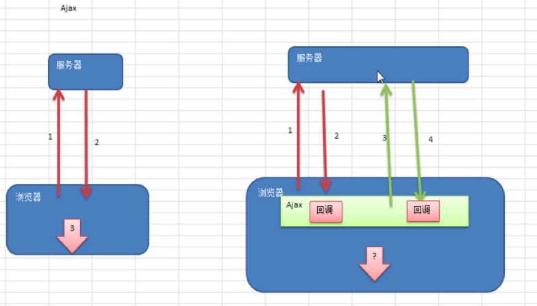
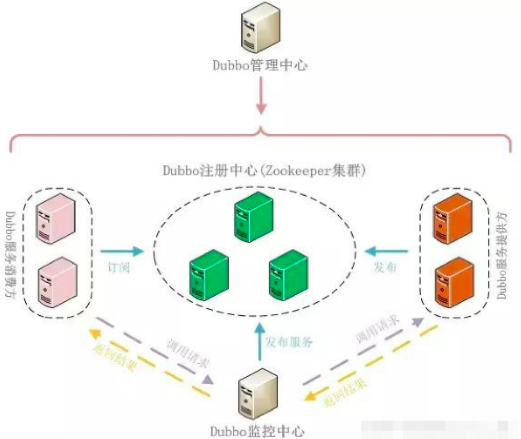
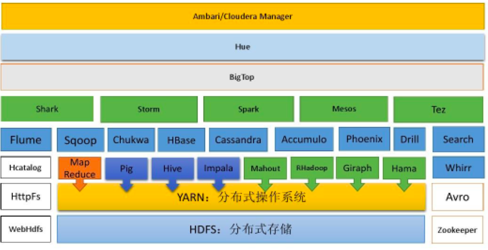
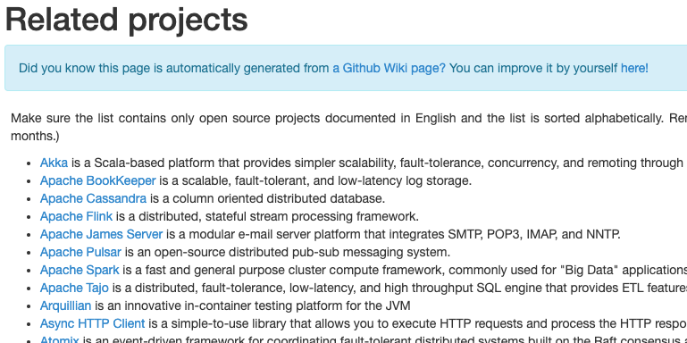
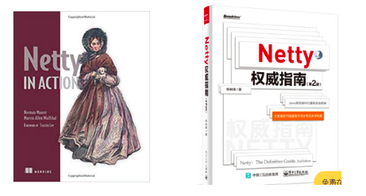

# 1.1 Netty的基本介绍

1. Netty 是由 JBOSS 提供的一个 **Java** 开源框架，现为 **Github** 上的独立项目。
2. Netty 是一个异步的、基于事件驱动的网络应用框架，用以快速开发高性能、高可靠性的网络 IO 程序。

3. Netty 主要针对在 TCP 协议下，面向 Clients 端的高并发应用，或者 Peer-to-Peer 场景下的大量数据持续传输的 应用。

4. Netty 本质是一个 NIO 框架，适用于服务器通讯相关的多种应用场景

5. 要透彻理解 Netty ， 需要先学习 NIO ， 这样我们才能阅读 Netty 的源码。

# 1.2 Netty 的应用场景

## 1.2.1 互联网行业

1. 互联网行业:在分布式系统中，各个节点之间需要远程服务调用，高性能的 RPC 框架必不可少，Netty 作为异步高性能的通信框架，往往作为基础通信组件被这些 RPC 框架使用。
2. 典型的应用有:阿里分布式服务框架 Dubbo 的 RPC 框架使用 Dubbo 协议进行节点间通信，Dubbo 协议默认使用 Netty 作为基础通信组件，用于实现各进程节点之间的内部通信。

## 1.2.2 游戏行业

1. 无论是手游服务端还是大型的网络游戏，Java 语言得到了越来越广泛的应用。
2. Netty 作为高性能的基础通信组件，提供了 TCP/UDP 和 HTTP 协议栈，方便定制和开发私有协议栈，账号登 录服务器。
3. 地图服务器之间可以方便的通过 Netty 进行高性能的通信。

## 1.2.3 大数据领域

1. 经典的 Hadoop 的高性能通信和序列化组件 Avro 的 RPC 框架，默认采用 Netty 进行跨界点通信。
2. 它的 Netty Service 基于 Netty 框架二次封装实现。

## 1.2.4 其它开源项目使用到 Netty

网址: https://netty.io/wiki/related-projects.html

# 1.3 Netty 的学习参考资料

《Netty IN ACTION》：作者本身是Netty框架的内核开发，有大量的实例可以参考。注重实战

《Netty 权威指南》：基于Netty 5写的，Netty 5 和 Netty 4 的api有些还是有很大差别。理论和原理的东西很好，注重原理。(Netty 5已经废弃，没人维护了)

