# 3.1 Java NIO 基本介绍


1. Java NIO 全称 **java non-blocking IO**，是指 JDK 提供的新 API。从 JDK1.4 开始，Java 提供了一系列改进的
   输入/输出的新特性，被统称为 NIO(即 New IO)，是==同步非阻塞==的。

2. NIO 相关类都被放在 **java.nio** 包及子包下，并且对原 java.io 包中的很多类进行改写。【基本案例】

   

3. NIO 有三大核心部分:**Channel(通道)，Buffer(缓冲区)，Selector(选择器)**。

| ddddddddddddddddddddddddddddddddddddddddddddddddddddddddddddddddddddddddddddddddddddddddddd | d    |
| ------------------------------------------------------------ | ---- |
|  |      |

4. **NIO 是 面向缓冲区 ，或者面向 块 编程的**。数据读取到一个它稍后处理的缓冲区，需要时可在缓冲区中前后 移动，这就增加了处理过程中的灵活性，使用它可以提供==非阻塞式==的高伸缩性网络

5. Java NIO 的非阻塞模式，使一个线程从某通道发送请求或者读取数据，但是它仅能得到目前可用的数据，如果目前没有数据可用时，就什么都不会获取，而==不是保持线程阻塞==，所以直至数据变的可以读取之前，该线程可以继续做其他的事情。 非阻塞写也是如此，一个线程请求写入一些数据到某通道，但不需要等待它完全写入， 这个线程同时可以去做别的事情。【后面有案例说明】

6. 通俗理解:NIO是可以做到用一个线程来处理多个操作的。假设有10000个请求过来，根据实际情况，可以分配 50 或者 100 个线程来处理。不像之前的阻塞 IO 那样，非得分配 10000 个。

7. HTTP2.0 使用了多路复用的技术，做到同一个连接并发处理多个请求，而且并发请求的数量比 HTTP1.1 大了好几个数量级。

8. 案例说明NIO的Buffer

```java
package com.atguigu.nio;

import java.nio.IntBuffer;

public class BasicBuffer {
    public static void main(String[] args) {

        //举例说明Buffer 的使用 (简单说明)
        //创建一个Buffer, 大小为 5, 即可以存放5个int
        IntBuffer intBuffer = IntBuffer.allocate(5);

        //向buffer 存放数据
//        intBuffer.put(10);
//        intBuffer.put(11);
//        intBuffer.put(12);
//        intBuffer.put(13);
//        intBuffer.put(14);
        for(int i = 0; i < intBuffer.capacity(); i++) {
            intBuffer.put( i * 2);
        }

        //如何从buffer读取数据
        //将buffer转换，读写切换(!!!)
        /*
        public final Buffer flip() {
        limit = position; //读数据不能超过5
        position = 0;
        mark = -1;
        return this;
    }
         */
        intBuffer.flip();
        intBuffer.position(1);//1,2
        System.out.println(intBuffer.get());
        intBuffer.limit(3);
        while (intBuffer.hasRemaining()) {
            System.out.println(intBuffer.get());
        }
    }
}
```


# 3.2 NIO 和 BIO 的比较


1. BIO 以流的方式处理数据,而 NIO 以块的方式处理数据,块 I/O 的效率比流 I/O 高很多。
2. BIO 是阻塞的，NIO 则是非阻塞的。
3. BIO 基于字节流和字符流进行操作，而 NIO 基于 Channel(通道)和 Buffer(缓冲区)进行操作，数据总是从通道 读取到缓冲区中，或者从缓冲区写入到通道中。Selector(选择器)用于监听多个通道的事件(比如:连接请求， 数据到达等)，因此使用==单个线程就可以监听多个客户端通道==。


# 3.3 NIO 三大核心原理示意图


一张图描述 NIO 的 Selector 、 Channel 和 Buffer 的关系


## 3.3.1 Selector 、 Channel 和 Buffer 的关系图(简单版)


1. 每个channel都会对应一个Buffer。
2. Selector 对应一个线程， 一个线程对应多个 channel(连接)。
3. 该图反应了有三个channel注册到该selector//程序。
4. 程序切换到哪个channel是有事件决定的,Event就是一个重要的概念。
5. Selector 会根据不同的事件，在各个通道上切换。
6. Buffer 就是一个内存块 ， 底层是有一个数组。
7. 数据的读取写入是通过Buffer,这个和BIO,BIO中要么是输入流，或者是输出流, 不能双向，但是 NIO 的 Buffer 是可以读也可以写, 需要 flip 方法切换 channel 是双向的, 可以返回底层操作系统的情况, 比如 Linux，底层的操作系统通道就是双向的。


# 3.4 缓冲区(Buffer)

## 3.4.1 基本介绍


缓冲区(Buffer):缓冲区本质上是一个可以读写数据的内存块，可以理解成是一个==容器对象(含数组)==，该对象提供了==一组方法==，可以更轻松地使用内存块，缓冲区对象内置了一些机制，能够跟踪和记录缓冲区的状态变化情况。Channel 提供从文件、网络读取数据的渠道，但是读取或写入的数据都必须经由 Buffer，如图: 【后面举例说明】


## 3.4.2 Buffer 类及其子类


1. 在 NIO 中，Buffer 是一个顶层父类，它是一个抽象类, 类的层级关系图:


2. Buffer类定义了所有的缓冲区都具有的四个属性来提供关于其所包含的数据元素的信息:

| dddddddddddddddddddddddddddddddddddddddddddddddddddddddddddddddddddddddddddddddddddddddddddddddddddddddddddddddddd | d    |
| ------------------------------------------------------------ | ---- |
|  |      |


2. Buffer类相关方法一览

```java
public abstract class Buffer {
    //JDK1.4时，引入的api
    public final int capacity( )//返回此缓冲区的容量
    public final int position( )//返回此缓冲区的位置
    public final Buffer position (int newPositio)//设置此缓冲区的位置
    public final int limit( )//返回此缓冲区的限制
    public final Buffer limit (int newLimit)//设置此缓冲区的限制
    public final Buffer mark( )//在此缓冲区的位置设置标记
    public final Buffer reset( )//将此缓冲区的位置重置为以前标记的位置
    public final Buffer clear( )//清除此缓冲区, 即将各个标记恢复到初始状态，但是数据并没有真正擦除, 后面操作会覆盖
    public final Buffer flip( )//反转此缓冲区
    public final Buffer rewind( )//重绕此缓冲区
    public final int remaining( )//返回当前位置与限制之间的元素数
    public final boolean hasRemaining( )//告知在当前位置和限制之间是否有元素
    public abstract boolean isReadOnly( );//告知此缓冲区是否为只读缓冲区
 
    //JDK1.6时引入的api
    public abstract boolean hasArray();//告知此缓冲区是否具有可访问的底层实现数组
    public abstract Object array();//返回此缓冲区的底层实现数组
    public abstract int arrayOffset();//返回此缓冲区的底层实现数组中第一个缓冲区元素的偏移量
    public abstract boolean isDirect();//告知此缓冲区是否为直接缓冲区
}
```


## 3.4.3  ByteBuffer


从前面可以看出对于 Java 中的基本数据类型(boolean 除外)，都有一个 Buffer 类型与之相对应，最常用的自然是 ByteBuffer 类(二进制数据)，该类的主要方法如下:

```java
public abstract class ByteBuffer {
    //缓冲区创建相关api
    public static ByteBuffer allocateDirect(int capacity)//创建直接缓冲区
    public static ByteBuffer allocate(int capacity)//设置缓冲区的初始容量
    public static ByteBuffer wrap(byte[] array)//把一个数组放到缓冲区中使用
    //构造初始化位置offset和上界length的缓冲区
    public static ByteBuffer wrap(byte[] array,int offset, int length)
     //缓存区存取相关API
    public abstract byte get( );//从当前位置position上get，get之后，position会自动+1
    public abstract byte get (int index);//从绝对位置get
    public abstract ByteBuffer put (byte b);//从当前位置上添加，put之后，position会自动+1
    public abstract ByteBuffer put (int index, byte b);//从绝对位置上put
 }
```


# 3.5 通道(Channel)

## 3.5.1 基本介绍


1. NIO 的通道类似于流，但有些区别如下:
   * 通道可以同时进行读写，而流只能读或者只能写
   * 通道可以实现异步读写数据
   * 通道可以从缓冲读数据，也可以写数据到缓冲
2. BIO 中的 stream 是单向的，例如 FileInputStream 对象只能进行读取数据的操作，而 NIO 中的通道(Channel) 是双向的，可以读操作，也可以写操作。
3. Channel 在 NIO 中是一个接口 `public interface Channel extends Closeable{}`
4. 常 用 的 Channel 类 有 : **FileChannel** 、 DatagramChannel 、 **ServerSocketChannel** 和 **SocketChannel** 。 【ServerSocketChanne 类似 ServerSocket , SocketChannel 类似 Socket】
5. FileChannel 用于文件的数据读写，DatagramChannel 用于 UDP 的数据读写，ServerSocketChannel 和SocketChannel 用于 TCP 的数据读写。

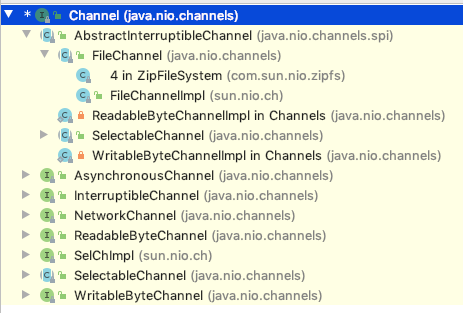


## 3.6.2 FileChannel 类


FileChannel 主要用来对本地文件进行 IO 操作，常见的方法有

```java
public int read(ByteBuffer dst);//从通道读取数据并放到缓冲区中
public int write(ByteBuffer src);//把缓冲区的数据写到通道中
public long transferFrom(ReadableByteChannel src, long position, long count);//从目标通道中复制数据到当前通道
public long transferTo(long position, long count, WritableByteChannel target);//把数据从当前通道复制给目标通道
```


## 3.5.3 应用实例 1-本地文件写数据


1. 使用前面的 ByteBuffer(缓冲) 和 FileChannel(通道)， 将 "hello,你好" 写入到 file01.txt 中
2. 文件不存在就创建
3. 代码实现

```java
package com.atguigu.nio;

import java.io.FileOutputStream;
import java.nio.ByteBuffer;
import java.nio.channels.FileChannel;

public class NIOFileChannel01 {
    public static void main(String[] args) throws Exception{

        String str = "hello,你好";
        //创建一个输出流->channel
        FileOutputStream fileOutputStream = new FileOutputStream("file01.txt");

        //通过 fileOutputStream 获取 对应的 FileChannel
        //这个 fileChannel 真实 类型是  FileChannelImpl
        FileChannel fileChannel = fileOutputStream.getChannel();

        //创建一个缓冲区 ByteBuffer
        ByteBuffer byteBuffer = ByteBuffer.allocate(1024);

        //将 str 放入 byteBuffer
        byteBuffer.put(str.getBytes());

        //对byteBuffer 进行flip
        byteBuffer.flip();

        //将byteBuffer 数据写入到 fileChannel
        fileChannel.write(byteBuffer);
        fileOutputStream.close();

    }
}
```

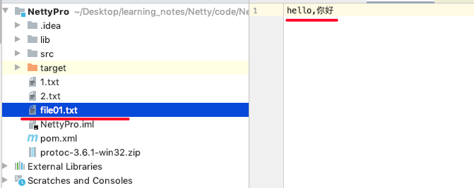


## 3.5.4 应用实例 2-本地文件读数据


1. 使用前面的 ByteBuffer(缓冲) 和 FileChannel(通道)， 将 file01.txt 中的数据读入到程序，并显示在控制台屏幕。
2. 假定文件已经存在、
3. 代码实现

```java
package com.atguigu.nio;

import java.io.File;
import java.io.FileInputStream;
import java.nio.ByteBuffer;
import java.nio.channels.FileChannel;

public class NIOFileChannel02 {
    public static void main(String[] args) throws Exception {

        //创建文件的输入流
        File file = new File("file01.txt");
        FileInputStream fileInputStream = new FileInputStream(file);

        //通过fileInputStream 获取对应的FileChannel -> 实际类型  FileChannelImpl
        FileChannel fileChannel = fileInputStream.getChannel();

        //创建缓冲区
        ByteBuffer byteBuffer = ByteBuffer.allocate((int) file.length());

        //将 通道的数据读入到Buffer
        fileChannel.read(byteBuffer);

        //将byteBuffer 的 字节数据 转成String
        System.out.println(new String(byteBuffer.array()));
        fileInputStream.close();
    }
}
```

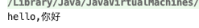


## 3.5.5 应用实例 3-使用一个 Buffer 完成文件读取、写入


1. 使用 FileChannel(通道) 和 方法 read , write，完成文件的拷贝
2. 拷贝一个文本文件 1.txt , 放在项目下即可
3. 流程图


4. 代码实现

```java
package com.atguigu.nio;

import java.io.FileInputStream;
import java.io.FileOutputStream;
import java.nio.ByteBuffer;
import java.nio.channels.FileChannel;

public class NIOFileChannel03 {
    public static void main(String[] args) throws Exception {

        FileInputStream fileInputStream = new FileInputStream("1.txt");
        FileChannel fileChannel01 = fileInputStream.getChannel();

        FileOutputStream fileOutputStream = new FileOutputStream("2.txt");
        FileChannel fileChannel02 = fileOutputStream.getChannel();

        ByteBuffer byteBuffer = ByteBuffer.allocate(512);

        while (true) { //循环读取

            //这里有一个重要的操作，一定不要忘了
            /*
             public final Buffer clear() {
                position = 0;
                limit = capacity;
                mark = -1;
                return this;
            }
             */
            byteBuffer.clear(); //清空buffer
            int read = fileChannel01.read(byteBuffer);
            System.out.println("read =" + read);
            if(read == -1) { //表示读完
                break;
            }
            //将buffer 中的数据写入到 fileChannel02 -- 2.txt
            byteBuffer.flip();
            fileChannel02.write(byteBuffer);
        }

        //关闭相关的流
        fileInputStream.close();
        fileOutputStream.close();
    }
}
```

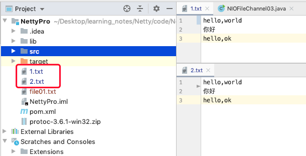


## 3.5.6 应用实例 4-拷贝文件 transferFrom 方法


1. 使用 FileChannel(通道) 和 方法 transferFrom ，完成文件的拷贝
2. 拷贝一张图片
3. 代码实现

```java
package com.atguigu.nio;

import java.io.FileInputStream;
import java.io.FileOutputStream;
import java.nio.channels.FileChannel;

public class NIOFileChannel04 {
    public static void main(String[] args)  throws Exception {

        //创建相关流
        FileInputStream fileInputStream = new FileInputStream("Koala.jpg");
        FileOutputStream fileOutputStream = new FileOutputStream("Koala2.jpg");

        //获取各个流对应的filechannel
        FileChannel sourceCh = fileInputStream.getChannel();
        FileChannel destCh = fileOutputStream.getChannel();

        //使用transferForm完成拷贝
        destCh.transferFrom(sourceCh,0,sourceCh.size());
        //关闭相关通道和流
        sourceCh.close();
        destCh.close();
        fileInputStream.close();
        fileOutputStream.close();
    }
}
```

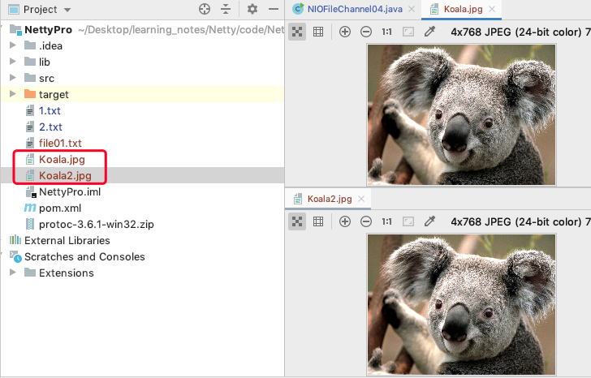


## 3.5.7 关于 Buffer 和 Channel 的注意事项和细节


1. ByteBuffer 支持类型化的 put 和 get, put 放入的是什么数据类型，get 就应该使用相应的数据类型来取出，否则可能有 `BufferUnderflowException` 异常。[举例说明]

```java
package com.atguigu.nio;

import java.nio.ByteBuffer;

public class NIOByteBufferPutGet {
    public static void main(String[] args) {

        //创建一个Buffer
        ByteBuffer buffer = ByteBuffer.allocate(64);

        //类型化方式放入数据
        buffer.putInt(100);
        buffer.putLong(9);
        buffer.putChar('爱');
        buffer.putShort((short) 4);

        //取出
        buffer.flip();

        System.out.println();

        System.out.println(buffer.getInt());
        System.out.println(buffer.getLong());
        System.out.println(buffer.getChar());
        System.out.println(buffer.getShort());
    }
}
```

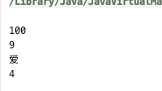


2. 可以将一个普通Buffer转成只读Buffer[举例说明]

```java
package com.atguigu.nio;

import java.nio.ByteBuffer;

public class ReadOnlyBuffer {
    public static void main(String[] args) {

        //创建一个buffer
        ByteBuffer buffer = ByteBuffer.allocate(2);

        for(int i = 0; i < 2; i++) {
            buffer.put((byte)i);
        }

        //读取
        buffer.flip();

        //得到一个只读的Buffer
        ByteBuffer readOnlyBuffer = buffer.asReadOnlyBuffer();
        System.out.println(readOnlyBuffer.getClass());

        //读取
        while (readOnlyBuffer.hasRemaining()) {
            System.out.println(readOnlyBuffer.get());
        }

        readOnlyBuffer.put((byte)100); //ReadOnlyBufferException
    }
}
```

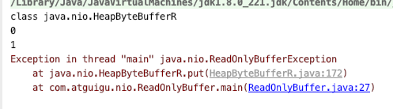


3. NIO 还提供了 `MappedByteBuffer`， 可以让文件直接在内存(堆外的内存)中进行修改， 而如何同步到文件由 NIO 来完成。 [举例说明]

```java
package com.atguigu.nio;

import java.io.RandomAccessFile;
import java.nio.MappedByteBuffer;
import java.nio.channels.FileChannel;

/*
说明
1. MappedByteBuffer 可让文件直接在内存(堆外内存)修改, 操作系统不需要拷贝一次
 */
public class MappedByteBufferTest {
    public static void main(String[] args) throws Exception {

        RandomAccessFile randomAccessFile = new RandomAccessFile("1.txt", "rw");
        //获取对应的通道
        FileChannel channel = randomAccessFile.getChannel();

        /**
         * 参数1: FileChannel.MapMode.READ_WRITE 使用的读写模式
         * 参数2： 0 ： 可以直接修改的起始位置
         * 参数3:  5: 是映射到内存的大小(不是索引位置) ,即将 1.txt 的多少个字节映射到内存
         * 可以直接修改的范围就是 0-5
         * 实际类型 DirectByteBuffer
         */
        MappedByteBuffer mappedByteBuffer = channel.map(FileChannel.MapMode.READ_WRITE, 0, 5);

        mappedByteBuffer.put(0, (byte) 'H');
        mappedByteBuffer.put(3, (byte) '9');
//        mappedByteBuffer.put(5, (byte) 'Y');//IndexOutOfBoundsException

        randomAccessFile.close();
        System.out.println("修改成功~~");

    }
}
```

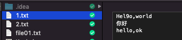


4. 面我们讲的读写操作，都是通过一个 Buffer 完成的，NIO 还支持 通过多个 Buffer (即 Buffer 数组) 完成读写操作，即 Scattering 和 Gathering 【举例说明】

```java
package com.atguigu.nio;

import java.net.InetSocketAddress;
import java.nio.ByteBuffer;
import java.nio.channels.ServerSocketChannel;
import java.nio.channels.SocketChannel;
import java.util.Arrays;

/**
 * Scattering：将数据写入到buffer时，可以采用buffer数组，依次写入 [分散]
 * Gathering: 从buffer读取数据时，可以采用buffer数组，依次读
 */
public class ScatteringAndGatheringTest {
    public static void main(String[] args) throws Exception {

        //使用 ServerSocketChannel 和 SocketChannel 网络

        ServerSocketChannel serverSocketChannel = ServerSocketChannel.open();
        InetSocketAddress inetSocketAddress = new InetSocketAddress(6666);

        //绑定端口到socket ，并启动
        serverSocketChannel.socket().bind(inetSocketAddress);

        //创建buffer数组
        ByteBuffer[] byteBuffers = new ByteBuffer[2];
        byteBuffers[0] = ByteBuffer.allocate(5);
        byteBuffers[1] = ByteBuffer.allocate(3);

        //等客户端连接(telnet)
        SocketChannel socketChannel = serverSocketChannel.accept();
        int messageLength = 8;   //假定从客户端接收8个字节
        //循环的读取
        while (true) {

            int byteRead = 0;

            while (byteRead < messageLength) {
                long l = socketChannel.read(byteBuffers);
                byteRead += l; //累计读取的字节数
                System.out.println("byteRead=" + byteRead);
                //使用流打印, 看看当前的这个buffer的position 和 limit
                Arrays.asList(byteBuffers).stream().map(buffer ->
                        "postion=" + buffer.position() + ", limit=" + buffer.limit()).forEach(System.out::println);
            }

            //将所有的buffer进行flip
            Arrays.asList(byteBuffers).forEach(buffer -> buffer.flip());

            //将数据读出显示到客户端
            long byteWirte = 0;
            while (byteWirte < messageLength) {
                long l = socketChannel.write(byteBuffers); //回显到客户端
                byteWirte += l;
            }

            //将所有的buffer 进行clear
            Arrays.asList(byteBuffers).forEach(buffer -> {
                buffer.clear();
            });

            System.out.println("byteRead:=" + byteRead + " byteWrite=" + byteWirte + ", messagelength" + messageLength);
        }

    }
}
```

客服端发送 6个字节(回车两个字节）：

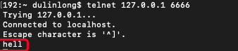


socketChannel 让 byteBuffers 数组自动分配了元素(Scattering)。


客服端发送 8个字节(回车两个字节）：

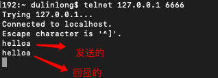

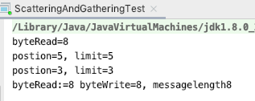

socketChannel 让 byteBuffers 数组自动整合了元素(Gathering)。


# 3.6 Selector(选择器)

