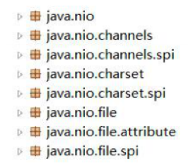
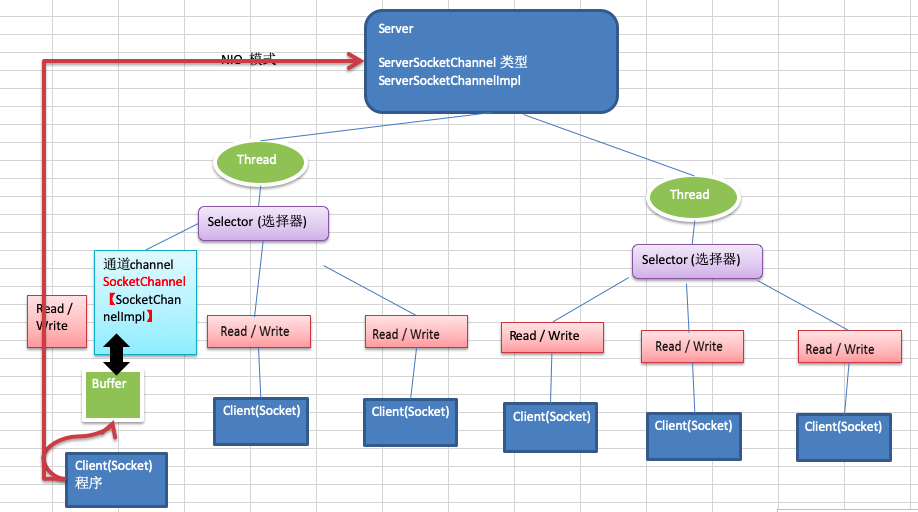
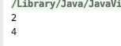
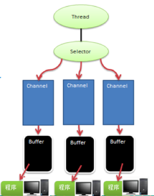
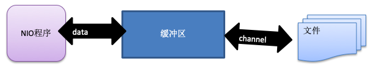
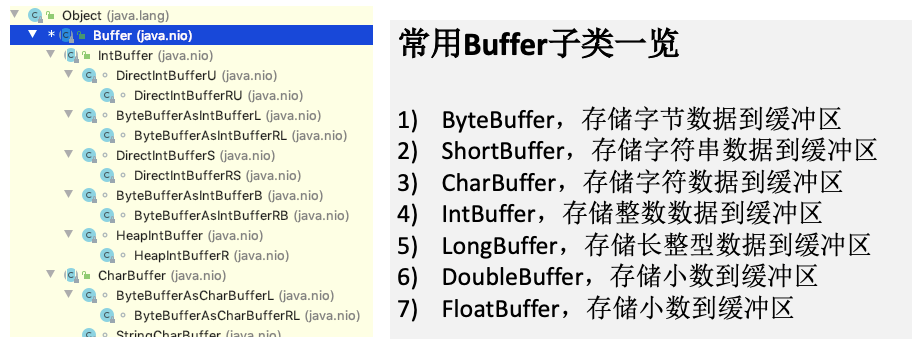

# 3.1 Java NIO 基本介绍


1. Java NIO 全称 **java non-blocking IO**，是指 JDK 提供的新 API。从 JDK1.4 开始，Java 提供了一系列改进的
   输入/输出的新特性，被统称为 NIO(即 New IO)，是==同步非阻塞==的。

2. NIO 相关类都被放在 **java.nio** 包及子包下，并且对原 java.io 包中的很多类进行改写。【基本案例】

   

3. NIO 有三大核心部分:**Channel(通道)，Buffer(缓冲区)，Selector(选择器)**。

| ddddddddddddddddddddddddddddddddddddddddddddddddddddddddddddddddddddddddddddddddddddddddddd | d    |
| ------------------------------------------------------------ | ---- |
|  |      |

4. **NIO 是 面向缓冲区 ，或者面向 块 编程的**。数据读取到一个它稍后处理的缓冲区，需要时可在缓冲区中前后 移动，这就增加了处理过程中的灵活性，使用它可以提供==非阻塞式==的高伸缩性网络

5. Java NIO 的非阻塞模式，使一个线程从某通道发送请求或者读取数据，但是它仅能得到目前可用的数据，如果目前没有数据可用时，就什么都不会获取，而==不是保持线程阻塞==，所以直至数据变的可以读取之前，该线程可以继续做其他的事情。 非阻塞写也是如此，一个线程请求写入一些数据到某通道，但不需要等待它完全写入， 这个线程同时可以去做别的事情。【后面有案例说明】

6. 通俗理解:NIO是可以做到用一个线程来处理多个操作的。假设有10000个请求过来，根据实际情况，可以分配 50 或者 100 个线程来处理。不像之前的阻塞 IO 那样，非得分配 10000 个。

7. HTTP2.0 使用了多路复用的技术，做到同一个连接并发处理多个请求，而且并发请求的数量比 HTTP1.1 大了好几个数量级。

8. 案例说明NIO的Buffer

```java
package com.atguigu.nio;

import java.nio.IntBuffer;

public class BasicBuffer {
    public static void main(String[] args) {

        //举例说明Buffer 的使用 (简单说明)
        //创建一个Buffer, 大小为 5, 即可以存放5个int
        IntBuffer intBuffer = IntBuffer.allocate(5);

        //向buffer 存放数据
//        intBuffer.put(10);
//        intBuffer.put(11);
//        intBuffer.put(12);
//        intBuffer.put(13);
//        intBuffer.put(14);
        for(int i = 0; i < intBuffer.capacity(); i++) {
            intBuffer.put( i * 2);
        }

        //如何从buffer读取数据
        //将buffer转换，读写切换(!!!)
        /*
        public final Buffer flip() {
        limit = position; //读数据不能超过5
        position = 0;
        mark = -1;
        return this;
    }
         */
        intBuffer.flip();
        intBuffer.position(1);//1,2
        System.out.println(intBuffer.get());
        intBuffer.limit(3);
        while (intBuffer.hasRemaining()) {
            System.out.println(intBuffer.get());
        }
    }
}
```



# 3.2 NIO 和 BIO 的比较


1. BIO 以流的方式处理数据,而 NIO 以块的方式处理数据,块 I/O 的效率比流 I/O 高很多。
2. BIO 是阻塞的，NIO 则是非阻塞的。
3. BIO 基于字节流和字符流进行操作，而 NIO 基于 Channel(通道)和 Buffer(缓冲区)进行操作，数据总是从通道 读取到缓冲区中，或者从缓冲区写入到通道中。Selector(选择器)用于监听多个通道的事件(比如:连接请求， 数据到达等)，因此使用==单个线程就可以监听多个客户端通道==。


# 3.3 NIO 三大核心原理示意图


一张图描述 NIO 的 Selector 、 Channel 和 Buffer 的关系


## 3.3.1 Selector 、 Channel 和 Buffer 的关系图(简单版)



1. 每个channel都会对应一个Buffer。
2. Selector 对应一个线程， 一个线程对应多个 channel(连接)。
3. 该图反应了有三个channel注册到该selector//程序。
4. 程序切换到哪个channel是有事件决定的,Event就是一个重要的概念。
5. Selector 会根据不同的事件，在各个通道上切换。
6. Buffer 就是一个内存块 ， 底层是有一个数组。
7. 数据的读取写入是通过Buffer,这个和BIO,BIO中要么是输入流，或者是输出流, 不能双向，但是 NIO 的 Buffer 是可以读也可以写, 需要 flip 方法切换 channel 是双向的, 可以返回底层操作系统的情况, 比如 Linux，底层的操作系统通道就是双向的。


# 3.4 缓冲区(Buffer)

## 3.4.1 基本介绍


缓冲区(Buffer):缓冲区本质上是一个可以读写数据的内存块，可以理解成是一个==容器对象(含数组)==，该对象提供了==一组方法==，可以更轻松地使用内存块，缓冲区对象内置了一些机制，能够跟踪和记录缓冲区的状态变化情况。Channel 提供从文件、网络读取数据的渠道，但是读取或写入的数据都必须经由 Buffer，如图: 【后面举例说明】




## 3.4.2 Buffer 类及其子类


1. 在 NIO 中，Buffer 是一个顶层父类，它是一个抽象类, 类的层级关系图:



2. Buffer类定义了所有的缓冲区都具有的四个属性来提供关于其所包含的数据元素的信息:

| dddddddddddddddddddddddddddddddddddddddddddddddddddddddddddddddddddddddddddddddddddddddddddddddddddddddddddddddddd | d    |
| ------------------------------------------------------------ | ---- |
|  |      |


2. Buffer类相关方法一览

```java
public abstract class Buffer {
    //JDK1.4时，引入的api
    public final int capacity( )//返回此缓冲区的容量
    public final int position( )//返回此缓冲区的位置
    public final Buffer position (int newPositio)//设置此缓冲区的位置
    public final int limit( )//返回此缓冲区的限制
    public final Buffer limit (int newLimit)//设置此缓冲区的限制
    public final Buffer mark( )//在此缓冲区的位置设置标记
    public final Buffer reset( )//将此缓冲区的位置重置为以前标记的位置
    public final Buffer clear( )//清除此缓冲区, 即将各个标记恢复到初始状态，但是数据并没有真正擦除, 后面操作会覆盖
    public final Buffer flip( )//反转此缓冲区
    public final Buffer rewind( )//重绕此缓冲区
    public final int remaining( )//返回当前位置与限制之间的元素数
    public final boolean hasRemaining( )//告知在当前位置和限制之间是否有元素
    public abstract boolean isReadOnly( );//告知此缓冲区是否为只读缓冲区
 
    //JDK1.6时引入的api
    public abstract boolean hasArray();//告知此缓冲区是否具有可访问的底层实现数组
    public abstract Object array();//返回此缓冲区的底层实现数组
    public abstract int arrayOffset();//返回此缓冲区的底层实现数组中第一个缓冲区元素的偏移量
    public abstract boolean isDirect();//告知此缓冲区是否为直接缓冲区
}
```


## 3.4.3  ByteBuffer


从前面可以看出对于 Java 中的基本数据类型(boolean 除外)，都有一个 Buffer 类型与之相对应，最常用的自然是 ByteBuffer 类(二进制数据)，该类的主要方法如下:

```java
public abstract class ByteBuffer {
    //缓冲区创建相关api
    public static ByteBuffer allocateDirect(int capacity)//创建直接缓冲区
    public static ByteBuffer allocate(int capacity)//设置缓冲区的初始容量
    public static ByteBuffer wrap(byte[] array)//把一个数组放到缓冲区中使用
    //构造初始化位置offset和上界length的缓冲区
    public static ByteBuffer wrap(byte[] array,int offset, int length)
     //缓存区存取相关API
    public abstract byte get( );//从当前位置position上get，get之后，position会自动+1
    public abstract byte get (int index);//从绝对位置get
    public abstract ByteBuffer put (byte b);//从当前位置上添加，put之后，position会自动+1
    public abstract ByteBuffer put (int index, byte b);//从绝对位置上put
 }
```


# 3.5 通道(Channel)