# 10.1 基本说明


1. 只有看过Netty源码，才能说是真的掌握了Netty框架。
2. 在io.netty.example包下，有很多Netty源码案例，可以用来分析。
3. 源码分析章节是针对有Java项目经验，并且玩过框架源码的人员讲的，否则你听起来会有相当的难度。


# 10.2 Netty 启动过程源码剖析

## 10.2.1 源码剖析目的


用源码分析的方式走一下 Netty (服务器)的启动过程，更好的理解 Netty 的整体设计和运行机制。


## 10.2.2 源码剖析


说明:

1. 源码需要剖析到Netty调用doBind方法，追踪到NioServerSocketChannel的doBind。
2. 并且要Debug程序到NioEventLoop类的run代码，无限循环，在服务器端运行。


## 10.2.3 源码剖析过程

### 1. demo 源码的基本理解

```java
/*
 * Copyright 2012 The Netty Project
 *
 * The Netty Project licenses this file to you under the Apache License,
 * version 2.0 (the "License"); you may not use this file except in compliance
 * with the License. You may obtain a copy of the License at:
 *
 *   http://www.apache.org/licenses/LICENSE-2.0
 *
 * Unless required by applicable law or agreed to in writing, software
 * distributed under the License is distributed on an "AS IS" BASIS, WITHOUT
 * WARRANTIES OR CONDITIONS OF ANY KIND, either express or implied. See the
 * License for the specific language governing permissions and limitations
 * under the License.
 */
package com.atguigu.netty.source.echo;

import io.netty.bootstrap.ServerBootstrap;
import io.netty.channel.*;
import io.netty.channel.nio.NioEventLoopGroup;
import io.netty.channel.socket.SocketChannel;
import io.netty.channel.socket.nio.NioServerSocketChannel;
import io.netty.handler.logging.LogLevel;
import io.netty.handler.logging.LoggingHandler;
import io.netty.handler.ssl.SslContext;
import io.netty.handler.ssl.SslContextBuilder;
import io.netty.handler.ssl.util.SelfSignedCertificate;

/**
 * Echoes back any received data from a client.
 */
public final class EchoServer {

    static final boolean SSL = System.getProperty("ssl") != null;
    static final int PORT = Integer.parseInt(System.getProperty("port", "8007"));

    public static void main(String[] args) throws Exception {
        // Configure SSL.
        final SslContext sslCtx;
        if (SSL) {
            SelfSignedCertificate ssc = new SelfSignedCertificate();
            sslCtx = SslContextBuilder.forServer(ssc.certificate(), ssc.privateKey()).build();
        } else {
            sslCtx = null;
        }

        // Configure the server.
        EventLoopGroup bossGroup = new NioEventLoopGroup(1);
        EventLoopGroup workerGroup = new NioEventLoopGroup();
        try {
            ServerBootstrap b = new ServerBootstrap();
            b.group(bossGroup, workerGroup)
             .channel(NioServerSocketChannel.class)
             .option(ChannelOption.SO_BACKLOG, 100)
             .handler(new LoggingHandler(LogLevel.INFO))
             .childHandler(new ChannelInitializer<SocketChannel>() {
                 @Override
                 public void initChannel(SocketChannel ch) throws Exception {
                     ChannelPipeline p = ch.pipeline();
                     if (sslCtx != null) {
                         p.addLast(sslCtx.newHandler(ch.alloc()));
                     }
                     p.addLast(new LoggingHandler(LogLevel.INFO));
                     //p.addLast(new EchoServerHandler());
                 }
             });

            // Start the server.
            ChannelFuture f = b.bind(PORT).sync();

            // Wait until the server socket is closed.
            f.channel().closeFuture().sync();
        } finally {
            // Shut down all event loops to terminate all threads.
            bossGroup.shutdownGracefully();
            workerGroup.shutdownGracefully();
        }
    }
}
```

1. 先看启动类:main 方法中，首先创建了关于 SSL 的配置类。

2. 重点分析下 创建了两个 EventLoopGroup 对象:

   `EventLoopGroup bossGroup = new NioEventLoopGroup(1);`

   EventLoopGroup workerGroup = new NioEventLoopGroup();`

3. 这两个对象是整个 Netty 的核心对象，可以说，整个 Netty 的运作都依赖于他们。bossGroup 用于接受Tcp 请求，他会将请求交给 workerGroup ，workerGroup 会获取到真正的连接，然后和连接进行通信，比如读写解码编码等操作。

4. EventLoopGroup 是事件循环组(线程组) 含有多个 EventLoop， 可以注册 channel，用于在事件循环中去进行选择(和选择器相关).。[debug 看]

5. `new NioEventLoopGroup(1);`  这个 1 表示 bossGroup 事件组有 1 个线程你可以指定，如果 `new NioEventLoopGroup()` 会含有默认个线程 cpu 核数*2, 即可以充分的利用多核的优势，【可以 dubug 一把】

6. `DEFAULT_EVENT_LOOP_THREADS = Math.max(1, SystemPropertyUtil.getInt("io.netty.eventLoopThreads", NettyRuntime.availableProcessors() * 2));`会创建 EventExecutor 数组 `children = new EventExecutor[nThreads]; `//debug 一下

   每个元素的类型就是 NIOEventLoop, NIOEventLoop 实现了 EventLoop 接口 和 Executor 接口

   try 块中创建了一个 ServerBootstrap 对象，他是一个引导类，用于启动服务器和引导整个程序的初始化(看下源 码 **allows easy bootstrap of {@link ServerChannel}** )。它和 **ServerChannel** 关联， 而 **ServerChannel** 继承 了 **Channel**，有一些方法 **remoteAddress** 等 **[**可以 **Debug** 下]
    随后，变量 b 调用了 group 方法将两个 group 放入了自己的字段中，用于后期引导使用【**debug** 下 **group** 方 法 

   **/\****

   *** Set the {@link EventLoopGroup} for the parent (acceptor) and the child (client). These
    \* {@link EventLoopGroup}'s are used to handle all the events and IO for {@link ServerChannel} and **

   **\* {@link Channel}'s.
    \*/**】。

7. 然后添加了一个 channel，其中参数一个 Class 对象，引导类将通过这个 Class 对象反射创建 **ChannelFactory**。然后添加了一些 TCP 的参数。[说明:Channel 的创建在 bind 方法，可以 Debug 下 bind ,会找到 `channel = channelFactory.newChannel(); `]

8. 再添加了一个服务器专属的日志处理器 handler。

9. 再添加一个 SocketChannel(不是 ServerSocketChannel)的 handler。

10. 然后绑定端口并阻塞至连接成功。

11. 最后 main 线程阻塞等待关闭。

12. finally 块中的代码将在服务器关闭时优雅关闭所有资源


服务器端处理器源码

```java
/*
 * Copyright 2012 The Netty Project
 *
 * The Netty Project licenses this file to you under the Apache License,
 * version 2.0 (the "License"); you may not use this file except in compliance
 * with the License. You may obtain a copy of the License at:
 *
 *   http://www.apache.org/licenses/LICENSE-2.0
 *
 * Unless required by applicable law or agreed to in writing, software
 * distributed under the License is distributed on an "AS IS" BASIS, WITHOUT
 * WARRANTIES OR CONDITIONS OF ANY KIND, either express or implied. See the
 * License for the specific language governing permissions and limitations
 * under the License.
 */
package com.atguigu.netty.source.echo;

import io.netty.channel.ChannelHandler.Sharable;
import io.netty.channel.ChannelHandlerContext;
import io.netty.channel.ChannelInboundHandlerAdapter;

/**
 * Handler implementation for the echo server.
 */
@Sharable
public class EchoServerHandler extends ChannelInboundHandlerAdapter {

    @Override
    public void channelRead(ChannelHandlerContext ctx, Object msg) {
        ctx.write(msg);
    }

    @Override
    public void handlerAdded(ChannelHandlerContext ctx) throws Exception {
        super.handlerAdded(ctx);
    }

    @Override
    public void handlerRemoved(ChannelHandlerContext ctx) throws Exception {
        super.handlerRemoved(ctx);
    }

    @Override
    public void channelReadComplete(ChannelHandlerContext ctx) {
        ctx.flush();
    }

    @Override
    public void exceptionCaught(ChannelHandlerContext ctx, Throwable cause) {
        // Close the connection when an exception is raised.
        cause.printStackTrace();
        ctx.close();
    }
}
```

说明:

* 这是一个普通的处理器类，用于处理客户端发送来的消息，在我们这里，我们简单的解析出客户端传过 来的内容，然后打印，最后发送字符串给客户端。
* 大致讲解了我们的 demo 源码的作用。后面的 debug 的时候会详细


### 2. 分析 EventLoopGroup 的过程

1. 构造器方法

```java
public NioEventLoopGroup(int nThreads) {
    this(nThreads, (Executor) null);
}
```

2. 上面的 `this(nThreads, (Executor) null);`调用构造器

```java
public NioEventLoopGroup(int nThreads, Executor executor) {
    this(nThreads, executor, SelectorProvider.provider());
}
```

3. 上面的 `this(nThreads, executor, SelectorProvider.provider());`调用下面构造器

```java
public NioEventLoopGroup(
        int nThreads, Executor executor, final SelectorProvider selectorProvider) {
    this(nThreads, executor, selectorProvider, DefaultSelectStrategyFactory.INSTANCE);
}
```

4. 上面的 `this ()...` 调用构造器

```java
public NioEventLoopGroup(int nThreads, Executor executor, final SelectorProvider selectorProvider,
                         final SelectStrategyFactory selectStrategyFactory) {
    super(nThreads, executor, selectorProvider, selectStrategyFactory, RejectedExecutionHandlers.reject());
}
```

5. 上面的 `super() ..` 的方法 是父类: MultithreadEventLoopGroup

```java
protected MultithreadEventLoopGroup(int nThreads, Executor executor, Object... args) {
    super(nThreads == 0 ? DEFAULT_EVENT_LOOP_THREADS : nThreads, executor, args);
}
```

6. 追踪到源码 抽象类 MultithreadEventExecutorGroup 的构造器方法 MultithreadEventExecutorGroup 才是 NioEventLoopGroup 真正的构造方法， 这里可以看成是一个模板方法，使用了设计模式的模板模式, 所以，我们就需要好好分析 MultithreadEventExecutorGroup 方法了

7. 分析 MultithreadEventExecutorGroup

```java
/**
* 参数说明:
* @param nThreads 使用的线程数，默认为 core *2 [可以追踪源码]
* @param executor 执行器:如果传入 null,则采用 Netty 默认的线程工厂和默认的执行器 ThreadPerTaskExecutor
* @param chooserFactory 单例 new DefaultEventExecutorChooserFactory()
* @param args args 在创建执行器的时候传入固定参数
*/
protected MultithreadEventExecutorGroup(int nThreads, Executor executor,
                                        EventExecutorChooserFactory chooserFactory, Object... args) {
    if (nThreads <= 0) {
        throw new IllegalArgumentException(String.format("nThreads: %d (expected: > 0)", nThreads));
    }

    if (executor == null) {
        executor = new ThreadPerTaskExecutor(newDefaultThreadFactory());
    }

    children = new EventExecutor[nThreads];

    for (int i = 0; i < nThreads; i ++) {
        boolean success = false;
        try {
            children[i] = newChild(executor, args);
            success = true;
        } catch (Exception e) {
            // TODO: Think about if this is a good exception type
            throw new IllegalStateException("failed to create a child event loop", e);
        } finally {
            if (!success) {
                for (int j = 0; j < i; j ++) {
                    children[j].shutdownGracefully();
                }

                for (int j = 0; j < i; j ++) {
                    EventExecutor e = children[j];
                    try {
                        while (!e.isTerminated()) {
                            e.awaitTermination(Integer.MAX_VALUE, TimeUnit.SECONDS);
                        }
                    } catch (InterruptedException interrupted) {
                        // Let the caller handle the interruption.
                        Thread.currentThread().interrupt();
                        break;
                    }
                }
            }
        }
    }

    chooser = chooserFactory.newChooser(children);

    final FutureListener<Object> terminationListener = new FutureListener<Object>() {
        @Override
        public void operationComplete(Future<Object> future) throws Exception {
            if (terminatedChildren.incrementAndGet() == children.length) {
                terminationFuture.setSuccess(null);
            }
        }
    };

    for (EventExecutor e: children) {
        e.terminationFuture().addListener(terminationListener);
    }

    Set<EventExecutor> childrenSet = new LinkedHashSet<EventExecutor>(children.length);
    Collections.addAll(childrenSet, children);
    readonlyChildren = Collections.unmodifiableSet(childrenSet);
}
```

说明:

* 如果 executor 是 null，创建一个默认的 ThreadPerTaskExecutor，使用 Netty 默认的线程工厂。
* 根据传入的线程数(CPU*2)创建一个线程池(单例线程池)数组。
* 循环填充数组中的元素。如果异常，则关闭所有的单例线程池。
* 根据线程选择工厂创建一个线程选择器。
* 为每一个单例线程池添加一个关闭监听器。
* 将所有的单例线程池添加到一个 HashSet 中。


### 3. ServerBootstrap 创建和构造过程

1. ServerBootstrap 是个空构造，但是有默认的成员变量

```java
public class ServerBootstrap extends AbstractBootstrap<ServerBootstrap, ServerChannel> {

    private static final InternalLogger logger = InternalLoggerFactory.getInstance(ServerBootstrap.class);

    private final Map<ChannelOption<?>, Object> childOptions = new LinkedHashMap<ChannelOption<?>, Object>();
    private final Map<AttributeKey<?>, Object> childAttrs = new LinkedHashMap<AttributeKey<?>, Object>();
    private final ServerBootstrapConfig config = new ServerBootstrapConfig(this);//config 对象，会在后面起很大作用
    private volatile EventLoopGroup childGroup;
    private volatile ChannelHandler childHandler;
    
	public ServerBootstrap() { }
```

2. 分析一下 ServerBootstrap 基本使用情况

```java
ServerBootstrap b = new ServerBootstrap();
b.group(bossGroup, workerGroup)
    .channel(NioServerSocketChannel.class)
    .option(ChannelOption.SO_BACKLOG, 100)
    .handler(new LoggingHandler(LogLevel.INFO))
    .childHandler(new ChannelInitializer<SocketChannel>() {
        @Override
        public void initChannel(SocketChannel ch) throws Exception {
            ChannelPipeline p = ch.pipeline();
            if (sslCtx != null) {
                p.addLast(sslCtx.newHandler(ch.alloc()));
            }
            p.addLast(new LoggingHandler(LogLevel.INFO));
            //p.addLast(new EchoServerHandler());
        }
    });
```

说明：

* 链式调用:group 方法，将 boss 和 worker 传入，boss 赋值给 parentGroup 属性,worker 赋值给 childGroup属性。
* channel 方法传入 NioServerSocketChannel.class 对象。会根据这个 class 创建 channel 对象。
* option 方法传入 TCP 参数，放在一个 LinkedHashMap 中。
* handler 方法传入一个 handler 中，这个 hanlder 只专属于 ServerSocketChannel 而不是 SocketChannel。
* childHandler 传入一个 hanlder ，这个 handler 将会在每个客户端连接的时候调用。供 SocketChannel 使用。


### 4. 绑定端口的分析

1. 服务器就是在这个 bind 方法里启动完成的。

2. bind 方法代码, 追踪到创建了一个端口对象，并做了一些空判断， 核心代码 doBind，我们看看：

```java
public ChannelFuture bind(SocketAddress localAddress) {
    validate();
    if (localAddress == null) {
        throw new NullPointerException("localAddress");
    }
    return doBind(localAddress);
}
```

3. doBind 源码剖析, 核心是两个方法 initAndRegister 和 doBind0：

```java
private ChannelFuture doBind(final SocketAddress localAddress) {
    final ChannelFuture regFuture = initAndRegister();
    final Channel channel = regFuture.channel();
    if (regFuture.cause() != null) {
        return regFuture;
    }

    if (regFuture.isDone()) {
        // At this point we know that the registration was complete and successful.
        ChannelPromise promise = channel.newPromise();
        doBind0(regFuture, channel, localAddress, promise);//说明:执行 doBind0 方法，完成对端口的绑定
        return promise;
    } else {
        // Registration future is almost always fulfilled already, but just in case it's not.
        final PendingRegistrationPromise promise = new PendingRegistrationPromise(channel);
        regFuture.addListener(new ChannelFutureListener() {
            @Override
            public void operationComplete(ChannelFuture future) throws Exception {
                Throwable cause = future.cause();
                if (cause != null) {
                    // Registration on the EventLoop failed so fail the ChannelPromise directly to not cause an
                    // IllegalStateException once we try to access the EventLoop of the Channel.
                    promise.setFailure(cause);
                } else {
                    // Registration was successful, so set the correct executor to use.
                    // See https://github.com/netty/netty/issues/2586
                    promise.registered();

                    doBind0(regFuture, channel, localAddress, promise);
                }
            }
        });
        return promise;
    }
}
```

4. 分析说明 initAndRegister

```java
final ChannelFuture initAndRegister() {
    Channel channel = null;
    try {
        channel = channelFactory.newChannel();
        init(channel);
    } catch (Throwable t) {
        if (channel != null) {
            // channel can be null if newChannel crashed (eg SocketException("too many open files"))
            channel.unsafe().closeForcibly();
            // as the Channel is not registered yet we need to force the usage of the GlobalEventExecutor
            return new DefaultChannelPromise(channel, GlobalEventExecutor.INSTANCE).setFailure(t);
        }
        // as the Channel is not registered yet we need to force the usage of the GlobalEventExecutor
        return new DefaultChannelPromise(new FailedChannel(), GlobalEventExecutor.INSTANCE).setFailure(t);
    }

    ChannelFuture regFuture = config().group().register(channel);
    if (regFuture.cause() != null) {
        if (channel.isRegistered()) {
            channel.close();
        } else {
            channel.unsafe().closeForcibly();
        }
    }

    return regFuture;
}
```

4.1 说明: `channelFactory.newChannel()` 方法 的作用通过 **ServerBootstrap** 的通道工厂反射创建一个 **NioServerSocketChannel,** 具体追踪源码可以得到下面结论:

* 通过 NIO 的 SelectorProvider 的 openServerSocketChannel 方法得到 JDK 的 channel。目的是让 Netty 包装 JDK 的 channel。
* 创建了一个唯一的 ChannelId，创建了一个 NioMessageUnsafe，用于操作消息，创建了一 个 DefaultChannelPipeline 管道，是个双向链表结构，用于过滤所有的进出的消息。
* 创建了一个 NioServerSocketChannelConfig 对象，用于对外展示一些配置。`channel = channelFactory.newChannel();//NioServerSocketChannel`


4.2 说明:**init** 初始化这个 **NioServerSocketChannel**，具体追踪源码可以得到如下结论:

* **init** 方法，这是个抽象方法**(AbstractBootstrap** 类的**)**，由 **ServerBootstrap** 实现(可以追一下源码 `setChannelOptions(channel, options, logger);`
* 设置 **NioServerSocketChannel** 的 **TCP** 属性。
* 由于 **LinkedHashMap** 是非线程安全的，使用同步进行处理。
* 对 **NioServerSocketChannel** 的 **ChannelPipeline** 添加 **ChannelInitializer** 处理器。
* 可以看出， **init** 的方法的核心作用在和 **ChannelPipeline** 相关。
* 从 **NioServerSocketChannel** 的初始化过程中，我们知道，**pipeline** 是一个双向链表，并且，他本身就初始化了 **head** 和 **tail**，这里调用了他的 **addLast** 方法，也就是将整个 **handler** 插入到 **tail** 的 前面，因为 **tail** 永远会在后面，需要做一些系统的固定工作。


4.3 说明:

* 基本说明: `initAndRegister()` 初始化 **NioServerSocketChannel** 通道并注册各个 **handler**，返回一个 **future**。
* 通过 **ServerBootstrap** 的通道工厂反射创建一个 **NioServerSocketChannel**。
* init** 初始化这个 **NioServerSocketChannel**。
* config().group().register(channel)` 通过 **ServerBootstrap** 的 **bossGroup** 注册 **NioServerSocketChannel**。
* 最后，返回这个异步执行的占位符即 **regFuture**。


5.  init 方法 会调用 addLast，现在进入到 addLast 方法内查看

```java
@Override
public final ChannelPipeline addLast(EventExecutorGroup group, String name, ChannelHandler handler) {
    final AbstractChannelHandlerContext newCtx;
    synchronized (this) {
        checkMultiplicity(handler);

        newCtx = newContext(group, filterName(name, handler), handler);

        addLast0(newCtx);

        // If the registered is false it means that the channel was not registered on an eventloop yet.
        // In this case we add the context to the pipeline and add a task that will call
        // ChannelHandler.handlerAdded(...) once the channel is registered.
        if (!registered) {
            newCtx.setAddPending();
            callHandlerCallbackLater(newCtx, true);
            return this;
        }

        EventExecutor executor = newCtx.executor();
        if (!executor.inEventLoop()) {
            newCtx.setAddPending();
            executor.execute(new Runnable() {
                @Override
                public void run() {
                    callHandlerAdded0(newCtx);
                }
            });
            return this;
        }
    }
    callHandlerAdded0(newCtx);
    return this;
}
```

说明:

* addLast 方法，在 DefaultChannelPipeline 类中。
* addLast 方法这就是 pipeline 方法的核心。
* 检查该 handler 是否符合标准。
* 创建一个 AbstractChannelHandlerContext 对象 ， 这里说一下 ， ChannelHandlerContext 对象是ChannelHandler 和 ChannelPipeline 之间的关联，每当有 ChannelHandler 添加到 Pipeline 中时，都会创建 Context。Context 的主要功能是管理他所关联的 Handler 和同一个 Pipeline 中的其他 Handler 之间的交互。
* 将 Context 添加到链表中。也就是追加到 tail 节点的前面。
* 最后，同步或者异步或者晚点异步的调用 callHandlerAdded0 方法


6. 前面说了 dobind 方法有 2 个重要的步骤，initAndRegister 说完，接下来看 doBind0 方法，代码如下：

```java
private static void doBind0(
    final ChannelFuture regFuture, final Channel channel,
    final SocketAddress localAddress, final ChannelPromise promise) {

    // This method is invoked before channelRegistered() is triggered.  Give user handlers a chance to set up
    // the pipeline in its channelRegistered() implementation.
    channel.eventLoop().execute(new Runnable() {
        @Override
        public void run() {
            if (regFuture.isSuccess()) {
                //bind 方法这里下断点，这里下断点，来玩!!
                channel.bind(localAddress, promise).addListener(ChannelFutureListener.CLOSE_ON_FAILURE);
            } else {
                promise.setFailure(regFuture.cause());
            }
        }
    });
}
```

说明:

* 该方法的参数为 initAndRegister 的 future，NioServerSocketChannel，端口地址，NioServerSocketChannel 的 promise。
* 这里就可以根据前面下的断点，一直 debug:

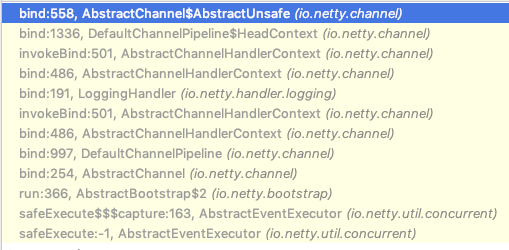

```java
//将调用 LoggingHandler 的 invokeBind 方法, 最后会追到 
//DefaultChannelPipeline 类的 bind
//然后进入到 unsafe.bind 方法 debug , 注意要追踪到
//unsafe.bind , 要 debug 第二圈的时候，才能看到.
public void bind(
    ChannelHandlerContext ctx, SocketAddress localAddress, ChannelPromise promise)
    throws Exception {
    unsafe.bind(localAddress, promise);
}

//继续追踪 AbstractChannel 的
public final void bind(final SocketAddress localAddress, final ChannelPromise promise) {
	//.... 
    try {
	//!!!!小红旗 可以看到，这里最终的方法就是 doBind 方法，执行成功后，执行通道的 fireChannelActive 方法，告诉所有的 handler，已经成功绑定。
		doBind(localAddress);// 
    } catch (Throwable t) {
		safeSetFailure(promise, t); 
        closeIfClosed();
	return;
	}}
```

* 最终 doBind 就会追踪到 NioServerSocketChannel 的 doBind, 说明 Netty 底层使用的是 Nio

```java
protected void doBind(SocketAddress localAddress) throws Exception {
    if (PlatformDependent.javaVersion() >= 7) {
        javaChannel().bind(localAddress, config.getBacklog());
    } else {
        javaChannel().socket().bind(localAddress, config.getBacklog());
    }
}
```


7.  回到 bind 方法(一步一步向下执行)，最后一步:safeSetSuccess(promise)，告诉 promise 任务成功了。其可以执行监听器的 方法了。到此整个启动过程已经结束了 ，**ok** 了。

### 5. 继续 Debug 服务器就回进入到**(NioEventLoop** 类**)**一个循环代码，进行监听

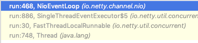

```java
@Override
protected void run() {
    for (;;) { 
        try {
    }
```


## 10.2.4 Netty 启动过程梳理


1. 创建2个EventLoopGroup线程池数组。数组默认大小CPU*2，方便chooser选择线程池时提高性能。
2. BootStrap 将 boss 设置为 group 属性，将 worker 设置为 childer 属性。
3. 通过 bind 方法启动，内部重要方法为 initAndRegister 和 dobind 方法。
4. initAndRegister 方法会反射创建 NioServerSocketChannel 及其相关的 NIO 的对象， pipeline ， unsafe，同时也为 pipeline 初始了 head 节点和 tail 节点。
5. 在 register0 方法成功以后调用在 dobind 方法中调用 doBind0 方法，该方法会调用NioServerSocketChannel的 doBind 方法对 JDK 的 channel 和端口进行绑定，完成 Netty 服务器的所有启动，并开始监听连接事件。


# 10.3 Netty 接受请求过程源码剖析

## 10.3.1 源码剖析目的


1. 服务器启动后肯定是要接受客户端请求并返回客户端想要的信息的，下面源码分析 Netty 在启动之后是如何接
受客户端请求的。
2. 在 io.netty.example 包下。


## 10.3.2 源码剖析


说明:

1. 从之前服务器启动的源码中，我们得知，服务器最终注册了一个 Accept 事件等待客户端的连接。我们也知道，NioServerSocketChannel 将自己注册到了 boss 单例线程池(reactor 线程)上，也就是 EventLoop 。
2. 先简单说下EventLoop的逻辑(后面我们详细讲解EventLoop)。
   * EventLoop 的作用是一个死循环，而这个循环中做 3 件事情:
     * 有条件的等待 Nio 事件。
     * 处理 Nio 事件。
     * 处理消息队列中的任务。
   *   仍用前面的项目来分析: 进入到 NioEventLoop 源码中后，在`private void processSelectedKey(SelectionKey k, AbstractNioChannel ch)` 方法开始调试最终我们要分析到 AbstractNioChannel 的 doBeginRead 方法， 当到这个方法时，针对于这个客户端的连接就完成了，接下来就可以监听读事件了。


## 10.3.3 源码分析过程


1. 断点位置 NioEventLoop 的如下方法 processSelectedKey。

```java
if ((readyOps & (SelectionKey.OP_READ | SelectionKey.OP_ACCEPT)) != 0 || readyOps == 0) {
    unsafe.read();//断点位置
}
```

2. 执行浏览器 http://localhost:8007/，客户端发出请求。
3. 从的断点我们可以看到， readyOps 是 16 ，也就是 Accept 事件。说明浏览器的请求已经进来了。
4. 这个 unsafe 是 boss 线程中 NioServerSocketChannel 的 AbstractNioMessageChannel\$NioMessageUnsafe 对象。 我们进入到 AbstractNioMessageChannel​\$NioMessageUnsafe 的 read 方法中

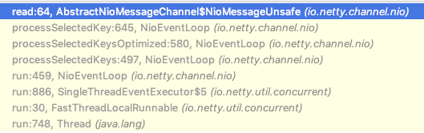

5. read 方法代码并分析:

```java
public void read() {
    assert eventLoop().inEventLoop();
    final ChannelConfig config = config();
    final ChannelPipeline pipeline = pipeline();
    final RecvByteBufAllocator.Handle allocHandle = unsafe().recvBufAllocHandle();
    allocHandle.reset(config);

    boolean closed = false;
    Throwable exception = null;
    try {
        try {
            do {
                int localRead = doReadMessages(readBuf);
                if (localRead == 0) {
                    break;
                }
                if (localRead < 0) {
                    closed = true;
                    break;
                }

                allocHandle.incMessagesRead(localRead);
            } while (allocHandle.continueReading());
        } catch (Throwable t) {
            exception = t;
        }

        int size = readBuf.size();
        for (int i = 0; i < size; i ++) {
            readPending = false;
            pipeline.fireChannelRead(readBuf.get(i));
        }
        readBuf.clear();
        allocHandle.readComplete();
        pipeline.fireChannelReadComplete();

        if (exception != null) {
            closed = closeOnReadError(exception);

            pipeline.fireExceptionCaught(exception);
        }

        if (closed) {
            inputShutdown = true;
            if (isOpen()) {
                close(voidPromise());
            }
        }
    } finally {
        // Check if there is a readPending which was not processed yet.
        // This could be for two reasons:
        // * The user called Channel.read() or ChannelHandlerContext.read() in channelRead(...) method
        // * The user called Channel.read() or ChannelHandlerContext.read() in channelReadComplete(...) method
        //
        // See https://github.com/netty/netty/issues/2254
        if (!readPending && !config.isAutoRead()) {
            removeReadOp();
        }
    }
}
}
```

说明:

* 检查该 eventloop 线程是否是当前线程。`assert eventLoop().inEventLoop()`。
* 执行 doReadMessages 方法，并传入一个 readBuf 变量，这个变量是一个 List，也就是容器。
* 循环容器，执行 `pipeline.fireChannelRead(readBuf.get(i));`
* doReadMessages 是读取 boss 线程中的 NioServerSocketChannel 接受到的请求。并把这些请求放进容器，一会我们 **debug** 下 **doReadMessages** 方法。
* 循环遍历容器中的所有请求，调用 pipeline 的 fireChannelRead 方法，用于处理这些接受的请求或者其他事件，在 read 方法中，循环调用 ServerSocket 的 pipeline 的 fireChannelRead 方法, 开始执行管道中的 handler 的 ChannelRead 方法(debug 进入)。


6. 追踪一下 doReadMessages 方法，就可以看得更清晰

```java
protected int doReadMessages(List<Object> buf) throws Exception {
    SocketChannel ch = SocketUtils.accept(javaChannel());

    try {
        if (ch != null) {
            buf.add(new NioSocketChannel(this, ch));
            return 1;
        }
    } catch (Throwable t) {
        logger.warn("Failed to create a new channel from an accepted socket.", t);

        try {
            ch.close();
        } catch (Throwable t2) {
            logger.warn("Failed to close a socket.", t2);
        }
    }

    return 0;
}
```

说明:

* 通过工具类，调用 NioServerSocketChannel 内部封装的 serverSocketChannel 的 accept 方法，这是 Nio 做法。
*  获取到一个 JDK 的 SocketChannel，然后，使用 NioSocketChannel 进行封装。最后添加到容器中。
* 这样容器 buf 中就有了 NioSocketChannel [如果有兴趣可以追一下 NioSocketChannel 是如何创建的，我就不追了]。


7. 回到 read 方法，继续分析循环执行 pipeline.fireChannelRead 方法

7.1 前面分析 doReadMessages 方法的作用是通过 ServerSocket 的 accept 方法获取到 Tcp 连接，然后封装成 Netty 的 NioSocketChannel 对象。最后添加到容器中。

7.2 在 read 方法中，循环调用 ServerSocket 的 pipeline 的 fireChannelRead 方法，开始执行管道中的 handler 的 ChannelRead 方法(debug 进入)

7.3 经过 dubug (多次)，可以看到会反复执行多个 handler 的 ChannelRead，我们知道，pipeline 里面又 4 个handler ，分别是 **Head**，**LoggingHandler**，**ServerBootstrapAcceptor**，**Tail**。

7.4 我们重点看看 ServerBootstrapAcceptor。debug 之后，断点会进入到 ServerBootstrapAcceptor 中来。我们来看看 ServerBootstrapAcceptor 的 channelRead 方法(要多次 debug 才可以)

7.5 channelRead 方法

```java
public void channelRead(ChannelHandlerContext ctx, Object msg) {
    final Channel child = (Channel) msg;

    child.pipeline().addLast(childHandler);

    setChannelOptions(child, childOptions, logger);

    for (Entry<AttributeKey<?>, Object> e: childAttrs) {
        child.attr((AttributeKey<Object>) e.getKey()).set(e.getValue());
    }

    try {////将客户端连接注册到 worker 线程池
        childGroup.register(child).addListener(new ChannelFutureListener() {
            @Override
            public void operationComplete(ChannelFuture future) throws Exception {
                if (!future.isSuccess()) {
                    forceClose(child, future.cause());
                }
            }
        });
    } catch (Throwable t) {
        forceClose(child, t);
    }
}
```

说明:

* msg 强转成 Channel ，实际上就是 NioSocketChannel 。

*  添加 NioSocketChannel 的 pipeline 的 handler ，就是我们 main 方法里面设置的 childHandler 方法里的。

*  设置 NioSocketChannel 的各种属性。

* 将该 NioSocketChannel 注册到 childGroup 中的一个 EventLoop 上，并添加一个监听器。
* 这个 childGroup 就是我们 main 方法创建的数组 workerGroup。


**8.** 进入 **register** 方法查看(步步追踪会到)

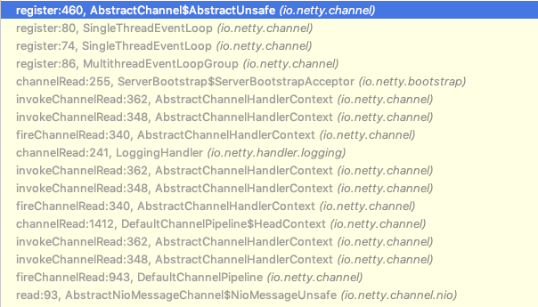

```java
public final void register(EventLoop eventLoop, final ChannelPromise promise) {
    if (eventLoop == null) {
        throw new NullPointerException("eventLoop");
    }
    if (isRegistered()) {
        promise.setFailure(new IllegalStateException("registered to an event loop already"));
        return;
    }
    if (!isCompatible(eventLoop)) {
        promise.setFailure(
            new IllegalStateException("incompatible event loop type: " + eventLoop.getClass().getName()));
        return;
    }

    AbstractChannel.this.eventLoop = eventLoop;

    if (eventLoop.inEventLoop()) {
        register0(promise);
    } else {
        try {
            eventLoop.execute(new Runnable() {
                @Override
                public void run() {
                    register0(promise);
                }
            });
        } catch (Throwable t) {
            logger.warn(
                "Force-closing a channel whose registration task was not accepted by an event loop: {}",
                AbstractChannel.this, t);
            closeForcibly();
            closeFuture.setClosed();
            safeSetFailure(promise, t);
        }
    }
}
```

继续进入到下面方法， 执行管道中可能存在的任务，这里我们就不追了


9. 最终会调用 doBeginRead 方法，也就是 AbstractNioChannel 类的方法

```java
protected void doBeginRead() throws Exception {
    // Channel.read() or ChannelHandlerContext.read() was called
    final SelectionKey selectionKey = this.selectionKey;//断点
    if (!selectionKey.isValid()) {
        return;
    }

    readPending = true;

    final int interestOps = selectionKey.interestOps();
    if ((interestOps & readInterestOp) == 0) {
        selectionKey.interestOps(interestOps | readInterestOp);
    }
}
```

10. 这个地方调试时，请把前面的断点都去掉，然后启动服务器就会停止在 doBeginRead(需要先放过该断点，然 后浏览器请求，才能看到效果)。
11. 执行到这里时，针对于这个客户端的连接就完成了，接下来就可以监听读事件了


## 10.3.4 Netty 接受请求过程梳理


总体流程:接受连接----->创建一个新的 NioSocketChannel----------->注册到一个 worker EventLoop 上-------->注册 selecot Read 事件。

1. 服务器轮询 Accept 事件，获取事件后调用 unsafe 的 read 方法，这个 unsafe 是 ServerSocket 的内部类，该方法内部由 2 部分组成。
2. doReadMessages 用于创建 NioSocketChannel 对象，该对象包装 JDK 的 Nio Channel 客户端。该方法会像创 建 ServerSocketChanel 类似创建相关的 pipeline ， unsafe，config。
3. 随后执行 执行 pipeline.fireChannelRead 方法，并将自己绑定到一个 chooser 选择器选择的 workerGroup 中的 一个 EventLoop。并且注册一个 0，表示注册成功，但并没有注册读(1)事件


# 10.4 Pipeline Handler HandlerContext 创建源码剖析

## 10.4.1 源码剖析目的


Netty 中的 ChannelPipeline 、 ChannelHandler 和 ChannelHandlerContext 是非常核心的组件，我们从源码来分析 Netty 是如何设计这三个核心组件的，并分析是如何创建和协调工作的。


## 10.4.2 源码剖析说明


分析过程中，有很多的图形，所以我们准备了一个文档，在文档的基础上来做源码剖析。


## 10.4.3 源码剖析

### 1. 相关类介绍

1. 三者关系

1.1 每当 ServerSocket 创建一个新的连接，就会创建一个 Socket，对应的就是目标客户端。

1.2 每一个新创建的 Socket 都将会分配一个全新的 ChannelPipeline(以下简称 pipeline)。

 每一个 ChannelPipeline 内部都含有多个 ChannelHandlerContext(以下简称 Context)。

1.4 他们一起组成了双向链表，这些 Context 用于包装我们调用 addLast 方法时添加的 ChannelHandler(以下简称 handler)。

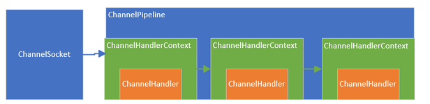

上图中:

*  ChannelSocket 和 ChannelPipeline 是一对一的关联关系，而 pipeline 内部的多个 Context 形成了链 表，**Context** 只是对 **Handler** 的封装。

* 当一个请求进来的时候，会进入 Socket 对应的 pipeline，并经过 pipeline 所有的 handler，就是设计模式中的过滤器模式。


2. **ChannelPipeline** 作用及设计

2.1 pipeline 的接口设计

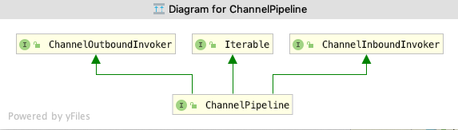

2.2 部分源码

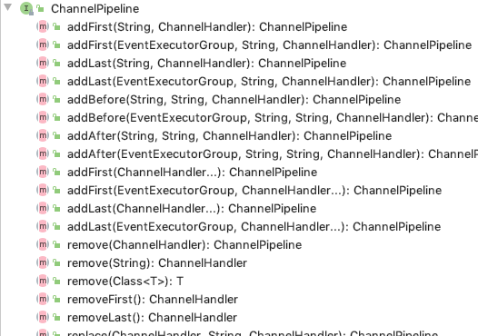

可以看到该接口继承了 inBound，outBound，Iterable 接口，表示他可以==调用数据出站的方法和入站==的方法，同时 也能遍历内部的链表， 看看他的几个代表性的方法，基本上都是针对 handler 链表的插入，追加，删除，替换操作，类似是一个 LinkedList。同时，也能返回 channel(也就是 socket)。

在 pipeline 的接口文档上，提供了一幅图

```java
* <pre>
 *                                                 I/O Request
 *                                            via {@link Channel} or
 *                                        {@link ChannelHandlerContext}
 *                                                      |
 *  +---------------------------------------------------+---------------+
 *  |                           ChannelPipeline         |               |
 *  |                                                  \|/              |
 *  |    +---------------------+            +-----------+----------+    |
 *  |    | Inbound Handler  N  |            | Outbound Handler  1  |    |
 *  |    +----------+----------+            +-----------+----------+    |
 *  |              /|\                                  |               |
 *  |               |                                  \|/              |
 *  |    +----------+----------+            +-----------+----------+    |
 *  |    | Inbound Handler N-1 |            | Outbound Handler  2  |    |
 *  |    +----------+----------+            +-----------+----------+    |
 *  |              /|\                                  .               |
 *  |               .                                   .               |
 *  | ChannelHandlerContext.fireIN_EVT() ChannelHandlerContext.OUT_EVT()|
 *  |        [ method call]                       [method call]         |
 *  |               .                                   .               |
 *  |               .                                  \|/              |
 *  |    +----------+----------+            +-----------+----------+    |
 *  |    | Inbound Handler  2  |            | Outbound Handler M-1 |    |
 *  |    +----------+----------+            +-----------+----------+    |
 *  |              /|\                                  |               |
 *  |               |                                  \|/              |
 *  |    +----------+----------+            +-----------+----------+    |
 *  |    | Inbound Handler  1  |            | Outbound Handler  M  |    |
 *  |    +----------+----------+            +-----------+----------+    |
 *  |              /|\                                  |               |
 *  +---------------+-----------------------------------+---------------+
 *                  |                                  \|/
 *  +---------------+-----------------------------------+---------------+
 *  |               |                                   |               |
 *  |       [ Socket.read() ]                    [ Socket.write() ]     |
 *  |                                                                   |
 *  |  Netty Internal I/O Threads (Transport Implementation)            |
 *  +-------------------------------------------------------------------+
```

对上图的解释说明:

* 这是一个 handler 的 list，handler 用于处理或拦截入站事件和出站事件，pipeline 实现了过滤器的高级形 式，以便用户控制事件如何处理以及 handler 在 pipeline 中如何交互。
* 上图描述了一个典型的 handler 在 pipeline 中处理 I/O 事件的方式，IO 事件由 inboundHandler 或者 outBoundHandler 处理，并通过调用 `ChannelHandlerContext.fireChannelRead` 方法转发给其最近的处理程序 。
* 入站事件由入站处理程序以自下而上的方向处理，如图所示。入站处理程序通常处理由图底部的 I/O 线程生成 入站数据。入站数据通常从如 `SocketChannel.read(ByteBuffer)` 获取。
* 通常一个 pipeline 有多个 handler，例如，一个典型的服务器在每个通道的管道中都会有以下处理程序。
  * 协议解码器 - 将二进制数据转换为 Java 对象。
  * 协议编码器 - 将 Java 对象转换为二进制数据。
  * 业务逻辑处理程序 - 执行实际业务逻辑(例如数据库访问)。
* 你的业务程序不能将线程阻塞，会影响 IO 的速度，进而影响整个 Netty 程序的性能。如果你的业务程序很快， 就可以放在 IO 线程中，反之，你需要异步执行。或者在添加 handler 的时候添加一个线程池，例如:

```java
// 下面这个任务执行的时候，将不会阻塞 IO 线程，执行的线程来自 group 线程池
pipeline.addLast(group，"handler"，new MyBusinessLogicHandler());
```


3. **ChannelHandler** 作用及设计

3.1 源码

```java
public interface ChannelHandler {
	//当把 ChannelHandler 添加到 pipeline 时被调用
	void handlerAdded(ChannelHandlerContext ctx) throws Exception; 
    //当从 pipeline 中移除时调用
	void handlerRemoved(ChannelHandlerContext ctx) throws Exception; 
    // 当处理过程中在 pipeline 发生异常时调用
	@Deprecated
	void exceptionCaught(ChannelHandlerContext ctx, Throwable cause) throws Exception;
}
```

3.2 ChannelHandler 的作用就是处理 IO 事件或拦截 IO 事件，并将其转发给下一个处理程序 ChannelHandler。 Handler 处理事件时分入站和出站的，两个方向的操作都是不同的，因此，Netty 定义了两个子接口继承 ChannelHandler

3.3 ChannelInboundHandler 入站事件接口

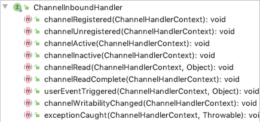

* channelActive 用于当 Channel 处于活动状态时被调用。
* channelRead 当从 Channel 读取数据时被调用等等方法。
* 程序员需要重写一些方法，当发生关注的事件，需要在方法中实现我们的业务逻辑，因为当事件发生时，Netty 会回调对应的方法。

3.4 ChannelOutboundHandler 出站事件接口

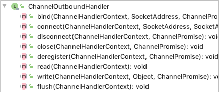

*  bind 方法，当请求将 Channel 绑定到本地地址时调用。
* close 方法，当请求关闭 Channel 时调用等等。
* 出站操作都是一些连接和写出数据类似的方法。

3.5 ChannelDuplexHandler 处理出站和入站事件

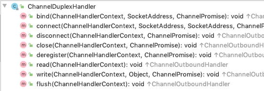

* ChannelDuplexHandler 间接实现了入站接口并直接实现了出站接口。
* 是一个通用的能够同时处理入站事件和出站事件的类。


4. **ChannelHandlerContext** 作用及设计

4.1 ChannelHandlerContext UML 图

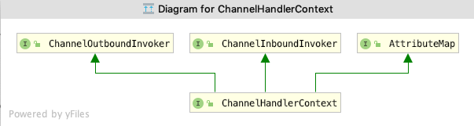

* ChannelHandlerContext 继承了出站方法调用接口和入站方法调用接口。

* ChannelOutboundInvoker 和 ChannelInboundInvoker 部分源码：

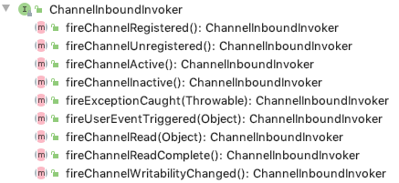

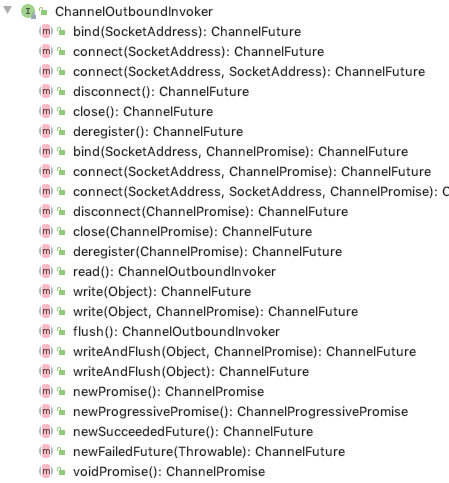

* 这两个 invoker 就是针对入站或出站方法来的，就是在入站或出站 handler 的外层再包装一层，达到在方法前 后拦截并做一些特定操作的目的。

4.2 ChannelHandlerContext部分源码

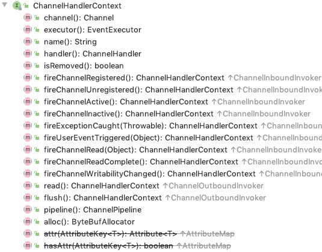

* ChannelHandlerContext 不仅仅时继承了他们两个的方法，同时也定义了一些自己的方法。

* 这些方法能够获取 Context 上下文环境中对应的比如 channel，executor，handler ，pipeline，内存分配器，关联的 handler 是否被删除。

* Context 就是包装了 handler 相关的一切，以方便 Context 可以在 pipeline 方便的操作 handler。

  

### 2.相关类创建过程


分为 3 个步骤来看创建的过程:

* 任何一个 ChannelSocket 创建的同时都会创建 一个 pipeline。
* 当用户或系统内部调用 pipeline 的 add*** 方法添加 handler 时，都会创建一个包装这 handler 的 Context。
* 这些 Context 在 pipeline 中组成了双向链表。


1. Socket 创建的时候创建 pipeline

在 NioSocketChannel 的抽象父类 AbstractChannel 的构造方法中

```java
protected AbstractChannel(Channel parent) {
    this.parent = parent;
    id = newId();
    unsafe = newUnsafe();
    pipeline = newChannelPipeline();
}
```

Debug 一下, 可以看到代码会执行到这里, 然后继续追踪到

```java
protected DefaultChannelPipeline(Channel channel) {
    this.channel = ObjectUtil.checkNotNull(channel, "channel");
    succeededFuture = new SucceededChannelFuture(channel, null);
    voidPromise =  new VoidChannelPromise(channel, true);

    tail = new TailContext(this);
    head = new HeadContext(this);

    head.next = tail;
    tail.prev = head;
}
```

说明:

* 将 channel 赋值给 channel 字段，用于 pipeline 操作 channel。
* 创建一个 future 和 promise，用于异步回调使用。
* 创建一个 inbound 的 tailContext，创建一个既是 inbound 类型又是 outbound 类型的 headContext。
* 最后，将两个 Context 互相连接，形成双向链表。
* tailContext 和 HeadContext 非常的重要，所有 pipeline 中的事件都会流经他们。


2. 在 add 添加处理器的时候创建 Context

看下 DefaultChannelPipeline 的 addLast 方法如何创建的 Context，代码如下

```java
public final ChannelPipeline addLast(EventExecutorGroup executor, ChannelHandler... handlers) {
    if (handlers == null) {
        throw new NullPointerException("handlers");
    }

    for (ChannelHandler h: handlers) {
        if (h == null) {
            break;
        }
        addLast(executor, null, h);
    }

    return this;
}
```

继续 Debug

```java
public final ChannelPipeline addLast(EventExecutorGroup group, String name, ChannelHandler handler) {
    final AbstractChannelHandlerContext newCtx;
    synchronized (this) {
        checkMultiplicity(handler);

        newCtx = newContext(group, filterName(name, handler), handler);

        addLast0(newCtx);

        // If the registered is false it means that the channel was not registered on an eventloop yet.
        // In this case we add the context to the pipeline and add a task that will call
        // ChannelHandler.handlerAdded(...) once the channel is registered.
        if (!registered) {
            newCtx.setAddPending();
            callHandlerCallbackLater(newCtx, true);
            return this;
        }

        EventExecutor executor = newCtx.executor();
        if (!executor.inEventLoop()) {
            newCtx.setAddPending();
            executor.execute(new Runnable() {
                @Override
                public void run() {
                    callHandlerAdded0(newCtx);
                }
            });
            return this;
        }
    }
    callHandlerAdded0(newCtx);
    return this;
}
```

说明:

* pipeline 添加 handler，参数是线程池，name 是 null， handler 是我们或者系统传入的 handler。Netty 为了防止多个线程导致安全问题，同步了这段代码，步骤如下:
* 检查这个 handler 实例是否是共享的，如果不是，并且已经被别的 pipeline 使用了，则抛出异常。
* 调用 **newContext(group, filterName(name, handler), handler)** 方法，创建一个 **Context**。从这里可以看出来了每次添加一个 **handler** 都会创建一个关联 **Context**。
*  调用 **addLast0** 方法，将 **Context** 追加到链表中。
* 如果这个通道还没有注册到 selecor 上，就将这个 Context 添加到这个 pipeline 的待办任务中。当注册好了以 后，就会调用 callHandlerAdded0 方法(默认是什么都不做，用户可以实现这个方法)。
* 到这里，针对三对象创建过程，了解的差不多了，和最初说的一样，每当创建 ChannelSocket 的时候都会创建 一个绑定的 pipeline，一对一的关系，创建 pipeline 的时候也会创建 tail 节点和 head 节点，形成最初的链表。tail 是入站 inbound 类型的 handler， head 既是 inbound 也是 outbound 类型的 handler。在调用 pipeline 的 addLast 方法的时候，会根据给定的 handler 创建一个 Context，然后，将这个 Context 插入到链表的尾端(tail 前面)。 到此就OK了。


## 10.4.4 创建过程梳理


1. 每当创建 ChannelSocket 的时候都会创建一个绑定的 pipeline，一对一的关系，创建 pipeline 的时候也会创建 tail 节点和 head 节点，形成最初的链表。
2. 在调用 pipeline 的 addLast 方法的时候，会根据给定的 handler 创建一个 Context，然后，将这个 Context 插 入到链表的尾端(tail 前面)。
3. Context 包装 handler，多个 Context 在 pipeline 中形成了双向链表。
4. 入站方向叫 inbound，由 head 节点开始，出站方法叫 outbound ，由 tail 节点开始。


# 10.5 ChannelPipeline 调度 handler 的源码剖析