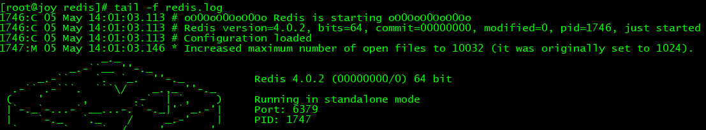
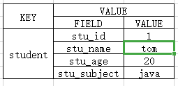
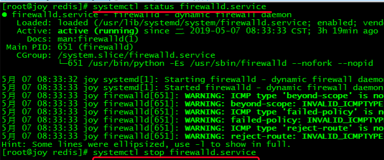
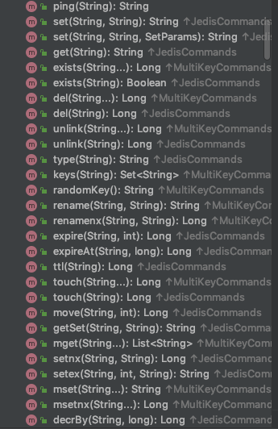

[TOC]
# 一、从NoSQL说起

NoSQL是Not only SQL的缩写，大意为“不只是SQL”，说明这项技术是<b><font color="red">传统关系型数据库的补充</font></b>而非替代。在整个NoSQL技术栈中<b><font color="blue">MemCache</font></b>、<b><font color="blue">Redis</font></b>、<b><font color="blue">MongoDB</font></b>被称为NoSQL三剑客。那么时代为什么需要NoSQL数据库呢？我们来做个对比：

|              | 关系型数据库           | NoSQL数据库                            |
| ------------ | ---------------------- | -------------------------------------- |
| 数据存储位置 | 硬盘                   | 内存                                   |
| 数据结构     | 高度组织化结构化数据   | 没有预定义的模式                       |
| 数据操作方式 | SQL                    | 所有数据都是键值对，没有声明性查询语言 |
| 事务控制     | 严格的基础事务ACID原则 | CAP定理                                |

所以NoSQL数据库的最大优势体现为：高性能、高可用性和可伸缩性。

| 传统的ACID                                                   | CAP 定理                                                     |
| ------------------------------------------------------------ | ------------------------------------------------------------ |
| A（Atomicity）原子性<br />C（Consistency）一致性<br />I（Isolation）独立性<br />D（Durability）持久性 | C（Consistency）强一致性<br />A（Availbility）可用性 --- 高可用性<br />P（Patition tolerance）分区容错性 --- 分布式容忍性 |


# 二、Redis简介

Redis英文官网介绍：

``` html
Redis is an open source (BSD licensed), in-memory data structure store, used as a database, cache and message broker. It supports data structures such as strings, hashes, lists, sets, sorted sets with range queries, bitmaps, hyperloglogs and geospatial indexes with radius queries. Redis has built-in replication, Lua scripting, LRU eviction, transactions and different levels of on-disk persistence, and provides high availability via Redis Sentinel and automatic partitioning with Redis Cluster.
```

Redis中文官网介绍：

``` html
Redis 是一个开源（BSD许可）的，内存中的数据结构存储系统，它可以用作数据库、缓存和消息中间件。 它支持多种类型的数据结构，如 字符串（strings）， 散列（hashes）， 列表（lists）， 集合（sets）， 有序集合（sorted sets） 与范围查询， bitmaps， hyperloglogs 和 地理空间（geospatial） 索引半径查询。 Redis 内置了 复制（replication），LUA脚本（Lua scripting）， LRU驱动事件（LRU eviction），事务（transactions） 和不同级别的 磁盘持久化（persistence）， 并通过 Redis哨兵（Sentinel）和自动 分区（Cluster）提供高可用性（high availability）。
```

Redis命令参考文档网址：http://redisdoc.com

# 三、Redis安装

## 1.上传并解压

redis-4.0.2.tar.gz

## 2.安装C语言编译环境

[建议先拍快照]<br/>

yum install -y gcc-c++

## 3.修改安装位置

vim redis解压目录/src/Makefile

``` html
PREFIX?=/usr/local/redis
```

就Redis自身而言是不需要修改的，这里修改的目的是让Redis的运行程序不要和其他文件混杂在一起。

## 4.编译安装

编译：进入Redis解压目录执行make命令<br/>

[建议先拍快照]<br/>

安装：make install

## 5.启动Redis服务器

### ①默认启动

``` html
[root@rich ~]# /usr/local/redis/bin/redis-server
7239:C 07 Oct 18:59:12.144 # oO0OoO0OoO0Oo Redis is starting oO0OoO0OoO0Oo
7239:C 07 Oct 18:59:12.144 # Redis version=4.0.2, bits=64, commit=00000000, modified=0, pid=7239, just started
7239:C 07 Oct 18:59:12.144 # Warning: no config file specified, using the default config. In order to specify a config file use /usr/local/redis/bin/redis-server /path/to/redis.conf
7239:M 07 Oct 18:59:12.145 * Increased maximum number of open files to 10032 (it was originally set to 1024).
                _._                                                  
           _.-``__ ''-._                                             
      _.-``    `.  `_.  ''-._           Redis 4.0.2 (00000000/0) 64 bit
  .-`` .-```.  ```\/    _.,_ ''-._                                   
 (    '      ,       .-`  | `,    )     Running in standalone mode
 |`-._`-...-` __...-.``-._|'` _.-'|     Port: 6379
 |    `-._   `._    /     _.-'    |     PID: 7239
  `-._    `-._  `-./  _.-'    _.-'                                   
 |`-._`-._    `-.__.-'    _.-'_.-'|                                  
 |    `-._`-._        _.-'_.-'    |           http://redis.io        
  `-._    `-._`-.__.-'_.-'    _.-'                                   
 |`-._`-._    `-.__.-'    _.-'_.-'|                                  
 |    `-._`-._        _.-'_.-'    |                                  
  `-._    `-._`-.__.-'_.-'    _.-'                                   
      `-._    `-.__.-'    _.-'                                       
          `-._        _.-'                                           
              `-.__.-'                                               

7239:M 07 Oct 18:59:12.148 # WARNING: The TCP backlog setting of 511 cannot be enforced because /proc/sys/net/core/somaxconn is set to the lower value of 128.
7239:M 07 Oct 18:59:12.148 # Server initialized
7239:M 07 Oct 18:59:12.148 # WARNING overcommit_memory is set to 0! Background save may fail under low memory condition. To fix this issue add 'vm.overcommit_memory = 1' to /etc/sysctl.conf and then reboot or run the command 'sysctl vm.overcommit_memory=1' for this to take effect.
7239:M 07 Oct 18:59:12.148 # WARNING you have Transparent Huge Pages (THP) support enabled in your kernel. This will create latency and memory usage issues with Redis. To fix this issue run the command 'echo never > /sys/kernel/mm/transparent_hugepage/enabled' as root, and add it to your /etc/rc.local in order to retain the setting after a reboot. Redis must be restarted after THP is disabled.
7239:M 07 Oct 18:59:12.148 * Ready to accept connections
```

停止Redis服务器

``` html
/usr/local/redis/bin/redis-cli shutdown
```

``` html
7239:M 07 Oct 19:00:53.208 # User requested shutdown...
7239:M 07 Oct 19:00:53.208 * Saving the final RDB snapshot before exiting.
7239:M 07 Oct 19:00:53.214 * DB saved on disk
7239:M 07 Oct 19:00:53.214 # Redis is now ready to exit, bye bye...
```


### ②定制配置项启动

#### [1]准备配置文件

cp /opt/redis-4.0.2/redis.conf /usr/local/redis/

#### [2]修改配置项

| 配置项名称 | 作用                                  | 取值                  |
| ---------- | ------------------------------------- | --------------------- |
| daemonize  | 控制是否以守护进程形式运行Redis服务器 | yes                   |
| logfile    | 指定日志文件位置                      | "/var/logs/redis.log" |
| dir        | Redis工作目录                         | /usr/local/redis      |

注意：/var/logs目录需要我们提前创建好

#### [3]让Redis根据指定的配置文件启动

格式

``` html
redis-server文件路径 redis.conf文件路径
```


举例

``` html
/usr/local/redis/bin/redis-server /usr/local/redis/redis.conf
```

可以查看redis对应的进程是否启动起来了

```html
ps -ef | grep redis | grep -v grep
```

实时的看日志信息

```
tail -f redis.log
```




## 6.客户端登录

/usr/local/redis/bin/redis-cli (-h 127.0.0.1 -p 6379)  括号类的为默认值，可以不写

``` cmd
	127.0.0.1:6379> ping      
	PONG                  //表示和服务器就连上了
	127.0.0.1:6379> exit
```

# 四、Redis五种常用数据结构

## 1.总体结构

<table>
    <tr>
    	<td rowspan="6">KEY</td>
        <td>VALUE</td>
    </tr>
    <tr>
    	<td>string</td>
    </tr>
    <tr>
    	<td>list</td>
    </tr>
    <tr>
    	<td>set</td>
    </tr>
    <tr>
    	<td>hash</td>
    </tr>
    <tr>
    	<td>zset</td>
    </tr>
</table>

Redis中的数据，总体上是键值对，不同数据类型指的是键值对中值的类型。

## 2.string类型

Redis中最基本的类型，它是key对应的一个单一值。二进制安全，不必担心由于编码等问题导致二进制数据变化。所以redis的string可以包含任何数据，比如jpg图片或者序列化的对象。Redis中一个字符串值的最大容量是512M。

## 3.list类型

Redis 列表是简单的字符串列表，按照插入顺序排序。你可以添加一个元素到列表的头部（左边）或者尾部（右边）。说明它的底层是基于链表实现的，所以它操作时头尾效率高，中间效率低。


## 4.set类型

Redis的set是string类型的无序集合。它是基于哈希表实现的。   相当于Java的Set<String>

## 5.hash类型

本身就是一个键值对集合。

是一个string类型的field和value的映射表，hash特别适合用于存储对象。

可以当做Java中的Map<String,Object>对待。



## 6.zset类型

Redis zset 和 set 一样也是string类型元素的集合,且不允许重复的成员。不同的是每个元素都会关联一个double类型的分数。redis正是通过分数来为集合中的成员进行从小到大的排序。zset的成员是唯一的,但分数(score)却可以重复。

相当于Java中的 Set\<Member> ,Member 是一个类有name和score的属性

# 五、Redis命令行操作

## 1.基本操作

### ①切换数据库

``` cmd
//Redis默认有16个数据库。
//115 # Set the number of databases. The default database is DB 0, you can select
//116 # a different one on a per-connection basis using SELECT <dbid> where
//117 # dbid is a number between 0 and 'databases'-1
//118 databases 16
//使用select进行切换，数据库索引从0开始
127.0.0.1:6379> select 2   //切换到数据库索引为2的数据库
OK
127.0.0.1:6379[2]> select 0
OK
```

### ②查看数据库长度

``` cmd
//先人为的设置三个数据
127.0.0.1:6379> set k01 v01
OK
127.0.0.1:6379> set k02 v02  
OK
127.0.0.1:6379> set k03 v03
OK
127.0.0.1:6379> dbsize     //查看数据库中具体包含了多少数据
(integer) 3
```

## 2.KEY操作

``` html
●KEYS PATTERN   //keys hello* 或者key 12？（*是匹配后面任意多个字符，？表示匹配一个字符）
●TYPE KEY
	返回KEY对应的值的类型
●MOVE KEY DB       //move key 1 将当前库对应的 key 移动到 1号库中
	把一组键值对数据移动到另一个数据库中
●DEL KEY [KEY ...]
	根据KEY进行删除，至少要指定一个KEY
●EXISTS KEY [KEY ...] 
	检查指定的KEY是否存在。指定一个KEY时，存在返回1，不存在返回0。可以指定多个，返回存在的KEY的数量。
●RANDOMKEY
	在现有的KEY中随机返回一个
●RENAME KEY NEWKEY
	重命名一个KEY，NEWKEY不管是否是已经存在的都会执行，如果NEWKEY已经存在则会被覆盖。
●RENAMENX KEY NEWKEY
	只有在NEWKEY不存在时能够执行成功，否则失败
●TIME
	返回当前UNIX时间戳
●TTL KEY
	以秒为单位查看KEY还能存在多长时间
●PTTL KEY
	以毫秒为单位查看KEY还能存在多长时间
●EXPIRE KEY SECONDS
	给一个KEY设置在SECONDS秒后过期，过期会被Redis移除。
●EXPIREAT KEY TIMESTAMP
	设置一个KEY在TIMESTAMP指定的时间过期
●PEXPIRE KEY MILLISECONDS
	以毫秒为单位指定过期时间
●PEXPIREAT KEY MILLISECONDS-TIMESTAMP
	以毫秒为单位指定过期的时间戳
●PERSIST KEY
	移除过期时间，变成永久key
```

## 2.string操作

``` html
●SET KEY VALUE [EX SECONDS] [PX MILLISECONDS] [NX|XX]
	给KEY设置一个string类型的值。
	EX参数用于设置存活的秒数。
	PX参数用于设置存活的毫秒数。
	NX参数表示当前命令中指定的KEY不存在才行。
	XX参数表示当前命令中指定的KEY存在才行。
●GET KEY
	根据key得到值，只能用于string类型。
●APPEND KEY VALUE
	把指定的value追加到KEY对应的原来的值后面，返回值是追加后字符串长度
●STRLEN KEY
	直接返回字符串长度
●INCR KEY
	自增1
●DECR KEY
	自减1
●INCRBY KEY INCREMENT
	原值+INCREMENT
●DECRBY KEY DECREMENT
	原值-DECREMENT
●GETRANGE KEY START END
	从字符串中取指定的一段
●SETRANGE KEY OFFSET VALUE
	从offset开始使用VALUE进行替换
●SETEX KEY SECONDS VALUE
	设置KEY,VALUE时指定存在秒数
●SETNX KEY VALUE
	新建字符串类型的键值对
●MSET KEY VALUE [KEY VALUE ...]
	一次性设置一组多个键值对
●MGET KEY [KEY ...]
	一次性指定多个KEY，返回它们对应的值，没有值的KEY返回值是(nil)
●MSETNX KEY VALUE [KEY VALUE ...]
	一次性新建多个值
●GETSET KEY VALUE
	设置新值，同时能够将旧值返回

```

## 3.list操作

``` html
●LPUSH key value [value ...]   
	从左边一个一个的插入
●RPUSH key value [value ...]
	从右边一个一个的插入
●LRANGE key start stop        //lrange members 0 -1  打印所有的元素
	根据list集合的索引打印元素数据
	正着数：0,1,2,3,...
	倒着数：-1,-2,-3,...
●LLEN key
●LPOP key
	从左边弹出一个元素。
	弹出=返回+删除。
●RPOP key
	从右边弹出一个元素。
●RPOPLPUSH source destination
	从source中RPOP一个元素，LPUSH到destination中
●LINDEX key index
	根据索引从集合中取值
●LINSERT key BEFORE|AFTER pivot value   //pivot 轴表示集合中具体的一个元素
	在pivot指定的值前面或后面插入value
●LPUSHX key value
	只能针对存在的list执行LPUSH
●LREM key count value
	根据count指定的数量从key对应的list中删除value
●LSET key index value
	把指定索引位置的元素替换为另一个值
●LTRIM key start stop
	仅保留指定区间的数据，两边的数据被删除

```

## 4.set操作

``` html
●SADD key member [member ...]  
	向集合中添加元素
●SMEMBERS key
	查看集合中所有的元素
●SCARD key
	返回集合中元素的数量
●SISMEMBER key member
	检查当前指定member是否是集合中的元素
●SREM key member [member ...]
	从集合中删除元素
●SINTER key [key ...]
	将指定的集合进行“交集”操作
	集合A：a,b,c
	集合B：b,c,d
	交集：b,c
●SINTERSTORE destination key [key ...]
	取交集后存入destination
●SDIFF key [key ...]
	将指定的集合执行“差集”操作
	集合A：a,b,c
	集合B：b,c,d
	A对B执行diff：a
	相当于：A-交集部分
●SDIFFSTORE destination key [key ...]
●SUNION key [key ...]
	将指定的集合执行“并集”操作
	集合A：a,b,c
	集合B：b,c,d
	并集：a,b,c,d
●SUNIONSTORE destination key [key ...]
●SMOVE source destination member
	把member从source移动到destination
●SPOP key [count]
	从集合中随机弹出count个数量的元素，count不指定就弹出1个
●SRANDMEMBER key [count]
	从集合中随机返回count个数量的元素，count不指定就返回1个
●SSCAN key cursor [MATCH pattern] [COUNT count]
	基于游标的遍历，一块一块的看数据，适合非常多的数据
```


## 5.hash操作

``` html
●HSET key field value

●HGETALL key
	返回所有的field和value
●HGET key field
	
●HLEN key
	返回有多少个键值对
●HKEYS key
	返回所有的field
●HVALS key
	返回所有的value
●HEXISTS key field   //存在返回1 不存在返回0
	
●HDEL key field [field ...]
	删除多个field
●HINCRBY key field increment
	增加一个值
●HMGET key field [field ...]
	获取多个field的值
●HMSET key field value [field value ...]
	设置多个field对应的值
●HSETNX key field value
	要求field是新建的
●HSCAN key cursor [MATCH pattern] [COUNT count]
	基于游标的遍历
```

## 6.zset操作

``` html
●ZADD key [NX|XX] [CH] [INCR] score member [score member ...]

●ZRANGE key start stop [WITHSCORES] 
	0,-1表示所有的，和list一样
●ZCARD key
	长度是多少
●ZCOUNT key min max
	根据分数在min，max之间查找元素
●ZSCORE key member
	返回成员的分数
●ZINCRBY key increment member
	给member的分数加上increment
●ZLEXCOUNT key min max
	
●ZRANGEBYLEX key min max [LIMIT offset count]
	按照字母顺序在区间内返回member
	min和max使用“[a”表示闭区间，使用“(a”表示开区间
	-表示负无穷
	+表示正无穷
●ZRANGEBYSCORE key min max [WITHSCORES] [LIMIT offset count]
	在分数的指定区间内返回数据
●ZRANK key member
	先对分数进行升序排序，返回member的排名（0，1...名次，分低的在前面）
●ZREM key member [member ...]
	把里面的一部分删除
●ZREMRANGEBYLEX key min max
	根据字母顺序排序再删除一部分
●ZREMRANGEBYRANK key start stop
	根据排名删掉一部分
●ZREMRANGEBYSCORE key min max
	根据分数区间删除一部分
●ZREVRANGE key start stop [WITHSCORES]
	和ZRANGE相反的顺序
●ZREVRANGEBYSCORE key max min [WITHSCORES] [LIMIT offset count]
	
●ZREVRANK key member
		先对分数进行降序排序，返回member的排名（0，1...名次，分高的在前面）
●ZINTERSTORE destination numkeys key [key ...] [WEIGHTS weight [weight ...]] [AGGREGATE SUM|MIN|MAX]
	交集
●ZUNIONSTORE destination numkeys key [key ...] [WEIGHTS weight] [AGGREGATE SUM|MIN|MAX]
	把指定集合的member取并集，分数会相加
●ZSCAN key cursor [MATCH pattern] [COUNT count]
```

# 六、Redis持久化机制

[官网描述](https://redis.io/topics/persistence#snapshotting)

Redis工作时数据都存储在内存中，万一服务器断电，则所有数据都会丢失。针对这种情况，Redis采用持久化机制来增强数据安全性。

## 1.RDB

### ①机制描述

每隔一定的时间把内存中的==数据==作为一个快照保存到硬盘上的文件中。Redis默认开启RDB机制。

### ②触发时机

#### [1]基于默认配置

``` properties
save 900 1
save 300 10
save 60 10000
```

含义

| 配置          | 含义                                |
| ------------- | ----------------------------------- |
| save 900 1    | 900秒内至少有一次修改则触发保存操作 |
| save 300 10   | 300秒内至少有10次修改则触发保存操作 |
| save 60 10000 | 60秒内至少有1万次修改则触发保存操作 |

压力测试：写入成千上万的数据


#### [2]使用保存命令

save(前台保存，会占用命令行窗口)或bgsave(后台保存)

#### [3]使用flushall命令

清空所有的数据，这个命令也会产生dump.rdb文件，但里面是空的，没有意义

#### [4]服务器关闭

如果执行SHUTDOWN命令让Redis正常退出，那么此前Redis就会执行一次持久化保存。

### ③相关配置

| 配置项     | 取值                   | 作用                                                         |
| ---------- | ---------------------- | ------------------------------------------------------------ |
| save       | ""                     | 禁用RDB机制                                                  |
| dbfilename | 文件名，例如：dump.rdb | 设置RDB机制下，数据存储文件的文件名                          |
| dir        | Redis工作目录路径      | 指定存放持久化文件的目录的路径。注意：这里指定的必须是目录不能是文件名 |

### ④思考

RDB机制能够保证数据的绝对安全吗？

不能保证绝对安全，只能保证绝大部分的数据安全。

## 2.AOF

### ①机制描述

根据配置文件中指定的策略，把==生成数据的命令==保存到硬盘上的文件中。一个AOF文件的内容可以参照下面的例子：

``` properties
*2
$6
SELECT
$1
0
*3
$3
set
$3
num
$2
10
*2
$4
incr
$3
num
*2
$4
incr
$3
num
*2
$4
incr
$3
num
```

生成上面文件内容的Redis命令是：

``` html
set num 10
incr num
incr num
incr num
```

### ②AOF基本配置

当AOF和RDB都启用的时候以AOF为准。

| 配置项         | 取值              | 作用                                                         |
| -------------- | ----------------- | ------------------------------------------------------------ |
| appendonly     | yes               | 启用AOF持久化机制                                            |
|                | no                | 禁用AOF持久化机制[默认值]                                    |
| appendfilename | "文件名"          | AOF持久化文件名                                              |
| dir            | Redis工作目录路径 | 指定存放持久化文件的目录的路径。注意：这里指定的必须是目录不能是文件名 |
| appendfsync    | always            | 每一次数据修改后都将执行文件写入操作，缓慢但是最安全。       |
|                | everysec          | 每秒执行一次写入操作。折中。                                 |
|                | no                | 由操作系统在适当的时候执行写入操作，最快。                   |

CONFIG GET appendfsync 可以查看对应的配置项，redis命令的时候

### ③AOF重写

对比下面两组命令：

| AOF重写前                                                   | AOF重写后   |
| ----------------------------------------------------------- | ----------- |
| set count 1<br />incr count<br />incr count<br />incr count | set count 4 |

两组命令执行后对于count来说最终的值是一致的，但是进行AOF重写后省略了中间过程，可以让AOF文件体积更小。而Redis会根据AOF文件的体积来决定是否进行AOF重写。参考的配置项如下：

| 配置项                          | 含义                            |
| ------------------------------- | ------------------------------- |
| auto-aof-rewrite-percentage 100 | 文件体积增大100%时执行AOF重写   |
| auto-aof-rewrite-min-size 64mb  | 文件体积增长到64mb时执行AOF重写 |

实际工作中不要进行频繁的AOF重写，因为CPU资源和硬盘资源二者之间肯定是CPU资源更加宝贵，所以不应该过多耗费CPU性能去节省硬盘空间。

## 3.持久化文件损坏修复

Redis服务器启动时如果读取了损坏的持久化文件会导致启动失败，此时为了让Redis服务器能够正常启动，需要对损坏的持久化文件进行修复。这里以AOF文件为例介绍修复操作的步骤。

- 第一步：备份要修复的appendonly.aof文件

- 第二步：执行修复程序

  /usr/local/redis/bin/redis-check-aof --fix /usr/local/redis/appendonly.aof

- 第三步：重启Redis

注意：所谓修复持久化文件仅仅是把损坏的部分去掉，而没法把受损的数据找回。

## 4.扩展阅读：两种持久化机制的取舍

### ①RDB

#### [1]优势

适合大规模的数据恢复，速度较快

#### [2]劣势

会丢失最后一次快照后的所有修改，不能绝对保证数据的高度一致性和完整性。Fork的时候，内存中的数据被克隆了一份，大致2倍的膨胀性需要考虑，但上述成立有条件，Linux也有优化手段

### ②AOF

#### [1]优势

选择appendfsync always方式运行时理论上能够做到数据完整一致，但此时性能又不好。文件内容具备一定可读性，能够用来分析Redis工作情况。

#### [2]劣势

持久化相同的数据，文件体积比RDB大，恢复速度比RDB慢。效率在同步写入时低于RDB，不同步写入时与RDB相同。

### ③RDB和AOF并存

Redis重启的时候会优先载入AOF文件来恢复原始的数据，因为在通常情况下AOF文件保存的数据集要比RDB文件保存的数据集要完整

RDB的数据不实时，同时使用两者时服务器重启也只会找AOF文件。那要不要只使用AOF呢？作者建议不要，因为RDB更适合用于备份数据库(AOF在不断变化不好备份)、快速重启，而且不会有AOF可能潜在的bug，留着作为一个万一的手段。

### ④使用建议

如果Redis仅仅作为缓存可以不使用任何持久化方式。

其他应用方式综合考虑性能和完整性、一致性要求。

RDB文件只用作后备用途，建议只在Slave上持久化RDB文件，而且只要15分钟备份一次就够了，只保留save 900 1这条规则。如果Enalbe AOF，好处是在最恶劣情况下也只会丢失不超过两秒数据，启动脚本较简单只load自己的AOF文件就可以了。代价一是带来了持续的IO，二是AOF rewrite的最后将rewrite过程中产生的新数据写到新文件造成的阻塞几乎是不可避免的。只要硬盘许可，应该尽量减少AOF rewrite的频率，AOF重写的基础大小默认值64M太小了，可以设到==5G==以上。默认超过原大小100%大小时重写可以改到适当的数值（==几千倍==）。如果不开启AOF，仅靠Master-Slave Replication 实现高可用性能也不错。能省掉一大笔IO也减少了rewrite时带来的系统波动。代价是如果Master/Slave同时倒掉，会丢失十几分钟的数据，启动脚本也要比较两个Master/Slave中的RDB文件，载入较新的那个。新浪微博就选用了这种架构。

# 七、Redis事务控制

## 1.Redis事务控制的相关命令

| 命令名  | 作用                                                         |
| ------- | ------------------------------------------------------------ |
| MULTI   | 表示开始收集命令，后面所有命令都不是马上执行，而是加入到一个队列中。 |
| EXEC    | 执行MULTI后面命令队列中的所有命令。                          |
| DISCARD | 放弃执行队列中的命令。                                       |
| WATCH   | “观察“、”监控“一个KEY，在当前队列外的其他命令操作这个KEY时，放弃执行自己队列的命令 |
| UNWATCH | 放弃监控一个KEY                                              |

## 2.命令队列执行失败的两种情况

### ①加入队列时失败 - 语法错误

``` html
127.0.0.1:6379> multi
OK
127.0.0.1:6379> set age 20
QUEUED
127.0.0.1:6379> incr age
QUEUED
127.0.0.1:6379> incr age www
(error) ERR wrong number of arguments for 'incr' command
127.0.0.1:6379> exec
(error) EXECABORT Transaction discarded because of previous errors.
```

遇到了入队时即可检测到的错误，整个队列都不会执行。

### ②执行队列时失败 - 参数类型错误

``` html
127.0.0.1:6379> multi
OK
127.0.0.1:6379> set age 30
QUEUED
127.0.0.1:6379> incrby age 5
QUEUED
127.0.0.1:6379> incrby age 5
QUEUED
127.0.0.1:6379> incrby age ww
QUEUED
127.0.0.1:6379> incrby age 5
QUEUED
127.0.0.1:6379> EXEC
1) OK
2) (integer) 35
3) (integer) 40
4) (error) ERR value is not an integer or out of range
5) (integer) 45
127.0.0.1:6379> get age
"45"
```

错误在入队时检测不出来，整个队列执行时有错的命令执行失败，但是其他命令并没有回滚。

### ③Redis为什么不支持回滚

官方解释如下：

> 	如果你有使用关系式数据库的经验， 那么 “Redis 在事务失败时不进行回滚，而是继续执行余下的命令”这种做法可能会让你觉得有点奇怪。以下是这种做法的优点：
> 	1.Redis 命令只会因为错误的语法而失败（并且这些问题不能在入队时发现），或是命令用在了错误类型的键上面：这也就是说，从实用性的角度来说，失败的命令是由编程错误造成的，而这些错误应该在开发的过程中被发现，而不应该出现在生产环境中。
>     	2.因为不需要对回滚进行支持，所以 Redis 的内部可以保持简单且快速。
> 	有种观点认为 Redis 处理事务的做法会产生 bug ， 然而需要注意的是， 在通常情况下， 回滚并不能解决编程错误带来的问题。 举个例子， 如果你本来想通过 INCR 命令将键的值加上 1 ， 却不小心加上了 2 ， 又或者对错误类型的键执行了 INCR ， 回滚是没有办法处理这些情况的。

## 3.悲观锁和乐观锁

在使用WATCH命令监控一个KEY后，当前队列中的命令会由于外部命令的执行而放弃，这是乐观锁的体现。

- 悲观锁 - redis不支持

  ==认为当前环境非常容易发生碰撞==，所以执行操作前需要把数据锁定，操作完成后释放锁，其他操作才可以继续操作。

  传统数据库的行锁，表锁这些。

- 乐观锁

  ==认为当前环境不容易发生碰撞==，所以执行操作前不锁定数据，万一碰撞真的发生了，那么放弃自己的操作。


​	乐观锁性能更好，读操作很多。

# 八、Redis主从复制机制


## 1.读写分离的好处：

- 性能优化：主服务器专注于写操作，可以用更适合写入数据的模式工作；同样，从服务器专注于读操作，可以用更适合读取数据的模式工作。
- 强化数据安全，避免单点故障：由于数据同步机制的存在，各个服务器之间数据保持一致，所以其中某个服务器宕机不会导致数据丢失或无法访问。从这个角度说参与主从复制的Redis服务器构成了一个<b><font color="blue">集群</font></b>。

## 2.搭建步骤

### ①思路

Redis集群在运行时使用的是同一个可执行文件，只是对应的配置文件不同。


每个配置文件中相同的参数是：

``` html
daemonize yes
dir /usr/local/cluster-redis
```

不同的参数有：

| 配置项名称 | 作用                          | 取值                                                         |
| ---------- | ----------------------------- | ------------------------------------------------------------ |
| port       | Redis服务器启动后监听的端口号 | 6000<br />7000<br />8000                                     |
| dbfilename | RDB文件存储位置               | dump6000.rdb<br />dump7000.rdb<br />dump8000.rdb             |
| logfile    | 日志文件位置                  | /var/logs/redis6000.log<br />/var/logs/redis7000.log<br />/var/logs/redis8000.log |
| pidfile    | pid文件位置                   | /var/run/redis6000.pid<br />/var/run/redis7000.pid<br />/var/run/redis8000.pid |

### ②步骤

- 第一步：创建/usr/local/cluster-redis目录
- 第二步：把原始未经修改的redis.conf复制到/usr/local/cluster-redis目录
- 第三步：把/usr/local/cluster-redis目录下的redis.conf复制为redis6000.conf
- 第四步：按照既定计划修改redis6000.conf中的相关配置项
  - daemonize yes
  - dir
  - port
  - dbfilename
  - logfile
  - pidfile
- 第五步：复制redis6000.conf为redis7000.conf
- 第六步：修改redis7000.conf中的相关配置项
  - port
  - dbfilename
  - logfile
  - pidfile
- 第七步：复制redis6000.conf为redis8000.conf
- 第八步：修改redis8000.conf中的相关配置项
  - port
  - dbfilename
  - logfile
  - pidfile

### ③启动Redis主从复制集群

```html
/usr/local/redis/bin/redis-server /usr/local/cluster-redis/redis6000.conf
/usr/local/redis/bin/redis-server /usr/local/cluster-redis/redis7000.conf
/usr/local/redis/bin/redis-server /usr/local/cluster-redis/redis8000.conf
```

不同命令行窗口登录这三个的客户端：

```html
/usr/local/redis/bin/redis-cli -h 127.0.0.1 -p 6000
/usr/local/redis/bin/redis-cli -h 127.0.0.1 -p 7000
/usr/local/redis/bin/redis-cli -h 127.0.0.1 -p 8000
```

使用redis-cli停止指定服务器的命令格式如下：<br/>
/usr/local/bin/redis-cli -h IP地址 -p 端口号 shutdown


## 3.主从关系

### ①查看主从关系

``` html
127.0.0.1:6000> info replication
# Replication
role:master
connected_slaves:0
```

刚刚启动的集群服务器中每一个节点服务器都认为自己是主服务器。需要建立主从关系。

### ②设定主从关系

在从机上指定主机位置即可（7000和8000的将6000设置为主服务器）

``` html
SLAVEOF 127.0.0.1 6000
```

查看6000的这个服务器


查看7000的这个服务器


### ③取消主从关系

在从机上执行命令

``` html
SLAVEOF NO ONE
```

## 4.初步测试

- 测试1：在主机写入数据，在从机查看
- 测试2：在从机写入数据报错。配置文件中的依据是：slave-read-only yes
- 测试3：主机执行SHUTDOWN看从机状态 --  从服务器不会翻身当主服务器，只是标识出主服务器down
- 测试4：主机恢复启动，看从机状态
- 测试5：从机SHUTDOWN，此时主机写入数据，从机恢复启动查看状态。重新设定主从关系后看新写入的数据是否同步。 --- 从机SHUTDOWN失去主从关系，需要重新设置主从关系

## 5.哨兵模式

### ①作用

通过哨兵服务器监控master/slave实现主从复制集群的自动管理。


### ②相关概念

#### [1]主观下线

1台哨兵检测到某节点服务器下线。

#### [2]客观下线

认为某个节点服务器下线的哨兵服务器达到指定数量。这个数量后面在哨兵的启动配置文件中指定。

### ③配置方式

简单起见我们只配置一台哨兵。我们所需要做的就是创建一个哨兵服务器运行所需要的配置文件。

vim /usr/local/cluster-redis/sentinel.conf

| 格式 | sentinel monitor 为主机命名 主机IP 主机端口号 将主机判定为下线时需要Sentinel同意的数量 |
| ---- | ------------------------------------------------------------ |
| 例子 | sentinel monitor mymaster 127.0.0.1 6000 1                   |

### ④启动哨兵

/usr/local/redis/bin/redis-server /usr/local/cluster-redis/sentinel.conf --sentinel

从服务器宕机 --> 重新启动


主服务器宕机 -->重新启动

``` html
+sdown master mymaster 127.0.0.1 6000 【主观下线】
+odown master mymaster 127.0.0.1 6000 #quorum 1/1【客观下线】
……
+vote-for-leader 17818eb9240c8a625d2c8a13ae9d99ae3a70f9d2 1【选举leader】
……
+failover-state-send-slaveof-noone slave 127.0.0.1:7000 127.0.0.1 7000 @ mymaster 127.0.0.1 7000【把一个从机设置为主机】
……
+switch-master mymaster 127.0.0.1 6000 127.0.0.1 7000 【把主机服务器从6000改成7000】
+slave slave 127.0.0.1:8000 127.0.0.1:8000 @ mymaster 127.0.0.1 7000   【8000作为7000的从服务器】
+slave slave 127.0.0.1:6000 127.0.0.1:6000 @ mymaster 127.0.0.1 7000


-------------挂掉的主机又重新启动---------------------
-sdown slave 127.0.0.1:6000 127.0.0.1 6000 @ mymaster 127.0.0.1 7000【6000离开主观下线状态】
+convert-to-slave slave 127.0.0.1:6000 127.0.0.1 6000 @ mymaster 127.0.0.1 7000【6000转换为从机】
```


# 九、发布订阅

## 1.订阅一个频道

``` html
127.0.0.1:6379> SUBSCRIBE cctv
Reading messages... (press Ctrl-C to quit)
1) "subscribe"
2) "cctv"
3) (integer) 1

```

## 2.在一个频道上发布信息

```html
127.0.0.1:6379> PUBLISH cctv hai
(integer) 1
```


```html
127.0.0.1:6379> SUBSCRIBE cctv
Reading messages... (press Ctrl-C to quit)
1) "subscribe"
2) "cctv"
3) (integer) 1
1) "message"
2) "cctv"
3) "hai"
```


# 十、Jedis

## 1.一个对比

|          | MySQL      | Redis     |
| -------- | ---------- | --------- |
| 连接     | Connection | Jedis     |
| 连接池   | C3P0等等   | JedisPool |
| 操作完成 | 关闭连接   | 关闭连接  |

## 2.Redis准备
### ①理解Redis配置文件中bind配置项含义
bind后面跟的ip地址是客户端访问Redis时使用的IP地址。看下面例子：
| bind值      | 访问方式     |
| ---------- | --------- |
| 127.0.0.1 | ./redis-cli -h 127.0.0.1     |
| 192.168.200.100   | ./redis-cli -h 192.168.200.100 |
### ②查看Linux系统本机IP
远程客户端访问Linux服务器时不能使用127.0.0.1，要使用网络上的实际IP。可以用ifconfig命令查看。
### ③将Redis配置文件中的bind配置项设置为本机IP。

``` html
bind [你的实际IP]
bind 192.168.200.100
```

## 3.Jedis

```xml
	<dependency>
		<groupId>redis.clients</groupId>
		<artifactId>jedis</artifactId>
		<version>2.9.0</version>
	</dependency>
```

``` java
//指定Redis服务器的IP地址和端口号
Jedis jedis = new Jedis("192.168.200.100", 6379);

//执行ping命令
String ping = jedis.ping();

System.out.println(ping);

//关闭连接
jedis.close();

```

可能出现连接超时，主要是服务器上防火墙原因




```html
systemctl status firewalld.service   //查看防火墙状态
systemctl stop firewalld.service     //关闭本次防火墙
systemctl disable firewalld.service  //开机不自动启动防火墙
```

```html
systemctl start firewalld.service    //开启防火墙
```

Jedis的日常操作都在Jedis类中




## 4.JedisPool

```java
//声明Linux服务器IP地址
String host = "192.168.200.100";

//声明Redis端口号
int port = Protocol.DEFAULT_PORT;

//创建连接池对象
JedisPool jedisPool = new JedisPool(host, port);

//获取Jedis对象连接Redis
Jedis jedis = jedisPool.getResource();

//执行具体操作
String ping = jedis.ping();

System.out.println(ping);

//关闭连接
jedisPool.close();
```

