[TOC]

# 概述

* Spring是一个开源框架
* Spring 为简化企业级开发而生，使用 Spring 开发可以将 Bean 对象，Dao 组件对象，Service 组件对象等交给 Spring 容器来管理，这样使得很多复杂的代码在 Spring 中开发却变得非常的优雅和简洁，有效的降低代码的耦合度，极大的方便项目的后期维护、升级和扩展
* Spring 是一个**IOC**(DI)和**AOP**容器框架
* Spring 的优良特性
  * **非侵入式**：基于 Spring 开发的应用中的对象可以不依赖于 Spring 的API
  * **控制反转**：IOC——Inversion of Control，指的是将对象的创建权交给 Spring 去创建。使用 Spring 之前，对象的创建都是由我们自己在代码中 new 创建。而使用 Spring 之后。对象的创建都是由给了 Spring框架
  * **依赖注入**：DI——Dependency Injection，是指依赖的对象不需要手动调用 setXX 方法去设置，而是通过配置赋值
  * **面向切面编程**：Aspect Oriented Programming——AOP
  * **容器**：Spring 是一个容器，因为它包含并且管理应用对象的生命周期
  * **组件化**：Spring 实现了使用简单的组件配置组合成一个复杂的应用。在 Spring 中可以使用 XML 和 Java注解组合这些对象
  * **一站式**：在 IOC 和 AOP 的基础上可以整合各种企业应用的开源框架和优秀的第三方类库（实际上 Spring 自身也提供了表述层的 SpringMVC 和持久层的 Spring JDBC）

# Spring 模块介绍

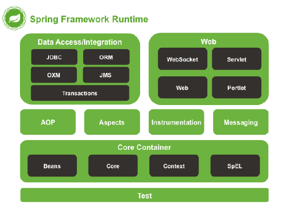

# 依赖注入

## 什么是IOC

IOC 全称指的是 Inverse Of Control 控制反转

控制反转指的是 对象的 创建 控制权的反转

在我们使用Spring之前。我们的对象创建都是由我们自己手动new出来一个对象比如：

BookDao bookDao = new BookDaoImpl();   自己手动的去创建

而使用了 Spring 之后。对象的创建是交给 Spring 容器来负责。这就是控制反转

## 什么是DI

DI 指的是 Dependency Injection 。是依赖注入的意思 

什么是依赖注入。举个例子。

在前面我们使用 BookService 处理业务的时候，都需要依赖 BookDao 去执行数据库的操作。而这个依赖的BookDao 对象，是由自己代码 new 创建并赋值的。

```java
public class BookServiceImpl implements BookService {
	private BookDao bookDao = new BookDaoImpl();
```

而在 Spring 中，我们只需要定义 BookDao 对象即可。然后把对象的赋值过程交给 Spring 来实现。

```java
public class BookServiceImpl implements BookService {
	private BookDao bookDao;
	public void setBookDao(BookDao bookDao) {
		this.bookDao = bookDao;
	}
}
```

## ==第一个IOC示例程序--通过id获取对象(重点)==

实验1：通过IOC容器创建对象，并为属性赋值★

### 第一步：先搭建Spring的开发环境


### 第二步：导入Spring开发需要的jar包

下面四个是Spring的核心包：

spring-beans-4.0.0.RELEASE.jar

spring-context-4.0.0.RELEASE.jar

spring-core-4.0.0.RELEASE.jar

spring-expression-4.0.0.RELEASE.jar

还有两个日记包：

commons-logging-1.1.3.jar

log4j-1.2.17.jar

在工程的src目录下，添加log4j日记需要的日记配置文件 log4j.properties 

```properties
# Global logging configuration
log4j.rootLogger=DEBUG, stdout
# Console output...
log4j.appender.stdout=org.apache.log4j.ConsoleAppender
log4j.appender.stdout.layout=org.apache.log4j.PatternLayout
log4j.appender.stdout.layout.ConversionPattern=%5p [%t] - %m%n
```

### 第三步：编写一个Java实体Bean对象---Person类

```java
public class Person {

	private int id;
	private String name;
	private int age;
	private String phone;
```

### 第四步：New一个Spring的配置文件(这个配置文件习惯取名叫applicationContext.xml或applicationContext.xml)


applicationContext.xml配置文件的内容如下：

```xml
<?xml version="1.0" encoding="UTF-8"?>
<beans xmlns="http://www.springframework.org/schema/beans"
	xmlns:xsi="http://www.w3.org/2001/XMLSchema-instance"
	xsi:schemaLocation="http://www.springframework.org/schema/beans http://www.springframework.org/schema/beans/spring-beans.xsd">
	<!-- 
		bean标签配置一个组件类======会由Spring容器来管理
			id 属性给bean添加唯一标识
			class 属性设置 配置的类的全类名
	 -->
	<bean id="person" class="com.atguigu.pojo.Person">
		<!-- property 标签 设置 属性信息 -->
		<property name="id" value="1" />
		<property name="name" value="张三" />
		<property name="age" value="18" />
		<property name="phone" value="18688888888" />
	</bean>
</beans>
```

### 第五步：编写Spring IOC的测试代码

```java
	@Test
	public void test1() {
		// applicationContext 就是 IOC容器
		// ClassPathXmlApplicationContext是容器的实现类
		ApplicationContext applicationContext = new ClassPathXmlApplicationContext("applicationContext.xml");
		// 从容器中获取 id 为 person 定义的对象
		Person person = (Person) applicationContext.getBean("person");
		System.out.println( person );
	}
```

运行结果：


### 问题：

1. FileSystemXmlApplicationContext怎么用?

```java
new FileSystemXmlApplicationContext("src/applicationContext.xml");
```

2. Bean是在什么时候被创建的?

答：Bean在new ClassPathXmlApplicationContext的时候会被创建。

3. 如果调用getBean多次，会创建几个?

答：默认情况下，多次调用，也只会返回同一个对象实例。

### 常见错误

如果在getBean的时候，传入的id不存在，就会报以下错误:

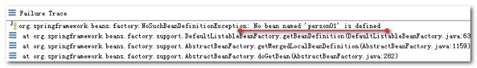


## ==IOC示例程序 -- 通过类型获取对象(重点)==

实验2：根据bean的类型从IOC容器中获取bean的实例★

示例程序代码:

当applicationContext.xml配置文件中，只有一个Person.class的对象实例配置的时候，程序是可以正常运行的。

```java
@Test
	public void test2() {
		// applicationContext 就是 IOC容器
		// ClassPathXmlApplicationContext是容器的实现类
		ApplicationContext applicationContext = new ClassPathXmlApplicationContext("classpath:applicationContext.xml");
		// 从容器中获取 id 为 person 定义的对象
		Person person = (Person) applicationContext.getBean(Person.class);
		System.out.println( person );
	}

```

在applicationContext.xml配置文件中：

```xml
<?xml version="1.0" encoding="UTF-8"?>
<beans xmlns="http://www.springframework.org/schema/beans"
	xmlns:xsi="http://www.w3.org/2001/XMLSchema-instance"
	xsi:schemaLocation="http://www.springframework.org/schema/beans http://www.springframework.org/schema/beans/spring-beans.xsd">
	<!-- 
		bean标签配置一个组件类======会由Spring容器来管理
			id 属性给bean添加唯一标识
			class 属性设置 配置的类的全类名
	 -->
	<bean id="person" class="com.atguigu.pojo.Person">
		<!-- property 标签 设置 属性信息 -->
		<property name="id" value="1" />
		<property name="name" value="张三" />
		<property name="age" value="18" />
		<property name="phone" value="18688888888" />
	</bean>
	
	<bean id="person02" class="com.atguigu.pojo.Person">
		<!-- property 标签 设置 属性信息 -->
		<property name="id" value="2" />
		<property name="name" value="李四" />
	</bean>
```

### 常见错误说明：

当在applicationContext.xml配置文件中。有多个同Person.class类型实现的时候。

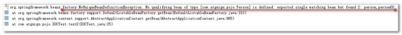

## IOC示例程序 -- 通过构造方法参数名注入值

实验3：通过构造器为bean的属性赋值

applicationContext.xml配置文件中的内容：

```xml
	<!-- int id, String name, int age, String phone -->
	<bean id="person03" class="com.atguigu.pojo.Person">
		<!-- constructor-arg 表示有参构造方法中的一个参数 -->
		<constructor-arg name="id" value="3"></constructor-arg>
		<constructor-arg name="name" value="王五"></constructor-arg>
		<constructor-arg name="age" value="18"></constructor-arg>
		<constructor-arg name="phone" value="18610101010"></constructor-arg>
	</bean>	
```

在Person类的有参构造方法中添加打印：


示例代码：

```java
@Test
	public void test3() {
		ApplicationContext applicationContext = new ClassPathXmlApplicationContext("applicationContext.xml");
		Person person03 = (Person) applicationContext.getBean("person03");
		System.out.println(person03);
	}
```

运行结果：


## IOC示例程序 -- index属性指定参数的位置

实验4：通过index属性指定参数的位置

applicationContext.xml配置文件中的内容：

```xml
<!-- int id, String name, int age, String phone -->
	<bean id="person04" class="com.atguigu.pojo.Person">
		<!-- index 表示参数的索引位置。索引值从零0开始算 -->
		<constructor-arg index="0" value="4"></constructor-arg>
		<constructor-arg index="1" value="王五"></constructor-arg>
		<constructor-arg index="3" value="18610101010"></constructor-arg>
    <constructor-arg index="2" value="18"></constructor-arg>
</bean>
```

示例代码：

```java
	@Test
	public void test4() {
		ApplicationContext applicationContext = new ClassPathXmlApplicationContext("applicationContext.xml");
		Person person04 = (Person) applicationContext.getBean("person04");
		System.out.println(person04);
	}
```

运行结果：

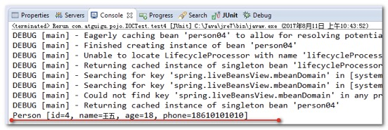

## IOC示例程序 -- 根据参数类型注入

实验5：根据参数类型注入

applicationContext.xml配置文件中的内容：

```xml
	<!-- int id, String name, int age, String phone -->
	<bean id="person05" class="com.atguigu.pojo.Person">
		<!-- index 表示参数的索引位置。索引值从零0开始算 -->
		<constructor-arg index="3" value="18610101010" type="java.lang.String"></constructor-arg>
		<constructor-arg index="1" value="王五" type="java.lang.String"></constructor-arg>
		<!-- 
           使用类型区分重载的构造函数
			这个地方有一点需要特别注意：
				如果代码中的类型是Integer , 那么type类型是 java.lang.Integer
				如果代码中的类型是int , 那么type类型是int
		 -->
		<constructor-arg index="2" value="18" type="int"></constructor-arg>
		<constructor-arg index="0" value="4" type="int"></constructor-arg>
	</bean>
```

示例代码：

```java
@Test
	public void test5() {
		ApplicationContext applicationContext = new ClassPathXmlApplicationContext("applicationContext.xml");
		Person person05 = (Person) applicationContext.getBean("person05");
		System.out.println(person05);
	}
```

运行结果：


## IOC之 P名称空间

p名称空间，是一种通过简短属性方式调用setXxx方法赋值属性的技术

实验6：通过p名称空间为bean赋值

先打开applicationContext.xml配置文件，添加P名称空间：

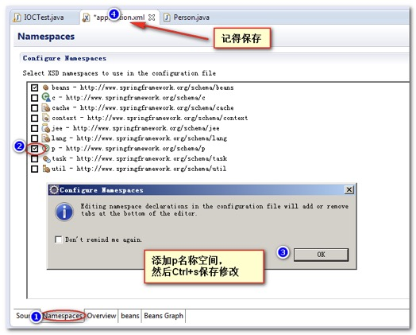

在applicationContext.xml中的配置

```xml
<!-- p名称空间，使用很简单。 p:属性="值" -->
	<bean id="person06" class="com.atguigu.pojo.Person" p:id="6" p:name="第6个人" p:age="18" p:phone="18600001111" />
```

示例代码:

```java
@Test
	public void test6() {
		ApplicationContext applicationContext = new ClassPathXmlApplicationContext("applicationContext.xml");
		Person person06 = (Person) applicationContext.getBean("person06");
		System.out.println(person06);
	}
```

运行结果：

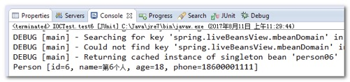

## 测试null值的使用

实验7：测试使用null值

修改Person类的属性，添加默认值

```java
public class Person {

	private int id;
	private String name;
	private int age;
  private String phone = "默认值";
```

applicationContext.xml中配置的内容

```xml
	<bean id="person07" class="com.atguigu.pojo.Person" p:id="7" p:age="18" p:name="第七个人">
		<property name="phone">
			<null />
		</property>
    </bean>
```

测试代码：

```java
@Test
	public void test7() {
		ApplicationContext applicationContext = new ClassPathXmlApplicationContext("applicationContext.xml");
		Person person07 = (Person) applicationContext.getBean("person07");
		System.out.println(person07);
	}
```

运行的结果

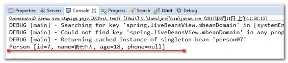

## ==IOC之子对象的赋值测试(重点)==

实验8：引用其他bean★

创建个新的工程。测试Spring的开发环境。此不重复。请参阅前面，环境搭建。

创建实体Bean对象

```java
public class Car {
	private String name;
	private String carNo;


public class Person {
	private int id;
	private String name;
	private int age;
	private String phone;
	private Car car;
```

在applicationContext.xml中配置如下

```xml
<!-- 
		定义一个车
	 -->
	<bean id="car" class="com.atguigu.pojo.Car" p:name="宝马" p:carNo="京A12312" />
	<!-- 
		定义一个Person类
	 -->
	<bean id="person10" class="com.atguigu.pojo.Person">
		<property name="id" value="10" />
		<property name="name" value="perosn10" />
		<property name="age" value="18" />
    <property name="phone" value="0101001" />
		<!-- ref 表示引用一个对象 -->
		<property name="car" ref="car" />
	</bean>
```

测试的代码：

```java
@Test
	public void test10() {
		//创建容器对象
		ApplicationContext applicationContext = new ClassPathXmlApplicationContext("applicationContext.xml");
		Person person10 = (Person) applicationContext.getBean("person10");
		System.out.println(person10);
	}
```

运行结果：


## IOC之内部Bean的使用

实验9：引用内部bean

在applicationContext.xml中的配置：

```xml
	<bean id="person11" class="com.atguigu.pojo.Person">
		<property name="id" value="10" />
		<property name="name" value="perosn10" />
		<property name="age" value="18" />
		<property name="phone" value="0101001" />
		<!-- ref 表示引用一个对象 -->
		<property name="car">
			<!-- 内部bean，内部bean只能作为赋值使用。不能通过容器获取 -->
			<bean id="car02" class="com.atguigu.pojo.Car" p:name="保时捷" p:carNo="京B12341"></bean>
		</property>
	</bean>
```

测试代码：

```java
	@Test
	public void test11() {
		//创建容器对象
		ApplicationContext applicationContext = new ClassPathXmlApplicationContext("applicationContext.xml");
		Person person11 = (Person) applicationContext.getBean("person11");
		System.out.println(person11);
		System.out.println( applicationContext.getBean("car02") );
	}
```

**内部的Bean不能被外部使用**


## IOC之List属性的赋值

实验10：使用list子元素为List类型的属性赋值

给Person类，添加List集合的属性：

```java
public class Person {

	private Integer id;
	private String name;
	private Car car;
	private List<Object> list;

	public List<Object> getList() {
		return list;
	}
	public void setList(List<Object> list) {
		this.list = list;
	}
```

在applicationContext.xml 配置文件中的内容：

```xml
<bean id="p10" class="com.atguigu.pojo.Person">
<property name="id" value="10" />
		<property name="name" value="p10闪存门"/>
		<property name="list">
			<!-- list标签表示配置一个集合赋值属性 -->
			<list>
				<value>item1</value>
				<value>item2</value>
				<value>item3</value>
				<!-- 内部bean，内部bean只能作为 赋值使用。不能通过容器获取 -->
				<bean id="car03" class="com.atguigu.pojo.Car">
					<property name="carNo" value="京B23421" />
					<property name="name" value="奔池"/>
				</bean>
			</list>
		</property>
	</bean>
```

测试的代码：

```java
@Test
	public void test3() throws Exception {
		ApplicationContext applicationContext = new ClassPathXmlApplicationContext("applicationContext.xml");
		System.out.println( applicationContext.getBean("p10") );
	}
```

运行的结果：


## IOC之Map属性的赋值

实验11：使用map子元素为Map类型的属性赋值

给Person对象添加Map属性

```java
public class Person {

	private Integer id;
	private String name;
	private Car car;
	private List<Object> list;
	private Map<String, Object> map;

	public Map<String, Object> getMap() {
		return map;
	}
	public void setMap(Map<String, Object> map) {
		this.map = map;
	}
```

在applicationContext.xml中的配置

```xml
	<bean id="p11" class="com.atguigu.pojo.Person">
		<property name="id" value="11" />
		<property name="name" value="p11" />
		<property name="map">
			<!-- 
				map标签表示配置一个map集合给属性赋值
			 -->
			<map>
				<!-- entry是map集合中的每一项 -->
				<entry key="key1" value="value1" />
				<entry key="key2" value="value2" />
				<entry key="key3" value-ref="car" />
			</map>
		</property>
	</bean>
```

测试的代码：

```java
@Test
	public void test4() throws Exception {
		ApplicationContext applicationContext = new ClassPathXmlApplicationContext("applicationContext.xml");
		System.out.println( applicationContext.getBean("p11") );
	}
```

运行结果


## IOC之Properties属性的赋值

实验12：使用prop子元素为Properties类型的属性赋值

给Person对象添加Properties属性

```java
public class Person {
	private int id;
	private String name;
	private int age;
	private String phone;
	private Car car;
	private List<String> phones;
	private Map<String, Object> map;
	private Properties props;
```

在applicationContext.xml中的配置

```xml
<bean id="person14" class="com.atguigu.pojo.Person">
		<property name="id" value="10" />
		<property name="name" value="perosn10" />
		<property name="age" value="18" />
		<property name="phone" value="0101001" />
		<!-- map对象 -->
		<property name="props">
			<props>
				<prop key="username">root</prop>
				<prop key="password">root</prop>
				<prop key="drivers">com.mysql.jdbc.Driver</prop>
				<prop key="url">jdbc:mysql://localhost:3306/spring</prop>
			</props>
		</property>
    </bean>
```

测试的代码

```java
	@Test
	public void test14() {
		//创建容器对象
		ApplicationContext applicationContext = new ClassPathXmlApplicationContext("applicationContext.xml");
		Person person14 = (Person) applicationContext.getBean("person14");
		System.out.println(person14);
	}
```

运行结果：

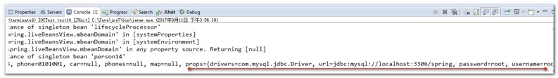

## IOC之Set类型属性赋值

给Person添加set类型的属性

```java
public class Person {
	private Integer id;
	private String name;
	private Car car;
	private List<Object> list;
	private Map<String, Object> map;
	private Properties props;
	private Set<Object> set;
  public Set<Object> getSet() {
		return set;
	}
	public void setSet(Set<Object> set) {
		this.set = set;
	}
```

applicationContext.xml配置文件：

```xml
	<bean id="pset" class="com.atguigu.pojo.Person">
		<property name="id" value="100" />
		<property name="set">
			<!-- 
				set标签配置一个Set集合赋值给属性
			 -->
			<set>
				<!-- value 表示集合中一个字符串值 -->
				<value>value1</value>
				<value>value2</value>
				<!-- ref 表示引用一个bean对象 -->
				<ref bean="car"/>
			</set>
		</property>
	</bean>
```

测试的代码：

```java
@Test
	public void test6() throws Exception {
		ApplicationContext applicationContext = new ClassPathXmlApplicationContext("applicationContext.xml");
		System.out.println( applicationContext.getBean("pset") );
	}
```

运行j结果：

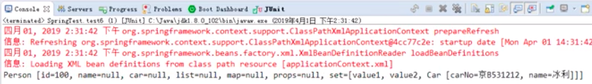

## IOC之util 名称空间

util名称空间，可以定义公共的集合类型数据。供外部和内部引用使用

实验13：通过util名称空间创建集合类型的bean

添加util名称空间

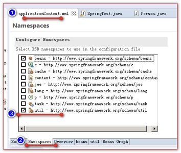

applicationContext.xml配置文件

```xml
	<!-- 使用util名称空间定义一个公共的，可供别人引用的list集合 -->
	<util:list id="list01">
		<value>list1</value>
		<value>list2</value>
		<value>list3</value>
		<value>list4</value>
	</util:list>
	<bean id="p13" class="com.atguigu.pojo.Person">
		<property name="id" value="13"></property>
		<!-- 把list01的id对象。赋值给list属性 -->
		<property name="list" ref="list01"></property>
	</bean>
```

测试代码：

```java
@Test
	public void test7() throws Exception {
		ApplicationContext applicationContext = new ClassPathXmlApplicationContext("applicationContext.xml");

		System.out.println( applicationContext.getBean("p13") );
		System.out.println( applicationContext.getBean("list01") );
		
	}
```

运行结果：

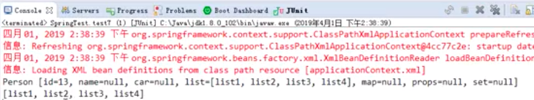

## IOC之级联属性赋值

实验14：给bean的级联属性赋值

applicationContext.xml配置文件

```xml
	<bean id="car" class="com.atguigu.pojo.Car">
		<property name="carNo" value="京B531212" />
		<property name="name" value="冰利"/>
	</bean>
	
	<bean id="p14" class="com.atguigu.pojo.Person">
		<property name="id" value="14" />
		<property name="car" ref="car" />
		<!-- spring中可以使用级联属性方式赋值，但，赋值前这个子对象一定要先有值 -->
		<property name="car.carNo" value="京A123412"/>
	</bean>
```

测试代码：

```java
	@Test
	public void test8() throws Exception {
		ApplicationContext applicationContext = new ClassPathXmlApplicationContext("applicationContext.xml");
		System.out.println( applicationContext.getBean("p14") );
		System.out.println( applicationContext.getBean("car") );
	}
```

运行结果：

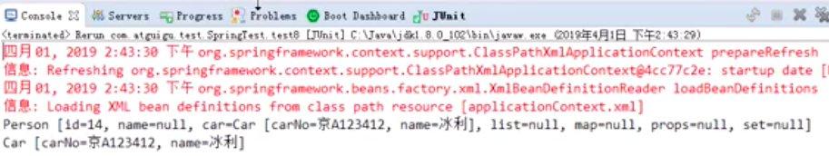

常见错误：

级联属性一定要先注入对象。再注入对象的属性


## IOC之静态工厂方法创建Bean

实验15：配置通过静态工厂方法创建的bean

创建Person的工厂类

```java
public class PersonFactory {

	public static Person createPerson() {
		return new Person(15, "静态工厂方法创建的bean对象", null);
	}
}
```

在applicationContext.xml中的配置：

```xml
<!-- 
		配置调用静态工厂方法创建Bean对象
			class 配置工厂类的全类名
			factory-method 调用工厂类的哪个方法
	 -->
	<bean id="p15" class="com.atguigu.factory.PersonFactory" factory-method="createPerson" />
```

测试的代码：

```java
@Test
	public void test9() throws Exception {
		ApplicationContext applicationContext = new ClassPathXmlApplicationContext("applicationContext.xml");
		
		System.out.println( applicationContext.getBean("p15") );
	}
```

运行结果：

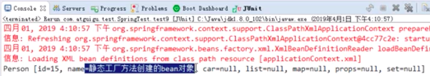

## IOC之工厂实例方法创建Bean

实验16：配置通过实例工厂方法创建的bean

创建Person工厂:

```java
public class PersonFactory {
	
	public Person createPerson2() {
		return new Person(16, "工厂实例方法创建的bean对象", null);
	}
	
}
```

applicationContext.xml中的配置：

```xml
<!-- 1、在spring容器中创建一个bean对象
		 2、配置调用工厂实例的方法
	 -->
	<bean id="personFactory" class="com.atguigu.factory.PersonFactory"/>
	<!-- 
		class属性和factory-method组合是静态工厂方法
		factory-bean 和 factory-method 组合是工厂实例方法
		
		factory-bean 使用哪个bean对象做为工厂实例
		factory-method 调用工厂类实例的哪个方法
	 -->
	<bean id="p16" factory-bean="personFactory" factory-method="createPerson2"></bean>
```

测试代码：

```java
	@Test
	public void test10() throws Exception {
		ApplicationContext applicationContext = new ClassPathXmlApplicationContext("applicationContext.xml");
		
		System.out.println( applicationContext.getBean("p16") );
		
	}
```

运行结果：


## IOC之FactoryBean接口方式创建对象

实验17：配置FactoryBean接口创建Bean对象

实现FactoryBean接口

```java
public class PersonFacotryBean implements FactoryBean<Person> {
	/**
	 * 创建bean对象的方法
	 */
	@Override
	public Person getObject() throws Exception {
		return new Person(17, "这是FactoryBean接口创建的bean", null);
	}
	/**
	 * 获取bean的具体类型的方法
	 */
	@Override
	public Class<?> getObjectType() {
		return Person.class;
	}
	/**
	 * 判断是否是单例的方法
	 */
	@Override
	public boolean isSingleton() {
		return true;
	}

}
```

applicationContext.xml配置文件：

```xml
<!-- 
		如果指定的Class是实现了Spring的FactoryBean接口，
			Spring容器本身会自动的判断，如果有实现这个FactoryBean接口，
			创建对象的时候，就会调用 getObject()返回对象
	 -->
	<bean id="p17" class="com.atguigu.factory.PersonFacotryBean"></bean>
```

测试的代码：

```java
@Test
	public void test11() throws Exception {
		ApplicationContext applicationContext = new ClassPathXmlApplicationContext("applicationContext.xml");
		
		System.out.println( applicationContext.getBean("p17") );
		
	}
```

运行结果：

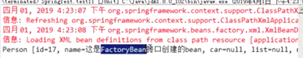

## IOC之继承Bean配置

实验18：通过继承实现bean配置信息的重用

applicationContext.xml配置文件：

```xml
<bean id="parent" class="com.atguigu.pojo.Person">
		<property name="id" value="100" />
		<property name="name" value="我是父亲" />
		<property name="list">
			<list>
				<value>list1</value>
				<value>list2</value>
				<value>list3</value>
			</list>
		</property>
	</bean>
	<!-- parent属性设置你要继承哪个id的配置 -->
	<bean id="p18" class="com.atguigu.pojo.Person" parent="parent">
		<property name="name" value="我是子"></property>
	</bean>

```

测试代码：

```java
@Test
	public void test12() throws Exception {
		ApplicationContext applicationContext = new ClassPathXmlApplicationContext("applicationContext.xml");
		
		System.out.println( applicationContext.getBean("p18") );
		
	}
```

运行结果：

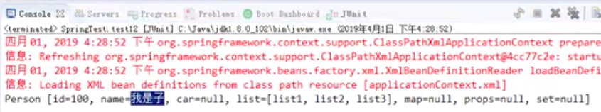

## IOC之abstract抽象Bean

abstract的bean配置，就是为了让其他的bean做继承使用。而不能实例化

实验19：通过abstract属性创建一个模板bean

applicationContext.xml配置文件：

```xml
<!-- 
	abstract="true"表示这个bean，不能被实例化，而只能被继承使用
	 -->
	<bean id="parent" class="com.atguigu.pojo.Person" abstract="true">
		<property name="id" value="100" />
		<property name="name" value="我是父亲" />
		<property name="list">
			<list>
				<value>list1</value>
				<value>list2</value>
				<value>list3</value>
			</list>
		</property>
	</bean>
	<!-- parent属性设置你要继承哪个id的配置 -->
	<bean id="p18" class="com.atguigu.pojo.Person" parent="parent">
		<property name="name" value="我是子"></property>
	</bean>
```

测试代码：

```java
@Test
	public void test12() throws Exception {
		ApplicationContext applicationContext = new ClassPathXmlApplicationContext("applicationContext.xml");
		
		System.out.println( applicationContext.getBean("parent") );
		System.out.println( applicationContext.getBean("p18") );
		
	}
```

抛出异常：

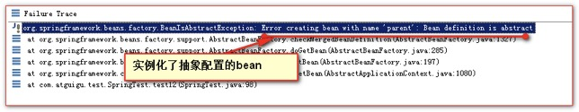

## IOC之组件创建顺序

实验20：bean之间的依赖  depends-on 属性

bean对象

```java
public class A {
	public A() {
		System.out.println("A 被创建了");
	}
}
public class B {
	public B() {
		System.out.println("B 被创建了");
	}
}
public class C {
	public C() {
		System.out.println("C 被创建了");
	}
}
```

applicationContext.xml配置：

```xml
<!-- 默认情况下。bean对象创建的顺序，是从上到下
			depends-on 可以设定依赖
	 -->
	<bean id="a" class="com.atguigu.pojo.A" depends-on="b,c"/>
	<bean id="b" class="com.atguigu.pojo.B" />
	<bean id="c" class="com.atguigu.pojo.C" />
```

测试代码：

```java
	@Test
	public void test1() throws Exception {
		ApplicationContext applicationContext = new ClassPathXmlApplicationContext("applicationContext.xml");
	}
```

运行结果：

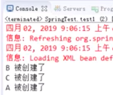

## 基于xml配置文件的自动注入autowire

先创建Person类和Car类

```java
public class Car {
	private String carNo;
	private String name;

public class Person {

	private Car car;

	public Person(Car car) {
		this.car = car;
	}
```

applicationContext.xml配置文件：

```xml
<bean id="car1" class="com.atguigu.pojo.Car">
		<property name="carNo" value="京B23412" />
		<property name="name" value="劳死来死"/>
	</bean>
	<bean id="car" class="com.atguigu.pojo.Car">
		<property name="carNo" value="京B23412" />
		<property name="name" value="劳死来死2"/>
	</bean>
	<!-- 
		autowire 属性设置是否自动查找bean对象并给子对象赋值
		
		default 和 no 表示不自动查找并注入（你不赋值，它就null）
		byName 	是指通过属性名做为id来查找bean对象，并注入
					1、找到就注入
					2、找不到就为null
		byType  是指按属性的类型进行查找并注入
					1、找到一个就注入
					2、找到多个就报错
					3、没有找到就为null
		constructor 是指按构造器参数进行查找并注入。
					1、先按照构造器参数类型进行查找并注入
					2、如果按类型查找到多个，接着按参数名做为id继续查找并注入。
					3、按id查找不到，就不赋值。
	 -->
	<bean id="p19" class="com.atguigu.pojo.Person" autowire="constructor">
		<property name="name" value="p19" />
	</bean>
```

测试代码：

```java
	@Test
	public void test2() throws Exception {
		ApplicationContext applicationContext = new ClassPathXmlApplicationContext("applicationContext.xml");
		System.out.println(applicationContext.getBean("p19"));
	}
```

运行结果：


## ==IOC之Bean的单例和多例(重点)==

实验21：测试bean的作用域，分别创建单实例和多实例的bean★

applicationContext.xml配置文件：

```xml
<!-- 
		scope 属性设置对象的域
			singleton			表示单例（默认）
								1、Spring容器在创建的时候，就会创建Bean对象
								2、每次调用getBean都返回spring容器中的唯一一个对象
								
			prototype			表示多例
								1、多例在Spring容器被创建的时候，不会跟着一起被创建。
								2、每次调用getBean都会创建一个新对象返回
								
			request				在一次请求中，多次调用getBean方法都是返回同一个实例。
			
								getBean("p20"); 底层大概的实现原理
									
								Object bean = request.getAttribute("p20");
								if (bean == null) {
									bean = new 对象();
									request.setAttribute("p20",bean);
								}
								return bean;
								
								
			session				在一个会话中，多次调用getBean方法都是返回同一个实例。
			
								getBean("p20"); 底层大概的实现原理
									
								Object bean = session.getAttribute("p20");
								if (bean == null) {
									bean = new 对象();
									session.setAttribute("p20",bean);
								}
								return bean;
	 -->
	<bean id="p20" class="com.atguigu.pojo.Person" scope="singleton">
		<property name="name" value="p20" />
	</bean>
```

测试代码：

```java
	@Test
	public void test3() throws Exception {
		ApplicationContext applicationContext = new ClassPathXmlApplicationContext("applicationContext.xml");
		System.out.println( applicationContext.getBean("p20") );
		System.out.println( applicationContext.getBean("p20") );
		System.out.println( applicationContext.getBean("p20") );
		System.out.println( applicationContext.getBean("p20") );
		
	}
```

scope="singleton" -- 每次getBean都是同一个对象

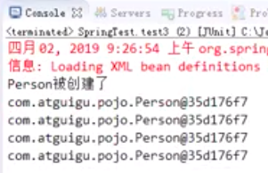

scope="prototype" -- 每次getBean重新创建一个对象

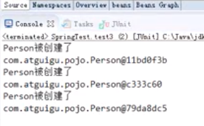

# 对象的生命周期

## IOC之Bean的生命周期

实验22：创建带有生命周期方法的bean

给Persion添加方法：

```java
public class Person {

	private String name;
	private Car car;

	public void init() {
		System.out.println("初始化方法");
	}
	
	public void destroy() {
		System.out.println("销毁的方法");
	}
	
	public Person() {
		super();
		System.out.println("Person被创建了");
	}
```

applicationContext.xml配置文件：

```xml
	<!-- 
		init-method配置初始化方法(bean对象创建之后)
		destroy-method配置销毁方法（在spring容器关闭的时候,只对单例有效）
	 -->
<bean id="p21" class="com.atguigu.pojo.Person" init-method="init" destroy-method="destroy" scope="singleton">
		<property name="name" value="p21"/>
	</bean>
```

测试的代码：

```java
@Test
	public void test4() throws Exception {
		ConfigurableApplicationContext applicationContext = new ClassPathXmlApplicationContext("applicationContext.xml");
		applicationContext.getBean("p21");
		applicationContext.close();
	}
```

运行结果：


## Bean的后置处理器BeanPostProcessor

后置处理器，可以在bean对象的初始化方法前/后，做一些工作

后置处理器使用步骤：

	 编写一个类去实现BeanPostProcessor接口
 	2. 到Spring容器配置文件中配置

实验23：测试bean的后置处理器

代码：

```java
public class MyBeanPostProcessor implements BeanPostProcessor {
	/**
	 * 初始化方法之后调用
	 */
	@Override
	public Object postProcessAfterInitialization(Object bean, String id) throws BeansException {
		System.out.println("初始化方法之后。正在初始化的对象bean->" + bean + ",正在初始化对象的id值->" + id);
		
		if ("p21".equals(id)) {
			Person person = (Person) bean;
			person.setName("这是我给的值");
		}
		
		return bean;
	}

	/**
	 * 初始化方法之前调用
	 */
  	@Override
	public Object postProcessBeforeInitialization(Object bean, String id) throws BeansException {
		System.out.println("初始化方法之前。正在初始化的对象bean->" + bean + ",正在初始化对象的id值->" + id);
		return bean;
	}

}
```

applicationContext.xml配置:

```xml
<bean id="p21" class="com.atguigu.pojo.Person" init-method="init" destroy-method="destroy" scope="singleton">
		<property name="name" value="p21"/>
</bean>
	<!-- 配置自定义的后置处理器 -->
	<bean class="com.atguigu.postprocessor.MyBeanPostProcessor" />
```

测试代码：

```java
@Test
	public void test4() throws Exception {
		ConfigurableApplicationContext applicationContext = new ClassPathXmlApplicationContext("applicationContext.xml");
		System.out.println( applicationContext.getBean("p21") );
		applicationContext.close();
	}
```

运行结果：


# ==Spring管理数据库连接池(重点)==

## ==Spring配置管理数据库连接池对象(重点)==

创建一个Java工程。


导入jar包

commons-logging-1.1.3.jar

druid-1.1.9.jar

mysql-connector-java-5.1.37-bin.jar

spring-beans-4.3.18.RELEASE.jar

spring-context-4.3.18.RELEASE.jar

spring-core-4.3.18.RELEASE.jar

spring-expression-4.3.18.RELEASE.jar

applicationContext.xml配置：

```xml
<?xml version="1.0" encoding="UTF-8"?>
<beans xmlns="http://www.springframework.org/schema/beans"
	xmlns:xsi="http://www.w3.org/2001/XMLSchema-instance"
	xsi:schemaLocation="http://www.springframework.org/schema/beans http://www.springframework.org/schema/beans/spring-beans.xsd">

	<bean id="dataSource" class="com.alibaba.druid.pool.DruidDataSource">
		<property name="username" value="root" />
		<property name="password" value="root" />
		<property name="driverClassName" value="com.mysql.jdbc.Driver" />
		<property name="url" value="jdbc:mysql://localhost:3306/test" />
		<property name="initialSize" value="5" />
		<property name="maxActive" value="10" />
	</bean>

</beans>
```

测试代码：

```java
	@Test
	public void test1() throws Exception {
		ApplicationContext applicationContext = new ClassPathXmlApplicationContext("applicationContext.xml");
		
		DataSource dataSource = (DataSource) applicationContext.getBean("dataSource");
		
		System.out.println( dataSource.getConnection() );
```

运行结果：


## ==Spring引入单独的jdbc.properties配置文件(重点)==

创建jdbc.properties属性配置文件

```properties
username=root
password=root
driverClassName=com.mysql.jdbc.Driver
url=jdbc:mysql://localhost:3306/test
initialSize=5
maxActive=10
```

applicationContext.xml配置文件：

```xml
<?xml version="1.0" encoding="UTF-8"?>
<beans xmlns="http://www.springframework.org/schema/beans"
	xmlns:xsi="http://www.w3.org/2001/XMLSchema-instance"
	xsi:schemaLocation="http://www.springframework.org/schema/beans http://www.springframework.org/schema/beans/spring-beans.xsd">

	<!-- PropertyPlaceholderConfigurer类专门用来加载properties属性配置文件 -->
	<bean class="org.springframework.beans.factory.config.PropertyPlaceholderConfigurer">
		<!-- location属性设置你要加载的文件路径 
					classpath: 表示从类路径下搜索
		-->
		<property name="location" value="classpath:jdbc.properties" />
	</bean>
  <bean id="dataSource" class="com.alibaba.druid.pool.DruidDataSource">
		<property name="username" value="${username}" />
		<property name="password" value="${password}" />
		<property name="driverClassName" value="${driverClassName}" />
		<property name="url" value="${url}" />
		<property name="initialSize" value="${initialSize}" />
		<property name="maxActive" value="${maxActive}" />
	</bean>

</beans>
```

## ==使用context名称空间加载jdbc.properties配置文件(重点)==

添加context名称空间：


修改jdbc.properties属性配置文件:

```properties
user=root
password=root
driverClassName=com.mysql.jdbc.Driver
url=jdbc:mysql://localhost:3306/test
initialSize=5
maxActive=10
```

applicationContext.xml配置文件：

```xml
<!-- 标签用来代替PropertyPlaceholderConfigurer加载属性配置文件 -->
	<context:property-placeholder location="classpath:jdbc.properties"/>
	
	<bean id="dataSource" class="com.alibaba.druid.pool.DruidDataSource">
		<property name="username" value="${user}" />
		<property name="password" value="${password}" />
		<property name="driverClassName" value="${driverClassName}" />
		<property name="url" value="${url}" />
		<property name="initialSize" value="${initialSize}" />
		<property name="maxActive" value="${maxActive}" />
	</bean>
```

# Spring EL表达式(了解内容）

## SqEL概述

Spring Expression Language，Spring表达式语言，简称SpEL。支持运行时查询并可以操作对象图。

和JSP页面上的**EL**表达式、Struts2中用到的**OGNL**表达式一样，SpEL根据 JavaBean 风格的`getXxx()`、`setXxx()`方法定义的属性**访问对象图，**完全符合我们熟悉的操作习惯

## 基本语法

SpEL使用**#{…}**作为定界符，所有在大框号中的字符都将被认为是SpEL表达式

## 使用字面量

* 整数： <property name="count" value="**#{5}**"/>

* 小数：<property name="frequency" value="**#{89.7}**"/>
* 科学计数法：<property name="capacity" value="**#{1e4}**"/>
* String类型的字面量可以使用单引号或者双引号作为字符串的定界符号
  * <property name="name" value=**"#{'Chuck'}"**/>
  * <property name='name' value=**'#{"Chuck"}'**/>
* Boolean：<property name="enabled" value="**#{false}**"/>

## 引用其他bean

```xml
<bean id="emp04" class="com.atguigu.parent.bean.Employee">
	<property name="empId" value="1003"/>
	<property name="empName" value="Kate"/>
	<property name="age" value="21"/>
	<property name="detp" value="#{dept}"/>
</bean>
```

## 引用其他bean的属性值作为自己某个属性的值

```xml
<bean id="emp05" class="com.atguigu.parent.bean.Employee">
	<property name="empId" value="1003"/>
	<property name="empName" value="Kate"/>
	<property name="age" value="21"/>
	<property name="deptName" value="#{dept.deptName}"/>
</bean>
```

## 调用非静态方法

```xml
<!-- 创建一个对象，在SpEL表达式中调用这个对象的方法 -->
<bean id="salaryGenerator" class="com.atguigu.spel.bean.SalaryGenerator"/>

<bean id="employee" class="com.atguigu.spel.bean.Employee">
	<!-- 通过对象方法的返回值为属性赋值 -->
	<property name="salayOfYear" value="#{salaryGenerator.getSalaryOfYear(5000)}"/>
</bean>
```

## 调用静态方法

```xml
<bean id="employee" class="com.atguigu.spel.bean.Employee">
	<!-- 在SpEL表达式中调用类的静态方法 -->
	<property name="circle" value="#{T(java.lang.Math).PI*20}"/>
</bean>
```

## 运算符

* 算术运算符：+、-、*、/、%、^

* 字符串连接：+

* 比较运算符：<、>、==、<=、>=、lt、gt、eq、le、ge

* 逻辑运算符：and, or, not, |

* 三目运算符：判断条件?判断结果为true时的取值:判断结果为false时的取值

## 运用测试

创建java实体Bean对象

```java
public class Person {
	private int id;
	private String name;
	private String phone;
	private double salary;
	private Car car;


public class Car {

	private String name;
	private String carNo;
  public String fun() {
		return "国哥最帅！";
	}

	public static String staticFun() {
		return "静态方法也改变不了帅的事实！";
	}
```

applicationContext.xml配置：

```xml
<bean id="car" class="com.atguigu.pojo.Car">
		<property name="carNo" value="京B123412" />
		<property name="name" value="蓝脖鸡泥" />
	</bean>
	<bean id="person" class="com.atguigu.pojo.Person">

<!-- 实验26：[SpEL测试I]在SpEL中使用字面量 -->
<!-- 使用格式：#{数值} 		#{“字符串” || ‘字符串’} -->
		<property name="id" value="#{100}" />
<!-- 		<property name="name" value="#{'我是SpringEL输出的字符串'}" /> -->
<!-- 实验27：[SpEL测试II]在SpEL中引用其他bean -->
<!-- 使用格式：#{bean的id} -->
		<property name="car" value="#{car}"></property>
<!-- 实验28：[SpEL测试III]在SpEL中引用其他bean的某个属性值 -->
<!-- 使用格式： #{bean.属性名} -->
<!-- 		<property name="name" value="#{car.name}"></property> -->
<!-- 实验29：[SpEL测试IV]在SpEL中调用非静态方法 -->
<!-- 使用格式： #{bean.方法名(参数)} -->
<!-- 		<property name="name" value="#{car.fun()}"></property> -->
<!-- 实验30：[SpEL测试V]在SpEL中调用静态方法 -->
<!-- 使用格式：#{T(全名类).方法名(参数)} -->
		<property name="name" value="#{T(com.atguigu.pojo.Car).staticFun()}"></property>

<!-- 实验31：[SpEL测试VI]在SpEL中使用运算符 -->
<!-- 使用格式：#{表达式} -->
		<property name="salary" value="#{10000 * 10}" />
	</bean>
```

# ==注解功能(极其重要)==

## 注解配置Dao、Service、Controller组件

实验32：通过注解分别创建 Dao、Service、Controller ★

Spring 配置 bean 的常用注解有

@Controller	 		配置控制器

@Service				service业务层组件

@Repository			持久层dao组件

@Component			除了以上三种都可以用component

@Scope				配置作用域（单例，多例）


创建相关的类


相关的注释：

```java
/**
 * @Component 注解表示<br/>
 * <bean id="book" class="com.atguigu.pojo.Book" />
 */
@Component
public class Book {
}

/**
 * @Repository 注解表示<br/>
 * <bean id="bookDao" class="com.atguigu.dao.BookDao" /><br/>
 * @Repository("abc") 表示
 * <bean id="abc" class="com.atguigu.dao.BookDao" /><br/>
 */
@Repository
@Scope("prototype")
public class BookDao {
}
/**
 * @Service 注解表示<br/>
 * <bean id="bookService" class="com.atguigu.service.BookService" />
 */
@Service
public class BookService {
}
/**
 * @Controller 注解表示<br/>
 * <bean id="bookController" class="com.atguigu.controller.BookController" />
 */
@Controller
public class BookController {
}
```

先打开applicationContext.xml配置文件，添加context名称空间：


applicationContext.xml配置文件:

```xml
<!-- 配置包扫描
			base-package	设置需要扫描的包名（它的子包也会被扫描）
	 -->
	<context:component-scan base-package="com.atguigu"></context:component-scan>
```

测试代码：

```java
@Test
	public void test1() throws Exception {

		ApplicationContext applicationContext = new ClassPathXmlApplicationContext("applicationContext.xml");

		System.out.println(applicationContext.getBean("bookDao"));
		System.out.println(applicationContext.getBean("bookDao"));
		System.out.println(applicationContext.getBean("bookDao"));
		System.out.println(applicationContext.getBean("book"));
		System.out.println(applicationContext.getBean("bookService"));
		System.out.println(applicationContext.getBean("bookController"));

	}
```

运行结果：


## 指定扫描包时的过滤内容

实验33：使用context:include-filter指定扫描包时要包含的类

实验34：使用context:exclude-filter指定扫描包时不包含的类

<context:include-filter />	设置包含的内容

**注意：**通常需要与use-default-filters属性配合使用才能够达到"仅包含某些组件"这样的效果。即：通过将use-default-filters属性设置为false，

<context:exclude-filter />	设置排除的内容

| 类别       | 示例                      | 说明                                                         |
| ---------- | ------------------------- | ------------------------------------------------------------ |
| annotation | com.atguigu.XxxAnnotation | 过滤所有标注了XxxAnnotation的类。这个规则根据目标组件是否标注了指定类型的注解进行过滤 |
| assignable | com.atguigu.BaseXxx       | 过滤所有BaseXxx类的子类。这个规则根据目标组件是否是指定类型的子类的方式进行过滤。 |
| aspectj    | com.atguigu.*Service+     | 所有类名是以Service结束的，或这样的类的子类。这个规则根据AspectJ表达式进行过滤。 |
| regex      | com\.atguigu\.anno\.*     | 所有com.atguigu.anno包下的类。这个规则根据正则表达式匹配到的类名进行过滤。 |
| custom     | com.atguigu.XxxTypeFilter | 使用XxxTypeFilter类通过编码的方式自定义过滤规则。该类必须实现org.springframework.core.type.filter.TypeFilter接口 |

applicationContext.xml	中配置的内容如下

```xml
<!-- 配置包扫描
			base-package	设置需要扫描的包名（它的子包也会被扫描）
			use-default-filters="false" 去掉包扫描时默认包含规则
	 -->
	<context:component-scan base-package="com.atguigu" use-default-filters="false">
		<!-- context:include-filter 设置包含的内容 -->
		<context:include-filter type="annotation" expression="org.springframework.stereotype.Service"/>
		<!-- context:exclude-filter 设置排除的内容 -->
		<context:exclude-filter type="assignable" expression="com.atguigu.service.BookService"/>
	</context:component-scan>
```

以上配置会包含所有@Service注解的类。排除com.atguigu.service.BookService类

## 使用注解@Autowired自动装配

实验35：使用 @Autowired 注解实现根据类型实现自动装配★

@Autowired 注解 会自动的根据标注的==对象类型==在 Spring 容器中查找相对应的类。如果找到，就自动装配。

使用@Autowired注解，不需要get/set方法

```java
@Service
public class BookService {
	/**
	 * @Autowired 实现自动注入<br/>
	 * 	1、先按类型查找并注入<br/>
	 */
	@Autowired
	private BookDao bookDao;

	@Override
	public String toString() {
		return "BookService [bookDao=" + bookDao + "]";
	}

}
```

## 多个同类型的bean如何自动装配

实验36：如果资源类型的bean不止一个，默认根据 @Autowired 注解标记的==成员变量名==作为id查找bean，进行装配★

```java
@Repository
@Scope("prototype")
public class BookDao {
}
@Repository
public class BookDaoExt extends BookDao{
}
@Service
public class BookService {
	/**
	 * @Autowired 实现自动注入<br/>
	 * 	1、先按类型查找并注入<br/>
	 *  2、如果找到多个，就接着按属性名做为id继续查找并注入<br/>
	 */
	@Autowired
	private BookDao bookDao;

	@Override
	public String toString() {
		return "BookService [bookDao=" + bookDao + "]";
	}

}
```

测试代码：

```java
@Test
	public void test1() throws Exception {
		ApplicationContext applicationContext = new ClassPathXmlApplicationContext("applicationContext.xml");
		System.out.println(applicationContext.getBean("bookService"));
	}
```

运行结果：


## 使用@Qualifier装配指定id的bean对象

实验37：如果根据成员变量名作为id还是找不到bean，可以使用@Qualifier注解明确指定目标bean的id★

```java
@Service
public class BookService {
	/**
	 * @Autowired 实现自动注入<br/>
	 * 	1、先按类型查找并注入<br/>
	 *  2、如果找到多个，就接着按属性名做为id继续查找并注入<br/>
	 *  3、如果找到多个。但是属性名做为id找不到，可以使用@Qualifier("bookDao")注解指定id查找并注入<br/>
	 */
	@Autowired
	@Qualifier("bookDaoExt")
	private BookDao bookDao1;

	@Override
	public String toString() {
		return "BookService [bookDao=" + bookDao1 + "]";
	}

}
```

运行结果：


## @Autowired注解的required属性作用

实验39：@Autowired注解的required属性指定某个属性允许不被设置

```java
@Service
public class BookService {
	/**
	 * @Autowired 实现自动注入<br/>
	 * 	1、先按类型查找并注入<br/>
	 *  2、如果找到多个，就接着按属性名做为id继续查找并注入<br/>
	 *  3、如果找到多个。但是属性名做为id找不到，可以使用@Qualifier("bookDao")注解指定id查找并注入<br/>
	 *  4、可以通过修改@Autowired(required=false)允许字段值为null
	 */
	@Autowired(required=false)
	@Qualifier("bookDaoExt1")//bookDaoExt1 随意写的，代码中没定义此类
	private BookDao bookDao1;

	@Override
	public String toString() {
		return "BookService [bookDao=" + bookDao1 + "]";
	}

}
```

## @Autowired和@Qualifier在方法上的使用

实验38：在方法的形参位置使用@Qualifier注解

```java
	/**
	 * @Autowired标注在方法上，那么此方法会在对象创建之后调用。
	 * 		1、先按类型查找参数并调用方法传递<br/>
	 * 		2、如果找到多个，就接着按参数名做为id继续查找并注入<br/>
	 *		3、如果找到多个。但是参数名做为id找不到，可以使用@Qualifier("bookDao")注解指定id查找并调用<br/>
	 *     4、可以通过修改@Autowired(required=false)允许不调用此方法也不报错
	 */
	@Autowired(required=false)
	public void setBookDao(@Qualifier("bookDaoExt1")BookDao abc) {
		System.out.println("BookDao进来啦 --->>> " + abc);
	}
```

## 泛型注入(了解内容)

实验40：测试泛型依赖注入★

创建以下类：


dao层:

```java
package com.atguigu.dao;
public abstract class BaseDao<T> {
	public abstract void save(T entity);
}
```

```java
package com.atguigu.dao;
import org.springframework.stereotype.Repository;
import com.atguigu.pojo.Book;

@Repository
public class BookDao extends BaseDao<Book> {
	@Override
	public void save(Book entity) {
		System.out.println("BookDao 保存 -> " + entity);
	}
}

```

```java
package com.atguigu.dao;
import org.springframework.stereotype.Repository;
import com.atguigu.pojo.User;

@Repository
public class UserDao extends BaseDao<User> {
	@Override
	public void save(User entity) {
		System.out.println("UserDao 保存 -> " + entity);
	}
}

```

pojo:

```java
package com.atguigu.pojo;

public class Book {
}
```

```java
package com.atguigu.pojo;

public class User {
}
```

Service：

```java
package com.atguigu.service;
import org.springframework.beans.factory.annotation.Autowired;
import com.atguigu.dao.BaseDao;

public abstract class BaseService<T> {
	@Autowired
	private BaseDao<T> baseDao;//子类确认时候，如何选择哪一个子类？
	public void save(T entity) {
		baseDao.save(entity);
	}
}
```

```java
package com.atguigu.service;
import org.springframework.stereotype.Service;
import com.atguigu.pojo.Book;

@Service
public class BookService extends BaseService<Book> {
}
```

```java
package com.atguigu.service;
import org.springframework.stereotype.Service;
import com.atguigu.pojo.User;

@Service
public class UserService extends BaseService<User> {
}
```

test:

```java
package com.atguigu.test;
import static org.junit.Assert.*;
import org.junit.Test;
import org.springframework.context.ApplicationContext;
import org.springframework.context.support.ClassPathXmlApplicationContext;
import com.atguigu.pojo.Book;
import com.atguigu.pojo.User;
import com.atguigu.service.BookService;
import com.atguigu.service.UserService;

public class SpringTest {
	@Test
	public void test1() throws Exception {
		
		ApplicationContext applicationContext = new ClassPathXmlApplicationContext("applicationContext.xml");
		BookService bookService = (BookService) applicationContext.getBean("bookService");
		bookService.save(new Book());
		System.out.println("===========================================");
		UserService userService = (UserService) applicationContext.getBean("userService");
		userService.save(new User());
		
	}
}
```

运行结果：


分析：如何确认 BaseService 导入的 `private BaseDao<T> baseDao` 是哪一个子类对象？


# Spring的扩展的Junit测试

@ContextConfiguration

@RunWith

```java
/**
 * Spring扩展了Junit测试。测试的上下文环境中自带Spring容器。<br/>
 * 我们要获取Spring容器中的bean对象。就跟写一个属性一样方便。
 */
// @ContextConfiguration配置Spring容器
@ContextConfiguration(locations="classpath:applicationContext.xml")
// @RunWith配置使用Spring扩展之后的Junit测试运行器
@RunWith(SpringJUnit4ClassRunner.class)
public class SpringJunitTest {

	@Autowired
	UserService userService;
	
	@Autowired
	BookService bookService;
	
	@Test
	public void test1() throws Exception {
		bookService.save(new Book());
		System.out.println("===========================================");
		userService.save(new User());
	}
}
```


