[TOC]

# AOP切面编程

## 什么是AOP

AOP是面向切面编程。全称：Aspect Oriented Programming

面向切面编程指的是：程序是运行期间，动态地将某段代码插入到原来方法代码的某些位置中。这就叫面向切面编程

## 一个简单计算数功能加日记

### 原始写法

准备计算器相关类

计算接口

```java
public interface Calculate {
	public int add(int num1, int num2);

	public int mul(int num1, int num2);

	public int div(int num1, int num2);

	public int sub(int num1, int num2);
}
```

计算器类

```java
public class Calculator implements Calculate {
	public int add(int num1, int num2) {
		System.out.println("日记 ：【add】 方法调用前 。参数1是：" + num1 + " , 参数2是：" + num2);
		return num1 + num2;
	}

	public int mul(int num1, int num2) {
		System.out.println("日记 ：【mul】 方法调用前 。参数1是：" + num1 + " , 参数2是：" + num2);
		return num1 * num2;
	}

	public int div(int num1, int num2) {
		System.out.println("日记 ：【div】 方法调用前 。参数1是：" + num1 + " , 参数2是：" + num2);
		return num1 / num2;
	}

	public int sub(int num1, int num2) {
		System.out.println("日记 ：【sub】 方法调用前 。参数1是：" + num1 + " , 参数2是：" + num2);
		return num1 - num2;
	}
}
```

测试类：

```java
public class CalculatorTest {
	public static void main(String[] args) {
		Calculate calculate = new Calculator();
		int result = calculate.add(12, 12);
		System.out.println("相加的结果：" + result);
		
		result = calculate.mul(12, 12);
		System.out.println("相乘的结果：" + result);
	}
}
```

上面这种方法加日记处理操作。日记的代码就会耦合到业务代码中。而且后期如果需要修改日记就需要去指的修改所有方法中的日记操作。这个维护操作非常不方便。可以说是一个很失败的例子。

### 原始方法统一日记处理

把日记的内容封装到一个类去中集中处理。

编写一个日记处理工具类:

```java
public class LogUtil {
	public static void log(String method, int num1, int num2) {
		System.out.println("日记 ：【" + method + "】 方法调用前 。参数1是：" + num1 + " , 参数2是：" + num2);
	}
}
```

修改原来Calculator中的日记代码:

```java
@Override
	public int add(int num1, int num2) {
		LogUtil.log("add", num1, num2);
		return num1 + num2;
	}

	@Override
	public int mul(int num1, int num2) {
		LogUtil.log("mul", num1, num2);
		return num1 * num2;
	}
```

但是这种方式的不足之处是，每有一个需要加日记的类，都需要到类的代码中去添加日记功能代码。无法做到所有对象都统一处理。

### 使用代理实现日记

#### 使用jdk动态代理统一日记

是兄弟类型代理，生成一个实现同接口的类的代理对象--- 代理的类必须实现相关方法的接口

创建一个计算器代理工具类:

```java
public class CalculateProxyFactory {

	public static Calculate getProxy(Calculate target) {
		// 定义一个计算器拦截处理类
		class CalculateInvocationHandler implements InvocationHandler {
			Calculate target;

			public CalculateInvocationHandler(Calculate calculate) {
				this.target = calculate;
			}

			/**
			 * proxy	代理对象
			 * method	调用的方法
			 * args		方法的参数
			 */
			@Override
			public Object invoke(Object proxy, Method method, Object[] args) throws Throwable {
				if (method.getDeclaringClass().equals(Object.class)) {
					return method.invoke(target, args);
				}
				LogUtil.log(method.getName(), (int) args[0], (int) args[1]);
				Object result = null;
				try {
					result = method.invoke(target, args);
					System.out.println("后置日记");
				} catch (Exception e) {
					System.out.println("异常日记");
				} finally {
					System.out.println("finally日记");
				}
				return result;
			}
		}

		return (Calculate) Proxy.newProxyInstance(target.getClass().getClassLoader(), target.getClass()
				.getInterfaces(), new CalculateInvocationHandler(target));
	}

}
```

修改原来计算器中的日记代码:

```java
public class Calculator implements Calculate {
	@Override
	public int add(int num1, int num2) {
		return num1 + num2;
	}

	@Override
	public int mul(int num1, int num2) {
		return num1 * num2;
	}

	@Override
	public int div(int num1, int num2) {
		return num1 / num2;
	}

	@Override
	public int sub(int num1, int num2) {
		return num1 - num2;
	}
}
```

测试代码调整:

```java
public static void main(String[] args) {
		Calculate calculate = CalculateProxyFactory.getProxy( new Calculator() );
		int result = calculate.add(12, 12);
		System.out.println("相加的结果：" + result);
		
		result = calculate.mul(12, 12);
		System.out.println("相乘的结果：" + result);
	}
```

优点：这种方式已经解决我们前面所有日记需要的问题。非常的灵活。而且可以方便的在后期进行维护和升级。

缺点：当然使用jdk动态代理，需要有接口。如果没有接口。就无法使用jdk动态代理。

#### 使用cglib代理

动态字节码增强技术

是继承类型代理，生成一个继承被代理类的代理对象

```java
public class CGLibProxyFactory implements MethodInterceptor {

	public static Object getCGLibProxy(Object target, Callback callback) {
		// 创建一个CGLig生成器
		Enhancer enhancer = new Enhancer();
		// 设置父类。因为cglib是通过类，进行代码，不是通过接口
		enhancer.setSuperclass(target.getClass());
		// 设置拦截的代理方法
		enhancer.setCallback(callback);
		// create 方法创建一个代理对象并返回
		return enhancer.create();
	}

	@Override
	public Object intercept(Object proxy, Method method, Object[] params, MethodProxy methodProxy)
			throws Throwable {
		LogUtil.log(method.getName(), (int) params[0], (int) params[1]);
		// 调用实际的对象的方法
		// 一定要使用methodProxy对象
		// 第一个参数是proxy代码对象的父类方法
		Object result = methodProxy.invokeSuper(proxy, params);
		System.out.println("这是后置代码");

		return result;
	}

	public static void main(String[] args) {
		Calculator calculator = (Calculator) CGLibProxyFactory.getCGLibProxy(new Calculator(),
				new CGLibProxyFactory());
		calculator.add(12, 13);
	}
}
```

优点：在没有接口的情况下，同样可以实现代理的效果。

缺点：同样需要自己编码实现代理全部过程。


如果目标对象，有接口，优先使用JDK动态代理

如果目标对象，无接口，使用cglib动态代理


但是为了更好的整合 Spring 框架使用。所以我们需要学习一下Spring 的 AOP 功能。也就是学习 Spring 提供的AOP 功能。

## AOP编程的专业术语

**通知(Advice)**

通知就是增强的代码。比如前置增强的代码。后置增强的代码。异常增强代码。这些就叫通知

**切面(Aspect)**

切面就是包含有通知代码的类叫切面

**横切关注点**

横切关注点，就是我们可以添加增强代码的位置。比如前置位置，后置位置，异常位置。和返回值位置。这些都叫横切关注点

**目标(Target)**

目标对象就是被关注的对象。或者被代理的对象

**代理(Proxy)**

为了拦截目标对象方法，而被创建出来的那个对象，就叫做代理对象

**连接点(Joinpoint)**

连接点指的是横切关注点和程序代码的连接，叫连接点

**切入点(pointcut)**

切入点指的是用户真正处理的连接点，叫切入点

在Spring中切入点通过 org.springframework.aop.Pointcut 接口进行描述，它使用类和方法作为连接点的查询条件

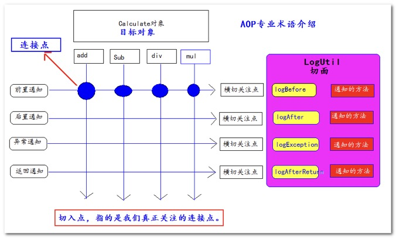

## 使用Spring实现AOP简单切面编程

需要导入工程的jar包

Spring的核心包

```xml
spring-beans-4.0.0.RELEASE.jar
spring-context-4.0.0.RELEASE.jar
spring-core-4.0.0.RELEASE.jar
spring-expression-4.0.0.RELEASE.jar
```

Spring的测试包

```xml
spring-test-4.0.0.RELEASE.jar
```

Spring日记相关包

```xml
commons-logging-1.1.3.jar
log4j-1.2.17.jar
```

Spring的AOP切面相关的包

```xml
spring-aop-4.0.0.RELEASE.jar
spring-aspects-4.0.0.RELEASE.jar
com.springsource.net.sf.cglib-2.2.0.jar
com.springsource.org.aopalliance-1.0.0.jar
com.springsource.org.aspectj.weaver-1.6.8.RELEASE.jar
```

需要有的类

```java
public interface Calculate {
	public int add(int num1, int num2);
	public int mul(int num1, int num2);
	public int div(int num1, int num2);
	public int sub(int num1, int num2);
}
```

```java
@Component
public class Calculator implements Calculate {
	@Override
	public int add(int num1, int num2) {
		return num1 + num2;
	}
	@Override
	public int mul(int num1, int num2) {
		return num1 * num2;
	}
	@Override
	public int div(int num1, int num2) {
		return num1 / num2;
	}
	@Override
	public int sub(int num1, int num2) {
		return num1 - num2;
	}
}
```

```java
@Aspect //表示我是一个切面类
@Component
public class LogUtil {
  //@Before表示我是一个前置通知
  //value 需要写上切入点表达式
	@Before(value = "execution(public int com.atguigu.aop.Calculator.add(int, int))")
	public static void logBefore() {
		System.out.println("前置 日记 ：【xxx】 方法调用前 。参数1是：xxxx");
	}
  //@After表示我是一个后置通知
	@After(value = "execution(public int com.atguigu.aop.Calculator.add(int, int))")
	public static void logAfter() {
		System.out.println("后置 日记 ：【xxxx】 方法调用前 。参数1是：xxxx");
	}
  //@AfterReturning表示我是一个返回通知
	@AfterReturning(value = "execution(public int com.atguigu.aop.Calculator.add(int, int))")
	public static void logAfterReturn() {
		System.out.println("返回之后： 日记 ：【xxxxx】 方法调用前 。参数1是：xxxxxx");
	}
  //@AfterThrowing表示我是一个异常通知
	@AfterThrowing(value = "execution(public int com.atguigu.aop.Calculator.add(int, int))")
	public static void logThrowException() {
		System.out.println("抛异常：日记 ：【xxxxx】 方法调用前 。参数1是：xxxxxx");
	}
}
```

applicationContext.xml配置文件中的内容

```xml
<context:component-scan base-package="com.atguigu" />
<!-- aop:aspectj-autoproxy 支持注解配置AOP切面编程(从而自动实现代理功能)
		 @Aspect 就可以生效  -->
<aop:aspectj-autoproxy />
```

测试代码

```java
@ContextConfiguration(locations = "classpath:applicationContext.xml")
@RunWith(SpringJUnit4ClassRunner.class)
public class SpringAopTest {
	@Autowired
	private Calculate calculate;
	@Test
	public void test1() {
		System.out.println( "添加：" + calculate.add(1, 2));
	}
}
```

运行结果

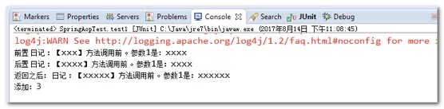

### Spring的切入点表达式

切入点表达式：表示了当前通知对哪些方法生效。

@PointCut切入点表达式语法格式是：execution(访问权限 返回值类型 方法全限定名(参数类型列表))

限定符：

#### * 表示任意的意思

1. ==匹配某全类名下，任意或多个方法==

   表示匹配 `com.atguigu.aop.Calculator` 下以 a 打头的任意方法。并且返回值和两个参数都是int类型

   ```java
   execution(public int com.atguigu.aop.Calculator.a*(int, int))
   ```

   表示匹配 `com.atguigu.aop.Calculator` 下的任意方法。并且返回值和两个参数都是int类型

   ```java
   execution(public int com.atguigu.aop.Calculator.*(int, int))
   ```

2. 在 Spring 中只有 public 权限能拦截到，访问权限可以省略（访问权限不能写*）

   ```java
   //权限省略，表示任意类型的访问权限 ，但Spring现在只支持public权限
   execution(int com.atguigu.aop.Calculator.*(int, int))
   ```

3. 匹配任意类型的返回值，可以使用 * 表示

   ```java
   // 表示任意类型的返回值
   execution(* com.atguigu.aop.Calculator.*(int, int))
   ```

4. 匹配任意子包

   ```java
   // 表示匹配com的子包
   execution(* com.*.aop.Calculator.*(int, int))
   ```

5. 任意类型参数

   ```java
   // 表示第二个参数是任意类型
   execution(* com.atguigu.aop.Calculator.*(int,*))
   ```

#### .. 可以匹配多层路径，或任意多个任意类型参数

```java
// 表示com和aop之间可以有任意层级的包
execution(* com..aop.Calculator.*(int,int))
// 表示第一个参数是int。之后可以有任意个任意类型的参数
execution(* com.atguigu.aop.Calculator.*(int,..))
```

#### 模糊匹配

```java
// 表示任意返回值，任意方法全限定符，任意参数
execution(* *(..))
// 表示任意返回值，任意包名+任意方法名，任意参数
execution(* *.*(..))
```

#### 精确匹配

```java
// int 返回值，com.atguigu.aop.Calculator类的add方法，两个int参数
execution(public int com.atguigu.aop.Calculator.add(int, int))
```

#### 切入点表达式连接&& 、||

```java
// 表示需要同时满足两个表达式
	@Before("execution(public int com.atguigu.aop.Calculator.add(int, int))"
			+ " && "
+ "execution(public * com.atguigu.aop.Calculator.add(..))")

// 表示两个条件只需要满足一个，就会被匹配到
	@Before("execution(public int com.atguigu.aop.Calculator.add(int, int))"
			+ " || "
			+ "execution(public * com.atguigu.aop.Calculator.a*(int))")
```

### Spring切面中的代理对象

在Spring中，可以对有接口的对象和无接口的对象分别进行代理。在使用上有些细微的差别。

1. 如果被代理的对象实现了接口。Spring底层使用jdk代理，在获取对象的时候，==必须要以接口==来接收返回的对象

   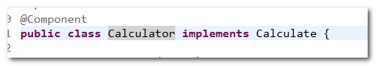

   测试的代码：

   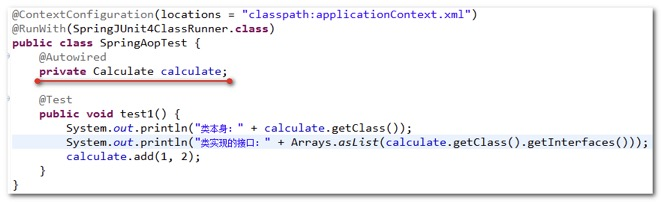

   测试的结果：

   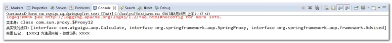

2. 被切面拦截的代理对象，如果没有实现接口。Spring底层使用cglib代理，返回的对象是目标对象的子类类型，获取对象的时候==使用对象类型本身==

   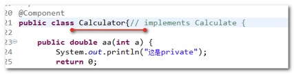

   测试的代码：

   

   测试结果：

   

### Spring通知的执行顺序

Spring通知的执行顺序是:

正常情况：

前置通知\==\==>>>>后置通知\==\===>>>>返回值之后

异常情况：

前置通知\==\==>>>>后置通知\=====>>>>抛异常通知

测试需要的类：

```java
@Component
public class Calculator {// implements Calculate {

	public int div(int num1, int num2) {
		return num1 / num2;
	}

	public int add(int num1, int num2) {
		return num1 + num2;
	}
```

切面的类对象：

```java
@Aspect
@Component
public class LogUtil {

// 每个通知，都是同时监听加和除两个方法
	@Before("execution(public int com.atguigu.aop.Calculator.add(int, int))" + " || "
			+ "execution(public * com.atguigu.aop.Calculator.d*(..))")
	public static void logBefore() {
		System.out.println("前置 日记 ：【xxx】 方法调用前 。参数1是：xxxx");
	}

	@After("execution(public int com.atguigu.aop.Calculator.add(int, int))" + " || "
			+ "execution(public * com.atguigu.aop.Calculator.d*(..))")
	public static void logAfter() {
		System.out.println("后置 日记 ：【xxxx】 方法调用前 。参数1是：xxxx");
	}

	@AfterReturning("execution(public int com.atguigu.aop.Calculator.add(int, int))" + " || "
			+ "execution(public * com.atguigu.aop.Calculator.d*(..))")
	public static void logAfterReturn() {
		System.out.println("返回之后： 日记 ：【xxxxx】 方法调用前 。参数1是：xxxxxx");
	}

	@AfterThrowing("execution(public int com.atguigu.aop.Calculator.add(int, int))" + " || "
			+ "execution(public * com.atguigu.aop.Calculator.d*(..))")
	public static void logThrowException() {
		System.out.println("抛异常：日记 ：【xxxxx】 方法调用前 。参数1是：xxxxxx");
	}
}
```

测试的代码：

```java
@ContextConfiguration(locations = "classpath:applicationContext.xml")
@RunWith(SpringJUnit4ClassRunner.class)
public class SpringAopTest {
	@Autowired
	private Calculator calculator;

	@Test
	public void test1() {
		//加法
		calculator.add(1, 2);
		System.out.println("===============================");
		//减法
		calculator.div(1, 0);
	}
}
```

运行的结果：


### 获取连接点信息

JoinPoint 是连接点的信息。

只需要在通知方法的参数中，加入一个 JoinPoint 参数。就可以获取到拦截方法的信息。

**注意：是 **org.aspectj.lang.JoinPoint 这个类

```java
@Aspect
@Component
public class LogUtil {
	@Before("execution(public int com.atguigu.aop.Calculator.add(int, int))" + " || "
			+ "execution(public * com.atguigu.aop.Calculator.d*(..))")
	public static void logBefore(JoinPoint joinPoint) {
		System.out.println("前置 日记 ：【" + joinPoint.getSignature().getName() + "】 方法调用前 。参数是："
				+ Arrays.asList(joinPoint.getArgs()));
	}

	@After("execution(public int com.atguigu.aop.Calculator.add(int, int))" + " || "
			+ "execution(public * com.atguigu.aop.Calculator.d*(..))")
	public static void logAfter(JoinPoint joinPoint) {
		System.out.println("后置 日记 ：【" + joinPoint.getSignature().getName() + "】 方法调用 。参数是："
				+ Arrays.asList(joinPoint.getArgs()));
	}

	@AfterReturning("execution(public int com.atguigu.aop.Calculator.add(int, int))" + " || "
			+ "execution(public * com.atguigu.aop.Calculator.d*(..))")
	public static void logAfterReturn(JoinPoint joinPoint) {
		System.out.println("返回之后： 日记 ：【" + joinPoint.getSignature().getName() + "】 方法调用 。参数是："
				+ Arrays.asList(joinPoint.getArgs()));
	}

	@AfterThrowing("execution(public int com.atguigu.aop.Calculator.add(int, int))" + " || "
			+ "execution(public * com.atguigu.aop.Calculator.d*(..))")
	public static void logThrowException(JoinPoint joinPoint) {
		System.out.println("抛异常：日记 ：【" + joinPoint.getSignature().getName() + "】 方法调用 。参数是："
				+ Arrays.asList(joinPoint.getArgs()));
	}
}
```

前面测试的代码没有变。再次执行的结果。都能拿到拦截的方法名和参数


### 获取拦截方法的返回值和抛的异常信息

获取方法返回的值分为两个步骤：

1. 在返回值通知的方法中，追加一个参数 Object result
2. 然后在@AfterReturning注解中添加参数returning="参数名"，表明哪个参数接收返回值

获取方法抛出的异常分为两个步骤：

1. 在异常通知的方法中，追加一个参数Exception exception
2. 然后在@AfterThrowing 注解中添加参数 throwing="参数名"，表明哪个参数接收返回值

修改LogUtil切面类的代码:

```java
@AfterReturning(value = "execution(public int com.atguigu.aop.Calculator.add(int, int))"
			+ " || " + "execution(public * com.atguigu.aop.Calculator.d*(..))", returning = "result")
	public static void logAfterReturn(JoinPoint joinPoint, Object result) {
		System.out.println("返回之后： 日记 ：【" + joinPoint.getSignature().getName() + "】 方法调用 。参数是："
				+ Arrays.asList(joinPoint.getArgs()) + ",返回值：" + result);
	}

	@AfterThrowing(value = "execution(public int com.atguigu.aop.Calculator.add(int, int))"
			+ " || " + "execution(public * com.atguigu.aop.Calculator.d*(..))", throwing = "exception")
	public static void logThrowException(JoinPoint joinPoint, Exception exception) {
		System.out.println("抛异常：日记 ：【" + joinPoint.getSignature().getName() + "】 方法调用 。参数是："
				+ Arrays.asList(joinPoint.getArgs()) + ",异常对象：" + exception);
	}
```

测试的代码不变，测试的结果是:

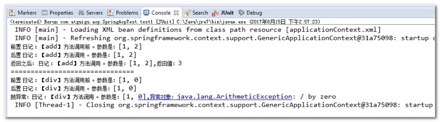

### Spring的环绕通知

1. 环绕通知使用 @Around 注解，环绕通知需要自己执行目标方法。
2. 环绕通知如果和其他通知同时执行。环绕通知会优先于其他通知之前执行。
3. 环绕通知一定要有返回值（环绕如果没有返回值。后面的其他通知就无法接收到目标方法执行的结果）。
4. 在环绕通知中。如果拦截异常。一定要往外抛。否则其他的异常通知是无法捕获到异常的。

在LogUtil切面类中添加环绕通知：

```java
@Around(value = "execution(* *(..))")
	public static Object logAround(ProceedingJoinPoint proceedingJoinPoint) {
		//获取请求参数
		Object[] args = proceedingJoinPoint.getArgs();
		Object resultObject = null;
		try {
			System.out.println("环绕前置");
			//调用目标方法
			resultObject = proceedingJoinPoint.proceed(args);
			System.out.println("环绕后置");
		} catch (Throwable e) {
			System.out.println("环绕异常：" + e);
			throw new RuntimeException(e);
		} finally {
			System.out.println("环绕返回后");
		}
		//返回返回值
		return resultObject;
	}
```

修改测试的代码：

```java
@ContextConfiguration(locations = "classpath:applicationContext.xml")
@RunWith(SpringJUnit4ClassRunner.class)
public class SpringAopTest {
	@Autowired
	private Calculator calculator;

	@Test
	public void test1() {
		//加法
		calculator.add(1, 2);
	}
}
```

运行结果：

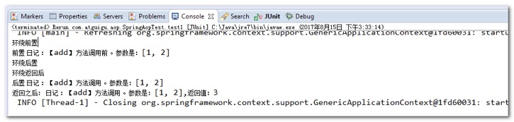

### 切入点表达式的重用

切入点表达式的重点，需要分三个步骤：

1. 在切面类中定义一个空的方法

   ```java
   public static void pointcut1() {}
   ```

2. 在方法中使用 @Pointcut 定义一个切入连表达式

   ```java
   @Pointcut(value="execution(public int com.atguigu.aop.Calculator.add(int, int))" + " || "
   			+ "execution(public * com.atguigu.aop.Calculator.*(..))")
   	public static void pointcut1() {}
   ```

3. 其他的通知注解中使用方法名()的形式引用方法上定义的切入点表达式

   比如：@Before("pointcut1()")

### 多个通知的执行顺序

当我们有多个切面，多个通知的时候：

1. 通知的执行顺序默认是由切面类的字母先后顺序决定。
2. 在切面类上使用 @Order 注解决定通知执行的顺序（值越小，越先执行）

再添加另一个切面类：

```java
@Component
@Aspect
@Order(1)
public class Validation {

	@Before(value = "com.atguigu.aop.LogUtil.pointcut1()")
	public static void before(JoinPoint joinPoint) {
		System.out.println("这是Validation的前置通知,拦截的方法是：" + joinPoint.getSignature().getName());
	}

	@After(value = "com.atguigu.aop.LogUtil.pointcut1()")
	public static void after(JoinPoint joinPoint) {
		System.out.println("这是Validation的后置通知,拦截的方法是：" + joinPoint.getSignature().getName());
	}

	@AfterReturning(value = "com.atguigu.aop.LogUtil.pointcut1()", returning = "result")
	public static void afterReturning(JoinPoint joinPoint, Object result) {
		System.out.println("这是Validation的后置通知,拦截的方法是：" + joinPoint.getSignature().getName()
				+ ", 返回值：" + result);
	}

}
```

修改原来LogUtil中的切面内容（去掉环绕通知，留下前置，后置，返回后通知）：

```java
@Aspect
@Component
@Order(2)
public class LogUtil {
	@Pointcut(value="execution(public int com.atguigu.aop.Calculator.add(int, int))" + " || "
			+ "execution(public * com.atguigu.aop.Calculator.*(..))")
	public static void pointcut1() {}
```

测试的代码:

```java
@ContextConfiguration(locations = "classpath:applicationContext.xml")
@RunWith(SpringJUnit4ClassRunner.class)
public class SpringAopTest {
	@Autowired
	private Calculator calculator;
	@Test
	public void test1() {
		//加法
		calculator.add(1, 0);
	}
}
```

运行的结果:

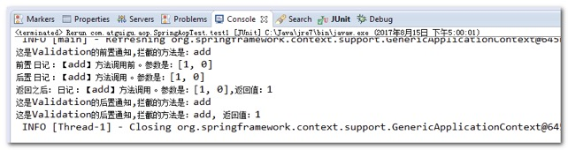

### 如何基于xml配置aop程序

需要导入的包

```xml
com.springsource.net.sf.cglib-2.2.0.jar
com.springsource.org.aopalliance-1.0.0.jar
com.springsource.org.aspectj.weaver-1.6.8.RELEASE.jar
commons-logging-1.1.3.jar
log4j-1.2.17.jar
spring-aop-4.0.0.RELEASE.jar
spring-aspects-4.0.0.RELEASE.jar
spring-beans-4.0.0.RELEASE.jar
spring-context-4.0.0.RELEASE.jar
spring-core-4.0.0.RELEASE.jar
spring-expression-4.0.0.RELEASE.jar
spring-test-4.0.0.RELEASE.jar
```

工程中编写的类

```java
public class Calculator {
	public int div(int num1, int num2) {
		return num1 / num2;
	}

	public int add(int num1, int num2) {
		return num1 + num2;
	}
}
```

LogUtil切面类

```java
public class LogUtil {
	public static void logBefore(JoinPoint joinPoint) {
		System.out.println("前置 日记 ：【" + joinPoint.getSignature().getName() + "】 方法调用前 。参数是："
				+ Arrays.asList(joinPoint.getArgs()));
	}

	public static void logAfter(JoinPoint joinPoint) {
		System.out.println("后置 日记 ：【" + joinPoint.getSignature().getName() + "】 方法调用 。参数是："
				+ Arrays.asList(joinPoint.getArgs()));
	}

	public static void logAfterReturn(JoinPoint joinPoint, Object result) {
		System.out.println("返回之后： 日记 ：【" + joinPoint.getSignature().getName() + "】 方法调用 。参数是："
				+ Arrays.asList(joinPoint.getArgs()) + ",返回值：" + result);
	}

	public static void logThrowException(JoinPoint joinPoint, Exception exception) {
		System.out.println("抛异常：日记 ：【" + joinPoint.getSignature().getName() + "】 方法调用 。参数是："
				+ Arrays.asList(joinPoint.getArgs()) + ",异常对象：" + exception);
	}
}
```

Validation切面类

```java
public class Validation {
	public static void before(JoinPoint joinPoint) {
		System.out.println("这是Validation的前置通知,拦截的方法是：" + joinPoint.getSignature().getName());
	}

	public static void after(JoinPoint joinPoint) {
		System.out.println("这是Validation的后置通知,拦截的方法是：" + joinPoint.getSignature().getName());
	}

	public static void afterReturning(JoinPoint joinPoint, Object result) {
		System.out.println("这是Validation的后置通知,拦截的方法是：" + joinPoint.getSignature().getName()
				+ ", 返回值：" + result);
	}
}
```

ApplicationContext.xml配置文件中的内容

```xml
<!-- 注册bean对象
		添加@Component
	 -->
	<bean id="calculator" class="com.atguigu.aop.Calculator" />
	<bean id="logUtil" class="com.atguigu.aop.LogUtil" />
	<bean id="validation" class="com.atguigu.aop.Validation" />
	<!-- 配置AOP -->
	<aop:config>
		<!-- 定义可以共用的切入点 -->
		<aop:pointcut expression="execution(* com.atguigu.aop.Calculator.*(..))" id="pointcut1"/>
		<!-- 定义切面类 -->
		<aop:aspect order="1" ref="logUtil">
			<!-- 这是前置通知 
					method属性配置通知的方法
					pointcut配置切入点表达式
			 -->
			<aop:before method="logBefore" pointcut="execution(* com.atguigu.aop.Calculator.*(..))"/>
			<aop:after method="logAfter" pointcut="execution(* com.atguigu.aop.Calculator.*(..))"/>
			<aop:after-returning method="logAfterReturn" 
				returning="result" pointcut="execution(* com.atguigu.aop.Calculator.*(..))"/>
			<aop:after-throwing method="logThrowException" throwing="exception"
				pointcut="execution(* com.atguigu.aop.Calculator.*(..))"/>
		</aop:aspect>
		<!-- 定义切面类 -->
		<aop:aspect order="2" ref="validation">
			<aop:before method="before" pointcut-ref="pointcut1"/>
			<aop:after method="after" pointcut-ref="pointcut1"/>
			<aop:after-returning method="afterReturning" 
				returning="result" pointcut-ref="pointcut1"/>
		</aop:aspect>
	</aop:config>
```

测试的代码

```java
@ContextConfiguration(locations = "classpath:applicationContext.xml")
@RunWith(SpringJUnit4ClassRunner.class)
public class SpringAopTest {
	@Autowired
	Calculator calculator;
	@Test
	public void test1() {
		calculator.add(1, 2);
	}
}
```

运行的结果


# Spring之数据访问

## Spring数据访问工程环境搭建

创建一个Java工程，导入需要的Jar包：

Spring的核心jar包

```xml
spring-beans-4.0.0.RELEASE.jar
spring-context-4.0.0.RELEASE.jar
spring-core-4.0.0.RELEASE.jar
spring-expression-4.0.0.RELEASE.jar
```

Spring切面的jar包

```xml
com.springsource.net.sf.cglib-2.2.0.jar
com.springsource.org.aopalliance-1.0.0.jar
com.springsource.org.aspectj.weaver-1.6.8.RELEASE.jar
spring-aop-4.0.0.RELEASE.jar
spring-aspects-4.0.0.RELEASE.jar
```

Spring数据访问的jar包

```xml
spring-jdbc-4.0.0.RELEASE.jar
spring-orm-4.0.0.RELEASE.jar
spring-tx-4.0.0.RELEASE.jar
```

数据库访问需要的jar包

```xml
c3p0-0.9.1.2.jar
mysql-connector-java-5.1.37-bin.jar
```

日记需要的jar包

```xml
commons-logging-1.1.3.jar
log4j-1.2.17.jar
```

Spring的测试包

```xml
spring-test-4.0.0.RELEASE.jar
```

在src目录下jdbc.properties属性配置文件

```properties
jdbc.username=root
jdbc.password=root
jdbc.url=jdbc:mysql://localhost:3306/spring
jdbc.driverClass=com.mysql.jdbc.Driver
```

在src目录下的log4j.properties配置文件

```properties
# Global logging configuration
log4j.rootLogger=INFO, stdout
# Console output...
log4j.appender.stdout=org.apache.log4j.ConsoleAppender
log4j.appender.stdout.layout=org.apache.log4j.PatternLayout
log4j.appender.stdout.layout.ConversionPattern=%5p [%t] - %m%n
```

在applicationContext.xml中配置数据源

```xml
<!-- 加载jdbc.properties配置文件 -->
	<context:property-placeholder location="classpath:jdbc.properties"/>
	<!-- 配置数据库连接池 -->
	<bean id="c3p0DataSource" class="com.mchange.v2.c3p0.ComboPooledDataSource">
		<property name="user" value="${jdbc.username}"/>
		<property name="password" value="${jdbc.password}"/>
		<property name="jdbcUrl" value="${jdbc.url}"/>
		<property name="driverClass" value="${jdbc.driverClass}"/>
	</bean>
	<!-- jdbcTemplate -->
	<bean id="jdbcTemplate" class="org.springframework.jdbc.core.JdbcTemplate">
		<property name="dataSource"  ref="c3p0DataSource"/>
	</bean>
```

测试数据源（测试数据库连接池）

```java
@ContextConfiguration(locations = "classpath:applicationContext.xml")
@RunWith(SpringJUnit4ClassRunner.class)
public class JdbcTest {

	@Autowired
	DataSource dataSource;

	@Test
	public void test1() throws Exception {
		System.out.println( dataSource.getConnection() );
	}

}
```

## Spring之JdbcTemplate使用

在Spring中提供了对jdbc的封装类叫JdbcTemplate。它可以很方便的帮我们执行sql语句，操作数据库

先准备单表的数据库数据

```sql
drop database if exists jdbctemplate;

create database jdbctemplate;

use jdbctemplate;

create table `employee` (
  `id` int(11) primary key auto_increment,
  `name` varchar(100) default null,
  `salary` decimal(11,2) default null
);

insert  into `employee`(`id`,`name`,`salary`) 
values (1,'李三',5000.23),(2,'李四',4234.77),(3,'王五',9034.51),
(4,'赵六',8054.33),(5,'孔七',6039.11),(6,'曹八',7714.11);

select * from employee;
```

JdbcTemplate的使用需要在applicationContext.xml中进行配置

```xml
<!-- jdbcTemplate -->
	<bean id="jdbcTemplate" class="org.springframework.jdbc.core.JdbcTemplate">
		<property name="dataSource"  ref="c3p0DataSource"/>
	</bean>
```

实验2：将id=5的记录的salary字段更新为1300.00

```java
@Test
	public void test2() throws Exception {
		// 实验2：将emp_id=5的记录的salary字段更新为1300.00
		String sql = "update employee set salary = ? where id = ?";
		jdbcTemplate.update(sql, 1300, 5);
	}
```

实验3：批量插入

```java
@Test
	public void test3() throws Exception {
		String sql = "insert into employee(`name`,`salary`) values(?,?)";
		ArrayList<Object[]> params = new ArrayList<>();
		params.add(new Object[] {"aaa",100});
		params.add(new Object[] {"bbb",100});
		params.add(new Object[] {"ccc",100});
		jdbcTemplate.batchUpdate(sql, params);
	}
```

实验4：查询id=5的数据库记录，封装为一个Java对象返回

创建一个Employee对象

```java
public class Employee {

	private Integer id;
	private String name;
	private BigDecimal salary;
```

```java
@Test
	public void test4() throws Exception {
		// 实验4：查询id=5的数据库记录，封装为一个Java对象返回
		String sql = "select id ,name ,salary from employee where id = ?";
		/**
		 * 在queryRunner中使用的是ResultSetHandler
		 * 	在Spring的jdbcTemplate中，使用RowMapper。
		 * 		BeanPropertyRowMapper 可以把一个结果集转成一个bean对象
		 */
		Employee employee = jdbcTemplate.queryForObject(sql, new BeanPropertyRowMapper(Employee.class), 5);
		System.out.println(employee);
	}
```

实验5：查询salary>4000的数据库记录，封装为List集合返回

```java
@Test
	public void test5() throws Exception {
		// 实验5：查询salary>4000的数据库记录，封装为List集合返回
		String sql = "select id,name,salary from employee where salary > ?";
		List<Employee> list = jdbcTemplate.query(sql, new BeanPropertyRowMapper(Employee.class), 4000);
		System.out.println(list);
	}
```

实验6：查询最大salary

```java
@Test
	public void test6() throws Exception {
		// 实验6：查询最大salary
		String sql = "select max(salary) from employee";
		BigDecimal salary = jdbcTemplate.queryForObject(sql, BigDecimal.class);
		System.out.println(salary);
	}
```

实验7：使用带有具名参数的SQL语句插入一条员工记录，并以Map形式传入参数值

```xml
<!-- namedParameterJdbcTemplate -->
	<bean id="namedParameterJdbcTemplate" class="org.springframework.jdbc.core.namedparam.NamedParameterJdbcTemplate" >
		<constructor-arg name="dataSource" ref="c3p0DataSource" />
	</bean>
```

```java
@ContextConfiguration(locations = "classpath:applicationContext.xml")
@RunWith(SpringJUnit4ClassRunner.class)
public class JdbcTest {

	@Autowired
	DataSource dataSource;

	@Autowired
	JdbcTemplate jdbcTemplate;

	@Autowired
	NamedParameterJdbcTemplate namedParameterJdbcTemplate;

	@Test
	public void test7() throws Exception {
		// 实验7：使用带有具名参数的SQL语句插入一条员工记录，并以Map形式传入参数值
    // :name 相当于 ? 占位符，name就是这个参数的名称
		String sql = "insert into employee(`name`,`salary`) values(:name,:salary)";
		Map<String, Object> param = new HashMap<String,Object>();
		param.put("name", "小明");
		param.put("salary", new BigDecimal(55));
		namedParameterJdbcTemplate.update(sql, param);
    }
```

实验8：重复实验7，以SqlParameterSource形式传入参数值

```java
@Test
	public void test8() throws Exception {
		// 实验8：重复实验7，以SqlParameterSource形式传入参数值
		String sql = "insert into employee(`name`,`salary`) values(:name,:salary)";
		//通过一个bean对象的属性会自动赋值
		SqlParameterSource sqlParameterSource = new BeanPropertySqlParameterSource(new Employee(0,
				"小新", new BigDecimal(11111)));
		namedParameterJdbcTemplate.update(sql, sqlParameterSource);
	}
```

实验9：创建Dao，自动装配JdbcTemplate对象

添加类

```java
@Repository
public class EmployeeDao {

	@Autowired
	JdbcTemplate jdbcTemplate;

	public int saveEmployee(Employee employee) {
		String sql = "insert into employee(`name`,`salary`) values(?,?)";
		return jdbcTemplate.update(sql, employee.getName(), employee.getSalary());
	}
}
```

在applicationContext.xml中配置

```xml
<!-- 添加包扫描 -->
	<context:component-scan base-package="com.atguigu" />
```

测试代码

```java
@ContextConfiguration(locations = "classpath:applicationContext.xml")
@RunWith(SpringJUnit4ClassRunner.class)
public class JdbcTest {

	@Autowired
	DataSource dataSource;

	@Autowired
	EmployeeDao employeeDao;

	@Test
	public void test9() throws Exception {
		// 实验9：创建Dao，自动装配JdbcTemplate对象
		employeeDao.saveEmployee(new Employee(null, "ssssss", new BigDecimal(999)));
	}
```

实验10：通过继承JdbcDaoSupport创建JdbcTemplate的Dao

```java
@Repository
public class EmployeeDao extends JdbcDaoSupport {

	@Autowired//applicationContext.xml中有dataSource将自动注入
	protected void setDataSource2(DataSource dataSource) {
		System.out.println("自动注入 + " + dataSource);
		super.setDataSource(dataSource);
	}

	public int saveEmployee(Employee employee) {
		String sql = "insert into employee(`name`,`salary`) values(?,?)";
		return getJdbcTemplate().update(sql, employee.getName(), employee.getSalary());
	}
}
```

# 事务

事务分为声明式和编程式两种:

**声明式事务：**声明式事务是指通过注解的形式对事务的各种特性进行控制和管理。

**编程式事务：**指的是通过编码的方式实现事务的声明

## 编码方式实现事务

```java
try{
// 获取数据库连接
Connection connection = JdbcUtils.getConnection();
// 设置手动管理事务
connection.setAutoCommit(false);
…… 
//执行若干操作
……
// 提交事务
connection.commit();
} catch (Exception e) {
// 回滚事务
connection.rollback()
} finally {
// 关闭数据库连接
connection.close();
}
```

## 声明式事务环境搭建

准备测试数据库

```sql
##创建tx数据库
drop database if exists `tx`;
CREATE database `tx`;
##切换tx数据库
USE `tx`;

##删除用户表
DROP TABLE IF EXISTS `user`;
##创建用户表
CREATE TABLE `user` (
  `id` int primary key auto_increment,	
  `username` varchar(50) NOT NULL,
  `money` int(11) DEFAULT NULL
);
##插入数据
insert  into `user`(`username`,`money`) values ('张三',1000),('李四',1000);

##删除图书表
drop table if exists `book`;
##创建图书表
create table `book`(
    `id` int primary key auto_increment,
    `name` varchar(500) not null,
    `stock` int
);
##插入数据
insert into book(`name`,`stock`) values('java编程思想',100),('C++编程思想',100);

##查看数据
select * from book;
select * from user;
```

创建一个Java工程，导入Jar包

Spring的core核心包

```xml
spring-beans-4.0.0.RELEASE.jar
spring-context-4.0.0.RELEASE.jar
spring-core-4.0.0.RELEASE.jar
spring-expression-4.0.0.RELEASE.jar
```

Spring切面包

```xml
com.springsource.net.sf.cglib-2.2.0.jar
com.springsource.org.aopalliance-1.0.0.jar
com.springsource.org.aspectj.weaver-1.6.8.RELEASE.jar
spring-aop-4.0.0.RELEASE.jar
spring-aspects-4.0.0.RELEASE.jar
```

Spring数据持久层包与数据库

```xml
c3p0-0.9.1.2.jar
mysql-connector-java-5.1.37-bin.jar
spring-jdbc-4.0.0.RELEASE.jar
spring-orm-4.0.0.RELEASE.jar
spring-tx-4.0.0.RELEASE.jar
```

Spring测试包

```xml
spring-test-4.0.0.RELEASE.jar
```

日记包

```xml
commons-logging-1.1.3.jar
log4j-1.2.17.jar
```

在源码目录（src或其他）下创建一个log4j.properties属性

```properties
# Global logging configuration
log4j.rootLogger=INFO, stdout
# Console output...
log4j.appender.stdout=org.apache.log4j.ConsoleAppender
log4j.appender.stdout.layout=org.apache.log4j.PatternLayout
log4j.appender.stdout.layout.ConversionPattern=%5p [%t] - %m%n
```

## 测试Service的默认事务

实验1：测试service服务层的默认事务

在源码目录（src或其他源码目录）下创建一个jdbc.properties属性

```properties
jdbc.username=root
jdbc.password=root
jdbc.driverClass=com.mysql.jdbc.Driver
jdbc.url=jdbc:mysql://localhost:3306/tx
```

创建测试的类

```java
public class Book {
	private Integer id;
	private String name;
	private int stock;

public class User {
	private Integer id;
	private String username;
	private int money;
```

编写两个Dao类

```java
@Repository
public class BookDao {
	@Autowired
	private JdbcTemplate jdbcTemplate;

	public List<Book> queryAll() {
		String sql = "select id,name,stock from book";
		return jdbcTemplate.query(sql, new BeanPropertyRowMapper(Book.class));
	}

	public Book queryById(int id) {
		String sql = "select id,name,stock from book where id = ?";
		return jdbcTemplate.queryForObject(sql, new BeanPropertyRowMapper(Book.class), id);
	}

	public int update(Book book) {
		String sql = "update book set name=?,stock=? where id=?";
		return jdbcTemplate.update(sql, book.getName(), book.getStock(), book.getId());
	}

	public int deleteById(int id) {
		String sql = "delete from book where id=?";
		return jdbcTemplate.update(sql, id);
	}
}
```

```java
@Repository
public class UserDao {

	@Autowired
	private JdbcTemplate jdbcTemplate;

	public List<User> queryAll() {
		String sql = "select id ,username,money from user";
		return jdbcTemplate.query(sql, new BeanPropertyRowMapper(User.class));
	}

	public User queryById(int id) {
		String sql = "select id ,username,money from user where id = ?";
		return jdbcTemplate.queryForObject(sql, new BeanPropertyRowMapper(User.class), id);
	}

	public int update(User user) {
		String sql = "update user set username=?,money=? where id=?";
		return jdbcTemplate.update(sql, user.getUsername(), user.getMoney(), user.getId());
	}

	public int deleteById(int id) {
		String sql = "delete from user where id = ?";
		return jdbcTemplate.update(sql, id);
	}
}
```

一个Service测试

```java
@Service
public class TransactionService {
	@Autowired
	private BookDao bookDao;
	@Autowired
	private UserDao userDao;

	public void updateUserAndBook() {
		// 更新图书
		bookDao.update(new Book(2, "xxx", 2222));
		// 更新用户
		userDao.update(new User(2, "ssssssss", 2222));
	}
}
```

在applicationContext.xml配置文件中配置内容

```xml
<!-- 包扫描 -->
	<context:component-scan base-package="com.atguigu"></context:component-scan>
	<!-- 加载jdbc.properties -->
	<context:property-placeholder location="classpath:jdbc.properties"/>	
	<!-- 数据库连接池 -->
	<bean id="dataSource" class="com.mchange.v2.c3p0.ComboPooledDataSource">
		<property name="user" value="${jdbc.username}" />
		<property name="password" value="${jdbc.password}" />
		<property name="jdbcUrl" value="${jdbc.url}" />
		<property name="driverClass" value="${jdbc.driverClass}" />
	</bean>
	<!-- 配置jdbcTemplate -->
	<bean id="jdbcTemplate" class="org.springframework.jdbc.core.JdbcTemplate">
		<property name="dataSource" ref="dataSource" />
	</bean>
```

测试的代码

```java
@ContextConfiguration(locations = "classpath:applicationContext.xml")
@RunWith(SpringJUnit4ClassRunner.class)
public class TransactionServiceTest {

	@Autowired
	private TransactionService transactionService;

	@Test
	public void testUpdateUserAndBook() {
		transactionService.updateUserAndBook();
	}
}
```

运行结果：

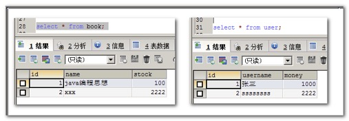

异常的演示

可以在两个操作中添加一个产生异常的代码。

```java
@Service
public class TransactionService {
	@Autowired
	private BookDao bookDao;
	@Autowired
	private UserDao userDao;

	public void updateUserAndBook() {
		// 更新图书
		bookDao.update(new Book(2, "xxx", 2222));
       int 12 / 0;
		// 更新用户
		userDao.update(new User(2, "ssssssss", 2222));
	}
}
```

测试结果：


数据库运行结果


这个时候，我们发现。其实前面的两个dao操作，其实是两个事务。

```java
bookDao.update(new Book(2, "xxx", 2222));   		//这是一个事务
int 12 / 0;												//产生了错误，导致后面的语句没有执行
userDao.update(new User(2, "ssssssss", 2222)); 	//这是另一个事务
```

这个时候，我们需要使用声明式事务来控制多个操作，在一个业务中，要么都成功。要么都失败！

## PlatformTransactionManager类简单介绍

PlatformTransactionManager 类是 Spring 提供的专门用于统一管理事务的一个接口。

那么不同的持久层技术都对其实现了自己的事务管理类。


## Spring底层事务管理原理的介绍


## 使用Spring的注解声明事务管理

使用Spring注解式事务管理，只需要分三个简单的步骤：

1. 配置自己需要用的事务管理器类------->>>>>DatasourceTransactionManager(这里是数据库连接池版本)

   ```xml
   <bean id="transactionManager"
   		class="org.springframework.jdbc.datasource.DataSourceTransactionManager">
   		<property name="dataSource" ref="c3p0DataSource"></property>
   	</bean>
   ```

2. 配置事务的自动代理

   ```xml
   <tx:annotation-driven transaction-manager="transactionManager" />
   ```

3. 在需要添加事务的目标方法上，添加@Transaction注解

实验2：测试Spring的声明式事务

需要使用@Transactional注解来标，此方法交给Spring来管理事务

```java
@Transactional
	public void updateUserAndBook() {
		// 更新图书
		bookDao.update(new Book(2, "xxx", 2222));
		int i = 12 / 0;
		// 更新用户
		userDao.update(new User(2, "ssssssss", 2222));
	}
```

applicationContext.xml配置文件中的内容

```xml
<!-- 配置数据库连接池的事务管理器 -->
	<bean id="transactionManager" class="org.springframework.jdbc.datasource.DataSourceTransactionManager">
		<property name="dataSource" ref="dataSource" />
	</bean>
	<!-- 表示解析 @Transactional注解的对象，使用的事务管理器 -->
	<tx:annotation-driven transaction-manager="transactionManager"/>
```

## 测试不回滚的异常

实验3：noRollbackFor和noRollbackForClassName测试不回滚的异常

默认情况下，@Transactional是回滚运行时异常。也就是RuntimeException及其子异常 或 Error错误。

### noRollbackFor 属性表示不回滚的异常类型

 ```java
/**
	 * Transaction默认回滚的是RuntimeException，运行时异常。
	 * noRollbackFor属性表示不回滚的异常类型<br/>
	 * 	算术异常和类型转换异常不回滚事务
	 */	
	@Transactional(noRollbackFor= {
			//表示算术异常和类型转换异常，不需要回滚事务
			ArithmeticException.class,ClassCastException.class
	})
	public void updateUserAndBook() {
		// 更新图书
		bookDao.update(new Book(2, "xxx", 2222));
		Object o = new Long(1);
		String s = (String) o;
		// 更新用户
		userDao.update(new User(2, "ssssssss", 2222));
	}
 ```

### noRollbackForClassName 属性表示不回滚的异常全类名

```java
/**
	 * Transaction默认回滚的是RuntimeException，运行时异常。
	 * noRollbackForClassName属性表示不回滚的异常全类名<br/>
	 * 	算术异常和类型转换异常不回滚事务
	 */	
	@Transactional(noRollbackForClassName= {"java.lang.ArithmeticException","java.lang.ClassCastException"})
	public void updateUserAndBook() {
		// 更新图书
		bookDao.update(new Book(2, "xxx", 2222));
		int i = 12 / 0;
		// 更新用户
		userDao.update(new User(2, "ssssssss", 2222));
	}
```

## 自定义设置回滚异常

实验5：rollbackFor和rollbackForClassName回滚的异常

### rollbackFor 设置回滚的异常类型

```java
/**
	 * rollbackFor 属性设置回滚的异常类型<br/>
	 */	
	@Transactional(rollbackFor= {FileNotFoundException.class})
	public void updateUserAndBook() throws FileNotFoundException {
		// 更新图书
		bookDao.update(new Book(2, "xxx", 2222));
		FileInputStream fis = new FileInputStream(new File("d:\\1.txt"));
		// 更新用户
		userDao.update(new User(2, "ssssssss", 2222));
	}
```

### rollbackForClassName 属性设置回滚的异常类型全类名

```java
/**
	 * rollbackFor 属性设置回滚的异常类型<br/>
	 * rollbackForClassName 属性设置回滚的异常类型全类名
	 */	
	@Transactional(
			rollbackForClassName="java.io.FileNotFoundException")
	public void updateUserAndBook() throws FileNotFoundException {
		// 更新图书
		bookDao.update(new Book(2, "xxx", 2222));
		FileInputStream fis = new FileInputStream(new File("d:\\1.txt"));
		// 更新用户
		userDao.update(new User(2, "ssssssss", 2222));
	}
```

## 事务的只读属性

实验4：测试readOnly只读属性

readOnly 属性 设置事务是否允许写操作。readOnly 默认值是false,表示可读，可写。如果设置为true 表示只支持读操作


声明事务代码

```java
/**
	 *  readOnly表示事务只读，不支持写操作。
	 */	
	@Transactional(readOnly=true)
	public void updateUserAndBook() {
		// 更新图书
		bookDao.update(new Book(2, "xxx", 2222));
		// 更新用户
		userDao.update(new User(2, "ssssssss", 2222));
	}
```

在写操作的方法上标注为只读。就会报异常


 ## 事务超时属性timeout(秒为单位)

timeout是设置超时属性。以秒为单位。

```java
/**
	 * timeout设置事务超时时间,以秒为单位
	 */	
	@Transactional(timeout=2)//两秒超时
	public void updateUserAndBook() throws InterruptedException {
		// 更新图书
		bookDao.update(new Book(2, "xxx", 2222));
		Thread.sleep(3000);
		// 更新用户
		userDao.update(new User(2, "ssssssss", 2222));
	}
```

当两秒钟时间内不能完成所有操作，就会抛异常。

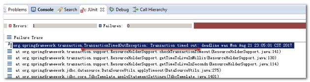

## 事务隔离级别

四种事务隔离级别：

一：读未提交	read uncommitted

二：读已提交	read committed

三：可重复读	repeatable read

四：串行事务	serializable


由事务隔离级别产生的几个常见问题：

读未提交，可导致----->>>> 脏读

读已提交，可导致----->>>> 不可重复读

重复读，可导致	----->>>> 幻读


**脏读：**所谓脏读，指的是，在某一个事务中，读取到了其他事务中未提交的数据。称之为脏读。

**不可重复读：**指的是一个事务中，多次读取，由于其他事务进行修改操作。导致两次得到的内容不同。称之为不可重复读。

**幻读：**指的是在一个事务中，每次读取的数据都跟第一次的数据相同，不管数据本身是否已经被其他事务所修改。称之为幻读。

```sql
## 1.查看当前会话隔离级别
select @@tx_isolation;

## 2.查看系统当前隔离级别
select @@global.tx_isolation;

## 3.设置当前会话隔离级别
set session transaction isolation level read uncommitted;
set session transaction isolation level read committed;
set session transaction isolation level repeatable read;
set session transaction isolation level serializable;

## 开启事务
start transaction;

## 5.提交事务
commit;

## 回滚事务
rollback;
```

### 脏读的演示

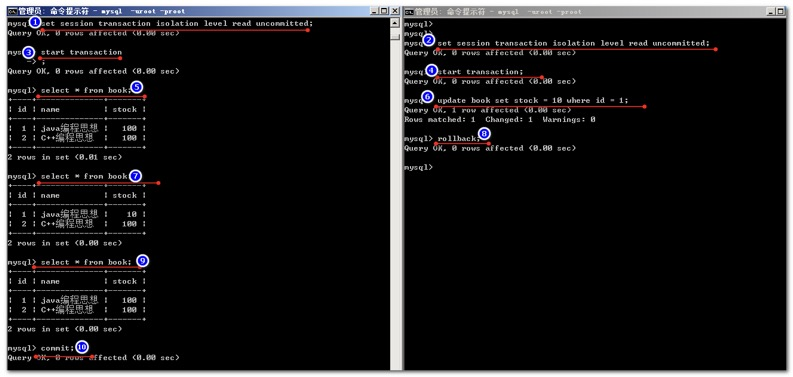

### 读未提交演示

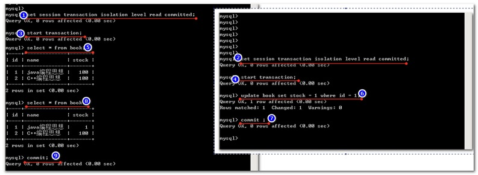

### 幻读的演示

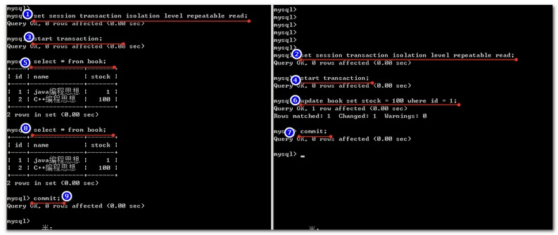

### 串行化事务的演示

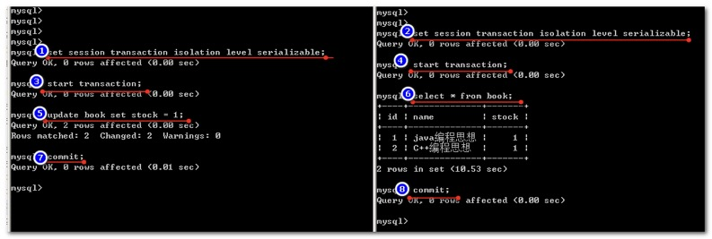

## 事务的传播特性propagation

什么是事务的传播行为：

当事务方法被另一个事务方法调用时，必须指定事务应该如何传播。例如：方法可能继续在现有事务中运行，也可能开启一个新事务，并在自己的事务中运行。

事务的传播行为可以由传播属性指定。Spring定义了7种类传播行为。

事务的传播特性，有以下几种类型：


### 注解演示事物传播特性

创建UserService类

```java
@Service
public class UserService {

	@Autowired
	private UserDao userDao;
	
	@Transactional
	public void updateUser() {
		userDao.update(new User(1, "第二个操作成功！用户名被修改", 0));
	}
}
```

创建BookService类

```java
@Service
public class BookService {

	@Autowired
	BookDao bookDao;

	@Transactional
	public void updateBook() {
		bookDao.update(new Book(1, "第一个操作成功！图书被修改", 0));
	}
}
```

修改TransactionService类

```java
@Service
public class TransactionService {
	@Autowired
	private BookDao bookDao;
	@Autowired
	private UserDao userDao;
	@Autowired
	private BookService bookService;
	@Autowired
	private UserService userService;

	@Transactional
	public void multiUpdate() {
		bookService.updateBook();
		userService.updateUser();
	}

	/**
	 * timeout设置事务超时时间,以秒为单位
	 */
	@Transactional
	public void updateUserAndBook() throws InterruptedException {
		// 更新图书
		bookDao.update(new Book(2, "xxx", 2222));
		// 更新用户
		userDao.update(new User(2, "ssssssss", 2222));
	}
}
```

测试的代码

```java
	@Test
	public void testMultiUpdate() {
		transactionService.multiUpdate();
	}
```

#### 实验1：大小事务传播特性都是REQUIRED

```java
@Transactional(propagation = Propagation.REQUIRED)
public void multiUpdate() {

@Transactional(propagation = Propagation.REQUIRED)
public void updateBook() {
		
@Transactional(propagation=Propagation.REQUIRED)
public void updateUser() {
```

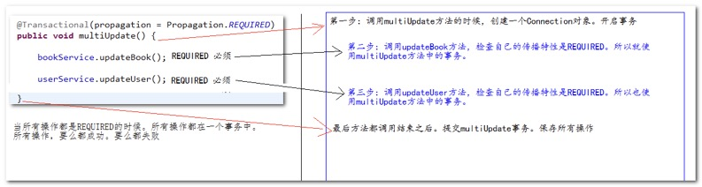

当所有的操作都是REQUIRED的时候，所有操作都在一个事务中。所有操作要么都成功。要么都失败。

#### 实验2：大小事务传播特性都是REQUIRES_NEW

```java
@Transactional(propagation = Propagation.REQUIRES_NEW)
public void multiUpdate()
@Transactional(propagation = Propagation.REQUIRES_NEW)
public void updateBook()
@Transactional(propagation = Propagation.REQUIRES_NEW)
public void updateUser()
```


1. 所有事务传播特性都是REQUIRES_NEW,也就是每个方法都会开启自己的事务。当方法执行完成。都会提交自己的事务。
2. 如果有异常出现。就会从异常出现的代码所在的事务开始，到后面所有代码的操作都不会成功。

#### 实验3：大事务是REQUIRED，小事务都是REQUIRES_NEW

```java
@Transactional(propagation = Propagation.REQUIRED)
public void multiUpdate()
@Transactional(propagation = Propagation.REQUIRES_NEW)
public void updateBook()
@Transactional(propagation = Propagation.REQUIRES_NEW)
public void updateUser()
```

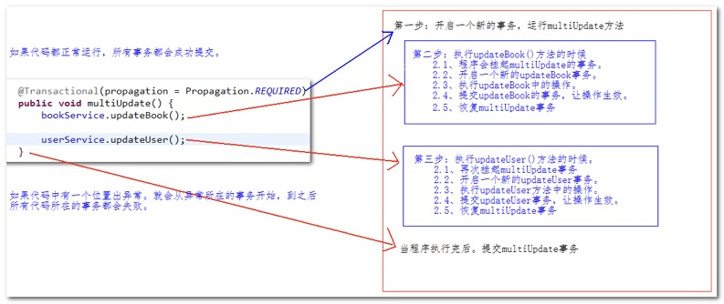

1. 这个测试，每个方法也都会开启事务。如果程序正常运行。每个事务都会正常提交。

2. 如果程序中有异常出现。就会从异常出现的代码所在的事务开始，到后面所有代码操作都不会成功！

#### 实验4：大事务是REQUIRED，小1REQUIRED，小2REQUIRES_NEW

```java
@Transactional(propagation = Propagation.REQUIRED)
public void multiUpdate()
@Transactional(propagation = Propagation.REQUIRED)
public void updateBook()
@Transactional(propagation = Propagation.REQUIRES_NEW)
public void updateUser()
```


1. 这个测试，在调用`multiUpdate`方法和`updateUser`方法的时候会开启事务。如果程序正常运行。每个事务都会正常提交。

2. 如果程序中有异常出现。就会从异常出现的代码所在的事务开始，到后面所有代码操作都不会成功！

#### 实验5：大事务是REQUIRED，小1REQUIRES_NEW，小2REQUIRED

```java
@Transactional(propagation = Propagation.REQUIRED)
public void multiUpdate()
@Transactional(propagation = Propagation.REQUIRES_NEW)
public void updateBook()
@Transactional(propagation = Propagation.REQUIRED)
public void updateUser()
```


1. 如果程序都正常运行，所有事务都会正常提交。

2. 如果程序出现异常。就会从出现异常的代码所在的事务开始，以后面所有代码所在的事务都不会成功！

# xml配置式事务声明

去掉。所有@Transaction的注解。

在applicationContext.xml配置文件中进行如下配置：

```xml
	<!-- 配置事务管理器 -->
	<bean id="transactionManager" class="org.springframework.jdbc.datasource.DataSourceTransactionManager">
		<!-- 事务管理器，需要数据库连接池对象 -->
		<property name="dataSource" ref="dataSource" />
	</bean>
	<!-- 需要配置方法的事务特性 -->
	<tx:advice id="advice1" transaction-manager="transactionManager">
		<tx:attributes>
      <!-- 方法在匹配事务属性规则时，匹配顺序是：精确匹配==》半模糊==》全模糊-->
			<!-- 半模糊匹配，表示update打头的方法，都使用新的事务 -->
			<tx:method name="update*" propagation="REQUIRES_NEW" />
			<!-- 精确匹配，表示multiUpdate方法都使用新的事务 -->
			<tx:method name="multiUpdate" propagation="REQUIRES_NEW" />
		</tx:attributes>
	</tx:advice>		
	<!-- 配置切面的配置信息-->
	<aop:config>
		<!-- 配置切入点。切入点可以知道有哪些类，哪些方法进入切入管理。 -->
		<aop:pointcut expression="execution(* com.atguigu.service.*Service.*(..))" id="pointcut1"/>
		<!-- 配置切入点中都使用哪些事务特性 -->
		<aop:advisor pointcut-ref="pointcut1" advice-ref="advice1"/>
	</aop:config>
```

# Spring整合Web

## 在web工程中添加Spring的jar包

Spring的核心包

```xml
spring-beans-4.0.0.RELEASE.jar
spring-context-4.0.0.RELEASE.jar
spring-core-4.0.0.RELEASE.jar
spring-expression-4.0.0.RELEASE.jar
```

aop包

```xml
spring-aop-4.0.0.RELEASE.jar
spring-aspects-4.0.0.RELEASE.jar
com.springsource.org.aopalliance-1.0.0.jar
com.springsource.org.aspectj.weaver-1.6.8.RELEASE.jar
```

JDBC-ORM包

```xml
spring-jdbc-4.0.0.RELEASE.jar
spring-orm-4.0.0.RELEASE.jar
spring-tx-4.0.0.RELEASE.jar
```

Spring的web整合包

```xml
spring-web-4.0.0.RELEASE.jar
```

测试包

```xml
spring-test-4.0.0.RELEASE.jar
```

整合Spring和Web容器分两个步骤：

1、导入spring-web-4.0.0.RELEASE.jar

2、在web.xml配置文件中配置org.springframework.web.context.ContextLoaderListener监听器监听ServletContext的初始化

3、在web.xml配置文件中配置contextConfigLocation上下文参数。配置Spring配置文件的位置，以用于初始化Spring容器

## 在web.xml中配置

```xml
<!-- 配置的这个监听器，会在Web工程启动的时候创建好 Spring IOC 容器，并保存到ServletContext域中 -->
<!-- 配置Spring IOC 容器需要的配置文件路径 -->  
<context-param>
  	<param-name>contextConfigLocation</param-name>
  	<param-value>classpath:applicationContext.xml</param-value>
  </context-param>
<!-- 配置一个ServletContextListener监听器，在Web工程启动的时候创建ServletContext(创建了一个 Spring IOC容器)一个 -->
  <listener>
  	<listener-class>org.springframework.web.context.ContextLoaderListener</listener-class>
  </listener>
```

## 获取WebApplicationContext上下文对象的方法如下

方法一（推荐）

```java
WebApplicationContextUtils.getWebApplicationContext(getServletContext())
```

方法二（不推荐）

```java
WebApplicationContext webApplicationContext = (WebApplicationContext) getServletContext().getAttribute(WebApplicationContext.ROOT_WEB_APPLICATION_CONTEXT_ATTRIBUTE);
```

