# 一、Spring Boot入门

## 1、Spring Boot 简介

> 简化 Spring 应用开发的一个框架；
>
> 整个 Spring 技术栈的一个大整合；
>
> J2EE 开发的一站式解决方案；

优点：

* 快速创建独立运行的 Spring 项目以及与主流框架集成

* 使用嵌入式的 Servlet 容器，应用无需打成 WAR 包

* starters 自动依赖与版本控制

* 大量的自动配置，简化开发，也可修改默认值

* 无需配置XML，无代码生成，开箱即用

* 准生产环境的运行时应用监控

* 与云计算的天然集成 

## 2、微服务

2014，martin fowler

微服务：架构风格（服务微化）

一个应用应该是一组小型服务；可以通过HTTP的方式进行互通；

单体应用：ALL IN ONE

微服务：每一个功能元素最终都是一个可独立替换和独立升级的软件单元；

[详细参照微服务文档](https://martinfowler.com/articles/microservices.html#MicroservicesAndSoa)


单体应用

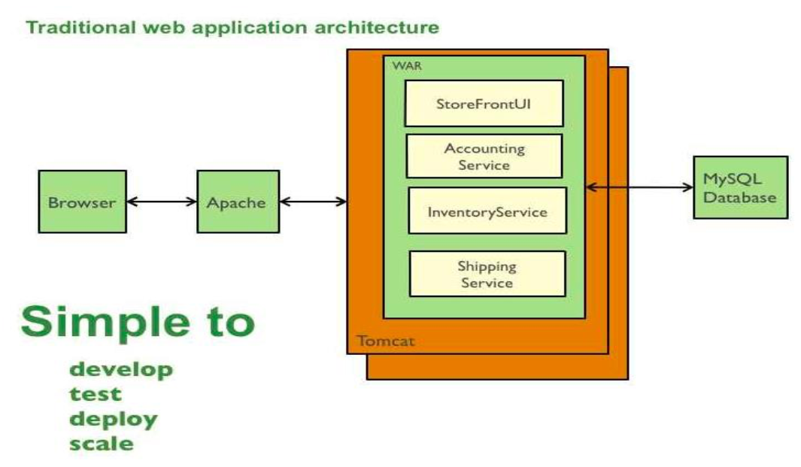

微服务

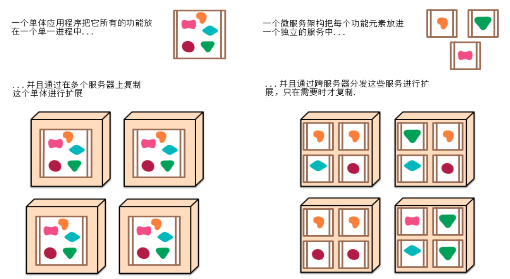


## 3、环境准备

环境约束

–jdk1.8：Spring Boot 推荐jdk1.7及以上；java version "1.8.0_112"

–maven3.x：maven 3.3以上版本；Apache Maven 3.3.9

–IntelliJIDEA2017：IntelliJ IDEA 2017.2.2 x64、STS

–SpringBoot 1.5.9.RELEASE：1.5.9；

统一环境；


### (1)、MAVEN设置

给maven的settings.xml配置文件的profiles标签添加

```xml
<profile>
  <id>jdk-1.8</id>
  <activation>
    <activeByDefault>true</activeByDefault>
    <jdk>1.8</jdk>
  </activation>
  <properties>
    <maven.compiler.source>1.8</maven.compiler.source>
    <maven.compiler.target>1.8</maven.compiler.target>
    <maven.compiler.compilerVersion>1.8</maven.compiler.compilerVersion>
  </properties>
</profile>
```

### (2)、IDEA设置

整合maven进来；


## 4、HelloWorld

一个功能：

浏览器发送hello请求，服务器接受请求并处理，响应Hello World字符串；


### (1)、创建一个maven工程(jar)


### (2)、导入相关的依赖

```xml
    <parent>
        <groupId>org.springframework.boot</groupId>
        <artifactId>spring-boot-starter-parent</artifactId>
        <version>1.5.9.RELEASE</version>
    </parent>
    <dependencies>
        <dependency>
            <groupId>org.springframework.boot</groupId>
            <artifactId>spring-boot-starter-web</artifactId>
        </dependency>
    </dependencies>
```

### (3)、编写一个主程序

```java

/**
 *  @SpringBootApplication 来标注一个主程序类，说明这是一个Spring Boot应用
 */
@SpringBootApplication
public class HelloWorldMainApplication {

    public static void main(String[] args) {

        // Spring应用启动起来
        SpringApplication.run(HelloWorldMainApplication.class,args);
    }
}
```

### (4)、编写相关的Controller

```java
@Controller
public class HelloController {

    @ResponseBody
    @RequestMapping("/hello")
    public String hello(){
        return "Hello World!";
    }
}
```

### (5)、运行主程序测试


### (6)、简化部署

```xml
 <!-- 这个插件，可以将应用打包成一个可执行的jar包；-->
    <build>
        <plugins>
            <plugin>
                <groupId>org.springframework.boot</groupId>
                <artifactId>spring-boot-maven-plugin</artifactId>
            </plugin>
        </plugins>
    </build>
```

将这个应用打成jar包

| ddddddddddddddddddddddddddddddddddddddddddddddddddddddddddddddddddddddddddddddddddddddddddddddddddddddddddddddddddddddddddddddd | d    |
| ------------------------------------------------------------ | ---- |
|  |      |

直接使用java -jar的命令进行执行；

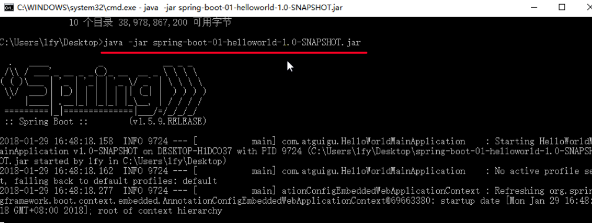

## 5、Hello World探究

### (1)、POM文件

#### [1]、父项目

```xml
<parent>
    <groupId>org.springframework.boot</groupId>
    <artifactId>spring-boot-starter-parent</artifactId>
    <version>1.5.9.RELEASE</version>
</parent>

<!-- 他的父项目是 -->
<parent>
  <groupId>org.springframework.boot</groupId>
  <artifactId>spring-boot-dependencies</artifactId>
  <version>1.5.9.RELEASE</version>
  <relativePath>../../spring-boot-dependencies</relativePath>
</parent>
<!-- 他来真正管理Spring Boot应用里面的所有依赖版本；-->

```

Spring Boot的版本仲裁中心；

以后我们导入依赖默认是不需要写版本；（没有在dependencies里面管理的依赖自然需要声明版本号）

#### [2]、启动器

```xml
<dependency>
    <groupId>org.springframework.boot</groupId>
    <artifactId>spring-boot-starter-web</artifactId>
</dependency>
```

**spring-boot-starter**-==web==：

​	spring-boot-starter：spring-boot场景启动器；帮我们导入了web模块正常运行所依赖的组件；


Spring Boot 将所有的功能场景都抽取出来，做成一个个的 starters（启动器），只需要在项目里面引入这些starter 相关场景的所有依赖都会导入进来。要用什么功能就导入什么场景的启动器


### (2)、主程序类，主入口类

```java
/**
 *  @SpringBootApplication 来标注一个主程序类，说明这是一个Spring Boot应用
 */
@SpringBootApplication
public class HelloWorldMainApplication {

    public static void main(String[] args) {

        // Spring应用启动起来
        SpringApplication.run(HelloWorldMainApplication.class,args);
    }
}

```

@**SpringBootApplication**:    SpringBoot 应用标注在某个类上说明这个类是 SpringBoot 的主配置类，SpringBoot 就应该运行这个类的 main 方法来启动 SpringBoot 应用；


```java
@Target(ElementType.TYPE)
@Retention(RetentionPolicy.RUNTIME)
@Documented
@Inherited
@SpringBootConfiguration
@EnableAutoConfiguration
@ComponentScan(excludeFilters = {
      @Filter(type = FilterType.CUSTOM, classes = TypeExcludeFilter.class),
      @Filter(type = FilterType.CUSTOM, classes = AutoConfigurationExcludeFilter.class) })
public @interface SpringBootApplication {
```

@**SpringBootConfiguration**:Spring Boot的配置类；

​		标注在某个类上，表示这是一个Spring Boot的配置类；

​		@**Configuration**:配置类上来标注这个注解；

​			配置类  -----  配置文件；配置类也是容器中的一个组件；@Component


@**EnableAutoConfiguration**：开启自动配置功能；

​		以前我们需要配置的东西，Spring Boot帮我们自动配置；@**EnableAutoConfiguration**告诉SpringBoot开启自动配置功能；这样自动配置才能生效；

```java
@AutoConfigurationPackage
@Import(EnableAutoConfigurationImportSelector.class)
public @interface EnableAutoConfiguration {
```

​      	@**AutoConfigurationPackage**：自动配置包

​		@**Import**(AutoConfigurationPackages.Registrar.class)：

​		Spring的底层注解@Import，给容器中导入一个组件；导入的组件由AutoConfigurationPackages.Registrar.class；

==将主配置类（@SpringBootApplication标注的类）的所在包及下面所有子包里面的所有组件扫描到Spring容器；==

​	@**Import**(EnableAutoConfigurationImportSelector.class)；

​		给容器中导入组件？

​		**EnableAutoConfigurationImportSelector**：导入哪些组件的选择器；

​		将所有需要导入的组件以全类名的方式返回；这些组件就会被添加到容器中；

​		会给容器中导入非常多的自动配置类（xxxAutoConfiguration）；就是给容器中导入这个场景需要的所有组件，并配置好这些组件；		

有了自动配置类，免去了我们手动编写配置注入功能组件等的工作；

​		SpringFactoriesLoader.loadFactoryNames(EnableAutoConfiguration.class,classLoader)；


==Spring Boot在启动的时候从类路径下的META-INF/spring.factories中获取EnableAutoConfiguration指定的值，将这些值作为自动配置类导入到容器中，自动配置类就生效，帮我们进行自动配置工作；==以前我们需要自己配置的东西，自动配置类都帮我们；

J2EE的整体整合解决方案和自动配置都在 spring-boot-autoconfigure-1.5.9.RELEASE.jar；


## 6、使用Spring Initializer快速创建Spring Boot项目

### (1)、IDEA：使用 Spring Initializer快速创建项目

IDE都支持使用Spring的项目创建向导快速创建一个Spring Boot项目；


选择我们需要的模块；

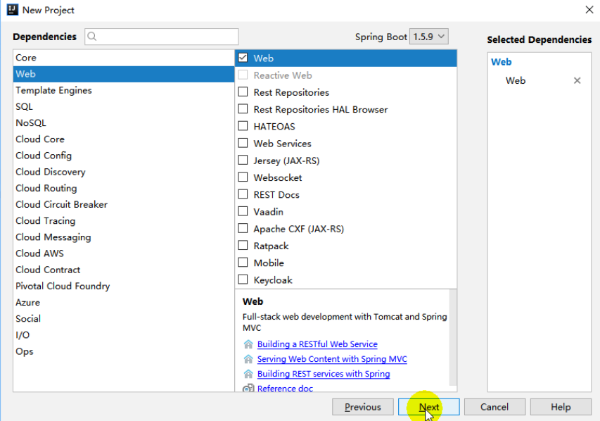

向导会联网创建Spring Boot项目；


Maven没有选择自动导入的话，可以点击刷新重新导入

默认生成的Spring Boot项目；

- 主程序已经生成好了，我们只需要我们自己的逻辑
- resources文件夹中目录结构
  - static：保存所有的静态资源； js css  images；
  - templates：保存所有的模板页面；（Spring Boot默认jar包使用嵌入式的Tomcat，默认不支持JSP页面）；可以使用模板引擎（freemarker、thymeleaf）；
  - application.properties：Spring Boot应用的配置文件；可以修改一些默认设置；

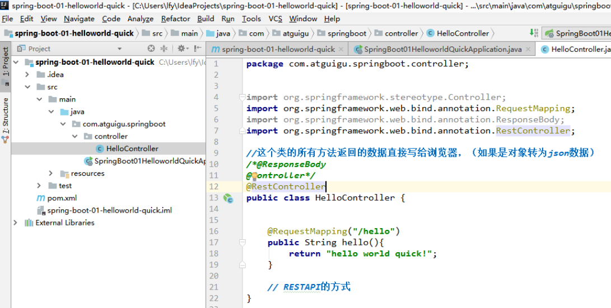

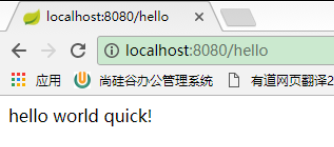

### (2)、STS使用 Spring Starter Project快速创建项目

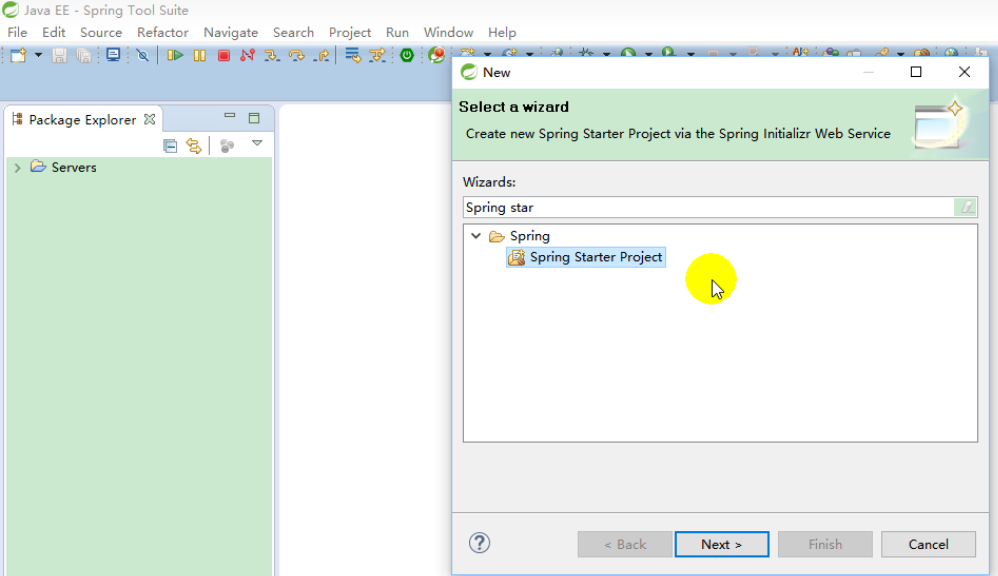


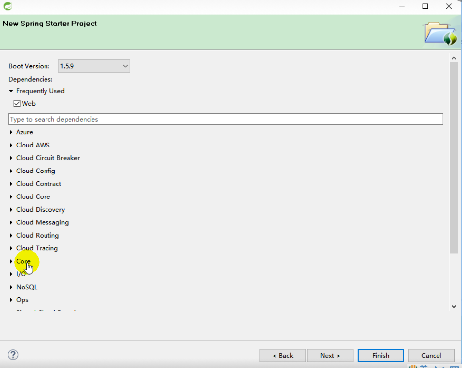

# 二、配置文件

## 1、配置文件

SpringBoot使用一个全局的配置文件，配置文件名是固定的；

• application.properties

•application.yml


配置文件的作用：修改SpringBoot自动配置的默认值；SpringBoot在底层都给我们自动配置好；


YAML（YAML Ain't Markup Language）

​	YAML  A Markup Language：是一个标记语言

​	YAML   isn't Markup Language：不是一个标记语言；

标记语言：

​	以前的配置文件；大多都使用的是  **xxxx.xml**文件；

​	YAML：**以数据为中心**，比json、xml等更适合做配置文件；

​	YAML：配置例子

```yaml
server:
  port: 8081
```

​	XML：

```xml
<server>
	<port>8081</port>
</server>
```


## 2、YAML语法：

### (1)、基本语法

k:(空格)v：表示一对键值对（空格必须有）；

以**空格**的缩进来控制层级关系；只要是左对齐的一列数据，都是同一个层级的

```yaml
server:
    port: 8081
    path: /hello
```

属性和值也是大小写敏感；


### (2)、值的写法

#### [1]、字面量：普通的值（数字，字符串，布尔）

​	k: v：字面直接来写；

​		字符串默认不用加上单引号或者双引号；

​		""：双引号；不会转义字符串里面的特殊字符；特殊字符会作为本身想表示的意思

​				name:   "zhangsan \n lisi"：输出；zhangsan 换行  lisi

​		''：单引号；会转义特殊字符，特殊字符最终只是一个普通的字符串数据

​				name:   'zhangsan \n lisi'：输出；zhangsan \n  lisi


#### [2]、对象、Map（属性和值）（键值对）：

​	k: v：在下一行来写对象的属性和值的关系；注意缩进

​		对象还是k: v的方式

```yaml
friends:
		lastName: zhangsan
		age: 20
```

行内写法：

```yaml
friends: {lastName: zhangsan,age: 18}
```


#### [3]、数组（List、Set）：

用- 值表示数组中的一个元素

```yaml
pets:
 - cat
 - dog
 - pig
```

行内写法

```yaml
pets: [cat,dog,pig]
```


## 3、配置文件值注入

### (1)、@ConfigurationProperties获取值

#### [1]、application.yml配置文件

```yaml
person:
    lastName: hello
    age: 18
    boss: false
    birth: 2017/12/12
    maps: {k1: v1,k2: 12}
    lists:
      - lisi
      - zhaoliu
    dog:
      name: 小狗
      age: 12
```

javaBean：

```java
/**
 * 将配置文件中配置的每一个属性的值，映射到这个组件中
 * @ConfigurationProperties：告诉SpringBoot将本类中的所有属性和配置文件中相关的配置进行绑定；
 *      prefix = "person"：配置文件中哪个下面的所有属性进行一一映射
 *
 * 只有这个组件是容器中的组件，才能容器提供的@ConfigurationProperties功能；
 *
 */
@Component
@ConfigurationProperties(prefix = "person")
public class Person {

    private String lastName;
    private Integer age;
    private Boolean boss;
    private Date birth;

    private Map<String,Object> maps;
    private List<Object> lists;
    private Dog dog;

```


我们可以导入配置文件处理器，以后编写配置就有提示了

```xml
<!--导入配置文件处理器，配置文件进行绑定就会有提示-->
		<dependency>
			<groupId>org.springframework.boot</groupId>
			<artifactId>spring-boot-configuration-processor</artifactId>
			<optional>true</optional>
		</dependency>
```

运行测试

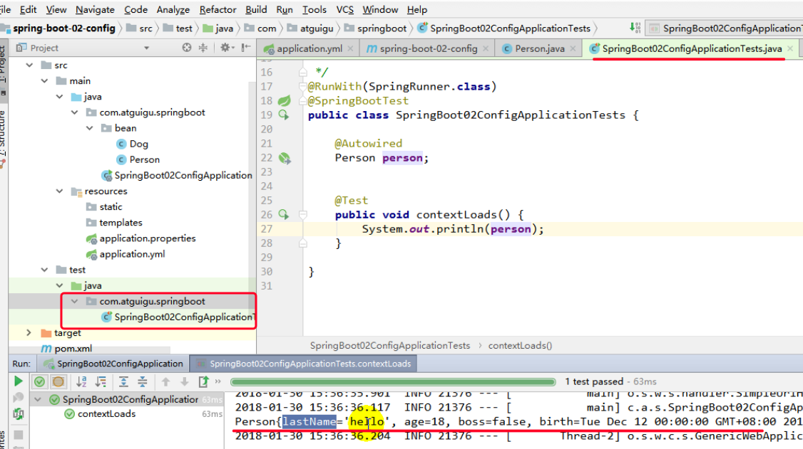

#### [2]、properties配置文件

在idea中配置文件默认ascii可能会乱码


调整


### (2)、@Value获取值

```java
@Component
//@ConfigurationProperties(prefix = "person")
public class Person {

    /**
     * <bean class="Person">
     *      <property name="lastName" value="字面量/${key} 从环境变量、配置文件中获取值/#{SpEL}"></property>
     * <bean/>
     */

    @Value("${person.last-name}")
    private String lastName;
    @Value("#{11*2}")
    private Integer age;
    @Value("true")
    private Boolean boss; 
```

运行结果，可以正确获取值


### (3)、@Value和@ConfigurationProperties对比

|            | @ConfigurationProperties | @Value |
| ---------- | ------------------------ | ------ |
| 功能         | 批量注入配置文件中的属性             | 一个个指定  |
| 松散绑定（松散语法） | 支持                       | 不支持    |
| SpEL       | 不支持                      | 支持     |
| JSR303数据校验 | 支持                       | 不支持    |
| 复杂类型封装     | 支持                       | 不支持    |

配置文件yml还是properties他们都能获取到值；

如果说，我们只是在某个业务逻辑中需要获取一下配置文件中的某项值，使用@Value；

如果说，我们专门编写了一个javaBean来和配置文件进行映射，我们就直接使用@ConfigurationProperties；

#### [1]、属性名匹配规则（松散语法-Relaxedbinding）

- person.firstName:使用标准方式
- person.first-name:大写用-
- person.first_name:大写用_ 
- PERSON_FIRST_NAME: 

#### [2]、@ConfigurationProperties支持JSR303数据校验

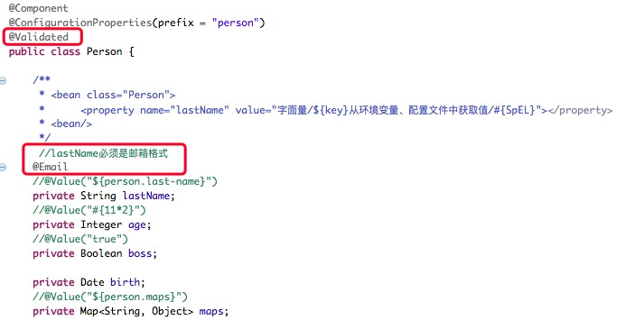

运行结果，无法正确获取值


### (4)、加载配置文件

#### [1]、@PropertySource

@**PropertySource**：加载指定的配置文件；

```java
/**
 * 将配置文件中配置的每一个属性的值，映射到这个组件中
 * @ConfigurationProperties：告诉SpringBoot将本类中的所有属性和配置文件中相关的配置进行绑定；
 *      prefix = "person"：配置文件中哪个下面的所有属性进行一一映射
 *
 * 只有这个组件是容器中的组件，才能容器提供的@ConfigurationProperties功能；
 *  @ConfigurationProperties(prefix = "person")默认从全局配置文件中获取值；
 *
 */
@PropertySource(value = {"classpath:person.properties"})
@Component
@ConfigurationProperties(prefix = "person")
//@Validated
public class Person {

    /**
     * <bean class="Person">
     *      <property name="lastName" value="字面量/${key}从环境变量、配置文件中获取值/#{SpEL}"></property>
     * <bean/>
     */

   //lastName必须是邮箱格式
   // @Email
    //@Value("${person.last-name}")
    private String lastName;
    //@Value("#{11*2}")
    private Integer age;
    //@Value("true")
    private Boolean boss;

```

对应的person.properties


#### [2]、@ImportResource

@**ImportResource**：导入Spring的配置文件，让配置文件里面的内容生效；

Spring Boot里面没有Spring的配置文件，我们自己编写的配置文件，也不能自动识别；

想让Spring的配置文件生效，加载进来；@**ImportResource**标注在一个配置类上

1、要被spring管理的类

```java
public class HelloService {
}
```

2、自定义spring管理文件beans.xml

```xml
<?xml version="1.0" encoding="UTF-8"?>
<beans xmlns="http://www.springframework.org/schema/beans"
       xmlns:xsi="http://www.w3.org/2001/XMLSchema-instance"
       xsi:schemaLocation="http://www.springframework.org/schema/beans http://www.springframework.org/schema/beans/spring-beans.xsd">


    <bean id="helloService" class="com.atguigu.springboot.service.HelloService"></bean>
</beans>
```

3、注入配置

```java
@ImportResource({"classpath:beans.xml"})
@SpringBootApplication
public class Day925SpringBoot2ConfigApplication { 
```

4、测试是否注入成功

```java
@RunWith(SpringRunner.class)
@SpringBootTest
public class Day925SpringBoot2ConfigApplicationTest {

    @Autowired
    ApplicationContext ioc;

    @Test
    public void testHelloService() {
        boolean b = ioc.containsBean("helloService");
        System.out.println(b);
    } 
```

运行结果

true

#### [3]、==给容器中添加组件的方式==

推荐使用全注解的方式

1、配置类**@Configuration**------>Spring配置文件

2、使用**@Bean**给容器中添加组件

```java
/**
 * @Configuration：指明当前类是一个配置类；就是来替代之前的Spring配置文件
 *
 * 在配置文件中用<bean><bean/>标签添加组件
 *
 */
@Configuration
public class MyAppConfig {

    //将方法的返回值添加到容器中；容器中这个组件默认的id就是方法名
    @Bean
    public HelloService helloService02(){
        System.out.println("配置类@Bean给容器中添加组件了...");
        return new HelloService();
    }
}
```

测试：

```java
@RunWith(SpringRunner.class)
@SpringBootTest
public class Day925SpringBoot2ConfigApplicationTest {

    @Autowired
    ApplicationContext ioc;

    @Test
    public void testHelloService02() {
        boolean b = ioc.containsBean("helloService02");
        System.out.println(b);
    } 
```

运行结果


##4、配置文件占位符

### (1)、随机数

```java
${random.value}、${random.int}、${random.long}
${random.int(10)}、${random.int[1024,65536]}
```


### (2)、占位符获取之前配置的值，如果没有可以是用:指定默认值

```properties
person.last-name=张三${random.uuid}
person.age=${random.int}
person.birth=2017/12/15
person.boss=false
person.maps.k1=v1
person.maps.k2=14
person.lists=a,b,c
## 指定默认值
person.dog.name=${person.hello:hello}_dog 
person.dog.age=15
```


## 5、Profile

### (1)、多Profile文件

我们在主配置文件编写的时候，文件名可以是   application-{profile}.properties/yml

默认使用 application.properties 的配置；

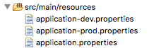

application.properties

```properties
server.port=8081
#激活开发环境
spring.profiles.active=dev  
```

application-dev.properties

```properties
server.port=8082 
```

application-prod.properties

```properties
server.port=8083 
```

运行主程序，控制台可看到启动了开发环境


### (2)、yml支持多文档块方式

```yml

server:
  port: 8081
spring:
  profiles:
    active: prod

---
server:
  port: 8083
spring:
  profiles: dev


---

server:
  port: 8084
spring:
  profiles: prod  #指定属于哪个环境
```


### (3)、激活指定profile

​	1、在配置文件中指定  spring.profiles.active=dev 

​		 以上两种都是配置文件配置

​	2、命令行：

​		java -jar spring-boot-02-config-0.0.1-SNAPSHOT.jar --spring.profiles.active=dev；

​		可以直接在测试的时候，配置传入命令行参数

​		IDEA 中：


​	3、虚拟机参数；

​		-Dspring.profiles.active=dev

​		IDEA 中：

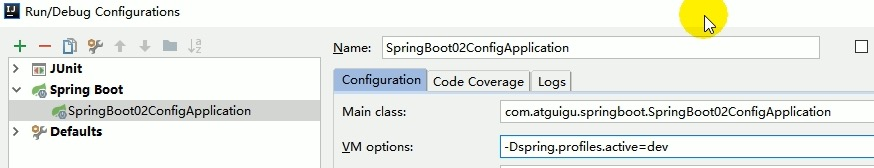


## 6、配置文件加载位置

1、springboot 启动会扫描以下位置的application.properties或者application.yml文件作为Spring boot的默认配置文件

–file:./config/

–file:./

–classpath:/config/

–classpath:/

==优先级由高到底==，高优先级的配置会覆盖低优先级的配置；

SpringBoot会从这四个位置全部加载主配置文件；**互补配置**；

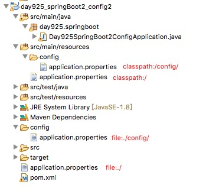

配置文件中，根据优先级低到高配置启动端口从server.port=8081变化到 8084，只有一个classpath:/下的配置时候，启动程序可以看到tomcat 的启动端口是 8081 ，当file:./config/下的配置的时候，启动程序可以看到tomcat 的启动端口是 8084


==我们还可以通过spring.config.location来改变默认的配置文件位置==

**项目打包好以后，我们可以使用命令行参数的形式，启动项目的时候来指定配置文件的新位置；指定配置文件和默认加载的这些配置文件共同起作用形成互补配置；**

java -jar spring-boot-02-config-02-0.0.1-SNAPSHOT.jar --spring.config.location=G:/application.properties

## 7、外部配置加载顺序

**==SpringBoot也可以从以下位置加载配置； 优先级从高到低；高优先级的配置覆盖低优先级的配置，所有的配置会形成互补配置==**

**1、命令行参数**

所有的配置都可以在命令行上进行指定

java -jar spring-boot-02-config-02-0.0.1-SNAPSHOT.jar --server.port=8087  --server.context-path=/dulinlong

多个配置用空格分开； --配置项=值


2来自java:comp/env的JNDI属性

3、Java系统属性（System.getProperties()）

4操作系统环境变量

5、RandomValuePropertySource配置的random.*属性值


==**由jar包外向jar包内进行寻找；**==

==**优先加载带profile**==

**6jar包外部的application-{profile}.properties或application.yml(带spring.profile)配置文件**

**7、jar包内部的application-{profile}.properties或application.yml(带spring.profile)配置文件**


==**再来加载不带profile**==

**8、jar包外部的application.properties或application.yml(不带spring.profile)配置文件**


**9、jar包内部的application.properties或application.yml(不带spring.profile)配置文件**


10.@Configuration注解类上的@PropertySource

11、通过SpringApplication.setDefaultProperties指定的默认属性

所有支持的配置加载来源；

[参考官方文档](https://docs.spring.io/spring-boot/docs/1.5.9.RELEASE/reference/htmlsingle/#boot-features-external-config)

## 8、自动配置原理

配置文件到底能写什么？怎么写？自动配置原理；

[配置文件能配置的属性参照](https://docs.spring.io/spring-boot/docs/1.5.9.RELEASE/reference/htmlsingle/#common-application-properties)


### (1)、**自动配置原理：**

1、SpringBoot启动的时候加载主配置类，开启了自动配置功能 ==@EnableAutoConfiguration==

**2、@EnableAutoConfiguration 作用：**

 -  利用EnableAutoConfigurationImportSelector给容器中导入一些组件？
-  可以查看selectImports()方法的内容；
-  `List<String> configurations = getCandidateConfigurations(annotationMetadata,attributes);`获取候选的配置
```java
SpringFactoriesLoader.loadFactoryNames()
//扫描所有jar包类路径下  META-INF/spring.factories
//把扫描到的这些文件的内容包装成properties对象
//从properties中获取到EnableAutoConfiguration.class类（类名）对应的值，然后把他们添加在容器中
```

```
将类路径下META-INF/spring.factories 里面配置的所有EnableAutoConfiguration的值加入到了容器中；

​```properties
# Auto Configure
org.springframework.boot.autoconfigure.EnableAutoConfiguration=\
org.springframework.boot.autoconfigure.admin.SpringApplicationAdminJmxAutoConfiguration,\
org.springframework.boot.autoconfigure.aop.AopAutoConfiguration,\
org.springframework.boot.autoconfigure.amqp.RabbitAutoConfiguration,\
org.springframework.boot.autoconfigure.batch.BatchAutoConfiguration,\
org.springframework.boot.autoconfigure.cache.CacheAutoConfiguration,\
org.springframework.boot.autoconfigure.cassandra.CassandraAutoConfiguration,\
org.springframework.boot.autoconfigure.cloud.CloudAutoConfiguration,\
org.springframework.boot.autoconfigure.context.ConfigurationPropertiesAutoConfiguration,\
org.springframework.boot.autoconfigure.context.MessageSourceAutoConfiguration,\
org.springframework.boot.autoconfigure.context.PropertyPlaceholderAutoConfiguration,\
org.springframework.boot.autoconfigure.couchbase.CouchbaseAutoConfiguration,\
org.springframework.boot.autoconfigure.dao.PersistenceExceptionTranslationAutoConfiguration,\
org.springframework.boot.autoconfigure.data.cassandra.CassandraDataAutoConfiguration,\
org.springframework.boot.autoconfigure.data.cassandra.CassandraRepositoriesAutoConfiguration,\
org.springframework.boot.autoconfigure.data.couchbase.CouchbaseDataAutoConfiguration,\
org.springframework.boot.autoconfigure.data.couchbase.CouchbaseRepositoriesAutoConfiguration,\
org.springframework.boot.autoconfigure.data.elasticsearch.ElasticsearchAutoConfiguration,\
org.springframework.boot.autoconfigure.data.elasticsearch.ElasticsearchDataAutoConfiguration,\
org.springframework.boot.autoconfigure.data.elasticsearch.ElasticsearchRepositoriesAutoConfiguration,\
org.springframework.boot.autoconfigure.data.jpa.JpaRepositoriesAutoConfiguration,\
org.springframework.boot.autoconfigure.data.ldap.LdapDataAutoConfiguration,\
org.springframework.boot.autoconfigure.data.ldap.LdapRepositoriesAutoConfiguration,\
org.springframework.boot.autoconfigure.data.mongo.MongoDataAutoConfiguration,\
org.springframework.boot.autoconfigure.data.mongo.MongoRepositoriesAutoConfiguration,\
org.springframework.boot.autoconfigure.data.neo4j.Neo4jDataAutoConfiguration,\
org.springframework.boot.autoconfigure.data.neo4j.Neo4jRepositoriesAutoConfiguration,\
org.springframework.boot.autoconfigure.data.solr.SolrRepositoriesAutoConfiguration,\
org.springframework.boot.autoconfigure.data.redis.RedisAutoConfiguration,\
org.springframework.boot.autoconfigure.data.redis.RedisRepositoriesAutoConfiguration,\
org.springframework.boot.autoconfigure.data.rest.RepositoryRestMvcAutoConfiguration,\
org.springframework.boot.autoconfigure.data.web.SpringDataWebAutoConfiguration,\
org.springframework.boot.autoconfigure.elasticsearch.jest.JestAutoConfiguration,\
org.springframework.boot.autoconfigure.freemarker.FreeMarkerAutoConfiguration,\
org.springframework.boot.autoconfigure.gson.GsonAutoConfiguration,\
org.springframework.boot.autoconfigure.h2.H2ConsoleAutoConfiguration,\
org.springframework.boot.autoconfigure.hateoas.HypermediaAutoConfiguration,\
org.springframework.boot.autoconfigure.hazelcast.HazelcastAutoConfiguration,\
org.springframework.boot.autoconfigure.hazelcast.HazelcastJpaDependencyAutoConfiguration,\
org.springframework.boot.autoconfigure.info.ProjectInfoAutoConfiguration,\
org.springframework.boot.autoconfigure.integration.IntegrationAutoConfiguration,\
org.springframework.boot.autoconfigure.jackson.JacksonAutoConfiguration,\
org.springframework.boot.autoconfigure.jdbc.DataSourceAutoConfiguration,\
org.springframework.boot.autoconfigure.jdbc.JdbcTemplateAutoConfiguration,\
org.springframework.boot.autoconfigure.jdbc.JndiDataSourceAutoConfiguration,\
org.springframework.boot.autoconfigure.jdbc.XADataSourceAutoConfiguration,\
org.springframework.boot.autoconfigure.jdbc.DataSourceTransactionManagerAutoConfiguration,\
org.springframework.boot.autoconfigure.jms.JmsAutoConfiguration,\
org.springframework.boot.autoconfigure.jmx.JmxAutoConfiguration,\
org.springframework.boot.autoconfigure.jms.JndiConnectionFactoryAutoConfiguration,\
org.springframework.boot.autoconfigure.jms.activemq.ActiveMQAutoConfiguration,\
org.springframework.boot.autoconfigure.jms.artemis.ArtemisAutoConfiguration,\
org.springframework.boot.autoconfigure.flyway.FlywayAutoConfiguration,\
org.springframework.boot.autoconfigure.groovy.template.GroovyTemplateAutoConfiguration,\
org.springframework.boot.autoconfigure.jersey.JerseyAutoConfiguration,\
org.springframework.boot.autoconfigure.jooq.JooqAutoConfiguration,\
org.springframework.boot.autoconfigure.kafka.KafkaAutoConfiguration,\
org.springframework.boot.autoconfigure.ldap.embedded.EmbeddedLdapAutoConfiguration,\
org.springframework.boot.autoconfigure.ldap.LdapAutoConfiguration,\
org.springframework.boot.autoconfigure.liquibase.LiquibaseAutoConfiguration,\
org.springframework.boot.autoconfigure.mail.MailSenderAutoConfiguration,\
org.springframework.boot.autoconfigure.mail.MailSenderValidatorAutoConfiguration,\
org.springframework.boot.autoconfigure.mobile.DeviceResolverAutoConfiguration,\
org.springframework.boot.autoconfigure.mobile.DeviceDelegatingViewResolverAutoConfiguration,\
org.springframework.boot.autoconfigure.mobile.SitePreferenceAutoConfiguration,\
org.springframework.boot.autoconfigure.mongo.embedded.EmbeddedMongoAutoConfiguration,\
org.springframework.boot.autoconfigure.mongo.MongoAutoConfiguration,\
org.springframework.boot.autoconfigure.mustache.MustacheAutoConfiguration,\
org.springframework.boot.autoconfigure.orm.jpa.HibernateJpaAutoConfiguration,\
org.springframework.boot.autoconfigure.reactor.ReactorAutoConfiguration,\
org.springframework.boot.autoconfigure.security.SecurityAutoConfiguration,\
org.springframework.boot.autoconfigure.security.SecurityFilterAutoConfiguration,\
org.springframework.boot.autoconfigure.security.FallbackWebSecurityAutoConfiguration,\
org.springframework.boot.autoconfigure.security.oauth2.OAuth2AutoConfiguration,\
org.springframework.boot.autoconfigure.sendgrid.SendGridAutoConfiguration,\
org.springframework.boot.autoconfigure.session.SessionAutoConfiguration,\
org.springframework.boot.autoconfigure.social.SocialWebAutoConfiguration,\
org.springframework.boot.autoconfigure.social.FacebookAutoConfiguration,\
org.springframework.boot.autoconfigure.social.LinkedInAutoConfiguration,\
org.springframework.boot.autoconfigure.social.TwitterAutoConfiguration,\
org.springframework.boot.autoconfigure.solr.SolrAutoConfiguration,\
org.springframework.boot.autoconfigure.thymeleaf.ThymeleafAutoConfiguration,\
org.springframework.boot.autoconfigure.transaction.TransactionAutoConfiguration,\
org.springframework.boot.autoconfigure.transaction.jta.JtaAutoConfiguration,\
org.springframework.boot.autoconfigure.validation.ValidationAutoConfiguration,\
org.springframework.boot.autoconfigure.web.DispatcherServletAutoConfiguration,\
org.springframework.boot.autoconfigure.web.EmbeddedServletContainerAutoConfiguration,\
org.springframework.boot.autoconfigure.web.ErrorMvcAutoConfiguration,\
org.springframework.boot.autoconfigure.web.HttpEncodingAutoConfiguration,\
org.springframework.boot.autoconfigure.web.HttpMessageConvertersAutoConfiguration,\
org.springframework.boot.autoconfigure.web.MultipartAutoConfiguration,\
org.springframework.boot.autoconfigure.web.ServerPropertiesAutoConfiguration,\
org.springframework.boot.autoconfigure.web.WebClientAutoConfiguration,\
org.springframework.boot.autoconfigure.web.WebMvcAutoConfiguration,\
org.springframework.boot.autoconfigure.websocket.WebSocketAutoConfiguration,\
org.springframework.boot.autoconfigure.websocket.WebSocketMessagingAutoConfiguration,\
org.springframework.boot.autoconfigure.webservices.WebServicesAutoConfiguration
```

每一个这样的  xxxAutoConfiguration类都是容器中的一个组件，都加入到容器中；用他们来做自动配置；

3、每一个自动配置类进行自动配置功能；

4、以**HttpEncodingAutoConfiguration（Http编码自动配置）**为例解释自动配置原理；

```java
@Configuration   //表示这是一个配置类，以前编写的配置文件一样，也可以给容器中添加组件
@EnableConfigurationProperties(HttpEncodingProperties.class)  //启动指定类的ConfigurationProperties功能；将配置文件中对应的值和HttpEncodingProperties绑定起来；并把HttpEncodingProperties加入到ioc容器中

@ConditionalOnWebApplication //Spring底层@Conditional注解（Spring注解版），根据不同的条件，如果满足指定的条件，整个配置类里面的配置就会生效；    判断当前应用是否是web应用，如果是，当前配置类生效

@ConditionalOnClass(CharacterEncodingFilter.class)  //判断当前项目有没有这个类CharacterEncodingFilter；SpringMVC中进行乱码解决的过滤器；

@ConditionalOnProperty(prefix = "spring.http.encoding", value = "enabled", matchIfMissing = true)  //判断配置文件中是否存在某个配置  spring.http.encoding.enabled；如果不存在，判断也是成立的
//即使我们配置文件中不配置pring.http.encoding.enabled=true，也是默认生效的；
public class HttpEncodingAutoConfiguration {
  
  	//他已经和SpringBoot的配置文件映射了
  	private final HttpEncodingProperties properties;
  
   //只有一个有参构造器的情况下，参数的值就会从容器中拿
  	public HttpEncodingAutoConfiguration(HttpEncodingProperties properties) {
		this.properties = properties;
	}
  
    @Bean   //给容器中添加一个组件，这个组件的某些值需要从properties中获取
	@ConditionalOnMissingBean(CharacterEncodingFilter.class) //判断容器没有这个组件
	public CharacterEncodingFilter characterEncodingFilter() {
		CharacterEncodingFilter filter = new OrderedCharacterEncodingFilter();
		filter.setEncoding(this.properties.getCharset().name());
		filter.setForceRequestEncoding(this.properties.shouldForce(Type.REQUEST));
		filter.setForceResponseEncoding(this.properties.shouldForce(Type.RESPONSE));
		return filter;
	}
```

根据当前不同的条件判断，决定这个配置类是否生效？

一但这个配置类生效；这个配置类就会给容器中添加各种组件；这些组件的属性是从对应的properties类中获取的，这些类里面的每一个属性又是和配置文件绑定的；

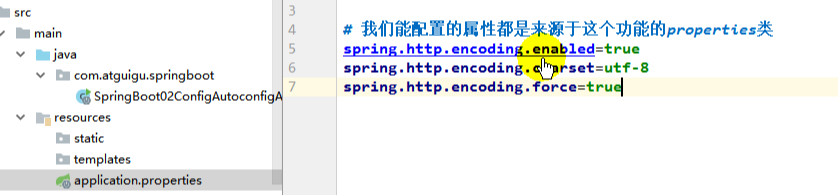

5、所有在配置文件中能配置的属性都是在xxxxProperties类中封装着；配置文件能配置什么就可以参照某个功能对应的这个属性类

```java
@ConfigurationProperties(prefix = "spring.http.encoding")  //从配置文件中获取指定的值和bean的属性进行绑定
public class HttpEncodingProperties {

   public static final Charset DEFAULT_CHARSET = Charset.forName("UTF-8");
```


**精髓：**

​	**1、SpringBoot启动会加载大量的自动配置类**

​	**2、我们看我们需要的功能有没有SpringBoot默认写好的自动配置类；**

​	**3、我们再来看这个自动配置类中到底配置了哪些组件；（只要我们要用的组件有，我们就不需要再来配置了）**

​	**4、给容器中自动配置类添加组件的时候，会从properties类中获取某些属性。我们就可以在配置文件中指定这些属性的值；**


xxxxAutoConfigurartion：自动配置类；

给容器中添加组件

xxxxProperties:封装配置文件中相关属性；


### (2)、细节

#### [1]、@Conditional派生注解（Spring注解版原生的@Conditional作用）

作用：必须是@Conditional指定的条件成立，才给容器中添加组件，配置配里面的所有内容才生效；

| @Conditional扩展注解                | 作用（判断是否满足当前指定条件）               |
| ------------------------------- | ------------------------------ |
| @ConditionalOnJava              | 系统的java版本是否符合要求                |
| @ConditionalOnBean              | 容器中存在指定Bean；                   |
| @ConditionalOnMissingBean       | 容器中不存在指定Bean；                  |
| @ConditionalOnExpression        | 满足SpEL表达式指定                    |
| @ConditionalOnClass             | 系统中有指定的类                       |
| @ConditionalOnMissingClass      | 系统中没有指定的类                      |
| @ConditionalOnSingleCandidate   | 容器中只有一个指定的Bean，或者这个Bean是首选Bean |
| @ConditionalOnProperty          | 系统中指定的属性是否有指定的值                |
| @ConditionalOnResource          | 类路径下是否存在指定资源文件                 |
| @ConditionalOnWebApplication    | 当前是web环境                       |
| @ConditionalOnNotWebApplication | 当前不是web环境                      |
| @ConditionalOnJndi              | JNDI存在指定项                      |

**自动配置类必须在一定的条件下才能生效；**

我们怎么知道哪些自动配置类生效；

**==我们可以通过启用  debug=true 属性；来让控制台打印自动配置报告==**，这样我们就可以很方便的知道哪些自动配置类生效；

```java
=========================
AUTO-CONFIGURATION REPORT
=========================


Positive matches:（自动配置类启用的）
-----------------

   DispatcherServletAutoConfiguration matched:
      - @ConditionalOnClass found required class 'org.springframework.web.servlet.DispatcherServlet'; @ConditionalOnMissingClass did not find unwanted class (OnClassCondition)
      - @ConditionalOnWebApplication (required) found StandardServletEnvironment (OnWebApplicationCondition)
        
    
Negative matches:（没有启动，没有匹配成功的自动配置类）
-----------------

   ActiveMQAutoConfiguration:
      Did not match:
         - @ConditionalOnClass did not find required classes 'javax.jms.ConnectionFactory', 'org.apache.activemq.ActiveMQConnectionFactory' (OnClassCondition)

   AopAutoConfiguration:
      Did not match:
         - @ConditionalOnClass did not find required classes 'org.aspectj.lang.annotation.Aspect', 'org.aspectj.lang.reflect.Advice' (OnClassCondition)
        
```


# 三、日志

## 1、日志框架

 小张；开发一个大型系统；

​		1、System.out.println("")；将关键数据打印在控制台；去掉？写在一个文件？

​		2、框架来记录系统的一些运行时信息；日志框架 ；  zhanglogging.jar；

​		3、高大上的几个功能？异步模式？自动归档？xxxx？  zhanglogging-good.jar？

​		4、将以前框架卸下来？换上新的框架，重新修改之前相关的API；zhanglogging-prefect.jar；

​		5、JDBC---数据库驱动；

​			写了一个统一的接口层；日志门面（日志的一个抽象层）；logging-abstract.jar；

​			给项目中导入具体的日志实现就行了；我们之前的日志框架都是实现的抽象层；


**市面上的日志框架；**

JUL、JCL、Jboss-logging、logback、log4j、log4j2、slf4j....

| 日志门面  （日志的抽象层）                                   | 日志实现                                             |
| ------------------------------------------------------------ | ---------------------------------------------------- |
| ~~JCL（Jakarta  Commons Logging）(最后一次2014更新)~~    SLF4j（Simple  Logging Facade for Java）    ~~jboss-logging(特定框架使用)~~ | Log4j  JUL（java.util.logging）  Log4j2  **Logback** |

左边选一个门面（抽象层）、右边来选一个实现；

日志门面：  SLF4J；

日志实现：Logback；


SpringBoot：底层是Spring框架，Spring框架默认是用JCL；

​	**==SpringBoot选用 SLF4j和logback；==**


## 2、SLF4j使用

### (1)、如何在系统中使用SLF4j   

https://www.slf4j.org

以后开发的时候，日志记录方法的调用，不应该来直接调用日志的实现类，而是调用日志抽象层里面的方法；

给系统里面导入slf4j的jar和  logback的实现jar

```java
import org.slf4j.Logger;
import org.slf4j.LoggerFactory;

public class HelloWorld {
  public static void main(String[] args) {
    Logger logger = LoggerFactory.getLogger(HelloWorld.class);
    logger.info("Hello World");
  }
}
```

图示；

| ddddddddddddddddddddddddddddddddddddddddddddddddddddddddddddddddddddddddddddddddddddddddddddddddddddddddddddddddddddd | d    |
| ------------------------------------------------------------ | ---- |
|     |      |

每一个日志的实现框架都有自己的配置文件。使用slf4j以后，**配置文件还是做成日志实现框架自己本身的配置文件；**

### (2)、遗留问题

a系统（slf4j+logback）: Spring（commons-logging）、Hibernate（jboss-logging）、MyBatis、xxxx

统一日志记录，即使是别的框架和我一起统一使用slf4j进行输出？

| ddddddddddddddddddddddddddddddddddddddddddddddddddddddddddddddddddddddddddddddddddddddddddddddddddddddddddddddddddddddddddddddd | d    |
| ------------------------------------------------------------ | ---- |
|                |      |

**如何让系统中所有的日志都统一到slf4j；**

==1、将系统中其他日志框架先排除出去；==

==2、用中间包来替换原有的日志框架；==

==3、我们导入slf4j其他的实现==


## 3、SpringBoot日志关系

```xml
		<dependency>
			<groupId>org.springframework.boot</groupId>
			<artifactId>spring-boot-starter</artifactId>
		</dependency>
```


SpringBoot使用它来做日志功能；

```xml
	<dependency>
			<groupId>org.springframework.boot</groupId>
			<artifactId>spring-boot-starter-logging</artifactId>
		</dependency>
```

底层依赖关系


总结：

​	1、SpringBoot底层也是使用slf4j+logback的方式进行日志记录

​	2、SpringBoot也把其他的日志都替换成了slf4j；

​	3、中间替换包？


​	4、如果我们要引入其他框架？一定要把这个框架的默认日志依赖移除掉？

​			Spring框架用的是commons-logging；

```xml
		<dependency>
			<groupId>org.springframework</groupId>
			<artifactId>spring-core</artifactId>
			<exclusions>
				<exclusion>
					<groupId>commons-logging</groupId>
					<artifactId>commons-logging</artifactId>
				</exclusion>
			</exclusions>
		</dependency>
```

**==SpringBoot能自动适配所有的日志，而且底层使用slf4j+logback的方式记录日志，引入其他框架的时候，只需要把这个框架依赖的日志框架排除掉即可；==**

## 4、日志使用

### (1)、默认配置

SpringBoot默认帮我们配置好了日志；

```java
	//记录器
	Logger logger = LoggerFactory.getLogger(getClass());
	@Test
	public void contextLoads() {
		//System.out.println();

		//日志的级别；
		//由低到高   trace<debug<info<warn<error
		//可以调整输出的日志级别；日志就只会在这个级别以以后的高级别生效
		logger.trace("这是trace日志...");
		logger.debug("这是debug日志...");
		//SpringBoot默认给我们使用的是info级别的，没有指定级别的就用SpringBoot默认规定的级别；root级别
		logger.info("这是info日志...");
		logger.warn("这是warn日志...");
		logger.error("这是error日志...");

	}
```

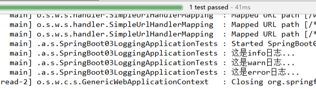

SpringBoot的级别默认是root级别，对应info级别，所以值输出了三个日志；

更改日志的默认输出级别


测试结果：日志就输出了所有级别的

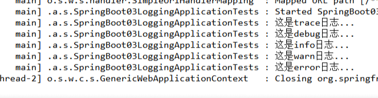


    日志输出格式：
    %d表示日期时间，
    %thread表示线程名，
    %-5level：级别从左显示5个字符宽度
    %logger{50} 表示logger名字最长50个字符，否则按照句点分割。 
    %msg：日志消息，
    %n是换行符
    -->
    %d{yyyy-MM-dd HH:mm:ss.SSS} [%thread] %-5level %logger{50} - %msg%n
SpringBoot修改日志的默认配置

```properties
logging.level.com.atguigu=trace

# 不指定路径在当前项目下生成springboot.log日志
#logging.file=springboot.log
# 可以指定完整的路径；
#logging.file=G:/springboot.log

# 在当前磁盘的根路径下创建spring文件夹和里面的log文件夹；使用 spring.log 作为默认文件
logging.path=/spring/log

#  在控制台输出的日志的格式
logging.pattern.console=%d{yyyy-MM-dd} [%thread] %-5level %logger{50} - %msg%n
# 指定文件中日志输出的格式
logging.pattern.file=%d{yyyy-MM-dd} === [%thread] === %-5level === %logger{50} ==== %msg%n
```

| logging.file | logging.path | Example  | Description             |
| ------------ | ------------ | -------- | ----------------------- |
| (none)       | (none)       |          | 只在控制台输出                 |
| 指定文件名        | (none)       | my.log   | 输出日志到my.log文件           |
| (none)       | 指定目录         | /var/log | 输出到指定目录的 spring.log 文件中 |

### (2)、指定配置

给类路径下放上每个日志框架自己的配置文件即可；SpringBoot就不使用他默认配置的了

| Logging System          | Customization                            |
| ----------------------- | ---------------------------------------- |
| Logback                 | `logback-spring.xml`, `logback-spring.groovy`, `logback.xml` or `logback.groovy` |
| Log4j2                  | `log4j2-spring.xml` or `log4j2.xml`      |
| JDK (Java Util Logging) | `logging.properties`                     |

logback.xml：直接就被日志框架识别了；

**logback-spring.xml**：日志框架就不直接加载日志的配置项，由SpringBoot解析日志配置，可以使用SpringBoot的高级Profile功能

```xml
<springProfile name="staging">
    <!-- configuration to be enabled when the "staging" profile is active -->
  	<!-- 可以指定某段配置只在某个环境下生效 -->
</springProfile>
```

如：

```xml
<appender name="stdout" class="ch.qos.logback.core.ConsoleAppender">
        <!--
        日志输出格式：
			%d表示日期时间，
			%thread表示线程名，
			%-5level：级别从左显示5个字符宽度
			%logger{50} 表示logger名字最长50个字符，否则按照句点分割。 
			%msg：日志消息，
			%n是换行符
        -->
        <layout class="ch.qos.logback.classic.PatternLayout">
            <springProfile name="dev">
                <pattern>%d{yyyy-MM-dd HH:mm:ss.SSS} ----> [%thread] ---> %-5level %logger{50} - %msg%n</pattern>
            </springProfile>
            <springProfile name="!dev">
                <pattern>%d{yyyy-MM-dd HH:mm:ss.SSS} ==== [%thread] ==== %-5level %logger{50} - %msg%n</pattern>
            </springProfile>
        </layout>
    </appender>
```


如果使用logback.xml作为日志配置文件，还要使用profile功能，会有以下错误

 `no applicable action for [springProfile]`

## 5、切换日志框架

可以按照slf4j的日志适配图，进行相关的切换；

slf4j+log4j的方式；

```xml
<dependency>
  <groupId>org.springframework.boot</groupId>
  <artifactId>spring-boot-starter-web</artifactId>
  <exclusions>
    <exclusion>
      <artifactId>logback-classic</artifactId>
      <groupId>ch.qos.logback</groupId>
    </exclusion>
    <exclusion>
      <artifactId>log4j-over-slf4j</artifactId>
      <groupId>org.slf4j</groupId>
    </exclusion>
  </exclusions>
</dependency>

<dependency>
  <groupId>org.slf4j</groupId>
  <artifactId>slf4j-log4j12</artifactId>
</dependency>

```


切换为log4j2

```xml
   <dependency>
            <groupId>org.springframework.boot</groupId>
            <artifactId>spring-boot-starter-web</artifactId>
            <exclusions>
                <exclusion>
                    <artifactId>spring-boot-starter-logging</artifactId>
                    <groupId>org.springframework.boot</groupId>
                </exclusion>
            </exclusions>
        </dependency>

<dependency>
  <groupId>org.springframework.boot</groupId>
  <artifactId>spring-boot-starter-log4j2</artifactId>
</dependency>
```

-----------------

# 四、Web开发

## 1、简介


使用SpringBoot；

**1、创建SpringBoot应用，选中我们需要的模块；**

**2、SpringBoot已经默认将这些场景配置好了，只需要在配置文件中指定少量配置就可以运行起来**

**3、自己编写业务代码；**


**自动配置原理？**

这个场景SpringBoot帮我们配置了什么？能不能修改？能修改哪些配置？能不能扩展？xxx

```
xxxxAutoConfiguration：帮我们给容器中自动配置组件；
xxxxProperties:配置类来封装配置文件的内容；
```


## 2、SpringBoot对静态资源的映射规则

```java
@ConfigurationProperties(prefix = "spring.resources", ignoreUnknownFields = false)
public class ResourceProperties implements ResourceLoaderAware {
  //可以设置和静态资源有关的参数，缓存时间等
```


WebMvcAutoConfiguration类下

```java
@Override
public void addResourceHandlers(ResourceHandlerRegistry registry) {
  if (!this.resourceProperties.isAddMappings()) {
    logger.debug("Default resource handling disabled");
    return;
  }
  Integer cachePeriod = this.resourceProperties.getCachePeriod();
  if (!registry.hasMappingForPattern("/webjars/**")) {
    customizeResourceHandlerRegistration(
      registry.addResourceHandler("/webjars/**")
      .addResourceLocations(
        "classpath:/META-INF/resources/webjars/")
      .setCachePeriod(cachePeriod));
  }
  String staticPathPattern = this.mvcProperties.getStaticPathPattern();
  //静态资源文件夹映射
  if (!registry.hasMappingForPattern(staticPathPattern)) {
    customizeResourceHandlerRegistration(
      registry.addResourceHandler(staticPathPattern)
      .addResourceLocations(
        this.resourceProperties.getStaticLocations())
      .setCachePeriod(cachePeriod));
  }
}

//配置欢迎页映射
@Bean
public WelcomePageHandlerMapping welcomePageHandlerMapping(
  ResourceProperties resourceProperties) {
  return new WelcomePageHandlerMapping(resourceProperties.getWelcomePage(),
                                       this.mvcProperties.getStaticPathPattern());
}

//配置喜欢的图标
@Configuration
@ConditionalOnProperty(value = "spring.mvc.favicon.enabled", matchIfMissing = true)
public static class FaviconConfiguration {

  private final ResourceProperties resourceProperties;

  public FaviconConfiguration(ResourceProperties resourceProperties) {
    this.resourceProperties = resourceProperties;
  }

  @Bean
  public SimpleUrlHandlerMapping faviconHandlerMapping() {
    SimpleUrlHandlerMapping mapping = new SimpleUrlHandlerMapping();
    mapping.setOrder(Ordered.HIGHEST_PRECEDENCE + 1);
    //所有  **/favicon.ico 
    mapping.setUrlMap(Collections.singletonMap("**/favicon.ico",
                                               faviconRequestHandler()));
    return mapping;
  }

  @Bean
  public ResourceHttpRequestHandler faviconRequestHandler() {
    ResourceHttpRequestHandler requestHandler = new ResourceHttpRequestHandler();
    requestHandler
      .setLocations(this.resourceProperties.getFaviconLocations());
    return requestHandler;
  }

}
```


### (1)、/webjars/** 

==所有 /webjars/** ，都去 classpath:/META-INF/resources/webjars/ 找资源；==

​	webjars：以jar包的方式引入静态资源；

http://www.webjars.org/

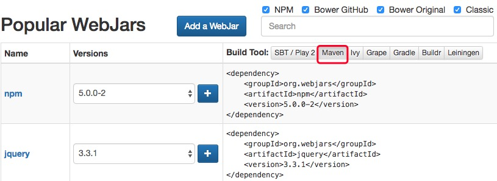

在pom.xml 中加入 jquery 的依赖配置

```xml
      <!-- 引入jquery‐webjar 在访问的时候只需要写webjars下面资源的名称即可 -->
      <dependency>
         <groupId>org.webjars</groupId>
         <artifactId>jquery</artifactId>
         <version>3.3.1</version>
      </dependency> 
```


运行程序，以下链接可以访问资源：localhost:8080/webjars/jquery/3.3.1/jquery.js


### (2)、/**

=="/**" 访问当前项目的任何资源，都去（静态资源的文件夹）找映射==


```
"classpath:/META-INF/resources/", 
"classpath:/resources/",
"classpath:/static/", 
"classpath:/public/" 
"/"：当前项目的根路径
```

localhost:8080/abc ===  去静态资源文件夹里面找abc

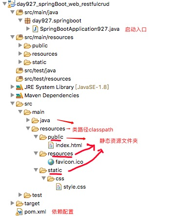


### (3)、欢迎页

==欢迎页； 静态资源文件夹下的所有index.html页面；被"/**"映射；==

​	localhost:8080/   找index页面

将 index.html 放在 public 等 静态资源文件夹

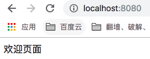

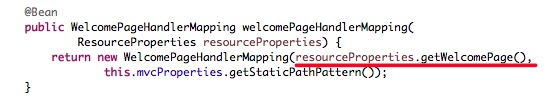

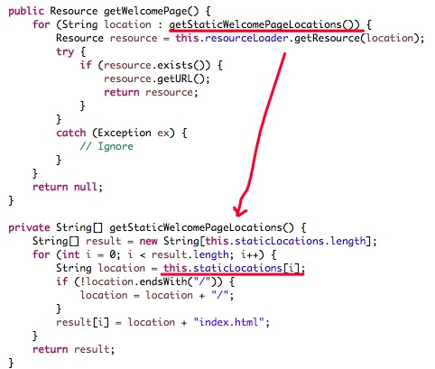

看到index.html 的路径拼接 又是 静态资源文件夹下

### (4)、 **/favicon.ico

==4、所有的 **/favicon.ico  都是在静态资源文件下找；==

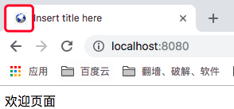

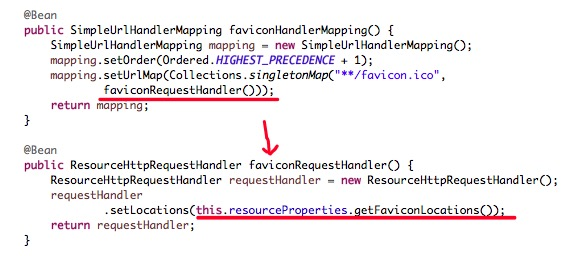


### (5)、自定义静态资源文件夹路径

默认我们用的是 spring.resources 下的 staticLocations

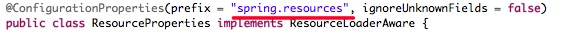

我们可以在配置文件中配置自定义的静态文件夹

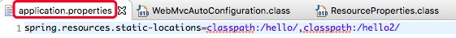

之前的静态文件夹下的资源就不能访问了

在自定义的静态文件夹下加入资源

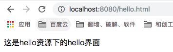


## 3、模板引擎

JSP、Velocity、Freemarker、Thymeleaf


SpringBoot推荐的Thymeleaf；

语法更简单，功能更强大；


### (1)、引入thymeleaf；

```xml
		<dependency>
			<groupId>org.springframework.boot</groupId>
			<artifactId>spring-boot-starter-thymeleaf</artifactId>
          	2.1.6
		</dependency>

切换thymeleaf版本
<properties>
		<thymeleaf.version>3.0.9.RELEASE</thymeleaf.version>
		<!-- 布局功能的支持程序  thymeleaf3主程序  layout2以上版本 -->
		<!-- thymeleaf2   layout1-->
		<thymeleaf-layout-dialect.version>2.2.2</thymeleaf-layout-dialect.version>
  </properties>
```

thymeleaf-layout-dialect2.0 才开始支持 thymeleaf3.0 

可以在 github 上搜索 thymeleaf-layout-dialect查看 release 版本2.0.0

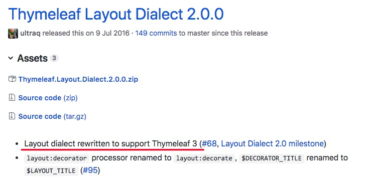

### (2)、Thymeleaf使用

spring-boot-autoconfigure-1.5.9.RELEASE.jar--> 

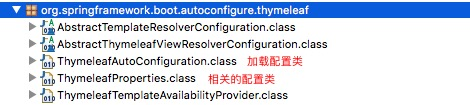

默认规则都在 ThymeleafProperties 里面

```java
@ConfigurationProperties(prefix = "spring.thymeleaf")
public class ThymeleafProperties {

	private static final Charset DEFAULT_ENCODING = Charset.forName("UTF-8");

	private static final MimeType DEFAULT_CONTENT_TYPE = MimeType.valueOf("text/html");

	public static final String DEFAULT_PREFIX = "classpath:/templates/";

	public static final String DEFAULT_SUFFIX = ".html";
  	//
```

只要我们把HTML页面放在classpath:/templates/，thymeleaf就能自动渲染；

[thymeleaf官网文档](https://www.thymeleaf.org/documentation.html)

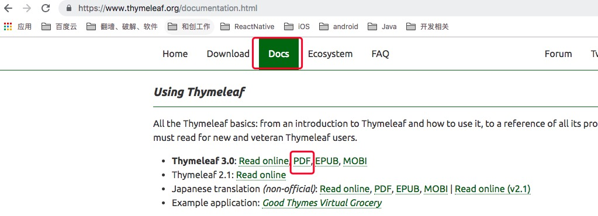

### (3)、入门案例


1、pom.xml依赖配置

```xml
<project xmlns="http://maven.apache.org/POM/4.0.0"
   xmlns:xsi="http://www.w3.org/2001/XMLSchema-instance"
   xsi:schemaLocation="http://maven.apache.org/POM/4.0.0 http://maven.apache.org/xsd/maven-4.0.0.
   xsd">
   <modelVersion>4.0.0</modelVersion>
   <groupId>com.day927</groupId>
   <artifactId>day927_springBoot_staticResources</artifactId>
   <version>0.0.1-SNAPSHOT</version>

   <parent>
      <groupId>org.springframework.boot</groupId>
      <artifactId>spring-boot-starter-parent</artifactId>
      <version>1.5.9.RELEASE</version>
   </parent>

   <properties>
      <project.build.sourceEncoding>UTF-8</project.build.sourceEncoding>
      <project.reporting.outputEncoding>UTF-8</project.reporting.outputEncoding>
      <java.version>1.8</java.version>
      <!-- 切换thymeleaf版本 -->
      <thymeleaf.version>3.0.9.RELEASE</thymeleaf.version>
      <!-- 布局功能的支持程序 thymeleaf3主程序 layout2以上版本 -->
      <!-- thymeleaf2 layout1 -->
      <thymeleaf-layout-dialect.version>2.2.2</thymeleaf-layout-dialect.version>
   </properties>

   <dependencies>
      <dependency>
         <groupId>org.springframework.boot</groupId>
         <artifactId>spring-boot-starter-web</artifactId>
      </dependency>
      <dependency>
         <groupId>org.springframework.boot</groupId>
         <artifactId>spring-boot-starter-thymeleaf</artifactId>
      </dependency>
   </dependencies>

   <build>
      <plugins>
         <!-- 这个插件，可以将应用打包成一个可执行的jar包； -->
         <plugin>
            <groupId>org.springframework.boot</groupId>
            <artifactId>spring-boot-maven-plugin</artifactId>
         </plugin>
         <plugin>
            <groupId>org.apache.maven.plugins</groupId>
            <artifactId>maven-jar-plugin</artifactId>
            <version>3.0.2</version>
         </plugin>
      </plugins>
   </build>

</project> 
```

2、controller.java

```java
package day927.springboot.controller;

import java.util.Map;

import org.springframework.stereotype.Controller;
import org.springframework.web.bind.annotation.RequestMapping;

@Controller
public class HelloController {

    @RequestMapping("/success")
    public String success(Map<String, Object> map) {
        // classpath:/templates/success.html
        map.put("hello", "你好");
        return "success";
    }
}
```

3、模板html

```html
<!DOCTYPE html>
<!-- 导入 thymeleaf 的名称空间 -->
<html xmlns:th="http://www.thymeleaf.org">
<html>
<head>
<meta charset="UTF-8">
<title>Insert title here</title>
</head>
<body>
   成功!
   <!--th:text 将div里面的文本内容设置为 -->
   <div th:text="${hello}">这里是显示欢迎信息</div>
</body>
</html> 
```

4、测试

直接访问 success.html

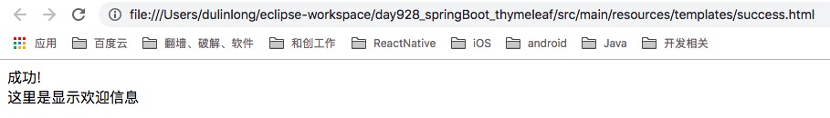

运行 SpringBootApplication928.java测试

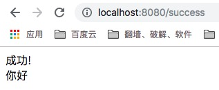

两种显示的不一样，前后端分工合作起来就更清晰了

### (4)、语法规则

参考上面的pdf：

1、th:text；改变当前元素里面的文本内容；

​	th：任意html属性；来替换原生属性的值


2、表达式？

```properties
Simple expressions:（表达式语法）
    Variable Expressions: ${...}：获取变量值；OGNL；
    		1）、获取对象的属性、调用方法
    		2）、使用内置的基本对象：
    			#ctx : the context object.
    			#vars: the context variables.
                #locale : the context locale.
                #request : (only in Web Contexts) the HttpServletRequest object.
                #response : (only in Web Contexts) the HttpServletResponse object.
                #session : (only in Web Contexts) the HttpSession object.
                #servletContext : (only in Web Contexts) the ServletContext object.
                
                ${session.foo}
            3）、内置的一些工具对象：
#execInfo : information about the template being processed.
#messages : methods for obtaining externalized messages inside variables expressions, in the same way as they would be obtained using #{…} syntax.
#uris : methods for escaping parts of URLs/URIs
#conversions : methods for executing the configured conversion service (if any).
#dates : methods for java.util.Date objects: formatting, component extraction, etc.
#calendars : analogous to #dates , but for java.util.Calendar objects.
#numbers : methods for formatting numeric objects.
#strings : methods for String objects: contains, startsWith, prepending/appending, etc.
#objects : methods for objects in general.
#bools : methods for boolean evaluation.
#arrays : methods for arrays.
#lists : methods for lists.
#sets : methods for sets.
#maps : methods for maps.
#aggregates : methods for creating aggregates on arrays or collections.
#ids : methods for dealing with id attributes that might be repeated (for example, as a result of an iteration).

    Selection Variable Expressions: *{...}：选择表达式：和${}在功能上是一样；
    	补充：配合 th:object="${session.user}：
   <div th:object="${session.user}">
    <p>Name: <span th:text="*{firstName}">Sebastian</span>.</p>
    <p>Surname: <span th:text="*{lastName}">Pepper</span>.</p>
    <p>Nationality: <span th:text="*{nationality}">Saturn</span>.</p>
    </div>
    
    Message Expressions: #{...}：获取国际化内容
    Link URL Expressions: @{...}：定义URL；
    		@{/order/process(execId=${execId},execType='FAST')}
    Fragment Expressions: ~{...}：片段引用表达式
    		<div th:insert="~{commons :: main}">...</div>
    		
Literals（字面量）
      Text literals: 'one text' , 'Another one!' ,…
      Number literals: 0 , 34 , 3.0 , 12.3 ,…
      Boolean literals: true , false
      Null literal: null
      Literal tokens: one , sometext , main ,…
Text operations:（文本操作）
    String concatenation: +
    Literal substitutions: |The name is ${name}|
Arithmetic operations:（数学运算）
    Binary operators: + , - , * , / , %
    Minus sign (unary operator): -
Boolean operations:（布尔运算）
    Binary operators: and , or
    Boolean negation (unary operator): ! , not
Comparisons and equality:（比较运算）
    Comparators: > , < , >= , <= ( gt , lt , ge , le )
    Equality operators: == , != ( eq , ne )
Conditional operators:条件运算（三元运算符）
    If-then: (if) ? (then)
    If-then-else: (if) ? (then) : (else)
    Default: (value) ?: (defaultvalue)
Special tokens:
    No-Operation: _ 
```

3、测试

```java
@RequestMapping("/success2")
public String success2(Map<String, Object> map) {
    map.put("hello", "<h1>你好</h1>");
    map.put("users", Arrays.asList("zhangsan", "lisi", "wangwu"));
    return "success2";
} 
```

4、success2.html

```html
<!DOCTYPE html>
<html lang="en" xmlns:th="http://www.thymeleaf.org">
<head>
    <meta charset="UTF-8">
    <title>Title</title>
</head>
<body>
<h1>成功！</h1>
<!--th:text 将div里面的文本内容设置为 -->
<div id="div01" class="myDiv" th:id="${hello}" th:class="${hello}" th:text="${hello}">
这是显示欢迎信息</div>
<hr/>
<div th:text="${hello}"></div><!-- 转义特殊字符 -->
<div th:utext="${hello}"></div><!-- 不转义特殊字符 -->
<hr/>

<!-- th:each每次遍历都会生成当前这个标签： 3个h4 -->
<h4 th:text="${user}"  th:each="user:${users}"></h4>
<hr/>
<h4>
    <span th:each="user:${users}"> [[${user}]] </span>
</h4>
<form th:action="@{/upload}" method="post" enctype="multipart/form-data">
    <input type="file" name="file">
    <input type="submit"/>
</form>

</body>
</html> 
```

5、运行程序

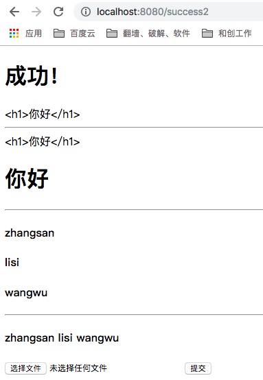


## 4、SpringMVC自动配置

https://docs.spring.io/spring-boot/docs/1.5.10.RELEASE/reference/htmlsingle/#boot-features-developing-web-applications

原文

The auto-configuration adds the following features on top of Spring’s defaults:

- Inclusion of `ContentNegotiatingViewResolver` and `BeanNameViewResolver` beans.
- Support for serving static resources, including support for WebJars (see below).
- Automatic registration of `Converter`, `GenericConverter`, `Formatter` beans.
- Support for `HttpMessageConverters` (see below).
- Automatic registration of `MessageCodesResolver` (see below).
- Static `index.html` support.
- Custom `Favicon` support (see below).
- Automatic use of a `ConfigurableWebBindingInitializer` bean (see below).

If you want to keep Spring Boot MVC features, and you just want to add additional [MVC configuration](https://docs.spring.io/spring/docs/4.3.14.RELEASE/spring-framework-reference/htmlsingle#mvc) (interceptors, formatters, view controllers etc.) you can add your own `@Configuration` class of type `WebMvcConfigurerAdapter`, but **without** `@EnableWebMvc`. If you wish to provide custom instances of `RequestMappingHandlerMapping`, `RequestMappingHandlerAdapter` or `ExceptionHandlerExceptionResolver` you can declare a `WebMvcRegistrationsAdapter` instance providing such components.


### (1)、 Spring MVC auto-configuration

Spring Boot 自动配置好了SpringMVC

以下是SpringBoot对SpringMVC的默认配置:**==（WebMvcAutoConfiguration）==**

1、Inclusion of `ContentNegotiatingViewResolver` and `BeanNameViewResolver` beans.

自动配置了ViewResolver（视图解析器：根据方法的返回值得到视图对象（View），视图对象决定如何渲染（转发？重定向？））

org.springframework.boot.autoconfigure.web.WebMvcAutoConfiguration.class


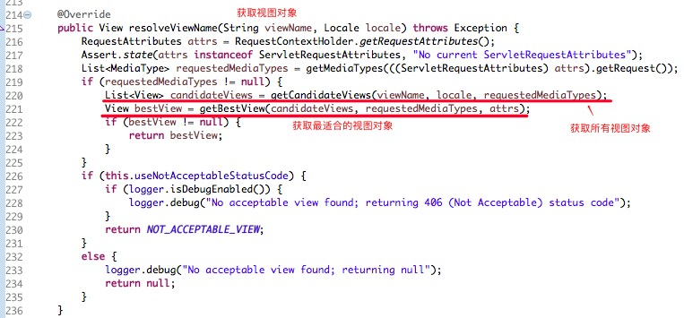

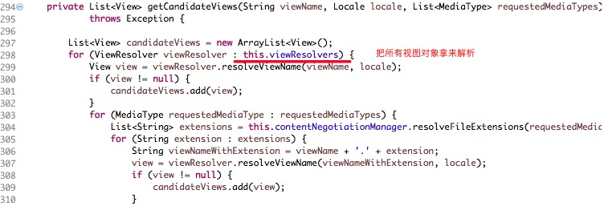


ContentNegotiatingViewResolver：组合所有的视图解析器的；


这个所有的视图解析器是指哪些？


==如何定制：我们可以自己给容器中添加一个视图解析器；自动的将其组合进来；==

```java
	package day928.springboot;
	
	import java.util.Locale;
	
	import org.springframework.boot.SpringApplication;
	import org.springframework.boot.autoconfigure.SpringBootApplication;
	import org.springframework.context.annotation.Bean;
	import org.springframework.web.servlet.View;
	import org.springframework.web.servlet.ViewResolver;
	
	@SpringBootApplication
	public class SpringBootApplication928 {
	
	    public static void main(String[] args) {
	        // Spring应用启动起来
	        SpringApplication.run(SpringBootApplication928.class, args);
	    }
	
	    //模拟自己增加一个视图解析器
	    @Bean
	    public ViewResolver myViewReolver() {
	        return new MyViewResolver();
	    }
	
	    public static class MyViewResolver implements ViewResolver {
	
	        @Override
	        public View resolveViewName(String viewName, Locale locale) throws Exception {
	            return null;
	        }
	    }
	}
	
```

在org.springframework.web.servlet.DispatchServlet.class


doDispatch 方法打个断点


Debug下测试访问访问任意一个请求http://localhost:8080/success


2、Support for serving static resources, including support for WebJars (see below).静态资源文件夹路径,webjars

3、Static `index.html` support. 静态首页访问

4、Custom `Favicon` support (see below).  favicon.ico


5、自动注册了 of `Converter`, `GenericConverter`, `Formatter` beans.

- Converter：转换器；  public String hello(User user)：类型转换使用Converter
- `Formatter`  格式化器；  2017.12.17===Date；

WebMvcAutoConfig.java中

```java
		@Bean
		@ConditionalOnProperty(prefix = "spring.mvc", name = "date-format")//在文件中配置日期格式化的规则
		public Formatter<Date> dateFormatter() {
			return new DateFormatter(this.mvcProperties.getDateFormat());//日期格式化组件
		}
```

​	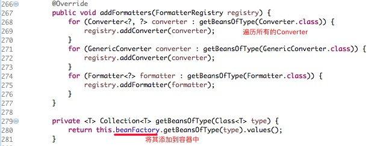

==自己添加的格式化器转换器，我们只需要放在容器中即可==

6、Support for `HttpMessageConverters` (see below).

- HttpMessageConverter：SpringMVC用来转换Http请求和响应的；User对象--->Json；

- `HttpMessageConverters` 是从容器中确定；获取所有的HttpMessageConverter；

  ==自己给容器中添加HttpMessageConverter，只需要将自己的组件注册容器中（@Bean,@Component）==

  

7、Automatic registration of `MessageCodesResolver` (see below).

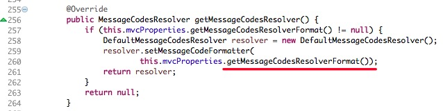


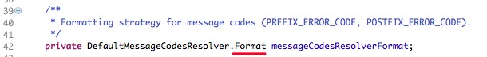


定义错误代码生成规则

8、Automatic use of a `ConfigurableWebBindingInitializer` bean (see below).

==我们可以配置一个ConfigurableWebBindingInitializer来替换默认的；（添加到容器）==

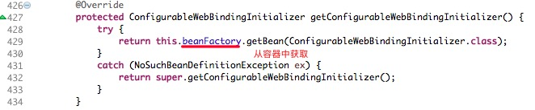

ConfigurableWebBindingInitializer


初始化WebDataBinder 数据绑定器：请求数据绑定到JavaBean；


**org.springframework.boot.autoconfigure.web：web的所有自动场景；**

If you want to keep Spring Boot MVC features, and you just want to add additional [MVC configuration](https://docs.spring.io/spring/docs/4.3.14.RELEASE/spring-framework-reference/htmlsingle#mvc) (interceptors, formatters, view controllers etc.) you can add your own `@Configuration` class of type `WebMvcConfigurerAdapter`, but **without** `@EnableWebMvc`. If you wish to provide custom instances of `RequestMappingHandlerMapping`, `RequestMappingHandlerAdapter` or `ExceptionHandlerExceptionResolver` you can declare a `WebMvcRegistrationsAdapter` instance providing such components.

If you want to take complete control of Spring MVC, you can add your own `@Configuration` annotated with `@EnableWebMvc`.

### (2)、扩展SpringMVC

```xml
    <mvc:view-controller path="/hello" view-name="success"/>
    <mvc:interceptors>
        <mvc:interceptor>
            <mvc:mapping path="/hello"/>
            <bean></bean>
        </mvc:interceptor>
    </mvc:interceptors>
```

**==编写一个配置类（@Configuration），是WebMvcConfigurerAdapter类型；不能标注@EnableWebMvc==**

既保留了所有的自动配置，也能用我们扩展的配置；

```java
//使用WebMvcConfigurerAdapter可以来扩展SpringMVC的功能
@Configuration
public class MyMvcConfig extends WebMvcConfigurerAdapter {

    @Override
    public void addViewControllers(ViewControllerRegistry registry) {
       // super.addViewControllers(registry);
        //浏览器发送 /dulinlong 请求来到 success
        registry.addViewController("/dulinlong").setViewName("success");
    }
}
```


原理：

​	1）、WebMvcAutoConfiguration是SpringMVC的自动配置类

​	2）、在做其他自动配置时会导入；@Import(**EnableWebMvcConfiguration**.class)

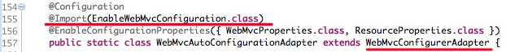

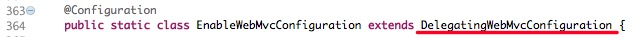

DelegatingWebMvcConfiguration类


WebMvcConfigurerComposite类中一个参考实现


将所有的 WebMvcConfigurer 都调用一遍 addViewController

​	3）、容器中所有的WebMvcConfigurer都会一起起作用；

​	4）、我们的配置类也会被调用；


​	效果：SpringMVC的自动配置和我们的扩展配置都会起作用；

### (3)、全面接管SpringMVC

SpringBoot对SpringMVC的自动配置不需要了，所有都是我们自己配置；所有的SpringMVC的自动配置都失效了

**我们需要在配置类中添加@EnableWebMvc即可；**

```java
//使用WebMvcConfigurerAdapter可以来扩展SpringMVC的功能
@EnableWebMvc //添加这个注解
@Configuration
public class MyMvcConfig extends WebMvcConfigurerAdapter {

    @Override
    public void addViewControllers(ViewControllerRegistry registry) {
       // super.addViewControllers(registry);
        //浏览器发送 /dulinlong 请求来到 success
        registry.addViewController("/dulinlong").setViewName("success");
    }
}
```

原理分析：

为什么@EnableWebMvc自动配置就失效了；

1、@EnableWebMvc的核心

```java
@Import(DelegatingWebMvcConfiguration.class)
public @interface EnableWebMvc {
```

2、

```java
@Configuration
public class DelegatingWebMvcConfiguration extends WebMvcConfigurationSupport {
```

DelegationWebMvcConfiguration 这个类为什么就把自动配置弄失效了？

3、

```java
@Configuration
@ConditionalOnWebApplication
@ConditionalOnClass({ Servlet.class, DispatcherServlet.class,
		WebMvcConfigurerAdapter.class })
//容器中没有这个组件的时候，这个自动配置类才生效
@ConditionalOnMissingBean(WebMvcConfigurationSupport.class)
@AutoConfigureOrder(Ordered.HIGHEST_PRECEDENCE + 10)
@AutoConfigureAfter({ DispatcherServletAutoConfiguration.class,
		ValidationAutoConfiguration.class })
public class WebMvcAutoConfiguration {
```

可以看出 DelegationWebMvcConfiguration 就是继承的  WebMvcConfigurationSupport 这个类，所以当我们加上注解 @EnableWebMvc时，就有了这个类，所以自动配置就不生效了

4、@EnableWebMvc将 WebMvcConfigurationSupport 组件导入进来；

5、导入的 WebMvcConfigurationSupport 只是 SpringMVC 最基本的功能；


## 5、如何修改SpringBoot的默认配置

模式：

1、SpringBoot在自动配置很多组件的时候，先看容器中有没有用户自己配置的（@Bean、@Component）如果有就用用户配置的，如果没有，才自动配置；如果有些组件可以有多个（ViewResolver）将用户配置的和自己默认的组合起来；

2、在SpringBoot中会有非常多的xxxConfigurer帮助我们进行扩展配置

3、在SpringBoot中会有很多的xxxCustomizer帮助我们进行定制配置

## 6、RestfulCRUD

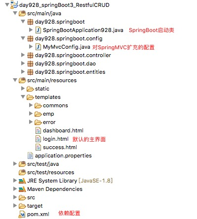

### (1)、默认访问登录首页

1、扩展配置，将"/"、"index.html" 访问指向模板的"login"界面

```java

//使用WebMvcConfigurerAdapter可以来扩展SpringMVC的功能
//@EnableWebMvc   不要接管SpringMVC
@Configuration
public class MyMvcConfig extends WebMvcConfigurerAdapter {

    @Override
    public void addViewControllers(ViewControllerRegistry registry) {
       // super.addViewControllers(registry);
        //浏览器发送 /atguigu 请求来到 success
        registry.addViewController("/atguigu").setViewName("success");
    }

    //所有的WebMvcConfigurerAdapter组件都会一起起作用
    @Bean //将组件注册在容器
    public WebMvcConfigurerAdapter webMvcConfigurerAdapter(){
        WebMvcConfigurerAdapter adapter = new WebMvcConfigurerAdapter() {
            @Override
            public void addViewControllers(ViewControllerRegistry registry) {
                registry.addViewController("/").setViewName("login");
                registry.addViewController("/index.html").setViewName("login");
            }
        };
        return adapter;
    }
}

```

2、登录界面

```html
<!DOCTYPE html>
<html lang="en">
   <head>
      <meta http-equiv="Content-Type" content="text/html; charset=UTF-8">
      <meta name="viewport" content="width=device-width, initial-scale=1, shrink-to-fit=no">
      <meta name="description" content="">
      <meta name="author" content="">
      <title>Signin Template for Bootstrap</title>
      <!-- Bootstrap core CSS -->
      <link href="asserts/css/bootstrap.min.css" th:href="@{/webjars/bootstrap/4.1.3/css/bootstrap.
      css}" rel="stylesheet">
      <!-- Custom styles for this template -->
      <link href="asserts/css/signin.css" th:href="@{/asserts/css/signin.css}" rel="stylesheet">
   </head>
   <body class="text-center">
      <form class="form-signin" action="dashboard.html" th:action="@{/user/login}" method="post">
         
         <h1 class="h3 mb-3 font-weight-normal">Please sign in</h1>
         <label class="sr-only" >Username</label>
         <input type="text"  name="username" class="form-control" placeholder="Username"  
         required="" autofocus="">
         <label class="sr-only" >Password</label>
         <input type="password" name="password" class="form-control" placeholder="Password"  
         required="">
         <div class="checkbox mb-3">
            <label>
                  <input type="checkbox" value="remember-me"/>Remember me
            </label>
         </div>
         <button class="btn btn-lg btn-primary btn-block" type="submit">Sign in</button>
         <p class="mt-5 mb-3 text-muted">© 2017-2018</p>
         <a class="btn btn-sm" >中文</a>
         <a class="btn btn-sm" >English</a>
      </form>
   </body>

</html> 
```

注意静态资源的引用 /asserts/.....

3、在配置文件中设置一个访问路径（可以不设置）

```properties
server.context-path=/crud 
```

4、测试访问

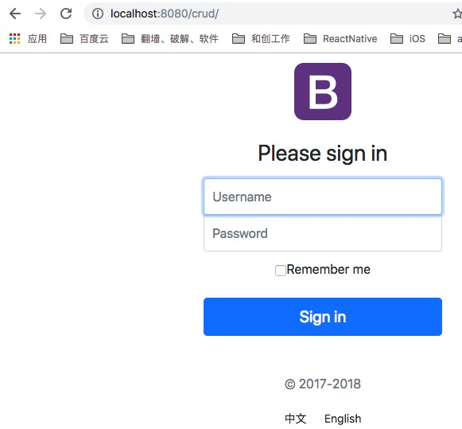

### (2)、国际化

**1、编写国际化配置文件；**

2、使用ResourceBundleMessageSource管理国际化资源文件

3、在页面使用fmt:message取出国际化内容


步骤：

1、编写国际化配置文件，抽取页面需要显示的国际化消息


2、SpringBoot自动配置好了管理国际化资源文件的组件；


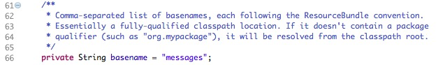


3、去页面获取国际化的值；

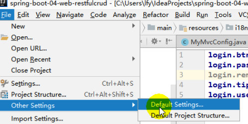


```html
<!DOCTYPE html>
<html lang="en"  xmlns:th="http://www.thymeleaf.org">
	<head>
		<meta http-equiv="Content-Type" content="text/html; charset=UTF-8">
		<meta name="viewport" content="width=device-width, initial-scale=1, shrink-to-fit=no">
		<meta name="description" content="">
		<meta name="author" content="">
		<title>Signin Template for Bootstrap</title>
		<!-- Bootstrap core CSS -->
		<link href="asserts/css/bootstrap.min.css" th:href="@{/webjars/bootstrap/4.0.0/css/bootstrap.css}" rel="stylesheet">
		<!-- Custom styles for this template -->
		<link href="asserts/css/signin.css" th:href="@{/asserts/css/signin.css}" rel="stylesheet">
	</head>

	<body class="text-center">
		<form class="form-signin" action="dashboard.html">
			
			<h1 class="h3 mb-3 font-weight-normal" th:text="#{login.tip}">Please sign in</h1>
			<label class="sr-only" th:text="#{login.username}">Username</label>
			<input type="text" class="form-control" placeholder="Username" th:placeholder="#{login.username}" required="" autofocus="">
			<label class="sr-only" th:text="#{login.password}">Password</label>
			<input type="password" class="form-control" placeholder="Password" th:placeholder="#{login.password}" required="">
			<div class="checkbox mb-3">
				<label>
          		<input type="checkbox" value="remember-me"/> [[#{login.remember}]]
        </label>
			</div>
			<button class="btn btn-lg btn-primary btn-block" type="submit" th:text="#{login.btn}">Sign in</button>
			<p class="mt-5 mb-3 text-muted">© 2017-2018</p>
			<a class="btn btn-sm">中文</a>
			<a class="btn btn-sm">English</a>
		</form>

	</body>

</html>
```

效果：根据浏览器语言设置的信息切换了国际化；

4、配置国际化配置

```properties
spring.messages.basename=i18n/login
#设定Message bundles的编码，默认: UTF-8
spring.messages.encoding=UTF-8 
```

5、访问测试  ---  根据浏览器语言设置的信息切换了国际化

设置chrome英语在前


访问界面


请求头中可看到en


原理：

​	国际化Locale（区域信息对象）；LocaleResolver（获取区域信息对象）；

WebMvcAutoConfiguration类中


AcceptHeaderLocaleResolver类中

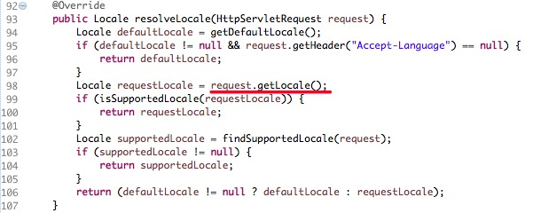

可以看出默认是从请求头中获取国际化信息


6、点击链接切换国际化

login.html中

```html
 <a class="btn btn-sm" th:href="@{/index.html(l='zh_CN')}">中文</a>
<a class="btn btn-sm" th:href="@{/index.html(l='en_US')}">English</a> 
```

新建处理国际化访问请求的组件

```java
/**
 * 可以在连接上携带区域信息
 */
public class MyLocaleResolver implements LocaleResolver {
    
    @Override
    public Locale resolveLocale(HttpServletRequest request) {
        String l = request.getParameter("l");
        Locale locale = Locale.getDefault();
        if(!StringUtils.isEmpty(l)){
            String[] split = l.split("_");
            locale = new Locale(split[0],split[1]);
        }
        return locale;
    }

    @Override
    public void setLocale(HttpServletRequest request, HttpServletResponse response, Locale locale) {

    }
}
```

将上面的组件注册到配置容器中

config/MyMvcConfig.java

```java
//注册国际化的 添加到 配置容器中
@Bean
public LocaleResolver localeResolver() {
    return new MyLocaleResolver();
} 
```

运行测试

访问http://localhost:8080/crud后点击切换按钮，可切换中英文


### (3)、登陆流程

1、login.html

```html
  <form class="form-signin" action="dashboard.html" th:action="@{/user/login}" 
   method="post"> 
    
    
			<label class="sr-only" th:text="#{login.username}">Username</label>
			<input type="text" name="username" class="form-control" placeholder="Username" th:placeholder="#{login.username}" required="" autofocus="">
			<label class="sr-only" th:text="#{login.password}">Password</label>
			<input type="password" name="password" class="form-control" placeholder="Password" th:placeholder="#{login.password}" required="">
```

```html
<!--判断 如果有提示错误信息，显示出来-->
<p style="color: red" th:text="${msg}" th:if="${not #strings.isEmpty(msg)}"></p> 
```


开发期间模板引擎页面修改以后，要实时生效

​	1、禁用模板引擎的缓存

```
# 禁用缓存
spring.thymeleaf.cache=false 
```

​	2、页面修改完成以后ctrl+f9：重新编译；

2、controller

```java
@Controller
public class LoginController {

    // @DeleteMapping
    // @PutMapping
    // @GetMapping
    @PostMapping(value = "/user/login")  // SpringBoot对下面的写法做了封装
    // @RequestMapping(value="/user/login",method=RequestMethod.POST) //SpringMVC的写法
    public String login(@RequestParam("username") String username, @RequestParam("password") String password,Map<String, Object> map) {

        // 简单的判断
        if (!StringUtils.isEmpty(username) && "123456".equals(password)) {
            // 登陆成功，防止表单重复提交，可以重定向到主页
            return "redirect:/main.html";
//        return "dashboard";
        } else {// 登录失败
            map.put("msg", "用户名或密码错误");
            return "login";
        }
    }
}

```

3、配置映射

config/MyMvcConfig.java

```java
// 所有的WebMvcConfigurerAdapter组件都会一起起作用
@Bean // 将组件注册在容器
public WebMvcConfigurerAdapter webMvcConfigurerAdapter() {
    WebMvcConfigurerAdapter adapter = new WebMvcConfigurerAdapter() {

        @Override
        public void addViewControllers(ViewControllerRegistry registry) {
            registry.addViewController("/").setViewName("login");
            registry.addViewController("/index.html").setViewName("login");
          registry.addViewController("/main.html").setViewName("dashboard.html");
        }
    };
    return adapter;
} 
```

4、测试

模拟错误登录


成功登录

用户名：admin  密码：123456

重定向跳转到


### (4)、拦截器进行登陆检查

拦截器

```java

/**
 * 登陆检查，
 */
public class LoginHandlerInterceptor implements HandlerInterceptor {
    //目标方法执行之前
    @Override
    public boolean preHandle(HttpServletRequest request, HttpServletResponse response, Object handler) throws Exception {
        Object user = request.getSession().getAttribute("loginUser");
        if(user == null){
            //未登陆，返回登陆页面
            request.setAttribute("msg","没有权限请先登陆");
            request.getRequestDispatcher("/index.html").forward(request,response);
            return false;
        }else{
            //已登陆，放行请求
            return true;
        }

    }

    @Override
    public void postHandle(HttpServletRequest request, HttpServletResponse response, Object handler, ModelAndView modelAndView) throws Exception {

    }

    @Override
    public void afterCompletion(HttpServletRequest request, HttpServletResponse response, Object handler, Exception ex) throws Exception {

    }
}

```


注册拦截器 config/MyMvcConfig.java

```java
  //所有的WebMvcConfigurerAdapter组件都会一起起作用
    @Bean //将组件注册在容器
    public WebMvcConfigurerAdapter webMvcConfigurerAdapter(){
        WebMvcConfigurerAdapter adapter = new WebMvcConfigurerAdapter() {
            @Override
            public void addViewControllers(ViewControllerRegistry registry) {
                registry.addViewController("/").setViewName("login");
                registry.addViewController("/index.html").setViewName("login");
                registry.addViewController("/main.html").setViewName("dashboard");
            }

            //注册拦截器
            @Override
            public void addInterceptors(InterceptorRegistry registry) {
                //super.addInterceptors(registry);
                //静态资源；  *.css , *.js
                //SpringBoot已经做好了静态资源映射
                registry.addInterceptor(new LoginHandlerInterceptor()).addPathPatterns("/**")
                        .excludePathPatterns("/index.html","/","/user/login");
            }
        };
        return adapter;
    }
```

测试

这个时候我们不登录直接访问http://localhost:8080/crud/main.html将跳转到登录界面


### (5)、CRUD-员工列表

实验要求：


1、RestfulCRUD：CRUD满足Rest风格；

URI：  /资源名称/资源标识       HTTP请求方式区分对资源CRUD操作

|      | 普通CRUD（uri来区分操作） | RestfulCRUD       |
| ---- | ------------------------- | ----------------- |
| 查询 | getEmp                    | emp---GET         |
| 添加 | addEmp?xxx                | emp---POST        |
| 修改 | updateEmp?id=xxx&xxx=xx   | emp/{id}---PUT    |
| 删除 | deleteEmp?id=1            | emp/{id}---DELETE |

2、实验的请求架构;

| 实验功能                             | 请求URI | 请求方式 |
| ------------------------------------ | ------- | -------- |
| 查询所有员工                         | emps    | GET      |
| 查询某个员工(来到修改页面)           | emp/1   | GET      |
| 来到添加页面                         | emp     | GET      |
| 添加员工                             | emp     | POST     |
| 来到修改页面（查出员工进行信息回显） | emp/1   | GET      |
| 修改员工                             | emp     | PUT      |
| 删除员工                             | emp/1   | DELETE   |

3、员工列表：

usingthymeleaf.pdf


1)、抽取公共片段

```xml
<div th:fragment="copy">
 &copy; 2011 The Good Thymes Virtual Grocery
</div> 
```

2)、引入公共片段

```xml
<div th:insert="~{footer :: copy}"></div> 
```

~{templatename::selector}   --  模板名::选择器     （jquery中的选择器）

~{templatename::fragmentname}   --  模板名::片段名 

3)、三种引入公共片段的th属性:

th:insert：将公共片段整个插入到声明引入的元素中

th:replace：将声明引入的元素替换为公共片段

th:include：将被引入的片段的内容包含进这个标签中

```xml
<footer th:fragment="copy">
	&copy; 2011 The Good Thymes Virtual Grocery
</footer> 
```

三种引入

```xml
<div th:insert="footer :: copy"></div> 
<div th:replace="footer :: copy"></div> 
<div th:include="footer :: copy"></div> 
```

三种引入结果

```xml
<div>
        <footer>
                &copy; 2011 The Good Thymes Virtual Grocery 
        </footer>
</div>

<footer>
        &copy; 2011 The Good Thymes Virtual Grocery
</footer>

<div>
        &copy; 2011 The Good Thymes Virtual Grocery
</div> 
```

3)、实际抽取代码

声明


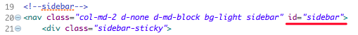


使用 

templates/dashboard.html


引入sidebar的时候传入参

参考usingthymeleaf.pdf--->8.2 Parameterizable fragment signatures 

可以定义fragment时候定义传入参数

```xml
<div th:fragment="frag (onevar,twovar)">
<p th:text="${onevar} + ' - ' + ${twovar}">...</p>
</div> 
```

使用

```xml
<div th:replace="::frag (${value1},${value2})">...</div>
<div th:replace="::frag (onevar=${value1},twovar=${value2})">...</div> 
```

也可以不定义

```xml
<div th:fragment="frag"> ...
</div> 
```

直接使用

```xml
 <div th:replace="::frag (onevar=${value1},twovar=${value2})"> 
```

4、跳转到列表界面

templates/commons/bar.html


5、controller层

```java
@Controller
public class EmployeeController {

    @Autowired
    EmployeeDao employeeDao;

    //查询所有员工返回列表页面
    @GetMapping("/emps")
    public String list(Model model) {
        Collection<Employee> employees = employeeDao.getAll();

        //放在请求域中
        model.addAttribute("emps",employees);
        // thymeleaf默认就会拼串
        // classpath:/templates/xxxx.html
        return "emp/list";
    } 
```

原理：  return "emp/list"会被 thymeleaf 自动拼接访问路径

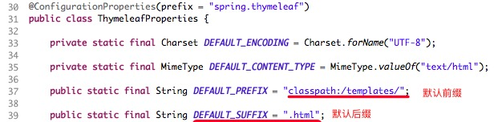


### (6)、CRUD-员工添加

进入添加界面按钮

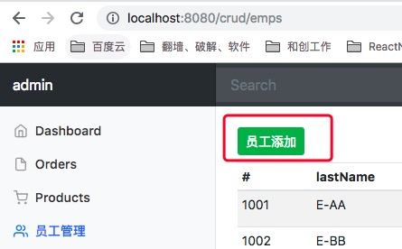

添加页面


添加成功返回列表界面


添加界面可以参考

http://getbootstrap.com/docs/4.1/components/forms/

1、跳转添加界面按钮

templates/emp/list.html


2、controller - 跳转到添加界面

```java
@Autowired
DepartmentDao departmentDao;

//来到员工添加页面
@GetMapping("/emp")
public String toAddPage(Model model) {
    //来到添加页面,查出所有的部门，在页面显示
    Collection<Department> departments = departmentDao.getDepartments();
    model.addAttribute("depts",departments);
    return "emp/add";
}
```

3、添加界面

templates/emp/add.html

```HTML
<!DOCTYPE html>
<!-- saved from url=(0052)http://getbootstrap.com/docs/4.0/examples/dashboard/ -->
<html lang="en" xmlns:th="http://www.thymeleaf.org">

   <head>
      <meta http-equiv="Content-Type" content="text/html; charset=UTF-8">
      <meta name="viewport" content="width=device-width, initial-scale=1, shrink-to-
      fit=no">
      <meta name="description" content="">
      <meta name="author" content="">

      <title>Dashboard Template for Bootstrap</title>
      <!-- Bootstrap core CSS -->
      <link href="asserts/css/bootstrap.min.css" th:href="@{/webjars/bootstrap/4.1.
      3/css/bootstrap.css}" rel="stylesheet">

      <!-- Custom styles for this template -->
      <link href="asserts/css/dashboard.css" th:href="@{/asserts/css/dashboard.css}" 
      rel="stylesheet">
      <style type="text/css">
         /* Chart.js */
         
         @-webkit-keyframes chartjs-render-animation {
            from {
               opacity: 0.99
            }
            to {
               opacity: 1
            }
         }
         
         @keyframes chartjs-render-animation {
            from {
               opacity: 0.99
            }
            to {
               opacity: 1
            }
         }
         
         .chartjs-render-monitor {
            -webkit-animation: chartjs-render-animation 0.001s;
            animation: chartjs-render-animation 0.001s;
         }
      </style>
   </head>

   <body>
      <!--引入抽取的topbar-->
      <!--模板名：会使用thymeleaf的前后缀配置规则进行解析-->
      <div th:replace="commons/bar::topbar"></div>

      <div class="container-fluid">
         <div class="row">
            <!--引入侧边栏-->
            <div th:replace="commons/bar::#sidebar(activeUri='emps')"></div>

            <main role="main" class="col-md-9 ml-sm-auto col-lg-10 pt-3 px-4">
               <!--需要区分是员工修改还是添加；-->
               <form th:action="@{/emp}" method="post">
                  <!--发送put请求修改员工数据-->
                  <!--
                  1、SpringMVC中配置HiddenHttpMethodFilter;
                  （SpringBoot自动配置好的）
                  2、页面创建一个post表单
                  3、创建一个input项，name="_method";
                  值就是我们指定的请求方式
                  -->
                  <input type="hidden" name="_method" value="put" th:if="${emp!=null}
                  "/>
                  <input type="hidden" name="id" th:if="${emp!=null}" th:value="${emp.
                  id}">
                  <div class="form-group">
                     <label>LastName</label>
                     <input name="lastName" type="text" class="form-control" 
                     placeholder="zhangsan" th:value="${emp!=null}?${emp.lastName}">
                  </div>
                  <div class="form-group">
                     <label>Email</label>
                     <input name="email" type="email" class="form-control" 
                     placeholder="zhangsan@atguigu.com" th:value="${emp!=null}?${emp.
                     email}">
                  </div>
                  <div class="form-group">
                     <label>Gender</label><br/>
                     <div class="form-check form-check-inline">
                        <input class="form-check-input" type="radio" name="gender" 
                        value="1" th:checked="${emp!=null}?${emp.gender==1}">
                        <label class="form-check-label">男</label>
                     </div>
                     <div class="form-check form-check-inline">
                        <input class="form-check-input" type="radio" name="gender" 
                        value="0" th:checked="${emp!=null}?${emp.gender==0}">
                        <label class="form-check-label">女</label>
                     </div>
                  </div>
                  <div class="form-group">
                     <label>department</label>
                     <!--提交的是部门的id-->
                     <select class="form-control" name="department.id">
                        <option th:selected="${emp!=null}?${dept.id == emp.department.
                        id}" th:value="${dept.id}" th:each="dept:${depts}" th:text="${
                        dept.departmentName}">1</option>
                     </select>
                  </div>
                  <div class="form-group">
                     <label>Birth</label>
                     <input name="birth" type="text" class="form-control" 
                     placeholder="zhangsan" th:value="${emp!=null}?${#dates.format(emp.
                     birth, 'yyyy-MM-dd HH:mm')}">
                  </div>
                  <button type="submit" class="btn btn-primary" th:text="${emp!=null}
                  ?'修改':'添加'">添加</button>
               </form>
            </main>
         </div>
      </div>

      <!-- Bootstrap core JavaScript
    ================================================== -->
      <!-- Placed at the end of the document so the pages load faster -->
      <script type="text/javascript" src="asserts/js/jquery-3.2.1.slim.min.js" th:
      src="@{/webjars/jquery/3.3.1/jquery.js}"></script>
      <script type="text/javascript" src="asserts/js/popper.min.js" th:src="@{
      /webjars/popper.js/1.11.1/dist/popper.js}"></script>
      <script type="text/javascript" src="asserts/js/bootstrap.min.js" th:src="@{
      /webjars/bootstrap/4.0.0/js/bootstrap.js}"></script>

      <!-- Icons -->
      <script type="text/javascript" src="asserts/js/feather.min.js" th:src="@{
      /asserts/js/feather.min.js}"></script>
      <script>
         feather.replace()
</script>
   </body>

</html> 
```

4、controller -- 添加员工

```java
//员工添加
//SpringMVC自动将请求参数和入参对象的属性进行一一绑定；要求请参数的名字和javaBean入参的对象里面的属性名是一样的
@PostMapping("/emp")
public String addEmp(Employee employee) {
    //来到员工列表页面

    System.out.println("保存的员工信息："+employee);
    //保存员工
    employeeDao.save(employee);
    // redirect: 表示重定向到一个地址  /代表当前项目路径
    // forward: 表示转发到一个地址
    return "redirect:/emps";
} 

```

原理


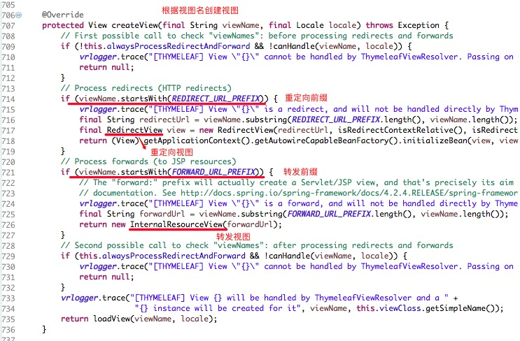


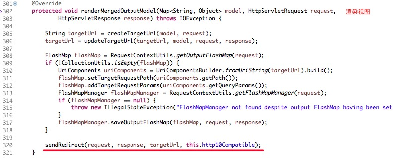


5、测试添加

测试成功之后跳转到列表界面

6、日期格式

提交的数据格式不对：生日：日期；

2017-12-12；2017/12/12；2017.12.12；

日期的格式化；SpringMVC将页面提交的值需要转换为指定的类型;

2017-12-12---Date； 类型转换，格式化;

WebMvcAutoConfiguration类中


可以看出默认使用 "/" 分割日期

我们自定义日期格式化

```properties
#设置日期格式化
spring.mvc.date-format=yyyy-MM-dd 
```

这个时候我们添加日期的时候就按这种格式


### (7)、CRUD-员工修改

修改添加二合一表单

```html
<!--需要区分是员工修改还是添加；-->
<form th:action="@{/emp}" method="post">
    <!--发送put请求修改员工数据-->
    <!--
1、SpringMVC中配置HiddenHttpMethodFilter;（SpringBoot自动配置好的）
2、页面创建一个post表单
3、创建一个input项，name="_method";值就是我们指定的请求方式
-->
    <input type="hidden" name="_method" value="put" th:if="${emp!=null}"/>
    <input type="hidden" name="id" th:if="${emp!=null}" th:value="${emp.id}">
    <div class="form-group">
        <label>LastName</label>
        <input name="lastName" type="text" class="form-control" placeholder="zhangsan" th:value="${emp!=null}?${emp.lastName}">
    </div>
    <div class="form-group">
        <label>Email</label>
        <input name="email" type="email" class="form-control" placeholder="zhangsan@atguigu.com" th:value="${emp!=null}?${emp.email}">
    </div>
    <div class="form-group">
        <label>Gender</label><br/>
        <div class="form-check form-check-inline">
            <input class="form-check-input" type="radio" name="gender" value="1" th:checked="${emp!=null}?${emp.gender==1}">
            <label class="form-check-label">男</label>
        </div>
        <div class="form-check form-check-inline">
            <input class="form-check-input" type="radio" name="gender" value="0" th:checked="${emp!=null}?${emp.gender==0}">
            <label class="form-check-label">女</label>
        </div>
    </div>
    <div class="form-group">
        <label>department</label>
        <!--提交的是部门的id-->
        <select class="form-control" name="department.id">
            <option th:selected="${emp!=null}?${dept.id == emp.department.id}" th:value="${dept.id}" th:each="dept:${depts}" th:text="${dept.departmentName}">1</option>
        </select>
    </div>
    <div class="form-group">
        <label>Birth</label>
        <input name="birth" type="text" class="form-control" placeholder="zhangsan" th:value="${emp!=null}?${#dates.format(emp.birth, 'yyyy-MM-dd HH:mm')}">
    </div>
    <button type="submit" class="btn btn-primary" th:text="${emp!=null}?'修改':'添加'">添加</button>
</form>
```

### (8)、CRUD-员工删除

```html
<tr th:each="emp:${emps}">
    <td th:text="${emp.id}"></td>
    <td>[[${emp.lastName}]]</td>
    <td th:text="${emp.email}"></td>
    <td th:text="${emp.gender}==0?'女':'男'"></td>
    <td th:text="${emp.department.departmentName}"></td>
    <td th:text="${#dates.format(emp.birth, 'yyyy-MM-dd HH:mm')}"></td>
    <td>
        <a class="btn btn-sm btn-primary" th:href="@{/emp/}+${emp.id}">编辑</a>
        <button th:attr="del_uri=@{/emp/}+${emp.id}" class="btn btn-sm btn-danger deleteBtn">删除</button>
    </td>
</tr>


<script>
    $(".deleteBtn").click(function(){
        //删除当前员工的
        $("#deleteEmpForm").attr("action",$(this).attr("del_uri")).submit();
        return false;
    });
</script>
```


## 7、错误处理机制

### (1)、SpringBoot默认的错误处理机制

#### [1]、默认效果

1、浏览器，返回一个默认的错误页面


  浏览器发送请求的请求头：


​	2、如果是其他客户端，默认响应一个json数据


​		

备注：Postman --> View --> Show PostMan Console 可查看详细访问信息


#### [2]、原理

​	可以参照 ErrorMvcAutoConfiguration；错误处理的自动配置；

  	给容器中添加了以下组件

1、DefaultErrorAttributes： 默认的错误信息


2、BasicErrorController：处理默认/error请求


​	

3、ErrorPageCustomizer：默认/error 下错误页面注册


系统出现错误以后来到error请求进行处理，(web.xml注册的错误页面规则) 

4、DefaultErrorViewResolver：默认的错误页面位置查找


步骤：

​		一但系统出现4xx或者5xx之类的错误；ErrorPageCustomizer就会生效（定制错误的响应规则）；就会来到/error请求；就会被**BasicErrorController**处理；

​		响应页面；去哪个页面是由**DefaultErrorViewResolver**解析得到的；


### (2)、如何定制错误响应

#### 	[1]、如何定制错误的页面

1、有模板引擎的情况下；error/状态码;** 【将错误页面命名为  错误状态码.html 放在模板引擎文件夹里面的 error文件夹下】，发生此状态码的错误就会来到  对应的页面；

我们可以使用4xx和5xx作为错误页面的文件名来匹配这种类型的所有错误，精确优先（优先寻找精确的状态码.html）；		

​	页面能获取的信息；

​	timestamp：时间戳

​	status：状态码

​	error：错误提示

​	exception：异常对象

​	message：异常消息

​	errors：JSR303数据校验的错误都在这里


templates/error/404.html

```html
<main role="main" class="col-md-9 ml-sm-auto col-lg-10 pt-3 px-4">
	<h1>status:[[${status}]]</h1>
	<h2>timestamp:[[${timestamp}]]</h2>
</main> 
```

2、没有模板引擎（模板引擎找不到这个错误页面），静态资源文件夹下找；


3、以上都没有错误页面，就是默认来到SpringBoot默认的错误提示页面；

默认返回的error 的界面


#### 	[2]、如何定制错误的json数据

##### {1}、自定义一个运行时异常用于测试

1、自定义异常类

```java
public class UserNotExistException extends RuntimeException {

    public UserNotExistException() {
        super("用户不存在");
    }
}
```

2、访问异常controller

```java
@Controller
public class HelloController {

    //模拟运行时异常
    @ResponseBody
    @RequestMapping("/hello")
    public String hello(@RequestParam("user") String user) {
        if(user.equals("aaa")) {
            throw new UserNotExistException();//自定义异常
        }
        return "Hello World";
    } 
```

3、异常界面

resources/templates/error/5xx.html

```html
            <main role="main" class="col-md-9 ml-sm-auto col-lg-10 pt-3 px-4">
               <h1>status:[[${status}]]</h1>
               <h2>timestamp:[[${timestamp}]]</h2>
               <h2>exception:[[${exception}]]</h2>
               <h2>message:[[${message}]]</h2>
               <h2>ext.code:[[${ext.code}]]</h2>
               <h2>ext.message:[[${ext.message}]]</h2>
            </main> 
```

4、测试访问

浏览器


Postman模拟其他端访问


##### {2}、自定义异常处理&返回定制json数据

```java
@ControllerAdvice
public class MyExceptionHandler {

    //1、浏览器客户端返回的都是json
    @ResponseBody
    @ExceptionHandler(UserNotExistException.class)
    public Map<String,Object> handleException(Exception e) {
        Map<String,Object> map = new HashMap<>();
        map.put("code","user.notexist");
        map.put("message",e.getMessage());
        return map;
    } 
```

此种方式没有自适应，前端和其他端都是返回的json数据


##### {3}、转发到/error进行自适应响应效果处理

可以根据默认的逻辑，前端访问返回界面，其他端访问访问json数据

```java
@ExceptionHandler(UserNotExistException.class)
public String handleException(Exception e, HttpServletRequest request) {
    Map<String,Object> map = new HashMap<>();
    //传入我们自己的错误状态码  4xx 5xx
    /**
     * Integer statusCode = (Integer) request
     .getAttribute("javax.servlet.error.status_code");
     */
    request.setAttribute("javax.servlet.error.status_code",500);
    map.put("code","user.notexist");
    map.put("message","用户出错啦");

    request.setAttribute("ext",map);
    //转发到/error
    return "forward:/error";
} 
```

测试访问


Json中不包含我们自定义的异常信息


自适应原理：

BasicErrorController是默认处理 /error 请求的


#### 	[3]、将我们的定制数据携带出去

出现错误以后，会来到/error请求，会被BasicErrorController处理，响应出去可以获取的数据是由getErrorAttributes得到的（是AbstractErrorController（ErrorController）规定的方法）；


1、完全来编写一个ErrorController的实现类【或者是编写AbstractErrorController的子类】，放在容器中；

2、页面上能用的数据，或者是json返回能用的数据都是通过errorAttributes.getErrorAttributes得到；


容器中DefaultErrorAttributes.getErrorAttributes()；默认进行数据处理的；


如果没有ErrorAttributes 类，自动创建一个，所以我们可以定义一个ErrorAttributes 类


自定义ErrorAttributes

```java
//给容器中加入我们自己定义的ErrorAttributes
@Component
public class MyErrorAttributes extends DefaultErrorAttributes {

    // 返回值的map就是页面和json能获取的所有字段
    @Override
    public Map<String, Object> getErrorAttributes(RequestAttributes requestAttributes, boolean 
    includeStackTrace) {
        Map<String, Object> map = super.getErrorAttributes(requestAttributes, includeStackTrace);
        map.put("company", "百度");

        // 我们的异常处理器携带的数据
        Map<String, Object> ext = (Map<String, Object>) requestAttributes.getAttribute("ext", 0);
        map.put("ext", ext);
        return map;
    }
}
 
```

最终效果：响应是自适应的，可以通过定制ErrorAttributes改变需要返回的内容，


包含我们自定义的异常信息


## 8、配置嵌入式Servlet容器

SpringBoot默认使用Tomcat作为嵌入式的Servlet容器；


问题？

### (1)、如何定制和修改Servlet容器的相关配置；

[1]、修改和server有关的配置（ServerProperties【也是EmbeddedServletContainerCustomizer】）；

```properties
server.port=8081
server.context-path=/crud

server.tomcat.uri-encoding=UTF-8

//通用的Servlet容器设置
server.xxx
//Tomcat的设置
server.tomcat.xxx
```

[2]、编写一个**EmbeddedServletContainerCustomizer**：嵌入式的Servlet容器的定制器；来修改Servlet容器的配置

```java
@Bean  //一定要将这个定制器加入到容器中
public EmbeddedServletContainerCustomizer embeddedServletContainerCustomizer(){
    return new EmbeddedServletContainerCustomizer() {

        //定制嵌入式的Servlet容器相关的规则
        @Override
        public void customize(ConfigurableEmbeddedServletContainer container) {
            container.setPort(8083);
        }
    };
}
```

### (2)、注册Servlet三大组件【Servlet、Filter、Listener】

由于SpringBoot默认是以jar包的方式启动嵌入式的Servlet容器来启动SpringBoot的web应用，没有web.xml文件。

注册三大组件用以下方式

ServletRegistrationBean

```java
//注册三大组件
@Bean
public ServletRegistrationBean myServlet(){
    ServletRegistrationBean registrationBean = new ServletRegistrationBean(new MyServlet(),"/myServlet");
    return registrationBean;
}

```

FilterRegistrationBean

```java
@Bean
public FilterRegistrationBean myFilter(){
    FilterRegistrationBean registrationBean = new FilterRegistrationBean();
    registrationBean.setFilter(new MyFilter());
    registrationBean.setUrlPatterns(Arrays.asList("/hello","/myServlet"));
    return registrationBean;
}
```

ServletListenerRegistrationBean

```java
@Bean
public ServletListenerRegistrationBean myListener(){
    ServletListenerRegistrationBean<MyListener> registrationBean = new ServletListenerRegistrationBean<>(new MyListener());
    return registrationBean;
}
```


SpringBoot帮我们自动SpringMVC的时候，自动的注册SpringMVC的前端控制器；DIspatcherServlet；

DispatcherServletAutoConfiguration中：

```java
@Bean(name = DEFAULT_DISPATCHER_SERVLET_REGISTRATION_BEAN_NAME)
@ConditionalOnBean(value = DispatcherServlet.class, name = DEFAULT_DISPATCHER_SERVLET_BEAN_NAME)
public ServletRegistrationBean dispatcherServletRegistration(
      DispatcherServlet dispatcherServlet) {
   ServletRegistrationBean registration = new ServletRegistrationBean(
         dispatcherServlet, this.serverProperties.getServletMapping());
    //默认拦截： /  所有请求；包静态资源，但是不拦截jsp请求；   /*会拦截jsp
    //可以通过server.servletPath来修改SpringMVC前端控制器默认拦截的请求路径
    
   registration.setName(DEFAULT_DISPATCHER_SERVLET_BEAN_NAME);
   registration.setLoadOnStartup(
         this.webMvcProperties.getServlet().getLoadOnStartup());
   if (this.multipartConfig != null) {
      registration.setMultipartConfig(this.multipartConfig);
   }
   return registration;
}

```

2）、SpringBoot能不能支持其他的Servlet容器；

### (3)、替换为其他嵌入式Servlet容器


默认支持：

Tomcat（默认使用）

```xml
<dependency>
   <groupId>org.springframework.boot</groupId>
   <artifactId>spring-boot-starter-web</artifactId>
   引入web模块默认就是使用嵌入式的Tomcat作为Servlet容器；
</dependency>
```

Jetty

```xml
<!-- 引入web模块 -->
<dependency>
   <groupId>org.springframework.boot</groupId>
   <artifactId>spring-boot-starter-web</artifactId>
   <exclusions>
      <exclusion>
         <artifactId>spring-boot-starter-tomcat</artifactId>
         <groupId>org.springframework.boot</groupId>
      </exclusion>
   </exclusions>
</dependency>

<!--引入其他的Servlet容器-->
<dependency>
   <artifactId>spring-boot-starter-jetty</artifactId>
   <groupId>org.springframework.boot</groupId>
</dependency>
```

Undertow

```xml
<!-- 引入web模块 -->
<dependency>
   <groupId>org.springframework.boot</groupId>
   <artifactId>spring-boot-starter-web</artifactId>
   <exclusions>
      <exclusion>
         <artifactId>spring-boot-starter-tomcat</artifactId>
         <groupId>org.springframework.boot</groupId>
      </exclusion>
   </exclusions>
</dependency>

<!--引入其他的Servlet容器-->
<dependency>
   <artifactId>spring-boot-starter-undertow</artifactId>
   <groupId>org.springframework.boot</groupId>
</dependency>
```

### (4)、嵌入式Servlet容器自动配置原理


EmbeddedServletContainerAutoConfiguration：嵌入式的Servlet容器自动配置？

```java
@AutoConfigureOrder(Ordered.HIGHEST_PRECEDENCE)
@Configuration
@ConditionalOnWebApplication
@Import(BeanPostProcessorsRegistrar.class)
//导入BeanPostProcessorsRegistrar：Spring注解版；给容器中导入一些组件
//导入了EmbeddedServletContainerCustomizerBeanPostProcessor：
//后置处理器：bean初始化前后（创建完对象，还没赋值赋值）执行初始化工作
public class EmbeddedServletContainerAutoConfiguration {
    
    @Configuration
	@ConditionalOnClass({ Servlet.class, Tomcat.class })//判断当前是否引入了Tomcat依赖；
	@ConditionalOnMissingBean(value = EmbeddedServletContainerFactory.class, search = SearchStrategy.CURRENT)//判断当前容器没有用户自己定义EmbeddedServletContainerFactory：嵌入式的Servlet容器工厂；作用：创建嵌入式的Servlet容器
	public static class EmbeddedTomcat {

		@Bean
		public TomcatEmbeddedServletContainerFactory tomcatEmbeddedServletContainerFactory() {
			return new TomcatEmbeddedServletContainerFactory();
		}

	}
    
    /**
	 * Nested configuration if Jetty is being used.
	 */
	@Configuration
	@ConditionalOnClass({ Servlet.class, Server.class, Loader.class,
			WebAppContext.class })
	@ConditionalOnMissingBean(value = EmbeddedServletContainerFactory.class, search = SearchStrategy.CURRENT)
	public static class EmbeddedJetty {

		@Bean
		public JettyEmbeddedServletContainerFactory jettyEmbeddedServletContainerFactory() {
			return new JettyEmbeddedServletContainerFactory();
		}

	}

	/**
	 * Nested configuration if Undertow is being used.
	 */
	@Configuration
	@ConditionalOnClass({ Servlet.class, Undertow.class, SslClientAuthMode.class })
	@ConditionalOnMissingBean(value = EmbeddedServletContainerFactory.class, search = SearchStrategy.CURRENT)
	public static class EmbeddedUndertow {

		@Bean
		public UndertowEmbeddedServletContainerFactory undertowEmbeddedServletContainerFactory() {
			return new UndertowEmbeddedServletContainerFactory();
		}

	}
```

1）、EmbeddedServletContainerFactory（嵌入式Servlet容器工厂）

```java
public interface EmbeddedServletContainerFactory {

   //获取嵌入式的Servlet容器
   EmbeddedServletContainer getEmbeddedServletContainer(
         ServletContextInitializer... initializers);

}
```


2）、EmbeddedServletContainer：（嵌入式的Servlet容器）


3）、以**TomcatEmbeddedServletContainerFactory**为例

```java
@Override
public EmbeddedServletContainer getEmbeddedServletContainer(
      ServletContextInitializer... initializers) {
    //创建一个Tomcat
   Tomcat tomcat = new Tomcat();
    
    //配置Tomcat的基本环节
   File baseDir = (this.baseDirectory != null ? this.baseDirectory
         : createTempDir("tomcat"));
   tomcat.setBaseDir(baseDir.getAbsolutePath());
   Connector connector = new Connector(this.protocol);
   tomcat.getService().addConnector(connector);
   customizeConnector(connector);
   tomcat.setConnector(connector);
   tomcat.getHost().setAutoDeploy(false);
   configureEngine(tomcat.getEngine());
   for (Connector additionalConnector : this.additionalTomcatConnectors) {
      tomcat.getService().addConnector(additionalConnector);
   }
   prepareContext(tomcat.getHost(), initializers);
    
    //将配置好的Tomcat传入进去，返回一个EmbeddedServletContainer；并且启动Tomcat服务器
   return getTomcatEmbeddedServletContainer(tomcat);
}
```

4）、我们对嵌入式容器的配置修改是怎么生效？

```
ServerProperties、EmbeddedServletContainerCustomizer
```


**EmbeddedServletContainerCustomizer**：定制器帮我们修改了Servlet容器的配置？

怎么修改的原理？

5）、容器中导入了**EmbeddedServletContainerCustomizerBeanPostProcessor**

```java
//初始化之前
@Override
public Object postProcessBeforeInitialization(Object bean, String beanName)
      throws BeansException {
    //如果当前初始化的是一个ConfigurableEmbeddedServletContainer类型的组件
   if (bean instanceof ConfigurableEmbeddedServletContainer) {
       //
      postProcessBeforeInitialization((ConfigurableEmbeddedServletContainer) bean);
   }
   return bean;
}

private void postProcessBeforeInitialization(
			ConfigurableEmbeddedServletContainer bean) {
    //获取所有的定制器，调用每一个定制器的customize方法来给Servlet容器进行属性赋值；
    for (EmbeddedServletContainerCustomizer customizer : getCustomizers()) {
        customizer.customize(bean);
    }
}

private Collection<EmbeddedServletContainerCustomizer> getCustomizers() {
    if (this.customizers == null) {
        // Look up does not include the parent context
        this.customizers = new ArrayList<EmbeddedServletContainerCustomizer>(
            this.beanFactory
            //从容器中获取所有这葛类型的组件：EmbeddedServletContainerCustomizer
            //定制Servlet容器，给容器中可以添加一个EmbeddedServletContainerCustomizer类型的组件
            .getBeansOfType(EmbeddedServletContainerCustomizer.class,
                            false, false)
            .values());
        Collections.sort(this.customizers, AnnotationAwareOrderComparator.INSTANCE);
        this.customizers = Collections.unmodifiableList(this.customizers);
    }
    return this.customizers;
}

ServerProperties也是定制器
```

步骤：

1）、SpringBoot根据导入的依赖情况，给容器中添加相应的EmbeddedServletContainerFactory【TomcatEmbeddedServletContainerFactory】

2）、容器中某个组件要创建对象就会惊动后置处理器；EmbeddedServletContainerCustomizerBeanPostProcessor；

只要是嵌入式的Servlet容器工厂，后置处理器就工作；

3）、后置处理器，从容器中获取所有的**EmbeddedServletContainerCustomizer**，调用定制器的定制方法


###(5)、嵌入式Servlet容器启动原理

什么时候创建嵌入式的Servlet容器工厂？什么时候获取嵌入式的Servlet容器并启动Tomcat；

获取嵌入式的Servlet容器工厂：

[1]、SpringBoot应用启动运行run方法

[2]、refreshContext(context);SpringBoot刷新IOC容器【创建IOC容器对象，并初始化容器，创建容器中的每一个组件】；如果是web应用创建**AnnotationConfigEmbeddedWebApplicationContext**，否则：**AnnotationConfigApplicationContext**

[3]、refresh(context);**刷新刚才创建好的ioc容器；**

```java
public void refresh() throws BeansException, IllegalStateException {
   synchronized (this.startupShutdownMonitor) {
      // Prepare this context for refreshing.
      prepareRefresh();

      // Tell the subclass to refresh the internal bean factory.
      ConfigurableListableBeanFactory beanFactory = obtainFreshBeanFactory();

      // Prepare the bean factory for use in this context.
      prepareBeanFactory(beanFactory);

      try {
         // Allows post-processing of the bean factory in context subclasses.
         postProcessBeanFactory(beanFactory);

         // Invoke factory processors registered as beans in the context.
         invokeBeanFactoryPostProcessors(beanFactory);

         // Register bean processors that intercept bean creation.
         registerBeanPostProcessors(beanFactory);

         // Initialize message source for this context.
         initMessageSource();

         // Initialize event multicaster for this context.
         initApplicationEventMulticaster();

         // Initialize other special beans in specific context subclasses.
         onRefresh();

         // Check for listener beans and register them.
         registerListeners();

         // Instantiate all remaining (non-lazy-init) singletons.
         finishBeanFactoryInitialization(beanFactory);

         // Last step: publish corresponding event.
         finishRefresh();
      }

      catch (BeansException ex) {
         if (logger.isWarnEnabled()) {
            logger.warn("Exception encountered during context initialization - " +
                  "cancelling refresh attempt: " + ex);
         }

         // Destroy already created singletons to avoid dangling resources.
         destroyBeans();

         // Reset 'active' flag.
         cancelRefresh(ex);

         // Propagate exception to caller.
         throw ex;
      }

      finally {
         // Reset common introspection caches in Spring's core, since we
         // might not ever need metadata for singleton beans anymore...
         resetCommonCaches();
      }
   }
}
```

4）、onRefresh(); web的ioc容器重写了onRefresh方法

5）、webioc容器会创建嵌入式的Servlet容器；**createEmbeddedServletContainer**();

**6）、获取嵌入式的Servlet容器工厂：**

EmbeddedServletContainerFactory containerFactory = getEmbeddedServletContainerFactory();

​	从ioc容器中获取EmbeddedServletContainerFactory 组件；**TomcatEmbeddedServletContainerFactory**创建对象，后置处理器一看是这个对象，就获取所有的定制器来先定制Servlet容器的相关配置；

7）、**使用容器工厂获取嵌入式的Servlet容器**：this.embeddedServletContainer = containerFactory      .getEmbeddedServletContainer(getSelfInitializer());

8）、嵌入式的Servlet容器创建对象并启动Servlet容器；

**先启动嵌入式的Servlet容器，再将ioc容器中剩下没有创建出的对象获取出来；**

**==IOC容器启动创建嵌入式的Servlet容器==**


## 9、使用外置的Servlet容器

嵌入式Servlet容器：应用打成可执行的jar

​		优点：简单、便携；

​		缺点：默认不支持JSP、优化定制比较复杂（使用定制器【ServerProperties、自定义EmbeddedServletContainerCustomizer】，自己编写嵌入式Servlet容器的创建工厂【EmbeddedServletContainerFactory】）；


外置的Servlet容器：外面安装Tomcat---应用war包的方式打包；

### (1)、步骤

1、必须创建一个war项目；（利用idea创建好目录结构）

2、将嵌入式的Tomcat指定为provided；

```xml
<dependency>
   <groupId>org.springframework.boot</groupId>
   <artifactId>spring-boot-starter-tomcat</artifactId>
   <scope>provided</scope>
</dependency>
```

3、必须编写一个**SpringBootServletInitializer**的子类，并调用configure方法

```java
public class ServletInitializer extends SpringBootServletInitializer {

   @Override
   protected SpringApplicationBuilder configure(SpringApplicationBuilder application) {
       //传入SpringBoot应用的主程序
      return application.sources(SpringBoot04WebJspApplication.class);
   }

}
```

4、启动服务器就可以使用；

### (2)、原理

jar包：执行SpringBoot主类的main方法，启动ioc容器，创建嵌入式的Servlet容器；

war包：启动服务器，**服务器启动SpringBoot应用**【SpringBootServletInitializer】，启动ioc容器；


servlet3.0（Spring注解版）：

8.2.4 Shared libraries / runtimes pluggability：

规则：

​	1）、服务器启动（web应用启动）会创建当前web应用里面每一个jar包里面ServletContainerInitializer实例：

​	2）、ServletContainerInitializer的实现放在jar包的META-INF/services文件夹下，有一个名为javax.servlet.ServletContainerInitializer的文件，内容就是ServletContainerInitializer的实现类的全类名

​	3）、还可以使用@HandlesTypes，在应用启动的时候加载我们感兴趣的类；


流程：

1）、启动Tomcat

2）、org\springframework\spring-web\4.3.14.RELEASE\spring-web-4.3.14.RELEASE.jar!\META-INF\services\javax.servlet.ServletContainerInitializer：

Spring的web模块里面有这个文件：**org.springframework.web.SpringServletContainerInitializer**

3）、SpringServletContainerInitializer将@HandlesTypes(WebApplicationInitializer.class)标注的所有这个类型的类都传入到onStartup方法的Set<Class<?>>；为这些WebApplicationInitializer类型的类创建实例；

4）、每一个WebApplicationInitializer都调用自己的onStartup；


5）、相当于我们的SpringBootServletInitializer的类会被创建对象，并执行onStartup方法

6）、SpringBootServletInitializer实例执行onStartup的时候会createRootApplicationContext；创建容器

```java
protected WebApplicationContext createRootApplicationContext(
      ServletContext servletContext) {
    //1、创建SpringApplicationBuilder
   SpringApplicationBuilder builder = createSpringApplicationBuilder();
   StandardServletEnvironment environment = new StandardServletEnvironment();
   environment.initPropertySources(servletContext, null);
   builder.environment(environment);
   builder.main(getClass());
   ApplicationContext parent = getExistingRootWebApplicationContext(servletContext);
   if (parent != null) {
      this.logger.info("Root context already created (using as parent).");
      servletContext.setAttribute(
            WebApplicationContext.ROOT_WEB_APPLICATION_CONTEXT_ATTRIBUTE, null);
      builder.initializers(new ParentContextApplicationContextInitializer(parent));
   }
   builder.initializers(
         new ServletContextApplicationContextInitializer(servletContext));
   builder.contextClass(AnnotationConfigEmbeddedWebApplicationContext.class);
    
    //调用configure方法，子类重写了这个方法，将SpringBoot的主程序类传入了进来
   builder = configure(builder);
    
    //使用builder创建一个Spring应用
   SpringApplication application = builder.build();
   if (application.getSources().isEmpty() && AnnotationUtils
         .findAnnotation(getClass(), Configuration.class) != null) {
      application.getSources().add(getClass());
   }
   Assert.state(!application.getSources().isEmpty(),
         "No SpringApplication sources have been defined. Either override the "
               + "configure method or add an @Configuration annotation");
   // Ensure error pages are registered
   if (this.registerErrorPageFilter) {
      application.getSources().add(ErrorPageFilterConfiguration.class);
   }
    //启动Spring应用
   return run(application);
}
```

7）、Spring的应用就启动并且创建IOC容器

```java
public ConfigurableApplicationContext run(String... args) {
   StopWatch stopWatch = new StopWatch();
   stopWatch.start();
   ConfigurableApplicationContext context = null;
   FailureAnalyzers analyzers = null;
   configureHeadlessProperty();
   SpringApplicationRunListeners listeners = getRunListeners(args);
   listeners.starting();
   try {
      ApplicationArguments applicationArguments = new DefaultApplicationArguments(
            args);
      ConfigurableEnvironment environment = prepareEnvironment(listeners,
            applicationArguments);
      Banner printedBanner = printBanner(environment);
      context = createApplicationContext();
      analyzers = new FailureAnalyzers(context);
      prepareContext(context, environment, listeners, applicationArguments,
            printedBanner);
       
       //刷新IOC容器
      refreshContext(context);
      afterRefresh(context, applicationArguments);
      listeners.finished(context, null);
      stopWatch.stop();
      if (this.logStartupInfo) {
         new StartupInfoLogger(this.mainApplicationClass)
               .logStarted(getApplicationLog(), stopWatch);
      }
      return context;
   }
   catch (Throwable ex) {
      handleRunFailure(context, listeners, analyzers, ex);
      throw new IllegalStateException(ex);
   }
}
```

**==启动Servlet容器，再启动SpringBoot应用==**


# 五、Docker

## 1、简介

**Docker**是一个开源的应用容器引擎；是一个轻量级容器技术；

Docker支持将软件编译成一个镜像；然后在镜像中各种软件做好配置，将镜像发布出去，其他使用者可以直接使用这个镜像；

运行中的这个镜像称为容器，容器启动是非常快速的。


## 2、核心概念

docker主机(Host)：安装了Docker程序的机器（Docker直接安装在操作系统之上）；

docker客户端(Client)：连接docker主机进行操作；

docker仓库(Registry)：用来保存各种打包好的软件镜像；

docker镜像(Images)：软件打包好的镜像；放在docker仓库中；

docker容器(Container)：镜像启动后的实例称为一个容器；容器是独立运行的一个或一组应用


使用Docker的步骤：

1）、安装Docker

2）、去Docker仓库找到这个软件对应的镜像；

3）、使用Docker运行这个镜像，这个镜像就会生成一个Docker容器；

4）、对容器的启动停止就是对软件的启动停止；

## 3、安装Docker

#### (1)、安装linux虚拟机

​	1、VMWare、VirtualBox（安装）；

​	2、导入虚拟机文件centos7-atguigu.ova；

​	3、双击启动linux虚拟机;使用  root/ 123456登陆

​	4、使用客户端连接linux服务器进行命令操作；

​	5、设置虚拟机网络；

​		桥接网络===选好网卡====接入网线；

​	6、设置好网络以后使用命令重启虚拟机的网络

```shell
service network restart
```

​	7、查看linux的ip地址

```shell
ip addr
```

​	8、使用客户端连接linux；

#### (2)、在linux虚拟机上安装docker

步骤：

```shell
1、检查内核版本，必须是3.10及以上
uname -r
2、安装docker
yum install docker
3、输入y确认安装
4、启动docker
[root@localhost ~]# systemctl start docker
[root@localhost ~]# docker -v
Docker version 1.12.6, build 3e8e77d/1.12.6
5、开机启动docker
[root@localhost ~]# systemctl enable docker
Created symlink from /etc/systemd/system/multi-user.target.wants/docker.service to /usr/lib/systemd/system/docker.service.
6、停止docker
systemctl stop docker
```

## 4、Docker常用命令&操作

### (1)、镜像操作

| 操作 | 命令                                            | 说明                                                     |
| ---- | ----------------------------------------------- | -------------------------------------------------------- |
| 检索 | docker  search 关键字  eg：docker  search redis | 我们经常去docker  hub上检索镜像的详细信息，如镜像的TAG。 |
| 拉取 | docker pull 镜像名:tag                          | :tag是可选的，tag表示标签，多为软件的版本，默认是latest  |
| 列表 | docker images                                   | 查看所有本地镜像                                         |
| 删除 | docker rmi image-id                             | 删除指定的本地镜像                                       |

https://hub.docker.com/

### (2)、容器操作

软件镜像（QQ安装程序）----运行镜像----产生一个容器（正在运行的软件，运行的QQ）；

步骤：

````shell
1、搜索镜像
[root@localhost ~]# docker search tomcat
2、拉取镜像
[root@localhost ~]# docker pull tomcat
3、根据镜像启动容器
docker run --name mytomcat -d tomcat:latest
4、docker ps  
查看运行中的容器
5、 停止运行中的容器
docker stop  容器的id
6、查看所有的容器
docker ps -a
7、启动容器
docker start 容器id
8、删除一个容器
 docker rm 容器id
9、启动一个做了端口映射的tomcat
[root@localhost ~]# docker run -d -p 8888:8080 tomcat
-d：后台运行
-p: 将主机的端口映射到容器的一个端口    主机端口:容器内部的端口

10、为了演示简单关闭了linux的防火墙
service firewalld status ；查看防火墙状态
service firewalld stop：关闭防火墙
11、查看容器的日志
docker logs container-name/container-id

更多命令参看
https://docs.docker.com/engine/reference/commandline/docker/
可以参考每一个镜像的文档

````


### (3)、安装MySQL示例

```shell
docker pull mysql
```


错误的启动

```shell
[root@localhost ~]# docker run --name mysql01 -d mysql
42f09819908bb72dd99ae19e792e0a5d03c48638421fa64cce5f8ba0f40f5846

mysql退出了
[root@localhost ~]# docker ps -a
CONTAINER ID        IMAGE               COMMAND                  CREATED             STATUS                           PORTS               NAMES
42f09819908b        mysql               "docker-entrypoint.sh"   34 seconds ago      Exited (1) 33 seconds ago                            mysql01
538bde63e500        tomcat              "catalina.sh run"        About an hour ago   Exited (143) About an hour ago                       compassionate_
goldstine
c4f1ac60b3fc        tomcat              "catalina.sh run"        About an hour ago   Exited (143) About an hour ago                       lonely_fermi
81ec743a5271        tomcat              "catalina.sh run"        About an hour ago   Exited (143) About an hour ago                       sick_ramanujan


//错误日志
[root@localhost ~]# docker logs 42f09819908b
error: database is uninitialized and password option is not specified 
  You need to specify one of MYSQL_ROOT_PASSWORD, MYSQL_ALLOW_EMPTY_PASSWORD and MYSQL_RANDOM_ROOT_PASSWORD；这个三个参数必须指定一个
```

正确的启动

```shell
[root@localhost ~]# docker run --name mysql01 -e MYSQL_ROOT_PASSWORD=123456 -d mysql
b874c56bec49fb43024b3805ab51e9097da779f2f572c22c695305dedd684c5f
[root@localhost ~]# docker ps
CONTAINER ID        IMAGE               COMMAND                  CREATED             STATUS              PORTS               NAMES
b874c56bec49        mysql               "docker-entrypoint.sh"   4 seconds ago       Up 3 seconds        3306/tcp            mysql01
```

做了端口映射

```shell
[root@localhost ~]# docker run -p 3306:3306 --name mysql02 -e MYSQL_ROOT_PASSWORD=123456 -d mysql
ad10e4bc5c6a0f61cbad43898de71d366117d120e39db651844c0e73863b9434
[root@localhost ~]# docker ps
CONTAINER ID        IMAGE               COMMAND                  CREATED             STATUS              PORTS                    NAMES
ad10e4bc5c6a        mysql               "docker-entrypoint.sh"   4 seconds ago       Up 2 seconds        0.0.0.0:3306->3306/tcp   mysql02
```


几个其他的高级操作

```
docker run --name mysql03 -v /conf/mysql:/etc/mysql/conf.d -e MYSQL_ROOT_PASSWORD=my-secret-pw -d mysql:tag
把主机的/conf/mysql文件夹挂载到 mysqldocker容器的/etc/mysql/conf.d文件夹里面
改mysql的配置文件就只需要把mysql配置文件放在自定义的文件夹下（/conf/mysql）

docker run --name some-mysql -e MYSQL_ROOT_PASSWORD=my-secret-pw -d mysql:tag --character-set-server=utf8mb4 --collation-server=utf8mb4_unicode_ci
指定mysql的一些配置参数
```


# 六、SpringBoot与数据访问

## 1、JDBC

```xml
<dependency>
			<groupId>org.springframework.boot</groupId>
			<artifactId>spring-boot-starter-jdbc</artifactId>
		</dependency>
		<dependency>
			<groupId>mysql</groupId>
			<artifactId>mysql-connector-java</artifactId>
			<scope>runtime</scope>
		</dependency>
```


```yaml
spring:
  datasource:
    username: root
    password: 123456
    url: jdbc:mysql://192.168.15.22:3306/jdbc
    driver-class-name: com.mysql.jdbc.Driver
```

效果：

​	默认是用org.apache.tomcat.jdbc.pool.DataSource作为数据源；

​	数据源的相关配置都在DataSourceProperties里面；

自动配置原理：

org.springframework.boot.autoconfigure.jdbc：

1、参考DataSourceConfiguration，根据配置创建数据源，默认使用Tomcat连接池；可以使用spring.datasource.type指定自定义的数据源类型；

2、SpringBoot默认可以支持；

```
org.apache.tomcat.jdbc.pool.DataSource、HikariDataSource、BasicDataSource、
```

3、自定义数据源类型

```java
/**
 * Generic DataSource configuration.
 */
@ConditionalOnMissingBean(DataSource.class)
@ConditionalOnProperty(name = "spring.datasource.type")
static class Generic {

   @Bean
   public DataSource dataSource(DataSourceProperties properties) {
       //使用DataSourceBuilder创建数据源，利用反射创建响应type的数据源，并且绑定相关属性
      return properties.initializeDataSourceBuilder().build();
   }

}
```

4、**DataSourceInitializer：ApplicationListener**；

​	作用：

​		1）、runSchemaScripts();运行建表语句；

​		2）、runDataScripts();运行插入数据的sql语句；

默认只需要将文件命名为：

```properties
schema-*.sql、data-*.sql
默认规则：schema.sql，schema-all.sql；
可以使用   
	schema:
      - classpath:department.sql
      指定位置
```

5、操作数据库：自动配置了JdbcTemplate操作数据库

## 2、整合Druid数据源

```java
导入druid数据源
@Configuration
public class DruidConfig {

    @ConfigurationProperties(prefix = "spring.datasource")
    @Bean
    public DataSource druid(){
       return  new DruidDataSource();
    }

    //配置Druid的监控
    //1、配置一个管理后台的Servlet
    @Bean
    public ServletRegistrationBean statViewServlet(){
        ServletRegistrationBean bean = new ServletRegistrationBean(new StatViewServlet(), "/druid/*");
        Map<String,String> initParams = new HashMap<>();

        initParams.put("loginUsername","admin");
        initParams.put("loginPassword","123456");
        initParams.put("allow","");//默认就是允许所有访问
        initParams.put("deny","192.168.15.21");

        bean.setInitParameters(initParams);
        return bean;
    }


    //2、配置一个web监控的filter
    @Bean
    public FilterRegistrationBean webStatFilter(){
        FilterRegistrationBean bean = new FilterRegistrationBean();
        bean.setFilter(new WebStatFilter());

        Map<String,String> initParams = new HashMap<>();
        initParams.put("exclusions","*.js,*.css,/druid/*");

        bean.setInitParameters(initParams);

        bean.setUrlPatterns(Arrays.asList("/*"));

        return  bean;
    }
}

```

## 3、整合MyBatis

```xml
		<dependency>
			<groupId>org.mybatis.spring.boot</groupId>
			<artifactId>mybatis-spring-boot-starter</artifactId>
			<version>1.3.1</version>
		</dependency>
```


步骤：

​	1）、配置数据源相关属性（见上一节Druid）

​	2）、给数据库建表

​	3）、创建JavaBean

### 	(4)、注解版

```java
//指定这是一个操作数据库的mapper
@Mapper
public interface DepartmentMapper {

    @Select("select * from department where id=#{id}")
    public Department getDeptById(Integer id);

    @Delete("delete from department where id=#{id}")
    public int deleteDeptById(Integer id);

    @Options(useGeneratedKeys = true,keyProperty = "id")
    @Insert("insert into department(departmentName) values(#{departmentName})")
    public int insertDept(Department department);

    @Update("update department set departmentName=#{departmentName} where id=#{id}")
    public int updateDept(Department department);
}
```

问题：

自定义MyBatis的配置规则；给容器中添加一个ConfigurationCustomizer；

```java
@org.springframework.context.annotation.Configuration
public class MyBatisConfig {

    @Bean
    public ConfigurationCustomizer configurationCustomizer(){
        return new ConfigurationCustomizer(){

            @Override
            public void customize(Configuration configuration) {
                configuration.setMapUnderscoreToCamelCase(true);
            }
        };
    }
}
```


```java
使用MapperScan批量扫描所有的Mapper接口；
@MapperScan(value = "com.atguigu.springboot.mapper")
@SpringBootApplication
public class SpringBoot06DataMybatisApplication {

	public static void main(String[] args) {
		SpringApplication.run(SpringBoot06DataMybatisApplication.class, args);
	}
}
```

### (5)、配置文件版

```yaml
mybatis:
  config-location: classpath:mybatis/mybatis-config.xml 指定全局配置文件的位置
  mapper-locations: classpath:mybatis/mapper/*.xml  指定sql映射文件的位置
```

更多使用参照

http://www.mybatis.org/spring-boot-starter/mybatis-spring-boot-autoconfigure/


## 4、整合SpringData JPA

### (1)、SpringData简介


### (2)、整合SpringData JPA

JPA:ORM（Object Relational Mapping）；

1）、编写一个实体类（bean）和数据表进行映射，并且配置好映射关系；

```java
//使用JPA注解配置映射关系
@Entity //告诉JPA这是一个实体类（和数据表映射的类）
@Table(name = "tbl_user") //@Table来指定和哪个数据表对应;如果省略默认表名就是user；
public class User {

    @Id //这是一个主键
    @GeneratedValue(strategy = GenerationType.IDENTITY)//自增主键
    private Integer id;

    @Column(name = "last_name",length = 50) //这是和数据表对应的一个列
    private String lastName;
    @Column //省略默认列名就是属性名
    private String email;
```

2）、编写一个Dao接口来操作实体类对应的数据表（Repository）

```java
//继承JpaRepository来完成对数据库的操作
public interface UserRepository extends JpaRepository<User,Integer> {
}

```

3）、基本的配置JpaProperties

```yaml
spring:  
 jpa:
    hibernate:
#     更新或者创建数据表结构
      ddl-auto: update
#    控制台显示SQL
    show-sql: true
```


# 七、启动配置原理

几个重要的事件回调机制

配置在META-INF/spring.factories

**ApplicationContextInitializer**

**SpringApplicationRunListener**


只需要放在ioc容器中

**ApplicationRunner**

**CommandLineRunner**


启动流程：

## 1、创建SpringApplication对象

```java
initialize(sources);
private void initialize(Object[] sources) {
    //保存主配置类
    if (sources != null && sources.length > 0) {
        this.sources.addAll(Arrays.asList(sources));
    }
    //判断当前是否一个web应用
    this.webEnvironment = deduceWebEnvironment();
    //从类路径下找到META-INF/spring.factories配置的所有ApplicationContextInitializer；然后保存起来
    setInitializers((Collection) getSpringFactoriesInstances(
        ApplicationContextInitializer.class));
    //从类路径下找到ETA-INF/spring.factories配置的所有ApplicationListener
    setListeners((Collection) getSpringFactoriesInstances(ApplicationListener.class));
    //从多个配置类中找到有main方法的主配置类
    this.mainApplicationClass = deduceMainApplicationClass();
}
```


## 2、运行run方法

```java
public ConfigurableApplicationContext run(String... args) {
   StopWatch stopWatch = new StopWatch();
   stopWatch.start();
   ConfigurableApplicationContext context = null;
   FailureAnalyzers analyzers = null;
   configureHeadlessProperty();
    
   //获取SpringApplicationRunListeners；从类路径下META-INF/spring.factories
   SpringApplicationRunListeners listeners = getRunListeners(args);
    //回调所有的获取SpringApplicationRunListener.starting()方法
   listeners.starting();
   try {
       //封装命令行参数
      ApplicationArguments applicationArguments = new DefaultApplicationArguments(
            args);
      //准备环境
      ConfigurableEnvironment environment = prepareEnvironment(listeners,
            applicationArguments);
       		//创建环境完成后回调SpringApplicationRunListener.environmentPrepared()；表示环境准备完成
       
      Banner printedBanner = printBanner(environment);
       
       //创建ApplicationContext；决定创建web的ioc还是普通的ioc
      context = createApplicationContext();
       
      analyzers = new FailureAnalyzers(context);
       //准备上下文环境;将environment保存到ioc中；而且applyInitializers()；
       //applyInitializers()：回调之前保存的所有的ApplicationContextInitializer的initialize方法
       //回调所有的SpringApplicationRunListener的contextPrepared()；
       //
      prepareContext(context, environment, listeners, applicationArguments,
            printedBanner);
       //prepareContext运行完成以后回调所有的SpringApplicationRunListener的contextLoaded（）；
       
       //s刷新容器；ioc容器初始化（如果是web应用还会创建嵌入式的Tomcat）；Spring注解版
       //扫描，创建，加载所有组件的地方；（配置类，组件，自动配置）
      refreshContext(context);
       //从ioc容器中获取所有的ApplicationRunner和CommandLineRunner进行回调
       //ApplicationRunner先回调，CommandLineRunner再回调
      afterRefresh(context, applicationArguments);
       //所有的SpringApplicationRunListener回调finished方法
      listeners.finished(context, null);
      stopWatch.stop();
      if (this.logStartupInfo) {
         new StartupInfoLogger(this.mainApplicationClass)
               .logStarted(getApplicationLog(), stopWatch);
      }
       //整个SpringBoot应用启动完成以后返回启动的ioc容器；
      return context;
   }
   catch (Throwable ex) {
      handleRunFailure(context, listeners, analyzers, ex);
      throw new IllegalStateException(ex);
   }
}
```

## 3、事件监听机制

配置在META-INF/spring.factories

**ApplicationContextInitializer**

```java
public class HelloApplicationContextInitializer implements ApplicationContextInitializer<ConfigurableApplicationContext> {
    @Override
    public void initialize(ConfigurableApplicationContext applicationContext) {
        System.out.println("ApplicationContextInitializer...initialize..."+applicationContext);
    }
}

```

**SpringApplicationRunListener**

```java
public class HelloSpringApplicationRunListener implements SpringApplicationRunListener {

    //必须有的构造器
    public HelloSpringApplicationRunListener(SpringApplication application, String[] args){

    }

    @Override
    public void starting() {
        System.out.println("SpringApplicationRunListener...starting...");
    }

    @Override
    public void environmentPrepared(ConfigurableEnvironment environment) {
        Object o = environment.getSystemProperties().get("os.name");
        System.out.println("SpringApplicationRunListener...environmentPrepared.."+o);
    }

    @Override
    public void contextPrepared(ConfigurableApplicationContext context) {
        System.out.println("SpringApplicationRunListener...contextPrepared...");
    }

    @Override
    public void contextLoaded(ConfigurableApplicationContext context) {
        System.out.println("SpringApplicationRunListener...contextLoaded...");
    }

    @Override
    public void finished(ConfigurableApplicationContext context, Throwable exception) {
        System.out.println("SpringApplicationRunListener...finished...");
    }
}

```

配置（META-INF/spring.factories）

```properties
org.springframework.context.ApplicationContextInitializer=\
com.atguigu.springboot.listener.HelloApplicationContextInitializer

org.springframework.boot.SpringApplicationRunListener=\
com.atguigu.springboot.listener.HelloSpringApplicationRunListener
```


只需要放在ioc容器中

**ApplicationRunner**

```java
@Component
public class HelloApplicationRunner implements ApplicationRunner {
    @Override
    public void run(ApplicationArguments args) throws Exception {
        System.out.println("ApplicationRunner...run....");
    }
}
```


**CommandLineRunner**

```java
@Component
public class HelloCommandLineRunner implements CommandLineRunner {
    @Override
    public void run(String... args) throws Exception {
        System.out.println("CommandLineRunner...run..."+ Arrays.asList(args));
    }
}
```


# 八、自定义starter

starter：

​	1、这个场景需要使用到的依赖是什么？

​	2、如何编写自动配置

```java
@Configuration  //指定这个类是一个配置类
@ConditionalOnXXX  //在指定条件成立的情况下自动配置类生效
@AutoConfigureAfter  //指定自动配置类的顺序
@Bean  //给容器中添加组件

@ConfigurationPropertie结合相关xxxProperties类来绑定相关的配置
@EnableConfigurationProperties //让xxxProperties生效加入到容器中

自动配置类要能加载
将需要启动就加载的自动配置类，配置在META-INF/spring.factories
org.springframework.boot.autoconfigure.EnableAutoConfiguration=\
org.springframework.boot.autoconfigure.admin.SpringApplicationAdminJmxAutoConfiguration,\
org.springframework.boot.autoconfigure.aop.AopAutoConfiguration,\
```

​	3、模式：

启动器只用来做依赖导入；

专门来写一个自动配置模块；

启动器依赖自动配置；别人只需要引入启动器（starter）

mybatis-spring-boot-starter；自定义启动器名-spring-boot-starter


步骤：

1）、启动器模块

```xml
<?xml version="1.0" encoding="UTF-8"?>
<project xmlns="http://maven.apache.org/POM/4.0.0"
         xmlns:xsi="http://www.w3.org/2001/XMLSchema-instance"
         xsi:schemaLocation="http://maven.apache.org/POM/4.0.0 http://maven.apache.org/xsd/maven-4.0.0.xsd">
    <modelVersion>4.0.0</modelVersion>

    <groupId>com.atguigu.starter</groupId>
    <artifactId>atguigu-spring-boot-starter</artifactId>
    <version>1.0-SNAPSHOT</version>

    <!--启动器-->
    <dependencies>

        <!--引入自动配置模块-->
        <dependency>
            <groupId>com.atguigu.starter</groupId>
            <artifactId>atguigu-spring-boot-starter-autoconfigurer</artifactId>
            <version>0.0.1-SNAPSHOT</version>
        </dependency>
    </dependencies>

</project>
```

2）、自动配置模块

```xml
<?xml version="1.0" encoding="UTF-8"?>
<project xmlns="http://maven.apache.org/POM/4.0.0" xmlns:xsi="http://www.w3.org/2001/XMLSchema-instance"
   xsi:schemaLocation="http://maven.apache.org/POM/4.0.0 http://maven.apache.org/xsd/maven-4.0.0.xsd">
   <modelVersion>4.0.0</modelVersion>

   <groupId>com.atguigu.starter</groupId>
   <artifactId>atguigu-spring-boot-starter-autoconfigurer</artifactId>
   <version>0.0.1-SNAPSHOT</version>
   <packaging>jar</packaging>

   <name>atguigu-spring-boot-starter-autoconfigurer</name>
   <description>Demo project for Spring Boot</description>

   <parent>
      <groupId>org.springframework.boot</groupId>
      <artifactId>spring-boot-starter-parent</artifactId>
      <version>1.5.10.RELEASE</version>
      <relativePath/> <!-- lookup parent from repository -->
   </parent>

   <properties>
      <project.build.sourceEncoding>UTF-8</project.build.sourceEncoding>
      <project.reporting.outputEncoding>UTF-8</project.reporting.outputEncoding>
      <java.version>1.8</java.version>
   </properties>

   <dependencies>

      <!--引入spring-boot-starter；所有starter的基本配置-->
      <dependency>
         <groupId>org.springframework.boot</groupId>
         <artifactId>spring-boot-starter</artifactId>
      </dependency>

   </dependencies>


</project>

```


```java
package com.atguigu.starter;

import org.springframework.boot.context.properties.ConfigurationProperties;

@ConfigurationProperties(prefix = "atguigu.hello")
public class HelloProperties {

    private String prefix;
    private String suffix;

    public String getPrefix() {
        return prefix;
    }

    public void setPrefix(String prefix) {
        this.prefix = prefix;
    }

    public String getSuffix() {
        return suffix;
    }

    public void setSuffix(String suffix) {
        this.suffix = suffix;
    }
}

```

```java
package com.atguigu.starter;

public class HelloService {

    HelloProperties helloProperties;

    public HelloProperties getHelloProperties() {
        return helloProperties;
    }

    public void setHelloProperties(HelloProperties helloProperties) {
        this.helloProperties = helloProperties;
    }

    public String sayHellAtguigu(String name){
        return helloProperties.getPrefix()+"-" +name + helloProperties.getSuffix();
    }
}

```

```java
package com.atguigu.starter;

import org.springframework.beans.factory.annotation.Autowired;
import org.springframework.boot.autoconfigure.condition.ConditionalOnWebApplication;
import org.springframework.boot.context.properties.EnableConfigurationProperties;
import org.springframework.context.annotation.Bean;
import org.springframework.context.annotation.Configuration;

@Configuration
@ConditionalOnWebApplication //web应用才生效
@EnableConfigurationProperties(HelloProperties.class)
public class HelloServiceAutoConfiguration {

    @Autowired
    HelloProperties helloProperties;
    @Bean
    public HelloService helloService(){
        HelloService service = new HelloService();
        service.setHelloProperties(helloProperties);
        return service;
    }
}

```

# 更多SpringBoot整合示例

https://github.com/spring-projects/spring-boot/tree/master/spring-boot-samples


