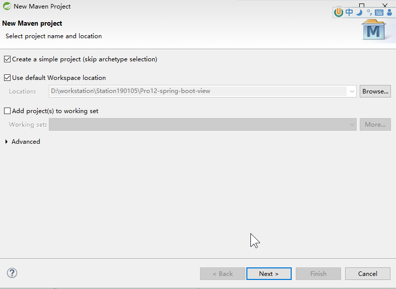
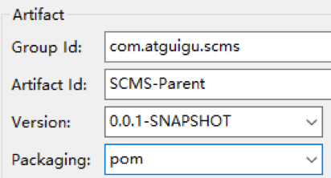
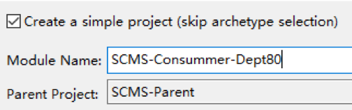
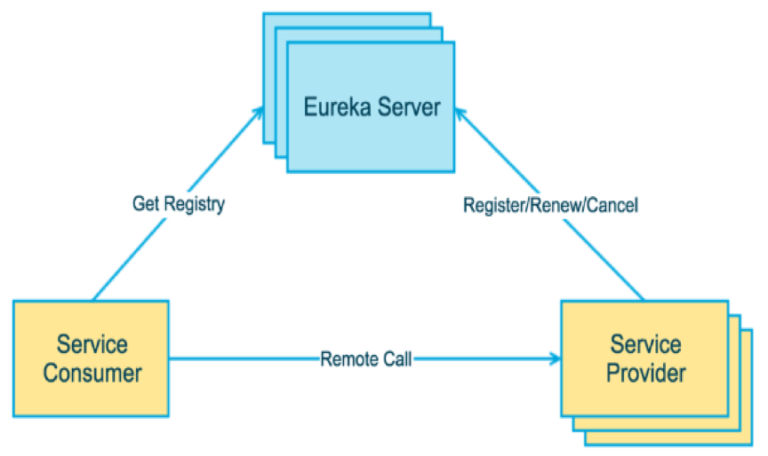
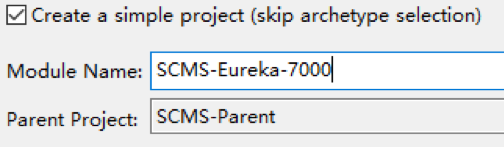
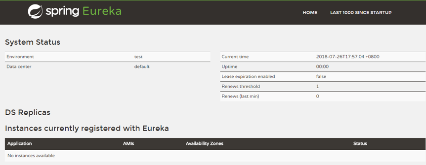
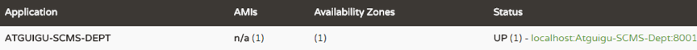
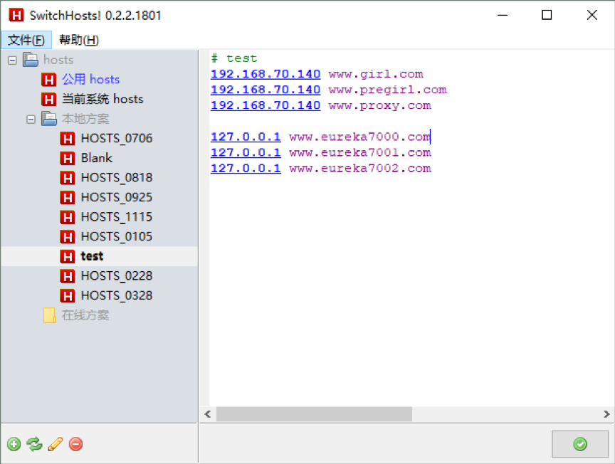
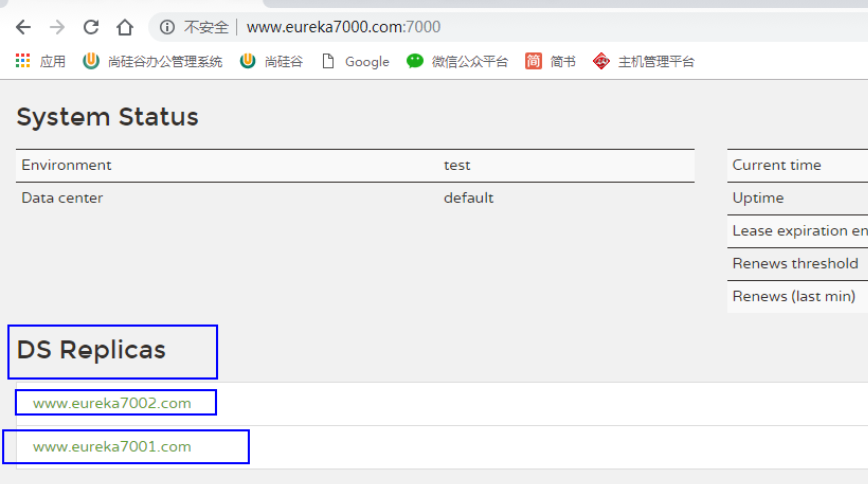
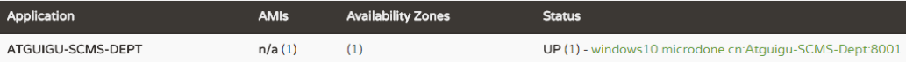

[toc]


# 一、SpringCloud测试基础

## 1、项目架构

[1]、简单约定  

为了项目名称不要太长，把SpringCloudMicroService缩写为SCMS。

[2]、工程名称

| SCMS-Parent            | 各个模块的聚合工程同时也是父工程 |
| ---------------------- | -------------------------------- |
| SCMS-API               | 公共API工程模块                  |
| SCMS-Provider-Dept8001 | 服务提供者，通过8001端口访问     |
| SCMS-Consummer-Dept80  | 服务消费者，通过80端口访问       |

[3]、 聚合、依赖、调用关系


## 2、SCMS-Parent创建过程

### [1]、创建Maven工程






### [2]、编辑pom.xml

```xml
<properties>
		<project.build.sourceEncoding>UTF-8</project.build.sourceEncoding>
		<maven.compiler.source>1.8</maven.compiler.source>
		<maven.compiler.target>1.8</maven.compiler.target>
		<junit.version>4.12</junit.version>
		<log4j.version>1.2.17</log4j.version>
	</properties>

	<dependencyManagement>
		<dependencies>
			<dependency>
				<groupId>org.springframework.cloud</groupId>
				<artifactId>spring-cloud-dependencies</artifactId>
				<version>Dalston.SR1</version>
				<type>pom</type>
				<scope>import</scope>
			</dependency>
			<dependency>
				<groupId>org.springframework.boot</groupId>
				<artifactId>spring-boot-dependencies</artifactId>
				<version>1.5.9.RELEASE</version>
				<type>pom</type>
				<scope>import</scope>
			</dependency>
			<dependency>
				<groupId>mysql</groupId>
				<artifactId>mysql-connector-java</artifactId>
				<version>5.0.4</version>
			</dependency>
			<dependency>
				<groupId>com.alibaba</groupId>
				<artifactId>druid</artifactId>
				<version>1.0.31</version>
			</dependency>
			<dependency>
				<groupId>org.mybatis.spring.boot</groupId>
				<artifactId>mybatis-spring-boot-starter</artifactId>
				<version>1.3.0</version>
			</dependency>
			<dependency>
				<groupId>ch.qos.logback</groupId>
				<artifactId>logback-core</artifactId>
				<version>1.2.3</version>
			</dependency>
			<dependency>
				<groupId>junit</groupId>
				<artifactId>junit</artifactId>
				<version>${junit.version}</version>
				<scope>test</scope>
			</dependency>
			<dependency>
				<groupId>log4j</groupId>
				<artifactId>log4j</artifactId>
				<version>${log4j.version}</version>
			</dependency>
		</dependencies>
	</dependencyManagement>
```

## 3、SCMS-API创建过程

### [1]、 创建Maven模块

在SCMS-Parent工程上点右键，然后new


### [2]、创建Dept实体类

  包名：com.atguigu.cloud.entities  

```java
public class Dept {
	
	private Integer deptNo;
	private String deptName;
	private String dbSource;//provider集群，区分从哪个数据库来的数据
	……
```

## 4、SCMS-Provider-Dept8001创建过程

### [1]、创建Maven模块  

在SCMS-Parent工程上点右键，然后new


### [2]、编辑pom.xml

```xml
<dependency>
    <groupId>mysql</groupId>
    <artifactId>mysql-connector-java</artifactId>
</dependency>
<dependency>
    <groupId>com.alibaba</groupId>
    <artifactId>druid</artifactId>
</dependency>
<dependency>
    <groupId>ch.qos.logback</groupId>
    <artifactId>logback-core</artifactId>
</dependency>
<dependency>
    <groupId>org.mybatis.spring.boot</groupId>
    <artifactId>mybatis-spring-boot-starter</artifactId>
</dependency>
<!-- 默认的容器时tomcat，jetty更加轻量级一些，适合开发测试-->
<dependency>
    <groupId>org.springframework.boot</groupId>
    <artifactId>spring-boot-starter-jetty</artifactId>
</dependency>
<dependency>
    <groupId>org.springframework.boot</groupId>
    <artifactId>spring-boot-starter-web</artifactId>
</dependency>
<dependency>
    <groupId>org.springframework.boot</groupId>
    <artifactId>spring-boot-starter-test</artifactId>
    <scope>test</scope>
</dependency>
<!-- 修改后立即生效，热部署  下面两个依赖  适合调试的时候-->
<dependency>
    <groupId>org.springframework</groupId>
    <artifactId>springloaded</artifactId>
</dependency>
<dependency>
    <groupId>org.springframework.boot</groupId>
    <artifactId>spring-boot-devtools</artifactId>
</dependency>
```

### [3]、依赖SCMS-API的操作过程


### [4]、创建数据库和数据库表

```sql
DROP DATABASE IF EXISTS `cloud_db_one`;
CREATE DATABASE `cloud_db_one` CHARACTER SET utf8 COLLATE utf8_bin;
USE cloud_db_one;
DROP TABLE IF EXISTS `dept`;
CREATE TABLE `dept` (
  `dept_no` int(11) NOT NULL AUTO_INCREMENT,
  `dept_name` varchar(500) DEFAULT NULL,
  `db_source` varchar(500) DEFAULT NULL,
  PRIMARY KEY (`dept_no`)
) ENGINE=InnoDB DEFAULT CHARSET=utf8;

-- ----------------------------
-- Records of dept
-- ----------------------------
INSERT INTO `dept` VALUES ('1', 'IT', DATABASE());
INSERT INTO `dept` VALUES ('2', 'HR', DATABASE());
INSERT INTO `dept` VALUES ('3', 'MIS', DATABASE());
INSERT INTO `dept` VALUES ('4', 'FUN', DATABASE());
INSERT INTO `dept` VALUES ('5', 'WM', DATABASE());
INSERT INTO `dept` VALUES ('6', 'EI', DATABASE());
INSERT INTO `dept` VALUES ('7', 'UU', DATABASE());
```

### [5]、整合MyBatis

#### (1)、 第一步：创建DeptMapper接口

包名：com.atguigu.springcloud.mapper

```java
package com.atguigu.springcloud.mapper;

import java.util.List;
import org.apache.ibatis.annotations.Mapper;
import com.atguigu.cloud.entities.Dept;
//作用类似于@Controller、@Service注解。另一种方法是主启动类上使用@MapperScan
@Mapper//千万记得加这个注解！！！扫描之后才能@Autowired
public interface DeptMapper {
	
	Dept findById(Integer deptNo);
	
	List<Dept> findAll();
	
	boolean addDept(Dept dept);
}
```

#### (2)、第二步：创建DeptMapper.xml


```xml
<?xml version="1.0" encoding="UTF-8" ?>
<!DOCTYPE mapper PUBLIC "-//mybatis.org//DTD Mapper 3.0//EN"
"http://mybatis.org/dtd/mybatis-3-mapper.dtd">

<mapper namespace="com.atguigu.springcloud.mapper.DeptMapper">

	<select id="findById" resultType="Dept" parameterType="Integer">
		select dept_no deptNo,dept_name deptName,db_source dbSource from dept where dept_no=#{deptNo};
	</select>
	<select id="findAll" resultType="Dept">
		select dept_no deptNo,dept_name deptName,db_source dbSource from dept;
	</select>
	<insert id="addDept" parameterType="Dept">
		INSERT INTO dept(dept_name,db_source) VALUES(#{deptName},DATABASE());
	</insert>

</mapper>
```

#### (3)、第三步：创建mybatis.cfg.xml


```xml
<?xml version="1.0" encoding="UTF-8" ?>
<!DOCTYPE configuration
  PUBLIC "-//mybatis.org//DTD Config 3.0//EN"
  "http://mybatis.org/dtd/mybatis-3-config.dtd">

<configuration>

	<settings>
		<setting name="cacheEnabled" value="true" />
	</settings>

</configuration>
```

#### (4)、第四步：创建application.yml


```yml
server:
  port: 8001
mybatis:
  config-location: classpath:mybatis/mybatis.cfg.xml  #mybatis总的配置文件
  type-aliases-package: com.atguigu.cloud.entities #DeptMapper.xml中省略的前缀
  mapper-locations:
  - classpath:mybatis/mapper/*Mapper.xml #以Mapper.xml结尾的文件
  
spring:
  application:
    name: Atguigu-SCMS-Dept #给当前的应用取一个名字，注册中心注册时候用的这个
  datasource:
    type: com.alibaba.druid.pool.DruidDataSource
    driver-class-name: org.gjt.mm.mysql.Driver
    url: jdbc:mysql://localhost:3306/cloud_db_one
    username: root
    password: root
    dbcp2:
      min-idle: 5
      initial-size: 5
      max-total: 5
      max-wait-millis: 200
```

spring.application.name配置的是这个微服务的名字，将来在注册中心中显示的和消费端引用的都是这个名字。

### [6]、Service层

#### (1)、接口

```java
package com.atguigu.springcloud.service;

import java.util.List;
import com.atguigu.cloud.entities.Dept;

public interface DeptService {
	Dept findById(Integer deptNo);

	List<Dept> findAll();

	boolean addDept(Dept dept);
}
```

#### (2)、实现类

```java
package com.atguigu.springcloud.service.impl;

import java.util.List;
import org.springframework.beans.factory.annotation.Autowired;
import org.springframework.stereotype.Service;
import com.atguigu.cloud.entities.Dept;
import com.atguigu.springcloud.mapper.DeptMapper;
import com.atguigu.springcloud.service.DeptService;

@Service
public class DeptServiceImpl implements DeptService {

	@Autowired
	private DeptMapper deptMapper;
	
	@Override
	public Dept findById(Integer deptNo) {
		return deptMapper.findById(deptNo);
	}

	@Override
	public List<Dept> findAll() {
		return deptMapper.findAll();
	}

	@Override
	public boolean addDept(Dept dept) {
		return deptMapper.addDept(dept);
	}

}
```

### [7]、Controller层

```java
package com.atguigu.springcloud.controller;

import java.util.List;

import org.springframework.beans.factory.annotation.Autowired;
import org.springframework.web.bind.annotation.PathVariable;
import org.springframework.web.bind.annotation.RequestBody;
import org.springframework.web.bind.annotation.RequestMapping;
import org.springframework.web.bind.annotation.RequestMethod;
import org.springframework.web.bind.annotation.RestController;

import com.atguigu.cloud.entities.Dept;
import com.atguigu.springcloud.service.DeptService;

@RestController//相当于@Controller+@ResponseBody
public class DeptController {
	
	@Autowired
	private DeptService deptService;
	
	@RequestMapping(value="/dept/add", method=RequestMethod.POST)
	public boolean add(@RequestBody Dept dept) {
		
		return deptService.addDept(dept);
	}
	
	@RequestMapping(value="/dept/get/{deptNo}", method=RequestMethod.GET)
	public Dept get(@PathVariable("deptNo") Integer deptNo) {
		return deptService.findById(deptNo);
	}
	
	@RequestMapping(value="/dept/get/all", method=RequestMethod.GET)
	public List<Dept> getAll() {
		return deptService.findAll();
	}

}
```

### [8]、主程序

```java
package com.atguigu.springcloud;

import org.springframework.boot.SpringApplication;
import org.springframework.boot.autoconfigure.SpringBootApplication;

@SpringBootApplication
public class SCMSProviderDept8001 {
	
	public static void main(String[] args) {
		SpringApplication.run(SCMSProviderDept8001.class, args);
	}

}
```

### [9]、测试

以Spring Boot App的方式运行工程

通过浏览器访问http://localhost:8001/dept/get/all

## 5、SCMS-Consummer-Dept80创建过程

### [1]、创建Maven模块

在SCMS-Parent工程上点右键，然后new





### [2]、编辑pom.xml

```xml
<dependency>
    <groupId>org.springframework.boot</groupId>
    <artifactId>spring-boot-starter-web</artifactId>
</dependency>
<!-- 下面两个 热部署-->
<dependency>
    <groupId>org.springframework</groupId>
    <artifactId>springloaded</artifactId>
</dependency>
<dependency>
    <groupId>org.springframework.boot</groupId>
    <artifactId>spring-boot-devtools</artifactId>
</dependency>
<dependency>
    <groupId>com.atguigu.scms</groupId>
    <artifactId>SCMS-API</artifactId>
    <version>0.0.1-SNAPSHOT</version>
</dependency>
```

### [3]、创建application.yml


```yaml
server:
  port: 80
```

### [4]、创建ConfigBean类

```java
package com.atguigu.cloud.config.beans;

import org.springframework.context.annotation.Bean;
import org.springframework.context.annotation.Configuration;
import org.springframework.web.client.RestTemplate;

@Configuration
public class ConfigBean {
	
	@Bean
	public RestTemplate getRestTemplate() {
		return new RestTemplate();
	}

}
```

相当于

```xml
<bean id="restTemplate" class="org.springframework.web.client.RestTemplate"/>
```

### [5]、创建DeptControllerConsummer类

```java
package com.atguigu.cloud.controller;

import java.util.List;

import org.springframework.beans.factory.annotation.Autowired;
import org.springframework.web.bind.annotation.PathVariable;
import org.springframework.web.bind.annotation.RequestMapping;
import org.springframework.web.bind.annotation.RestController;
import org.springframework.web.client.RestTemplate;

import com.atguigu.cloud.entities.Dept;

@RestController
public class DeptControllerConsummer {
	
	private static final String REST_URL_PREFIX = "http://localhost:8001";
	
	@Autowired
	private RestTemplate restTemplate;
	
	@RequestMapping("/consummer/dept/add")
	public boolean add(Dept dept) {
		return restTemplate.postForObject(REST_URL_PREFIX+"/dept/add", dept, Boolean.class);
	}
	
	@RequestMapping("/consummer/dept/get/{deptNo}")
	public Dept get(@PathVariable("deptNo") Integer deptNo) {
		return restTemplate.getForObject(REST_URL_PREFIX+"/dept/get/"+deptNo, Dept.class);
	}
	
	@SuppressWarnings("unchecked")
	@RequestMapping("/consummer/dept/get/all")
	public List<Dept> getAll() {
		return restTemplate.getForObject(REST_URL_PREFIX+"/dept/get/all", List.class);
	}

}
```

### [6]、主程序

```java
package com.atguigu.springcloud;

import org.springframework.boot.SpringApplication;
import org.springframework.boot.autoconfigure.SpringBootApplication;

@SpringBootApplication
public class SCMSConsummerDept80 {
	
	public static void main(String[] args) {
		SpringApplication.run(SCMSConsummerDept80.class, args);
	}

}
```

### [7]、测试

以Spring Boot App方式运行程序

访问http://localhost/consummer/dept/get/all


## 6、遗留问题

Consummer通过http://localhost:8001来访问Provider中提供的服务需要知道IP地址和端口号，但是Provider微服务是有名字的，如果能够通过名字代替IP地址和端口号就能够简单很多，该如何做到呢？

我们下面要学习的Eureka注册中心可以解决这个问题。


# 二、**SpringCloud**单机版Eureka

## 1、简介

Eureka相当于我们熟悉的Zookeeper，用来注册我们的微服务。



## 2、创建SCMS-Eureka-7000工程模块

### [1]、创建Maven模块




### [2]、编辑pom.xml

```xml
<!-- eureka-server服务端 -->
<dependency>
	<groupId>org.springframework.cloud</groupId>
	<artifactId>spring-cloud-starter-eureka-server</artifactId>
</dependency>
<!-- 修改后立即生效，热部署 -->
<dependency>
	<groupId>org.springframework</groupId>
	<artifactId>springloaded</artifactId>
</dependency>
<dependency>
	<groupId>org.springframework.boot</groupId>
	<artifactId>spring-boot-devtools</artifactId>
</dependency>
```

### [3]、创建application.yml

```yaml
server:
  port: 7000
eureka:
  instance:
    hostname: localhost #eureka服务端的实例名称
  client:
    register-with-eureka: false #false表示不向注册中心注册自己。
    fetch-registry: false       #false表示自己端就是注册中心，我的职责就是维护服务实例，并不需要去检索服务
    service-url:
      defaultZone: http://${eureka.instance.hostname}:${server.port}/eureka/ #指定客户端访问Eureka服务端的URL地址
```

### [4]、主程序

```java
@SpringBootApplication
@EnableEurekaServer //把当前微服务标记为Eureka注册中心，接受其他微服务的注册
public class SpringCloudEurekaApp {
	
	public static void main(String[] args) {
		SpringApplication.run(SpringCloudEurekaApp.class, args);
	}

}
```

### [5]、测试

以Spring Boot App方式运行工程

访问http://localhost:7000



## 3、将SCMS-Provider-Dept8001注册进Eureka

### [1]、编辑pom.xml

```xml
<!-- eureka-server客户端 -->		
<dependency>
    <groupId>org.springframework.cloud</groupId>
    <artifactId>spring-cloud-starter-eureka</artifactId>
</dependency>
<dependency>
    <groupId>org.springframework.cloud</groupId>
    <artifactId>spring-cloud-starter-config</artifactId>
</dependency>
```

### [2]、编辑application.yml

```yaml
eureka:
  client:
    service-url:
      defaultZone: http://localhost:7000/eureka
```

参照：defaultZone: http://**${eureka.instance.hostname}**:**${server.port}**/eureka/

### [3]、修改SCMS-Provider-Dept8001主程序

```java
@SpringBootApplication
@EnableEurekaClient //该微服务将参照application.yml中的配置注册到Eureka
public class SCMSProviderDept8001 {
	
	public static void main(String[] args) {
		SpringApplication.run(SCMSProviderDept8001.class, args);
	}

}
```

### [4]、测试

在Eureka微服务已经启动的前提下，启动SCMS-Provider-Dept8001。



## 4、在SCMS-Consummer-Dept80中通过Eureka中注册的服务器名访问微服务  

### [1]、编辑pom.xml

```xml
<dependency>
    <groupId>org.springframework.cloud</groupId>
    <artifactId>spring-cloud-starter-eureka</artifactId>
</dependency>
<dependency>
    <groupId>org.springframework.cloud</groupId>
    <artifactId>spring-cloud-starter-ribbon</artifactId>
</dependency>
<dependency>
    <groupId>org.springframework.cloud</groupId>
    <artifactId>spring-cloud-starter-config</artifactId>
</dependency>
```

### [2]、编辑application.yml  

```yaml
eureka:
  client:
    register-with-eureka: false #当前是微服务的调用端、消费端，不进行注册
    service-url: 
      defaultZone: http://localhost:7000/eureka
```

### [3]、修改SCMS-Consummer-Dept80主程序

```java
@SpringBootApplication
@EnableEurekaClient //添加此注解
public class SCMSConsummer80 {
	
	public static void main(String[] args) {
		SpringApplication.run(SCMSConsummer80.class, args);
	}

}
```

### [4]、修改ConfigBean

```java
@Configuration
public class ConfigBean {
	
	@Bean
	@LoadBalanced //添加此注解
	public RestTemplate getRestTemplate() {
		return new RestTemplate();
	}

}
```

这里其实已经用到了Ribbon，这是SpringCloud技术栈中的负载均衡工具，后面会讲到，现在你先知道Eureka需要和Ribbon配合起来才能实现服务名替代效果。

### [5]、用微服务名替代IP地址加端口号

```java
//private static final String REST_URL_PREFIX = "http://localhost:8001";
private static final String REST_URL_PREFIX = "http://ATGUIGU-SCMS-DEPT";
```


# 三、SpringCloud集群版Eureka

## 1、集群方案

SCMS-Eureka-7000

​	通过域名www.eureka7000.com访问

SCMS-Eureka-7001

​	通过域名www.eureka7001.com访问

SCMS-Eureka-7002

​	通过域名www.eureka7002.com访问

## 2、操作步骤

### [1]、配置域名



### [2]、创建SCMS-Eureka-7001和SCMS-Eureka-7002工程

类似于创建SCMS-Eureka-7000（二、2）

### [3]、编辑pom.xml  

```xml
<!--eureka-server服务端 -->
<dependency>
    <groupId>org.springframework.cloud</groupId>
    <artifactId>spring-cloud-starter-eureka-server</artifactId>
</dependency>
<!-- 修改后立即生效，热部署 -->
<dependency>
    <groupId>org.springframework</groupId>
    <artifactId>springloaded</artifactId>
</dependency>
<dependency>
    <groupId>org.springframework.boot</groupId>
    <artifactId>spring-boot-devtools</artifactId>
</dependency>
```

### [4]、编辑application.yml

(1)、7000

```yaml
server:
  port: 7000
eureka:
  instance:
    hostname: localhost #eureka服务端的实例名称
  client:
    register-with-eureka: false #false表示不向注册中心注册自己。
    fetch-registry: false       #false表示自己端就是注册中心，我的职责就是维护服务实例，并不需要去检索服务
    service-url:
      defaultZone: http://www.eureka7001.com:7001/eureka/,http://www.eureka7002.com:7002/eureka/ #指定客户端访问Eureka服务端的URL地址
```

(2)、7001

​	配置7000和7002的地址

(3)、7002

​	配置7000和7001的地址

### [5]、测试

分别以Spring Boot App方式运行三个工程，访问其中一个

http://www.eureka7000.com:7000/



显示了另外两个集群的

## 3、 访问集群

### [1]、编辑SCMS-Provider-Dept8001的yml文件

```yaml
defaultZone: http://www.eureka7000.com:7000/eureka,http://www.eureka7001.com:7001/eureka,http://www.eureka7002.com:7002/eureka
```

### [2]、启动SCMS-Provider-Dept8001

### [3]、查看服务注册情况



### [4]、编辑SCMS-Consummer-Dept80的yml文件

```yaml
defaultZone: http://www.eureka7000.com:7000/eureka,http://www.eureka7001.com:7001/eureka,http://www.eureka7002.com:7002/eureka
```

