[toc]


# 一、SpringCloud测试基础

## 1、项目架构

(1)、简单约定  

为了项目名称不要太长，把SpringCloudMicroService缩写为SCMS。

(2]、工程名称

| SCMS-Parent            | 各个模块的聚合工程同时也是父工程 |
| ---------------------- | -------------------------------- |
| SCMS-API               | 公共API工程模块                  |
| SCMS-Provider-Dept8001 | 服务提供者，通过8001端口访问     |
| SCMS-Consummer-Dept80  | 服务消费者，通过80端口访问       |

(3)、 聚合、依赖、调用关系

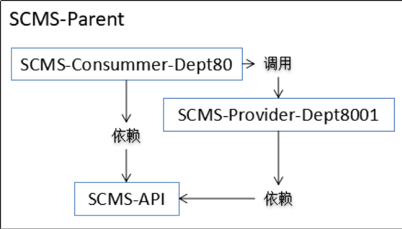

## 2、SCMS-Parent创建过程

### (1)、创建Maven工程


### (2)、编辑pom.xml

```xml
<properties>
    <project.build.sourceEncoding>UTF-8</project.build.sourceEncoding>
    <maven.compiler.source>1.8</maven.compiler.source>
    <maven.compiler.target>1.8</maven.compiler.target>
    <junit.version>4.12</junit.version>
    <log4j.version>1.2.17</log4j.version>
</properties>

<dependencyManagement>
    <dependencies>
        <dependency>
            <groupId>org.springframework.cloud</groupId>
            <artifactId>spring-cloud-dependencies</artifactId>
            <version>Dalston.SR1</version>
            <type>pom</type>
            <scope>import</scope>
        </dependency>
        <dependency>
            <groupId>org.springframework.boot</groupId>
            <artifactId>spring-boot-dependencies</artifactId>
            <version>1.5.9.RELEASE</version>
            <type>pom</type>
            <scope>import</scope>
        </dependency>
        <dependency>
            <groupId>mysql</groupId>
            <artifactId>mysql-connector-java</artifactId>
            <version>5.0.4</version>
        </dependency>
        <dependency>
            <groupId>com.alibaba</groupId>
            <artifactId>druid</artifactId>
            <version>1.0.31</version>
        </dependency>
        <dependency>
            <groupId>org.mybatis.spring.boot</groupId>
            <artifactId>mybatis-spring-boot-starter</artifactId>
            <version>1.3.0</version>
        </dependency>
        <dependency>
            <groupId>ch.qos.logback</groupId>
            <artifactId>logback-core</artifactId>
            <version>1.2.3</version>
        </dependency>
        <dependency>
            <groupId>junit</groupId>
            <artifactId>junit</artifactId>
            <version>${junit.version}</version>
            <scope>test</scope>
        </dependency>
        <dependency>
            <groupId>log4j</groupId>
            <artifactId>log4j</artifactId>
            <version>${log4j.version}</version>
        </dependency>
    </dependencies>
</dependencyManagement>
```

## 3、SCMS-API创建过程

### (1)、 创建Maven模块

在SCMS-Parent工程上点右键，然后new


### (2)、创建Dept实体类

  包名：com.atguigu.cloud.entities  

```java
public class Dept {
	
	private Integer deptNo;
	private String deptName;
	private String dbSource;//provider集群，区分从哪个数据库来的数据
	……
```

## 4、SCMS-Provider-Dept8001创建过程

### (1)、创建Maven模块  

在SCMS-Parent工程上点右键，然后new


### (2)、编辑pom.xml

```xml
<dependency>
    <groupId>mysql</groupId>
    <artifactId>mysql-connector-java</artifactId>
</dependency>
<dependency>
    <groupId>com.alibaba</groupId>
    <artifactId>druid</artifactId>
</dependency>
<dependency>
    <groupId>ch.qos.logback</groupId>
    <artifactId>logback-core</artifactId>
</dependency>
<dependency>
    <groupId>org.mybatis.spring.boot</groupId>
    <artifactId>mybatis-spring-boot-starter</artifactId>
</dependency>
<!-- 默认的容器时tomcat，jetty更加轻量级一些，适合开发测试-->
<dependency>
    <groupId>org.springframework.boot</groupId>
    <artifactId>spring-boot-starter-jetty</artifactId>
</dependency>
<dependency>
    <groupId>org.springframework.boot</groupId>
    <artifactId>spring-boot-starter-web</artifactId>
</dependency>
<dependency>
    <groupId>org.springframework.boot</groupId>
    <artifactId>spring-boot-starter-test</artifactId>
    <scope>test</scope>
</dependency>
<!-- 修改后立即生效，热部署  下面两个依赖  适合调试的时候-->
<dependency>
    <groupId>org.springframework</groupId>
    <artifactId>springloaded</artifactId>
</dependency>
<dependency>
    <groupId>org.springframework.boot</groupId>
    <artifactId>spring-boot-devtools</artifactId>
</dependency>
```

### (3)、依赖SCMS-API的操作过程


### (4)、创建数据库和数据库表

```sql
DROP DATABASE IF EXISTS `cloud_db_one`;
CREATE DATABASE `cloud_db_one` CHARACTER SET utf8 COLLATE utf8_bin;
USE cloud_db_one;
DROP TABLE IF EXISTS `dept`;
CREATE TABLE `dept` (
  `dept_no` int(11) NOT NULL AUTO_INCREMENT,
  `dept_name` varchar(500) DEFAULT NULL,
  `db_source` varchar(500) DEFAULT NULL,
  PRIMARY KEY (`dept_no`)
) ENGINE=InnoDB DEFAULT CHARSET=utf8;

-- ----------------------------
-- Records of dept
-- ----------------------------
INSERT INTO `dept` VALUES ('1', 'IT', DATABASE());
INSERT INTO `dept` VALUES ('2', 'HR', DATABASE());
INSERT INTO `dept` VALUES ('3', 'MIS', DATABASE());
INSERT INTO `dept` VALUES ('4', 'FUN', DATABASE());
INSERT INTO `dept` VALUES ('5', 'WM', DATABASE());
INSERT INTO `dept` VALUES ('6', 'EI', DATABASE());
INSERT INTO `dept` VALUES ('7', 'UU', DATABASE());
```

### (5)、整合MyBatis

#### [1]、 第一步：创建DeptMapper接口

包名：com.atguigu.springcloud.mapper

```java
package com.atguigu.springcloud.mapper;

import java.util.List;
import org.apache.ibatis.annotations.Mapper;
import com.atguigu.cloud.entities.Dept;
//作用类似于@Controller、@Service注解。另一种方法是主启动类上使用@MapperScan
@Mapper//千万记得加这个注解！！！扫描之后才能@Autowired
public interface DeptMapper {
	
	Dept findById(Integer deptNo);
	
	List<Dept> findAll();
	
	boolean addDept(Dept dept);
}
```

#### [2]、第二步：创建DeptMapper.xml


```xml
<?xml version="1.0" encoding="UTF-8" ?>
<!DOCTYPE mapper PUBLIC "-//mybatis.org//DTD Mapper 3.0//EN"
"http://mybatis.org/dtd/mybatis-3-mapper.dtd">

<mapper namespace="com.atguigu.springcloud.mapper.DeptMapper">

	<select id="findById" resultType="Dept" parameterType="Integer">
		select dept_no deptNo,dept_name deptName,db_source dbSource from dept where dept_no=#{deptNo};
	</select>
	<select id="findAll" resultType="Dept">
		select dept_no deptNo,dept_name deptName,db_source dbSource from dept;
	</select>
	<insert id="addDept" parameterType="Dept">
		INSERT INTO dept(dept_name,db_source) VALUES(#{deptName},DATABASE());
	</insert>

</mapper>
```

#### [3]、第三步：创建mybatis.cfg.xml

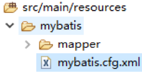

```xml
<?xml version="1.0" encoding="UTF-8" ?>
<!DOCTYPE configuration
  PUBLIC "-//mybatis.org//DTD Config 3.0//EN"
  "http://mybatis.org/dtd/mybatis-3-config.dtd">

<configuration>

	<settings>
		<setting name="cacheEnabled" value="true" />
	</settings>

</configuration>
```

#### [4]、第四步：创建application.yml

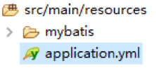

```yml
server:
  port: 8001
mybatis:
  config-location: classpath:mybatis/mybatis.cfg.xml  #mybatis总的配置文件
  type-aliases-package: com.atguigu.cloud.entities #DeptMapper.xml中省略的前缀
  mapper-locations:
  - classpath:mybatis/mapper/*Mapper.xml #以Mapper.xml结尾的文件
  
spring:
  application:
    name: Atguigu-SCMS-Dept #给当前的应用取一个名字，注册中心注册时候用的这个
  datasource:
    type: com.alibaba.druid.pool.DruidDataSource
    driver-class-name: org.gjt.mm.mysql.Driver
    url: jdbc:mysql://localhost:3306/cloud_db_one
    username: root
    password: root
    dbcp2:
      min-idle: 5
      initial-size: 5
      max-total: 5
      max-wait-millis: 200
```

spring.application.name配置的是这个微服务的名字，将来在注册中心中显示的和消费端引用的都是这个名字。

### (6)、Service层

#### [1]、接口

```java
package com.atguigu.springcloud.service;

import java.util.List;
import com.atguigu.cloud.entities.Dept;

public interface DeptService {
	Dept findById(Integer deptNo);

	List<Dept> findAll();

	boolean addDept(Dept dept);
}
```

#### [2]、实现类

```java
package com.atguigu.springcloud.service.impl;

import java.util.List;
import org.springframework.beans.factory.annotation.Autowired;
import org.springframework.stereotype.Service;
import com.atguigu.cloud.entities.Dept;
import com.atguigu.springcloud.mapper.DeptMapper;
import com.atguigu.springcloud.service.DeptService;

@Service
public class DeptServiceImpl implements DeptService {

	@Autowired
	private DeptMapper deptMapper;
	
	@Override
	public Dept findById(Integer deptNo) {
		return deptMapper.findById(deptNo);
	}

	@Override
	public List<Dept> findAll() {
		return deptMapper.findAll();
	}

	@Override
	public boolean addDept(Dept dept) {
		return deptMapper.addDept(dept);
	}

}
```

### (7)、Controller层

```java
package com.atguigu.springcloud.controller;

import java.util.List;

import org.springframework.beans.factory.annotation.Autowired;
import org.springframework.web.bind.annotation.PathVariable;
import org.springframework.web.bind.annotation.RequestBody;
import org.springframework.web.bind.annotation.RequestMapping;
import org.springframework.web.bind.annotation.RequestMethod;
import org.springframework.web.bind.annotation.RestController;

import com.atguigu.cloud.entities.Dept;
import com.atguigu.springcloud.service.DeptService;

@RestController//相当于@Controller+@ResponseBody
public class DeptController {
	
	@Autowired
	private DeptService deptService;
	
	@RequestMapping(value="/dept/add", method=RequestMethod.POST)
	public boolean add(@RequestBody Dept dept) {
		return deptService.addDept(dept);
	}
	
	@RequestMapping(value="/dept/get/{deptNo}", method=RequestMethod.GET)
	public Dept get(@PathVariable("deptNo") Integer deptNo) {
		return deptService.findById(deptNo);
	}
	
	@RequestMapping(value="/dept/get/all", method=RequestMethod.GET)
	public List<Dept> getAll() {
		return deptService.findAll();
	}

}
```

### (8)、主程序

```java
package com.atguigu.springcloud;

import org.springframework.boot.SpringApplication;
import org.springframework.boot.autoconfigure.SpringBootApplication;

@SpringBootApplication
public class SCMSProviderDept8001 {
	
	public static void main(String[] args) {
		SpringApplication.run(SCMSProviderDept8001.class, args);
	}

}
```

### (9)、测试

以Spring Boot App的方式运行工程

通过浏览器访问http://localhost:8001/dept/get/all

## 5、SCMS-Consummer-Dept80创建过程

### (1)、创建Maven模块

在SCMS-Parent工程上点右键，然后new


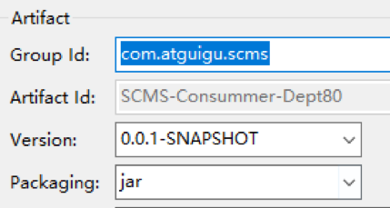

### (2)、编辑pom.xml

```xml
<dependency>
    <groupId>org.springframework.boot</groupId>
    <artifactId>spring-boot-starter-web</artifactId>
</dependency>
<!-- 下面两个 热部署-->
<dependency>
    <groupId>org.springframework</groupId>
    <artifactId>springloaded</artifactId>
</dependency>
<dependency>
    <groupId>org.springframework.boot</groupId>
    <artifactId>spring-boot-devtools</artifactId>
</dependency>
<dependency>
    <groupId>com.atguigu.scms</groupId>
    <artifactId>SCMS-API</artifactId>
    <version>0.0.1-SNAPSHOT</version>
</dependency>
```

### (3)、创建application.yml

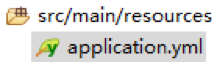

```yaml
server:
  port: 80
```

### (4)、创建ConfigBean类

```java
package com.atguigu.cloud.config.beans;

import org.springframework.context.annotation.Bean;
import org.springframework.context.annotation.Configuration;
import org.springframework.web.client.RestTemplate;

@Configuration
public class ConfigBean {
	
	@Bean
	public RestTemplate getRestTemplate() {
		return new RestTemplate();
	}

}
```

相当于

```xml
<bean id="restTemplate" class="org.springframework.web.client.RestTemplate"/>
```

### (5)、创建DeptControllerConsummer类

```java
package com.atguigu.cloud.controller;

import java.util.List;

import org.springframework.beans.factory.annotation.Autowired;
import org.springframework.web.bind.annotation.PathVariable;
import org.springframework.web.bind.annotation.RequestMapping;
import org.springframework.web.bind.annotation.RestController;
import org.springframework.web.client.RestTemplate;

import com.atguigu.cloud.entities.Dept;

@RestController
public class DeptControllerConsummer {
	
	private static final String REST_URL_PREFIX = "http://localhost:8001";
	
	@Autowired
	private RestTemplate restTemplate;
	
	@RequestMapping("/consummer/dept/add")
	public boolean add(Dept dept) {
		return restTemplate.postForObject(REST_URL_PREFIX+"/dept/add", dept, Boolean.class);
	}
	
	@RequestMapping("/consummer/dept/get/{deptNo}")
	public Dept get(@PathVariable("deptNo") Integer deptNo) {
		return restTemplate.getForObject(REST_URL_PREFIX+"/dept/get/"+deptNo, Dept.class);
	}
	
	@SuppressWarnings("unchecked")
	@RequestMapping("/consummer/dept/get/all")
	public List<Dept> getAll() {
		return restTemplate.getForObject(REST_URL_PREFIX+"/dept/get/all", List.class);
	}

}
```

### (6)、主程序

```java
package com.atguigu.springcloud;

import org.springframework.boot.SpringApplication;
import org.springframework.boot.autoconfigure.SpringBootApplication;

@SpringBootApplication
public class SCMSConsummerDept80 {
	
	public static void main(String[] args) {
		SpringApplication.run(SCMSConsummerDept80.class, args);
	}

}
```

### (7)、测试

以Spring Boot App方式运行程序

访问http://localhost/consummer/dept/get/all

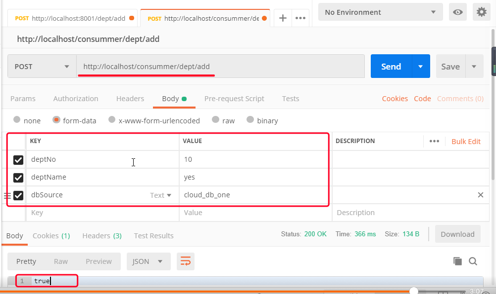

## 6、遗留问题

Consummer通过http://localhost:8001来访问Provider中提供的服务需要知道IP地址和端口号，但是Provider微服务是有名字的，如果能够通过名字代替IP地址和端口号就能够简单很多，该如何做到呢？

我们下面要学习的Eureka注册中心可以解决这个问题。


# 二、SpringCloud单机版Eureka

## 1、简介

Eureka相当于我们熟悉的Zookeeper，用来注册我们的微服务。


## 2、创建SCMS-Eureka-7000工程模块

### (1)、创建Maven模块


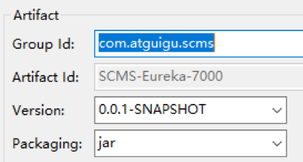

### (2)、编辑pom.xml

```xml
<!-- eureka-server服务端 -->
<dependency>
	<groupId>org.springframework.cloud</groupId>
	<artifactId>spring-cloud-starter-eureka-server</artifactId>
</dependency>
<!-- 修改后立即生效，热部署 -->
<dependency>
	<groupId>org.springframework</groupId>
	<artifactId>springloaded</artifactId>
</dependency>
<dependency>
	<groupId>org.springframework.boot</groupId>
	<artifactId>spring-boot-devtools</artifactId>
</dependency>
```

### (3)、创建application.yml

```yaml
server:
  port: 7000
eureka:
  instance:
    hostname: localhost #eureka服务端的实例名称
  client:
    register-with-eureka: false #false表示不向注册中心注册自己。
    fetch-registry: false  #false表示自己端就是注册中心，我的职责就是维护服务实例，并不需要去检索服务
    service-url:
      defaultZone: http://${eureka.instance.hostname}:${server.port}/eureka/ #指定客户端访问Eureka服务端的URL地址
```

### (4)、主程序

```java
@SpringBootApplication
@EnableEurekaServer //把当前微服务标记为Eureka注册中心，接受其他微服务的注册
public class SpringCloudEurekaApp {
	
	public static void main(String[] args) {
		SpringApplication.run(SpringCloudEurekaApp.class, args);
	}

}
```

### (5)、测试

以Spring Boot App方式运行工程

访问http://localhost:7000


## 3、将SCMS-Provider-Dept8001注册进Eureka

### (1)、编辑pom.xml

```xml
<!-- eureka-server客户端 -->		
<dependency>
    <groupId>org.springframework.cloud</groupId>
    <artifactId>spring-cloud-starter-eureka</artifactId>
</dependency>
<dependency>
    <groupId>org.springframework.cloud</groupId>
    <artifactId>spring-cloud-starter-config</artifactId>
</dependency>
```

### (2)、编辑application.yml

```yaml
eureka:
  client:
    service-url:
      defaultZone: http://localhost:7000/eureka
```

参照：defaultZone: http://**${eureka.instance.hostname}**:**${server.port}**/eureka/

### (3)、修改SCMS-Provider-Dept8001主程序

```java
@SpringBootApplication
@EnableEurekaClient //该微服务将参照application.yml中的配置注册到Eureka
public class SCMSProviderDept8001 {
	
	public static void main(String[] args) {
		SpringApplication.run(SCMSProviderDept8001.class, args);
	}

}
```

### (4)、测试

在Eureka微服务已经启动的前提下，启动SCMS-Provider-Dept8001。


## 4、在SCMS-Consummer-Dept80中通过Eureka中注册的服务器名访问微服务  

### (1)、编辑pom.xml

```xml
<dependency>
    <groupId>org.springframework.cloud</groupId>
    <artifactId>spring-cloud-starter-eureka</artifactId>
</dependency>
<dependency>
    <groupId>org.springframework.cloud</groupId>
    <artifactId>spring-cloud-starter-ribbon</artifactId>
</dependency>
<dependency>
    <groupId>org.springframework.cloud</groupId>
    <artifactId>spring-cloud-starter-config</artifactId>
</dependency>
```

### (2)、编辑application.yml  

```yaml
eureka:
  client:
    register-with-eureka: false #当前是微服务的调用端、消费端，不进行注册
    service-url: 
      defaultZone: http://localhost:7000/eureka
```

### (3)、修改SCMS-Consummer-Dept80主程序

```java
@SpringBootApplication
@EnableEurekaClient //添加此注解
public class SCMSConsummer80 {
	
	public static void main(String[] args) {
		SpringApplication.run(SCMSConsummer80.class, args);
	}

}
```

### (4)、修改ConfigBean

```java
@Configuration
public class ConfigBean {
	
	@Bean
	@LoadBalanced //添加此注解  启用Ribbon的负载均衡功能
	public RestTemplate getRestTemplate() {
		return new RestTemplate();
	}

}
```

这里其实已经用到了Ribbon，这是SpringCloud技术栈中的负载均衡工具，后面会讲到，现在你先知道Eureka需要和Ribbon配合起来才能实现服务名替代效果。

### (5)、用微服务名替代IP地址加端口号

在DeptControllerConsummer类中

```java
//private static final String REST_URL_PREFIX = "http://localhost:8001";
private static final String REST_URL_PREFIX = "http://ATGUIGU-SCMS-DEPT";
```


# 三、SpringCloud集群版Eureka

## 1、集群方案

SCMS-Eureka-7000

​	通过域名www.eureka7000.com访问

SCMS-Eureka-7001

​	通过域名www.eureka7001.com访问

SCMS-Eureka-7002

​	通过域名www.eureka7002.com访问

## 2、操作步骤

### (1)、配置域名


### (2)、创建SCMS-Eureka-7001和SCMS-Eureka-7002工程

类似于创建SCMS-Eureka-7000（二、2）

### (3)、编辑pom.xml  

```xml
<!--eureka-server服务端 -->
<dependency>
    <groupId>org.springframework.cloud</groupId>
    <artifactId>spring-cloud-starter-eureka-server</artifactId>
</dependency>
<!-- 修改后立即生效，热部署 -->
<dependency>
    <groupId>org.springframework</groupId>
    <artifactId>springloaded</artifactId>
</dependency>
<dependency>
    <groupId>org.springframework.boot</groupId>
    <artifactId>spring-boot-devtools</artifactId>
</dependency>
```

### (4)、编辑application.yml

[1]、7000

```yaml
server:
  port: 7000
eureka:
  instance:
    hostname: localhost #eureka服务端的实例名称
  client:
    register-with-eureka: false #false表示不向注册中心注册自己。
    fetch-registry: false       #false表示自己端就是注册中心，我的职责就是维护服务实例，并不需要去检索服务
    service-url:
      defaultZone: http://www.eureka7001.com:7001/eureka/,http://www.eureka7002.com:7002/eureka/ #指定客户端访问Eureka服务端的URL地址
```

[2]、7001

​	配置7000和7002的地址

[3]、7002

​	配置7000和7001的地址

### (5)、测试

分别以Spring Boot App方式运行三个工程，访问其中一个

http://www.eureka7000.com:7000/


显示了另外两个集群的

## 3、 访问集群

### (1)、编辑SCMS-Provider-Dept8001的yml文件

```yaml
defaultZone: http://www.eureka7000.com:7000/eureka,http://www.eureka7001.com:7001/eureka,http://www.eureka7002.com:7002/eureka
```

### (2)、启动SCMS-Provider-Dept8001

### (3)、查看服务注册情况


### (4)、编辑SCMS-Consummer-Dept80的yml文件

```yaml
defaultZone: http://www.eureka7000.com:7000/eureka,http://www.eureka7001.com:7001/eureka,http://www.eureka7002.com:7002/eureka
```


# 四、SpringCloud Ribbon

## 1、简介

SpringCloud技术栈中的Nginx。但是Ribbon和Nginx有一个重大区别：==Ribbon是一个**客户端**负载均衡解决方案==。

按照我们前面例子的架构组成，Ribbon需要配置在SCMS-Consummer-Dept80工程中（其实我们已经配置好了）。

Ribbon在工作时分成两步：

第一步：先确定Eureka集群中的一个EurekaServer，它优先选择在同一个区域内负载较少的。

第二步：再根据用户指定的策略，在从EurekaServer取到的服务注册列表中选择一个微服务地址。

Ribbon提供了多种负载均衡策略：比如轮询、随机和根据响应时间加权。

## 2、搭建Provider集群

### (1)、创建另外两个数据库

```sql
DROP DATABASE IF EXISTS `cloud_db_two`;
CREATE DATABASE `cloud_db_two` CHARACTER SET utf8 COLLATE utf8_bin;
USE cloud_db_two;
DROP TABLE IF EXISTS `dept`;
CREATE TABLE `dept` (
  `dept_no` int(11) NOT NULL AUTO_INCREMENT,
  `dept_name` varchar(500) DEFAULT NULL,
  `db_source` varchar(500) DEFAULT NULL,
  PRIMARY KEY (`dept_no`)
) ENGINE=InnoDB AUTO_INCREMENT=8 DEFAULT CHARSET=utf8;

-- ----------------------------
-- Records of dept
-- ----------------------------
INSERT INTO `dept` VALUES ('1', 'IT', DATABASE());
INSERT INTO `dept` VALUES ('2', 'HR', DATABASE());
INSERT INTO `dept` VALUES ('3', 'MIS', DATABASE());
INSERT INTO `dept` VALUES ('4', 'FUN', DATABASE());
INSERT INTO `dept` VALUES ('5', 'WM', DATABASE());
INSERT INTO `dept` VALUES ('6', 'EI', DATABASE());
INSERT INTO `dept` VALUES ('7', 'UU', DATABASE());
```

```sql
DROP DATABASE IF EXISTS `cloud_db_three`;
CREATE DATABASE `cloud_db_three` CHARACTER SET utf8 COLLATE utf8_bin;
USE cloud_db_three;
DROP TABLE IF EXISTS `dept`;
CREATE TABLE `dept` (
  `dept_no` int(11) NOT NULL AUTO_INCREMENT,
  `dept_name` varchar(500) DEFAULT NULL,
  `db_source` varchar(500) DEFAULT NULL,
  PRIMARY KEY (`dept_no`)
) ENGINE=InnoDB AUTO_INCREMENT=8 DEFAULT CHARSET=utf8;

-- ----------------------------
-- Records of dept
-- ----------------------------
INSERT INTO `dept` VALUES ('1', 'IT', DATABASE());
INSERT INTO `dept` VALUES ('2', 'HR', DATABASE());
INSERT INTO `dept` VALUES ('3', 'MIS', DATABASE());
INSERT INTO `dept` VALUES ('4', 'FUN', DATABASE());
INSERT INTO `dept` VALUES ('5', 'WM', DATABASE());
INSERT INTO `dept` VALUES ('6', 'EI', DATABASE());
INSERT INTO `dept` VALUES ('7', 'UU', DATABASE());
```

### (2)、新建8002和8003工程

SCMS-Provider-Dept8002

SCMS-Provider-Dept8003

pom.xml文件内容和8001一致，Java代码也一致

### (3)、修改8002和8003的yml文件

从8001那里把application.yml复制过来，然后修改下面配置项

```yaml
server.port: 8002
spring.datasource.url: jdbc:mysql://localhost:3306/cloud_db_two
```

```yaml
server.port: 8003
spring.datasource.url: jdbc:mysql://localhost:3306/cloud_db_three
```

注意：8001和8002以及8003要想成为一个集群，分担负载，那么对外暴露的微服务名称必须一致。也就是说，spring.application.name配置项要一致。这里我们都是复制过来的，不修改就可以了。

### (4)、启动Provider集群并测试

http://localhost:8001/dept/get/all

http://localhost:8002/dept/get/all

http://localhost:8003/dept/get/all

## 3、负载均衡测试

我们前面为了Consummer80工程能够通过微服务名称调用微服务其实已经完成Ribbon的配置了，这里再**重申**一下Ribbon的配置：

### (1)、确认pom.xml文件

```xml
<dependency>
    <groupId>org.springframework.cloud</groupId>
    <artifactId>spring-cloud-starter-eureka</artifactId>
</dependency>
 <!-- ribbon 的依赖-->
<dependency>
    <groupId>org.springframework.cloud</groupId>
    <artifactId>spring-cloud-starter-ribbon</artifactId>
</dependency>
<dependency>
    <groupId>org.springframework.cloud</groupId>
    <artifactId>spring-cloud-starter-config</artifactId>
</dependency>
```

### (2)、确认ConfigBean中getRestTemplate()方法注解

```java
@Configuration
public class ConfigBean {
	
	@Bean
	@LoadBalanced //添加此注解
	public RestTemplate getRestTemplate() {
		return new RestTemplate();
	}

}
```

### (3)、访问Consummer80工程

http://localhost/consummer/dept/get/all

如果看到不同请求访问时看到的数据库名数据不一样那么说明负载均衡配置成功。


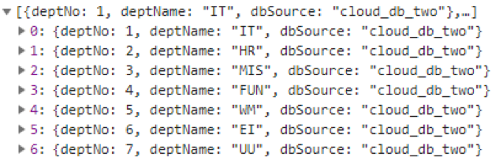


# 五、SpringCloud Feign

## 1、 简介

Feign是对Ribbon的进一步封装。微服务模块中加入了Feign后将同时具备Ribbon和RestTemplate的功能，进一步简化了代码。

## 2、 修改SCMS-API工程

### (1)、加入Feign依赖

```xml
<dependency>
    <groupId>org.springframework.cloud</groupId>
    <artifactId>spring-cloud-starter-feign</artifactId>
</dependency>
```

### (2)、创建DeptClientService接口

```java
package com.atguigu.cloud.service;

import java.util.List;

import org.springframework.cloud.netflix.feign.FeignClient;
import org.springframework.web.bind.annotation.PathVariable;
import org.springframework.web.bind.annotation.RequestMapping;
import org.springframework.web.bind.annotation.RequestMethod;

import com.atguigu.cloud.entities.Dept;

//指定要调用的微服务名称
@FeignClient(value="ATGUIGU-SCMS-DEPT")
public interface DeptClientService {
	
	@RequestMapping(value="/dept/add", method=RequestMethod.POST)
	public boolean add(Dept dept);
	
	@RequestMapping(value="/dept/get/{deptNo}", method=RequestMethod.GET)
	public Dept get(@PathVariable("deptNo") Integer deptNo);
	
	@RequestMapping(value="/dept/get/all", method=RequestMethod.GET)
	public List<Dept> getAll();

}
```

## 3、创建SCMS-Consummer-Feign工程

SCMS-Consummer-Feign工程是SCMS-Consummer-Dept80的升级版，所以有些配置相似。

### (1)、创建Maven模块


pom.xml文件和SCMS-Consummer-Dept80工程一致。

### (2)、创建Controller

这时不再需要RestTemplate了，Feign中也内置了Ribbon。

```java
package com.atguigu.cloud.controller;

import java.util.List;

import org.springframework.beans.factory.annotation.Autowired;
import org.springframework.web.bind.annotation.PathVariable;
import org.springframework.web.bind.annotation.RequestMapping;
import org.springframework.web.bind.annotation.RequestMethod;
import org.springframework.web.bind.annotation.RestController;

import com.atguigu.cloud.entities.Dept;
import com.atguigu.cloud.service.DeptClientService;

@RestController
public class FeignController {
	
	@Autowired
	private DeptClientService feignService;
	
	@RequestMapping(value="/consummer/feign/dept/add",method=RequestMethod.POST)
	public boolean add(Dept dept) {
		return feignService.add(dept);
	}
	
	@RequestMapping(value="/consummer/feign/dept/get/{deptNo}",method=RequestMethod.GET)
	public Dept getById(@PathVariable("deptNo") Integer deptNo) {
		return feignService.get(deptNo);
	}
	
	@RequestMapping(value="/consummer/feign/dept/get/all", method=RequestMethod.GET)
	public List<Dept> getList() {
		return feignService.getAll();
	}

}
```

### (3)、创建主程序

```java
package com.atguigu.cloud;

import org.springframework.boot.SpringApplication;
import org.springframework.boot.autoconfigure.SpringBootApplication;
import org.springframework.cloud.netflix.eureka.EnableEurekaClient;
import org.springframework.cloud.netflix.feign.EnableFeignClients;

@SpringBootApplication
@EnableEurekaClient
@EnableFeignClients //
public class SCMSConsummerFeign {
	
	public static void main(String[] args) {
		SpringApplication.run(SCMSConsummerFeign.class, args);
	}

}
```

主启动类的包必须是DeptClientService接口(SCMS-API工程)的父包，如果不能保持一致，需要在主启动类上加上@ComponentScan 注解扫描

## 4、测试Feign程序

需要启动的微服务有：

SCMS-Eureka-7000

SCMS-Eureka-7001

SCMS-Eureka-7002

SCMS-Provider-Dept8001

SCMS-Provider-Dept8002

SCMS-Provider-Dept8003

SCMS-Consummer-Feign


# 六、SpringCloud Hystrix

## 1、简介

### (1)、分布式系统面临的问题


在微服务架构体系下，服务间的调用错综复杂，交织成一张大网。如果其中某个节点突然无法正常工作，则访问它的众多服务都会被卡住，进而有更多服务被卡住，系统中的线程、CPU、内存等资源有可能被迅速耗尽，最终整个服务体系崩溃。

我们管这样的现象叫服务==雪崩==。


### (2)、Hystrix介绍

Hystrix是一个用于处理分布式系统的延迟和容错的开源库，在分布式系统里，许多依赖不可避免的会调用失败，比如超时、异常等，Hystrix能够保证在一个依赖出问题的情况下，不会导致整体服务失败，避免级联故障，以提高分布式系统的弹性。

"断路器"本身是一种开关装置，当某个服务单元发生故障之后，通过断路器的故障监控（类似熔断保险丝），==向调用方返回一个符合预期的、可处理的备选响应（FallBack==），而不是长时间的等待或者抛出调用方无法处理的异常，这样就保证了服务调用方的线程不会被长时间、不必要地占用，从而避免了故障在分布式系统中的蔓延，乃至雪崩。

Hytrix能够提供==服务降级、服务熔断、服务限流、接近实时的监控==等方面的功能。

## 2、服务熔断机制

## (1)、简介

熔断机制是应对雪崩效应的一种微服务链路保护机制。

当扇出链路的某个微服务不可用或者响应时间太长时，会进行服务的降级，进而熔断该节点微服务的调用，快速响应错误信息。当检测到该节点微服务调用响应正常后恢复调用链路。在SpringCloud框架里熔断机制通过Hystrix实现。Hystrix会监控微服务间调用的状况，当失败的调用到一定阈值，缺省是5秒内20次调用失败就会启动熔断机制。熔断机制的注解是@HystrixCommand。

### ()、创建SCMS-Provider-Hystrix-8004工程

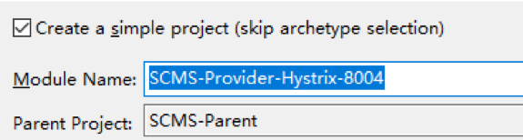

### (3)、编辑pom.xml

在SCMS-Provider-Dept8001基础上添加Hystrix依赖

```xml
<dependency>
    <groupId>org.springframework.cloud</groupId>
    <artifactId>spring-cloud-starter-hystrix</artifactId>
</dependency>
```

### ()、编辑yml文件

在SCMS-Provider-Dept8001基础上修改端口号和应用名称

```yaml
server:
  port: 8004
spring:
  application:
    name: Atguigu-SCMS-Hystrix-Dept
```

### (5)、 Java代码

把SCMS-Provider-Dept8001的Java代码复制过来。

#### [1]、修改DeptController

我们发现@HystrixCommand注解的fallbackMethod属性指定的方法入参和返回值都和原方法一致。这就保证了原方法出现问题时可以由fallbackMethod方法来接替，从而返回一个可以让调用者继续执行其他任务的响应信息。

```java
package com.atguigu.springcloud.controller;

import org.springframework.beans.factory.annotation.Autowired;
import org.springframework.web.bind.annotation.PathVariable;
import org.springframework.web.bind.annotation.RequestMapping;
import org.springframework.web.bind.annotation.RequestMethod;
import org.springframework.web.bind.annotation.RestController;

import com.atguigu.cloud.entities.Dept;
import com.atguigu.springcloud.service.DeptService;
import com.netflix.hystrix.contrib.javanica.annotation.HystrixCommand;

@RestController
public class DeptController {
	
	@Autowired
	private DeptService deptService;
	
	@RequestMapping(value="/dept/get/{deptNo}", method=RequestMethod.GET)
	@HystrixCommand(fallbackMethod="hystrixGet") //添加此注解
	public Dept get(@PathVariable("deptNo") Integer deptNo) {
		
		Dept dept = deptService.findById(deptNo);
		
		if(dept == null) {
			throw new RuntimeException("未找到和"+deptNo+"对应的信息！");
		}
		
		return dept;
	}
	
    //添加此熔断方法
	public Dept hystrixGet(@PathVariable("deptNo") Integer deptNo) {
		return new Dept(deptNo, "与"+deptNo+"对应的Dept信息未找到！", "对应数据库信息未找到！");
	}

}
```

#### [2]、修改主程序

```java
@SpringBootApplication
@EnableEurekaClient
@EnableCircuitBreaker //启用对Hystrix熔断机制的支持
public class SCMSProviderHystrixDept {
	
	public static void main(String[] args) {
		SpringApplication.run(SCMSProviderHystrixDept.class, args);
	}

}
```

### ()、测试

这时启动Eureka集群和SCMS-Provider-Hystrix-8004工程即可。

http://localhost:8004/dept/get/3

​	{"deptNo":3,"deptName":"MIS","dbSource":"cloud_db_three"}


http://localhost:8004/dept/get/344

​	{"deptNo":344,"deptName":"与"+deptNo+"对应的Dept信息未找到！","dbSource":"对应数据库信息未找到！"}

## 3、服务降级机制

### (1)、简介

服务降级处理是在客户端(Consummer端)实现完成的，与服务端(Provider端)没有关系。当某个Consummer访问一个Provider却迟迟得不到响应时执行预先设定好的一个解决方案，而不是一直等待。

### (2)、修改SCMS-API工程

#### [1]、创建一个工厂类实现FallbackFactory\<T>接口

```java
package com.atguigu.cloud.service.factory;

import java.util.List;
import org.springframework.stereotype.Component;
import com.atguigu.cloud.entities.Dept;
import com.atguigu.cloud.service.DeptClientService;
import feign.hystrix.FallbackFactory;

//@Component表示当前类的对象在被扫描到之后要加入IOC容器，所以保证这个类所在的包能够被扫描到
@Component	//非常容易忘！！！
//当前类作为降级机制的备选方案，必须实现FallbackFactory接口，泛型类型是Feign接口类型
public class DeptClientServiceFallBackFactory implements FallbackFactory<DeptClientService> {

	@Override
	public DeptClientService create(Throwable throwable) {
		
		return new DeptClientService() {
			
			@Override
			public Dept get(Integer deptNo) {
				return new Dept(deptNo, "与"+deptNo+"对应的信息未找到[Consummer]", "数据库不存在");
			}
			
			@Override
			public List<Dept> getAll() {
				return null;
			}
			
			@Override
			public boolean add(Dept dept) {
				// TODO Auto-generated method stub
				return false;
			}
		};
	}

}
```

#### [2]、修改DeptClientService接口的@FeignClient注解

```java
//value属性指定要调用的provider的微服务名称
//fallbackFactory属性指定服务降级时使用的备选方案工厂
@FeignClient(
		value="ATGUIGU-SCMS-DEPT",
		fallbackFactory=DeptClientServiceFallBackFactory.class)
public interface DeptClientService {
```

### (3)、修改SCMS-Consummer-Feign工程的yml文件

添加：

```yaml
feign: 
  hystrix: 
    enabled: true
```

### (4)、测试

启动Eureka集群

启动一个**没有**加熔断机制的Provider

启动Feign Consummer

先测试正常访问，然后关掉Provider后再访问

## 4、服务监控

### (1)、新建Maven模块


### (2)、编辑pom.xml

```xml
<dependency>
    <groupId>org.springframework.boot</groupId>
    <artifactId>spring-boot-starter-web</artifactId>
</dependency>
<!-- hystrix 和 hystrix-dashboard相关 -->
<dependency>
    <groupId>org.springframework.cloud</groupId>
    <artifactId>spring-cloud-starter-hystrix</artifactId>
</dependency>
<dependency>
    <groupId>org.springframework.cloud</groupId>
    <artifactId>spring-cloud-starter-hystrix-dashboard</artifactId>
</dependency>
```

### (3)、创建yml文件

```yaml
server:
  port: 9001
```

### (4)、主程序

```java
@SpringBootApplication
@EnableHystrixDashboard //添加此注解
public class SpringCloudHytrixDashBord {
	
	public static void main(String[] args) {
		SpringApplication.run(SpringCloudHytrixDashBord.class, args);
	}

}
```

### (5)、给被监控的微服务添加依赖

```xml
<dependency>
    <groupId>org.springframework.boot</groupId>
    <artifactId>spring-boot-starter-actuator</artifactId>
</dependency>
```

注意：被监控的微服务也需要配置好熔断机制才可以。目前我们的工程中SCMS-Provider-Hystrix-8004满足这个要求。

### (6)、查看监控信息

#### [1]、监控首页

http://localhost:9001/hystrix

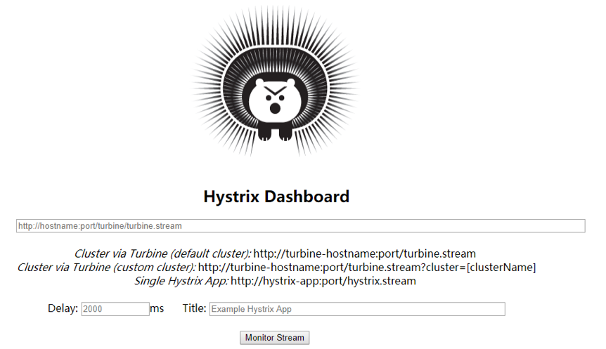

#### [2]、直接查看监控数据

http://localhost:8004/hystrix.stream

8004是被监控的微服务端口


#### [3]、图形化界面方式查看监控数据

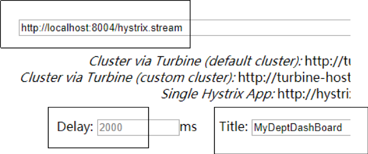

Delay：该参数用来控制服务器上轮询监控信息的延迟时间，默认为2000毫秒，可以通过配置该属性来降低客户端的网络和CPU消耗。

Title：该参数对应了头部标题Hystrix Stream之后的内容，默认会使用具体监控实例的URL，可以通过配置该信息来展示更合适的标题。 


#### [4]、参数说明


#### [5]、复杂监控效果示例


# 七、SpringCloud Zuul

## 1、简介

不同的微服务一般有不同的网络地址，而外部的客户端可能需要调用多个服务的接口才能完成一个业务需求。比如一个电影购票的手机APP，可能会调用电影分类微服务，用户微服务，支付微服务等。如果客户端直接和微服务进行通信，会存在以下问题：

	* 客户端会多次请求不同微服务，增加客户端的复杂性
	* 存在跨域请求，在一定场景下处理相对复杂
	* 认证复杂，每一个服务都需要独立认证  
	* 难以重构，随着项目的迭代，可能需要重新划分微服务，如果客户端直接和微服务通信，那么重构会难以实施  
	* 某些微服务可能使用了其他协议，直接访问有一定困难

Zuul包含了对请求的路由和过滤两个最主要的功能：

* 其中路由功能负责将外部请求转发到具体的微服务实例上，是实现外部访问统一入口的基础，而过滤器功能则负责对请求的处理过程进行干预，是实现请求校验、服务聚合等功能的基础。  

* Zuul和Eureka进行整合，将Zuul自身注册为Eureka服务治理下的应用，同时从Eureka中获得其他微服务的消息，也即以后的访问微服务都是通过Zuul跳转后获得。

总体来说，Zuul提供了**代理**、**路由**和**过滤**的功能。

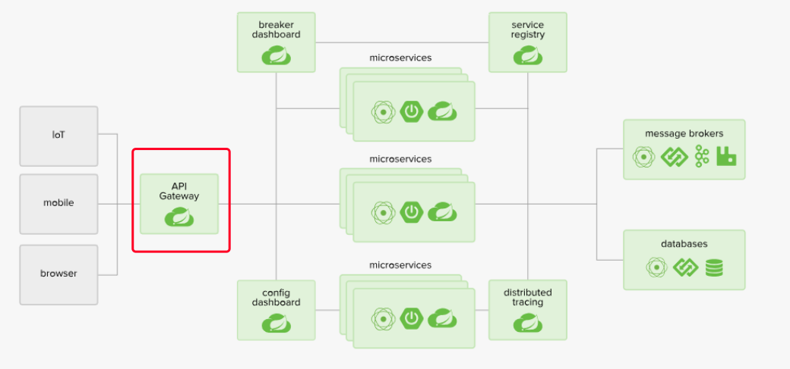

## 2、创建SCMS-Zuul-9002工程

### (1)、创建Maven模块

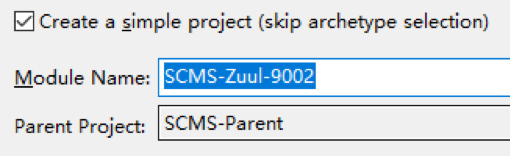

### (2)、编辑pom.xml

```xml
<!-- zuul路由网关 -->
<dependency>
    <groupId>org.springframework.cloud</groupId>
    <artifactId>spring-cloud-starter-zuul</artifactId>
</dependency>
<dependency>
    <groupId>org.springframework.cloud</groupId>
    <artifactId>spring-cloud-starter-eureka</artifactId>
</dependency>
<!-- actuator监控 -->
<dependency>
    <groupId>org.springframework.boot</groupId>
    <artifactId>spring-boot-starter-actuator</artifactId>
</dependency>
<!-- hystrix容错 -->
<dependency>
    <groupId>org.springframework.cloud</groupId>
    <artifactId>spring-cloud-starter-hystrix</artifactId>
</dependency>
<dependency>
    <groupId>org.springframework.cloud</groupId>
    <artifactId>spring-cloud-starter-config</artifactId>
</dependency>
<!-- 日常标配 -->
<dependency>
    <groupId>org.springframework.boot</groupId>
    <artifactId>spring-boot-starter-jetty</artifactId>
</dependency>
<dependency>
    <groupId>org.springframework.boot</groupId>
    <artifactId>spring-boot-starter-web</artifactId>
</dependency>
<dependency>
    <groupId>org.springframework.boot</groupId>
    <artifactId>spring-boot-starter-test</artifactId>
</dependency>
<!-- 热部署插件 -->
<dependency>
    <groupId>org.springframework</groupId>
    <artifactId>springloaded</artifactId>
</dependency>
<dependency>
    <groupId>org.springframework.boot</groupId>
    <artifactId>spring-boot-devtools</artifactId>
</dependency>
```

### (3)、编辑yml文件

```yaml
server:
  port: 9002
spring:
  application:
    name: scms-zuul-gateway
eureka:
  client:
    service-url:
      defaultZone: http://www.eureka7000.com:7000/eureka,http://www.eureka7001.com:7001/eureka,http://www.eureka7002.com:7002/eureka
```

### (4)、主程序

```java
@SpringBootApplication
@EnableZuulProxy //添加此注解
public class SpringCloudZuulApp {
	
	public static void main(String[] args) {
		SpringApplication.run(SpringCloudZuulApp.class, args);
	}

}
```

### (5)、初步测试

启动Eureka集群

启动SCMS-Provider-Hystrix-8004供访问测试

启动SCMS-Zuul-9002

查看Eureka上注册的服务

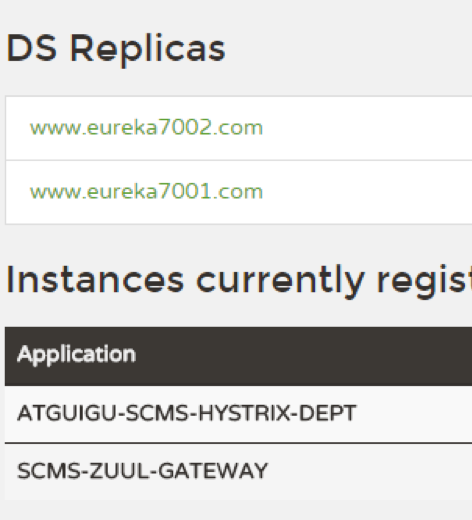

不用路由直接访问http://localhost:8004/dept/get/3

通过路由访问http://localhost:9002/atguigu-scms-hystrix-dept/dept/get/3

localhost:9002找到SCMS-Zuul-9002网关微服务，再通过atguigu-scms-hystrix-dept(小写)找到SCMS-Provider-Hystrix-8004 提供provider的微服务

## 3、路由访问映射规则

### (1)、隐藏微服务名称

在Zuul工程的application.yml中配置：

```yaml
zuul:
  routes:
    atguigu.serviceId: atguigu-scms-hystrix-dept
    atguigu.path: /atguigu-demo/**
```

访问方式http://localhost:9002/atguigu-demo/dept/get/3

### (2)、原真实服务名忽略

经过上面的配置后，既可以使用别名访问，又可以使用原服务名访问。

例如http://localhost:9003/atguigu-scms-hystrix-dept/dept/get/3

如果希望只能通过别名访问，可以做这样的配置：

```yaml
zuul:
  ignored-services: atguigu-scms-hystrix-dept #忽略原服务名访问
  routes:
    atguigu.serviceId: atguigu-scms-hystrix-dept
    atguigu.path: /atguigu-demo/**
```

如果希望屏蔽所有微服务原名称可以使用"*"

```yaml
zuul:
  ignored-services: "*"
  routes:
    atguigu.serviceId: atguigu-scms-hystrix-dept
    atguigu.path: /atguigu-demo/**
```

### (3)、统一设置公共前缀

```yaml
zuul:
  prefix: /good
  ignored-services: "*"
  routes:
    atguigu.serviceId: atguigu-scms-hystrix-dept
    atguigu.path: /atguigu-demo/**
```

设置后所有微服务名前面都需要再加上前缀才可以访问

访问方式http://localhost:9002/good/atguigu-demo/dept/get/3

# 八、SpringCloud微服务理论

## 1、 微服务

微服务化的核心就是将传统的一站式应用，根据业务拆分成一个一个的服务，彻底地去耦合,每一个微服务提供单个业务功能的服务，一个服务做一件事，从技术角度看就是一种小而独立的处理过程，类似进程概念，能够自行单独启动或销毁，拥有自己独立的数据库。

业界大牛马丁.福勒（Martin Fowler）论文网址：

https://martinfowler.com/articles/microservices.html

微服务

强调的是服务的大小，它关注的是某一个点，是具体解决某一个问题/提供落地对应服务的一个服务应用，狭义的看，可以看作Eclipse里面的一个个微服务工程或者Module。

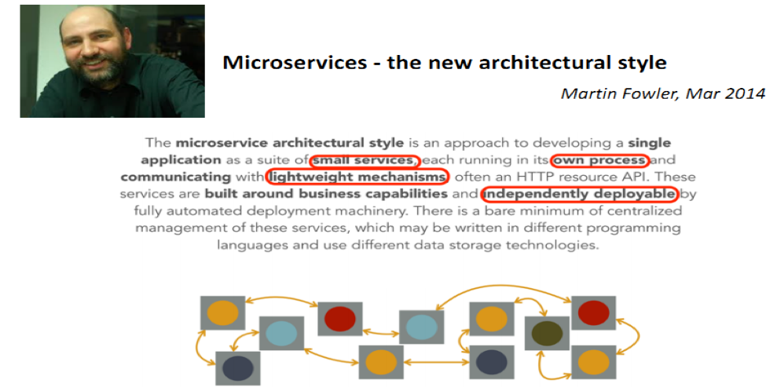

微服务架构是一种架构模式，它提倡将单一应用程序划分成一组⼩的服务，服务之间互相协调、互相配合，为用户提供最终价值。每个服务运行在其独立的进程中，服务与服务间采用轻量级的通信机制互相协作（通常是基于HTTP协议的RESTful API）。每个服务都围绕着具体业务进⾏构建，并且能够被独立的部署到生产环境、类生产环境等。另外，应当尽量避免统一的、集中式的服务管理机制，对具体的一个服务而言，应根据业务上下文，选择合适的语言、工具对其进行构建。

微服务技术栈

| 微服务条目                             | 落地技术                                                     |
| -------------------------------------- | ------------------------------------------------------------ |
| 服务开发                               | Springboot、Spring、SpringMVC                                |
| 服务配置与管理                         | Netflix公司的Archaius、阿里的Diamond等                       |
| 服务注册与发现                         | Eureka、Consul、Zookeeper等                                  |
| 服务调用                               | Rest、RPC、gRPC                                              |
| 服务熔断器                             | Hystrix、Envoy等                                             |
| 负载均衡                               | Ribbon、Nginx等                                              |
| 服务接口调用(客户端调用服务的简化工具) | Feign等                                                      |
| 消息队列                               | Kafka、RabbitMQ、ActiveMQ等                                  |
| 服务配置中心管理                       | SpringCloudConfig、Chef等                                    |
| 服务路由（API网关）                    | Zuul等                                                       |
| 服务监控                               | Zabbix、Nagios、Metrics、Spectator等                         |
| 全链路追踪                             | Zipkin，Brave、Dapper等                                      |
| 服务部署                               | Docker、OpenStack、Kubernetes等                              |
| 数据流操作开发包                       | SpringCloud  Stream（封装与Redis,Rabbit、Kafka等发送接收消息） |
| 事件消息总线                           | Spring  Cloud Bus                                            |

## 2、SpringCloud


SpringCloud，基于SpringBoot提供了一套微服务解决方案，包括服务注册与发现，配置中心，全链路监控，服务网关，负载均衡，熔断器等组件，除了基于NetFlix的开源组件做高度抽象封装之外，还有一些选型中立的开源组件。

SpringCloud利用SpringBoot的开发便利性巧妙地简化了分布式系统基础设施的开发，SpringCloud为开发人员提供了快速构建分布式系统的一些工具，包括配置管理、服务发现、断路器、路由、微代理、事件总线、全局锁、决策竞选、分布式会话等等,它们都可以用SpringBoot的开发风格做到一键启动和部署。

SpringBoot并没有重复制造轮子，它只是将目前各家公司开发的比较成熟、经得起实际考验的服务框架组合起来，通过SpringBoot风格进行再封装屏蔽掉了复杂的配置和实现原理，最终给开发者留出了一套简单易懂、易部署和易维护的分布式系统开发工具包。

SpringCloud=分布式微服务架构下的**一站式解决方案**，是各个微服务架构落地技术的集合体，俗称微服务全家桶


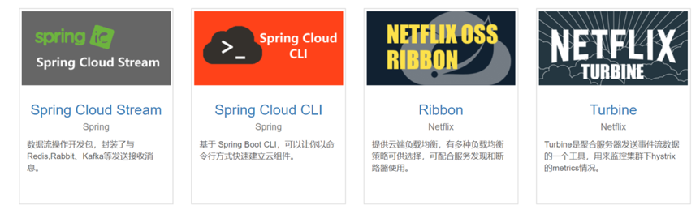

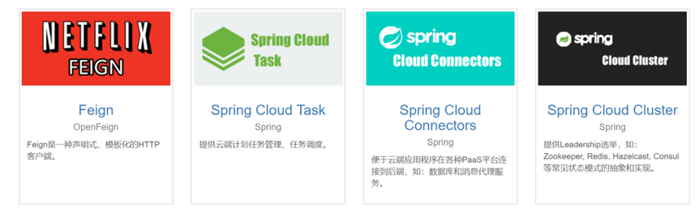


## 3、 SpringBoot和SpringCloud的关系

SpringBoot专注于快速方便的开发单个个体微服务。

SpringCloud是关注全局的微服务协调整理治理框架，它将SpringBoot开发的一个个单体微服务整合并管理起来，为各个微服务之间提供，配置管理、服务发现、断路器、路由、微代理、事件总线、全局锁、决策竞选、分布式会话等等集成服SpringBoot可以离开SpringCloud独立使用开发项目，但是SpringCloud离不开SpringBoot，属于依赖的关系。==SpringBoot专注于快速、方便的开发单个微服务个体==，==SpringCloud关注全局的服务治理框架==。

## 4、Dubbo和SpringCloud如何选择？ 


|              | Dubbo         | Spring Cloud                 |
| ------------ | ------------- | ---------------------------- |
| 服务注册中心 | Zookeeper     | Spring Cloud Netflix Eureka  |
| 服务调用方式 | RPC           | REST API                     |
| 服务监控     | Dubbo-monitor | Spring Boot Admin            |
| 断路器       | 不完善        | Spring Cloud Netflix Hystrix |
| 服务网关     | 无            | Spring Cloud Netflix Zuul    |
| 分布式配置   | 无            | Spring Cloud Config          |
| 服务跟踪     | 无            | Spring Cloud Sleuth          |
| 消息总线     | 无            | Spring Cloud Bus             |
| 数据流       | 无            | Spring Cloud Stream          |
| 批量任务     | 无            | Spring Cloud Task            |

Dubbo成熟度查看：https://dubbo.apache.org/zh-cn/docs/user/maturity.html

最大区别：SpringCloud抛弃了Dubbo的RPC通信，采用的是基于HTTP的REST方式。

严格来说，这两种方式各有优劣。虽然从一定程度上来说，后者牺牲了服务调用的性能，但也避免了上面提到的原生RPC带来的问题。而且REST相比RPC更为灵活，服务提供方和调用方的依赖只依靠一纸契约，不存在代码级别的强依赖，这在强调快速演化的微服务环境下，显得更加合适。

品牌机与组装机的区别

很明显，Spring Cloud的功能比DUBBO更加强大，涵盖面更广，而且作为Spring的拳头项目，它也能够与Spring Framework、Spring Boot、Spring Data、Spring Batch等其他Spring项目完美融合，这些对于微服务而言是至关重要的。使用Dubbo构建的微服务架构就像组装电脑，各环节我们的选择自由度很高，但是最终结果很有可能因为一条内存质量不行就点不亮了，总是让人不怎么放心，但是如果你是一名高手，那这些都不是问题；而Spring Cloud就像品牌机，在Spring Source的整合下，做了大量的兼容性测试，保证了机器拥有更高的稳定性，但是如果要在使用非原装组件外的东西，就需要对其基础有足够的了解。

社区支持与更新力度

最为重要的是，DUBBO停止了5年左右的更新，虽然2017.7重启了。对于技术发展的新需求，需要由开发者自行拓展升级（比如当当网弄出了DubboX），这对于很多想要采用微服务架构的中小软件组织，显然是不太合适的，中小公司没有这么强大的技术能力去修改Dubbo源码+周边的一整套解决方案，并不是每一个公司都有阿里的大牛+真实的线上生产环境测试过。