[TOC]

# 一、认识SpringMVC

## 1、MVC回顾

**模型**（Model）：负责封装应用的状态，并实现应用的功能。通常分为数据模型和业务逻辑模型，数据模型用来存放业务数据，比如订单信息、用户信息等；而业务逻辑模型包含应用的业务操作，比如订单的添加或者修改等。通常由java开发人员编写程序完成，代码量最多

**视图**（View）：视图通过**控制器**从模型获得要展示的数据，然后用自己的方式展现给用户，相当于提供界面来与用户进行人机交互。通常有前端和java开发人员完成，代码量较多。

**控制器**（Controller）：用来控制应用程序的流程和处理用户所发出的请求。当控制器接收到用户的请求后，会将用户的数据和模型的更新相映射，也就是调用模型来实现用户请求的功能；然后控制器会选择用于响应的视图，把模型更新后的数据展示给用户。起到总调度的作用，Controller通常由框架实现，使用时基本不需要编写代码


## 2、SpringMVC介绍

大部分 java 应用都是 web 应用，展现层是 web 应用最为重要的部分。Spring 为展现层提供了一个优秀的 web 层框架——SpringMVC。和众多其他 web 框架一样，它基于 MVC 的设计理念，此外，它采用了松散耦合可插拔组件结构，比其他 MVC 框架更具扩展性和灵活性。

SpringMVC 通过一套 MVC 注解，让 POJO 成为处理请求的控制器，无需实现任何接口，同时，SpringMVC 还支持 REST 风格的 URL 请求。

此外，SpringMVC 在数据绑定、视图解析、本地化处理以及静态资源处理上都有许多不俗的表现。

它在框架设计、扩展性、灵活性等方面全面超越了 Struts、WebWork 等 MVC 框架，从原来的追赶者一跃成为MVC 的领跑者。

SpringMVC 框架围绕 ==DispatcherServlet== 这个核心展开，DispatcherServlet 是 SpringMVC 框架的总导演、总策划，它负责截获请求并将其分派给相应的处理器处理。

## 3、SpringMVC架构

| dddddddddddddddddddddddddddddddddddddddddddddddddddddddddddddddddddddddddddddddddddddddddddddddddddddddddddddd | d    |
| ------------------------------------------------------------ | ---- |
|                 |      |

# 二、springmvc程序(Hello World)

## 1、创建工程

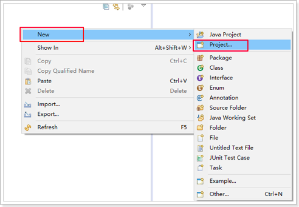


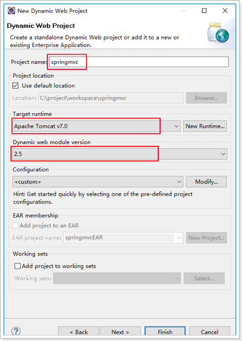

点击"finish"完成：

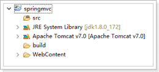

## 2、引入jar包及源码包

1. 从 spring-framework-4.3.12.RELEASE\libs目录下copy一下jar包：

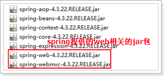

Spring-web：web开发相关的基础功能包

Spring-webmvc：SpringMVC框架核心包

2. 从课前资料lib\extra中copy日志相关jar包：

   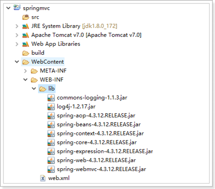

   

## 3、配置web.xml-DispatcherServlet入口


```xml
<?xml version="1.0" encoding="UTF-8"?>
<web-app xmlns:xsi="http://www.w3.org/2001/XMLSchema-instance" xmlns="http://java.sun.com/xml/ns/javaee" xsi:schemaLocation="http://java.sun.com/xml/ns/javaee http://java.sun.com/xml/ns/javaee/web-app_2_5.xsd" version="2.5">
  <display-name>springmvc</display-name>
  
  <!-- SpringMVC 的总的入口 -->
  <servlet>
  	<servlet-name>springmvc</servlet-name>
  	<servlet-class>org.springframework.web.servlet.DispatcherServlet</servlet-class>
  </servlet>
  <servlet-mapping>
  	<servlet-name>springmvc</servlet-name>
  	<!-- 
  		/*：拦截所有请求，包括jsp
  		/ ：拦截所有请求，不包含jsp
  		*.do,*.action
  	 -->
  	<url-pattern>*.do</url-pattern>
  </servlet-mapping>
  
  <welcome-file-list>
    <welcome-file>index.html</welcome-file>
    <welcome-file>index.htm</welcome-file>
    <welcome-file>index.jsp</welcome-file>
    <welcome-file>default.html</welcome-file>
    <welcome-file>default.htm</welcome-file>
    <welcome-file>default.jsp</welcome-file>
  </welcome-file-list>
</web-app>
```

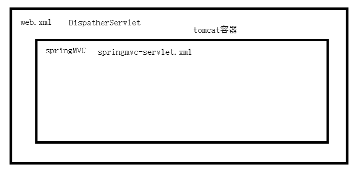

Tomcat 运行的时候，tomcat 容器加载 web.xml 文件，然后根据 web.xml 加载其中的 DispatcherServlet ，DispatcherServlet 加载 springmvc 的容器， springmvc 的容器再加载 springmvc-servlet.xml 的配置文件

##  4、springmvc的配置文件 

 ###  (1)、{servlet-name}-servlet.xml

> 用户发送请求到 web 容器，并被 DispatchServlet 拦截之后进入 springmvc 容器，springmvc 该怎么处理那，这就需要 springmvc 的配置文件。
>
> 那么 springmvc 的配置文件该放在什么位置，又该怎么命名呢？

找到 DispatcherServlet 这个类：

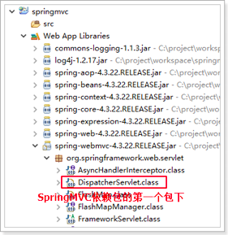

| dddddddddddddddddddddddddddddddddddddddddddddddddddddddddddddddddddddddddddddddddddddddddddddddd | d    |
| ------------------------------------------------------------ | ---- |
| 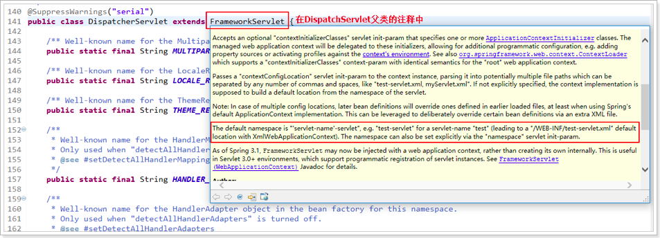 |      |

由此知道，springmvc 默认读取 /WEB-INF/{servlet-name}-servlet.xml 这个配置文件，因为我们在 web.xml 中的 servlet-name 配置的是 springmvc，所以在WEB-INF目录下创建 springmvc-servlet.xml 文件：

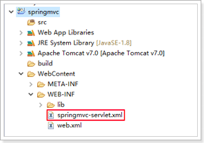

springmvc 配置文件的头信息和 spring 一样。

```xml
<?xml version="1.0" encoding="UTF-8"?>
<beans xmlns="http://www.springframework.org/schema/beans"
	xmlns:xsi="http://www.w3.org/2001/XMLSchema-instance" xmlns:p="http://www.springframework.org/schema/p"
	xmlns:context="http://www.springframework.org/schema/context"
	xmlns:mvc="http://www.springframework.org/schema/mvc"
	xsi:schemaLocation="http://www.springframework.org/schema/beans http://www.springframework.org/schema/beans/spring-beans.xsd
        http://www.springframework.org/schema/mvc http://www.springframework.org/schema/mvc/spring-mvc-4.0.xsd
        http://www.springframework.org/schema/context http://www.springframework.org/schema/context/spring-context.xsd">

</beans>
```

### (2)、完整的配置

```xml
<?xml version="1.0" encoding="UTF-8"?>
<beans xmlns="http://www.springframework.org/schema/beans"
	xmlns:xsi="http://www.w3.org/2001/XMLSchema-instance" xmlns:p="http://www.springframework.org/schema/p"
	xmlns:context="http://www.springframework.org/schema/context"
	xmlns:mvc="http://www.springframework.org/schema/mvc"
	xsi:schemaLocation="http://www.springframework.org/schema/beans http://www.springframework.org/schema/beans/spring-beans.xsd
        http://www.springframework.org/schema/mvc http://www.springframework.org/schema/mvc/spring-mvc-4.0.xsd
        http://www.springframework.org/schema/context http://www.springframework.org/schema/context/spring-context.xsd">

	<!-- 配置映射器,把bean的name属性作为一个url -->
	<bean class="org.springframework.web.servlet.handler.BeanNameUrlHandlerMapping" />
	
	<!-- 配置适配器 -->
	<bean class="org.springframework.web.servlet.mvc.SimpleControllerHandlerAdapter" />
	
	<bean name="/hello.do" class="com.atguigu.springmvc.controller.HelloController" />
	
	<!-- 配置视图解析器 -->
	<!-- Example: prefix="/WEB-INF/jsp/", suffix=".jsp", viewname="test" -> "/WEB-INF/jsp/test.jsp"  -->
	<bean class="org.springframework.web.servlet.view.InternalResourceViewResolver">
		<property name="prefix" value="/WEB-INF/views/"></property>
		<property name="suffix" value=".jsp"></property>
	</bean>

</beans>
```

## 5、HandlerMapping映射器

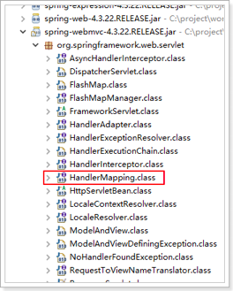

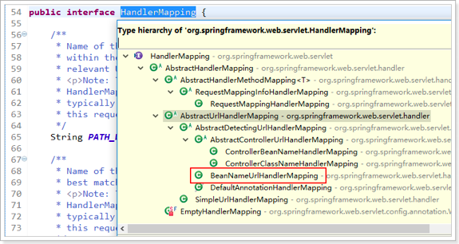

springmvc-servlet.xml 配置文件中

```xml
<!-- 配置HandlerMapping -->
	<bean class="org.springframework.web.servlet.handler.BeanNameUrlHandlerMapping" />
```

## 6、HandlerAdapter适配器

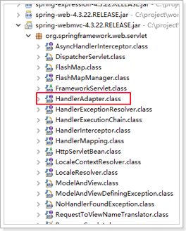

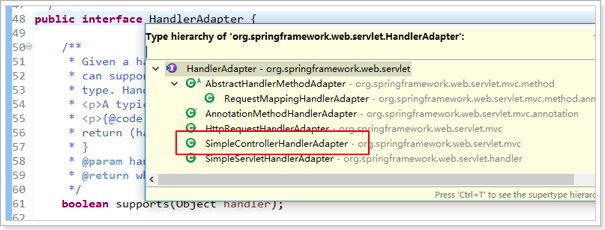

springmvc-servlet.xml 配置文件中

```xml
<!--配置映射器,把bean的name属性作为一个url -->
	<bean class="org.springframework.web.servlet.mvc.SimpleControllerHandlerAdapter" />
```

## 7、Handler - HelloController


HelloController内容：

```java
/**
 * 在整体架构中，通常称为Handler
 * 在具体实现中，通常称为Controller
 * @author joedy
 *
 */
public class HelloController implements Controller {

    @Override
    public ModelAndView handleRequest(HttpServletRequest request, HttpServletResponse response)
            throws Exception {
        ModelAndView mv = new ModelAndView();
        mv.setViewName("hello"); // 试图名称
        mv.addObject("msg", "这是我的第一个SpringMVC程序！！"); // 数据模型
        return mv;
    }
}
```

**配置Handler**

springmvc-servlet.xml 配置文件中，HandlerAdapter 根据 bean 的 name 属性作为一个 url

```xml
<!-- 配置Handler -->
<bean name="/hello.do" class="com.atguigu.springmvc.controller.HelloController" />
```

## 8、ViewResolver试图解析器


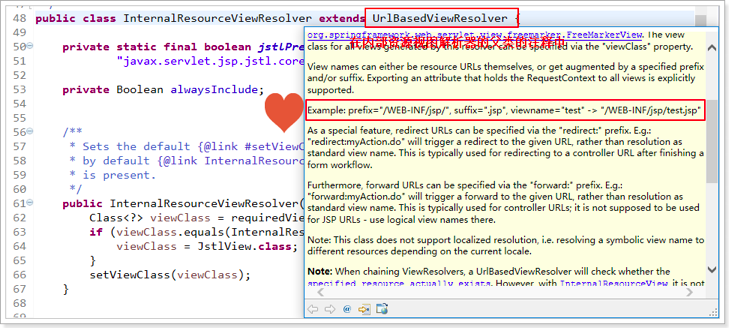

由此可见，视图解析器的规则是：prefix+viewName+suffix

```xml
<!-- 配置视解析器 -->
<bean class="org.springframework.web.servlet.view.InternalResourceViewResolver">
		<property name="prefix" value="/WEB-INF/views/"></property>
		<property name="suffix" value=".jsp"></property>
	</bean>
```

## 9、View视图

添加jsp页面（hello.jsp）


Jsp内容：

```jsp
<%@ page language="java" contentType="text/html; charset=UTF-8"
    pageEncoding="UTF-8"%>
<!DOCTYPE html PUBLIC "-//W3C//DTD HTML 4.01 Transitional//EN" "http://www.w3.org/TR/html4/loose.dtd">
<html>
<head>
<meta http-equiv="Content-Type" content="text/html; charset=UTF-8">
<title>Insert title here</title>
</head>
<body>
	<div style="color:red; font-size:30px">${msg }</div>
</body>
</html>
```

## 10、运行结果


通过浏览器访问：http://localhost:8080/springmvc/hello.do

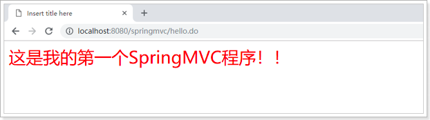

## 11、添加log日志


Log4j.properties内容：

```properties
log4j.rootLogger=DEBUG,A1
log4j.logger.org.mybatis=DEBUG
log4j.appender.A1=org.apache.log4j.ConsoleAppender
log4j.appender.A1.layout=org.apache.log4j.PatternLayout
log4j.appender.A1.layout.ConversionPattern=%-d{yyyy-MM-dd HH:mm:ss,SSS} [%t] [%c]-[%p] %m%n
```

日志打印信息

```cmd
2019-03-19 13:13:41,148 [http-bio-8080-exec-2] [org.springframework.web.servlet.DispatcherServlet]-[DEBUG] DispatcherServlet with name 'springmvc' processing GET request for [/springmvc/hello.do]
2019-03-19 13:13:41,156 [http-bio-8080-exec-2] [org.springframework.web.servlet.handler.BeanNameUrlHandlerMapping]-[DEBUG] Mapping [/hello.do] to HandlerExecutionChain with handler [com.atguigu.springmvc.controller.HelloController@70b413f8] and 1 interceptor
2019-03-19 13:13:41,159 [http-bio-8080-exec-2] [org.springframework.web.servlet.DispatcherServlet]-[DEBUG] Last-Modified value for [/springmvc/hello.do] is: -1
2019-03-19 13:13:41,163 [http-bio-8080-exec-2] [org.springframework.beans.factory.support.DefaultListableBeanFactory]-[DEBUG] Invoking afterPropertiesSet() on bean with name 'hello'
2019-03-19 13:13:41,163 [http-bio-8080-exec-2] [org.springframework.web.servlet.DispatcherServlet]-[DEBUG] Rendering view [org.springframework.web.servlet.view.InternalResourceView: name 'hello'; URL [/WEB-INF/views/hello.jsp]] in DispatcherServlet with name 'springmvc'
2019-03-19 13:13:41,163 [http-bio-8080-exec-2] [org.springframework.web.servlet.view.InternalResourceView]-[DEBUG] Added model object 'msg' of type [java.lang.String] to request in view with name 'hello'
2019-03-19 13:13:41,164 [http-bio-8080-exec-2] [org.springframework.web.servlet.view.InternalResourceView]-[DEBUG] Forwarding to resource [/WEB-INF/views/hello.jsp] in InternalResourceView 'hello'
2019-03-19 13:13:41,257 [http-bio-8080-exec-2] [org.springframework.web.servlet.DispatcherServlet]-[DEBUG] Successfully completed request
```

## 12、流程分析

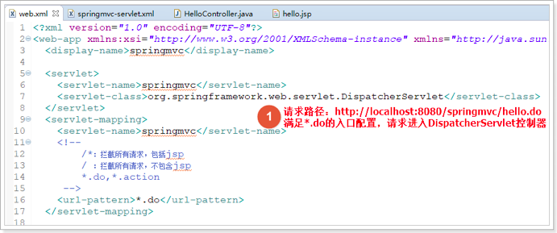

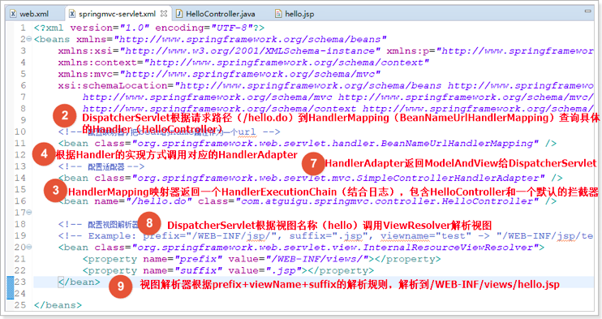


## 13、优化helloworld程序

> 入门程序虽然完成了，但是还有可以改进的空间。结合 Spring 入门流程，我们一步步的优化入门程序。

### (1)、web.xml

#### [1]、load-on-startup

> 结合启动日志，发现入门程序在 tomcat 的运行完成后并没有加载 servlet，而是在用户第一次访问之后才加载。生产环境会影响网站的相应速度

解决方案：让 tomcat 启动时就去加载 DispatcherServlet 并初始化 Spring 容器。

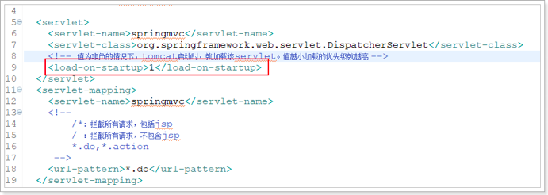

#### [2]、指定SpringMVC的配置文件

> 通常情况下 SpringMVC 的命名规则是 {servlet-name}-servlet.xml，一个配置文件名而已，问题不大。
>
> 但是，SpringMVC 的配置文件的存放路径，如果采用默认配置路径（WEB-INF下），这在项目开发时不利于统一维护管理。能不能把 SpringMVC 的配置文件和其他 Spring 配置文件放在一起，方便统一管理呢？

例如：现在把配置文件移动到src根目录下


这时就需要在 web.xml 中去指定 springMVC 的存放路径，配置方式：

```xml
<servlet>
  	<servlet-name>springmvc</servlet-name>
  	<servlet-class>org.springframework.web.servlet.DispatcherServlet</servlet-class>
  	<!-- 指定springMVC的配置文件，多个可以用逗号和空格隔开 -->
  	<init-param>
  		<param-name>contextConfigLocation</param-name>
  		<param-value>classpath:springmvc-servlet.xml</param-value>
  	</init-param>
  	<!-- 值为非负的情况下，tomcat启动时，就加载该servlet。值越小加载的优先级就越高 -->
  	<load-on-startup>1</load-on-startup>
  </servlet>
  <servlet-mapping>
  	<servlet-name>springmvc</servlet-name>
  	<!-- 
  		/*：拦截所有请求，包括jsp
  		/ ：拦截所有请求，不包含jsp
  		*.do,*.action
  	 -->
  	<url-pattern>*.do</url-pattern>
  </servlet-mapping>
```

原理：参见 DispatcherServlet 父类的注释

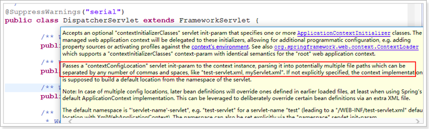

### (2)、{servlet-name}-servlet.xml

DispatchServlet.class源码中：

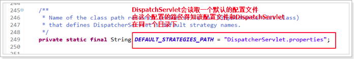

找到DispatchServlet.properties文件：

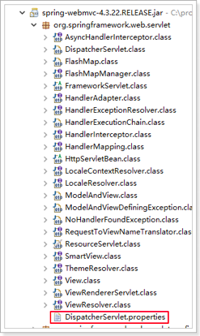


在这个默认的配置文件中，已经配置了映射器和适配器。

所以在 springmvc-servlet.xml 文件中可以省略之前配置的映射器和适配器


再次测试：

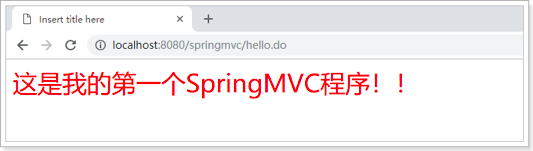

## 14、helloword的缺点

* 每个类需要都实现Controller接口
* 每个类（Controller）只能完成一个用户请求（或者只能处理一个业务逻辑）
* 每个类（Controller）都要在配置文件里，进行配置

解决方案：

​       注解程序

# 三、注解方式

## 1、默认注解配置

> 在 DispatchServlet.properties 文件中，已经提供了默认的注解映射器和适配器，所以咱们可以直接书写注解的代码


### (1)、创建hello2Controller

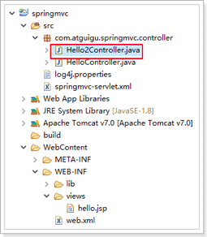

内容：

```java
@Controller
public class Hello2Controller {
    
    @RequestMapping("show1")
    public ModelAndView test1(){
        ModelAndView mv = new ModelAndView();
        mv.setViewName("hello");
        mv.addObject("msg", "这是SpringMVC的第一个注解程序！");
        return mv;
    }

}
```

### (2)、配置扫描器

在 springmvc-servlet.xml 中，开启注解扫描

```xml
<?xml version="1.0" encoding="UTF-8"?>
<beans xmlns="http://www.springframework.org/schema/beans"
	xmlns:xsi="http://www.w3.org/2001/XMLSchema-instance" xmlns:p="http://www.springframework.org/schema/p"
	xmlns:context="http://www.springframework.org/schema/context"
	xmlns:mvc="http://www.springframework.org/schema/mvc"
	xsi:schemaLocation="http://www.springframework.org/schema/beans http://www.springframework.org/schema/beans/spring-beans.xsd
        http://www.springframework.org/schema/mvc http://www.springframework.org/schema/mvc/spring-mvc-4.0.xsd
        http://www.springframework.org/schema/context http://www.springframework.org/schema/context/spring-context.xsd">

	<!-- 配置映射器,把bean的name属性作为一个url -->
	<!-- <bean class="org.springframework.web.servlet.handler.BeanNameUrlHandlerMapping" /> -->
	
	<!-- 配置适配器 -->
	<!-- <bean class="org.springframework.web.servlet.mvc.SimpleControllerHandlerAdapter" /> -->
	
	<!-- <bean name="/hello.do" class="com.atguigu.springmvc.controller.HelloController" /> -->
	
	<!-- 配置注解扫描，和Spring的配置方式一样 -->
	<context:component-scan base-package="com.atguigu.springmvc" />
	
	<!-- 配置视图解析器 -->
	<!-- Example: prefix="/WEB-INF/jsp/", suffix=".jsp", viewname="test" -> "/WEB-INF/jsp/test.jsp"  -->
	<bean class="org.springframework.web.servlet.view.InternalResourceViewResolver">
		<property name="prefix" value="/WEB-INF/views/"></property>
		<property name="suffix" value=".jsp"></property>
	</bean>

</beans>
```

### (3)、测试

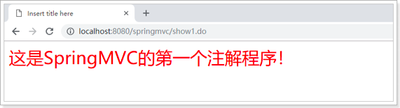

### (4)、日志

输出的是默认配置的映射器，说明这种配置OK

```cmd
2019-03-19 14:37:55,816 [http-bio-8080-exec-5] [org.springframework.web.servlet.DispatcherServlet]-[DEBUG] DispatcherServlet with name 'springmvc' processing GET request for [/springmvc/show1.do]
2019-03-19 14:37:55,829 [http-bio-8080-exec-5] [org.springframework.web.servlet.mvc.annotation.DefaultAnnotationHandlerMapping]-[DEBUG] Matching patterns for request [/show1.do] are [/show1.*]
2019-03-19 14:37:55,831 [http-bio-8080-exec-5] [org.springframework.web.servlet.mvc.annotation.DefaultAnnotationHandlerMapping]-[DEBUG] URI Template variables for request [/show1.do] are {}
2019-03-19 14:37:55,835 [http-bio-8080-exec-5] [org.springframework.web.servlet.mvc.annotation.DefaultAnnotationHandlerMapping]-[DEBUG] Mapping [/show1.do] to HandlerExecutionChain with handler [com.atguigu.springmvc.controller.Hello2Controller@406eb00c] and 1 interceptor
2019-03-19 14:37:55,848 [http-bio-8080-exec-5] [org.springframework.web.servlet.DispatcherServlet]-[DEBUG] Last-Modified value for [/springmvc/show1.do] is: -1
2019-03-19 14:37:55,877 [http-bio-8080-exec-5] [org.springframework.web.bind.annotation.support.HandlerMethodInvoker]-[DEBUG] Invoking request handler method: public org.springframework.web.servlet.ModelAndView com.atguigu.springmvc.controller.Hello2Controller.test1()
2019-03-19 14:37:55,893 [http-bio-8080-exec-5] [org.springframework.beans.factory.support.DefaultListableBeanFactory]-[DEBUG] Invoking afterPropertiesSet() on bean with name 'hello'
2019-03-19 14:37:55,894 [http-bio-8080-exec-5] [org.springframework.web.servlet.DispatcherServlet]-[DEBUG] Rendering view [org.springframework.web.servlet.view.InternalResourceView: name 'hello'; URL [/WEB-INF/views/hello.jsp]] in DispatcherServlet with name 'springmvc'
2019-03-19 14:37:55,894 [http-bio-8080-exec-5] [org.springframework.web.servlet.view.InternalResourceView]-[DEBUG] Added model object 'msg' of type [java.lang.String] to request in view with name 'hello'
2019-03-19 14:37:55,894 [http-bio-8080-exec-5] [org.springframework.web.servlet.view.InternalResourceView]-[DEBUG] Forwarding to resource [/WEB-INF/views/hello.jsp] in InternalResourceView 'hello'
2019-03-19 14:37:55,917 [http-bio-8080-exec-5] [org.springframework.web.servlet.DispatcherServlet]-[DEBUG] Successfully completed request
```

### (5)、缺点

找到默认的注解映射器和适配器，发现他们都已过时。

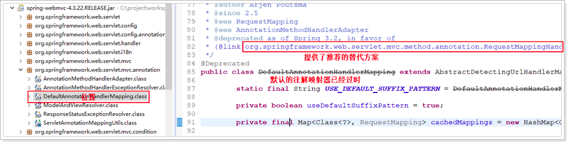

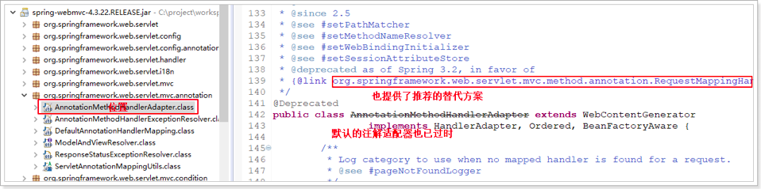

既然默认配置的映射器和适配器都已经过期，并且springmvc也推荐了相应的支持注解的映射器和适配器

## 2、推荐使用的注解配置

### (1)、springmvc-servlet.xml

```xml
<?xml version="1.0" encoding="UTF-8"?>
<beans xmlns="http://www.springframework.org/schema/beans"
	xmlns:xsi="http://www.w3.org/2001/XMLSchema-instance" xmlns:p="http://www.springframework.org/schema/p"
	xmlns:context="http://www.springframework.org/schema/context"
	xmlns:mvc="http://www.springframework.org/schema/mvc"
	xsi:schemaLocation="http://www.springframework.org/schema/beans http://www.springframework.org/schema/beans/spring-beans.xsd
        http://www.springframework.org/schema/mvc http://www.springframework.org/schema/mvc/spring-mvc-4.0.xsd
        http://www.springframework.org/schema/context http://www.springframework.org/schema/context/spring-context.xsd">

	<!-- 配置映射器,把bean的name属性作为一个url -->
	<!-- <bean class="org.springframework.web.servlet.handler.BeanNameUrlHandlerMapping" /> -->
	<!-- 推荐使用的注解映射器 -->
	<bean class="org.springframework.web.servlet.mvc.method.annotation.RequestMappingHandlerMapping"/>
	
	<!-- 配置适配器 -->
	<!-- <bean class="org.springframework.web.servlet.mvc.SimpleControllerHandlerAdapter" /> -->
	<!-- 推荐使用的注解适配器 -->
	<bean class="org.springframework.web.servlet.mvc.method.annotation.RequestMappingHandlerAdapter"/>
	
	<!-- <bean name="/hello.do" class="com.atguigu.springmvc.controller.HelloController" /> -->
	
	<!-- 配置注解扫描，和Spring的配置方式一样 -->
	<context:component-scan base-package="com.atguigu.springmvc" />
	
	<!-- 配置视图解析器 -->
	<!-- Example: prefix="/WEB-INF/jsp/", suffix=".jsp", viewname="test" -> "/WEB-INF/jsp/test.jsp"  -->
	<bean class="org.springframework.web.servlet.view.InternalResourceViewResolver">
		<property name="prefix" value="/WEB-INF/views/"></property>
		<property name="suffix" value=".jsp"></property>
	</bean>

</beans>
```

### (2)、测试


### (3)、日志

输出的是推荐使用的映射器，说明这种配置OK

```cmd
2019-03-19 14:49:57,626 [http-bio-8080-exec-13] [org.springframework.web.servlet.DispatcherServlet]-[DEBUG] DispatcherServlet with name 'springmvc' processing GET request for [/springmvc/show1.do]
2019-03-19 14:49:57,626 [http-bio-8080-exec-13] [org.springframework.web.servlet.mvc.method.annotation.RequestMappingHandlerMapping]-[DEBUG] Looking up handler method for path /show1.do
2019-03-19 14:49:57,626 [http-bio-8080-exec-13] [org.springframework.web.servlet.mvc.method.annotation.RequestMappingHandlerMapping]-[DEBUG] Returning handler method [public org.springframework.web.servlet.ModelAndView com.atguigu.springmvc.controller.Hello2Controller.test1()]
2019-03-19 14:49:57,626 [http-bio-8080-exec-13] [org.springframework.beans.factory.support.DefaultListableBeanFactory]-[DEBUG] Returning cached instance of singleton bean 'hello2Controller'
2019-03-19 14:49:57,626 [http-bio-8080-exec-13] [org.springframework.web.servlet.DispatcherServlet]-[DEBUG] Last-Modified value for [/springmvc/show1.do] is: -1
2019-03-19 14:49:57,627 [http-bio-8080-exec-13] [org.springframework.web.servlet.DispatcherServlet]-[DEBUG] Rendering view [org.springframework.web.servlet.view.InternalResourceView: name 'hello'; URL [/WEB-INF/views/hello.jsp]] in DispatcherServlet with name 'springmvc'
2019-03-19 14:49:57,627 [http-bio-8080-exec-13] [org.springframework.web.servlet.view.InternalResourceView]-[DEBUG] Added model object 'msg' of type [java.lang.String] to request in view with name 'hello'
2019-03-19 14:49:57,627 [http-bio-8080-exec-13] [org.springframework.web.servlet.view.InternalResourceView]-[DEBUG] Forwarding to resource [/WEB-INF/views/hello.jsp] in InternalResourceView 'hello'
2019-03-19 14:49:57,628 [http-bio-8080-exec-13] [org.springframework.web.servlet.DispatcherServlet]-[DEBUG] Successfully completed request
```

## ==3、最佳方案(注解驱动)==

### (1)、注解驱动的配置

> 在 springmvc-servlet.xml 中配置注解驱动

<mvc:annotation-driven />

```xml
<!-- 配置映射器,把bean的name属性作为一个url -->
	<!-- <bean class="org.springframework.web.servlet.handler.BeanNameUrlHandlerMapping" /> -->
	<!-- 推荐使用的注解映射器 -->
	<!-- <bean class="org.springframework.web.servlet.mvc.method.annotation.RequestMappingHandlerMapping"/> -->
	
	<!-- 配置适配器 -->
	<!-- <bean class="org.springframework.web.servlet.mvc.SimpleControllerHandlerAdapter" /> -->
	<!-- 推荐使用的注解适配器 -->
	<!-- <bean class="org.springframework.web.servlet.mvc.method.annotation.RequestMappingHandlerAdapter"/> -->
	
	<!-- 注解驱动，替代推荐使用的注解映射器和适配器，并提供了对json的支持 -->
	<mvc:annotation-driven />
	
	<!-- <bean name="/hello.do" class="com.atguigu.springmvc.controller.HelloController" /> -->
	
	<!-- 配置注解扫描，和Spring的配置方式一样 -->
	<context:component-scan base-package="com.atguigu.springmvc" />
	
	<!-- 配置视图解析器 -->
	<!-- Example: prefix="/WEB-INF/jsp/", suffix=".jsp", viewname="test" -> "/WEB-INF/jsp/test.jsp"  -->
	<bean class="org.springframework.web.servlet.view.InternalResourceViewResolver">
		<property name="prefix" value="/WEB-INF/views/"></property>
		<property name="suffix" value=".jsp"></property>
	</bean>
```

### (2)、注解驱动的原理

AnnotationDrivenBeanDefinitionParser 的注释

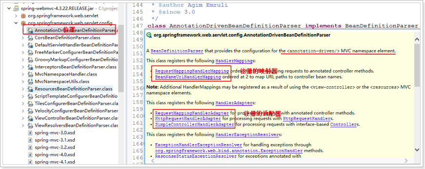

## ==4、注解配置最终方案==

使用注解驱动后 springmvc-servlet.xml 这个配置文件：

```xml
<?xml version="1.0" encoding="UTF-8"?>
<beans xmlns="http://www.springframework.org/schema/beans"
	xmlns:xsi="http://www.w3.org/2001/XMLSchema-instance" xmlns:p="http://www.springframework.org/schema/p"
	xmlns:context="http://www.springframework.org/schema/context"
	xmlns:mvc="http://www.springframework.org/schema/mvc"
	xsi:schemaLocation="http://www.springframework.org/schema/beans http://www.springframework.org/schema/beans/spring-beans.xsd
        http://www.springframework.org/schema/mvc http://www.springframework.org/schema/mvc/spring-mvc-4.0.xsd
        http://www.springframework.org/schema/context http://www.springframework.org/schema/context/spring-context.xsd">

	<!-- 注解驱动，替代推荐使用的注解映射器和适配器，并提供了对json的支持 -->
	<mvc:annotation-driven />
	
	<!-- 配置注解扫描，和Spring的配置方式一样 -->
	<context:component-scan base-package="com.atguigu.springmvc" />
	
	<!-- 配置视图解析器 -->
	<!-- Example: prefix="/WEB-INF/jsp/", suffix=".jsp", viewname="test" -> "/WEB-INF/jsp/test.jsp"  -->
	<bean class="org.springframework.web.servlet.view.InternalResourceViewResolver">
		<property name="prefix" value="/WEB-INF/views/"></property>
		<property name="suffix" value=".jsp"></property>
	</bean>

</beans>
```

目前这些配置已经能够完成 springmvc 的基本使用，后续还会添加一些高级用法的配置，例如：拦截器、自定义试图、文件上传等

# 四、RequestMapping（映射请求）

## 1、标准URL映射

> @RequestMapping(value=”xxx”)
>
> 在 springmvc 众多 Controller以及每个 Controller 的众多方法中，请求时如何映射到具体的处理方法上它可以定义在方法上，也可以定义在类上

**请求映射的规则**：

类上的 @RequestMapping 的 value + 方法上的 @RequestMapping 的 value，如果 value 不以 “/” 开头，springmvc 会自动加上

类上的 @RequestMapping 可省略，这时请求路径就是方法上的 @RequestMapping 的 value

路径不可重复

```java
@RequestMapping("hello")
@Controller
public class Hello2Controller {
    
    @RequestMapping("show1")
    public ModelAndView test1(){
        ModelAndView mv = new ModelAndView();
        mv.setViewName("hello");
        mv.addObject("msg", "这是SpringMVC的第一个注解程序！");
        return mv;
    }

}
```

## 2、Ant风格的映射(通配符)

> ?：通配一个字符
>
> *：通配0个或者多个字符
>
> **：通配0个或者多个路径

```java
@RequestMapping("aa?/show2")
public ModelAndView test2(){
  ModelAndView mv = new ModelAndView();
  mv.setViewName("hello");
  mv.addObject("msg", "ant风格的映射：？");
  return mv;
}

@RequestMapping("bb*/show3")
public ModelAndView test3(){
  ModelAndView mv = new ModelAndView();
  mv.setViewName("hello");
  mv.addObject("msg", "ant风格的映射：*");
  return mv;
}

@RequestMapping("**/show4")
public ModelAndView test4(){
  ModelAndView mv = new ModelAndView();
  mv.setViewName("hello");
  mv.addObject("msg", "ant风格的映射：**");
  return mv;
}
```

测试：

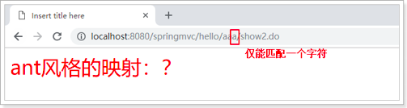


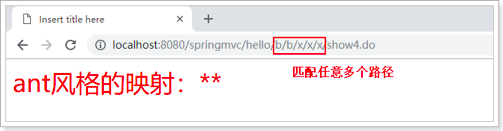

思考：

如果把 test3 方法的请求路径，改为"*/show3"， test4方法的请求路径，改为"**/show3"， 

1. 访问路径：localhost:8080/springmvc/hello/show3.do 会进入 test3 方法还是 test4 方法呢?

   test3

2. 访问路径：localhost:8080/springmvc/hello/bb/show3.do 会进入 test3 方法还是 test4 方法呢？

   test4

## 3、占位符的映射


> @RequestMapping(value=“/user/{userId}/{name} ")
>
> 请求URL：http://localhost:8080/user/1001/zhangsan.do
>
> 这种方式虽然和通配符“*”类似，却比通配符更加强大，占位符除了可以起到通配的作用，最精要的地方是在于它还可以传递参数。

比如：通过 @PathVariable("userId") Long id,  @PathVariable("name") String name 获取对应的参数。

注意：@PathVariable("key") 中的 key 必须和对应的占位符中的参数名一致，而方法形参的参数名可任意取

```java
@RequestMapping("show5/{name}/{id}")
public ModelAndView test5(@PathVariable("name")String name, @PathVariable("id")Long id){
  ModelAndView mv = new ModelAndView();
  mv.setViewName("hello");
  mv.addObject("msg", "rest风格的映射：name=" + name + ",id=" + id);
  return mv;
}
```

测试：

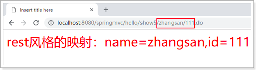

如果传递的参数类型和接受参数的形参类型不一致，则会自动转换，如果转换出错（例如：id传了abc字符串，方法形参使用Long来接受参数），则会报400错误（参数列表错误）

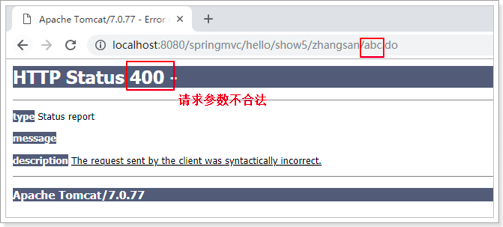

## 4、限定请求方法的映射

> @RequestMapping(value=””, method=RequestMethod.POST)

```java
@RequestMapping(value = "show6", method = RequestMethod.POST)
public ModelAndView test6(){
  ModelAndView mv = new ModelAndView();
  mv.setViewName("hello");
  mv.addObject("msg", "限定请求方法的映射：POST");
  return mv;
}
```

用到了框架提供的 RequestMethod 枚举类，源代码截图：


此时 show6 限定请求方法为 POST 请求，如果通过浏览器地址栏输入请求路径（也就是GET请求），结果：


地址栏无法模拟 POST 请求，需要使用浏览器插件，模拟 POST 请求，下面为 chrome 浏览器的模拟插件，参见课前资料

安装过程参见教程：

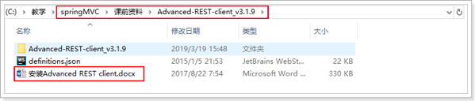

安装完成后的使用：应用 -- > Advanced REST client

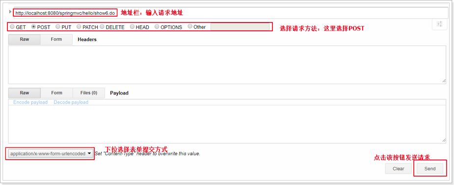

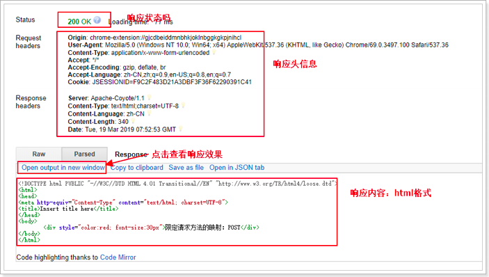

**限定多种请求方法**

@RequestMapping(value="", method={RequestMethod.POST, RequestMethod.GET})

```java
@RequestMapping(value = "show7", method = {RequestMethod.POST, RequestMethod.GET})
public ModelAndView test7(){
  ModelAndView mv = new ModelAndView();
  mv.setViewName("hello");
  mv.addObject("msg", "限定请求方法的映射：POST");
  return mv;
}
```

## 5、限定请求参数的映射

> @RequestMapping(value="",params="")
>
> params="userId"：请求参数中必须带有userId
>
> params="!userId"：请求参数中不能包含userId
>
> params="userId=1"：请求参数中userId必须为1
>
> params="userId!=1"：请求参数中userId必须不为1，参数中可以不包含userId
>
> params={"userId", "name"}：请求参数中必须有userId，name参数

```java
@RequestMapping(value = "show8", params = "id")
public ModelAndView test8() {
  ModelAndView mv = new ModelAndView("hello");
  mv.addObject("msg", "springmvc的映射之限定请求参数，id");
  return mv;
}

@RequestMapping(value = "show9", params = "!id")
public ModelAndView test9() {
  ModelAndView mv = new ModelAndView("hello");
  mv.addObject("msg", "springmvc的映射之限定请求参数，!id");
  return mv;
}

@RequestMapping(value = "show10", params = "id=1")
public ModelAndView test10() {
  ModelAndView mv = new ModelAndView("hello");
  mv.addObject("msg", "springmvc的映射之限定请求参数，id=1");
  return mv;
}

@RequestMapping(value = "show11", params = "id!=1")
public ModelAndView test11() {
  ModelAndView mv = new ModelAndView("hello");
  mv.addObject("msg", "springmvc的映射之限定请求参数，id!=1");
  return mv;
}

@RequestMapping(value = "show12", params = { "id", "name" })
public ModelAndView test12() {
  ModelAndView mv = new ModelAndView("hello");
  mv.addObject("msg", "springmvc的映射之限定请求参数，id,name");
  return mv;
}
```

## 6、限定请求头信息

> @RequestMapping(value="", heads="")

```java
/**
     * 1.请求头信息必须包含User-Agent
     * 2.User-Agent头参数的值必须为Mozilla/5.0 (Windows NT 10.0; Win64; x64) AppleWebKit/537.36 (KHTML, like Gecko) Chrome/69.0.3497.100 Safari/537.36
     *   即：限定浏览器必须是谷歌浏览器，而且版本还是Chrome/69.0.3497.100
     * @return
     */
@RequestMapping(value = "show13", headers = "User-Agent=Mozilla/5.0 (Windows NT 10.0; Win64; x64) AppleWebKit/537.36 (KHTML, like Gecko) Chrome/69.0.3497.100 Safari/537.36")
public ModelAndView test13() {
  ModelAndView mv = new ModelAndView("hello");
  mv.addObject("msg", "限定请求头信息");
  return mv;
}
```

谷歌浏览器测试：


火狐浏览器测试：


## 7、组合注解

> GetMapping：相当于RequestMapping（method = RequestMethod.GET）
>
> PostMapping：相当于RequestMapping（method = RequestMethod.POST）
>
> PutMapping：相当于RequestMapping（method = RequestMethod.PUT）
>
> DeleteMapping：相当于RequestMapping（method = RequestMethod.DELETE）

```java
@GetMapping(value = "show14")
public ModelAndView test14() {
  ModelAndView mv = new ModelAndView("hello");
  mv.addObject("msg", "GetMapping");
  return mv;
}

@PostMapping(value = "show15")
public ModelAndView test15() {
  ModelAndView mv = new ModelAndView("hello");
  mv.addObject("msg", "PostMapping");
  return mv;
}

@PutMapping(value = "show16")
public ModelAndView test16() {
  ModelAndView mv = new ModelAndView("hello");
  mv.addObject("msg", "PutMapping");
  return mv;
}

@DeleteMapping(value = "show17")
public ModelAndView test17() {
  ModelAndView mv = new ModelAndView("hello");
  mv.addObject("msg", "DeleteMapping");
  return mv;
}
```

# 五、接收数据及数据绑定

##  1、接收servlet的内置对象

> HttpServletRequest、HttpServletResponse、HttpSession

并且这些对象的接收非常简单，只需要在方法形参中有该对象就能接收，不需要任何配置

```java
 @RequestMapping("show18")
public ModelAndView test18(HttpServletRequest request, HttpServletResponse response, HttpSession session){
  ModelAndView mv = new ModelAndView("hello");
  StringBuffer sb = new StringBuffer();
  sb.append("request: " + request.toString() + "<br />");
  sb.append("response: " + response.toString() + "<br />");
  sb.append("session: " + session.toString() + "<br />");
  mv.addObject("msg", sb.toString());
  return mv;
}
```


## 2、SpringMVC特有内置对象

> controller 方法除了返回 ModelAndView，还可以返回 String。当返回值是 String 时，默认是视图名称。
>
> 那么数据模型怎么办？SpringMVC 提供了特有的内置对象：**Model ModelMap 本质都是Map**

```java
@RequestMapping("show19")
public String test19(Model model, ModelMap modelMap, Map<String, Object> map){
  // model.addAttribute("msg", "Model数据模型");
  // modelMap.addAttribute("msg", "ModelMap数据模型");
  map.put("msg", "Map数据模型");
  return "hello";
}
```

测试：

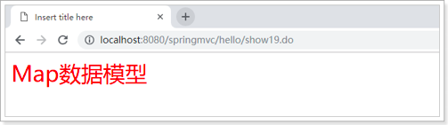

## 3、接收占位符参数

> 之前玩过 Rest 风格的 URL，rest 风格的 url 可以更优雅的传递参数。这些参数可以通过 @PathVariable 注解获取 @PathVariable(value="id") 获取占位符中的参数 
>
> 注意：(value="id") 不能省

```java
@RequestMapping("show20/{name}")
public String test20(@PathVariable("name")String name, Model model){
  model.addAttribute("msg", "获取占位符参数：" + name);
  return "hello";
}
```

测试：

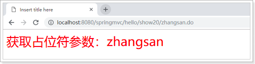

省略 @PathVariable(value="id") 中的 (value="id") 发现也能访问成功，是因为编译器开启了功能

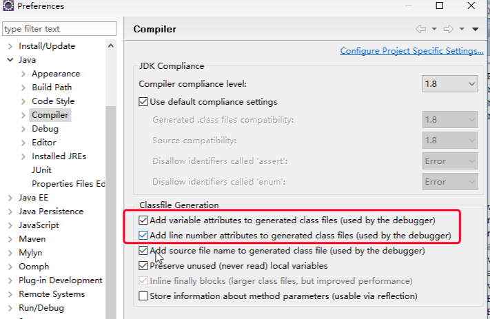

## 4、接收普通的请求参数

> @RequestParam(value="", required=true/false, defaultValue="")
>
> value：参数名
>
> required：是否必须，默认为true，标示请求参数中必须包含该参数，如果不包含则抛出异常
>
> defaultValue：默认参数值，如果设置了该值，required=true将失效，自动为false，如果请求中不包含该参数则使用默认值。

```java
@RequestMapping("show21")
public String test21(@RequestParam("name")String name, Model model){
  model.addAttribute("msg", "获取普通参数：" + name);
  return "hello";
}

@RequestMapping("show22")
public String test22(@RequestParam(value = "name", required = false)String name, Model model){
  model.addAttribute("msg", "获取普通参数：" + name);
  return "hello";
}

@RequestMapping("show23")
public String test23(@RequestParam(value = "name", defaultValue = "lisi")String name, Model model){
  model.addAttribute("msg", "获取普通参数：" + name);
  return "hello";
}
```

## 5、获取请求头信息

> @RequestHeader可以获取请求头信息，用法跟@RequestParam注解类似：
>
> name：作用等价于value，通常使用value
>
> required：是否必须，默认是true，请求头信息中必须包含该参数，否则抛出异常
>
> defaultValue：默认值。如果设置了该值，required=true将失效，自动为false，如果请求中不包含该参数则使用默认值。


```java
@RequestMapping("show24")
public String test24(@RequestHeader("User-Agent")String userAgent, Model model){
  model.addAttribute("msg", "获取请求头信息参数：" + userAgent);
  return "hello";
}
```

测试：


## 6、获取cookie

> @CookieValue使用方法同@RequestParam

```java
@RequestMapping("show25")
public String test25(@CookieValue("JSESSIONID")String sessionId, Model model){
  model.addAttribute("msg", "获取cookie中的参数：" + sessionId);
  return "hello";
}
```

测试：

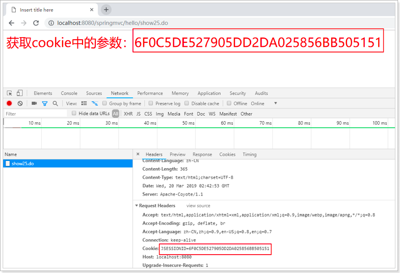

## 7、基本数据类型的绑定

> 字符串、整型、浮点型、布尔型、数组

在 WebContent 目录下，创建 user.html 表单：


```html
<!DOCTYPE html>
<html>
<head>
<meta charset="UTF-8">
<title>Insert title here</title>
</head>
<body>
	<form action="/hello/show19.do" >
		name:<input type="text" name="name" /><br />
		age:<input type="text" name="age" /><br />
		isMarry:<input type="checkbox" name="isMarry"/><br />
		income:<input type="text" name="income" /><br />
		interests:<input type="checkbox" name="interests" value="bb" />basketball
		<input type="checkbox" name="interests" value="fb" />football
		<input type="checkbox" name="interests" value="vb" />vollyball<br />
		<input type="submit" value="提交" />
	</form>

</body>
</html>
```

可以通过 localhost:8080/user.html 访问

```java
/**
     * 方法的返回值为void时，处理完业务逻辑后
     * 可以通过@ResponseStatus注解设置响应状态码
     * 告诉浏览器已经处理成功
     * @param name
     * @param age
     * @param isMarry
     * @param income
     * @param interests
     */
@RequestMapping("show26")
@ResponseStatus(value = HttpStatus.OK)
public void test26(@RequestParam("name") String name, @RequestParam("age") Integer age,
                   @RequestParam("isMarry") Boolean isMarry, @RequestParam("income") Double income,
                   @RequestParam("interests") String[] interests) {
  StringBuffer sb = new StringBuffer();
  sb.append("name: " + name + "\n");
  sb.append("age: " + age + "\n");
  sb.append("isMarry: " + isMarry + "\n");
  sb.append("income: " + income + "\n");
  sb.append("interests: [");
  for (String interest : interests) {
    sb.append(interest + " ");
  }
  sb.append("]");
  System.out.println(sb.toString());
}
```

相应状态 HttpStatus 是一个枚举类：


测试：

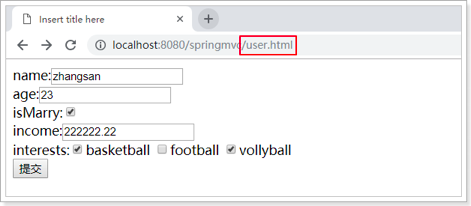

由于Controller方法没有任何返回值，所以浏览器没有任何信息：

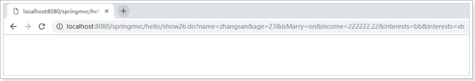

控制台：

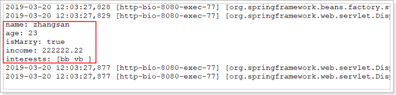

## 8、Pojo对象的绑定

> SpringMVC 会将请求参数名和 POJO 实体中的属性名(set方法)进行自动匹配，如果名称一致，将把值填充到对象属性中，并且支持级联（例如：user.dept.id）

Controller方法：

```java
@RequestMapping("show27")
public String test27(User user, @RequestParam("name") String name, Model model) {
  model.addAttribute("msg", user.toString() + "<br />" + name);
  return "hello";
}
```

测试：


User类：

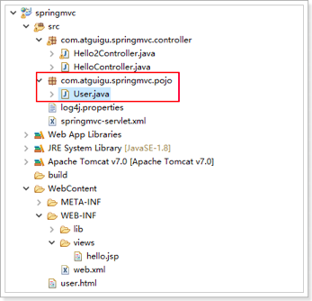

User内容：

```java
package cn.itcast.springmvc.pojo;

import java.util.Arrays;

public class User {
	private String name;
	private String userName;
	private Integer id;
	private Integer age;
	private Double income;
	private Boolean isMarry;
	private String[] interests;
	
	public String getUserName() {
		return userName;
	}
	public void setUserName(String userName) {
		this.userName = userName;
	}
	public Integer getId() {
		return id;
	}
	public void setId(Integer id) {
		this.id = id;
	}
	public String getName() {
		return name;
	}
	public void setName(String name) {
		this.name = name;
	}
	public Integer getAge() {
		return age;
	}
	public void setAge(Integer age) {
		this.age = age;
	}
	public Double getIncome() {
		return income;
	}
	public void setIncome(Double income) {
		this.income = income;
	}
	public Boolean getIsMarry() {
		return isMarry;
	}
	public void setIsMarry(Boolean isMarry) {
		this.isMarry = isMarry;
	}
	public String[] getInterests() {
		return interests;
	}
	public void setInterests(String[] interests) {
		this.interests = interests;
	}
	@Override
	public String toString() {
		return "User [name=" + name + ", age=" + age + ", income=" + income + ", isMarry=" + isMarry + ", interests="
				+ Arrays.toString(interests) + "]";
	}
	
}
```

思考：对象中嵌套对象该怎么接受呢？

## 9、集合的绑定

反例：直接接受集合对象

```java
@RequestMapping("show28")
public String test28(Model model, List<User> users) {
  model.addAttribute("msg", users.toString());
  return "hello";
}
```

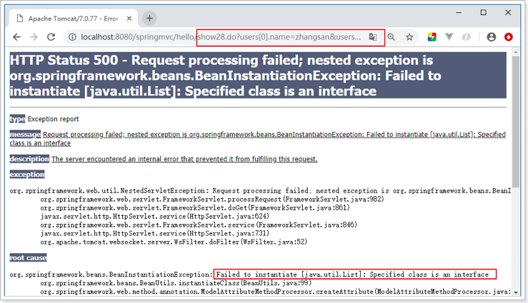

如果方法需要接受的 list 集合，不能够直接在方法中形参中使用List\<User>

List 的绑定，需要将 List 对象包装到一个类中才能绑定

要求：表单中 input 标签的 name 的值和集合中元素的属性名一致。

UserVO：


内容：

```java
package cn.itcast.springmvc.pojo;

import java.util.List;

public class UserVO {
	private List<User> users;

	public List<User> getUsers() {
		return users;
	}

	public void setUsers(List<User> users) {
		this.users = users;
	}

}
```

Controller 方法使用 UserVO 接收集合对象：


效果：


简单集合：

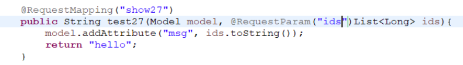

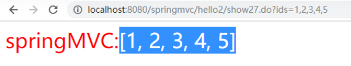

# 六、转发及重定向(forward、redirect)

> 通过前面的学习已知，controller方法的返回值有三种：
>
> 1. ModelAndView
>
> 2.     String
>
> 3.     void（了解）

前两种返回值都有视图名称字符串。当视图名称字符串是以"forward:"或者"redirect:"开头，则会被认为是转发或者重定向。

使用方式如下：

转发：forward:/hello/show.do 或者 forward:show.do

重定向：redirect:/hello/show.do 或者 redirect:show.do

==注意：后面必须跟上URL路径而非视图名==

传统的转发及重定向：

```java
request.getRequestDispatcher("show31.do?id=111&key=forward").forward(request, response);
response.sendRedirect("show31.do?id=222&key=redirect");
```

springMVC 方式的转发及重定向：

```java
/**
     * 测试转发
     * 并传递参数：id、key
     * @return
     */
@RequestMapping("show29")
public String test29() {
  return "forward:show31.do?id=111&key=forward";
}

/**
     * 测试重定向
     * 并传递参数：id、key
     * @return
     */
@RequestMapping("show30")
public String test30() {
  return "redirect:show31.do?id=222&key=redirect";
}

@RequestMapping("show31")
public String test31(Model model, @RequestParam("id")Long id, @RequestParam("key")String key) {
  model.addAttribute("msg", "forward?redirect: id=" + id + ", key=" + key);
  return "hello";
}
```

在 RestClient 测试转发（show29.do）：


在浏览器中测试转发：

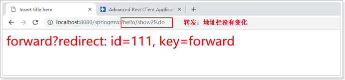

使用 RestClient 测试重定向（show30.do）：

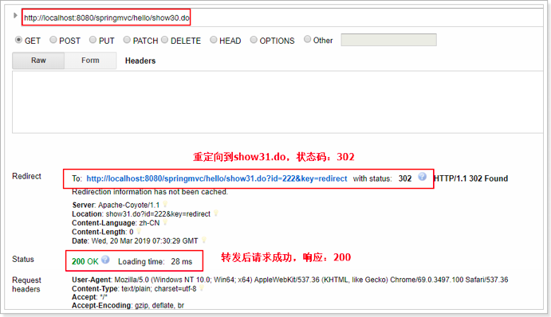

在浏览器地址栏测试重定向：


# 七、jstl标签的使用

> JSTL：标准标签库
>
> JSP标准标签库（JSTL）是一个 JSP 标签集合，它封装了 JSP 应用的通用核心功能。
>
> JSTL支持通用的、结构化的任务，比如迭代，条件判断，XML文档操作，国际化标签，SQL标签。

## 1、导入jstl依赖包

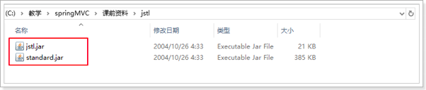

## 2、静态页面


内容

```jsp
<!DOCTYPE html>
<html>
<head>
<title>JSTL Demo</title>
</head>
<body>
	<table cellpadding=0 cellspacing=0 border="1">
		<thead>
			<tr>
				<th>ID</th>
				<th>UserName</th>
				<th>Name</th>
				<th>Age</th>
			</tr>
		</thead>
		<tbody>
			<tr>
				<td>1001</td>
				<td>zhangsan</td>
				<td>张三</td>
				<td>18</td>
			</tr>
			<tr>
				<td>1002</td>
				<td>lisi</td>
				<td>李四</td>
				<td>19</td>
			</tr>
			<tr>
				<td>1003</td>
				<td>wangwu</td>
				<td>王五</td>
				<td>20</td>
			</tr>
			<tr>
				<td>1004</td>
				<td>gary</td>
				<td>张三</td>
				<td>18</td>
			</tr>
			<tr>
				<td>1005</td>
				<td>gary</td>
				<td>张三</td>
				<td>18</td>
			</tr>
			<tr>
				<td>1006</td>
				<td>gary</td>
				<td>张三</td>
				<td>18</td>
			</tr>
			<tr>
				<td>1007</td>
				<td>gary</td>
				<td>张三</td>
				<td>18</td>
			</tr>
			<tr>
				<td>1008</td>
				<td>gary</td>
				<td>张三</td>
				<td>18</td>
			</tr>
		</tbody>
	</table>
</body>
</html>
```

##  3、jsp头信息

```jsp
<%@ page language="java" contentType="text/html; charset=UTF-8"
	pageEncoding="UTF-8"%>
```

## 4、引入核心标签库

```jsp
<%@ taglib prefix="c" uri="http://java.sun.com/jsp/jstl/core"%>
```

## 5、使用\<c:foreach>标签

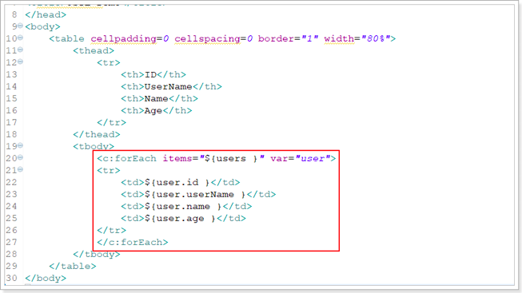

## 6、Controller方法

```java
@RequestMapping("show32")
public String test32(Model model){
  List<User> users = new ArrayList<>();
  for (int i = 0; i < 10; i++) {
    User user = new User();
    user.setId(i + 1);
    user.setName("马云" + i);
    user.setUserName("mayun" + i);
    user.setAge(20 + i);
    users.add(user);
  }
  model.addAttribute("users", users);
  return "users";
}
```

##  7、效果

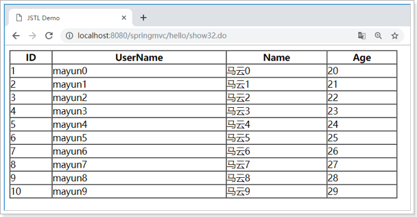

## 8、SpringMVC标签

### (1)、Jsp页面


user.jsp内容：

```jsp
<%@ page language="java" contentType="text/html; charset=UTF-8"
    pageEncoding="UTF-8"%>
<%@ taglib prefix="form" uri="http://www.springframework.org/tags/form" %>
<!DOCTYPE html PUBLIC "-//W3C//DTD HTML 4.01 Transitional//EN" "http://www.w3.org/TR/html4/loose.dtd">
<html>
	<head>
		<meta http-equiv="Content-Type" content="text/html; charset=UTF-8">
		<title>Insert title here</title>
	</head>
	<body>
		<!-- 
			form:form是form标签。
				action属性是提交给服务器的地址
				method 是提交的方式
				modelAttribute是form标签需要关联的表单对应模型
		 -->
		<form:form action="${ pageContext.request.contextPath }/hello/save.do" method="post" modelAttribute="user">
			<!-- form:input 相当于一个普通的输入框类型。
					path属性就是生成的表单项的name属性，然后它可以找到表单对象模型中的属性进行输出
			 -->
			userName:<form:input path="userName"/><br/>
			age:<form:input path="age"/><br/>
			salary:<form:input path="salary"/><br/>
			isMarry:<form:checkbox path="isMarry"/><br/>
			interests:<form:checkbox path="interests" value="football1"/>football
			<form:checkbox path="interests" value="basketball"/>basketball
			<form:checkbox path="interests" value="vollyball"/>vollyball
			<input type="submit" />
		</form:form>
	</body>
</html>
```

### (2)、Controller方法

```java
@RequestMapping("user")
public String toUser(Model model){
  model.addAttribute("user", new User());
  return "user";
}

@RequestMapping("save")
@ResponseStatus(value=HttpStatus.OK)
public void save(User user){
  System.out.println(user.toString());
}
```

### (3)、测试

访问user.jsp:


输入内容，点击提交：


# 八、JSON

> 在实际开发过程中，json是最为常见的一种方式，所以springmvc提供了一种更为简便的方式传递数据
>
> @ResponseBody 是把Controller方法返回值转化为 JSON，称为序列化
>
> @RequestBody  是把接收到的JSON数据转化为 Pojo对象，称为反序列化

## 1、引入jackson依赖包


## 2、原理

Json 的转化是由注解驱动完成的。

注解驱动会判断是否引入了 jackson 依赖，并决定是否加载 json 转化的消息转化器


## 3、@ResponseBody

> 当一个处理请求的方法标记为 @ResponseBody 时，表示该方法需要输出其他视图（json、xml），springmvc 通过默认的 json 转化器转化输出

Controller方法：

```java
/**
     * 需要把什么转化为json，就返回什么数据
     * 1.当方法上有@ResponseBody注解，代表方法的返回值需要输出其他视图
     * 2.把方法的返回值转化为其他视图（json）
     * @param model
     * @return
     */
@RequestMapping("show33")
@ResponseBody
public List<User> test33(Model model){
  List<User> users = new ArrayList<>();
  for (int i = 0; i < 10; i++) {
    User user = new User();
    user.setId(i + 1);
    user.setName("马云" + i);
    user.setUserName("mayun" + i);
    user.setAge(20 + i);
    users.add(user);
  }
  return users;
}
```

测试：


### (1)、@JsonFormat

> 格式化 json 中的时间字符串。

首先在 User 中添加日期类型的 birthday 字段。


改造show33方法：


在浏览器中测试：


显示格式极其不友好。

在 birthday 字段上使用 @JsonFormat 注解格式化日期：@JsonFormat(pattern="yyyy-MM-dd HH:mm:ss")


再次测试：


### (2)、@JsonIgnore

> 有些字段出于安全考虑，不太适合响应到浏览器（比如：password），像这类字段我们可以在查询时忽略该字段，也可以通过@JsonIgnore注解。

在 User 类中添加 password 字段及 getter 和 setter 方法：


再次改造show33方法：


测试：


在User类中的password字段上使用@JsonIgnore注解：


## 4、@RequestBody

```java
@RequestMapping("show34")
public String test34(@RequestBody User user, Model model){
  model.addAttribute("msg", user.toString());
  return "hello";
}
```


# 九、文件上传

> SpringMVC 的文件上传，底层也是使用的 Apache 的 Commons-fileupload

## 1、添加文件上传依赖包


## 2、文件上传解析器

在 springmvc-servlet.xml 中配置

```xml
<!-- 文件上传解析器 -->
<bean id="multipartResolver" class="org.springframework.web.multipart.commons.CommonsMultipartResolver">
  <!-- 设定文件编码 -->
  <property name="defaultEncoding" value="utf-8"></property>
  <!-- 设定文件上传最大值，单位为B  5M = 5 * 1024 * 1024 -->
  <property name="maxUploadSize" value="5242880"></property>
</bean>
```

## 3、Controller方法

```java
@RequestMapping(value = "show35")
public String test35(Model model, @RequestParam("file") MultipartFile file)
  throws IllegalStateException, IOException {
  if (file != null) {
    file.transferTo(new File("c:\\tmp\\" + file.getOriginalFilename()));
  }
  return "redirect:/success.html";
}
```

## 4、成功页面


在webapp目录下创建success.html文件

```html
<!DOCTYPE html>
<html>
<head>
<meta charset="UTF-8">
<title>Insert title here</title>
</head>
<body>
	<div style="font-size: 30px; color: red;">上传成功</div>
</body>
</html>
```

## 5、效果


# 十、异常处理

## 1、实现HandlerExceptionResolver接口


实现：

```java
@Component
public class MyException implements HandlerExceptionResolver {

  @Override
  public ModelAndView resolveException(HttpServletRequest request, HttpServletResponse response,
                                       Object handler, Exception ex) {

    ModelAndView mv = new ModelAndView();

    // 判断不同的异常，跳转到不同的页面或者现实显示不同的提示信息
    if (ex instanceof MaxUploadSizeExceededException) {
      mv.setViewName("hello");
      mv.addObject("msg", "您上传的文件太大了！！");
    } else if (ex instanceof RuntimeException) {
      mv.setViewName("hello");
      mv.addObject("msg", "抛出了运行时异常！！");
    }
    return mv;
  }

}
```

## 2、使用SimpleMappingExceptionResolver类映射异常跳转

HandlerExceptionResolver 异常解析器接口，提供了一些默认的实现类，其中有一个SimpleMappingExceptionResolver：


我们只需要简单的配置一下就可以使用了。

```xml
<!-- 配置SimpleMappingExceptionResolver简单异常解析器 -->
<bean class="org.springframework.web.servlet.handler.SimpleMappingExceptionResolver">
  <!-- 配置异常映射属性 -->
  <property name="exceptionMappings">
    <props>
      <!-- 
key：异常类的全路径
在prop标签中填写跳转路径
-->
      <prop key="org.springframework.web.multipart.MaxUploadSizeExceededException">forward:/errors/error1.jsp</prop>
      <prop key="java.lang.RuntimeException">forward:/errors/error2.jsp</prop>
    </props>
  </property>
</bean>
```

创建对应的jsp页面：


## 3、使用@ExceptionHandler注解

> 使用该注解有一个不好的地方就是：进行异常处理的方法必须与出错的方法在同一个Controller里面。

```java
@ExceptionHandler
public ModelAndView handleException(Exception ex){
  ModelAndView mv = new ModelAndView();
  mv.setViewName("hello");
  mv.addObject("msg", "出异常了");
  return mv;
}

@ExceptionHandler
public ModelAndView handleException2(RuntimeException ex){
  ModelAndView mv = new ModelAndView();
  mv.setViewName("hello");
  mv.addObject("msg", "运行时异常");
  return mv;
}
```

一个Controller里面可以定义多个异常处理的方法处理不同异常。

如果一个异常同时满足多个异常处理方法的异常，按照最精确原则匹配异常处理方法

## ==4、使用@ControllerAdvice + @ ExceptionHandler==


内容：

```java
/**
 * @ControllerAdvice可以处理所有Controller中产生的异常
 * @author joedy
 *
 */
@ControllerAdvice //添加这个注解
public class HandleExceptionControllerAdvice {

    @ExceptionHandler//添加这个注解
    public ModelAndView handleException(Exception ex){
        ModelAndView mv = new ModelAndView();
        mv.setViewName("hello");
        mv.addObject("msg", "出异常了-全局");
        return mv;
    }
    
    @ExceptionHandler
    public ModelAndView handleException2(RuntimeException ex){
        ModelAndView mv = new ModelAndView();
        mv.setViewName("hello");
        mv.addObject("msg", "运行时异常-全局");
        return mv;
    }
}
```

在局部异常处理和全局异常处理同时存在的时候，优先顺序是：

1、局部优先

2、精确优先

# 十一、拦截器

HandlerExecutionChain 是一个执行链，当请求到达 DispatchServlet 时，DispatchServlet 根据请求路径到HandlerMapping 查询具体的 Handler，从 HandlerMapping 返回给 DispatcherServlet，其中包含了一个具体的Handler 对象和 Interceptors（拦截器集合）。

如何自定义拦截器：

springmvc的拦截器接口（HandlerInterceptor）定义了三个方法：

a.preHandle 调用 Handler 之前执行，称为前置方法

返回值：true表示放行，后续业务逻辑继续执行

​          false表示被拦截，后续业务逻辑不再执行，但之前返回true的拦截器的完成方法会倒叙执行

b.postHandle调用Handler之后执行，称为后置方法

c.afterCompletion视图渲染完成之后执行

 ## 1、拦截器的执行过程


## 2、编写自定义拦截器


MyInterceptor内容：

```java
public class MyInterceptor implements HandlerInterceptor {

	/**
	 * 前置方法，在Handler方法执行之前执行，顺序执行
	 * 返回值，返回true拦截器放行 false拦截器不通过，后续业务逻辑不再执行
	 */
	@Override
	public boolean preHandle(HttpServletRequest request, HttpServletResponse response, Object handler)
			throws Exception {
		System.out.println("MyInterceptor1，前置方法正在执行");
		return true;
	}

	/**
	 * 后置方法，在执行完Handler方法之后执行，倒序执行
	 * 作用：打印日志，统计业务逻辑时长
	 */
	@Override
	public void postHandle(HttpServletRequest request, HttpServletResponse response, Object handler,
			ModelAndView modelAndView) throws Exception {
		System.out.println("MyInterceptor1，后置方法正在执行");
	}

	/**
	 * 完成方法，在视图渲染完成之后执行，倒序执行
	 * 处理异常，释放资源
	 */
	@Override
	public void afterCompletion(HttpServletRequest request, HttpServletResponse response, Object handler, Exception ex)
			throws Exception {
		System.out.println("MyInterceptor1，完成方法正在执行");
	}

}
```

## 3、配置拦截器

在 springmvc-servlet.xml 中配置自定义的拦截器，/**：拦截所有请求

```xml
<!-- 注册自定义的拦截器 -->
	<mvc:interceptors>
		<mvc:interceptor>
			<!-- 拦截所有请求 -->
			<mvc:mapping path="/**"/>
			<!-- 自定义拦截器的全路径 -->
			<bean class="com.atguigu.springmvc.interceptors.MyInterceptor"/>
		</mvc:interceptor>
	</mvc:interceptors>
```

## 4、测试


## 5、配置多个拦截器


编写拦截器2：

```java
public class MyInterceptor2 implements HandlerInterceptor {

	/**
	 * 前置方法，在Handler方法执行之前执行
	 * 返回值，返回true拦截器放行 false拦截器不通过，后续业务逻辑不再执行
	 */
	@Override
	public boolean preHandle(HttpServletRequest request, HttpServletResponse response, Object handler)
			throws Exception {
		System.out.println("MyInterceptor2，前置方法正在执行");
		return false;
	}

	/**
	 * 后置方法，在执行完Handler方法之后执行
	 */
	@Override
	public void postHandle(HttpServletRequest request, HttpServletResponse response, Object handler,
			ModelAndView modelAndView) throws Exception {
		System.out.println("MyInterceptor2，后置方法正在执行");
	}

	/**
	 * 完成方法，在视图渲染完成之后执行
	 */
	@Override
	public void afterCompletion(HttpServletRequest request, HttpServletResponse response, Object handler, Exception ex)
			throws Exception {
		System.out.println("MyInterceptor2，完成方法正在执行");
	}

}
```

配置拦截器2：

```xml
	<!-- 注册自定义的拦截器 -->
	<mvc:interceptors>
		<mvc:interceptor>
			<!-- 拦截所有请求 -->
			<mvc:mapping path="/**"/>
			<!-- 自定义拦截器的全路径 -->
			<bean class="com.atguigu.springmvc.interceptors.MyInterceptor"/>
		</mvc:interceptor>
		<mvc:interceptor>
			<!-- 拦截所有请求 -->
			<mvc:mapping path="/**"/>
			<!-- 自定义拦截器的全路径 -->
			<bean class="com.atguigu.springmvc.interceptors.MyInterceptor2"/>
		</mvc:interceptor>
	</mvc:interceptors>
```

测试：


结论：拦截器的前置方法依次执行，后置方法和完成方法倒续执行

当前置方法返回false时，后续的拦截器以及Handler方法不再执行，但它前序的前置方法返回true的拦截器的完成方法会倒续执行。

完成方法会在视图渲染完成之后才去执行。