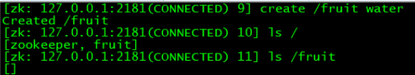
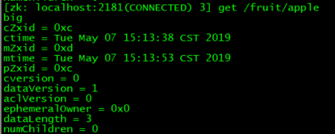
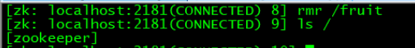
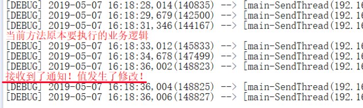
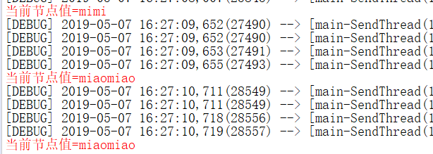
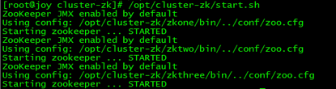

[TOC]


# 一、方法远程调用代码的对比

## 1、使用远程方法调用框架

```java
@Controller
public class HelloController {

	// 将封装了远程服务功能的接口类型的bean装配到当前组件
	@Autowired
	private EmpRemoteService empRemoteService;
	
	@RequestMapping("/aaa/bbb/ccc")
	public String doXxx(){
		
		// 像调用本地方法一样调用远程方法
		List<Emp> list = empRemoteService.getEmpList();
		
		// ...
	}

}
```

## 2不使用远程方法调用框架

```java
// 1.创建HttpClient实例
CloseableHttpClient client = HttpClientBuilder.create().build();
try {
// 2.声明服务器端URL地址
String url = "http://[服务器端实际IP]:54321/bookManager/book/getBook/23?requestParam=AAA";
// 3.创建具体请求方式实例
HttpGet get = new HttpGet(url);
// 4.调用客户端对象执行请求，进而获得响应对象
CloseableHttpResponse response = client.execute(get);
// 5.从响应结果中获取封装响应数据的Entity对象
HttpEntity entity = response.getEntity();
// 6.借助工具类将HttpEntity中包含的数据转换成可识别的字符串
String responseData = EntityUtils.toString(entity, "UTF-8");
// 7.处理响应结果
System.out.println(responseData);
//Ensures that the entity content is fully consumed and the content stream, if exists, is closed.
//确认entity的内容已经完全被consume了，而且如果内容的流存在，确认其已经关闭了。
EntityUtils.consume(entity);
} catch (ClientProtocolException e) {
e.printStackTrace();
} catch (IOException e) {
e.printStackTrace(); 
} finally {
// 8.释放连接，无论操作是否成功都必须释放连接
if(client != null) {try {client.close();} catch (IOException e) {e.printStackTrace();}}
}
```

# 二、远程方法调用框架和注册中心工作机制


## 1、技术方案一

Dubbo作为远程方法调用框架+Zookeeper作为注册中心

## 2、技术方案二

SpringBoot+SpringCloud

​					→Eureka作为注册中心

​					→Feign作为远程方法调用框架

# 三、Zookeeper


## 1、简介

ZooKeeper is a centralized service for maintaining configuration information, naming, providing distributed synchronization, and providing group services. All of these kinds of services are used in some form or another by distributed applications. Each time they are implemented there is a lot of work that goes into fixing the bugs and race conditions that are inevitable. Because of the difficulty of implementing these kinds of services, applications initially usually skimp on them, which make them brittle in the presence of change and difficult to manage. Even when done correctly, different implementations of these services lead to management complexity when the applications are deployed.

## 2、树形目录结构


ZooKeeper使用树形结构管理数据。而且以"/"作为树形结构的根节点。树形结构中的每一个节点都称为"znode"。文件系统中的目录可以存放其他目录和文件，znode中可以存放其他znode，也可以对应一个具体的值。znode和它对应的值之间是键值对的关系。

每一个znode上同时还有一套状态信息，称为：stat。

## 3、异步通知机制


在分布式项目中随着业务功能越来越多，具体的功能模块也会越来越多，一个大型的电商项目能达到几十个模块甚至更多。这么多业务模块的工程有可能需要共享一些信息，这些信息一旦发生变化，在各个相关模块工程中手动逐一修改会非常麻烦，甚至可能发生遗漏，严重的可能导致系统崩溃，造成经济损失。

使用ZooKeeper的通知机制后，各个模块工程在特定znode上设置Watcher（观察者）来监控当前节点上值的变化。一旦Watcher检测到了数据变化就会立即通知模块工程，从而自动实现"一处修改，处处生效"的效果。

## 4、leader-follower集群


# 四、Zookeeper安装

## 1、环境准备

Zookeeper需要在JVM虚拟机上运行，所以一定要保证有JDK支持。

```html
[root@rich redis]# java -version
java version "1.8.0_121"
Java(TM) SE Runtime Environment (build 1.8.0_121-b13)
Java HotSpot(TM) 64-Bit Server VM (build 25.121-b13, mixed mode)
```

## 2、上传Zookeeper

zookeeper-3.4.9.tar.gz

## 3、解压

```html
tar -zxvf /opt/zookeeper-3.4.9.tar.gz
```

## 4、准备配置文件

```html
cp /opt/zookeeper-3.4.9/conf/zoo_sample.cfg /opt/zookeeper-3.4.9/conf/zoo.cfg
```

Zookeeper要求配置文件的文件名必须是：zoo.cfg

## 5、创建数据目录

```html
mkdir /opt/zookeeper-3.4.9/data
```

## 6、在zoo.cfg中配置数据目录的位置

```html
dataDir=/opt/zookeeper-3.4.9/data
```

# 五、Zookeeper服务器端操作

## 1、zoo.cfg文件解读

**tickTime**

​       通信心跳数,ZooKeeper服务器心跳时间，单位毫秒

​       ZooKeeper使用的基本时间，服务器之间或客户端与服务器之间维持心跳的时间间隔，也就是每个tickTime时间就会发送一个心跳，时间单位为毫秒。

​       用于心跳机制，并且设置最小的session超时时间为两倍心跳时间(session的最小超时时间是2*tickTime)。

**initLimit**

​       LF初始通信时限

​       集群中的Follower跟随者服务器(F)与Leader领导者服务器(L)之间初始连接时能容忍的最多心跳数（tickTime的数量）。

​       投票选举新Leader的初始化时间，Follower在启动过程中，会从Leader同步所有最新数据，然后确定自己能够对外服务的起始状态。

​       Leader允许Follower在initLimit时间内完成这个工作。

**syncLimit**

​       LF同步通信时限

​       集群中Leader与Follower之间的最大响应时间单位，假如响应超过syncLimit * tickTime，Leader认为Follwer死掉，从服务器列表中删除Follwer。

​       在运行过程中，Leader负责与ZooKeeper集群中所有机器进行通信，例如通过一些心跳检测机制，来检测机器的存活状态。

​       如果L发出心跳包在syncLimit之后，还没有从F那收到响应，那么就认为这个F已经不在线了。

**dataDir**

​       数据文件目录+数据持久化路径

​       保存内存数据库快照信息的位置，如果没有其他说明，更新的事务日志也保存到数据库。

**clientPort**

​       客户端连接端口

## 2、常用命令

### ZooKeeper服务器与客户端

启动服务器：./zkServer.sh start

停止服务器：./zkServer.sh stop

启动客户端：./zkCli.sh   或者   ./zkCli.sh -server 127.0.0.1:2181

退出客户端：quit

### ls

查看当前znode中所包含的内容


没有相对路径，都要从"/"出发

### ls2

查看当前节点数据并能看到更新次数等状态信息


### stat

查看节点状态

### create

create [-s] [-e] path data acl 

普通创建：不带有-s、-e参数

-s：含有序列

-e：临时节点（重启或者超时消失）

acl：权限相关的东西（可以不写，Linux权限已获取，安装在上的Zookeeper权限也就有了）




### set

设置节点的具体值

set 节点value值


### get

获得节点的值

get节点



### delete

可以删除指定znode，当该znode拥有子znode时，必须先删除其所有子znode，否则操作将失败。

### rmr

rmr命令可用于代替delete命令，rmr是一个递归删除命令，如果发生指定节点拥有子节点时，rmr命令会首先删除子节点。



## 3、Zookeeper节点类型

PERSISTENTper-持久化目录节点

客户端与zookeeper断开连接后，该节点依旧存在

PERSISTENT_SEQUENTIAL-持久化顺序编号目录节点

客户端与zookeeper断开连接后，该节点依旧存在，只是Zookeeper给该节点名称进行顺序编号

EPHEMERAL-临时目录节点

客户端与zookeeper断开连接后，该节点被删除

EPHEMERAL_SEQUENTIAL-临时顺序编号目录节点

客户端与zookeeper断开连接后，该节点被删除，只是Zookeeper给该节点名称进行顺序编号

## 4、Zookeeper节点状态

### 介绍

znode维护了一个stat结构，这个stat包含数据变化的版本号、访问控制列表变化、还有时间戳。版本号和时间戳一起，可让ZooKeeper验证缓存和协调更新。每次znode的数据发生了变化，版本号就增加。

例如：无论何时客户端检索数据，它也一起检索数据的版本号。并且当客户端执行更新或删除时，客户端必须提供他正在改变的znode的版本号。如果它提供的版本号和真实的数据版本号不一致，更新将会失败。

### 属性

czxid：引起这个znode创建的zxid，创建节点的事务的zxid（ZooKeeper Transaction Id）

ctime：znode被创建的毫秒数(从1970年开始)

mzxid：znode最后更新的zxid

mtime：znode最后修改的毫秒数(从1970年开始)

pZxid：znode最后更新的子节点zxid

cversion：znode子节点变化号，znode子节点修改次数

dataversion：znode数据变化号

aclVersion：znode访问控制列表的变化号

ephemeralOwner：如果是临时节点，这个是znode拥有者的session id。如果不是临时节点则是0。

dataLength：znode的数据长度

numChildren：znode子节点数量

## 5、四字命令

### 介绍

ZooKeeper支持某些特定的四字命令，他们大多是用来查询ZooKeeper服务的当前状态及相关信息的，使用时通过telnet或nc向ZooKeeper提交相应命令。

### nc命令

nc命令需要安装对应的程序才可以使用。

```html
yum install -y nc
```

### 常用四字命令

ruok：测试服务是否处于正确状态。如果确实如此，那么服务返回"imok"，否则不做任何响应。


stat：输出关于性能和连接的客户端的列表

conf：输出相关服务配置的详细信息

cons：列出所有连接到服务器的客户端的完全的连接/会话的详细信息。包括“接受/ 发送”的包数量、会话id 、操作延迟、最后的操作执行等等信息

dump：列出未经处理的会话和临时节点

envi：输出关于服务环境的详细信息（区别于conf命令）

reqs：列出未经处理的请求

wchs：列出服务器watch的详细信息

wchc：通过session列出服务器watch的详细信息，它的输出是一个与watch相关的会话的列表

wchp：通过路径列出服务器watch的详细信息。它输出一个与session相关的路径

# 六、Java客户端

## 1、依赖信息

```xml
<dependency>
			<groupId>com.101tec</groupId>
			<artifactId>zkclient</artifactId>
			<version>0.10</version>
		</dependency>
		<dependency>
			<groupId>org.apache.zookeeper</groupId>
			<artifactId>zookeeper</artifactId>
			<version>3.4.9</version>
		</dependency>
```

## 2、主要功能代码

org.apache.zookeeper.ZooKeeper 类中常用方法

```java
//创建ZooKeeper对象并连接ZooKeeper服务器
public ZooKeeper(String connectString, int sessionTimeout, Watcher watcher); 
//断开ZooKeeper服务器连接
public synchronized void close(); 

//创建节点 acl:可以使用Ids.OPEN_ACL_UNSAFE  CreateMode本身是一个枚举类型
public void create(String path, byte[] data, List<ACL> acl, CreateMode createMode); 
//获取节点上的数据
public byte[] getData(String path, boolean watch, Stat stat);
//设置节点上的数据
public Stat setACL(String path, List<ACL> acl, int version)；
//判断节点是否存在
public Stat exists(String path, boolean watch);
```

## 3、创建并连接

```java
private ZooKeeper zooKeeper;
	
	{
		
		String connectString = "192.168.56.150:2181";
		int sessionTimeout = 5000; //会话超时时间
		Watcher watcher = new Watcher() {
			@Override
			public void process(WatchedEvent event) {}
		};
		
		try {
			//创建ZooKeeper对象 连接ZooKeeper服务器
			zooKeeper = new ZooKeeper(connectString, sessionTimeout, watcher);
		} catch (IOException e) {
			e.printStackTrace();
		}
	}
```

## 4、读取和修改节点数据

```java
@Test
	public void testUpdateNodeData() throws KeeperException, InterruptedException {
		// 要操作的节点的路径
		String path = "/animal/cat";
		// 获取节点当前值
		byte[] resultByteArray = zooKeeper.getData(path, false, new Stat());
		// 将字节数组封装为字符串
		String result = new String(resultByteArray);
		// 打印旧值
		System.out.println("old value="+result);
		// 获取新值字符串对应的字节数组
		byte[] newValueByteArray = new String("miaomiao").getBytes();
		// 指定当前操作所基于的版本号，如果不确定可以使用-1
		int version = -1;
		// 执行节点值的修改
		Stat stat = zooKeeper.setData(path, newValueByteArray, version);
		// 获取最新版本号
		int newVersion = stat.getVersion();
		System.out.println("newVersion="+newVersion);
		// 获取节点新值
		resultByteArray = zooKeeper.getData(path, false, new Stat());
		result = new String(resultByteArray);
		System.out.println("new value="+result);
	}
```

# 七、异步通知机制

## 1、工作机制介绍


客户端注册监听它关心的目录节点，当目录节点发生变化（数据改变、被删除、子目录节点增加删除）时，zookeeper会通知客户端。

ZooKeeper支持Watch（观察）机制，客户端可以在每个znode结点上设置一个Watcher（观察者）。如果被观察服务端的znode结点有变更，那么Watcher就会被触发，这个Watcher所属的客户端将接收到一个通知包被告知结点已经发生变化，这就是把相应的事件通知给设置过Watcher的Client端。

ZooKeeper里的所有读取操作：getData(),getChildren()和exists()都有设置Watch的选项。

总结成一句话：**ZooKeeper的观察机制是一种异步回调的触发机制**。

当数据有了变化时zkServer向客户端发送一个Watch通知，这是个一次性动作，触发一次就失效了。

如果想继续Watch的话，需要客户端重新设置Watcher。因此如果你得到了一个Watch事件，并且在将来继续得到节点变化通知，那么就必须另外设置一个新的Watcher继续观察。

节点有不同的改动方式。可以认为ZooKeeper维护两个观察列表：数据观察和子节点观察。getData()和exists()设置数据观察。getChildren()设置子节点观察。此外，还可以认为不同的返回数据有不同的观察。getData()和exists()返回节点的数据，而getChildren()返回子节点列表。所以，setData()将为znode触发数据观察。成功的create()将为新创建的节点触发数据观察，为其父节点触发子节点观察。成功的delete()将会为被删除的节点触发数据观察以及子节点观察（因为节点不能再有子节点了），为其父节点触发子节点观察。如果一个节点设置存在观察时尚未创建，并且在断开连接后执行节点创建以及删除操作，那么这个节点上设置的观察事件客户端接收不到，事件会丢失。

## 2、一次性通知

```java
@Test
public void testNoticeOnce() throws KeeperException, InterruptedException {

  String path = "/animal/cat";
  Watcher watcher = new Watcher() {
    @Override
    // 当前Watcher检测到节点值的修改，会调用这个process()方法
    public void process(WatchedEvent event) {
      System.err.println("接收到了通知！值发生了修改！");
    }
  };

  byte[] oldValue = zooKeeper.getData(path, watcher, new Stat());
  System.out.println("old value="+new String(oldValue));

  while(true) {
    Thread.sleep(5000);
    System.err.println("当前方法原本要执行的业务逻辑");
  }
}
```

在zookeeper的服务端修改节点的值


可以看到异步通知回来了



但是异步通知只会通知一次，第二次在服务端再次修改值就不会再通知回来了

## 3、持续通知

```java
@Test
public void testNoticeForever() throws KeeperException, InterruptedException {

  String path = "/animal/cat";
  getDataWithNotice(zooKeeper, path);
  while(true) {
    Thread.sleep(5000);
    System.err.println("当前方法原本要执行的业务逻辑 线程名称："+Thread.currentThread().getName());
  }
}

public void getDataWithNotice(ZooKeeper zooKeeper, String path) throws KeeperException, InterruptedException {

  byte[] resultByteArray = zooKeeper.getData(path, new Watcher() {
    @Override
    public void process(WatchedEvent event) {

      // 以类似递归的方式调用getDataWithNotice()方法实现持续监控
      try {
        getDataWithNotice(zooKeeper, path);
        System.err.println("通知 线程名称："+Thread.currentThread().getName());
      } catch (Exception e) {
        e.printStackTrace();
      }

    }
  }, new Stat());

  String result = new String(resultByteArray);
  System.err.println("当前节点值="+result);
}
```

在zookeeper的服务端执行下面三次修改


可以看到异步通知每次都来了



# 八、集群

没有读写的分离，不像Redis需要额外的哨兵机制，zookeeper自己就能管理

## 1、数据通信机制


## 2、搭建步骤

第1步：创建集群所在目录

```html
mkdir /opt/cluster-zk
```

第2步：重新解压tar包到集群目录

```html
tar -zxvf /opt/zookeeper-3.4.9.tar.gz -C /opt/cluster-zk/
```

第3步：复制新的解压目录

```html
cp -r /opt/cluster-zk/zookeeper-3.4.9/ /opt/cluster-zk/zkone
```

第4步：配置zkone

​	i：创建zoo.cfg配置文件

```html
cp /opt/cluster-zk/zkone/conf/zoo_sample.cfg /opt/cluster-zk/zkone/conf/zoo.cfg
```

​	ii：创建数据目录

```html
mkdir /opt/cluster-zk/zkone/data
```

​	iii：在数据目录中创建编号文件

```html
vim /opt/cluster-zk/zkone/data/myid
```

​	iv：编辑编号文件，内容就是当前服务器实例的编号

```html
	1
```

​	v：配置zoo.cfg

```html
dataDir=/opt/cluster-zk/zkone/data
clientPort=1000
server.1=127.0.0.1:1001:1002
server.2=127.0.0.1:2001:2002
server.3=127.0.0.1:3001:3002
```

server.1=127.0.0.1:1001:1002

1代表编号   1001使用通信的端口号  1002是用来选举的端口号

第5步：配置zktwo

​	i：把zktwo复制出来

```html
cp -r /opt/cluster-zk/zkone /opt/cluster-zk/zktwo
```

​	ii：修改myid文件中编号值

```html
vim /opt/cluster-zk/zktwo/data/myid
```

​	将1改成2

​	iii：修改zoo.cfg

```html
dataDir=/opt/cluster-zk/zktwo/data
clientPort=2000
```

第6步：配置zkthree

​	i：把zkthree复制出来

```html
cp -r /opt/cluster-zk/zkone /opt/cluster-zk/zkthree
```

​	ii：修改myid文件中编号值

```html
vim /opt/cluster-zk/zkthree/data/myid
```

​	将1改成3

​	iii：修改zoo.cfg

```html
dataDir=/opt/cluster-zk/zkthree/data
clientPort=3000
```

## 3、创建操作服务器的可执行脚本

创建文件

```html
/opt/cluster-zk/start.sh
/opt/cluster-zk/stop.sh
/opt/cluster-zk/status.sh
```

编辑启动服务器命令

```html
/opt/cluster-zk/zkone/bin/zkServer.sh start
/opt/cluster-zk/zktwo/bin/zkServer.sh start
/opt/cluster-zk/zkthree/bin/zkServer.sh start
```

编辑查看服务器状态命令

```html
/opt/cluster-zk/zkone/bin/zkServer.sh status
/opt/cluster-zk/zktwo/bin/zkServer.sh status
/opt/cluster-zk/zkthree/bin/zkServer.sh status
```

编辑停止服务器命令

```html
/opt/cluster-zk/zkone/bin/zkServer.sh stop
/opt/cluster-zk/zktwo/bin/zkServer.sh stop
/opt/cluster-zk/zkthree/bin/zkServer.sh stop
```

给脚本文件设置可执行权限

```html
chmod 755 /opt/cluster-zk/start.sh 
chmod 755 /opt/cluster-zk/stop.sh 
chmod 755 /opt/cluster-zk/status.sh
```


改为-rwxr-xr-x   对应755

执行脚本

```html
/opt/cluster-zk/start.sh 
```



```html
/opt/cluster-zk/status.sh 
```


可以看到自动选举了zktwo为leader，zkone和zkthree为follower

```html
/opt/cluster-zk/stop.sh 
```

客户端登录

```html
/opt/zookeeper-3.4.9/bin/zkCli.sh -server 127.0.0.1:1000
/opt/zookeeper-3.4.9/bin/zkCli.sh -server 127.0.0.1:2000
/opt/zookeeper-3.4.9/bin/zkCli.sh -server 127.0.0.1:3000
```

## 4、集群中服务器数量

结论：一般来说，集群中服务器数量最好设置为单数。

原则：集群中有超过一半的服务器正常工程，则整个集群判断为正常工作。对外提供服务时大致满足预期。

推导：

​	共2实例：宕机1实例，剩下1=2/2，没有超过一半。死亡容忍度为0。

​	共3实例：宕机1实例，剩下2>3/2，超过一半。死亡容忍度为1。

​	共4实例：宕机1实例，剩下3>4/2，超过一半。死亡容忍度为1。

​	共5实例：宕机2实例，剩下3>5/2，超过一半。死亡容忍度为2。

​	共6实例：宕机2实例，剩下4>6/2，超过一半。死亡容忍度为2。

# 九、Dubbo介绍

## 1、RPC

Remote Procedure Call

远程过程调用


## 2、Dubbo架构


## 3、Dubbo在Zookeeper中注册信息的结构


# 十、Dubbo使用

## 1、创建Common工程

group id：com.atguigu.dubbo

artifact id：Pro20-dubbo-common

package：jar

```java
public class Employee implements Serializable {
	
	private static final long serialVersionUID = 1L;
	
	private Integer empId;
	private String empName;
	private Double salary;
	……

```

```java
public interface EmployeeRemoteService {
	List<Employee> getEmployeeByConditionRemote(Employee employee);
}
```

## 2、创建Provider工程

group id：com.atguigu.dubbo

artifact id：Pro21-dubbo-provider

package：war

pom.xml依赖

```xml
<dependency>
	<groupId>cglib</groupId>
	<artifactId>cglib</artifactId>
	<version>2.2</version>
</dependency>
<dependency>
	<groupId>org.aspectj</groupId>
	<artifactId>aspectjweaver</artifactId>
	<version>1.6.8</version>
</dependency>
<dependency>
	<groupId>com.alibaba</groupId>
	<artifactId>dubbo</artifactId>
	<version>2.5.5</version>
</dependency>
<dependency>
	<groupId>com.github.sgroschupf</groupId>
	<artifactId>zkclient</artifactId>
	<version>0.1</version>
</dependency>
<dependency>
	<groupId>com.atguigu.dubbo</groupId>
	<artifactId>Pro20-dubbo-common</artifactId>
	<version>0.0.1-SNAPSHOT</version>
</dependency>
```

配置web.xml

```xml
<context-param>
	<param-name>contextConfigLocation</param-name>
	<param-value>classpath:spring-dubbo.xml</param-value>
</context-param>

<listener>
	<listener-class>org.springframework.web.context.ContextLoaderListener</listener-class>
</listener>
```

Spring配置文件中Dubbo的配置

```xml
<!-- Dubbo配置：指定当前Web应用名称，便于在注册中心中注册 -->
<dubbo:application name="atguigu-dubbo-provider"/>

<!-- Dubbo配置：指定注册中心的种类以及位置 -->
<dubbo:registry protocol="zookeeper" address="192.168.56.100" port="2181"/>

<!-- Dubbo配置：指定Dubbo的Provider本身监听的端口号 -->
<dubbo:protocol name="dubbo" port="20880"/>

<!-- 配置接口实现类的bean -->
<bean id="employeeRemoteService" class="com.atguigu.dubbo.service.EmployeeRemoteServiceImpl"/>

<!-- Dubbo配置：给远程方法接口指定实现类 -->
<dubbo:service interface="com.atguigu.dubbo.api.EmployeeRemoteService" ref="employeeRemoteService"/>
```

EmployeeServiceImpl实现类

```java
public class EmployeeServiceImpl implements EmployeeRemoteService {

	@Override
	public List<Employee> getEmployeeByConditionRemote(Employee employee) {
		
		System.out.println(employee);
		
		List<Employee> empList = new ArrayList<>();
		
		empList.add(new Employee(111, "empName111", 111.11));
		empList.add(new Employee(222, "empName222", 222.22));
		empList.add(new Employee(333, "empName333", 333.33));
		
		return empList;
	}

}
```


## 3、创建新Tomcat镜像


## 4、创建Consumer工程

group id：com.atguigu.dubbo

artifact id：Pro22-dubbo-consumer

package：war

配置web.xml

```xml
<servlet>
	<servlet-name>springDispatcherServlet</servlet-name>
	<servlet-class>org.springframework.web.servlet.DispatcherServlet</servlet-class>
	<init-param>
		<param-name>contextConfigLocation</param-name>
		<param-value>classpath:spring-mvc.xml</param-value>
	</init-param>
	<load-on-startup>1</load-on-startup>
</servlet>

<servlet-mapping>
	<servlet-name>springDispatcherServlet</servlet-name>
	<url-pattern>/</url-pattern>
</servlet-mapping>
```

配置Spring

```xml
<!-- SpringMVC相关配置 -->
<context:component-scan base-package="com.atguigu.dubbo.handler"/>
<bean id="viewResolver" class="org.springframework.web.servlet.view.InternalResourceViewResolver">
	<property name="prefix" value="/WEB-INF/"/>
	<property name="suffix" value=".jsp"/>
</bean>
<mvc:annotation-driven/>
<mvc:default-servlet-handler/>

<!-- Dubbo配置：当前应用名称 -->
<dubbo:application name="atguigu-dubbo-consumer"/>

<!-- Dubbo配置：指定注册中心位置 -->
<dubbo:registry protocol="zookeeper" address="192.168.56.100" port="2181"/>

<!-- Dubbo配置：引用Provider提供的可以远程调用的服务 -->
<dubbo:reference id="employeeRemoteService"  interface="com.atguigu.dubbo.api.EmployeeRemoteService"/>
```

测试类

```java
@Controller
public class EmployeeHandler {
	
	@Autowired
	private EmployeeRemoteService employeeRemoteService;
	
	@RequestMapping("/get/emp/list")
	public String getEmpList() {
		
		Employee employee = new Employee(666, "empName666", 666.66);
		
		List<Employee> list = employeeRemoteService.getEmployeeByConditionRemote(employee);
		
		for (Employee employee2 : list) {
			System.out.println(employee2);
		}
		
		return "target";
	}

}
```

访问这个请求 将能实现远程调用