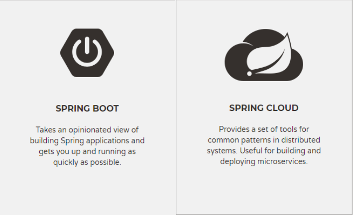

[TOC]

# 一、项目架构

## 1、单一架构

描述：一个项目整体只有一个工程。

其他名称：all in one或"单机版"

## 2、分布式架构

### (1)、伪分布式

开发时使用了多个工程，但在服务器上运行时只有一个war包。

### (2)、真正分布式

# 二、方法本地调用和远程调用

## 1、本地调用

调用当前项目内部的方法，调用过程没有经过网络。

## 2、远程调用

通过网络调用另外一个工程里的另一个方法。

## 3、实现方法远程调用的技术

### (1)、WebService

WebService不是一个具体的技术，而是一系列方法远程调用技术的统称。

### (2)、Dubbo+Zookeeper

Dubbo是阿里开发的一款RPC框架——底层基于RPC（远程过程调用）的方法远程调用和服务治理框架。

Zookeeper 是Apacahe Hadoop的子项目，是一个**树型的目录服务**，支持**变更推送**，适合作为 Dubbo 服务的注册中心，工业强度较高，可用于生产环境，并推荐使用。

在分布式架构体系中Dubbo扮演了服务治理框架的角色，Zookeeper扮演了服务注册中心的角色。

### (3)、SpringBoot+SpringCloud

## 4、方法远程调用的意义

### (1)、对项目内部来说

让我们能够实现分布式架构。

### (2)、对项目外部来说

让我们能够调用外部的第三方接口。

# 三、分布式架构的优缺点

## 1、优点

### (1)、模块化、组件化程度更高

让项目更容易开发、维护和分工。也是高内聚、低耦合的一种体现。

### (2)、提升性能

需要用到分布式架构的项目往往是访问量很大的互联网项目。

集群[同构]：多个服务器上运行相同的模块

分布式[异构]：多个服务器上运行不同的模块

## 2、缺点

相对于单一架构结构更复杂，部署更复杂，同时存在数据不一致问题，需要通过分布式事务解决。

# 四、服务

## 1、接口

对外暴露具体功能的接口已经包括了外部调用时所需要的全部信息，所以这个接口就成了整个功能的代表。

所以在团队交流时就使用接口指代整个工程。

"写接口"：开发接口代表的工程。

"调接口"：调用接口代表的工程。

## 2、服务

和操作系统提供的"守护进程"形式服务很像，它持续在运行，随时可以响应请求——提供服务。

## 3、SOA

Service Oriented Architecture

面向服务的架构。

底层基于"服务"之间的调用设计项目架构。把相同功能封装到一个或一组服务中。

## 4、微服务

服务的"微小化"

# 五、中间件

## 1、传统开发的组件

## 2、中间件

# 六、由浅入深了解/介绍分布式系统

## 1、分布式架构实现技术

* Dubbo+Zookeeper

* SpringBoot+SpringCloud

## 2、工程

* 工程清单
* 工程之间关系
  * 继承
  * 聚合
  * 依赖
* 工程的作用

## 3、中间件

* 用到了哪些中间件
* 具体中间件和哪些功能相关

## 4、一个请求处理流程

浏览器→consumer→provider→中间件/provider→返回值

## 5、业务功能

子系统→模块→子模块→类→……

了解或介绍一个项目架构的步骤：

- 确定总体上是单一架构还是分布式架构
  - 单一架构
    - 数据库
    - 框架
    - 前端技术
    - 确定工程之间的关系
      - 继承关系（Maven提供）
      - 聚合关系（Maven提供）
      - 依赖关系（Maven提供）
  - 分布式架构
    - 确定Dubbo+Zookeeper还是SpringBoot+SpringCloud
    - 确定整个项目中有哪些工程
    - 确定工程之间的关系
      - 继承关系（Maven提供）
      - 聚合关系（Maven提供）
      - 依赖关系（Maven提供）
      - 调用关系（远程调用技术提供）
    - 每个工程的大致作用
    - 用到了哪些中间件（Redis、文件存储服务器、消息队列、搜索引擎……）