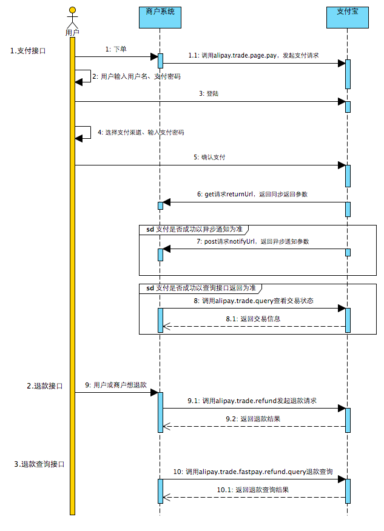
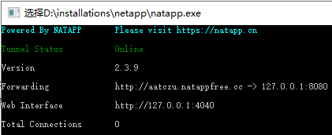

# 第五章 接入支付

## 1.蚂蚁金服文档地址

文档入口：https://docs.open.alipay.com/270<br/>

沙箱文档入口：https://docs.open.alipay.com/200/105311<br/>

## 2.支付流程



## 3.内网穿透

### ①目的

让本地运行的项目可以通过外网访问。

### ②工作机制


### ③NATAPP内网穿透服务使用

- 注册账号

- 登录

- ★实名认证

- 我的隧道

  - 购买隧道
  - 免费隧道

- 下载客户端

  https://natapp.cn/#download

- 准备config.int文件

  - 下载地址

    http://download.natapp.cn/assets/downloads/config.ini

  - 教程地址

    https://natapp.cn/article/config_ini

- 在config.ini中配置authtoken

  - 配置项

    authtoken

  - 属性值

    登录NATAPP->我的隧道->authtoken

```ini
#authtoken每个人不一样，这个文件仅供参考
#将本文件放置于natapp同级目录 程序将读取 [default] 段
#在命令行参数模式如 natapp -authtoken=xxx 等相同参数将会覆盖掉此配置
#命令行参数 -config= 可以指定任意config.ini文件
[default]
authtoken=79a1980a333f8a5f      #对应一条隧道的authtoken
clienttoken=                    #对应客户端的clienttoken,将会忽略authtoken,若无请留空,
log=none                        #log 日志文件,可指定本地文件, none=不做记录,stdout=直接屏幕输出 ,默认为none
loglevel=ERROR                  #日志等级 DEBUG, INFO, WARNING, ERROR 默认为 DEBUG
http_proxy=                     #代理设置 如 http://10.123.10.10:3128 非代理上网用户请务必留空
```

启动natapp.exe，如果上面操作成功，会看到下面效果：<br/>



### ④测试效果

#### [1]启动本地应用

本地应用监听的端口号需要和隧道一致，比如都是8080

#### [2]通过隧道暴露到外网的域名访问本地应用

例如：http://aatczu.natappfree.cc/apple/to/thymeleaf/page

## 4.密钥相关的背景知识

### ①加密方式介绍

#### [1]对称加密

明文：亲爱的，今晚8点，老地方见。<br/>

加密步骤1[转换为拼音]：qinaidedouhaojinwanbadiandouhaolaodifangjian<br/>

加密步骤2[将字母转换为序号]：13261205041101...220907<br/>

加密步骤3[将序号+5]：18311710091609..271413<br/>

密文：18311710091609..271413<br/>

解密步骤1[将序号-5]：13261205041101...220907<br/>

解密步骤2[将序号还原为字母]：qinaidedouhaojinwanbadiandouhaolaodifangjian<br/>

解密步骤3[将拼音还原为明文]：亲爱的，今晚8点，老地方见。<br/>

问题：一旦加密方式被敌人知道，敌人就会将密文反推出明文。<br/>

#### [2]非对称加密


所谓非对称加密，就是说加密和解密分别使用不同钥匙。私钥加密就必须用公钥解密，公钥加密就必须使用私钥解密。

### ②加签过程


### ③验签过程


## 5.官方Demo使用

### ①Demo工程下载地址

https://docs.open.alipay.com/270/106291/

### ②沙箱环境地址

https://openhome.alipay.com/platform/appDaily.htm<br/>

访问这个地址查看相关参数

### ③生成密钥文档地址

https://docs.open.alipay.com/291/105971<br/>

下载RSA签名验签工具windows_V1.4工具<br/>

运行RSA签名验签工具.bat文件<br/>

点击生成密钥<br/>

### ③AlipayConfig类的设置

```java
// 应用ID,您的APPID，收款账号既是您的APPID对应支付宝账号
public static String app_id = "2016080400166558";

// 商户私钥，您的PKCS8格式RSA2私钥
public static String merchant_private_key = "MIIEvAIBADANBgkqhkiG9w0BAQEFAASCBKYwggSiAgEAAoIBAQCFQW6qf6lu6Sa1tREhws78MQSfAjdBZAEnME5wRcM5lLHiYuBvazid8NUzubKVqaFIa0iwsYW0ExKIsgf5PQpSFwiLYSJB3+jvJK0tlZmolJCOyVbWIfj8o4APiimRRupoYBhvLObz+KJ2L9+kXPHQrOXMIJyFKDYN/tRGHlcgty5pBvl9zC6Oz/xF4PrSSDGz33SbsxurZKkPrdt+V2jlyRCMkFDiOTSmbmM6Q1kdp/yT4zK5igAV3K8LgmxgrsPOV3PsGvQTGVSFbrrEUvEAYJ7EK9G6aXBy+xBDaxrM33Lb8q3wVRwnpnZ1DcgH4fTSlI4fhJmCxZzp6peg22QTAgMBAAECggEAYBlrFNySNWFBQGO/YiiamzdCjOXNMYRMbJWiy8cT3o/EpW4HS3L41rZbGz19c/9sR8zPFFZCBTaH9DroEy+ZJNBloha/3N/8nZJGrgwoT3IsujyrOiwv4wqKjSpnhdStse4zUOICAMo7Z55o26EH5yT5aHfQSRtRuFAhiBvTW8yUu6K+COXJfGGhC95DhyIokUkAHWAFKtwCpdzMONaq4X8RgHy17Qf0FOo8elIaJ8A/pYDcENaCf7cWtZKocT43f4MVH4/O4d6rqgSG3KiVW8zu9yo+D1qVFsAlJLFGFop66iQ5CRklumt/cWUsUkTFtOyIotDrDotDHdJIvq+xaQKBgQC/9dln2y3yER2BBUYWgmK0zVr9xzYsyqw1PFl+1S9PWupt8jBJJwFJzUy0XhblfwpjzqpVEqpdtFjYEdYmT9EwFjcQCBqjYn1L6RjJUJnBgk51vdOfoNomo/Tf5gu69TuR7sl6y5vS8i/5BazZTjJeNf/KgMCavVTJCuDxninblwKBgQCxtfjBH6XrlBPZ/r0d1q1IUfH5CQQ5NumM3d4dKOI6fBab+cORJNXcpDMnkE/7NiwoKEVaaskEwnNuTaM01icMPkS1tXJg/AU64KMBHZUXAf/ANwmnvjOZ0GHoNmHgxFEA82fJVfg3PqG7Cvxkm42rm45b2rqJ5wFK/CpbC9x65QKBgBdt62Yos1frTN2VhjNzIJcOxX9aFDutVQ1+WzIG1SprX1eiCtCy6Q5X93fAUC0cr2j1LYcKqy6at4lPzAKLFW44F+pmAtJUUBS206amps2emPL4A19lY5r5wgad7mqYSfgK3B6XwWIi20YasjknuTAUiS7vPhLk7vdG06PJ+TPrAoGAXQb4UAiEL70VY0GBuFP/4+LZu1bn+hdvzQj70+HqA1mf8EigAqP4vAbMrIJUDBpApUjnfTx3PGGaUXyc2fTc/gC+sSxp0rE6/6ZGTjgxKpkmS3XEPSZJFtTJ2+hT9nhuOwQwKWoyhKDpwuMuWnA/ijzlGdp3WecuexVkCsM7yK0CgYBTUw2CZZy0JgJBS3O/SUe3HqhywKSFXkFrPaF8jj9B4wFkJHKb4EKcIV+12IcFqV3++rSpF6ZTibz0jhIA2nzMtuP5Kij4Vq3ISKjyx01NQqmdE3x6f8/nirLfVfciSCDvaiIFF1cMhsk+t/jScCwGkk88xhrhrIKJ9klAmgN2LQ==";

// [正式环境]支付宝公钥,查看地址：https://openhome.alipay.com/platform/keyManage.htm 对应APPID下的支付宝公钥。
// [沙箱环境]支付宝公钥,查看地址：https://openhome.alipay.com/platform/appDaily.htm 信息配置->必看部分->RSA2(SHA256)密钥(推荐)->查看支付宝公钥
public static String alipay_public_key = "MIIBIjANBgkqhkiG9w0BAQEFAAOCAQ8AMIIBCgKCAQEAmthQwmxlCowktqwc+237Enxs7FfNoVMi9BlCA430Vor2Z1IPIDOOdarYdOQLMxl/PxZfgl/6iMRJB43kzfPVFezJ9xim8AC07ZCVi1NZop3q6qhL3s7w5o809BvkaIVnThpSfvifO3wUxBImXwnSfLaD9CMjtNbD4ri1sDQ3CV+g66nR3oIQTfEMAif7GafDkt4nnG+lcd7tOoOsM+6anP8t6M+KDzcpBZ3wsPEIlJVIQgLbBx61g5QZ/p+piDwl0h85QTnz68qHXCE3JRn8MDWOarKEQkFXbuAis2YbJ8agVDpBomrok2i71jdJn863TLsvB76kRjeq1Ygf5YhQWQIDAQAB";

// 服务器异步通知页面路径  需http://格式的完整路径，不能加?id=123这类自定义参数，必须外网可以正常访问
// public static String notify_url = "http://工程公网访问地址/alipay.trade.page.pay-JAVA-UTF-8/notify_url.jsp";

// 使用内网穿透提供的对外暴露域名
public static String notify_url = "http://aatczu.natappfree.cc/alipay.trade.page.pay-JAVA-UTF-8/notify_url.jsp";

// 页面跳转同步通知页面路径 需http://格式的完整路径，不能加?id=123这类自定义参数，必须外网可以正常访问
// public static String return_url = "http://工程公网访问地址/alipay.trade.page.pay-JAVA-UTF-8/return_url.jsp";

// 使用内网穿透提供的对外暴露域名
public static String return_url = "http://aatczu.natappfree.cc/alipay.trade.page.pay-JAVA-UTF-8/return_url.jsp";

// 签名方式
public static String sign_type = "RSA2";

// 字符编码格式
public static String charset = "utf-8";

// [正式环境]支付宝网关
// public static String gatewayUrl = "https://openapi.alipay.com/gateway.do";
// [沙箱环境]支付宝网关
public static String gatewayUrl = "https://openapi.alipaydev.com/gateway.do";
```

### ④在沙箱环境中设置应用公钥

操作位置：信息配置->必看部分->RSA2(SHA256)密钥(推荐)->查看应用公钥->修改

### ⑤运行工程

index.jsp→run as→run on sever

### ⑥支付环节

- 扫描二维码

  沙箱环境页面→使用官方提供的沙箱钱包

- 账号密码

  沙箱环境页面→沙箱账号

## 6.支付功能移植到项目

### ①加入支付功能相关依赖

参考文档：https://docs.open.alipay.com/54/103419<br/>

所在工程：distribution-crowd-7-webui<br/>

```xml
<dependency>
  <groupId>com.alipay.sdk</groupId>
  <artifactId>alipay-sdk-java</artifactId>
  <version>3.3.49.ALL</version>
</dependency>
```

### ②加入AlipayConfig

使用官方Demo工程中的AlipayConfig类。内网穿透地址需要根据当前运行时的实际情况调整。notify_url和return_url需要编写对应的handler方法处理。

```java
public class AlipayConfig {
	
//↓↓↓↓↓↓↓↓↓↓请在这里配置您的基本信息↓↓↓↓↓↓↓↓↓↓↓↓↓↓↓

	// 应用ID,您的APPID，收款账号既是您的APPID对应支付宝账号
	public static String app_id = "2016080400166558";
	
	// 商户私钥，您的PKCS8格式RSA2私钥
    public static String merchant_private_key = "MIIEwAIBADANBgkqhkiG9w0BAQEFAASCBKowggSmAgEAAoIBAQCQ1eHyR1TV0fbyTXFk6YTo7i+8kCuuXO2q5JYj98p0ypqOk/8RW45XChjiAcohRGjWqT1L8aGVG0mAcT05pLEEPAoeg5oHRXJfMrxhecE5FRew9dr5v3BZruwtEfeqYSLaFn5U7b6N5u+HldxSYL0GfeZICN6W1w/yxh4cIAZbDK0a0iIwNsyqKwGBaWMb4BOpzqPqtvBja11VS0zMAM26N3HbUg3PRZ3BfiL0+SuRfv+9JEq5iuHJKvI89GWw0ekdcrVNR2JvXLBVlmtsjGZWG+SpRS5BOCn+ZIe/W/5sQtoGRyzzAuS8SbGJqnKZ8C6nYJS41yKcWwoHaVgjVGY1AgMBAAECggEBAIz6Ew8PzYy+7f8V0G0oO/26cm65ajszKwevrlDeTYt29hAYECumEZu5MVUz5rqQ6vcfDpIQZXZMdDP4hV7JZqA3jKX89P1k5JmzOdgreh+E32WZOYblh4dUE4EfPxHxsMnVISyrqVJYWgiAn07z6Kob+/1b3MW4Gkb1/rLjnSwbZ4Nq9sl9VEwcnzn9CZf/qfeTzBuOPy/x3H0DW7s1UrsPuzsG/UsQciYRv5xKPthumV+/cLP6jZ3M2G198mnPtnATunNBHv8vsiG0jPWleu3LVhXLLc+YJqd/6mBdcFvcz6r1yHqIvxWfAR7636l9I7wFcLRpcRYZYQtGENRomGECgYEA0LtiFzhDRIS/tNVlJr0+RwP2KS2zHKU84tfT5KD4HearbdvR8cuIvJedTOIOeyAaZ0KbSA00sVXxDJqYhreqBE5Nk0lR0CljGOGHnhgHYtvDn9DFda+4BNVLH1tJ1covD8QAJiAHzLF49mto2uITx7n0tpD2avjdA3963OQH+f0CgYEAsaJKQjYNuvAymdqB3yxUquu06qRx/vSK+pOvAGD/eRUAukMg3n9byiV34PYXWLWwsWHxkfGBaoGbdnQrqG2Yd+oVmJUt4NUo56RAoldKds4whgvNJ8nZRnVsFhXCizjL/Ed27u/WknoClz24D5qwwz2AjnO7oVbz1Wp9sVR5VpkCgYEArniymS4SLCe6BnGIx0TP1ZReIjVszbjgl8xH9YcHXhb9nCpt5mp2tQ0WErmx2QEQkNd/7E39iW2IuzxN2e2TU14QQdi7Zf/yMU3yihcTtXJ0phVft+tVKdUPofowUV9azxbJ+RQ08Mg3j+JgFvV6CyxIfIHXN7slIlNgY1rHwBECgYEAi6Ll+RKAzJkRTfyE5yj0DcBoYaOPsToPHleF1Chr64TlI4atifpX75pwmDkbtTJuiaJSwcU1VMI5sW40+5vbpTgwbdenTvyBwUZPQM6ZzLbdUiJozYRQ9qBLrTjBy6uEPvb2uXF0HYUoEDgGPs39ch0gt9qmfnfaCcRCtmmPUNECgYEAwcegR4YTYgde13YW2SdpLyVCLy07ke+3Z3LtYsBib3MBT8KEcMKBjHxo8MTiLcnejTi1ws21kvdemLydPOgEm+Go7W2foq/mu3SomonSNBlddBrV9vl1dBUV4ATRwlo0g618xU3YXA+A0Wg1n/Yvr/dPlNECkYDubICrETRdnOA=";
	
	// 支付宝公钥,查看地址：https://openhome.alipay.com/platform/keyManage.htm 对应APPID下的支付宝公钥。
    // 沙箱公钥地址：https://openhome.alipay.com/platform/appDaily.htm
    public static String alipay_public_key = "MIIBIjANBgkqhkiG9w0BAQEFAAOCAQ8AMIIBCgKCAQEAmthQwmxlCowktqwc+237Enxs7FfNoVMi9BlCA430Vor2Z1IPIDOOdarYdOQLMxl/PxZfgl/6iMRJB43kzfPVFezJ9xim8AC07ZCVi1NZop3q6qhL3s7w5o809BvkaIVnThpSfvifO3wUxBImXwnSfLaD9CMjtNbD4ri1sDQ3CV+g66nR3oIQTfEMAif7GafDkt4nnG+lcd7tOoOsM+6anP8t6M+KDzcpBZ3wsPEIlJVIQgLbBx61g5QZ/p+piDwl0h85QTnz68qHXCE3JRn8MDWOarKEQkFXbuAis2YbJ8agVDpBomrok2i71jdJn863TLsvB76kRjeq1Ygf5YhQWQIDAQAB";

	// 服务器异步通知页面路径  需http://格式的完整路径，不能加?id=123这类自定义参数，必须外网可以正常访问
	public static String notify_url = "http://ekmmng.natappfree.cc/pay/notify.html";

	// 页面跳转同步通知页面路径 需http://格式的完整路径，不能加?id=123这类自定义参数，必须外网可以正常访问
	public static String return_url = "http://ekmmng.natappfree.cc/pay/return.html";

	// 签名方式
	public static String sign_type = "RSA2";
	
	// 字符编码格式
	public static String charset = "utf-8";
	
	// 支付宝网关
	public static String gatewayUrl = "https://openapi.alipaydev.com/gateway.do";

}
```


### ③创建PayController

所在工程：distribution-crowd-7-webui<br/>

全类名：com.atguigu.crowd.controller.PayController

```java
@Controller
public class PayController {

}
```

### ④处理付款请求的方法

所在工程：distribution-crowd-7-webui<br/>

所在类：com.atguigu.crowd.controller.PayController<br/>

```java
@ResponseBody
@RequestMapping(value="/pay", produces="text/html")
public String pay(HttpServletRequest request) throws Exception {
	
	//获得初始化的AlipayClient
	AlipayClient alipayClient = 
        new DefaultAlipayClient(AlipayConfig.gatewayUrl, AlipayConfig.app_id, AlipayConfig.merchant_private_key, "json", AlipayConfig.charset, AlipayConfig.alipay_public_key, AlipayConfig.sign_type);
	
	//设置请求参数
	AlipayTradePagePayRequest alipayRequest = new AlipayTradePagePayRequest();
	alipayRequest.setReturnUrl(AlipayConfig.return_url);
	alipayRequest.setNotifyUrl(AlipayConfig.notify_url);
	
	//商户订单号，商户网站订单系统中唯一订单号，必填
	String out_trade_no = new String(request.getParameter("WIDout_trade_no").getBytes("ISO-8859-1"),"UTF-8");
	//付款金额，必填
	String total_amount = new String(request.getParameter("WIDtotal_amount").getBytes("ISO-8859-1"),"UTF-8");
	//订单名称，必填
	String subject = new String(request.getParameter("WIDsubject").getBytes("ISO-8859-1"),"UTF-8");
	//商品描述，可空
	String body = new String(request.getParameter("WIDbody").getBytes("ISO-8859-1"),"UTF-8");
	
	alipayRequest.setBizContent("{\"out_trade_no\":\""+ out_trade_no +"\"," 
			+ "\"total_amount\":\""+ total_amount +"\"," 
			+ "\"subject\":\""+ subject +"\"," 
			+ "\"body\":\""+ body +"\"," 
			+ "\"product_code\":\"FAST_INSTANT_TRADE_PAY\"}");
	
	//若想给BizContent增加其他可选请求参数，以增加自定义超时时间参数timeout_express来举例说明
	//alipayRequest.setBizContent("{\"out_trade_no\":\""+ out_trade_no +"\"," 
	//		+ "\"total_amount\":\""+ total_amount +"\"," 
	//		+ "\"subject\":\""+ subject +"\"," 
	//		+ "\"body\":\""+ body +"\"," 
	//		+ "\"timeout_express\":\"10m\"," 
	//		+ "\"product_code\":\"FAST_INSTANT_TRADE_PAY\"}");
	//请求参数可查阅【电脑网站支付的API文档-alipay.trade.page.pay-请求参数】章节
	
	//给支付宝发送请求进行支付操作
	return alipayClient.pageExecute(alipayRequest).getBody();
}
```

### ⑤return方法

```java
@ResponseBody
@RequestMapping("/pay/return")
public String payReturn(HttpServletRequest request) throws Exception {

	// 获取支付宝GET过来反馈信息
	Map<String, String> params = new HashMap<String, String>();
	Map<String, String[]> requestParams = request.getParameterMap();
	for (Iterator<String> iter = requestParams.keySet().iterator(); iter.hasNext();) {
		String name = (String) iter.next();
		String[] values = (String[]) requestParams.get(name);
		String valueStr = "";
		for (int i = 0; i < values.length; i++) {
			valueStr = (i == values.length - 1) ? valueStr + values[i] : valueStr + values[i] + ",";
		}
		// 乱码解决，这段代码在出现乱码时使用
		valueStr = new String(valueStr.getBytes("ISO-8859-1"), "utf-8");
		params.put(name, valueStr);
	}

	boolean signVerified = AlipaySignature.rsaCheckV1(params, AlipayConfig.alipay_public_key, AlipayConfig.charset,
			AlipayConfig.sign_type); // 调用SDK验证签名

	// ——请在这里编写您的程序（以下代码仅作参考）——
	if (signVerified) {
		// 商户订单号
		String out_trade_no = new String(request.getParameter("out_trade_no").getBytes("ISO-8859-1"), "UTF-8");

		// 支付宝交易号
		String trade_no = new String(request.getParameter("trade_no").getBytes("ISO-8859-1"), "UTF-8");

		// 付款金额
		String total_amount = new String(request.getParameter("total_amount").getBytes("ISO-8859-1"), "UTF-8");

		return "trade_no:" + trade_no + "<br/>out_trade_no:" + out_trade_no + "<br/>total_amount:" + total_amount;
	} else {
		return "验签失败";
	}

}
```

### ⑥notify方法

```java
@ResponseBody
@RequestMapping("/pay/notify")
public String payNotify(HttpServletRequest request) throws Exception {

	// 获取支付宝POST过来反馈信息
	Map<String, String> params = new HashMap<String, String>();
	Map<String, String[]> requestParams = request.getParameterMap();
	for (Iterator<String> iter = requestParams.keySet().iterator(); iter.hasNext();) {
		String name = (String) iter.next();
		String[] values = (String[]) requestParams.get(name);
		String valueStr = "";
		for (int i = 0; i < values.length; i++) {
			valueStr = (i == values.length - 1) ? valueStr + values[i] : valueStr + values[i] + ",";
		}
		// 乱码解决，这段代码在出现乱码时使用
		valueStr = new String(valueStr.getBytes("ISO-8859-1"), "utf-8");
		params.put(name, valueStr);
	}

	boolean signVerified = AlipaySignature.rsaCheckV1(params, AlipayConfig.alipay_public_key, AlipayConfig.charset,
			AlipayConfig.sign_type); // 调用SDK验证签名

	// ——请在这里编写您的程序（以下代码仅作参考）——

	/*
	 * 实际验证过程建议商户务必添加以下校验： 1、需要验证该通知数据中的out_trade_no是否为商户系统中创建的订单号，
	 * 2、判断total_amount是否确实为该订单的实际金额（即商户订单创建时的金额）， 3、校验通知中的seller_id（或者seller_email)
	 * 是否为out_trade_no这笔单据的对应的操作方（有的时候，一个商户可能有多个seller_id/seller_email）
	 * 4、验证app_id是否为该商户本身。
	 */
	if (signVerified) {// 验证成功
		// 商户订单号
		// String out_trade_no = new
		// String(request.getParameter("out_trade_no").getBytes("ISO-8859-1"),"UTF-8");

		// 支付宝交易号
		// String trade_no = new
		// String(request.getParameter("trade_no").getBytes("ISO-8859-1"),"UTF-8");

		// 交易状态
		String trade_status = new String(request.getParameter("trade_status").getBytes("ISO-8859-1"), "UTF-8");

		if (trade_status.equals("TRADE_FINISHED")) {
			// 判断该笔订单是否在商户网站中已经做过处理
			// 如果没有做过处理，根据订单号（out_trade_no）在商户网站的订单系统中查到该笔订单的详细，并执行商户的业务程序
			// 如果有做过处理，不执行商户的业务程序

			// 注意：
			// 退款日期超过可退款期限后（如三个月可退款），支付宝系统发送该交易状态通知
		} else if (trade_status.equals("TRADE_SUCCESS")) {
			// 判断该笔订单是否在商户网站中已经做过处理
			// 如果没有做过处理，根据订单号（out_trade_no）在商户网站的订单系统中查到该笔订单的详细，并执行商户的业务程序
			// 如果有做过处理，不执行商户的业务程序

			// 注意：
			// 付款完成后，支付宝系统发送该交易状态通知
		}

		return "success";

	} else {// 验证失败

		return "fail";

		// 调试用，写文本函数记录程序运行情况是否正常
		// String sWord = AlipaySignature.getSignCheckContentV1(params);
		// AlipayConfig.logResult(sWord);
	}

}
```

### ⑦将AliPayConfig中的属性配置转移到yml文件

#### [1]@Value注解不能修饰静态资源

加载类比IOC容器初始化要早，静态资源初始化时IOC容器还没有初始化好，@Value注解的值设置不进去。

#### [2]解决办法

实现接口org.springframework.beans.factory.InitializingBean

```java
@Configuration
public class AlipayConfig implements InitializingBean {
	
	@Value("${alipay.app_id}")
	private String appId;
    //……
    @Override
	public void afterPropertiesSet() throws Exception {
		app_id = this.appId;
        //……
	}
```

