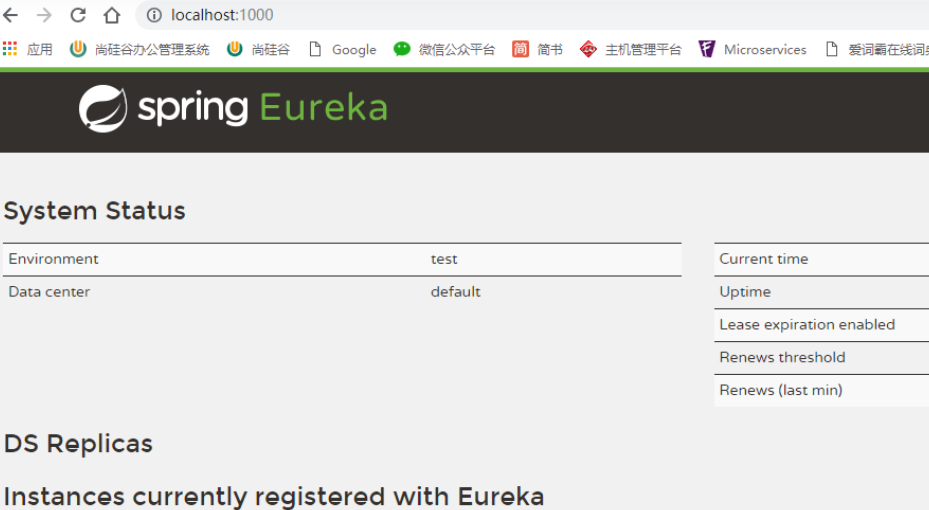

# 第一章 项目环境搭建

[TOC]

## 一、项目功能梳理

### 1.后台管理系统

- 权限管理
  - 用户维护 √
  - 角色维护 √
  - 菜单维护 √
- 业务审核
  - 实名认证审核
  - 广告审核
  - 项目审核 √

### 2.前台会员系统

- 用户模块
- 项目模块
- 订单/支付模块

## 二、项目架构设计


了解或介绍一个项目架构的步骤：

- 确定总体上是单一架构还是分布式架构
  - 单一架构
    - 数据库
    - 框架
    - 前端技术
    - 确定工程之间的关系
      - 继承关系（Maven提供）
      - 聚合关系（Maven提供）
      - 依赖关系（Maven提供）
  - 分布式架构
    - 确定Dubbo+Zookeeper还是SpringBoot+SpringCloud
    - 确定整个项目中有哪些工程
    - 确定工程之间的关系
      - 继承关系（Maven提供）
      - 聚合关系（Maven提供）
      - 依赖关系（Maven提供）
      - 调用关系（远程调用技术提供）
    - 每个工程的大致作用
    - 用到了哪些中间件（Redis、文件存储服务器、消息队列、搜索引擎……）

## 三、创建数据库

```SQL
CREATE DATABASE `distributed-crowd` CHARACTER SET utf8 COLLATE utf8_bin;
```

## 四、项目工程创建

### 1.父工程

#### ①坐标

groupId：com.atguigu.crowd

artifactId：distribution-crowd-parent

packaging：<font color="blue"><b>pom</b></font>

#### ②属性声明

[点此查看详情](chapter01/detail01.html)

#### ③依赖管理

[点此查看详情](chapter01/detail02.html)

### 2.公共模块工程

#### ①坐标

groupId：com.atguigu.crowd

artifactId：distribution-crowd-1-common

packaging：jar

#### ②创建方式

建议通过Maven Module的方式创建子工程，好处是能够自动做好继承和聚合的配置。操作方法是在父工程上点右键→New→Maven Module

[点这里看操作截图](chapter01/detail03.html)

### 3.注册中心

#### ①坐标

groupId：com.atguigu.crowd

artifactId：distribution-crowd-2-registry-center

packaging：jar

[注：同样是Maven Module]

#### ②依赖

```xml
<dependency>
	<groupId>org.springframework.cloud</groupId>
	<artifactId>spring-cloud-starter-netflix-eureka-server</artifactId>
</dependency>
```

P.S.：当前工程的父工程(parent)已经通过import范围引入了SpringBoot和SpringCloud的依赖信息，所以当前工程不需要直接继承SpringBoot或SpringCloud。

#### ③配置文件

application.yml

```yml
server:
  port: 1000
  
eureka:
  instance:
    hostname: registry-center
  client:
    register-with-eureka: false #自己就是注册中心，不用注册自己
    fetch-registry: false #不从其他注册中心取回服务地址
    service-url:
       defaultZone: http://${eureka.instance.hostname}:${server.port}/eureka/
```

#### ④主启动类

```java
package com.atguigu.crowd;

import org.springframework.boot.SpringApplication;
import org.springframework.boot.autoconfigure.SpringBootApplication;
import org.springframework.cloud.netflix.eureka.server.EnableEurekaServer;

@EnableEurekaServer
@SpringBootApplication
public class CrowdMainType {
	
	public static void main(String[] args) {
		SpringApplication.run(CrowdMainType.class, args);
	}

}
```

#### ⑤测试



### 4.数据库服务工程

#### ①坐标

groupId：com.atguigu.crowd

artifactId：distribution-crowd-3-database-provider

packaging：jar

[注：同样是Maven Module]

#### ②依赖

[点此查看详情](chapter01/detail04.html)

#### ③配置文件

[mybatis-config.xml](chapter01/detail05.html)

[application.yml](chapter01/detail06.html)

#### ④主启动类

```java
// @EnableEurekaClient 专门针对Eureka注册中心
@EnableDiscoveryClient // 更为通用
@MapperScan("com.atguigu.crowd.mapper")	// 配置MyBatis的Mapper接口所在包进行自动扫描，配置了这个注解才能够将Mapper接口类型的bean注入Service。另外一种扫描Mapper的方法是在具体Mapper接口上使用@Mapper
@SpringBootApplication
public class CrowdMainType {
	
	public static void main(String[] args) {
		SpringApplication.run(CrowdMainType.class, args);
	}

}
```

@EnableEurekaClient 专门针对Eureka注册中心<br/>

@EnableDiscoveryClient 更为通用<br/>

@MapperScan("com.atguigu.crowd.mapper") 配置MyBatis的Mapper接口所在包进行自动扫描，配置了这个注解才能够将Mapper接口类型的bean注入Service。另外一种扫描Mapper的方法是在具体Mapper接口上使用@Mapper

#### ⑤获取数据库连接测试

```java
@RunWith(SpringRunner.class)
@SpringBootTest
public class CrowdTest {
	
	@Autowired
	private DataSource dataSource;
	
	@Test
	public void testDataBaseConnection() throws SQLException {
		Connection connection = dataSource.getConnection();
		System.out.println(connection);
	}

}
```

使用基于SpringBoot提供的测试需要注意：测试类所在的包，也必须是主启动类所在包的子包，才能够享受到包的自动扫描——除非是在主启动类上使用了@ComponentScan注解明确指定了扫描的包。

#### ⑥数据库连不上的可能原因

- MySQL服务是否启动
- IP地址是否正确
- MySQL数据库名称是否正确
- Linux防火墙是否关闭
- 用户名、密码（如果数据库密码是以0开头的，则需要加引号）

### 5.Redis服务工程

#### ①坐标

groupId：com.atguigu.crowd

artifactId：distribution-crowd-4-redis-provider

packaging：jar

[注：同样是Maven Module]

#### ②依赖

[点此查看详情](chapter01/detail07.html)

#### ③配置文件

```java
server:
  port: 3000
spring:
  application:
    name: redis-provider
  redis:
    host: 192.168.56.150
eureka:
  client:
    service-url:
      defaultZone: http://localhost:1000/eureka/
  instance:
    prefer-ip-address: true
```

#### ④主启动类

```java
@EnableDiscoveryClient
@SpringBootApplication
public class CrowdMainType {
	
	public static void main(String[] args) {
		SpringApplication.run(CrowdMainType.class, args);
	}

}
```

#### ⑤访问Redis测试

```java
@Autowired
private RedisTemplate<Object, Object> redisTemplate;

@Autowired
private StringRedisTemplate stringRedisTemplate;

@Test
public void testRedisTemplate() {
	redisTemplate.opsForValue().set("pig", "red");
}

@Test
public void testStringRedisTemplate() {
	stringRedisTemplate.opsForValue().set("newYear", "oleYear");
}
```

#### ⑥Redis整合相关

[RedisAutoConfiguration](chapter01/detail08.html)

[RedisProperties](chapter01/detail09.html)

[RedisTemplate](chapter01/detail10.html)

[StringRedisTemplate](chapter01/detail11.html)

### 6.用户管理模块

#### ①坐标

groupId：com.atguigu.crowd

artifactId：distribution-crowd-5-member-manager

packaging：jar

[注：同样是Maven Module]

#### ②依赖

用户管理模块不需要操作数据库，也不需要操作Redis，这些操作全部交给后面的Provider了，加入Web场景即可。而用户界面在前端工程展示，所以也不需要加入视图。

为了能够和Eureka注册中心交互还需要加入Eureka客户端。

```java
<dependency>
	<groupId>org.springframework.boot</groupId>
	<artifactId>spring-boot-starter-web</artifactId>
</dependency>

<dependency>
	<groupId>org.springframework.cloud</groupId>
	<artifactId>spring-cloud-starter-netflix-eureka-client</artifactId>
</dependency>
```

#### ③配置文件

```yml
server:
  port: 4000
spring:
  application:
    name: member-manager

eureka:
  client:
    service-url:
      defaultZone: http://localhost:1000/eureka/
  instance:
    prefer-ip-address: true
```

#### ④主启动类

```java
@EnableDiscoveryClient
@SpringBootApplication
public class CrowdMainType {
	
	public static void main(String[] args) {
		SpringApplication.run(CrowdMainType.class, args);
	}

}
```

### 7.建立依赖关系

除了注册中心，database-provider、redis-provider和member-manager都需要依赖公共模块。

```xml
<dependency>
	<groupId>com.atguigu.crowd</groupId>
	<artifactId>distribution-crowd-1-common</artifactId>
	<version>0.0.1-SNAPSHOT</version>
</dependency>
```


※Consumer调用Provider方式梳理


