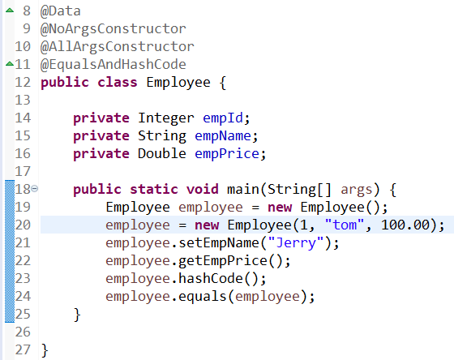

## 第一节 lombok

### 1.lombok效果

让我们在开发时不必编写getXxx()、setXxx()、有参构造器、无参构造器等等这样具备固定模式的代码。

### 2.lombok原理

根据注解确定要生成的代码，然后将要生成的代码侵入到字节码文件中。

### 3.Eclipse设置

#### ①原生Eclipse

双击执行lombok-1.16.22.jar

#### ②STS

- 第一步：找到STS安装根目录/STS.ini
  - 在最后一行加入-javaagent:lombok.jar
- 第二步：将lombok的jar包复制到STS的根目录下
- 第三步：将lombok的jar包重命名为lombok.jar
- 第四步：重启STS

### 4.注解

- @Data：每一个字段都加入getXxx()、setXxx()方法
- @NoArgsConstructor：无参构造器
- @AllArgsConstructor：全部字段都包括的构造器
- @EqualsAndHashCode：equals和hashCode方法
- @Getter
  - 类：所有字段都加入getXxx()方法
  - 字段：当前字段加入getXxx()方法
- @Setter
  - 类：所有字段都加入setXxx()方法
  - 字段：当前字段加入setXxx()方法