# 第三章 项目模块 第一节 OSS对象存储

## 0.SpringMVC文件上传回顾

### ①表单

```html
<form action="xxx" method="POST" enctype="multipart/form-data">
    <input type="file" name="xxx" />
</form>
```

### ②需要的jar包

- SpringMVC自身所需jar包
- 两个common包
  - commons-fileupload-xxx.jar
  - commons-io-xxx.jar

### ③SpringMVC配置

配置org.springframework.web.multipart.commons.CommonsMultipartResolver<br/>

配置mvc:annotation-driven

### ④handler接收上传的文件

@RequestParam("picture") MultipartFile picture

### ⑤文件保存

org.springframework.web.multipart.MultipartFile.**<font color="blue">transferTo</font>**(File)方法可以将接收到的文件转存到当前服务器上的指定位置。

## 1.提出问题

### ①以前上传文件时保存位置


### ②存在的问题

#### [1]Web应用重新部署问题

重新部署Web应用时，卸载（删除）旧的Web应用，连同用户上传的文件一起删除。重新加载新的Web应用后以前用户上传的文件不会自动恢复。<br/>

危害总结：Web应用重新部署会导致用户上传的文件丢失。

#### [2]集群环境下文件数据同步问题


危害总结：在没有文件的同步机制情况下，上传的文件只能上传到集群中的一台服务器上，导致访问集群中其他服务器时用户访问不到已上传的文件。

#### [3]Tomcat被拖垮

用户上传的文件如果数据量膨胀到了一个非常庞大的体积，那么就会严重影响Tomcat的运行效率。

#### [4]服务器存储自动扩容问题


危害总结：手动对服务器进行扩容，有可能导致项目中其他地方需要进行连带修改。

## 2.解决方案介绍

### ①自己搭建文件服务器

举例：FastDFS<br/>

好处：服务器可以自己维护、自己定制。<br/>

缺点：需要投入的人力、物力更多。<br/>

适用：规模比较大的项目，要存储海量的文件。<br/>

### ②使用第三方云服务

举例：阿里云提供的OSS对象存储服务。<br/>

好处：不必自己维护服务器的软硬件资源。直接调用相关API即可操作，更加轻量级。<br/>

缺点：数据不在自己手里。服务器不由自己维护。<br/>

适用：较小规模的应用，文件数据不是绝对私密。<br/>

## 3.开通OSS服务步骤

- 注册阿里云账号
- 完成实名认证


- 登录后在左侧边栏找到对象存储OSS

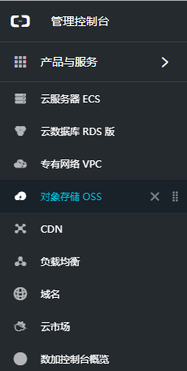

- 点击立即开通


- 勾选后点击立即开通

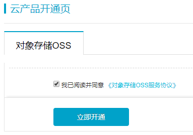

- 开通成功


- 打开OSS控制台

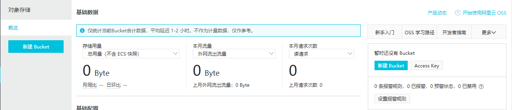

## 4.OSS使用

- 创建Bucket

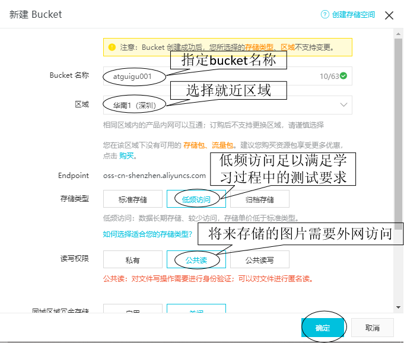

- 看到下面提示时点继续修改


- 在bucket中创建目录


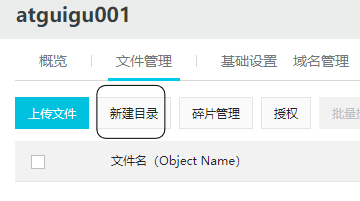

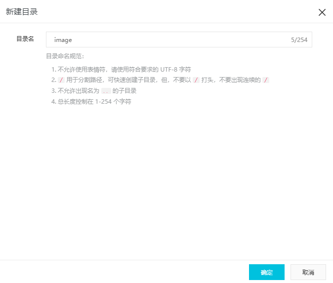

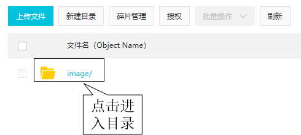

- 上传文件

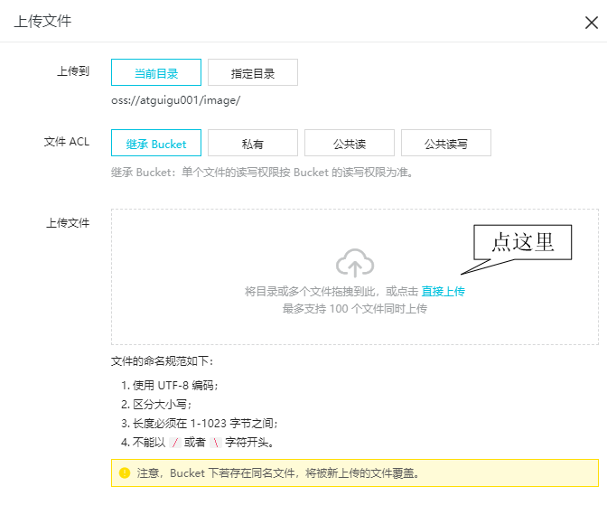

- 首次操作需要验证手机

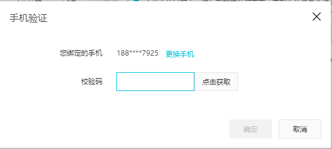

- 上传成功


- 预览图片

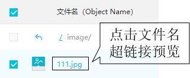

- 浏览器访问图片


- 浏览器访问路径组成

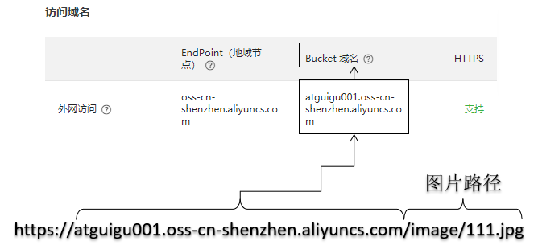

## 5.Java程序调用OSS服务接口

### ①参考文档地址

[官方文档](https://help.aliyun.com/product/31815.html?spm=a2c4g.11186623.6.540.5e9a58d5ZnuSyZ)<br/>

官方介绍

> 阿里云对象存储服务（Object Storage Service，简称 
> OSS），是阿里云提供的海量、安全、低成本、高可靠的云存储服务。您可以通过调用 API，在任何应用、任何时间、任何地点上传和下载数据，也可以通过
> Web 控制台对数据进行简单的管理。OSS 适合存放任意类型的文件，适合各种网站、开发企业及开发者使用。按实际容量付费真正使您专注于核心业务。

### ②创建AccessKey

#### [1]介绍

阿里云账号、密码→登录后在网页上操作<br/>

AccessKey→Java程序登录OSS进行操作<br/>

> 访问密钥AccessKey（AK）相当于登录密码，只是使用场景不同。AccessKey用于程序方式调用云服务API，而登录密码用于登录控制台。如果您不需要调用API，那么就不需要创建AccessKey。
>
> 您可以使用AccessKey构造一个API请求（或者使用云服务SDK）来操作资源。AccessKey包括AccessKeyId和AccessKeySecret。
>
> - AccessKeyId用于标识用户。
> - AccessKeySecret是用来验证用户的密钥。AccessKeySecret必须保密。
>
> 
>
> **警告** 禁止使用主账号AK，因为主账号AK泄露会威胁您所有资源的安全。请使用子账号（RAM用户）AK进行操作，可有效降低AK泄露的风险。 

#### [2]创建子账号AK的操作步骤

> 1.使用主账号登录[RAM管理控制台](https://ram.console.aliyun.com)。 
>
> 2.如果未创建RAM用户，在左侧导航栏，单击用户管理，然后单击新建用户，创建RAM用户。如果已创建RAM用户，跳过此步骤。 
>
> 3.在左侧导航栏，单击用户管理，然后单击需要创建AccessKey的用户名，进入用户详情页面。 
>
> 4.在用户AccessKey区域，单击创建AccessKey。 
>
> 5.完成手机验证后，在新建用户AccessKey页面，展开AccessKey详情，查看AcessKeyId和AccessKeySecret。然后单击保存AK信息，下载AccessKey信息。
>
> ​	**注意** AccessKey创建后，无法再通过控制台查看。请您妥善保存AccessKey，谨防泄露。 
>
> 6.单击该RAM用户对应的授权，给RAM用户授予相关权限，例如AliyunOSSFullAccess将给RAM用户授予OSS的管理权限。 

#### [3]操作步骤截图

<br/>
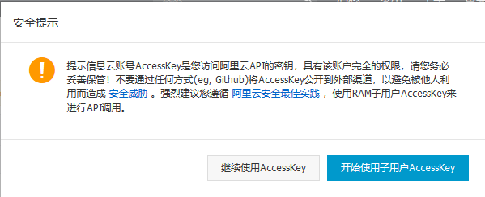<br/>
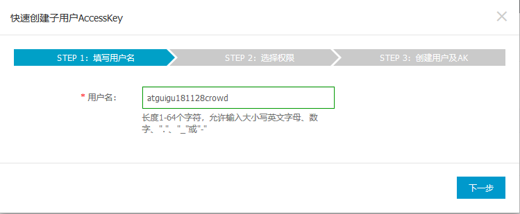<br/>
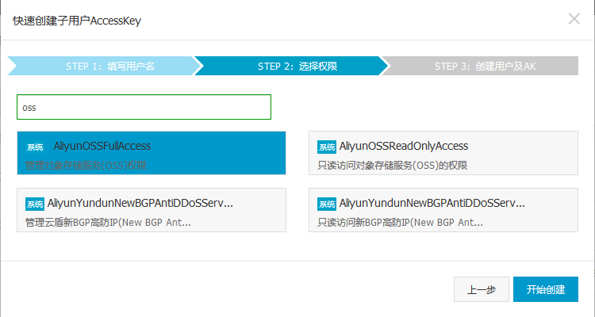<br/>
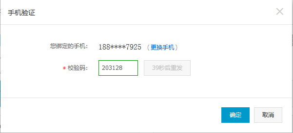<br/>
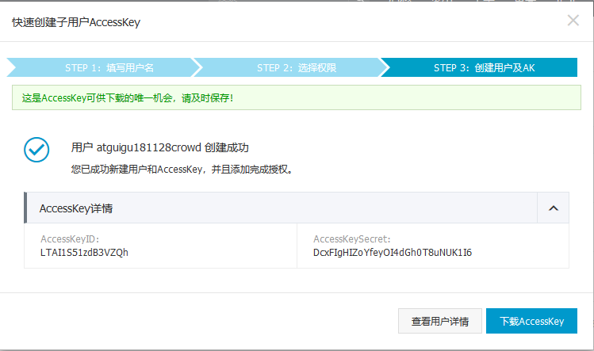<br/>

#### [4]创建结果

- 用户名：atguigu181128crowd
- AccessKeyId：LTAI1S51zdB3VZQh
- AccessKeySecret：DcxFIgHIZoYfeyOI4dGh0T8uNUK1I6

### ③SDK参考

JDK：Java Development Kit<br/>

SDK：Software Development Kit<br/>

```xml
<!-- SDK依赖 -->
<dependency>
    <groupId>com.aliyun.oss</groupId>
    <artifactId>aliyun-sdk-oss</artifactId>
    <version>2.8.3</version>
</dependency>
```


官方文档中的参考代码如下：

> ```java
> // Endpoint以杭州为例，其它Region请按实际情况填写。
> String endpoint = "http://oss-cn-hangzhou.aliyuncs.com";
> // 云账号AccessKey有所有API访问权限，建议遵循阿里云安全最佳实践，创建并使用RAM子账号进行API访问或日常运维，请登录 https://ram.console.aliyun.com 创建。
> String accessKeyId = "<yourAccessKeyId>";
> String accessKeySecret = "<yourAccessKeySecret>";
> 
> // 创建OSSClient实例。
> OSSClient ossClient = new OSSClient(endpoint, accessKeyId, accessKeySecret);
> 
> // 上传文件流。
> InputStream inputStream = new FileInputStream("<yourlocalFile>");
> ossClient.putObject("<yourBucketName>", "<yourObjectName>", inputStream);
> 
> // 关闭OSSClient。
> ossClient.shutdown();
> ```

我们自己写的测试代码如下：

```java
// Endpoint以杭州为例，其它Region请按实际情况填写。
String endpoint = "http://oss-cn-shenzhen.aliyuncs.com";
// 云账号AccessKey有所有API访问权限，建议遵循阿里云安全最佳实践，创建并使用RAM子账号进行API访问或日常运维，请登录 https://ram.console.aliyun.com 创建。
String accessKeyId = "LTAI1S51zdB3VZQh";
String accessKeySecret = "DcxFIgHIZoYfeyOI4dGh0T8uNUK1I6";

// 创建OSSClient实例。
OSSClient ossClient = new OSSClient(endpoint, accessKeyId, accessKeySecret);

// 声明要上传的文件名
String fileName = "zhuan.jpg";

// 声明上传文件后存入的目录的名称
String folderName = "test";

// 声明Bucket名称
String bucketName = "crowd181128";

// 存入对象的名称=目录名称+"/"+文件名
String objectName = folderName + "/" + fileName;

// 上传文件流。
InputStream inputStream = new FileInputStream(fileName);
ossClient.putObject(bucketName, objectName, inputStream);

// 关闭OSSClient。
ossClient.shutdown();
```

