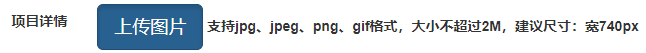
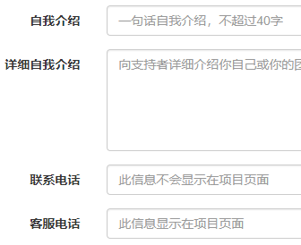
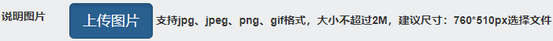
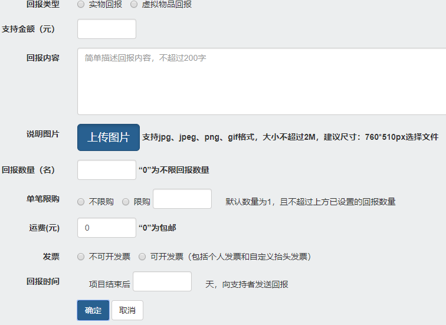
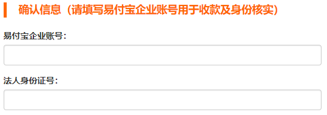

# 第三章 项目模块 第二节 功能实现分析

## 1.二进制文件处理方式分析


- 浏览器上传文件到前端工程
- 前端工程将文件上传到OSS服务器
- 前端工程将文件在OSS服务器上访问的路径发送给project-manager
- project-manager不操作任何二进制数据

## 2.主要操作流程


## 3.数据模型设计

### ①数据库表

#### [1]分类表

```sql
create table t_type
(
   id                   int(11) not null auto_increment,
   name                 varchar(255) comment '分类名称',
   remark               varchar(255) comment '分类介绍',
   primary key (id)
);
```

#### [2]项目分类中间表

一个项目可以属于多个不同分类，一个分类包含很多不同项目，所以是多对多关联关系

```sql
create table t_project_type
(
   id                   int not null auto_increment,
   projectid            int(11),
   typeid               int(11),
   primary key (id)
);
```

#### [3]标签表

```sq
create table t_tag
(
   id                   int(11) not null auto_increment,
   pid                  int(11),
   name                 varchar(255),
   primary key (id)
);
```

#### [4]项目标签中间表

```sql
create table t_project_tag
(
   id                   int(11) not null auto_increment,
   projectid            int(11),
   tagid                int(11),
   primary key (id)
);
```

#### [5]项目表

```sql
create table t_project
(
   id                   	int(11) not null auto_increment,
   project_name             varchar(255) comment '项目名称',
   project_description      varchar(255) comment '项目描述',
   money                	bigint (11) comment '筹集金额',
   day                  int(11) comment '筹集天数',
   status               tinyint(4) comment '0-即将开始，1-众筹中，2-众筹成功，3-众筹失败',
   deploydate           varchar(10) comment '项目发起时间',
   supportmoney         bigint(11) comment '已筹集到的金额',
   supporter            int(11) comment '支持人数',
   completion           int(3) comment '百分比完成度',
   memberid             int(11) comment '发起人的会员id',
   createdate           varchar(19) comment '项目创建时间',
   follower             int(11) comment '关注人数',
   header_picture_path  varchar(255) comment '头图路径',
   primary key (id)
);
```

#### [6]项目详情图片表

一个项目可能会包含多个详情图片，所以是多对一关联关系。

```sql
create table t_project_item_pic
(
   id                   int(11) not null auto_increment,
   projectid            int(11),
   item_pic_path        varchar(255),
   primary key (id)
);
```

#### [7]项目发起人信息表


```sql
create table t_member_launch_info
(
   id                   int(11) not null auto_increment,
   memberid             int(11)        comment '会员id',
   description_simple   varchar(255)   comment '简单介绍',
   description_detail   varchar(255)   comment '详细介绍',
   phone_num            varchar(255)   comment '联系电话',
   service_num          varchar(255)   comment '客服电话',
   primary key (id)
);
```

#### [8]回报信息表

一个项目通常包含多个回报，一个回报对应一个项目，所以是多对一关联关系。

```sql
create table t_return
(
   id                   int(11) not null auto_increment,
   projectid            int(11),
   type                 tinyint(4) comment '0 - 实物回报， 1 虚拟物品回报',
   supportmoney         int(11) comment '支持金额',
   content              varchar(255) comment '回报内容',
   count                int(11) comment '回报产品限额，“0”为不限回报数量',
   signalpurchase       int(11) comment '是否设置单笔限购',
   purchase             int(11) comment '具体限购数量',
   freight              int(11) comment '运费，“0”为包邮',
   invoice              tinyint(4) comment '0 - 不开发票， 1 - 开发票',
   returndate              int(11) comment '项目结束后多少天向支持者发送回报',
   describ_pic_path     varchar(255) comment '说明图片路径',
   primary key (id)
);
```


#### [9]发起人确认信息表

```sql
create table t_member_confirm_info
(
   id                   int(11) not null auto_increment,
   memberid             int(11) comment '会员id',
   paynum               varchar(200) comment '易付宝企业账号',
   cardnum				varchar(200) comment '法人身份证号',
   primary key (id)
);
```

### ②实体类

#### [1]ProjectVO

```java
@Data
@NoArgsConstructor
@AllArgsConstructor
public class ProjectVO {
	
	// 用户登录系统后，系统分配的token值，用于识别用户身份。
	// 用户的id可以根据token值查询Redis得到
	private String memberSignToken;

	// 在Redis中临时存储项目数据的token值
	private String projectTempToken;
	
	// 分类id集合
	private List<Integer> typeIdList;
	
	// 标签id集合
	private List<Integer> tagIdList;
	
	// 项目名称
	private String projectName;
	
	// 项目描述
	private String projectDescription;
	
	// 计划筹集的金额
	private Integer money;
	
	// 筹集资金的天数
	private Integer day;
	
	// 创建项目的日期
	private String createdate;
	
	// 头图的路径
	private String headerPicturePath;
	
	// 详情图片的路径
	private List<String> detailPicturePathList;
	
	// 发起人信息
	private MemberLauchInfoVO memberLauchInfoVO;
	
	// 回报信息集合
	private List<ReturnVO> returnVOList;
	
	// 发起人确认信息
	private MemberConfirmInfoVO memberConfirmInfoVO;
}
```

#### [2]MemberLauchInfoVO

```java
@Data
@NoArgsConstructor
@AllArgsConstructor
public class MemberLauchInfoVO {
	
	// 用户登录系统后，系统分配的token值，用于识别用户身份。
	// 用户的id可以根据token值查询Redis得到
	private String memberSignToken;

	// 在Redis中临时存储项目数据的token值
	private String projectTempToken;
	
	// 简单介绍
	private String descriptionSimple;
	
	// 详细介绍
	private String descriptionDetail;
	
	// 联系电话
	private String phoneNum;
	
	// 客服电话
	private String serviceNum;

}
```

#### [3]ReturnVO

```java
@Data
@NoArgsConstructor
@AllArgsConstructor
public class ReturnVO {
	
	// 用户登录系统后，系统分配的token值，用于识别用户身份。
	// 用户的id可以根据token值查询Redis得到
	private String memberSignToken;
	
	// 在Redis中临时存储项目数据的token值
	private String projectTempToken;
	
	// 回报类型：0 - 实物回报， 1 虚拟物品回报
	private Integer type;
	
	// 支持金额
	private Integer supportmoney;
	
	// 回报内容介绍
	private String content;
	
	// 总回报数量，0为不限制
	private Integer count;
	
	// 是否限制单笔购买数量，0表示不限购，1表示限购
	private Integer signalpurchase;
	
	// 如果单笔限购，那么具体的限购数量
	private Integer purchase;
	
	// 运费，“0”为包邮
	private Integer freight;
	
	// 是否开发票，0 - 不开发票， 1 - 开发票
	private Integer invoice;
	
	// 众筹结束后返还回报物品天数
	private Integer returndate;
	
	// 说明图片路径
	private String describPicPath;

}
```

#### [4]MemberConfirmInfoVO

```java
@Data
@NoArgsConstructor
@AllArgsConstructor
public class MemberConfirmInfoVO {
	
	// 用户登录系统后，系统分配的token值，用于识别用户身份。
	// 用户的id可以根据token值查询Redis得到
	private String memberSignToken;

	// 在Redis中临时存储项目数据的token值
	private String projectTempToken;
	
	// 易付宝账号
	private String paynum;

	// 法人身份证号
	private String cardnum;
}
```

## 4.需要处理的请求清单

### ①初始化项目创建操作

用户点击：阅读并同意协议

### ②上传项目头图


### ③上传项目详情图片



### ④保存项目信息


### ⑤保存/更新发起人信息



### ⑥上传回报中的说明图片



### ⑦保存回报信息



### ⑧保存确认信息



### ⑨所有相关数据存入数据库

- ProjectVO
- List&lt;ReturnVO&gt;
- MemberLauchInfoVO
- MemberConfirmInfoVO