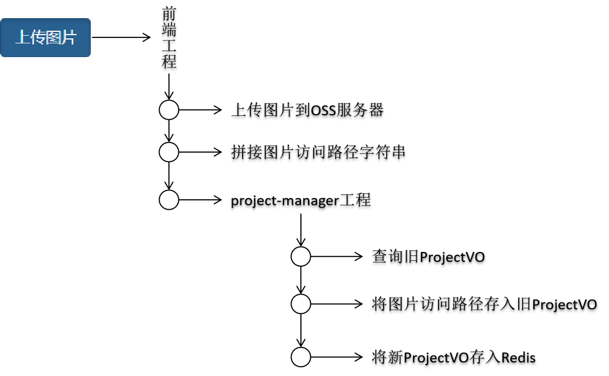

# 第三章 项目模块 第四节 具体功能实现

## 1.初始化项目创建操作

用户点击：阅读并同意协议


### ①检查是否登录

```java
// 1.检查是否登录，也就是检查memberSignToken是否有效
ResultEntity<String> resultEntity = redisOperationRemoteService.retrieveStringValueByStringKey(memberSignToken);
if(ResultEntity.FAILED.equals(resultEntity.getResult())) {
	return resultEntity;
}

String memberId = resultEntity.getData();

if(memberId == null) {
	return ResultEntity.failed(CrowdConstant.MESSAGE_ACCESS_DENIED);
}
```

### ②将ProjectVO存入Redis

#### [1]KEY设计

所在工程：distribution-crowd-1-common<br/>

所在类：com.atguigu.crowd.constant.CrowdConstant<br/>

```java
public static final String REDIS_PROJECT_TEMP_TOKEN_PREFIX = "PROJECT_TEMP_TOKEN_";
```

前缀后面使用UUID生成。

#### [2]VALUE设计

```java
String value = JSON.toJSONString(projectVO);
```

### ③project-manager工程中的Controller方法

```java
@RequestMapping("/project/manager/initCreation")
public ResultEntity<ProjectVO> initCreation(
		@RequestParam("memberSignToken") String memberSignToken) {
	
	// 1.检查是否登录，也就是检查memberSignToken是否有效
	ResultEntity<String> resultEntity = redisOperationRemoteService.retrieveStringValueByStringKey(memberSignToken);
	if(ResultEntity.FAILED.equals(resultEntity.getResult())) {
		return ResultEntity.failed(resultEntity.getMessage());
	}
	
	String memberId = resultEntity.getData();
	
	if(memberId == null) {
		return ResultEntity.failed(CrowdConstant.MESSAGE_ACCESS_DENIED);
	}
	
	// 2.创建空ProjectVO对象备用
	ProjectVO projectVO = new ProjectVO();
	
	// 3.将memberSignToken存入ProjectVO对象
	projectVO.setMemberSignToken(memberSignToken);
	
	// 4.将projectTempToken存入ProjectVO对象
	String projectTempToken = CrowdUtils.generateRedisKeyByPrefix(CrowdConstant.REDIS_PROJECT_TEMP_TOKEN_PREFIX);
	
	projectVO.setProjectTempToken(projectTempToken);
	
	// 5.将ProjectVO对象转换成JSON
	String jsonString = JSON.toJSONString(projectVO);
	
	// 6.将projectTempToken和jsonString作为key、value存入Redis
	// 虽然是临时数据，但是不能指定一个固定的过期时间，在用户操作完成时删除
	redisOperationRemoteService.saveNormalStringKeyValue(projectTempToken, jsonString, -1);
	
	return ResultEntity.successWithData(projectVO);
}
```


## 2.上传项目头图


### ①操作流程

- 前端工程接收上传图片

- 上传到OSS

- 将访问图片的URL地址发送给project-manager工程

- project-manager工程访问Redis查询ProjectVO对象
  - 从Redis查询到JSON字符串
  - 将JSON字符串还原成ProjectVO对象
  
- 将图片路径存入ProjectVO对象

- 将ProjectVO对象转换为JSON字符串

- 将JSON字符串重新存入Redis

  

### ②代码

```java
@RequestMapping("/project/manager/save/head/picture/path")
public ResultEntity<String> saveHeadPicturePath(
			@RequestParam("memberSignToken") String memberSignToken,
			@RequestParam("projectTempToken") String projectTempToken,
			@RequestParam("headerPicturePath") String headerPicturePath
		) {
	
	// 检查是否登录，也就是检查memberSignToken是否有效
	ResultEntity<String> resultEntity = redisOperationRemoteService.retrieveStringValueByStringKey(memberSignToken);
	if(ResultEntity.FAILED.equals(resultEntity.getResult())) {
		return ResultEntity.failed(resultEntity.getMessage());
	}
	
	// project-manager工程访问Redis查询ProjectVO对象
	ResultEntity<String> resultEntityForGetValue = redisOperationRemoteService.retrieveStringValueByStringKey(projectTempToken);
	
	if(ResultEntity.FAILED.equals(resultEntityForGetValue.getResult())) {
		return ResultEntity.failed(resultEntityForGetValue.getMessage());
	}
	
	// 从Redis查询到JSON字符串
	String projectVOJSON = resultEntityForGetValue.getData();
	
	// 将JSON字符串还原成ProjectVO对象
	ProjectVO projectVO = JSON.parseObject(projectVOJSON, ProjectVO.class);
	
	// 将图片路径存入ProjectVO对象
	projectVO.setHeaderPicturePath(headerPicturePath);
	
	// 将ProjectVO对象转换为JSON字符串
	String jsonString = JSON.toJSONString(projectVO);
	
	// 将JSON字符串重新存入Redis
	return redisOperationRemoteService.saveNormalStringKeyValue(projectTempToken, jsonString, -1);
	
}
```


## 3.上传项目详情图片


```java
@RequestMapping("/project/manager/save/detail/picture/path/list")
public ResultEntity<String> saveDetailPicturePathList(
			@RequestParam("memberSignToken") String memberSignToken,
			@RequestParam("projectTempToken") String projectTempToken,
			@RequestParam("detailPicturePathList") List<String> detailPicturePathList
		) {
	
	// 检查是否登录，也就是检查memberSignToken是否有效
	ResultEntity<String> resultEntity = redisOperationRemoteService.retrieveStringValueByStringKey(memberSignToken);
	if(ResultEntity.FAILED.equals(resultEntity.getResult())) {
		return ResultEntity.failed(resultEntity.getMessage());
	}
	
	// project-manager工程访问Redis查询ProjectVO对象
	ResultEntity<String> resultEntityForGetValue = redisOperationRemoteService.retrieveStringValueByStringKey(projectTempToken);
	
	if(ResultEntity.FAILED.equals(resultEntityForGetValue.getResult())) {
		return ResultEntity.failed(resultEntityForGetValue.getMessage());
	}
	
	// 从Redis查询到JSON字符串
	String projectVOJSON = resultEntityForGetValue.getData();
	
	// 将JSON字符串还原成ProjectVO对象
	ProjectVO projectVO = JSON.parseObject(projectVOJSON, ProjectVO.class);
	
	// 将图片路径存入ProjectVO对象
	projectVO.setDetailPicturePathList(detailPicturePathList);
	
	// 将ProjectVO对象转换为JSON字符串
	String jsonString = JSON.toJSONString(projectVO);
	
	// 将JSON字符串重新存入Redis
	return redisOperationRemoteService.saveNormalStringKeyValue(projectTempToken, jsonString, -1);
	
}
```


## 4.保存项目信息


```java
@RequestMapping("/project/manager/save/project/information")
public ResultEntity<String> saveProjectInformation(@RequestBody ProjectVO projectVOFront) {
	
	// 获取memberSignToken
	String memberSignToken = projectVOFront.getMemberSignToken();
	
	// 检查是否登录，也就是检查memberSignToken是否有效
	ResultEntity<String> resultEntity = redisOperationRemoteService.retrieveStringValueByStringKey(memberSignToken);
	if(ResultEntity.FAILED.equals(resultEntity.getResult())) {
		return ResultEntity.failed(resultEntity.getMessage());
	}
	
	// 从projectVOFront中获取projectTempToken
	String projectTempToken = projectVOFront.getProjectTempToken();
	
	// project-manager工程访问Redis查询ProjectVO对象
	ResultEntity<String> resultEntityForGetValue = redisOperationRemoteService.retrieveStringValueByStringKey(projectTempToken);
	
	if(ResultEntity.FAILED.equals(resultEntityForGetValue.getResult())) {
		return ResultEntity.failed(resultEntityForGetValue.getMessage());
	}
	
	// 从Redis查询到JSON字符串
	String projectVOJSON = resultEntityForGetValue.getData();
	
	// 将JSON字符串还原成ProjectVO对象
	ProjectVO projectVOBehind = JSON.parseObject(projectVOJSON, ProjectVO.class);
	
	projectVOFront.setHeaderPicturePath(projectVOBehind.getHeaderPicturePath());
	projectVOFront.setDetailPicturePathList(projectVOBehind.getDetailPicturePathList());
	
	// 将projectVOFront对象中的属性复制到projectVOBehind对象
	BeanUtils.copyProperties(projectVOFront, projectVOBehind);
	
	// 将projectVOBehind对象转换为JSON字符串
	String jsonString = JSON.toJSONString(projectVOBehind);
	
	// 将JSON字符串重新存入Redis
	return redisOperationRemoteService.saveNormalStringKeyValue(projectTempToken, jsonString, -1);
	
}
```

## 5.保存回报信息

```java
@RequestMapping("/save/return/vo")
public ResultEntity<String> saveReturnVO(@RequestBody ReturnVO returnVO) {
	
	// 1.检查memberSignToken确认用户是否登录
	String memberSignToken = returnVO.getMemberSignToken();
	
	ResultEntity<String> retrieveTokenResultEntity = operationRemoteService.retrieveTokenOfSignedMemberRemote(memberSignToken);
	
	if(ResultEntity.FAILED.equals(retrieveTokenResultEntity.getResult())) {
		return ResultEntity.failed(retrieveTokenResultEntity.getMessage());
	}
	
	String memberId = retrieveTokenResultEntity.getData();
	
	if(memberId == null) {
		return ResultEntity.failed(CrowdConstant.MESSAGE_LOGIN_NEEDED);
	}
	
	// 2.根据projectTempToken查询ProjectVO对象
	String projectTempToken = returnVO.getProjectTempToken();
	
	ResultEntity<String> retrieveStringValueResultEntity = operationRemoteService.retrieveStringValueByStringKey(projectTempToken);

	if(ResultEntity.FAILED.equals(retrieveStringValueResultEntity.getResult())) {
		return retrieveStringValueResultEntity;
	}
	
	String json = retrieveStringValueResultEntity.getData();
	
	if(!CrowdUtils.strEffectiveCheck(json)) {
		return ResultEntity.failed(CrowdConstant.MESSAGE_PROJECT_NOT_FOUND_FROM_CACHE);
	}
	
	// 3.将JSON字符串还原成ProjectVO对象
	ProjectVO projectVO = JSON.parseObject(json, ProjectVO.class);
	
	// 4.获取之前存储过的ReturnVO的List
	List<ReturnVO> returnVOList = projectVO.getReturnVOList();
	
	// 5.如果returnVOList不是有效集合，则进行初始化
	if(!CrowdUtils.collectionEffectiveCheck(returnVOList)) {
		
		// ①创建集合对象
		returnVOList = new ArrayList<>();
		
		// ②将集合对象存入projectVO
		projectVO.setReturnVOList(returnVOList);
	}
	
	// 6.将当前ReturnVO存入returnVOList
	returnVOList.add(returnVO);
	
	// 7.将ProjectVO转换为JSON字符串
	String newJsonProject = JSON.toJSONString(projectVO);
	
	// 8.存入Redis
	return operationRemoteService.saveNormalStringKeyValue(projectTempToken, newJsonProject);
}
```


## 8.保存确认信息


```java
@RequestMapping("/save/member/confirm/info/vo")
public ResultEntity<String> saveMemberConfirmInfoVO(@RequestBody MemberConfirmInfoVO memberConfirmInfoVO) {
	
	// 1.检查memberSignToken确认用户是否登录
	String memberSignToken = memberConfirmInfoVO.getMemberSignToken();
	
	ResultEntity<String> retrieveTokenResultEntity = operationRemoteService.retrieveTokenOfSignedMemberRemote(memberSignToken);
	
	if(ResultEntity.FAILED.equals(retrieveTokenResultEntity.getResult())) {
		return ResultEntity.failed(retrieveTokenResultEntity.getMessage());
	}
	
	String memberId = retrieveTokenResultEntity.getData();
	
	if(memberId == null) {
		return ResultEntity.failed(CrowdConstant.MESSAGE_LOGIN_NEEDED);
	}
	
	// 2.根据projectTempToken查询ProjectVO对象
	String projectTempToken = memberConfirmInfoVO.getProjectTempToken();
	
	ResultEntity<String> retrieveStringValueResultEntity = operationRemoteService.retrieveStringValueByStringKey(projectTempToken);

	if(ResultEntity.FAILED.equals(retrieveStringValueResultEntity.getResult())) {
		return retrieveStringValueResultEntity;
	}
	
	String json = retrieveStringValueResultEntity.getData();
	
	if(!CrowdUtils.strEffectiveCheck(json)) {
		return ResultEntity.failed(CrowdConstant.MESSAGE_PROJECT_NOT_FOUND_FROM_CACHE);
	}
	
	// 3.将JSON字符串还原成ProjectVO对象
	ProjectVO projectVO = JSON.parseObject(json, ProjectVO.class);
	
	// 4.存入memberConfirmInfoVO对象
	projectVO.setMemberConfirmInfoVO(memberConfirmInfoVO);
	
	// 5.将新ProjectVO对象重新转换成JSON数据
	String newJsonProject = JSON.toJSONString(projectVO);
	
	// 6.存入Redis
	return operationRemoteService.saveNormalStringKeyValue(projectTempToken, newJsonProject);
}
```


## 9.所有相关数据存入数据库

### ①执行流程


### ②project-manager的Controller方法

```java
@RequestMapping("/project/manager/save/whole/project")
public ResultEntity<String> saveWholeProject(
		@RequestParam("memberSignToken") String memberSignToken,
		@RequestParam("projectTempToken") String projectTempToken) {
	
	// 检查是否登录，也就是检查memberSignToken是否有效
	ResultEntity<String> resultEntity = redisOperationRemoteService.retrieveStringValueByStringKey(memberSignToken);
	if (ResultEntity.FAILED.equals(resultEntity.getResult())) {
		return ResultEntity.failed(resultEntity.getMessage());
	}
	
	String memberId = resultEntity.getData();
	
	if (memberId == null) {
		return ResultEntity.failed(CrowdConstant.MESSAGE_ACCESS_DENIED);
	}
	
	// project-manager工程访问Redis查询ProjectVO对象
	ResultEntity<String> resultEntityForGetValue = redisOperationRemoteService
			.retrieveStringValueByStringKey(projectTempToken);

	if (ResultEntity.FAILED.equals(resultEntityForGetValue.getResult())) {
		return ResultEntity.failed(resultEntityForGetValue.getMessage());
	}

	// 从Redis查询到JSON字符串
	String projectVOJSON = resultEntityForGetValue.getData();

	// 将JSON字符串还原成ProjectVO对象
	ProjectVO projectVO = JSON.parseObject(projectVOJSON, ProjectVO.class);
	
	// 执行保存
	ResultEntity<String> resultEntityForSave = dataBaseOperationRemoteService.saveProjectRemote(projectVO, memberId);
	
	if(ResultEntity.FAILED.equals(resultEntityForSave.getResult())) {
		return resultEntityForSave;
	}
	
	// 删除Redis中的临时数据
	return redisOperationRemoteService.removeByKey(projectTempToken);
}
```

### ③database-provider的Controller方法

```java
@RequestMapping("/save/project/remote/{memberId}")
public ResultEntity<String> saveProjectRemote(
		@RequestBody ProjectVO projectVO, 
		@PathVariable("memberId") String memberId) {
	
	try {
		projectService.saveProject(projectVO, memberId);
		
		return ResultEntity.successNoData();
	} catch (Exception e) {
		e.printStackTrace();
		
		return ResultEntity.failed(e.getMessage());
	}
	
}
```

### ④database-provider的Service方法

- 1.保存ProjectPO
- 2.获取保存ProjectPO后得到的自增主键
  - 在ProjectPOMapper.xml文件中insert方法对应的标签中设置useGeneratedKeys="true" keyProperty="id"
- 3.保存typeIdList
- 4.保存tagIdList
- 5.保存detailPicturePathList
- 6.保存MemberLaunchInfoPO
- 7.根据ReturnVO的List保存ReturnPO
- 8.保存MemberConfirmInfoPO

```java
@Transactional(readOnly=false, propagation=Propagation.REQUIRES_NEW, rollbackFor=Exception.class)
public void saveProject(ProjectVO projectVO, String memberId) {
	
	// 1.保存ProjectPO
	ProjectPO projectPO = new ProjectPO();
	BeanUtils.copyProperties(projectVO, projectPO);
	
	projectPO.setMemberid(Integer.parseInt(memberId));
	
	projectPOMapper.insert(projectPO);
	
	// 2.获取保存ProjectPO后得到的自增主键
	// 在ProjectPOMapper.xml文件中insert方法对应的标签中设置useGeneratedKeys="true" keyProperty="id"
	Integer projectId = projectPO.getId();
	
	// 3.保存typeIdList
	List<Integer> typeIdList = projectVO.getTypeIdList();
	if(CrowdUtils.collectionEffectiveCheck(typeIdList)) {
		typePOMapper.insertRelationshipBatch(projectId, typeIdList);
	}
	
	// 4.保存tagIdList
	List<Integer> tagIdList = projectVO.getTagIdList();
	if(CrowdUtils.collectionEffectiveCheck(tagIdList)) {
		tagPOMapper.insertRelationshipBatch(projectId, tagIdList);
	}
	
	// 5.保存detailPicturePathList
	// ①从VO对象中获取detailPicturePathList
	List<String> detailPicturePathList = projectVO.getDetailPicturePathList();
	if(CrowdUtils.collectionEffectiveCheck(detailPicturePathList)) {
		
		// ②创建一个空List集合，用来存储ProjectItemPicPO对象
		List<ProjectItemPicPO> projectItemPicPOList = new ArrayList<>();
		
		// ③遍历detailPicturePathList
		for (String detailPath : detailPicturePathList) {
			
			// ④创建projectItemPicPO对象
			ProjectItemPicPO projectItemPicPO = new ProjectItemPicPO(null, projectId, detailPath);
			
			projectItemPicPOList.add(projectItemPicPO);
		}
		
		// ⑤根据projectItemPicPOList执行批量保存
		projectItemPicPOMapper.insertBatch(projectItemPicPOList);
	}
	
	
	// 6.保存MemberLaunchInfoPO
	MemberLauchInfoVO memberLauchInfoVO = projectVO.getMemberLauchInfoVO();
	
	if(memberLauchInfoVO != null) {
		
		MemberLaunchInfoPO memberLaunchInfoPO = new MemberLaunchInfoPO();
		BeanUtils.copyProperties(memberLauchInfoVO, memberLaunchInfoPO);
		
		memberLaunchInfoPO.setMemberid(Integer.parseInt(memberId));
		
		memberLaunchInfoPOMapper.insert(memberLaunchInfoPO);
	}
	
	// 7.根据ReturnVO的List保存ReturnPO
	List<ReturnVO> returnVOList = projectVO.getReturnVOList();
	
	if(CrowdUtils.collectionEffectiveCheck(returnVOList)) {
		
		List<ReturnPO> returnPOList = new ArrayList<>();
		
		for (ReturnVO returnVO : returnVOList) {
			
			ReturnPO returnPO = new ReturnPO();
			
			BeanUtils.copyProperties(returnVO, returnPO);
			
			returnPO.setProjectid(projectId);
			
			returnPOList.add(returnPO);
		}
		
		returnPOMapper.insertBatch(returnPOList);
		
	}
	
	// 8.保存MemberConfirmInfoPO
	MemberConfirmInfoVO memberConfirmInfoVO = projectVO.getMemberConfirmInfoVO();
	
	if(memberConfirmInfoVO != null) {
		MemberConfirmInfoPO memberConfirmInfoPO = new MemberConfirmInfoPO(null, Integer.parseInt(memberId), memberConfirmInfoVO.getPaynum(), memberConfirmInfoVO.getCardnum());
		memberConfirmInfoPOMapper.insert(memberConfirmInfoPO);
		
	}
	
}
```

