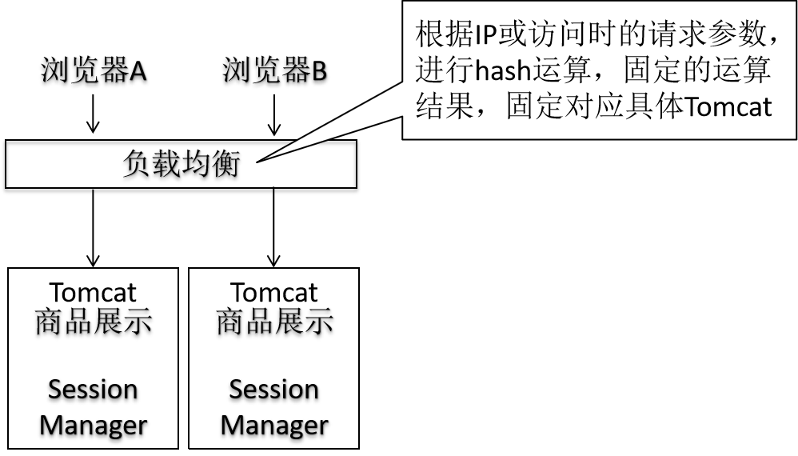
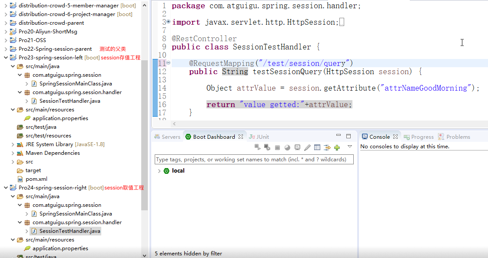
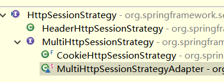
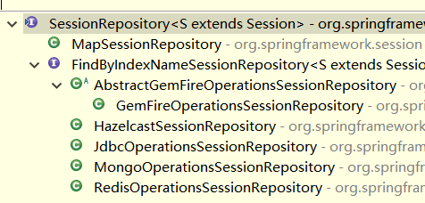
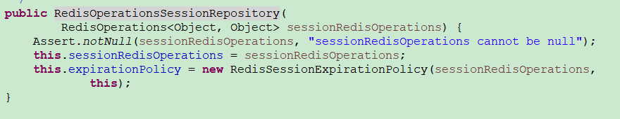
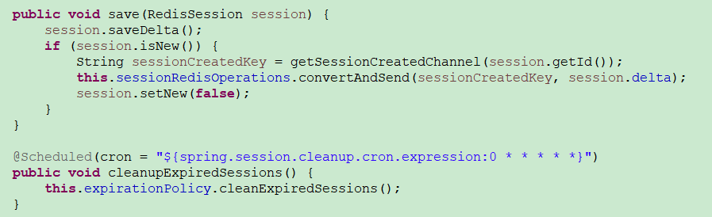

# 第四章 前端工程 第一节 准备工作

[TOC]

## 1.相关知识点回顾

### ①前后端交互方式

#### [1]服务器端渲染


前端工程使用假数据先开发纯静态页面，后端工程师直接拿来使用，将静态页面加入到模板文件中。

#### [2]前后端分离


- 前后端工程师一起开会确定交互过程中使用的JSON格式

  - 包含字段
  - 字段名称
  - 字段类型
  - 字段作用
  - 是否必选

- 分头开发，并行推进

  - 前端工程师开发前端页面

    通过Mock.js技术制造假数据进行开发过程中测试。（Mock.js提供了本地Ajax技术）

  - 后端工程师开发后端接口

- 后端接口开发完成

  - 本地测试确认
  - 发布到测试服务器
  - 测试人员对接口进行测试
  - 前端工程师连接到后端接口使用真实数据进行页面测试


PS：前端界面形式

- 浏览器端界面
  - PC端
  - 移动端
- 移动端
  - Android
  - IOS
- 物联网

### ②会话控制

#### [1]Cookie工作机制


浏览器访问服务器时会自动携带Cookie（如果有的话）。

#### [2]Session工作机制


根据浏览器端存储的名为JSESSIONID的Cookie查找服务器端保存的Session对象。

## 2.分布式架构环境下Session共享

### ①提出问题

在分布式和集群环境下，每个具体模块运行在单独的Tomcat上，而Session是被不同Tomcat所“区隔”的，所以不能互通，会导致程序运行时，用户会话数据发生错误。有的服务器上有，有的服务器上没有。


### ②解决办法探索

#### [1]Session同步


- 问题1：造成Session在各个服务器上"同量"保存。TomcatA保存了1G的Session数据，TomcatB也需要保存1G的Session数据。数据量太大的会导致Tomcat性能下降。
- 问题2：数据同步对性能有一定影响。
- 问题3：对于集群外的服务器无效。

#### [2]将Session数据存储在Cookie中

做法：所有会话数据在浏览器端使用Cookie保存，服务器端不存储任何会话数据。<br/>

好处：服务器端大大减轻了数据存储的压力。不会有Session不一致问题<br/>

缺点：

- Cookie能够存储的数据非常有限。一般是4KB。不能存储丰富的数据。
- Cookie数据在浏览器端存储，很大程度上不受服务器端控制，如果浏览器端清理Cookie，相关数据会丢失。


#### [3]反向代理hash一致性



- 问题1：具体一个浏览器，专门访问某一个具体服务器，如果服务器宕机，会丢失数据。存在单点故障风险。
- 问题2：仅仅适用于集群范围内，超出集群范围，负载均衡服务器无效。

#### [4]==后端统一存储Session数据==

后端存储Session数据时，一般需要使用Redis这样的内存数据库，而一般不采用MySQL这样的关系型数据库。原因如下：

- Session数据存取比较频繁。内存访问速度快。
- Session有过期时间，Redis这样的内存数据库能够比较方便实现过期释放。


- 优点

  - 访问速度比较快。虽然需要经过网络访问，但是现在硬件条件已经能够达到网络访问比硬盘访问还要快。

    硬盘访问速度：200M/s

    网络访问速度：1G/s

  - Redis可以配置主从复制集群，不担心单点故障。

### ③SpringSession使用

以下文档针对在SpringBoot环境下使用



#### [1]引入依赖

```xml
<!-- 引入springboot&redis整合场景 -->
<dependency>
	<groupId>org.springframework.boot</groupId>
	<artifactId>spring-boot-starter-data-redis</artifactId>
</dependency>
<!-- 引入springboot&springsession整合场景 -->
<dependency>
	<groupId>org.springframework.session</groupId>
	<artifactId>spring-session-data-redis</artifactId>
</dependency>
```

#### [2]编写配置

```properties
# redis配置
spring.redis.host=192.168.56.100
spring.redis.jedis.pool.max-idle=100

# springsession配置
spring.session.store-type=redis
```

#### [3]基本原理

概括：SpringSession从底层全方位"**<font color='blue'>接管</font>**"了Tomcat对Session的管理。

##### (0)SpringSession需要完成的任务


##### (1)SessionRepositoryFilter

利用Filter原理，在每次请求到达目标方法之前，将原生HttpServletRequest/HttpServletResponse对象包装为SessionRepositoryRequest/ResponseWrapper。

```java
@Override
protected void doFilterInternal(HttpServletRequest request,
		HttpServletResponse response, FilterChain filterChain)
		throws ServletException, IOException {
	request.setAttribute(SESSION_REPOSITORY_ATTR, this.sessionRepository);

    // 包装对象并不是凭空创建一个相同类型的对象，而是借助原生对象的主体功能，修改有特殊需要的功能。
	SessionRepositoryRequestWrapper wrappedRequest = new SessionRepositoryRequestWrapper(
			request, response, this.servletContext);
	SessionRepositoryResponseWrapper wrappedResponse = new SessionRepositoryResponseWrapper(
			wrappedRequest, response);

	HttpServletRequest strategyRequest = this.httpSessionStrategy
			.wrapRequest(wrappedRequest, wrappedResponse);
	HttpServletResponse strategyResponse = this.httpSessionStrategy
			.wrapResponse(wrappedRequest, wrappedResponse);

	try {
		filterChain.doFilter(strategyRequest, strategyResponse);
	}
	finally {
		wrappedRequest.commitSession();
	}
}
```

##### (2)HttpSessionStrategy

封装Session的存取策略；cookie还是http headers等方式；



##### (3)SessionRepository

指定存取/删除/过期session操作的repository



##### (4)RedisOperationsSessionRepository

使用Redis将session保存维护起来





## 3.SpringBoot环境访问静态资源

### ①存储位置

src/main/resources/static目录


### ②说明

static目录本身不出现在最终的浏览器访问路径中。

| 正确 | http://localhost:8080/666.jpg        |
| ---- | ------------------------------------ |
| 错误 | http://localhost:8080/static/666.jpg |

static目录对应访问Web应用时ContextPath路径，也就是我们常说的Web应用根目录。例如：http://localhost:8080

## 4.视图技术Thymeleaf

### ①JSP的致命缺陷

前端工程师拿到JSP文件后，没法直接放在浏览器上查看布局、动态效果等等显示效果。所以，基于JSP无法和前端工程师进行协同工作。而Thymeleaf中所有的动态效果都不影响原本HTML标签的显示。当一个前端工程师拿到Thymeleaf文件后，可以直接放在浏览器上查看显示效果，看代码时忽略动态部分即可。

### ②在SpringBoot环境下加入Thymeleaf

#### [1]加入依赖

```xml
<dependency>
	<groupId>org.springframework.boot</groupId>
	<artifactId>spring-boot-starter-thymeleaf</artifactId>
</dependency>
```

#### [2]加入配置

```yml
spring:
  thymeleaf:
    prefix: classpath:/templates/
    suffix: .html
    cache: false #开发的时候禁用缓存
```

### ③Thymeleaf语法

#### [1]在html文件内使用Thymeleaf名称空间

```html
<html lang="UTF-8" xmlns:th="http://www.thymeleaf.org">
```

#### [2]直接取值

有转义效果：将“<”、“>”等这样的符号转换成对应的HTML实体。比如：“<”转换成功“&lt”

```html
[[表达式]]
```

无转义效果

```html
[(表达式)]
```

#### [3]表达式格式

从属性域取值

```html
${}
```

解析URL地址，最有用的是把“/”解析为ContextPath，让我们能够在页面上动态获取ContextPath值

```html
@{}
```

引入公共模板

```html
~{}
```

#### [4]给HTML标签设置动态值

改变当前标签里面文本内容

```html
<h2 th:text="${proj.name}">智能高清监控机器人</h2>
```

修改HTML标签的原生属性，格式是：th:原生属性名="表达式"

```html
<link rel="stylesheet" href="css/img/carousel.css" th:href="@{/resources/css/carousel.css}">
```

#### [5]设置公共模板

以th方式声明模板

```html
<div th:fragment="commonPart">
	……
</div>
```

三种方式引入，其中xxx部分会拼前后缀得到具体页面

| 表达式                       | 作用           |
| ---------------------------- | -------------- |
| th:insert = "~{xxx :: zzz}"  | 以插入方式引入 |
| th:replace = "~{xxx :: zzz}" | 以替换方式引入 |
| th:include = "~{xxx :: zzz}" | 以包含方式引入 |

#### [6]访问Session域

```html
[[${session.SIGNED_MEMBER.username}]]
```

