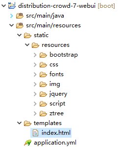

# 第四章 前端工程 第二节 创建前端工程

[TOC]

## 1.创建工程

### ①坐标

group id：com.atguigu.crowd<br/>

artifact id：distribution-crowd-7-webui<br/>

[注：仍然是父工程的模块工程形式]

### ②依赖

```xml
<!-- 加入Web开发所需要的场景启动器 -->
<dependency>
	<!-- 指定groupId和artifactId即可，版本已在父工程中定义 -->
	<groupId>org.springframework.boot</groupId>
	<artifactId>spring-boot-starter-web</artifactId>
</dependency>
<!-- 引入springboot&redis整合场景 -->
<dependency>
	<groupId>org.springframework.boot</groupId>
	<artifactId>spring-boot-starter-data-redis</artifactId>
</dependency>
<!-- 引入springboot&springsession整合场景 -->
<dependency>
	<groupId>org.springframework.session</groupId>
	<artifactId>spring-session-data-redis</artifactId>
</dependency>
<!-- Thymeleaf依赖 -->
<dependency>
	<groupId>org.springframework.boot</groupId>
	<artifactId>spring-boot-starter-thymeleaf</artifactId>
</dependency>
<dependency>
	<groupId>org.springframework.cloud</groupId>
	<artifactId>spring-cloud-starter-netflix-eureka-client</artifactId>
</dependency>
<dependency>
	<groupId>com.atguigu.crowd</groupId>
	<artifactId>distribution-crowd-1-common</artifactId>
	<version>0.0.1-SNAPSHOT</version>
</dependency>
```

### ③主启动类

```java
@EnableFeignClients
@EnableEurekaClient
@SpringBootApplication
public class CrowdMainType {
	
	public static void main(String[] args) {
		SpringApplication.run(CrowdMainType.class, args);
	}

}
```

### ④配置文件

```yml
server:
  port: 80
spring:
  application:
    name: webui
  redis:
    host: 192.168.56.150
    jedis:
      pool:
        max-idle: 100
  session:
    store-type: redis
  thymeleaf:
    prefix: classpath:/templates/
    suffix: .html
    cache: false
eureka:
  client:
    register-with-eureka: false
    service-url:
      defaultZone: http://localhost:1000/eureka/
  instance:
    prefer-ip-address: true
```

## 2.显示首页

### ①加入index.html

/distribution-crowd-7-webui/src/main/resources/templates/index.html

### ②加入静态资源



### ③修改index.html

字符集和Thymeleaf名称空间的声明

```html
<html lang="UTF-8" xmlns:th="http://www.thymeleaf.org">
  <head>
    <meta charset="UTF-8">
```

静态资源访问路径（下面仅列出有代表性的）

```html
<link rel="stylesheet" th:href="@{/resources/bootstrap/css/bootstrap.min.css}" href="bootstrap/css/bootstrap.min.css">

<script th:src="@{/resources/script/docs.min.js}" src="script/docs.min.js"></script>
```

