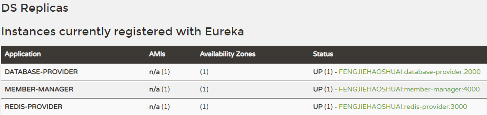

# 第四章 前端工程 第三节 登录功能

## 1.登录功能流程分析


## 2.调用member-manager准备

### ①抽取接口

被抽取接口的类：member-manager工程的com.atguigu.crowd.controller.MemberController<br/>

抽取得到的接口：common工程的com.atguigu.crowd.api.MemberOperationRemoteService

```java
@FeignClient("member-manager")
public interface MemberOperationRemoteService {
	
	@RequestMapping("/member/logout")
	ResultEntity<String> logout(@RequestParam("token") String token);
	
	@RequestMapping("/member/login")
	ResultEntity<MemberSignSuccessVO> login(@RequestParam("loginacct") String loginacct, @RequestParam("userpswd") String userpswd);

	@RequestMapping("/member/register")
	ResultEntity<String> register(@RequestBody MemberVO memberVO);
	
	@RequestMapping("/member/send/code")
	ResultEntity<String> sendCode(String phoneNum);
}
```

### ②确认在Eureka注册中心注册member-manager



## 3.登录功能具体实现

### ①SpringBoot环境下SpringMVC详细配置

创建配置类，实现org.springframework.web.servlet.config.annotation.WebMvcConfigurer接口

```java
@Configuration
public class SpringMVCConfig implements WebMvcConfigurer {
	
	@Override
	public void addViewControllers(ViewControllerRegistry registry) {
		
//		相当于
//		@RequestMapping("/member/to/login/page")
//		public String toLoginPage() {
//			return "member_login";
//		}
		
		String urlPath = "/member/to/login/page";
		String viewName = "member_login";
		
//		相当于
//		@RequestMapping("/member/to/member/center/page")
//		public String toMemberCenterPage() {
//			
//			return "member_center";
//		}
		
		registry.addViewController(urlPath).setViewName(viewName);
		
		urlPath = "/member/to/member/center/page";
		viewName = "member_center";
		
		registry.addViewController(urlPath).setViewName(viewName);
		
	}

}
```

### ②实体类序列化问题

member-manager调用database-provider和redis-provider时并没有要求实体类序列化。但是webui调用member-manager时要求序列化。所以需要给实体类附加序列化支持。

```java
@Data
@NoArgsConstructor
@AllArgsConstructor
public class MemberSignSuccessVO implements Serializable {
	
	private static final long serialVersionUID = 1L;
	
	private String username;
	private String email;
	private String token;

}
```

### ③webui工程的Controller方法

```java
@RequestMapping("/member/do/login.html")
public String doLogin(MemberVO memberVO, Model model, HttpSession session) {
	
	String loginAcct = memberVO.getLoginacct();
	String userPswd = memberVO.getUserpswd();
	
	// 调用远程方法执行登录操作
	ResultEntity<MemberSignSuccessVO> resultEntity = memberManagerRemoteService.login(loginAcct, userPswd);
	
	// 检查远程方法调用结果
	String result = resultEntity.getResult();
	
	if(ResultEntity.FAILED.equals(result)) {
		
		String message = resultEntity.getMessage();
		
		model.addAttribute(CrowdConstant.ATTR_NAME_MESSAGE, message);
		
		return "member-login";
	}
	
	// 如果登录成功，则获取MemberSignSuccessVO对象
	MemberSignSuccessVO memberSignSuccessVO = resultEntity.getData();
	
	// 将MemberSignSuccessVO对象存入Session域
	session.setAttribute(CrowdConstant.ATTR_NAME_LOGIN_MEMBER, memberSignSuccessVO);
	
	return "redirect:/member/to/member/center/page.html";
}
```


### ④个人中心页面访问Session域显示用户昵称

```java
[[${session['LOGIN-MEMBER'].username}]]
```


## 2.退出登录

```java
@RequestMapping("/member/logout.html")
public String logout(HttpSession session) {
	
	// 1.从现有Session中获取已登录的Member
	MemberSignSuccessVO memberSignSuccessVO = (MemberSignSuccessVO) session.getAttribute(CrowdConstant.ATTR_NAME_LOGIN_MEMBER);
	
	// 2.如果memberSignSuccessVO为null，则已经退出，不必继续执行
	if(memberSignSuccessVO  == null) {
		return "redirect:/";
	}
	
	// 3.获取token值
	String token = memberSignSuccessVO.getToken();
	
	// 4.调用远程方法删除Redis中存储的token
	ResultEntity<String> resultEntity = memberManagerRemoteService.logout(token);
	
	// 5.如果调用远程方法失败，抛出异常
	String result = resultEntity.getResult();
	
	if(ResultEntity.FAILED.equals(result)) {
		throw new RuntimeException(resultEntity.getMessage());
	}
	
	// 6.释放当前Session
	session.invalidate();
	
	return "redirect:/index.html";
}
```


