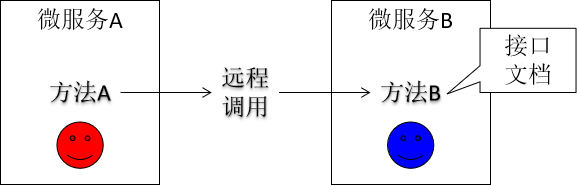
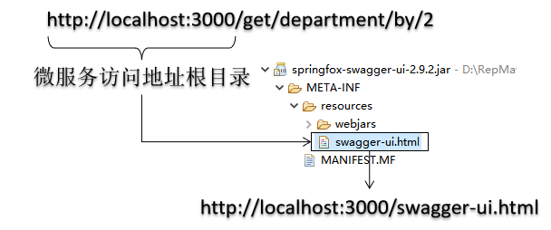

# 第六章 swagger



## 1.加入依赖

```xml
<dependency>
	<groupId>io.springfox</groupId>
	<artifactId>springfox-swagger2</artifactId>
	<version>2.9.2</version>
</dependency>
<dependency>
	<groupId>io.springfox</groupId>
	<artifactId>springfox-swagger-ui</artifactId>
	<version>2.9.2</version>
</dependency>
```

## 2.创建Swagger配置类

```java
@Configuration
@EnableSwagger2
public class AppSwaggerConfig {

	@Value("${swagger2.enable:true}")
	private boolean enable;

	@Bean("会员查询模块")
	public Docket retrieveMemberApis() {
		return new Docket(DocumentationType.SWAGGER_2).groupName("会员查询模块").select()
				.apis(RequestHandlerSelectors.withClassAnnotation(Api.class)).paths(PathSelectors.regex("/retrieve.*"))
				.build().apiInfo(apiInfo()).enable(enable);
	}
	
	@Bean("用户模块")
	public Docket userApis() {
		return new Docket(DocumentationType.SWAGGER_2).groupName("用户模块").select()
				.apis(RequestHandlerSelectors.withClassAnnotation(Api.class)).paths(PathSelectors.regex("/user.*"))
				.build().apiInfo(apiInfo()).enable(enable);
	}

	@Bean("项目模块")
	public Docket projectApis() {
		return new Docket(DocumentationType.SWAGGER_2).groupName("项目模块").select()
				.apis(RequestHandlerSelectors.withClassAnnotation(Api.class)).paths(PathSelectors.regex("/project.*"))
				.build().apiInfo(apiInfo()).enable(enable);
	}

	@Bean("审核模块")
	public Docket authApis() {
		return new Docket(DocumentationType.SWAGGER_2).groupName("审核模块").select()
				.apis(RequestHandlerSelectors.withClassAnnotation(Api.class)).paths(PathSelectors.regex("/auth.*"))
				.build().apiInfo(apiInfo()).enable(enable);
	}

	@Bean("订单/支付模块")
	public Docket payApis() {
		return new Docket(DocumentationType.SWAGGER_2).groupName("订单/支付模块").select()
				.apis(RequestHandlerSelectors.withClassAnnotation(Api.class)).paths(PathSelectors.regex("/order.*"))
				.build().apiInfo(apiInfo()).enable(enable);
	}

	private ApiInfo apiInfo() {
		return new ApiInfoBuilder().title("尚筹网-系统平台接口文档").description("提供用户模块/审核模块/项目模块/支付模块的文档")
				.termsOfServiceUrl("http://www.atguigu.com/").version("1.0").build();
	}

}
```

## 3.在需要生成接口文档的方法上使用注解

### ①@Api(tags="")

用在请求的类上，表示对类的说明<br/>

tags属性：说明类的作用，可以在UI界面上看到

### ②@ApiOperation(value="")

用在请求的方法上，说明方法的用途、作用<br/>

httpMethod属性：指定当前方法访问时使用的请求方式。注意：如果没有设置这个属性，swagger为当前方法的每一个HTTP请求方式都生成对应的文档条目。如果没有极特殊情况，那么这个属性一定要设置。

### ③@ApiImplicitParams

用在请求的方法上，对参数进行说明

### ④@ApiImplicitParam

说明请求参数的各个方面。

```java
@ApiImplicitParams(
	{
		@ApiImplicitParam(name="username",value="用户名",required=true),
		@ApiImplicitParam(name="password",value="密码",required=true)
	}
)
@PostMapping("/login")
public AppResponse<UserRespVo> login(String username,String password){
	//...
}
```

### ⑤@ApiResponses

用在请求的方法上，表示一组响应

### ⑥@ApiResponse

用在@ApiResponses中，一般用于表达一个错误的响应信息<br/>

code：数字，例如400<br/>

message：信息，例如"请求参数没填好"<br/>

response：抛出异常的类

### ⑦@ApiModel

用途1：说明响应数据类型。<br/>

具体指使用@ResponseBody修饰方法后，返回JSON数据格式。<br/>

用途2：说明入参数据类型<br/>

具体指使用@RequestBody修饰入参后，把JSON转换为入参类型，此时无法使用@ApiImplicitParam注解进行描述

### ⑧@ApiModelProperty

描述模型属性

## 4.guava版本问题

java.lang.NoSuchMethodError: com.google.common.collect.FluentIterable.concat<br/>

原因：guava.18.0.jar中FluentIterable类中没有concat方法。<br/>

解决：使用版本更高guava的jar包。<br/>

具体做法：<br/>

找到distribution-crowd-1-parent<br/>

在dependencyManagement中加入

```xml
<dependency>
	<groupId>com.google.guava</groupId>
	<artifactId>guava</artifactId>
</dependency>
```

这样项目中使用的guava版本就是20.0版本。

## 5.打开swagger界面

将带有swagger注解的微服务启动起来，访问swagger-ui.html

