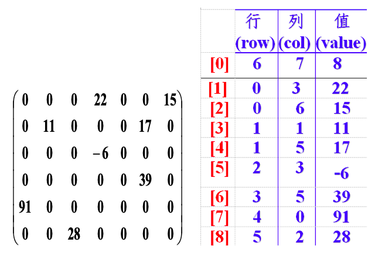
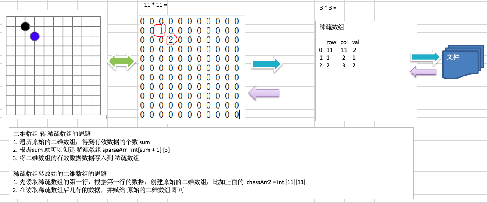
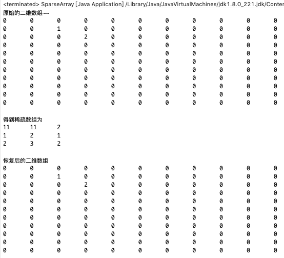

# 2.1 看一个实际的需求


编写的五子棋程序中，有**存盘退出**和续上盘的功能。


因为该二维数组的很多值是默认值0，因此记录了==很多没有意义的数据== =>==稀疏数组==。


# 2.2 稀疏数组

## 2.2.1 基本介绍


1. 当一个数组中大部分元素为０，或者为同一个值的数组时，可以使用稀疏数组来保存该数组。
2. 稀疏数组的处理方法是:
   * 记录数组一共有几行几列，有多少个不同的值。
   * 把具有不同值的元素的行列及值记录在一个小规模的数组中，从而缩小程序的规模。


## 2.2.3 举例说明





# 2.3 稀疏数组解决棋盘问题


1. 使用稀疏数组，来保留类似前面的二维数组(棋盘、地图等等)。
2. 把稀疏数组存盘，并且可以从新恢复原来的二维数组数。


## 2.3.1 思路


| dddddddddddddddddddddddddddddddddddddddddddddddddddddddddddddddddddddddddddddddddddddddddddddddddddddddddddddddd | d    |
| ------------------------------------------------------------ | ---- |
|  |      |


## 2.3.2 代码实现


```java
package com.atguigu.sparsearray;

public class SparseArray {

	public static void main(String[] args) {
		// 创建一个原始的二维数组 11 * 11
		// 0: 表示没有棋子， 1 表示 黑子 2 表示 蓝子
		int chessArr1[][] = new int[11][11];
		chessArr1[1][2] = 1;
		chessArr1[2][3] = 2;
		// 输出原始的二维数组
		System.out.println("原始的二维数组~~");
		for (int[] row : chessArr1) {
			for (int data : row) {
				System.out.printf("%d\t", data);
			}
			System.out.println();
		}

		// 将二维数组 转 稀疏数组
		// 1. 先遍历二维数组 得到非0数据的个数
		int sum = 0;
		for (int i = 0; i < 11; i++) {
			for (int j = 0; j < 11; j++) {
				if (chessArr1[i][j] != 0) {
					sum++;
				}
			}
		}

		// 2. 创建对应的稀疏数组
		int sparseArr[][] = new int[sum + 1][3];
		// 给稀疏数组赋值
		sparseArr[0][0] = 11;
		sparseArr[0][1] = 11;
		sparseArr[0][2] = sum;
		
		// 3. 遍历二维数组，将非0的值存放到 sparseArr中
		int count = 0; //count 用于记录是第几个非0数据
		for (int i = 0; i < 11; i++) {
			for (int j = 0; j < 11; j++) {
				if (chessArr1[i][j] != 0) {
					count++;
					sparseArr[count][0] = i;
					sparseArr[count][1] = j;
					sparseArr[count][2] = chessArr1[i][j];
				}
			}
		}
		
		// 输出稀疏数组的形式
		System.out.println();
		System.out.println("得到稀疏数组为");
		for (int i = 0; i < sparseArr.length; i++) {
			System.out.printf("%d\t%d\t%d\t\n", sparseArr[i][0], sparseArr[i][1], sparseArr[i][2]);
		}
		System.out.println();
		
		//将稀疏数组 --》 恢复成 原始的二维数组
		//1. 先读取稀疏数组的第一行，根据第一行的数据，创建原始的二维数组，比如上面的 chessArr2 = int [11][11]
		int chessArr2[][] = new int[sparseArr[0][0]][sparseArr[0][1]];
		//2. 在读取稀疏数组后几行的数据(从第二行开始)，并赋给 原始的二维数组 即可
		for(int i = 1; i < sparseArr.length; i++) {
			chessArr2[sparseArr[i][0]][sparseArr[i][1]] = sparseArr[i][2];
		}
		
		// 输出恢复后的二维数组
		System.out.println("恢复后的二维数组");
		for (int[] row : chessArr2) {
			for (int data : row) {
				System.out.printf("%d\t", data);
			}
			System.out.println();
		}
	}

}
```



