# 4.1 链表(Linked List)介绍


链表是有序的列表，但是它在内存中是存储如下

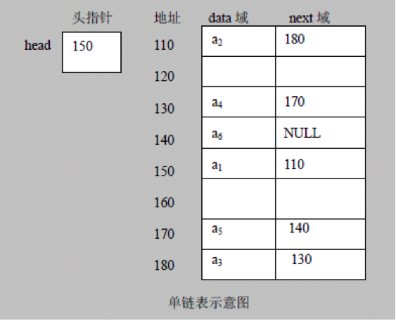

1. 链表是以节点的方式来存储，是==链式存储==
2. 每个节点包含 data 域， next 域:指向下一个节点。
3. 如图:发现==链表的各个节点不一定是连续存储==。
4. 链表分==带头节点的链表==和==没有头节点的链表==，根据实际的需求来确定。


# 4.2 单链表

## 4.2.1 介绍


单链表(带头结点) 逻辑结构示意图如下


## 4.2.2 应用实例-增删改查思路


使用带head头的单向链表实现 –水浒英雄排行榜管理


1. 第一种方法在添加英雄时，直接添加到链表的尾部 

思路分析示意图:

| ddddddddddddddddddddddddddddddddddddddddddddddddddddddddddddddddddddddddddddddddddddddddddddddddddddd | d    |
| ------------------------------------------------------------ | ---- |
| 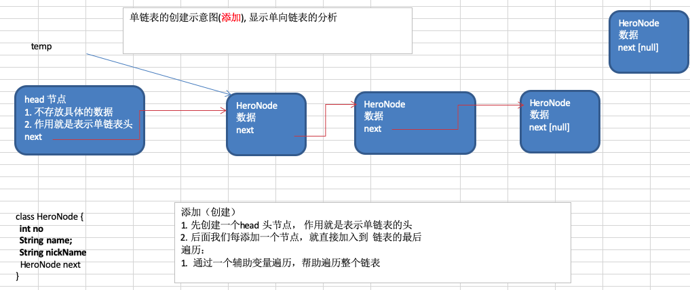 |      |


2. 第二种方式在添加英雄时，根据排名将英雄插入到指定位置(如果有这个排名，则添加失败，并给出提示) 

思路的分析示意图:

| ddddddddddddddddddddddddddddddddddddddddddddddddddddddddddddddddddddddddddddddddddddddddddd | d    |
| ------------------------------------------------------------ | ---- |
| 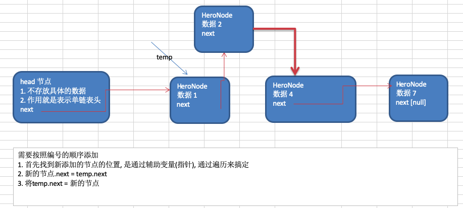 |      |


3.  修改节点功能

思路:

* 先找到该节点，通过遍历
* `temp.name = newHeroNode.name ; temp.nickname= newHeroNode.nickname`


4. 删除节点

思路分析的示意图:

| dddddddddddddddddddddddddddddddddddddddddddddddddddddddddddddddddddddddddddddddddddddd | d    |
| ------------------------------------------------------------ | ---- |
| 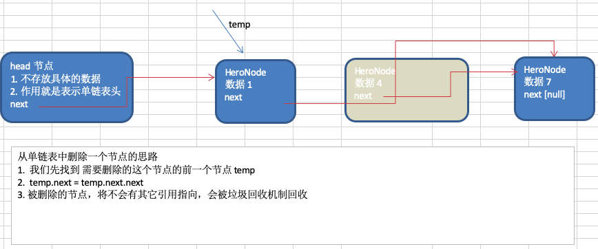 |      |


## 4.2.3 代码实现


```java
package com.atguigu.linkedlist;

//定义SingleLinkedList 管理我们的英雄
class SingleLinkedList {
	//先初始化一个头节点, 头节点不要动, 不存放具体的数据
	private HeroNode head = new HeroNode(0, "", "");
	
	//返回头节点
	public HeroNode getHead() {
		return head;
	}

	//添加节点到单向链表
	//思路，当不考虑编号顺序时
	//1. 找到当前链表的最后节点
	//2. 将最后这个节点的next 指向 新的节点
	public void add(HeroNode heroNode) {
		
		//因为head节点不能动，因此我们需要一个辅助遍历 temp
		HeroNode temp = head;
		//遍历链表，找到最后
		while(true) {
			//找到链表的最后
			if(temp.next == null) {//
				break;
			}
			//如果没有找到最后, 将将temp后移
			temp = temp.next;
		}
		//当退出while循环时，temp就指向了链表的最后
		//将最后这个节点的next 指向 新的节点
		temp.next = heroNode;
	}
	
	//第二种方式在添加英雄时，根据排名将英雄插入到指定位置
	//(如果有这个排名，则添加失败，并给出提示)
	public void addByOrder(HeroNode heroNode) {
		//因为头节点不能动，因此我们仍然通过一个辅助指针(变量)来帮助找到添加的位置
		//因为单链表，因为我们找的temp 是位于 添加位置的前一个节点，否则插入不了
		HeroNode temp = head;
		boolean flag = false; // flag标志添加的编号是否存在，默认为false
		while(true) {
			if(temp.next == null) {//说明temp已经在链表的最后
				break; //
			} 
			if(temp.next.no > heroNode.no) { //位置找到，就在temp的后面插入
				break;
			} else if (temp.next.no == heroNode.no) {//说明希望添加的heroNode的编号已然存在			
				flag = true; //说明编号存在
				break;
			}
			temp = temp.next; //后移，遍历当前链表
		}
		//判断flag 的值
		if(flag) { //不能添加，说明编号存在
			System.out.printf("准备插入的英雄的编号 %d 已经存在了, 不能加入\n", heroNode.no);
		} else {
			//插入到链表中, temp的后面
			heroNode.next = temp.next;
			temp.next = heroNode;
		}
	}

	//修改节点的信息, 根据no编号来修改，即no编号不能改.
	//说明
	//1. 根据 newHeroNode 的 no 来修改即可
	public void update(HeroNode newHeroNode) {
		//判断是否空
		if(head.next == null) {
			System.out.println("链表为空~");
			return;
		}
		//找到需要修改的节点, 根据no编号
		//定义一个辅助变量
		HeroNode temp = head.next;
		boolean flag = false; //表示是否找到该节点
		while(true) {
			if (temp == null) {
				break; //已经遍历完链表
			}
			if(temp.no == newHeroNode.no) {
				//找到
				flag = true;
				break;
			}
			temp = temp.next;
		}
		//根据flag 判断是否找到要修改的节点
		if(flag) {
			temp.name = newHeroNode.name;
			temp.nickname = newHeroNode.nickname;
		} else { //没有找到
			System.out.printf("没有找到 编号 %d 的节点，不能修改\n", newHeroNode.no);
		}
	}
	
	//删除节点
	//思路
	//1. head 不能动，因此我们需要一个temp辅助节点找到待删除节点的前一个节点
	//2. 说明我们在比较时，是temp.next.no 和  需要删除的节点的no比较
	public void del(int no) {
		HeroNode temp = head;
		boolean flag = false; // 标志是否找到待删除节点的
		while(true) {
			if(temp.next == null) { //已经到链表的最后
				break;
			}
			if(temp.next.no == no) {
				//找到的待删除节点的前一个节点temp
				flag = true;
				break;
			}
			temp = temp.next; //temp后移，遍历
		}
		//判断flag
		if(flag) { //找到
			//可以删除
			temp.next = temp.next.next;
		}else {
			System.out.printf("要删除的 %d 节点不存在\n", no);
		}
	}
	
	//显示链表[遍历]
	public void list() {
		//判断链表是否为空
		if(head.next == null) {
			System.out.println("链表为空");
			return;
		}
		//因为头节点，不能动，因此我们需要一个辅助变量来遍历
		HeroNode temp = head.next;
		while(true) {
			//判断是否到链表最后
			if(temp == null) {
				break;
			}
			//输出节点的信息
			System.out.println(temp);
			//将temp后移， 一定小心
			temp = temp.next;
		}
	}
}

//定义HeroNode ， 每个HeroNode 对象就是一个节点
class HeroNode {
	public int no;
	public String name;
	public String nickname;
	public HeroNode next; //指向下一个节点
	//构造器
	public HeroNode(int no, String name, String nickname) {
		this.no = no;
		this.name = name;
		this.nickname = nickname;
	}
	//为了显示方法，我们重新toString
	@Override
	public String toString() {
		return "HeroNode [no=" + no + ", name=" + name + ", nickname=" + nickname + "]";
	}
}
```


# 4.3 单链表面试题(新浪、百度、腾讯)

1. 求单链表中有效节点的个数

2. 查找单链表中的倒数第k个结点 【新浪面试题】

3. 单链表的反转【腾讯面试题，有点难度】

4. 从尾到头打印单链表 【百度，要求方式1：反向遍历 。 方式2：Stack栈】
5. 合并两个有序的单链表，合并之后的链表依然有序


## 4.3.1 链表中有效节点的个数


```java
//方法：获取到单链表的节点的个数(如果是带头结点的链表，需求不统计头节点)
/**
	 * 
	 * @param head 链表的头节点
	 * @return 返回的就是有效节点的个数
	 */
public static int getLength(HeroNode head) {
    if(head.next == null) { //空链表
        return 0;
    }
    int length = 0;
    //定义一个辅助的变量, 这里我们没有统计头节点
    HeroNode cur = head.next;
    while(cur != null) {
        length++;
        cur = cur.next; //遍历
    }
    return length;
}
```


## 4.3.2 单链表中的倒数第k个结点 


```java
//查找单链表中的倒数第k个结点 【新浪面试题】
//思路
//1. 编写一个方法，接收head节点，同时接收一个index 
//2. index 表示是倒数第index个节点
//3. 先把链表从头到尾遍历，得到链表的总的长度 getLength
//4. 得到size 后，我们从链表的第一个开始遍历 (size-index)个，就可以得到
//5. 如果找到了，则返回该节点，否则返回nulll
public static HeroNode findLastIndexNode(HeroNode head, int index) {
    //判断如果链表为空，返回null
    if(head.next == null) {
        return null;//没有找到
    }
    //第一个遍历得到链表的长度(节点个数)
    int size = getLength(head);//习题一的代码
    //第二次遍历  size-index 位置，就是我们倒数的第K个节点
    //先做一个index的校验
    if(index <=0 || index > size) {
        return null; 
    }
    //定义给辅助变量， for 循环定位到倒数的index
    HeroNode cur = head.next; //3 // 3 - 1 = 2
    for(int i =0; i< size - index; i++) {
        cur = cur.next;
    }
    return cur;
}
```


## 4.3.3 单链表的反转


| ddddddddddddddddddddddddddddddddddddddddddddddddddddddddddddddddddddddddddddddddddddddddd | d    |
| ------------------------------------------------------------ | ---- |
| 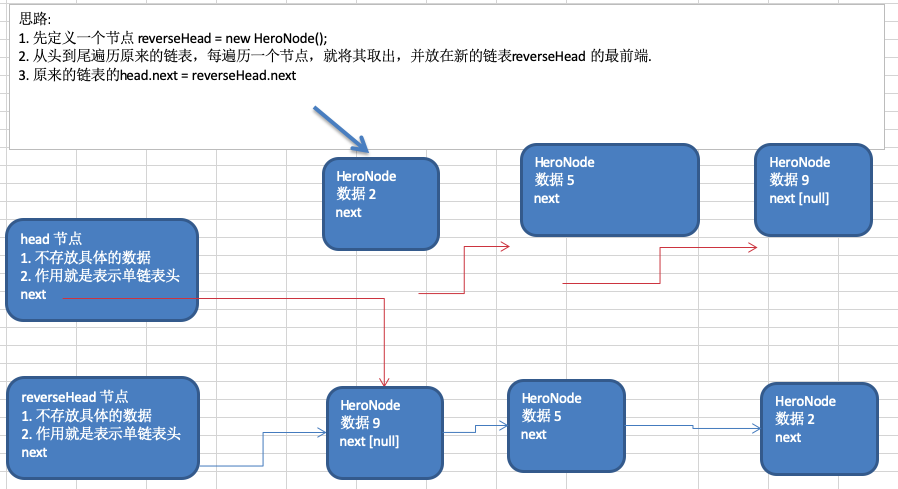 |      |

```java
//将单链表反转
public static void reversetList(HeroNode head) {
    //如果当前链表为空，或者只有一个节点，无需反转，直接返回
    if(head.next == null || head.next.next == null) {
        return ;
    }

    //定义一个辅助的指针(变量)，帮助我们遍历原来的链表
    HeroNode cur = head.next;
    HeroNode next = null;// 指向当前节点[cur]的下一个节点
    HeroNode reverseHead = new HeroNode(0, "", "");
    //遍历原来的链表，每遍历一个节点，就将其取出，并放在新的链表reverseHead 的最前端
    //动脑筋
    while(cur != null) { 
        next = cur.next;//先暂时保存当前节点的下一个节点，因为后面需要使用
        cur.next = reverseHead.next;//将cur的下一个节点指向新的链表的最前端
        reverseHead.next = cur; //将cur 连接到新的链表上
        cur = next;//让cur后移
    }
    //将head.next 指向 reverseHead.next , 实现单链表的反转
    head.next = reverseHead.next;
}
```


## 4.3.4 从尾到头打印单链表


| dddddddddddddddddddddddddddddddddddddddddddddddddddddddddddddddddddddddddddddddddddddddddddd | d    |
| ------------------------------------------------------------ | ---- |
| 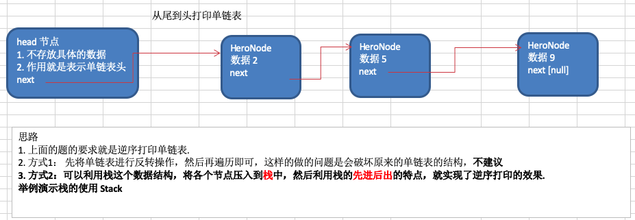 |      |

方式2 分析如下

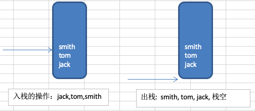

方式2代码实现

```java
//方式2：
//可以利用栈这个数据结构，将各个节点压入到栈中，然后利用栈的先进后出的特点，就实现了逆序打印的效果
public static void reversePrint(HeroNode head) {
    if(head.next == null) {
        return;//空链表，不能打印
    }
    //创建要给一个栈，将各个节点压入栈
    Stack<HeroNode> stack = new Stack<HeroNode>();
    HeroNode cur = head.next;
    //将链表的所有节点压入栈
    while(cur != null) {
        stack.push(cur);
        cur = cur.next; //cur后移，这样就可以压入下一个节点
    }
    //将栈中的节点进行打印,pop 出栈
    while (stack.size() > 0) {
        System.out.println(stack.pop()); //stack的特点是先进后出
    }
}
```


# 4.3 双向链表

## 4.3.1 和单向链表对比


1. 单向链表，==查找的方向只能是一个方向==，而双向链表可以向前或者向后查找。
2. 单向链表不能自我删除，需要靠辅助节点 ，而双向链表，则可以==自我删除==，所以前面我们单链表删除
    时节点，总是找到temp(temp是待删除节点的前一个节点)。


## 4.3.2  应用实例-增删改查思路


使用带head头的双向链表实现 –水浒英雄排行榜

| ddddddddddddddddddddddddddddddddddddddddddddddddddddddddddddddddddddddddddddddddddddddddddddddddddddddddd | d    |
| ------------------------------------------------------------ | ---- |
|  |      |

1. **遍历** 方法和 单链表一样，只是可以向前，也可以向后查找。
2. **添加** (默认添加到双向链表的最后)。
   * 先找到双向链表的最后这个节点
   * `temp.next = newHeroNode`
   * `newHeroNode.pre = temp`
3. **修改** 思路和 原来的单向链表一样。
4. **删除**
   * 因为是双向链表，因此，我们可以实现自我删除某个节点。
   * 直接找到要删除的这个节点，比如temp。
   * `temp.pre.next = temp.next`
   * `temp.next.pre = temp.pre`


## 4.3.3 代码实现


```java
package com.atguigu.linkedlist;

// 创建一个双向链表的类
class DoubleLinkedList {

	// 先初始化一个头节点, 头节点不要动, 不存放具体的数据
	private HeroNode2 head = new HeroNode2(0, "", "");

	// 返回头节点
	public HeroNode2 getHead() {
		return head;
	}

	// 遍历双向链表的方法
	// 显示链表[遍历]
	public void list() {
		// 判断链表是否为空
		if (head.next == null) {
			System.out.println("链表为空");
			return;
		}
		// 因为头节点，不能动，因此我们需要一个辅助变量来遍历
		HeroNode2 temp = head.next;
		while (true) {
			// 判断是否到链表最后
			if (temp == null) {
				break;
			}
			// 输出节点的信息
			System.out.println(temp);
			// 将temp后移， 一定小心
			temp = temp.next;
		}
	}

	// 添加一个节点到双向链表的最后.
	public void add(HeroNode2 heroNode) {

		// 因为head节点不能动，因此我们需要一个辅助遍历 temp
		HeroNode2 temp = head;
		// 遍历链表，找到最后
		while (true) {
			// 找到链表的最后
			if (temp.next == null) {//
				break;
			}
			// 如果没有找到最后, 将将temp后移
			temp = temp.next;
		}
		// 当退出while循环时，temp就指向了链表的最后
		// 形成一个双向链表
		temp.next = heroNode;
		heroNode.pre = temp;
	}

	// 修改一个节点的内容, 可以看到双向链表的节点内容修改和单向链表一样
	// 只是 节点类型改成 HeroNode2
	public void update(HeroNode2 newHeroNode) {
		// 判断是否空
		if (head.next == null) {
			System.out.println("链表为空~");
			return;
		}
		// 找到需要修改的节点, 根据no编号
		// 定义一个辅助变量
		HeroNode2 temp = head.next;
		boolean flag = false; // 表示是否找到该节点
		while (true) {
			if (temp == null) {
				break; // 已经遍历完链表
			}
			if (temp.no == newHeroNode.no) {
				// 找到
				flag = true;
				break;
			}
			temp = temp.next;
		}
		// 根据flag 判断是否找到要修改的节点
		if (flag) {
			temp.name = newHeroNode.name;
			temp.nickname = newHeroNode.nickname;
		} else { // 没有找到
			System.out.printf("没有找到 编号 %d 的节点，不能修改\n", newHeroNode.no);
		}
	}

	// 从双向链表中删除一个节点,
	// 说明
	// 1 对于双向链表，我们可以直接找到要删除的这个节点
	// 2 找到后，自我删除即可
	public void del(int no) {

		// 判断当前链表是否为空
		if (head.next == null) {// 空链表
			System.out.println("链表为空，无法删除");
			return;
		}

		HeroNode2 temp = head.next; // 辅助变量(指针)
		boolean flag = false; // 标志是否找到待删除节点的
		while (true) {
			if (temp == null) { // 已经到链表的最后
				break;
			}
			if (temp.no == no) {
				// 找到的待删除节点的前一个节点temp
				flag = true;
				break;
			}
			temp = temp.next; // temp后移，遍历
		}
		// 判断flag
		if (flag) { // 找到
			// 可以删除
			// temp.next = temp.next.next;[单向链表]
			temp.pre.next = temp.next;
			// 这里我们的代码有问题?
			// 如果是最后一个节点，就不需要执行下面这句话，否则出现空指针
			if (temp.next != null) {
				temp.next.pre = temp.pre;
			}
		} else {
			System.out.printf("要删除的 %d 节点不存在\n", no);
		}
	}

}

// 定义HeroNode2 ， 每个HeroNode 对象就是一个节点
class HeroNode2 {
	public int no;
	public String name;
	public String nickname;
	public HeroNode2 next; // 指向下一个节点, 默认为null
	public HeroNode2 pre; // 指向前一个节点, 默认为null
	// 构造器

	public HeroNode2(int no, String name, String nickname) {
		this.no = no;
		this.name = name;
		this.nickname = nickname;
	}

	// 为了显示方法，我们重新toString
	@Override
	public String toString() {
		return "HeroNode [no=" + no + ", name=" + name + ", nickname=" + nickname + "]";
	}

}
```


# 4.4 单向环形链

## 4.4.1 介绍


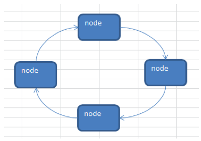


## 4.4.2 Josephu 问题


Josephu(约瑟夫、约瑟夫环) 问题

设编号为 1，2，... n 的 n 个人围坐一圈，约定编号为 k(1<=k<=n)的人从 1 开始报数，数 到 m 的那个人出列，它的下一位又从 1 开始报数，数到 m 的那个人又出列，依次类推，直到所有人出列为止，由 此产生一个出队编号的序列。


**提示**：用一个不带头结点的循环链表来处理Josephu 问题：先构成一个有n个结点的单循环链表，然后由k结点起从1开始计数，计到m时，对应结点从链表中删除，然后再从被删除结点的下一个结点又从1开始计数，直到最后一个结点从链表中删除算法结束。


## 4.4.3 Josephu 问题分析


1. 总体思路

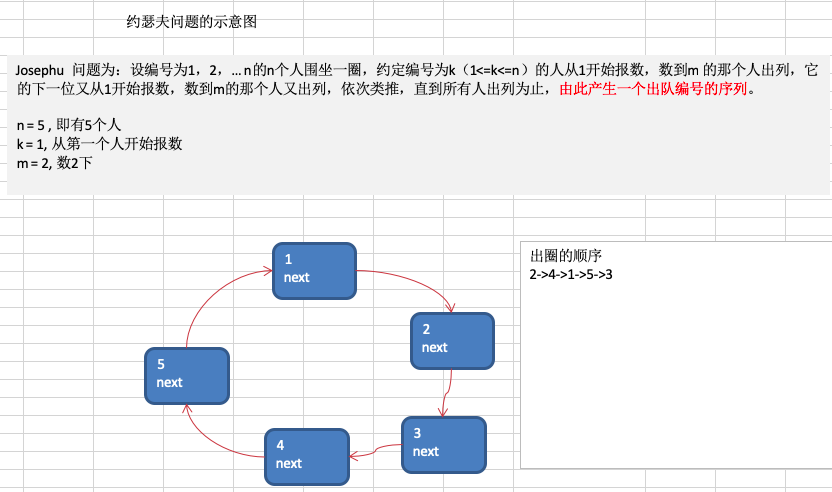


2. 创建环形链表的思路图解

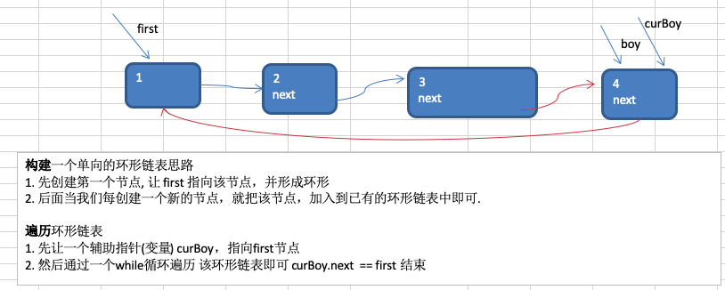


3. 小孩出圈的思路分析图

| dddddddddddddddddddddddddddddddddddddddddddddddddddddddddddddddddddddddddddddddddddddddddddd |      |
| ------------------------------------------------------------ | ---- |
| 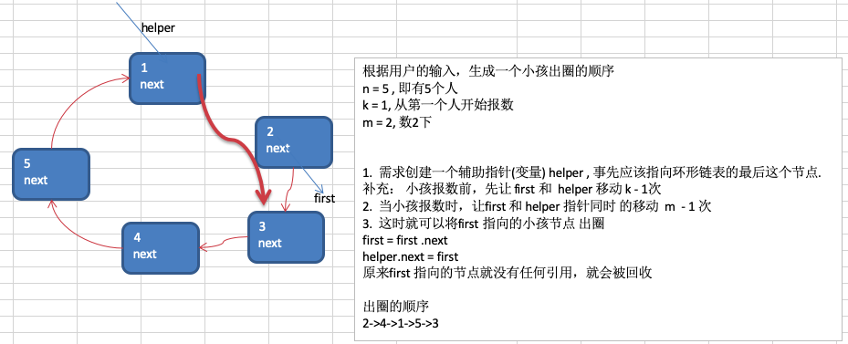 |      |


## 4.4.4 Josephu 问题代码实现


```java
package com.atguigu.linkedlist;

public class Josepfu {

	public static void main(String[] args) {
		// 测试一把看看构建环形链表，和遍历是否ok 创建5个小孩的环形链表
		CircleSingleLinkedList circleSingleLinkedList = new CircleSingleLinkedList(5);
		circleSingleLinkedList.showBoy();// 展示环形链表中的小孩编号
		
		//测试一把小孩出圈是否正确
		circleSingleLinkedList.countBoy(1, 2, 5); // 2->4->1->5->3
	}
}

// 创建一个环形的单向链表
class CircleSingleLinkedList {
	// 创建一个first节点,当前没有编号
	private Boy first = null;
	
	public CircleSingleLinkedList(int nums) {
		initBoy(nums);
	}

	// 添加小孩节点，构建成一个环形的链表
	private void initBoy(int nums) {
		// nums 做一个数据校验
		if (nums < 1) {
			System.out.println("nums的值不正确");
			return;
		}
		Boy curBoy = null; // 辅助指针，帮助构建环形链表
		// 使用for来创建我们的环形链表
		for (int i = 1; i <= nums; i++) {
			// 根据编号，创建小孩节点
			Boy boy = new Boy(i);
			// 如果是第一个小孩
			if (i == 1) {
				first = boy;
				first.setNext(first); // 构成环
				curBoy = first; // 让curBoy指向第一个小孩
			} else {
				curBoy.setNext(boy);//
				boy.setNext(first);//
				curBoy = boy;
			}
		}
	}

	// 遍历当前的环形链表
	public void showBoy() {
		// 判断链表是否为空
		if (first == null) {
			System.out.println("没有任何小孩~~");
			return;
		}
		// 因为first不能动，因此我们仍然使用一个辅助指针完成遍历
		Boy curBoy = first;
		while (true) {
			System.out.printf("小孩的编号 %d \n", curBoy.getNo());
			if (curBoy.getNext() == first) {// 说明已经遍历完毕
				break;
			}
			curBoy = curBoy.getNext(); // curBoy后移
		}
	}

	// 根据用户的输入，计算出小孩出圈的顺序
	/**
	 * @param startNo 表示从第几个小孩开始数数
	 * @param countNum 表示数几下
	 * @param nums 表示最初有多少小孩在圈中
	 */
	public void countBoy(int startNo, int countNum, int nums) {
		// 先对数据进行校验
		if (first == null || startNo < 1 || startNo > nums) {
			System.out.println("参数输入有误， 请重新输入");
			return;
		}
		// 创建要给辅助指针,帮助完成小孩出圈
		Boy helper = first;
		// 需求创建一个辅助指针(变量) helper , 事先应该指向环形链表的最后这个节点
		while (true) {
			if (helper.getNext() == first) { // 说明helper指向最后小孩节点
				break;
			}
			helper = helper.getNext();
		}
		//小孩报数前，先让 first 和  helper 移动 k - 1次
		for(int j = 0; j < startNo - 1; j++) {
			first = first.getNext();
			helper = helper.getNext();
		}
		//当小孩报数时，让first 和 helper 指针同时 的移动  m  - 1 次, 然后出圈
		//这里是一个循环操作，知道圈中只有一个节点
		while(true) {
			if(helper == first) { //说明圈中只有一个节点
				break;
			}
			//让 first 和 helper 指针同时 的移动 countNum - 1
			for(int j = 0; j < countNum - 1; j++) {
				first = first.getNext();
				helper = helper.getNext();
			}
			//这时first指向的节点，就是要出圈的小孩节点
			System.out.printf("小孩%d出圈\n", first.getNo());
			//这时将first指向的小孩节点出圈
			first = first.getNext();
			helper.setNext(first); //
			
		}
		System.out.printf("最后留在圈中的小孩编号%d \n", first.getNo());
		
	}
}

// 创建一个Boy类，表示一个节点
class Boy {
	private int no;// 编号
	private Boy next; // 指向下一个节点,默认null

	public Boy(int no) {
		this.no = no;
	}

	//setter getter...
}
```

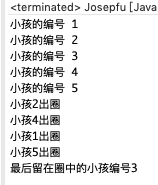


