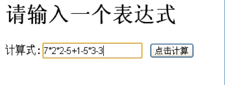
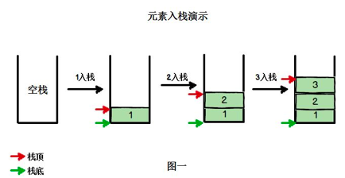
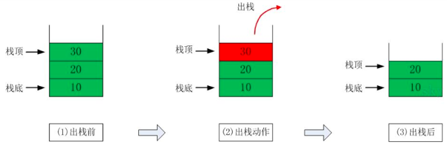
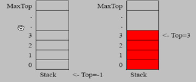

# 5.1 栈的一个实际需求


请输入一个表达式

计算式:[7\*2\*2-5+1-5+3-3] 点击计算【如下图】



请问: 计算机底层是如何运算得到结果的？ 注意不是简单的把算式列出运算，因为我们看这个算式 7 * 2 * 2 - 5, **但是计算机怎么理解这个算式的**(对计算机而言，它接收到的就是一个字符串) => 栈。


# 5.2 栈

## 5.2.1 基本介绍


1. 栈的英文为(stack)。
2. 栈是一个==先入后出(==FILO-FirstInLastOut)的有序列表。
3. 栈(stack)是限制线性表中元素的插入和删除只能在线性表的同一端进行的一种特殊线性表。允许插入和删除的一端，为==变化的一端，称为栈顶(Top)==，另一端为==固定的一端，称为栈底(Bottom)==。
4. 根据栈的定义可知，最先放入栈中元素在栈底，最后放入的元素在栈顶，而删除元素刚好相反，最后放入的元素最先删除，最先放入的元素最后删除。
5. 图解方式说明出栈(pop)和入栈(push)的概念。






## 5.2.2 数组模拟栈




```java
package com.atguigu.stack;

//定义一个 ArrayStack 表示栈
class ArrayStack {
	private int maxSize; // 栈的大小
	private int[] stack; // 数组，数组模拟栈，数据就放在该数组
	private int top = -1;// top表示栈顶，初始化为-1
	
	//构造器
	public ArrayStack(int maxSize) {
		this.maxSize = maxSize;
		stack = new int[this.maxSize];
	}
	
	//栈满
	public boolean isFull() {
		return top == maxSize - 1;
	}
	//栈空
	public boolean isEmpty() {
		return top == -1;
	}
	//入栈-push
	public void push(int value) {
		//先判断栈是否满
		if(isFull()) {
			System.out.println("栈满");
			return;
		}
		top++;
		stack[top] = value;
	}
	//出栈-pop, 将栈顶的数据返回
	public int pop() {
		//先判断栈是否空
		if(isEmpty()) {
			//抛出异常
			throw new RuntimeException("栈空，没有数据~");
		}
		int value = stack[top];
		top--;
		return value;
	}
	//显示栈的情况[遍历栈]， 遍历时，需要从栈顶开始显示数据
	public void list() {
		if(isEmpty()) {
			System.out.println("栈空，没有数据~~");
			return;
		}
		//需要从栈顶开始显示数据
		for(int i = top; i >= 0 ; i--) {
			System.out.printf("stack[%d]=%d\n", i, stack[i]);
		}
	}
	
}
```


# 5.3 栈实现综合计算器(中缀表达式)


# 5. 栈的应用场景


1. 子程序的调用：在跳往子程序前，会先将下个指令的地址存到堆栈中，直到子程序执行完后再将地址取出，以回到原来的程序中。 

2. 处理递归调用：和子程序的调用类似，只是除了储存下一个指令的地址外，也将参数、区域变量等数据存入堆栈中。

3. 表达式的转换[中缀表达式转后缀表达式]与求值(实际解决)。

4. 二叉树的遍历。

5. 图形的深度优先(depth一first)搜索法。

   