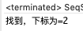
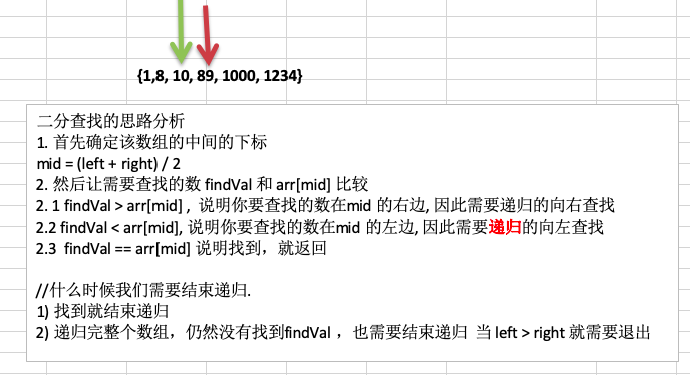
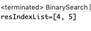
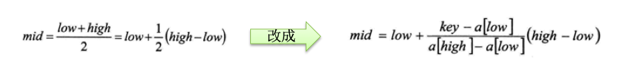
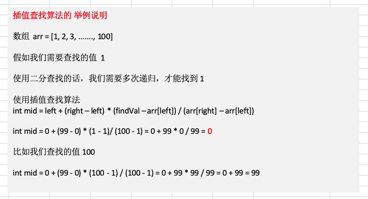
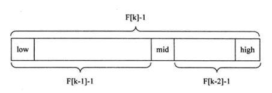
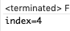

# 8.1 查找算法介绍


在 java 中，我们常用的查找有四种：

1. 顺序(线性)查找
2. 二分查找/折半查找
3. 插值查找
4. 斐波那契查找


# 8.2 线性查找算法


```java
package com.atguigu.search;

public class SeqSearch {

	public static void main(String[] args) {
		int arr[] = { 1, 9, 11, -1, 34, 89 };// 没有顺序的数组
		int index = seqSearch(arr, 11);
		if(index == -1) {
			System.out.println("没有找到到");
		} else {
			System.out.println("找到，下标为=" + index);
		}
	}
	
	 //这里我们实现的线性查找是找到一个满足条件的值，就返回
	public static int seqSearch(int[] arr, int value) {
		// 线性查找是逐一比对，发现有相同值，就返回下标
		for (int i = 0; i < arr.length; i++) {
			if(arr[i] == value) {
				return i;
			}
		}
		return -1;
	}

}
```




# 8.3 二分查找算法

## 8.3.1 基本思路





## 8.3.2 代码实现


```java
package com.atguigu.search;

import java.util.ArrayList;
import java.util.List;

//注意：使用二分查找的前提是 该数组是有序的.
public class BinarySearch {

	public static void main(String[] args) {
		int arr[] = { 1, 8, 10, 89,1000,1234};
		int resIndex = binarySearch(arr, 0, arr.length - 1, 1000);
		System.out.println("resIndex=" + resIndex);
	}

	// 二分查找算法
	/**
	 * @param arr 数组
	 * @param left 左边的索引
	 * @param right 右边的索引
	 * @param findVal 要查找的值
	 * @return 如果找到就返回下标，如果没有找到，就返回 -1
	 */
	public static int binarySearch(int[] arr, int left, int right, int findVal) {
		
		// 当 left > right 时，说明递归整个数组，但是没有找到
		if (left > right) {
			return -1;
		}
		int mid = (left + right) / 2;
		int midVal = arr[mid];

		if (findVal > midVal) { // 向 右递归
			return binarySearch(arr, mid + 1, right, findVal);
		} else if (findVal < midVal) { // 向左递归
			return binarySearch(arr, left, mid - 1, findVal);
		} else {
			return mid;
		}
	}
}
```


## 8.3.3 扩展实现


{1,8, 10, 89,1000,1000,1234} 当一个有序数组中，有多个相同的数值时，如何将所有的数值都查找到，比如这里的 1000。

```java
package com.atguigu.search;

import java.util.ArrayList;
import java.util.List;

//注意：使用二分查找的前提是 该数组是有序的.
public class BinarySearch {

	public static void main(String[] args) {
		int arr[] = { 1, 8, 10, 89,1000,1000,1234};
		
		List<Integer> resIndexList = binarySearch2(arr, 0, arr.length - 1, 1000);
		System.out.println("resIndexList=" + resIndexList);
	}
	
	//思考题:
	/*
	 * 思考题： {1,8, 10, 89, 1000, 1000，1234} 当一个有序数组中，
	 * 有多个相同的数值时，如何将所有的数值都查找到，比如这里的 1000
	 */
	public static List<Integer> binarySearch2(int[] arr, int left, int right, int findVal) {
		// 当 left > right 时，说明递归整个数组，但是没有找到
		if (left > right) {
			return new ArrayList<Integer>();
		}
		int mid = (left + right) / 2;
		int midVal = arr[mid];

		if (findVal > midVal) { // 向 右递归
			return binarySearch2(arr, mid + 1, right, findVal);
		} else if (findVal < midVal) { // 向左递归
			return binarySearch2(arr, left, mid - 1, findVal);
		} else {
//			 * 思路分析
//			 * 1. 在找到mid 索引值，不要马上返回
//			 * 2. 向mid 索引值的左边扫描，将所有满足 1000， 的元素的下标，加入到集合ArrayList
//			 * 3. 向mid 索引值的右边扫描，将所有满足 1000， 的元素的下标，加入到集合ArrayList
//			 * 4. 将Arraylist返回
			
			List<Integer> resIndexlist = new ArrayList<Integer>();
			//向mid 索引值的左边扫描，将所有满足 1000， 的元素的下标，加入到集合ArrayList
			int temp = mid - 1;
			while(true) {
				if (temp < 0 || arr[temp] != findVal) {//退出
					break;
				}
				//否则，就temp 放入到 resIndexlist
				resIndexlist.add(temp);
				temp -= 1; //temp左移
			}
			resIndexlist.add(mid);  //
			
			//向mid 索引值的右边扫描，将所有满足 1000， 的元素的下标，加入到集合ArrayList
			temp = mid + 1;
			while(true) {
				if (temp > arr.length - 1 || arr[temp] != findVal) {//退出
					break;
				}
				//否则，就temp 放入到 resIndexlist
				resIndexlist.add(temp);
				temp += 1; //temp右移
			}
			
			return resIndexlist;
		}

	}
}
```




# 8.4 插值查找算法

## 8.4.1 原理介绍


1. 插值查找算法类似于二分查找，不同的是插值查找每次从==自适应mid==处开始查找。
2. 将折半查找中的求mid 索引的公式 , low 表示左边索引left，high表示右边索引right，key 就是前面我们讲的 findVal。



3. `int mid = low + (high - low) * (key - arr[low]) / (arr[high] - arr[low]) ;//插值索引`
4. 对应前面的代码公式：

`int mid = left + (right – left) * (findVal – arr[left]) / (arr[right] – arr[left])`


## 8.4.2 举例说明





## 8.4.3 代码实现


```java
package com.atguigu.search;
import java.util.Arrays;

public class InsertValueSearch {

	public static void main(String[] args) {
		int arr[] = { 1, 8, 10, 89,1000,1000,1234};
		int index = insertValueSearch(arr, 0, arr.length - 1, 1234);
		System.out.println("index = " + index);
	}

	//编写插值查找算法
	//说明：插值查找算法，也要求数组是有序的
	/**
	 * 
	 * @param arr 数组
	 * @param left 左边索引
	 * @param right 右边索引
	 * @param findVal 查找值
	 * @return 如果找到，就返回对应的下标，如果没有找到，返回-1
	 */
	public static int insertValueSearch(int[] arr, int left, int right, int findVal) { 
		System.out.println("差值查找进来了一次");
		
		//注意：findVal < arr[0]  和  findVal > arr[arr.length - 1] 必须需要
		//否则我们得到的 mid 可能越界
		if (left > right || findVal < arr[0] || findVal > arr[arr.length - 1]) {
			return -1;
		}

		// 求出mid, 自适应
		int mid = left + (right - left) * (findVal - arr[left]) / (arr[right] - arr[left]);
		int midVal = arr[mid];
		if (findVal > midVal) { // 说明应该向右边递归
			return insertValueSearch(arr, mid + 1, right, findVal);
		} else if (findVal < midVal) { // 说明向左递归查找
			return insertValueSearch(arr, left, mid - 1, findVal);
		} else {
			return mid;
		}

	}
}
```


## 8.4.4 插值查找注意事项


1. 对于数据量较大，==关键字分布比较均匀==的查找表来说，采用==插值查找，速度较快==。
2. 关键字分布不均匀的情况下，该方法不一定比折半查找要好。


# 8.5 斐波那契(黄金分割法)查找算法

## 8.5.1 基本介绍


1. 黄金分割点是指把一条线段分割为两部分，使其中一部分与全长之比等于另一部分与这部分之比。取其前三位 数字的近似值是 0.618。由于按此比例设计的造型十分美丽，因此称为黄金分割，也称为中外比。这是一个神 奇的数字，会带来意向不大的效果。
2. 斐波那契数列{1,1,2,3,5,8,13,21,34,55}发现斐波那契数列的两个相邻数的比例，无限接近黄金分割值 0.618。


## 8.5.2 原理介绍


斐波那契查找原理与前两种相似，仅仅改变了中间结点(mid)的位置，mid 不再是中间或插值得到，而是位于黄金分割点附近，即 mid=low+F(k-1)-1(F 代表斐波那契数列)，如下图所示



对 **F(k-1)-1** 的理解

1.  由斐波那契数列F[k]=F[k-1]+F[k-2]的性质，可以得到(F[k]-1)=(F[k-1]-1)+(F[k-2]-1)+1。该式说明:只要顺序表的长度为 F[k]-1，则可以将该表分成长度为 F[k-1]-1 和 F[k-2]-1 的两段，即如上图所示。从而中间位置为 mid=low+F(k-1)-1。
2. 类似的，每一子段也可以用相同的方式分割。
3. 但顺序表长度n不一定刚好等于F[k]-1，所以需要将原来的顺序表长度n增加至F[k]-1。这里的k值只要能使得 F[k]-1 恰好大于或等于 n 即可，由以下代码得到，顺序表长度增加后，新增的位置(从 n+1 到 F[k]-1 位置)， 都赋为 n 位置的值即可。

```java
while(n>fib(k)-1)
k++;
```


## 8.5.3 代码实现


```java
package com.atguigu.search;
import java.util.Arrays;

public class FibonacciSearch {

	public static int maxSize = 20;
	public static void main(String[] args) {
		int [] arr = {1,8, 10, 89, 1000, 1234};
		System.out.println("index=" + fibSearch(arr, 1000));
	}

	//因为后面我们mid=low+F(k-1)-1，需要使用到斐波那契数列，因此我们需要先获取到一个斐波那契数列
	//非递归方法得到一个斐波那契数列
	public static int[] fib() {
		int[] f = new int[maxSize];
		f[0] = 1;
		f[1] = 1;
		for (int i = 2; i < maxSize; i++) {
			f[i] = f[i - 1] + f[i - 2];
		}
		return f;
	}
	
	//编写斐波那契查找算法
	//使用非递归的方式编写算法
	/**
	 * @param a  数组
	 * @param key 我们需要查找的关键码(值)
	 * @return 返回对应的下标，如果没有-1
	 */
	public static int fibSearch(int[] a, int key) {
		int low = 0;
		int high = a.length - 1;
		int k = 0; //表示斐波那契分割数值的下标
		int mid = 0; //存放mid值
		int f[] = fib(); //获取到斐波那契数列
		//获取到斐波那契分割数值的下标
		while(high > f[k] - 1) {
			k++;
		}
		//因为 f[k] 值 可能大于 a 的 长度，因此我们需要使用Arrays类，构造一个新的数组，并指向temp[]
		//不足的部分会使用0填充
		int[] temp = Arrays.copyOf(a, f[k]);
		//实际上需求使用a数组最后的数填充 temp
		//举例:
		//temp = {1,8, 10, 89, 1000, 1234, 0, 0}  => {1,8, 10, 89, 1000, 1234, 1234, 1234}
		for(int i = high + 1; i < temp.length; i++) {
			temp[i] = a[high];
		}
		
		// 使用while来循环处理，找到我们的数 key
		while (low <= high) { // 只要这个条件满足，就可以找
			mid = low + f[k - 1] - 1;
			if(key < temp[mid]) { //我们应该继续向数组的前面查找(左边)
				high = mid - 1;
				//为甚是 k--
				//说明
				//1. 全部元素 = 前面的元素 + 后边元素
				//2. f[k] = f[k-1] + f[k-2]
				//因为 前面有 f[k-1]个元素,所以可以继续拆分 f[k-1] = f[k-2] + f[k-3]
				//即 在 f[k-1] 的前面继续查找 k--
				//即下次循环 mid = f[k-1-1]-1
				k--;
			} else if ( key > temp[mid]) { // 我们应该继续向数组的后面查找(右边)
				low = mid + 1;
				//为什么是k -=2
				//说明
				//1. 全部元素 = 前面的元素 + 后边元素
				//2. f[k] = f[k-1] + f[k-2]
				//3. 因为后面我们有f[k-2] 所以可以继续拆分 f[k-1] = f[k-3] + f[k-4]
				//4. 即在f[k-2] 的前面进行查找 k -=2
				//5. 即下次循环 mid = f[k - 1 - 2] - 1
				k -= 2;
			} else { //找到
				//需要确定，返回的是哪个下标
				if(mid <= high) {
					return mid;
				} else {
					return high;
				}
			}
		}
		return -1;
	}
}
```

