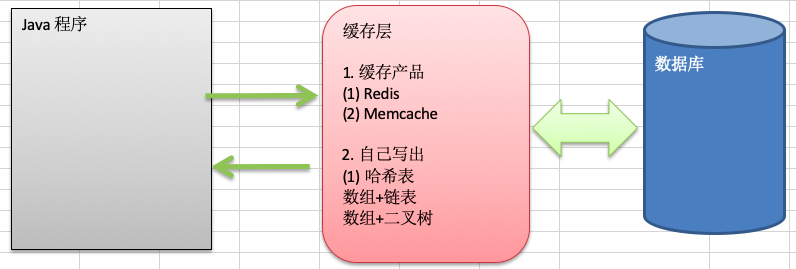
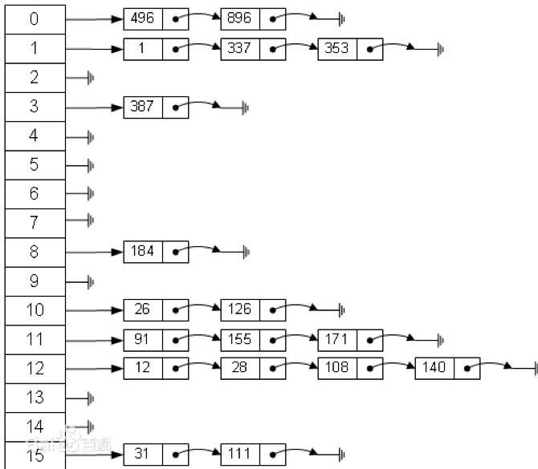
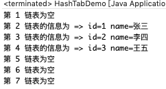

# 9.1 哈希表(散列)-Google 上机题


看一个实际需求，google公司的一个上机题:

1. 有一个公司，当有新的员工来报道时，要求将该员工的信息加入(id,性别,年龄,住址..)，当输入该员工的id时，要求查找到该员工的所有信息。
2. 要求: 不使用数据库，尽量节省内存，速度越快越好=>哈希表(散列)


# 9.2 哈希表基本介绍


散列表(Hash table，也叫哈希表)，是根据关键码值(Key value)而直接进行访问的数据结构。也就是说，它通过把关键码值映射到表中一个位置来访问记录，以加快查找的速度。这个映射函数叫做散列函数，存放记录的数组叫做散列表。






# 9.3 员工存储查找思路


1. 不使用数据库,速度越快越好=>哈希表(散列)
2. 添加时，保证按照 id 从低到高插入 [后期思考:如果 **id** 不是从低到高插入，但要求各条链表仍是从低到高，怎么解决?]
3. 使用链表来实现哈希表，该链表不带表头[即: 链表的第一个结点就存放雇员信息]。


# 9.4 代码实现


```java
package com.atguigu.hashtab;

public class HashTabDemo {

	public static void main(String[] args) {
		
		//创建哈希表
		HashTab hashTab = new HashTab(7);
		hashTab.add(new Emp(1,"张三"));
		hashTab.add(new Emp(2,"李四"));
		hashTab.add(new Emp(3,"王五"));
		
		hashTab.list();
	}

}

//创建HashTab 管理多条链表
class HashTab {
	private EmpLinkedList[] empLinkedListArray;
	private int size; //表示有多少条链表
	
	//构造器
	public HashTab(int size) {
		this.size = size;
		//初始化empLinkedListArray
		empLinkedListArray = new EmpLinkedList[size];
		//这时要分别初始化每个链表!!!!
		for(int i = 0; i < size; i++) {
			empLinkedListArray[i] = new EmpLinkedList();
		}
	}
	
	//添加雇员
	public void add(Emp emp) {
		//根据员工的id ,得到该员工应当添加到哪条链表
		int empLinkedListNO = hashFun(emp.id);
		//将emp 添加到对应的链表中
		empLinkedListArray[empLinkedListNO].add(emp);
		
	}
	//遍历所有的链表,遍历hashtab
	public void list() {
		for(int i = 0; i < size; i++) {
			empLinkedListArray[i].list(i);
		}
	}
	
	//根据输入的id,查找雇员
	public void findEmpById(int id) {
		//使用散列函数确定到哪条链表查找
		int empLinkedListNO = hashFun(id);
		Emp emp = empLinkedListArray[empLinkedListNO].findEmpById(id);
		if(emp != null) {//找到
			System.out.printf("在第%d条链表中找到 雇员 id = %d\n", (empLinkedListNO + 1), id);
		}else{
			System.out.println("在哈希表中，没有找到该雇员~");
		}
	}
	
	//编写散列函数, 使用一个简单取模法
	public int hashFun(int id) {
		return id % size;
	}
}

//表示一个雇员
class Emp {
	public int id;
	public String name;
	public Emp next; //next 默认为 null
	public Emp(int id, String name) {
		super();
		this.id = id;
		this.name = name;
	}
}

//创建EmpLinkedList ,表示链表
class EmpLinkedList {
	//头指针，执行第一个Emp,因此我们这个链表的head 是直接指向第一个Emp
	private Emp head; //默认null
	
	//添加雇员到链表
	//说明
	//1. 假定，当添加雇员时，id 是自增长，即id的分配总是从小到大
	//   因此我们将该雇员直接加入到本链表的最后即可
	public void add(Emp emp) {
		//如果是添加第一个雇员
		if(head == null) {
			head = emp;
			return;
		}
		//如果不是第一个雇员，则使用一个辅助的指针，帮助定位到最后
		Emp curEmp = head;
		while(true) {
			if(curEmp.next == null) {//说明到链表最后
				break;
			}
			curEmp = curEmp.next; //后移
		}
		//退出时直接将emp 加入链表
		curEmp.next = emp;
	}
	
	//遍历链表的雇员信息
	public void list(int no) {
		if(head == null) { //说明链表为空
			System.out.println("第 "+(no+1)+" 链表为空");
			return;
		}
		System.out.print("第 "+(no+1)+" 链表的信息为");
		Emp curEmp = head; //辅助指针
		while(true) {
			System.out.printf(" => id=%d name=%s\t", curEmp.id, curEmp.name);
			if(curEmp.next == null) {//说明curEmp已经是最后结点
				break;
			}
			curEmp = curEmp.next; //后移，遍历
		}
		System.out.println();
	}
	
	//根据id查找雇员
	//如果查找到，就返回Emp, 如果没有找到，就返回null
	public Emp findEmpById(int id) {
		//判断链表是否为空
		if(head == null) {
			System.out.println("链表为空");
			return null;
		}
		//辅助指针
		Emp curEmp = head;
		while(true) {
			if(curEmp.id == id) {//找到
				break;//这时curEmp就指向要查找的雇员
			}
			//退出
			if(curEmp.next == null) {//说明遍历当前链表没有找到该雇员
				curEmp = null;
				break;
			}
			curEmp = curEmp.next;//以后
		}
		return curEmp;
	}
	
}
```



