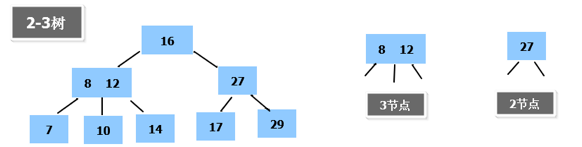
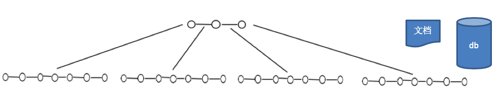
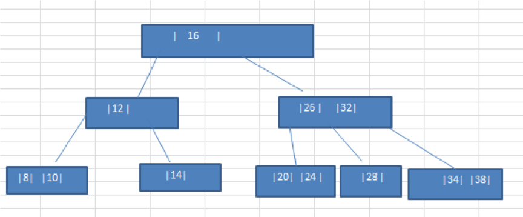
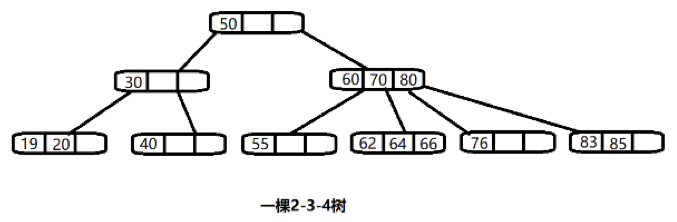
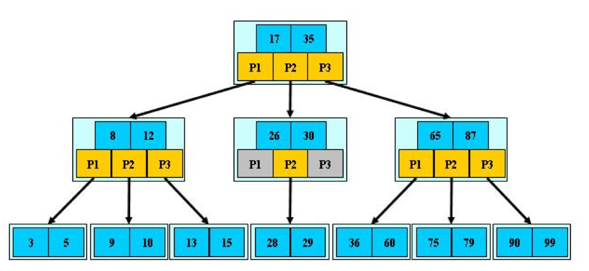
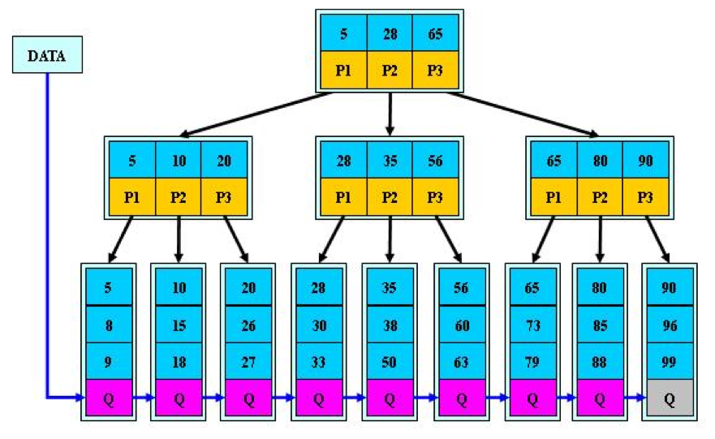

# 12.1 二叉树与B树

## 12.1.1 二叉树的问题分析

二叉树的操作效率较高，但是也存在问题, 请看下面的二叉树

1. 二叉树需要加载到内存的，如果二叉树的节点少，没有什么问题，但是如果二叉树的节点很多(比如1亿)， 就存在如下问题:
2. 问题1：在构建二叉树时，需要多次进行i/o操作(海量数据存在数据库或文件中)，节点海量，构建二叉树时，速度有影响。
3. 问题2：节点海量，也会造成二叉树的高度很大，会降低操作速度。

## 12.1.2 多叉树

1. 在二叉树中，每个节点有数据项，最多有两个子节点。如果允许每个节点可以有更多的数据项和更多的子节点， 就是多叉树(multiway tree)。
2. 后面我们讲解的2-3树，2-3-4树就是多叉树，多叉树通过重新组织节点，减少树的高度，能对二叉树进行优化。
3. 举例说明(下面2-3树就是一颗多叉树)。

## 12.1.3 B树的基本介绍

1. B 树通过重新组织节点，降低树的高度，并且减少 i/o 读写次数来提升效率。

2. 如图B树通过重新组织节点，降低了树的高度。
3. 文件系统及数据库系统的设计者利用了磁盘预读原理，将一个节点的大小设为等于一个页(页得大小通常为4k)，这样每个节点只需要一次 I/O 就可以完全载入。
4. 将树的度M设置为1024，在600亿个元素中最多只需要4次I/O操作就可以读取到想要的元素，B树(B+)广泛应用于文件存储系统以及数据库系统中。

# 12.2 2-3树

## 12.2.1基本介绍

2-3 树是最简单的 B 树结构, 具有如下特点:

1. 2-3 树的所有叶子节点都在同一层。(只要是 B 树都满足这个条件)。
2. 有两个子节点的节点叫二节点，二节点要么没有子节点，要么有两个子节点。
3. 有三个子节点的节点叫三节点，三节点要么没有子节点，要么有三个子节点。
4. 2-3 树是由二节点和三节点构成的树。

## 12.2.2 2-3树应用案例

将数列{16, 24, 12, 32, 14, 26, 34, 10, 8, 28, 38, 20} 构建成 2-3 树，并保证数据插入的大小顺序。(演示一下构建 2-3树的过程。)

插入规则:

1. 2-3 树的所有叶子节点都在同一层。(只要是 B 树都满足这个条件)
2. 有两个子节点的节点叫二节点，二节点要么没有子节点，要么有两个子节点。
3. 有三个子节点的节点叫三节点，三节点要么没有子节点，要么有三个子节点。
4. 当按照规则插入一个数到某个节点时，不能满足上面三个要求，就需要拆，先向上拆，如果上层满，则拆本层，拆后仍然需要满足上面 3 个条件。
5. 对于三节点的子树的值大小仍然遵守(BST 二叉排序树)的规则。

## 12.2.3 其他说明

除了23树，还有234树等，概念和23树类似，也是一种B树。 如图:

# 12.3 B 树、B+树和 B*树

## 12.3.1 B树的基本概念

B-tree 树即 B 树，B 即 Balanced，平衡的意思。有人把 B-tree 翻译成 B-树，容易让人产生误解。会以为 B-树 是一种树，而 B 树又是另一种树。实际上，B-tree 就是指的 B 树。

## 12.3.2 B树的介绍

前面已经介绍了 2-3 树和 2-3-4 树，他们就是 B 树(英语:B-tree 也写成 B-树)，这里我们再做一个说明，我们在学习 Mysql 时，经常听到说某种类型的索引是基于 B 树或者 B+树的，如图:

对上图的说明:

1. B 树的阶:节点的最多子节点个数。比如 2-3 树的阶是 3，2-3-4 树的阶是 4。
2. B-树的搜索，从根结点开始，对结点内的关键字(有序)序列进行二分查找，如果命中则结束，否则进入查询关键字所属范围的儿子结点；重复，直到所对应的儿子指针为空，或已经是叶子结点。
3. 关键字集合分布在整颗树中，即叶子节点和非叶子节点都存放数据。  
4. 搜索有可能在非叶子结点结束。
5. 其搜索性能等价于在关键字全集内做一次二分查找。

## 12.3.3 B+树的介绍

B+树是B树的变体，也是一种多路搜索树。

对上图的说明:

1. B+树的搜索与 B 树也基本相同，区别是 B+树只有达到叶子结点才命中(B 树可以在非叶子结点命中)，其性能也等价于在关键字全集做一次二分查找。
2. 所有关键字都出现在叶子结点的链表中(即数据只能在叶子节点【也叫稠密索引】)，且链表中的关键字(数据)恰好是有序的。  
3. 不可能在非叶子结点命中。
4. 非叶子结点相当于是叶子结点的索引(稀疏索引)，叶子结点相当于是存储(关键字)数据的数据层。
5. 更适合文件索引系统。
6. B 树和 B+树各有自己的应用场景，不能说 B+树完全比 B 树好，反之亦然。

## 12.3.4 B*树的介绍

B*树是 B+树的变体，在 B+树的==非根和非叶子结点==再增加==指向兄弟的指针==。

上图的说明：

1. B*树定义了非叶子结点关键字个数至少为(2/3)M，即块的最低使用率为 2/3，而 B+树的块的最低使用率为的1/2。

2. 从第1个特点我们可以看出，B*树分配新结点的概率比B+树要低，空间使用率更高。

   

   