# 12.1 堆排序

## 12.1.1 基本介绍


1. 堆排序是利用堆这种数据结构而设计的一种排序算法，堆排序是一种选择排序，它的最坏，最好，平均时间复 杂度均为 **O(nlogn)**，它也是不稳定排序。
2. 堆是具有以下性质的完全二叉树：每个结点的值都大于或等于其左右孩子结点的值，称为大顶堆, 注意：没有要求结点的左孩子的值和右孩子的值的大小关系。
3. 每个结点的值都小于或等于其左右孩子结点的值，称为小顶堆。
4. 大顶堆举例说明

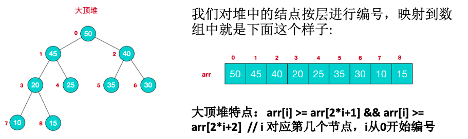

5. 小顶堆举例说明

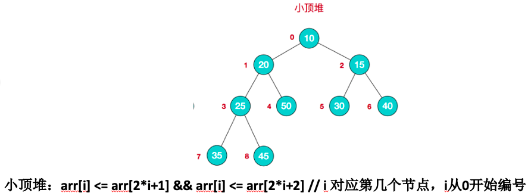

6. 一般升序采用大顶堆，降序采用小顶堆。


## 12.1.2 堆排序基本思想


1. 将待排序序列构造成一个大顶堆。
2. 此时，整个序列的最大值就是堆顶的根节点。
3. 将其与末尾元素进行交换，此时末尾就为最大值。
4. 然后将剩余n-1个元素重新构造成一个堆，这样会得到n个元素的次小值。如此反复执行，便能得到一个有序序列了。

可以看到在构建大顶堆的过程中，元素的个数逐渐减少，最后就得到一个有序序列了。


## 12.1.3 图解说明


要求:给你一个数组 {4,6,8,5,9} , 要求使用堆排序法，将数组升序排序。

**步骤一 构造初始堆。将给定无序序列构造成一个大顶堆(一般升序采用大顶堆，降序采用小顶堆)。**

**原始的数组 [4, 6, 8, 5, 9]**

1、假设给定无序序列结构如下

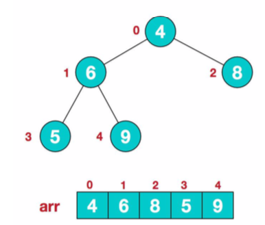

2、此时我们从最后一个非叶子结点开始(叶结点自然不用调整，第一个非叶子结点 arr.length/2-1=5/2-1=1，也就是下面的 6 结点)，从左至右，从下至上进行调整。

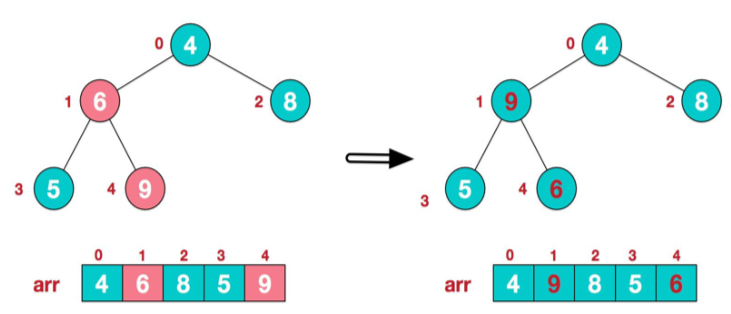

3、找到第二个非叶节点 4，由于[4,9,8]中 9 元素最大，4 和 9 交换。

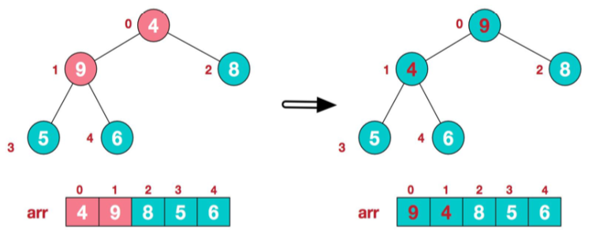

4、这时，交换导致了子根[4,5,6]结构混乱，继续调整，[4,5,6]中 6 最大，交换 4 和 6。

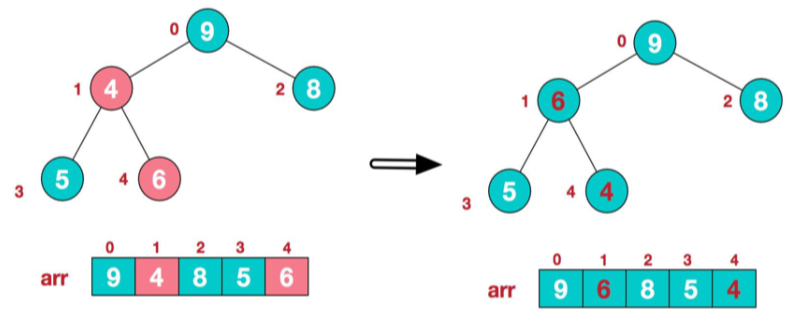

此时，我们就将一个无序序列构造成了一个大顶堆。

**步骤二 将堆顶元素与末尾元素进行交换，使末尾元素最大。然后继续调整堆，再将堆顶元素与末尾元素交换，得到第二大元素。如此反复进行交换、重建、交换。**

1、将堆顶元素 9 和末尾元素 4 进行交换

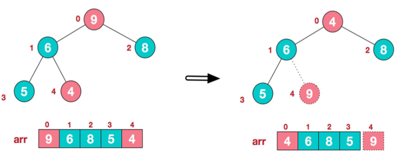

2、重新调整结构，使其继续满足堆定义


3、再将堆顶元素 8 与末尾元素 5 进行交换，得到第二大元素 8。

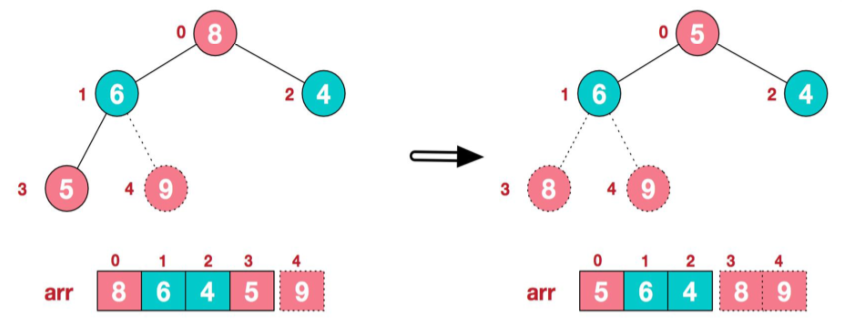

4、后续过程，继续进行调整，交换，如此反复进行，最终使得整个序列有序。

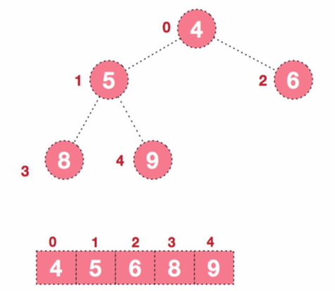


## 12.1.4 堆排序代码实现


```java
package com.atguigu.tree;
import java.util.Arrays;

public class HeapSort {

	public static void main(String[] args) {
		//要求将数组进行升序排序
		int arr[] = {4, 6, 8, 5, 9};
		System.out.println("排序前="+ Arrays.toString(arr));
		heapSort(arr);
		System.out.println("排序后=" + Arrays.toString(arr));
	}

	//编写一个堆排序的方法
	public static void heapSort(int arr[]) {
		int temp = 0;
		System.out.println("堆排序!!");
		
//		//分步完成
//		adjustHeap(arr, 1, arr.length);
//		System.out.println("第一次" + Arrays.toString(arr)); // 4,9,8,5,6
//		
//		adjustHeap(arr, 0, arr.length);
//		System.out.println("第2次" + Arrays.toString(arr)); // 9,6,8,5,4
		
		//完成我们最终代码
		//将无序序列构建成一个堆，根据升序降序需求选择大顶堆或小顶堆
		for(int i = arr.length / 2 -1; i >=0; i--) {
			adjustHeap(arr, i, arr.length);
		}
		
		/*
		 * 2).将堆顶元素与末尾元素交换，将最大元素"沉"到数组末端;
　　			3).重新调整结构，使其满足堆定义，然后继续交换堆顶元素与当前末尾元素，反复执行调整+交换步骤，直到整个序列有序。
		 */
		for(int j = arr.length-1;j >0; j--) {
			//交换
			temp = arr[j];
			arr[j] = arr[0];
			arr[0] = temp;
			adjustHeap(arr, 0, j); 
		}
		
		//System.out.println("数组=" + Arrays.toString(arr)); 
		
	}
	
	//将一个数组(二叉树), 调整成一个大顶堆
	/**
	 * 功能： 完成 将 以 i 对应的非叶子结点的树调整成大顶堆
	 * 举例  int arr[] = {4, 6, 8, 5, 9}; => i = 1 => adjustHeap => 得到 {4, 9, 8, 5, 6}
	 * 如果我们再次调用  adjustHeap 传入的是 i = 0 => 得到 {4, 9, 8, 5, 6} => {9,6,8,5, 4}
	 * @param arr 待调整的数组
	 * @param i 表示非叶子结点在数组中索引
	 * @param lenght 表示对多少个元素继续调整， length 是在逐渐的减少
	 */
	public  static void adjustHeap(int arr[], int i, int lenght) {
		
		int temp = arr[i];//先取出当前元素的值，保存在临时变量
		//开始调整
		//说明
		//1. k = i * 2 + 1 k 是 i结点的左子结点
		for(int k = i * 2 + 1; k < lenght; k = k * 2 + 1) {
			if(k+1 < lenght && arr[k] < arr[k+1]) { //说明左子结点的值小于右子结点的值
				k++; // k 指向右子结点
			}
			if(arr[k] > temp) { //如果子结点大于父结点
				arr[i] = arr[k]; //把较大的值赋给当前结点
				i = k; //!!! i 指向 k,继续循环比较
			} else {
				break;//!
			}
		}
		//当for 循环结束后，我们已经将以i 为父结点的树的最大值，放在了 最顶(局部)
		arr[i] = temp;//将temp值放到调整后的位置
	}
	
}
```

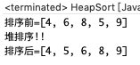


# 12.2 赫夫曼树

## 12.2.1 基本介绍


1. 给定n个权值作为n个==叶子结点==，构造一棵二叉树，若该树的==带权路径长度**(wpl)**达到最小==，称这样的二叉树为 ==最优二叉树==，也称为==哈夫曼树==(Huffman Tree)，还有的书翻译为==霍夫曼树==。
2. 赫夫曼树是带权路径长度最短的树，权值较大的结点离根较近。


## 12.2.2 几个重要概念和举例说明


1. ==路径和路径长度==：在一棵树中，从一个结点往下可以达到的孩子或孙子结点之间的通路，称为路径。通路中分支的数目称为路径长度。若规定根结点的层数为 1，则从根结点到第 L 层结点的路径长度为 L-1。
2. ==结点的权及带权路径长度==：若将树中结点赋给一个有着某种含义的数值，则这个数值称为该结点的权。==结点的带权路径长度==为：从根结点到该结点之间的路径长度与该结点的权的乘积。
3. ==树的带权路径长度==：树的带权路径长度规定为所有==叶子结点==的带权路径长度之和，记为 WPL(weighted path length)，权值越大的结点离根结点越近的二叉树才是最优二叉树。
4. ==WPL最小的就是赫夫曼树==

| ddddddddddddddddddddddddddddddddddddddddddddddddddddddddddddddddddddddddddddddddddddddddddddddddddddddddddd | d    |
| ------------------------------------------------------------ | ---- |
| 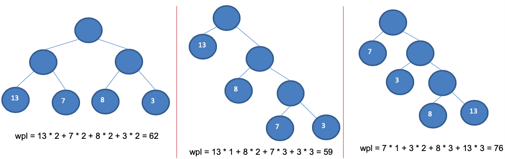 |      |


## 12.2.3 赫夫曼树创建思路图解


构成赫夫曼树的步骤：

1. 从小到大进行排序, 将每一个数据，每个数据都是一个节点 ， 每个节点可以看成是一颗最简单的二叉树。
2. 取出根节点权值最小的两颗二叉树。
3. 组成一颗新的二叉树, 该新的二叉树的根节点的权值是前面两颗二叉树根节点权值的和。
4. 再将这颗新的二叉树，以根节点的权值大小 再次排序， 不断重复 1-2-3-4 的步骤，直到数列中，所有的数据都被处理，就得到一颗赫夫曼树。

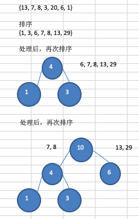

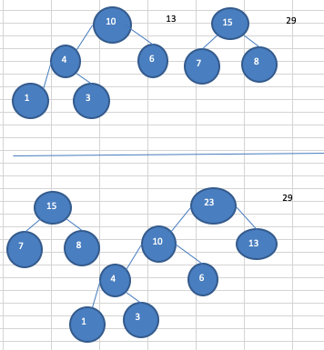

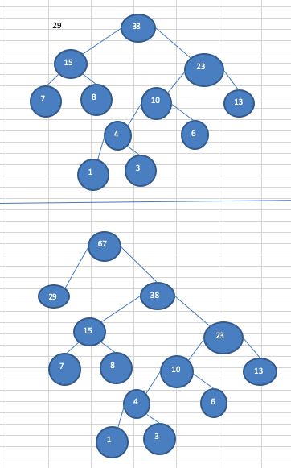


## 12.2.4 代码实现


```java
package com.atguigu.huffmantree;

import java.util.ArrayList;
import java.util.Collections;
import java.util.List;

public class HuffmanTree {

	public static void main(String[] args) {
		int arr[] = { 13, 7, 8, 3, 29, 6, 1 };
		Node root = createHuffmanTree(arr);
		
		//测试一把
		System.out.println("前序遍历赫夫曼树：");
		preOrder(root); 
		
	}
	
	//编写一个前序遍历的方法
	public static void preOrder(Node root) {
		if(root != null) {
			root.preOrder();
		}else{
			System.out.println("是空树，不能遍历~~");
		}
	}

	// 创建赫夫曼树的方法
	/**
	 * @param arr 需要创建成哈夫曼树的数组
	 * @return 创建好后的赫夫曼树的root结点
	 */
	public static Node createHuffmanTree(int[] arr) {
		// 第一步为了操作方便
		// 1. 遍历 arr 数组
		// 2. 将arr的每个元素构成成一个Node
		// 3. 将Node 放入到ArrayList中
		List<Node> nodes = new ArrayList<Node>();
		for (int value : arr) {
			nodes.add(new Node(value));
		}
		
		//我们处理的过程是一个循环的过程
		
		while(nodes.size() > 1) {
		
			//排序 从小到大 
			Collections.sort(nodes);
			
			System.out.println("nodes =" + nodes);
			
			//取出根节点权值最小的两颗二叉树 
			//(1) 取出权值最小的结点（二叉树）
			Node leftNode = nodes.get(0);
			//(2) 取出权值第二小的结点（二叉树）
			Node rightNode = nodes.get(1);
			
			//(3)构建一颗新的二叉树
			Node parent = new Node(leftNode.value + rightNode.value);
			parent.left = leftNode;
			parent.right = rightNode;
			
			//(4)从ArrayList删除处理过的二叉树
			nodes.remove(leftNode);
			nodes.remove(rightNode);
			//(5)将parent加入到nodes
			nodes.add(parent);
		}
		
		//返回哈夫曼树的root结点
		return nodes.get(0);
		
	}
}

// 创建结点类
// 为了让Node 对象持续排序Collections集合排序
// 让Node 实现Comparable接口
class Node implements Comparable<Node> {
	int value; // 结点权值
	char c; //字符
	Node left; // 指向左子结点
	Node right; // 指向右子结点

	//写一个前序遍历
	public void preOrder() {
		System.out.println(this);
		if(this.left != null) {
			this.left.preOrder();
		}
		if(this.right != null) {
			this.right.preOrder();
		}
	}
	
	public Node(int value) {
		this.value = value;
	}

	@Override
	public String toString() {
		return "Node [value=" + value + "]";
	}

	@Override
	public int compareTo(Node o) {
		// 表示从小到大排序
		return this.value - o.value;
	}

}
```

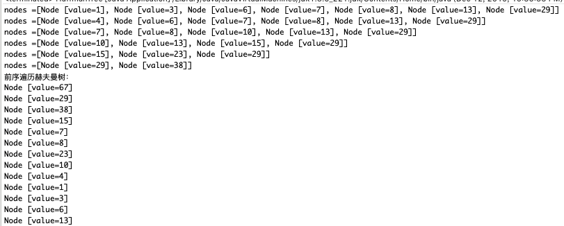


# 12.3 赫夫曼编码

## 12.3.1 基本介绍


1. 赫夫曼编码也翻译为 哈夫曼编码(Huffman Coding)，又称霍夫曼编码，是一种编码方式，属于一种程序算法。
2. 赫夫曼编码是赫哈夫曼树在电讯通信中的经典的应用之一。
3. 赫夫曼编码广泛地用于数据文件压缩。其压缩率通常在20%~90%之间。
4. 赫夫曼码是可变字长编码(VLC)的一种。Huffman于1952年提出一种编码方法，称之为最佳编码。


## 12.3.2 原理剖析


**通信领域中信息的处理方式1-定长编码**

i like like like java do you like a java    // 共40个字符(包括空格) 

105 32 108 105 107 101 32 108 105 107 101 32 108 105 107 101 32 106 97 118 97 32 100 111 32 121 111 117 32 108 105 107 101 32 97 32 106 97 118 97 //对应Ascii码

01101001 00100000 01101100 01101001 01101011 01100101 00100000 01101100 01101001 01101011 01100101 00100000 01101100 01101001 01101011 01100101 00100000 01101010 01100001 01110110 01100001 00100000 01100100 01101111 00100000 01111001 01101111 01110101 00100000 01101100 01101001 01101011 01100101 00100000 01100001 00100000 01101010 01100001 01110110 01100001 //对应的二进制

按照二进制来传递信息，总的长度是 359  (包括空格)

在线转码工具(https://www.mokuge.com/tool/asciito16/)


**通信领域中信息的处理方式2-变长编码**

i like like like java do you like a java    // 共40个字符(包括空格)

d:1 y:1 u:1 j:2 v:2 o:2 l:4 k:4 e:4 i:5 a:5  :9 // 各个字符对应的个数

0= , 1=a, 10=i, 11=e, 100=k, 101=l, 110=o, 111=v, 1000=j, 1001=u, 1010=y, 1011=d
说明：按照各个字符出现的次数进行编码，原则是出现次数越多的，则编码越小，比如 空格出现了9 次， 编码为0 ，其它依次类推。

按照上面给各个字符规定的编码，则我们在传输 "i like like like java do you like a java" 数据时，编码就是**10**0**101**10**100**... 

字符的编码都不能是其他字符编码的前缀，符合此要求的编码叫做前缀编码， 即不能匹配到重复的编码(这个在**赫夫曼编码**中，我们还要进行举例说明)


**通信领域中信息的处理方式3-赫夫曼编码**

i like like like java do you like a java    // 共40个字符(包括空格)

d:1 y:1 u:1 j:2 v:2 o:2 l:4 k:4 e:4 i:5 a:5  :9 // 各个字符对应的个数

按照上面字符出现的次数构建一颗赫夫曼树，次数作为权值。

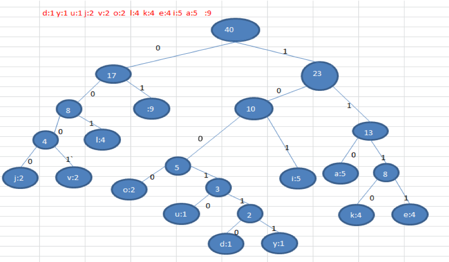

```java
//根据赫夫曼树，给各个字符
//规定编码 ， 向左的路径为0
//向右的路径为1 ， 编码如下:

o: 1000   u: 10010  d: 100110  y: 100111  i: 101
a : 110     k: 1110    e: 1111       j: 0000       v: 0001
l: 001     : 01

按照上面的赫夫曼编码，我们的"i like like like java do you like a java"   字符串对应的编码为 (注意这里我们使用的无损压缩)

1010100110111101111010011011110111101001101111011110100001100001110011001111000011001111000100100100110111101111011100100001100001110

长度为 ： 133 
说明:
原来长度是  359 , 压缩了  (359-133) / 359 = 62.9%
此编码满足前缀编码, 即字符的编码都不能是其他字符编码的前缀。不会造成匹配的多义性
```


## 12.3.3 注意事项


注意, 这个赫夫曼树根据==排序方法不同==，也可能不太一样，这样对应的==赫夫曼编码也不完全一样==，但是 **wpl** 是一样的，都是最小的，最后生成的赫夫曼编码的长度是一样，比如: 如果我们让每次生成的新的二叉树总是排在权值相同的二叉树的最后一个，则生成的二叉树为:

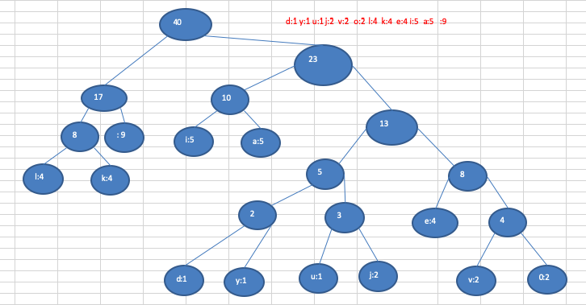


## 12.3.4 最佳实践-数据压缩(创建赫夫曼树)


```java
package com.atguigu.huffmancode;

import java.util.ArrayList;
import java.util.Arrays;
import java.util.Collections;
import java.util.HashMap;
import java.util.List;
import java.util.Map;

public class HuffmanCode {

	public static void main(String[] args) {

		String content = "i like like like java do you like a java";
		byte[] contentBytes = content.getBytes();
		System.out.println(contentBytes.length); // 40

		// //如何将 数据进行压缩
		// //分步过程
		//
		 List<Node> nodes = getNodes(contentBytes);
		 System.out.println("nodes=" + nodes);
		
		 //测试一把，创建的赫夫曼树
		 System.out.println("赫夫曼树");
		 Node huffmanTreeRoot = createHuffmanTree(nodes);
		 System.out.println("前序遍历");
		 huffmanTreeRoot.preOrder();
		
		 //测试一把是否生成了对应的赫夫曼编码
		 Map<Byte, String> huffmanCodes = getCodes(huffmanTreeRoot);
		 System.out.println("~生成的赫夫曼编码表= " + huffmanCodes);
		
		 //测试
		 byte[] huffmanCodeBytes = zip(contentBytes, huffmanCodes);
		 System.out.println("huffmanCodeBytes=" + Arrays.toString(huffmanCodeBytes));//17
		//
		// //发送huffmanCodeBytes 数组
		 
		 //整合压缩过程
		 //byte[] huffmanCodesBytes = huffmanZip(contentBytes);
		 //System.out.println("压缩后的结果是:" + Arrays.toString(huffmanCodesBytes) + " 长度= " + huffmanCodesBytes.length);
	}

	// 使用一个方法，将前面的方法封装起来，便于我们的调用.
	/**
	 * 
	 * @param bytes 原始的字符串对应的字节数组
	 * @return 是经过 赫夫曼编码处理后的字节数组(压缩后的数组)
	 */
	private static byte[] huffmanZip(byte[] bytes) {
		List<Node> nodes = getNodes(bytes);
		// 根据 nodes 创建的赫夫曼树
		Node huffmanTreeRoot = createHuffmanTree(nodes);
		// 对应的赫夫曼编码(根据 赫夫曼树)
		Map<Byte, String> huffmanCodes = getCodes(huffmanTreeRoot);
		// 根据生成的赫夫曼编码，压缩得到压缩后的赫夫曼编码字节数组
		byte[] huffmanCodeBytes = zip(bytes, huffmanCodes);
		return huffmanCodeBytes;
	}
	
	/**
	 * 获取每个结点的字符以及权重(出现次数)
	 * 
	 * @param bytes 接收字节数组
	 * @return 返回的就是 List 形式 [Node[date=97 ,weight = 5], Node[]date=32,weight =
	 *         9]......],
	 */
	private static List<Node> getNodes(byte[] bytes) {

		// 1创建一个ArrayList
		ArrayList<Node> nodes = new ArrayList<Node>();

		// 遍历 bytes , 统计 每一个byte出现的次数->map[key,value]
		Map<Byte, Integer> counts = new HashMap<>();
		for (byte b : bytes) {
			Integer count = counts.get(b);
			if (count == null) { // Map还没有这个字符数据,第一次
				counts.put(b, 1);
			} else {
				counts.put(b, count + 1);
			}
		}

		// 把每一个键值对转成一个Node 对象，并加入到nodes集合
		// 遍历map
		for (Map.Entry<Byte, Integer> entry : counts.entrySet()) {
			nodes.add(new Node(entry.getKey(), entry.getValue()));
		}
		return nodes;

	}

	// 可以通过List 创建对应的赫夫曼树
	private static Node createHuffmanTree(List<Node> nodes) {

		while (nodes.size() > 1) {
			// 排序, 从小到大
			Collections.sort(nodes);
			// 取出第一颗最小的二叉树
			Node leftNode = nodes.get(0);
			// 取出第二颗最小的二叉树
			Node rightNode = nodes.get(1);
			// 创建一颗新的二叉树,它的根节点 没有data, 只有权值
			Node parent = new Node(null, leftNode.weight + rightNode.weight);
			parent.left = leftNode;
			parent.right = rightNode;

			// 将已经处理的两颗二叉树从nodes删除
			nodes.remove(leftNode);
			nodes.remove(rightNode);
			// 将新的二叉树，加入到nodes
			nodes.add(parent);

		}
		// nodes 最后的结点，就是赫夫曼树的根结点
		return nodes.get(0);
	}
	
	// 生成赫夫曼树对应的赫夫曼编码
	// 思路:
	// 1. 将赫夫曼编码表存放在 Map<Byte,String> 形式
	// 生成的赫夫曼编码表{32=01, 97=100, 100=11000, 117=11001, 101=1110, 118=11011, 105=101,
	// 121=11010, 106=0010, 107=1111, 108=000, 111=0011}
	static Map<Byte, String> huffmanCodes = new HashMap<Byte, String>();
	// 2. 在生成赫夫曼编码表示，需要去拼接路径, 定义一个StringBuilder 存储某个叶子结点的路径
	static StringBuilder stringBuilder = new StringBuilder();

	// 为了调用方便，我们重载 getCodes
	private static Map<Byte, String> getCodes(Node root) {
		if (root == null) {
			return null;
		}
		// 处理root的左子树
		getCodes(root.left, "0", stringBuilder);
		// 处理root的右子树
		getCodes(root.right, "1", stringBuilder);
		return huffmanCodes;
	}

	/**
	 * 功能：将传入的node结点的所有叶子结点的赫夫曼编码得到，并放入到huffmanCodes集合
	 * 
	 * @param node 传入结点
	 * @param code 路径： 左子结点是 0, 右子结点 1
	 * @param stringBuilder 用于拼接路径
	 */
	private static void getCodes(Node node, String code, StringBuilder stringBuilder) {
		StringBuilder stringBuilder2 = new StringBuilder(stringBuilder);
		// 将code 加入到 stringBuilder2
		stringBuilder2.append(code);
		if (node != null) { // 如果node == null不处理
			// 判断当前node 是叶子结点还是非叶子结点
			if (node.data == null) { // 非叶子结点
				// 递归处理
				// 向左递归
				getCodes(node.left, "0", stringBuilder2);
				// 向右递归
				getCodes(node.right, "1", stringBuilder2);
			} else { // 说明是一个叶子结点
				// 就表示找到某个叶子结点的最后
				huffmanCodes.put(node.data, stringBuilder2.toString());
			}
		}
	}

	
	// 编写一个方法，将字符串对应的byte[] 数组，通过生成的赫夫曼编码表，返回一个赫夫曼编码 压缩后的byte[]
	/**
	 * 
	 * @param bytes 这时原始的字符串对应的 byte[]
	 * @param huffmanCodes 生成的赫夫曼编码map
	 * @return 返回赫夫曼编码处理后的 byte[] 举例： String content = "i like like like java do you
	 *         like a java"; =》 byte[] contentBytes = content.getBytes(); 返回的是 字符串
	 *         "1010100010111111110010001011111111001000101111111100100101001101110001110000011011101000111100101000101111111100110001001010011011100"
	 *         => 对应的 byte[] huffmanCodeBytes ，即 8位对应一个 byte,放入到 huffmanCodeBytes
	 *         huffmanCodeBytes[0] = 10101000(补码) => byte [推导 10101000=> 10101000 -
	 *         1 => 10100111(反码)=> 11011000= -88 ] huffmanCodeBytes[1] = -88
	 */
	private static byte[] zip(byte[] bytes, Map<Byte, String> huffmanCodes) {

		// 1.利用 huffmanCodes 将 bytes 转成 赫夫曼编码对应的字符串
		StringBuilder stringBuilder = new StringBuilder();
		// 遍历bytes 数组
		for (byte b : bytes) {
			stringBuilder.append(huffmanCodes.get(b));
		}

		// System.out.println("测试 stringBuilder~~~=" + stringBuilder.toString());

		// 将 "1010100010111111110..." 转成 byte[]

		// 统计返回 byte[] huffmanCodeBytes 长度
		// 一句话 int len = (stringBuilder.length() + 7) / 8;
		int len;
		if (stringBuilder.length() % 8 == 0) {
			len = stringBuilder.length() / 8;
		} else {
			len = stringBuilder.length() / 8 + 1;
		}
		// 创建 存储压缩后的 byte数组
		byte[] huffmanCodeBytes = new byte[len];
		int index = 0;// 记录是第几个byte
		for (int i = 0; i < stringBuilder.length(); i += 8) { // 因为是每8位对应一个byte,所以步长 +8
			String strByte;
			if (i + 8 > stringBuilder.length()) {// 不够8位
				strByte = stringBuilder.substring(i);
			} else {
				strByte = stringBuilder.substring(i, i + 8);
			}
			// 将strByte 转成一个byte,放入到 huffmanCodeBytes
			huffmanCodeBytes[index] = (byte) Integer.parseInt(strByte, 2);
			index++;
		}
		return huffmanCodeBytes;
	}

	// 前序遍历的方法
	private static void preOrder(Node root) {
		if (root != null) {
			root.preOrder();
		} else {
			System.out.println("赫夫曼树为空");
		}
	}
}

// 创建Node ,待数据和权值
class Node implements Comparable<Node> {
	Byte data; // 存放数据(字符)本身，比如'a' => 97 ' ' => 32
	int weight; // 权值, 表示字符出现的次数
	Node left;//
	Node right;

	public Node(Byte data, int weight) {

		this.data = data;
		this.weight = weight;
	}

	@Override
	public int compareTo(Node o) {
		// 从小到大排序
		return this.weight - o.weight;
	}

	public String toString() {
		return "Node [data = " + data + " weight=" + weight + "]";
	}

	// 前序遍历
	public void preOrder() {
		System.out.println(this);
		if (this.left != null) {
			this.left.preOrder();
		}
		if (this.right != null) {
			this.right.preOrder();
		}
	}
}
```

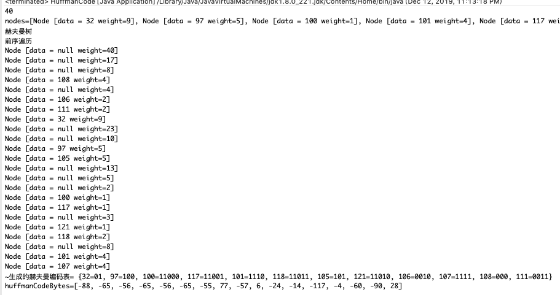


## 12.3.5 最佳实践-数据解压(使用赫夫曼编码解码)


```java
package com.atguigu.huffmancode;
import java.util.ArrayList;
import java.util.Arrays;
import java.util.Collections;
import java.util.HashMap;
import java.util.List;
import java.util.Map;

public class HuffmanCode {

	public static void main(String[] args) {

		String content = "i like like like java do you like a java";
		byte[] contentBytes = content.getBytes();
		System.out.println(contentBytes.length); // 40

		 byte[] huffmanCodesBytes = huffmanZip(contentBytes); 
		 System.out.println("压缩后的结果是:" + Arrays.toString(huffmanCodesBytes) + " 长度= " + huffmanCodesBytes.length);
		 //测试一把byteToBitString方法
//		 System.out.println(byteToBitString((byte)1));
		 byte[] sourceBytes = decode(huffmanCodes, huffmanCodesBytes);
		 System.out.println("原来的字符串=" + new String(sourceBytes)); // "i like like like java do you like a java"

	}

	// 完成数据的解压
	// 思路
	// 1. 将huffmanCodeBytes [-88, -65, -56, -65, -56, -65, -55, 77, -57, 6, -24,
	// -14, -117, -4, -60, -90, 28]
	// 重写先转成 赫夫曼编码对应的二进制的字符串 "1010100010111..."
	// 2. 赫夫曼编码对应的二进制的字符串 "1010100010111..." =》 对照 赫夫曼编码 =》 "i like like like java
	// do you like a java"

	// 编写一个方法，完成对压缩数据的解码
	/**
	 * 
	 * @param huffmanCodes 赫夫曼编码表 map
	 * @param huffmanBytes 赫夫曼编码得到的字节数组
	 * @return 就是原来的字符串对应的数组
	 */
	private static byte[] decode(Map<Byte, String> huffmanCodes, byte[] huffmanBytes) {

		// 1. 先得到 huffmanBytes 对应的 二进制的字符串 ， 形式 1010100010111...
		StringBuilder stringBuilder = new StringBuilder();
		// 将byte数组转成二进制的字符串
		for (int i = 0; i < huffmanBytes.length; i++) {
			byte b = huffmanBytes[i];
			// 判断是不是最后一个字节
			boolean flag = (i == huffmanBytes.length - 1);
			stringBuilder.append(byteToBitString(!flag, b));
		}
		// 把字符串安装指定的赫夫曼编码进行解码
		// 把赫夫曼编码表进行调换，因为反向查询 a->100 100->a
		Map<String, Byte> map = new HashMap<String, Byte>();
		for (Map.Entry<Byte, String> entry : huffmanCodes.entrySet()) {
			map.put(entry.getValue(), entry.getKey());
		}

		// 创建要给集合，存放byte
		List<Byte> list = new ArrayList<>();
		// i 可以理解成就是索引,扫描 stringBuilder
		for (int i = 0; i < stringBuilder.length();) {
			int count = 1; // 小的计数器
			boolean flag = true;
			Byte b = null;

			while (flag) {
				// 1010100010111...
				// 递增的取出 key 1
				String key = stringBuilder.substring(i, i + count);// i 不动，让count移动，指定匹配到一个字符
				b = map.get(key);
				if (b == null) {// 说明没有匹配到
					count++;
				} else {
					// 匹配到
					flag = false;
				}
			}
			list.add(b);
			i += count;// i 直接移动到 count
		}
		// 当for循环结束后，我们list中就存放了所有的字符 "i like like like java do you like a java"
		// 把list 中的数据放入到byte[] 并返回
		byte b[] = new byte[list.size()];
		for (int i = 0; i < b.length; i++) {
			b[i] = list.get(i);
		}
		return b;

	}

	/**
	 * 将一个byte 转成一个二进制的字符串, 如果看不懂，可以参考我讲的Java基础 二进制的原码，反码，补码
	 * 
	 * @param b 传入的 byte
	 * @param flag 标志是否需要补高位如果是true ，表示需要补高位，如果是false表示不补, 如果是最后一个字节，无需补高位
	 * @return 是该b 对应的二进制的字符串，（注意是按补码返回）
	 */
	private static String byteToBitString(boolean flag, byte b) {
		// 使用变量保存 b
		int temp = b; // 将 b 转成 int
		// 如果是正数我们还存在补高位
		if (flag) {
			temp |= 256; // 按位与 256 1 0000 0000 | 0000 0001 => 1 0000 0001
		}
		String str = Integer.toBinaryString(temp); // 返回的是temp对应的二进制的补码
		if (flag) {
			return str.substring(str.length() - 8);
		} else {
			return str;
		}
	}

}
```

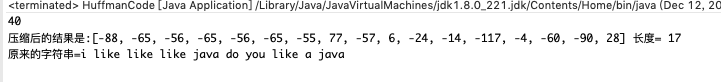


## 12.3.6 最佳实践-文件压缩