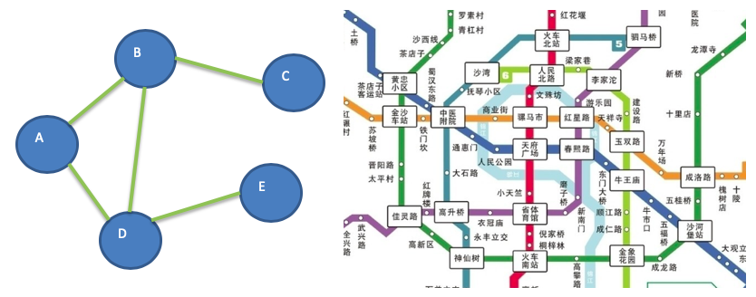
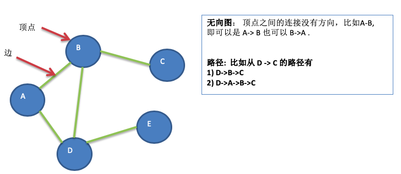
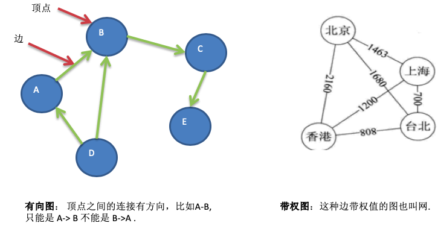
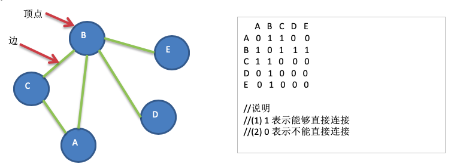
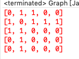

# 13.1 图的基本介绍

## 13.1.1 为什么要有图


1. 前面介绍了线性表和树。
2. 线性表局限于一个直接前驱和一个直接后继的关系。
3. 树也只能有一个直接前驱也就是父节点。
4. 当我们需要表示==多对多的关系==时，这里我们就用到了==图==。


## 13.1.2 图的举例说明


图是一种==数据结构==，其中结点可以具有零个或多个相邻元素。两个结点之间的连接称为边。 结点也可以称为顶点。如图:




## 13.1.3 图的常用概念


1. 顶点(vertex)
2. 边(edge)
3. 路径
4. 无向图(下图



5. 有向图
6. 带权图




# 13.2 图的表示方式


图的表示方式有两种:二维数组表示(邻接矩阵)；链表表示(邻接表)。


## 13.2.1 邻接矩阵


邻接矩阵是表示图形中顶点之间相邻关系的矩阵，对于 n 个顶点的图而言，矩阵是的 row 和 col 表示的是 1....n个点。


## 13.2.2 邻接表


1. 邻接矩阵需要为每个顶点都分配n个边的空间，其实有很多边都是不存在,会造成空间的一定损失。
2. 邻接表的实现只关心存在的边，不关心不存在的边。因此没有空间浪费，邻接表由数组+链表组成。
3. 举例说明


说明：

1)标号为0的结点的相关联的结点为 1 2 3 4

2)标号为1的结点的相关联结点为0 4

3)标号为2的结点相关联的结点为 0 4 5

4)...


# 13.3 图的快速入门案例

## 13.3.1 要求


要求: 代码实现如下图结构




## 13.3.2 思路分析


1. 存储顶点String ，使用 ArrayList
2.  保存矩阵 int\[]\[] edges 


## 13.3.3 代码实现


```java
package com.atguigu.graph;

import java.util.ArrayList;
import java.util.Arrays;
import java.util.LinkedList;

public class Graph {

	private ArrayList<String> vertexList; //存储顶点集合
	private int[][] edges; //存储图对应的邻结矩阵
	private int numOfEdges; //表示边的数目
	
	public static void main(String[] args) {
		//测试一把图是否创建ok
		int n = 5;  //结点的个数
		String Vertexs[] = {"A", "B", "C", "D", "E"};
		
		//创建图对象
		Graph graph = new Graph(n);
		//循环的添加顶点
		for(String vertex: Vertexs) {
			graph.insertVertex(vertex);
		}
		
		//添加边
		//A-B A-C B-C B-D B-E 
		graph.insertEdge(0, 1, 1); // A-B
		graph.insertEdge(0, 2, 1); // 
		graph.insertEdge(1, 2, 1); // 
		graph.insertEdge(1, 3, 1); // 
		graph.insertEdge(1, 4, 1); // 

		//显示一把邻结矩阵
		graph.showGraph();
	}
	
	//构造器
	public Graph(int n) {
		//初始化矩阵和vertexList
		edges = new int[n][n];
		vertexList = new ArrayList<String>(n);
		numOfEdges = 0;
	}

	//显示图对应的矩阵
	public void showGraph() {
		for(int[] link : edges) {
			System.err.println(Arrays.toString(link));
		}
	}
    
	//插入结点
	public void insertVertex(String vertex) {
		vertexList.add(vertex);
	}
	//添加边
	/**
	 * 
	 * @param v1 表示点的下标即使第几个顶点  "A"-"B" "A"->0 "B"->1
	 * @param v2 第二个顶点对应的下标
	 * @param weight 表示 
	 */
	public void insertEdge(int v1, int v2, int weight) {
		edges[v1][v2] = weight;
		edges[v2][v1] = weight;
		numOfEdges++;
	}
}
```




# 13.4 图的深度优先遍历介绍