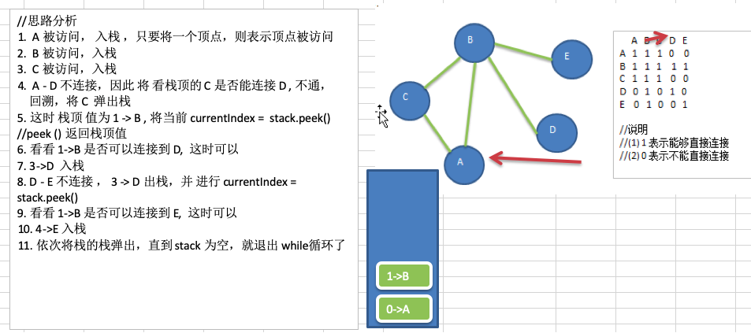
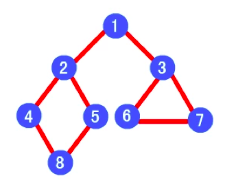
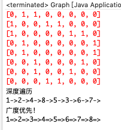

# 13.1 图的基本介绍

## 13.1.1 为什么要有图


1. 前面介绍了线性表和树。
2. 线性表局限于一个直接前驱和一个直接后继的关系。
3. 树也只能有一个直接前驱也就是父节点。
4. 当我们需要表示==多对多的关系==时，这里我们就用到了==图==。


## 13.1.2 图的举例说明


图是一种==数据结构==，其中结点可以具有零个或多个相邻元素。两个结点之间的连接称为边。 结点也可以称为顶点。如图:


## 13.1.3 图的常用概念


1. 顶点(vertex)
2. 边(edge)
3. 路径
4. 无向图(下图


5. 有向图
6. 带权图


# 13.2 图的表示方式


图的表示方式有两种:二维数组表示(邻接矩阵)；链表表示(邻接表)。


## 13.2.1 邻接矩阵


邻接矩阵是表示图形中顶点之间相邻关系的矩阵，对于 n 个顶点的图而言，矩阵是的 row 和 col 表示的是 1....n个点。


## 13.2.2 邻接表


1. 邻接矩阵需要为每个顶点都分配n个边的空间，其实有很多边都是不存在,会造成空间的一定损失。
2. 邻接表的实现只关心存在的边，不关心不存在的边。因此没有空间浪费，邻接表由数组+链表组成。
3. 举例说明


说明：

1)标号为0的结点的相关联的结点为 1 2 3 4

2)标号为1的结点的相关联结点为0 4

3)标号为2的结点相关联的结点为 0 4 5

4)...


# 13.3 图的快速入门案例

## 13.3.1 要求


要求: 代码实现如下图结构


## 13.3.2 思路分析


1. 存储顶点String ，使用 ArrayList
2.  保存矩阵 int\[]\[] edges 


## 13.3.3 代码实现


```java
package com.atguigu.graph;

import java.util.ArrayList;
import java.util.Arrays;
import java.util.LinkedList;

public class Graph {

	private ArrayList<String> vertexList; //存储顶点集合
	private int[][] edges; //存储图对应的邻结矩阵
	private int numOfEdges; //表示边的数目
	
	public static void main(String[] args) {
		//测试一把图是否创建ok
		int n = 5;  //结点的个数
		String Vertexs[] = {"A", "B", "C", "D", "E"};
		
		//创建图对象
		Graph graph = new Graph(n);
		//循环的添加顶点
		for(String vertex: Vertexs) {
			graph.insertVertex(vertex);
		}
		
		//添加边
		//A-B A-C B-C B-D B-E 
		graph.insertEdge(0, 1, 1); // A-B
		graph.insertEdge(0, 2, 1); // 
		graph.insertEdge(1, 2, 1); // 
		graph.insertEdge(1, 3, 1); // 
		graph.insertEdge(1, 4, 1); // 

		//显示一把邻结矩阵
		graph.showGraph();
	}
	
	//构造器
	public Graph(int n) {
		//初始化矩阵和vertexList
		edges = new int[n][n];
		vertexList = new ArrayList<String>(n);
		numOfEdges = 0;
	}

	//显示图对应的矩阵
	public void showGraph() {
		for(int[] link : edges) {
			System.err.println(Arrays.toString(link));
		}
	}
    
	//插入结点
	public void insertVertex(String vertex) {
		vertexList.add(vertex);
	}
	//添加边
	/**
	 * 
	 * @param v1 表示点的下标即使第几个顶点  "A"-"B" "A"->0 "B"->1
	 * @param v2 第二个顶点对应的下标
	 * @param weight 表示 
	 */
	public void insertEdge(int v1, int v2, int weight) {
		edges[v1][v2] = weight;
		edges[v2][v1] = weight;
		numOfEdges++;
	}
}
```


# 13.4 图的深度优先遍历

## 13.4.1 图遍历介绍


所谓图的遍历，即是对结点的访问。一个图有那么多个结点，如何遍历这些结点，需要特定策略，一般有两种访问策略: (1)深度优先遍历 (2)广度优先遍历


## 13.4.2 深度优先遍历基本思想


图的深度优先搜索(**Depth First Search**) 。

1. 深度优先遍历，从初始访问结点出发，初始访问结点可能有多个邻接结点，深度优先遍历的策略就是首先访问第一个邻接结点，然后再以这个被访问的邻接结点作为初始结点，访问它的第一个邻接结点，可以这样理解:每次都在访问完当前结点后首先访问当前结点的第一个邻接结点。

2. 我们可以看到，这样的访问策略是优先往纵向挖掘深入，而不是对一个结点的所有邻接结点进行横向访问。

3. 显然，深度优先搜索是一个递归的过程

   

## 13.4.3 深度优先遍历算法步骤


1. 访问初始结点v，并标记结点v为已访问。
2. 查找结点v的第一个邻接结点w。
3. 若w存在，则继续执行4，如果w不存在，则回到第1步，将从v的下一个结点继续。
4. 若w未被访问，对w进行深度优先遍历递归(即把w当做另一个v，然后进行步骤123)。
5. 查找结点v的w邻接结点的下一个邻接结点，转到步骤3。
6. 分析图

| d                                                            | d    |
| ------------------------------------------------------------ | ---- |
|  |      |


## 13.4.4 深度优先算法的代码实现


```java
	//深度优先遍历算法
	//i 第一次就是 0
	private void dfs(boolean[] isVisited, int i) {
		//首先我们访问该结点,输出
		System.out.print(getValueByIndex(i) + "->");
		//将结点设置为已经访问
		isVisited[i] = true;
		//查找结点i的第一个邻接结点w
		int w = getFirstNeighbor(i);
		while(w != -1) {//说明有
			if(!isVisited[w]) {
				dfs(isVisited, w);
			}
			//如果w结点已经被访问过
			w = getNextNeighbor(i, w);
		}
		
	}
	
	//对dfs 进行一个重载, 遍历我们所有的结点，并进行 dfs
	public void dfs() {
		isVisited = new boolean[vertexList.size()];
		//遍历所有的结点，进行dfs[回溯]
		for(int i = 0; i < getNumOfVertex(); i++) {
			if(!isVisited[i]) {
				dfs(isVisited, i);
			}
		}
	}
```


# 13.5 图的广度优先遍历

## 13.5.1 广度优先遍历基本思想


图的广度优先搜索(Broad First Search) 。

类似于一个==分层搜索==的过程，广度优先遍历需要使用一个队列以保持访问过的结点的顺序，以便按这个顺序来访问这些结点的邻接结点。


## 13.5.2 广度优先遍历算法步骤


1. 访问初始结点v并标记结点v为已访问。

2. 结点v入队列。

3. 当队列非空时，继续执行，否则算法结束。

4. 出队列，取得队头结点u。

5. 查找结点u的第一个邻接结点w。

6. 若结点u的邻接结点w不存在，则转到步骤3;否则循环执行以下三个步骤:

   1)若结点 w 尚未被访问，则访问结点 w 并标记为已访问。

   2)结点w入队列。

   3)查找结点 u 的继 w 邻接结点后的下一个邻接结点 w，转到步骤 6。

   

## 13.5.3 广度优先算法的代码实现


```java
	//对一个结点进行广度优先遍历的方法
	private void bfs(boolean[] isVisited, int i) {
		int u ; // 表示队列的头结点对应下标
		int w ; // 邻接结点w
		//队列，记录结点访问的顺序
		LinkedList queue = new LinkedList();
		//访问结点，输出结点信息
		System.out.print(getValueByIndex(i) + "=>");
		//标记为已访问
		isVisited[i] = true;
		//将结点加入队列
		queue.addLast(i);
		
		while( !queue.isEmpty()) {
			//取出队列的头结点下标
			u = (Integer)queue.removeFirst();
			//得到第一个邻接结点的下标 w 
			w = getFirstNeighbor(u);
			while(w != -1) {//找到
				//是否访问过
				if(!isVisited[w]) {
					System.out.print(getValueByIndex(w) + "=>");
					//标记已经访问
					isVisited[w] = true;
					//入队
					queue.addLast(w);
				}
				//以u为前驱点，找w后面的下一个邻结点
				w = getNextNeighbor(u, w); //体现出我们的广度优先
			}
		}
		
	} 
	
	//遍历所有的结点，都进行广度优先搜索
	public void bfs() {
		isVisited = new boolean[vertexList.size()];
		for(int i = 0; i < getNumOfVertex(); i++) {
			if(!isVisited[i]) {
				bfs(isVisited, i);
			}
		}
	}
```


# 13.6 图代码汇总



```java
package com.atguigu.graph;

import java.util.ArrayList;
import java.util.Arrays;
import java.util.LinkedList;

public class Graph {

	private ArrayList<String> vertexList; //存储顶点集合
	private int[][] edges; //存储图对应的邻结矩阵
	private int numOfEdges; //表示边的数目
	//定义给数组boolean[], 记录某个结点是否被访问
	private boolean[] isVisited;
	
	public static void main(String[] args) {
		//测试一把图是否创建ok
//		String Vertexs[] = {"A", "B", "C", "D", "E"};
		String Vertexs[] = {"1", "2", "3", "4", "5", "6", "7", "8"};
		int n = Vertexs.length;  //结点的个数
		
		//创建图对象
		Graph graph = new Graph(n);
		//循环的添加顶点
		for(String vertex: Vertexs) {
			graph.insertVertex(vertex);
		}
		
//		//添加边
		//A-B A-C B-C B-D B-E 
//		graph.insertEdge(0, 1, 1); // A-B
//		graph.insertEdge(0, 2, 1); // 
//		graph.insertEdge(1, 2, 1); // 
//		graph.insertEdge(1, 3, 1); // 
//		graph.insertEdge(1, 4, 1); // 
//		
//		//更新边的关系
		graph.insertEdge(0, 1, 1);//1-2
		graph.insertEdge(0, 2, 1);//1-3
		graph.insertEdge(1, 3, 1);//2-4
		graph.insertEdge(1, 4, 1);//2-5
		graph.insertEdge(3, 7, 1);//4-8
		graph.insertEdge(4, 7, 1);//5-8
		graph.insertEdge(2, 5, 1);//3-6
		graph.insertEdge(2, 6, 1);//3-7
		graph.insertEdge(5, 6, 1);//6-7
	
//		//显示一把邻结矩阵
		graph.showGraph();
//		
//		//测试一把，我们的dfs遍历是否ok
		System.out.println("深度遍历");
		graph.dfs(); // A->B->C->D->E [1->2->4->8->5->3->6->7]
		System.out.println();
		System.out.println("广度优先!");
		graph.bfs(); // A->B->C->D-E [1->2->3->4->5->6->7->8]
		
	}
	
	//构造器
	public Graph(int n) {
		//初始化矩阵和vertexList
		edges = new int[n][n];
		vertexList = new ArrayList<String>(n);
		numOfEdges = 0;
		
	}
	
	//得到第一个邻接结点的下标 w 
	/**
	 * 
	 * @param index 
	 * @return 如果存在就返回对应的下标，否则返回-1
	 */
	public int getFirstNeighbor(int index) {
		for(int j = 0; j < vertexList.size(); j++) {
			if(edges[index][j] > 0) {
				return j;
			}
		}
		return -1;
	}
	//根据前一个邻接结点的下标来获取下一个邻接结点
	public int getNextNeighbor(int v1, int v2) {
		for(int j = v2 + 1; j < vertexList.size(); j++) {
			if(edges[v1][j] > 0) {
				return j;
			}
		}
		return -1;
	}
	
	//深度优先遍历算法
	//i 第一次就是 0
	private void dfs(boolean[] isVisited, int i) {
		//首先我们访问该结点,输出
		System.out.print(getValueByIndex(i) + "->");
		//将结点设置为已经访问
		isVisited[i] = true;
		//查找结点i的第一个邻接结点w
		int w = getFirstNeighbor(i);
		while(w != -1) {//说明有
			if(!isVisited[w]) {
				dfs(isVisited, w);
			}
			//如果w结点已经被访问过
			w = getNextNeighbor(i, w);
		}
		
	}
	
	//对dfs 进行一个重载, 遍历我们所有的结点，并进行 dfs
	public void dfs() {
		isVisited = new boolean[vertexList.size()];
		//遍历所有的结点，进行dfs[回溯]
		for(int i = 0; i < getNumOfVertex(); i++) {
			if(!isVisited[i]) {
				dfs(isVisited, i);
			}
		}
	}
	
	//对一个结点进行广度优先遍历的方法
	private void bfs(boolean[] isVisited, int i) {
		int u ; // 表示队列的头结点对应下标
		int w ; // 邻接结点w
		//队列，记录结点访问的顺序
		LinkedList queue = new LinkedList();
		//访问结点，输出结点信息
		System.out.print(getValueByIndex(i) + "=>");
		//标记为已访问
		isVisited[i] = true;
		//将结点加入队列
		queue.addLast(i);
		
		while( !queue.isEmpty()) {
			//取出队列的头结点下标
			u = (Integer)queue.removeFirst();
			//得到第一个邻接结点的下标 w 
			w = getFirstNeighbor(u);
			while(w != -1) {//找到
				//是否访问过
				if(!isVisited[w]) {
					System.out.print(getValueByIndex(w) + "=>");
					//标记已经访问
					isVisited[w] = true;
					//入队
					queue.addLast(w);
				}
				//以u为前驱点，找w后面的下一个邻结点
				w = getNextNeighbor(u, w); //体现出我们的广度优先
			}
		}
		
	} 
	
	//遍历所有的结点，都进行广度优先搜索
	public void bfs() {
		isVisited = new boolean[vertexList.size()];
		for(int i = 0; i < getNumOfVertex(); i++) {
			if(!isVisited[i]) {
				bfs(isVisited, i);
			}
		}
	}
	
	//图中常用的方法
	//返回结点的个数
	public int getNumOfVertex() {
		return vertexList.size();
	}
	//显示图对应的矩阵
	public void showGraph() {
		for(int[] link : edges) {
			System.err.println(Arrays.toString(link));
		}
	}
//得到边的数目
	public int getNumOfEdges() {
		return numOfEdges;
	}
	//返回结点i(下标)对应的数据 0->"A" 1->"B" 2->"C"
	public String getValueByIndex(int i) {
		return vertexList.get(i);
	}
	//返回v1和v2的权值
	public int getWeight(int v1, int v2) {
		return edges[v1][v2];
	}
	//插入结点
	public void insertVertex(String vertex) {
		vertexList.add(vertex);
	}
	//添加边
	/**
	 * 
	 * @param v1 表示点的下标即使第几个顶点  "A"-"B" "A"->0 "B"->1
	 * @param v2 第二个顶点对应的下标
	 * @param weight 表示 
	 */
	public void insertEdge(int v1, int v2, int weight) {
		edges[v1][v2] = weight;
		edges[v2][v1] = weight;
		numOfEdges++;
	}
}
```




