# 14.1 二分查找算法(非递归)

## 14.1.1二分查找算法(非递归)介绍


1. 前面介绍了二分查找算法，是使用递归的方式，下面使用二分查找算法的非递归方式。
2. 二分查找法只适用于从有序的数列中进行查找(比如数字和字母等)，将数列排序后再进行查找。
3. 二分查找法的运行时间为对数时间O(log~2~n)，即查找到需要的目标位置最多只需要log~2~n步，假设从[0,99]的队列(100 个数，即 n=100)中寻到目标数 30，则需要查找步数为log~2~100 , 即最多需要查找 7 次( 2^6^ < 100 < 2^7^)


## 14.1.2 二分查找算法(非递归)代码实现


数组 {1,3, 8, 10, 11, 67, 100}, 编程实现二分查找， 要求使用非递归的方式完成。

```java
package com.atguigu.binarysearchnorecursion;

public class BinarySearchNoRecur {

	public static void main(String[] args) {
		//测试
		int[] arr = {1,3, 8, 10, 11, 67, 100};
		int index = binarySearch(arr, 100);
		System.out.println("index=" + index);//
	}
	
	//二分查找的非递归实现
	/**
	 * @param arr 待查找的数组, arr是升序排序
	 * @param target 需要查找的数
	 * @return 返回对应下标，-1表示没有找到
	 */
	public static int binarySearch(int[] arr, int target) {
		
		int left = 0;
		int right = arr.length - 1;
		while(left <= right) { //说明继续查找
			int mid = (left + right) / 2;
			if(arr[mid] == target) {
				return mid;
			} else if ( arr[mid] > target) {
				right = mid - 1;//需要向左边查找
			} else {
				left = mid + 1; //需要向右边查找
			}
		}
		return -1;
	}

}
```

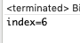


# 14.2 分治算法

## 14.2.1 分治算法介绍


1. 分治法是一种很重要的算法。字面上的解释是"分而治之"，就是把一个复杂的问题分成两个或更多的相同或相似的子问题，再把子问题分成更小的子问题......直到最后子问题可以简单的直接求解，原问题的解即子问题的解的合并。这个技巧是很多高效算法的基础，如排序算法(快速排序，归并排序)，傅立叶变换(快速傅立叶变 换)......

2. 分治算法可以求解的一些经典问题
   - 二分搜索
   - 大整数乘法
   - 棋盘覆盖
   - 合并排序
   - ==快速排序==
   - 线性时间选择
   - 最接近点对问题
   - 循环赛日程表
   - ==汉诺塔==


## 14.2.2 分治算法的基本步骤


分治法在每一层递归上都有三个步骤:

1. 分解:将原问题分解为若干个规模较小，相互独立，与原问题形式相同的子问题。
2. 解决:若子问题规模较小而容易被解决则直接解，否则递归地解各个子问题。
3. 合并:将各个子问题的解合并为原问题的解。


## 14.2.3 分治(Divide-and-Conquer(P))算法设计模式


```java
if |P|≤n0
   then return(ADHOC(P))
//将P分解为较小的子问题 P1 ,P2 ,…,Pk
for i←1 to k
do yi ← Divide-and-Conquer(Pi)   递归解决Pi
T ← MERGE(y1,y2,…,yk)   合并子问题
return(T)
```

其中|P|表示问题P的规模；n0为一阈值，表示当问题P的规模不超过n0时，问题已容易直接解出，不必再继续分解。ADHOC(P)是该分治法中的基本子算法，用于直接解小规模的问题P。因此，当P的规模不超过n0时直接用算法ADHOC(P)求解。算法MERGE(y1,y2,…,yk)是该分治法中的合并子算法，用于将P的子问题P1 ,P2 ,…,Pk的相应的解y1,y2,…,yk合并为P的解。


## 14.2.4 分治算法最佳实践-汉诺塔

### 1、汉诺塔介绍


汉诺塔(又称河内塔)问题是源于印度一个古老传说的益智玩具。大梵天创造世界的时候做了三根金刚石柱子，在一根柱子上从下往上按照大小顺序摞着 64 片黄金圆盘。大梵天命令婆罗门把圆盘从下面开始按大小顺序重新摆放在另一根柱子上。并且规定，在小圆盘上不能放大圆盘，在三根柱子之间一次只能移动一个圆盘。

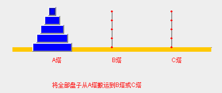


### 2、 思路分析


1. 如果是有一个盘， A->C

   如果我们有 n >= 2 情况，我们总是可以看做是两个盘 1.最下边的盘 2. 上面的盘

2. 先把最上面的盘A->B

3. 把最下边的盘 A->C

4. 把B塔的所有盘从B->C


### 3、代码实现


```java
package com.atguigu.dac;

public class Hanoitower {

	public static void main(String[] args) {
		hanoiTower(3, 'A', 'B', 'C');
	}
	
	//汉诺塔的移动的方法
	//使用分治算法
	/**
	 * 
	 * @param num 总共多少个盘
	 * @param a 起始柱子
	 * @param b 借助的柱子
	 * @param c 目标柱子
	 */
	public static void hanoiTower(int num, char a, char b, char c) {
		//如果只有一个盘
		if(num == 1) {
			System.out.println("第1个盘从 " + a + "->" + c);
		} else {
			//如果我们有 n >= 2 情况，我们总是可以看做是两个盘 1.最下边的一个盘 2. 上面的所有盘
			//1. 先把 最上面的所有盘 A->B， 移动过程会使用到 c
			hanoiTower(num - 1, a, c, b);
			//2. 把最下边的盘 A->C
			System.out.println("第" + num + "个盘从 " + a + "->" + c);
			//3. 把B塔的所有盘 从 B->C , 移动过程使用到 a塔  
			hanoiTower(num - 1, b, a, c);
		}
	}

}
```

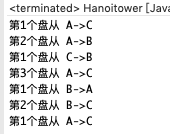


# 14.3 动态规划算法

## 14.3.1 应用场景-背包问题


背包问题:有一个背包，容量为 4 磅 ， 现有如下物品

| **物品** | **重量** | **价格** |
| -------- | -------- | -------- |
| 吉他(G)  | 1        | 1500     |
| 音响(S)  | 4        | 3000     |
| 电脑(L)  | 3        | 2000     |

1. 要求达到的目标为装入的背包的总价值最大，并且重量不超出。
2. 要求装入的物品不能重复。


## 14.3.2 动态规划算法介绍


1. 动态规划(**Dynamic** **Programming**)算法的核心思想是：将大问题划分为小问题进行解决，从而一步步获取最优解的处理算法。
2. 动态规划算法与分治算法类似，其基本思想也是将待求解问题分解成若干个子问题，先求解子问题，然后从这些子问题的解得到原问题的解。
3. 与分治法不同的是，**适合于用动态规划求解的问题，经分解得到子问题往往不是互相独立的**。 ( 即下一个子阶段的求解是建立在上一个子阶段的解的基础上，进行进一步的求解 )。
4. 动态规划可以通过**填表的方式**来逐步推进，得到最优解。


## 14.3.3 思路分析和图解


1. 背包问题主要是指一个给定容量的背包、若干具有一定价值和重量的物品，如何选择物品放入背包使物品的价值最大。其中又分01背包和完全背包(完全背包指的是：每种物品都有无限件可用)。
2. 这里的问题属于01背包，即每个物品最多放一个。而无限背包可以转化为01背包。

| ddddddddddddddddddddddddddddddddddddddddddddddddddddddddddddddddddddddddddddddddddddddddddddddddddddddddddddddddddd | d    |
| ------------------------------------------------------------ | ---- |
| 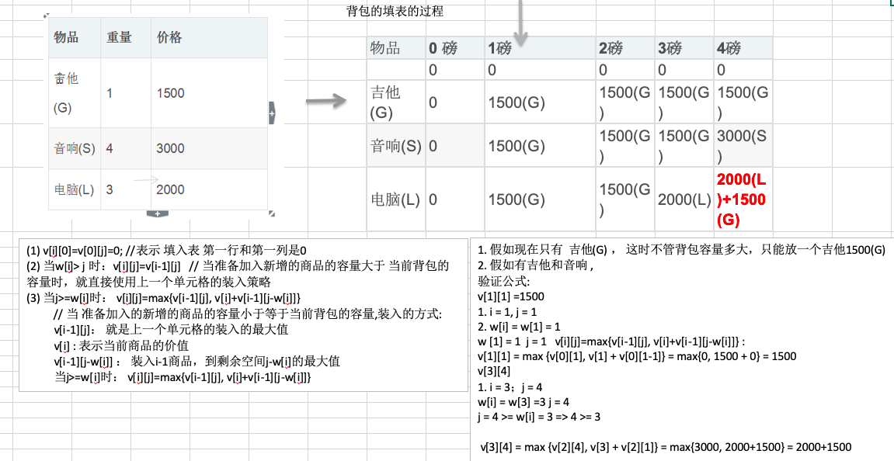 |      |

3. 算法的主要思想，利用动态规划来解决。每次遍历到的第i个物品，根据w[i]和v[i]来确定是否需要将该物品放入背包中。即对于给定的n个物品，设v[i]、w[i]分别为第i个物品的价值和重量，C为背包的容量。再令v\[i][j]表示在前i个物品中能够装入容量为j的背包中的最大价值。


## 14.3.4 代码实现


```java
package com.atguigu.dynamic;

public class KnapsackProblem {

	public static void main(String[] args) {
		int[] w = {1, 4, 3};//物品的重量
		int[] val = {1500, 3000, 2000}; //物品的价值 这里val[i] 就是前面讲的v[i]
		int m = 4; //背包的容量
		int n = val.length; //物品的个数
		
		//创建二维数组，
		//v[i][j] 表示在前i个物品中能够装入容量为j的背包中的最大价值
		int[][] v = new int[n+1][m+1];
		//为了记录放入商品的情况，我们定一个二维数组
		int[][] path = new int[n+1][m+1];
		
		//初始化第一行和第一列, 这里在本程序中，可以不去处理，因为默认就是0
		for(int i = 0; i < v.length; i++) {
			v[i][0] = 0; //将第一列设置为0
		}
		for(int i=0; i < v[0].length; i++) {
			v[0][i] = 0; //将第一行设置0
		}
		
		
		//根据前面得到公式来动态规划处理
		for(int i = 1; i < v.length; i++) { //不处理第一行 i是从1开始的
			for(int j=1; j < v[0].length; j++) {//不处理第一列, j是从1开始的
				//公式
				if(w[i-1]> j) { // 因为我们程序i 是从1开始的，因此原来公式中的 w[i] 修改成 w[i-1]
					v[i][j]=v[i-1][j];
				} else {
					//说明:
					//因为我们的i 从1开始的， 因此公式需要调整成
					//v[i][j]=Math.max(v[i-1][j], val[i-1]+v[i-1][j-w[i-1]]);
					//v[i][j] = Math.max(v[i - 1][j], val[i - 1] + v[i - 1][j - w[i - 1]]);
					//为了记录商品存放到背包的情况，我们不能直接的使用上面的公式，需要使用if-else来体现公式
					if(v[i - 1][j] < val[i - 1] + v[i - 1][j - w[i - 1]]) {
						v[i][j] = val[i - 1] + v[i - 1][j - w[i - 1]];
						//把当前的情况记录到path
						path[i][j] = 1;
					} else {
						v[i][j] = v[i - 1][j];
					}
					
				}
			}
		}
		
		//输出一下v 看看目前的情况
		for(int i =0; i < v.length;i++) {
			for(int j = 0; j < v[i].length;j++) {
				System.out.print(v[i][j] + " ");
			}
			System.out.println();
		}
		
		System.out.println("============================");
		//输出最后我们是放入的哪些商品
		//遍历path, 这样输出会把所有的放入情况都得到, 其实我们只需要最后的放入
//		for(int i = 0; i < path.length; i++) {
//			for(int j=0; j < path[i].length; j++) {
//				if(path[i][j] == 1) {
//					System.out.printf("第%d个商品放入到背包\n", i);
//				}
//			}
//		}
		
		//动脑筋
		int i = path.length - 1; //行的最大下标
		int j = path[0].length - 1;  //列的最大下标
		while(i > 0 && j > 0 ) { //从path的最后开始找
			if(path[i][j] == 1) {
				System.out.printf("第%d个商品放入到背包\n", i); 
				j -= w[i-1]; //w[i-1]
			}
			i--;
		}
		
	}

}
```

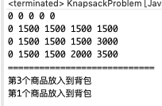


# 14.4 KMP 算法

## 14.4.1  应用场景-字符串匹配问题


字符串匹配问题:

1. 有一个字符串 str1= ""硅硅谷 尚硅谷你尚硅 尚硅谷你尚硅谷你尚硅你好""，和一个子串 str2="尚硅谷你尚硅你"。
2. 现在要判断 str1 是否含有 str2, 如果存在，就返回第一次出现的位置, 如果没有，则返回-1。


## 14.4.2 暴力匹配算法


如果用暴力匹配的思路，并假设现在 str1 匹配到 i 位置，子串 str2 匹配到 j 位置，则有:

1. 如果当前字符匹配成功(即str1[i]==str2[j])，则i++，j++，继续匹配下一个字符
2. 如果失配(即str1[i]!=str2[j])，令i=i-(j-1)，j=0。相当于每次匹配失败时，i回溯，j被置为0。
3. 用暴力方法解决的话就会有大量的回溯，每次只移动一位，若是不匹配，移动到下一位接着判断，浪费了大量的时间。(不可行!)
4. 代码实现

```java
package com.atguigu.kmp;

public class ViolenceMatch {

	public static void main(String[] args) {
		//测试暴力匹配算法
		String str1 = "硅硅谷 尚硅谷你尚硅 尚硅谷你尚硅谷你尚硅你好";
		String str2 = "尚硅谷你尚硅你";
		int index = violenceMatch(str1, str2);
		System.out.println("index=" + index);

	}

	// 暴力匹配算法实现
	public static int violenceMatch(String str1, String str2) {
		char[] s1 = str1.toCharArray();
		char[] s2 = str2.toCharArray();

		int s1Len = s1.length;
		int s2Len = s2.length;

		int i = 0; // i索引指向s1
		int j = 0; // j索引指向s2
		while (i < s1Len && j < s2Len) {// 保证匹配时，不越界

			if(s1[i] == s2[j]) {//匹配ok
				i++;
				j++;
			} else { //没有匹配成功
				//如果失配（即str1[i]! = str2[j]），令i = i - (j - 1)，j = 0。
				i = i - (j - 1);
				j = 0;
			}
		}
		
		//判断是否匹配成功
		if(j == s2Len) {
			return i - j;
		} else {
			return -1;
		}
	}

}
```

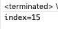


## 14.4.3 KMP 算法介绍


1. KMP 是一个解决模式串在文本串是否出现过，如果出现过，最早出现的位置的经典算法。
2. Knuth-Morris-Pratt 字符串查找算法，简称为 "KMP 算法"，常用于在一个文本串 S 内查找一个模式串 P 的 出现位置，这个算法由 Donald Knuth、Vaughan Pratt、James H. Morris 三人于 1977 年联合发表，故取这 3 人的姓氏命名此算法。
3. KMP 方法算法就利用之前判断过信息，通过一个 next 数组，保存模式串中前后最长公共子序列的长度，每次回溯时，通过 next 数组找到，前面匹配过的位置，省去了大量的计算时间。
4. 详细的讲解：https://www.cnblogs.com/ZuoAndFutureGirl/p/9028287.html


## 14.4.4 思路分析


举例来说，有一个字符串 Str1 = "BBC ABCDAB ABCDABCDABDE"，判断，里面是否包含另一个字符串 Str2 = "ABCDABD"?

 1. 首先，用 Str1 的第一个字符和 Str2 的第一个字符去比较，不符合，关键词向后移动一位

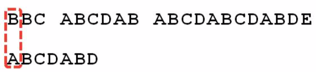

2. 重复第一步，还是不符合，再后移

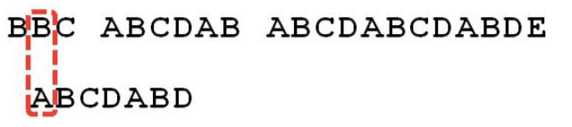

3. 一直重复，直到Str1有一个字符与Str2的第一个字符符合为止


4. 接着比较字符串和搜索词的下一个字符，还是符合。

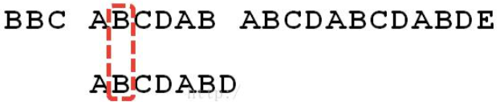

5. 遇到 Str1 有一个字符与 Str2 对应的字符不符合。

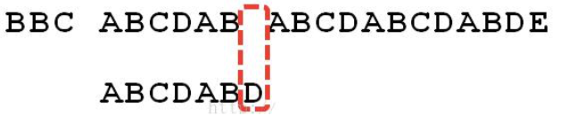

6. 这时候，想到的是继续遍历 Str1 的下一个字符，重复第 1 步。(其实是很不明智的，因为此时 BCD 已经比较过了， 没有必要再做重复的工作，一个基本事实是，当空格与 D 不匹配时，你其实知道前面六个字符是 "ABCDAB"。 KMP 算法的想法是，设法利用这个已知信息，不要把"搜索位置"移回已经比较过的位置，继续把它向后移，这样就提高了效率。)

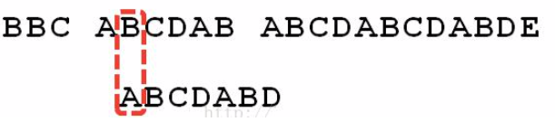

7. 怎么做到把刚刚重复的步骤省略掉?可以对 Str2 计算出一张《部分匹配表》，这张表的产生在后面介绍


8. 已知空格与 D 不匹配时，前面六个字符"ABCDAB"是匹配的。查表可知，最后一个匹配字符 B 对应的"部分匹配值"为 2，因此按照下面的公式算出向后移动的位数:
 	移动位数 = 已匹配的字符数 - 对应的部分匹配值
 	因为 6 - 2 等于 4，所以将搜索词向后移动 4 位。
9. 因为空格与C不匹配，搜索词还要继续往后移。这时，已匹配的字符数为 2("AB")，对应的"部分匹配值"为 0。所以，移动位数 = 2 - 0，结果为 2，于是将搜索词向后移 2 位。

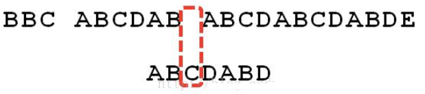

10. 因为空格与 A 不匹配，继续后移一位。

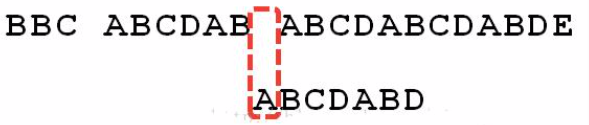

11. 逐位比较，直到发现 C 与 D 不匹配。于是，移动位数 = 6 - 2，继续将搜索词向后移动 4 位。

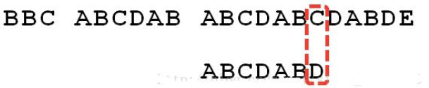

12. 逐位比较，直到搜索词的最后一位，发现完全匹配，于是搜索完成。如果还要继续搜索(即找出全部匹配)， 移动位数 = 7 - 0，再将搜索词向后移动 7 位，这里就不再重复了。

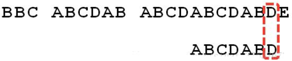

13. 介绍《部分匹配表》怎么产生的，先介绍前缀，后缀是什么

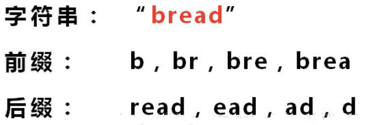

"部分匹配值"就是"前缀"和"后缀"的最长的共有元素的长度。

以"ABCDABD"为例: 

-"A"的前缀和后缀都为空集，共有元素的长度为 0; 
-"AB"的前缀为[A]，后缀为[B]，共有元素的长度为 0;
-"ABC"的前缀为[A, AB]，后缀为[BC, C]，共有元素的长度 0;
-"ABCD"的前缀为[A, AB, ABC]，后缀为[BCD, CD, D]，共有元素的长度为 0;
-"ABCDA"的前缀为[A, AB, ABC, ABCD]，后缀为[BCDA, CDA, DA, A]，共有元素为"A"，长度为 1;
-"ABCDAB"的前缀为[A, AB, ABC, ABCD, ABCDA]，后缀为[BCDAB, CDAB, DAB, AB, B]，共有元素为"AB"，长度为 2;
-"ABCDABD"的前缀为[A, AB, ABC, ABCD, ABCDA, ABCDAB]，后缀为[BCDABD, CDABD, DABD, ABD, BD, D]，共有元素的长度为 0。

14. "部分匹配"的实质是，有时候，字符串头部和尾部会有重复。比如，"ABCDAB"之中有两个"AB"，那么它的"部分匹配值"就是 2("AB"的长度)。搜索词移动的时候，第一个"AB"向后移动 4 位(字符串长度- 部分匹配值)，就可以来到第二个"AB"的位置。


## 14.4.5 代码实现


```java
package com.atguigu.kmp;

import java.util.Arrays;

public class KMPAlgorithm {

	public static void main(String[] args) {
		String str1 = "BBC ABCDAB ABCDABCDABDE";
		String str2 = "ABCDABD";
		//String str2 = "BBC";
		
		int[] next = kmpNext("ABCDABD"); 
		System.out.println("next=" + Arrays.toString(next));//[0, 0, 0, 0, 1, 2, 0]
		
		int index = kmpSearch(str1, str2, next);
		System.out.println("index=" + index); // 15
	}
	
	//写出我们的kmp搜索算法
	/**
	 * 
	 * @param str1 源字符串
	 * @param str2 子串
	 * @param next 部分匹配表, 是子串对应的部分匹配表
	 * @return 如果是-1就是没有匹配到，否则返回第一个匹配的位置
	 */
	public static int kmpSearch(String str1, String str2, int[] next) {
		
		//遍历 
		for(int i = 0, j = 0; i < str1.length(); i++) {
			
			//需要处理 str1.charAt(i) ！= str2.charAt(j), 去调整j的大小
			//KMP算法核心点, 可以验证...
			while( j > 0 && str1.charAt(i) != str2.charAt(j)) {
				j = next[j-1]; 
			}
			
			if(str1.charAt(i) == str2.charAt(j)) {
				j++;
			}			
			if(j == str2.length()) {//找到了 // j = 3 i 
				return i - j + 1;
			}
		}
		return  -1;
	}

	//获取到一个字符串(子串) 的部分匹配值表
	public static  int[] kmpNext(String dest) {
		//创建一个next 数组保存部分匹配值
		int[] next = new int[dest.length()];
		next[0] = 0; //如果字符串是长度为1 部分匹配值就是0
		for(int i = 1, j = 0; i < dest.length(); i++) {
			//当dest.charAt(i) != dest.charAt(j) ，我们需要从next[j-1]获取新的j
			//直到我们发现 有  dest.charAt(i) == dest.charAt(j)成立才退出
			//这时kmp算法的核心点
			while(j > 0 && dest.charAt(i) != dest.charAt(j)) {
				j = next[j-1];
			}
			
			//当dest.charAt(i) == dest.charAt(j) 满足时，部分匹配值就是+1
			if(dest.charAt(i) == dest.charAt(j)) {
				j++;
			}
			next[i] = j;
		}
		return next;
	}
}
```


# 14.5 贪心算法

## 14.5.1 应用场景-集合覆盖问题


假设存在下面需要付费的广播台，以及广播台信号可以覆盖的地区。 如何选择最少的广播台，让所有的地区都可以接收到信号


## 14.5.2 贪心算法介绍


1. 贪婪算法(贪心算法)是指在对问题进行求解时，在==每一步选择中都采取最好或者最优(即最有利)的选择==，从而希望能够导致结果是最好或者最优的算法。
2. 贪婪算法所得到的结果==不一定是最优的结果(有时候会是最优解)==，但是都是==相对近似==(接近)最优解的结果。


## 14.5.3 思路分析


1. 如何找出覆盖所有地区的广播台的集合呢，使用穷举法实现,列出每个可能的广播台的集合，这被称为幂集。假设总的有n个广播台，则广播台的组合总共有2ⁿ -1 个,假设每秒可以计算10个子集， 如图:

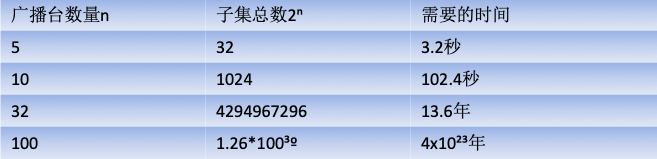

2. 使用贪婪算法，效率高:

目前并没有算法可以快速计算得到准备的值，使用贪婪算法，则可以得到非常接近的解，并且效率高。选择策略上，因为需要覆盖全部地区的最小集合:

1) 遍历所有的广播电台, 找到一个覆盖了最多**未覆盖的地区**的电台(此电台可能包含一些已覆盖的地区，但没有关系）。

2) 将这个电台加入到一个集合中(比如ArrayList)，想办法把该电台覆盖的地区在下次比较时去掉。

3) 重复第1步直到覆盖了全部的地区

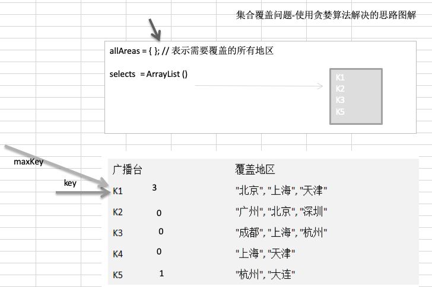


## 14.5.4 代码实现


```java
package com.atguigu.greedy;

import java.util.ArrayList;
import java.util.HashMap;
import java.util.HashSet;

public class GreedyAlgorithm {

	public static void main(String[] args) {
		//创建广播电台,放入到Map
		HashMap<String,HashSet<String>> broadcasts = new HashMap<String, HashSet<String>>();
		//将各个电台放入到broadcasts
		HashSet<String> hashSet1 = new HashSet<String>();
		hashSet1.add("北京");
		hashSet1.add("上海");
		hashSet1.add("天津");
		
		HashSet<String> hashSet2 = new HashSet<String>();
		hashSet2.add("广州");
		hashSet2.add("北京");
		hashSet2.add("深圳");
		
		HashSet<String> hashSet3 = new HashSet<String>();
		hashSet3.add("成都");
		hashSet3.add("上海");
		hashSet3.add("杭州");
		
		
		HashSet<String> hashSet4 = new HashSet<String>();
		hashSet4.add("上海");
		hashSet4.add("天津");
		
		HashSet<String> hashSet5 = new HashSet<String>();
		hashSet5.add("杭州");
		hashSet5.add("大连");
	
		//加入到map
		broadcasts.put("K1", hashSet1);
		broadcasts.put("K2", hashSet2);
		broadcasts.put("K3", hashSet3);
		broadcasts.put("K4", hashSet4);
		broadcasts.put("K5", hashSet5);
		
		//allAreas 存放所有的地区
		HashSet<String> allAreas = new HashSet<String>();
		allAreas.add("北京");
		allAreas.add("上海");
		allAreas.add("天津");
		allAreas.add("广州");
		allAreas.add("深圳");
		allAreas.add("成都");
		allAreas.add("杭州");
		allAreas.add("大连");
		
		//创建ArrayList, 存放选择的电台集合
		ArrayList<String> selects = new ArrayList<String>();
		
		//定义一个临时的集合， 在遍历的过程中，存放遍历过程中的电台覆盖的地区和当前还没有覆盖的地区的交集
		HashSet<String> tempSet = new HashSet<String>();
		
		//定义给maxKey ， 保存在一次遍历过程中，能够覆盖最大未覆盖的地区对应的电台的key
		//如果maxKey 不为null , 则会加入到 selects
		String maxKey = null;
		while(allAreas.size() != 0) { // 如果allAreas 不为0, 则表示还没有覆盖到所有的地区
			//每进行一次while,需要
			maxKey = null;
			
			//遍历 broadcasts, 取出对应key
			for(String key : broadcasts.keySet()) {
				//每进行一次for
				tempSet.clear();
				//当前这个key能够覆盖的地区
				HashSet<String> areas = broadcasts.get(key);
				tempSet.addAll(areas);
				//求出tempSet 和   allAreas 集合的交集, 交集会赋给 tempSet
				tempSet.retainAll(allAreas);
				//如果当前这个集合包含的未覆盖地区的数量，比maxKey指向的集合地区还多
				//就需要重置maxKey
				// tempSet.size() >broadcasts.get(maxKey).size()) 体现出贪心算法的特点,每次都选择最优的
				if(tempSet.size() > 0 && 
						(maxKey == null || tempSet.size() >broadcasts.get(maxKey).size())){
					maxKey = key;
				}
			}
			//maxKey != null, 就应该将maxKey 加入selects
			if(maxKey != null) {
				selects.add(maxKey);
				//将maxKey指向的广播电台覆盖的地区，从 allAreas 去掉
				allAreas.removeAll(broadcasts.get(maxKey));
			}
			
		}
		
		System.out.println("得到的选择结果是" + selects);//[K1,K2,K3,K5]
	}

}
```

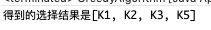


## 14.5.5 贪心算法注意事项和细节


1. 贪婪算法所得到的结果不一定是最优的结果(有时候会是最优解)，但是都是相对近似(接近)最优解的结果
2. 比如上题的算法选出的是K1,K2,K3,K5，符合覆盖了全部的地区
3. 但是我们发现K2,K3,K4,K5也可以覆盖全部地区，如果K2的使用成本低于K1，那么我们上题的K1,K2,K3,K5 虽然是满足条件，但是并不是最优的。


# 14.6 普里姆算法

## 14.6.1 应用场景-修路问题


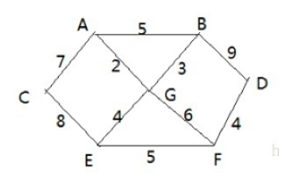

1. 有胜利乡有7个村庄(A, B, C, D, E, F, G) ，现在需要修路把7个村庄连通
2. 各个村庄的距离用边线表示(权) ，比如 A – B 距离 5公里
3. 问：如何修路保证各个村庄都能连通，并且总的修建公路总里程最短?

思路**:** 将 10 条边，连接即可，但是总的里程数不是最小。

正确的思路，就是尽可能的选择少的路线，并且每条路线最小，保证总里程数最少。


## 14.6.2 最小生成树


修路问题本质就是就是最小生成树问题， 先介绍一下最小生成树**(Minimum Cost Spanning Tree)**，简称 **MST**。 

1. 给定一个带权的无向连通图，如何选取一棵生成树，使树上所有==边上权的总和为最小==，这叫最小生成树。
2. N个顶点，一定有N-1条边。
3. 包含全部顶点
4. N-1 条边都在图中
5. 求最小生成树的算法主要是**普里姆算法**和**克鲁斯卡尔算法**

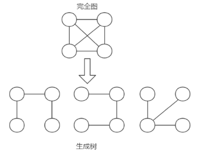


## 14.6.3 普里姆算法介绍


普利姆(Prim)算法求最小生成树，也就是在包含n个顶点的连通图中，找出只有(n-1)条边包含所有n个顶点的连通子图，也就是所谓的**极小连通子图**。

普利姆的算法思路:

1. 设G=(V,E)是连通网，T=(U,D)是最小生成树，V,U是顶点集合，E,D是边的集合。
2. 若从顶点u开始构造最小生成树，则从集合V中取出顶点u放入集合U中，标记顶点v的visited[u]=1。
3. 若集合U中顶点ui与集合V-U中的顶点vj之间存在边，则寻找这些边中权值最小的边，但不能构成回路，将顶点 vj 加入集合 U 中，将边(ui,vj)加入集合 D 中，标记 visited[vj]=1。
4. 重复步骤2，直到U与V相等，即所有顶点都被标记为访问过，此时D中有n-1条边。
5. 提示: 单独看步骤很难理解，我们通过代码来讲解，比较好理解。

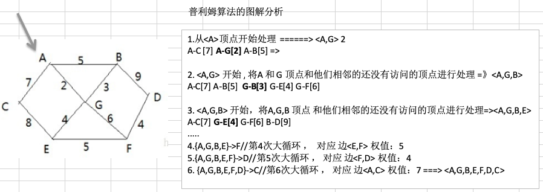


## 14.6.4 代码实现


```java
package com.atguigu.prim;

import java.util.Arrays;

public class PrimAlgorithm {

	public static void main(String[] args) {
		//测试看看图是否创建ok
		char[] data = new char[]{'A','B','C','D','E','F','G'};
		int verxs = data.length;
		//邻接矩阵的关系使用二维数组表示,10000这个大数，表示两个点不连通
		int [][]weight=new int[][]{
            {10000,5,7,10000,10000,10000,2},
            {5,10000,10000,9,10000,10000,3},
            {7,10000,10000,10000,8,10000,10000},
            {10000,9,10000,10000,10000,4,10000},
            {10000,10000,8,10000,10000,5,4},
            {10000,10000,10000,4,5,10000,6},
            {2,3,10000,10000,4,6,10000},};
            
        //创建MGraph对象
        MGraph graph = new MGraph(verxs);
        //创建一个MinTree对象
        MinTree minTree = new MinTree();
        minTree.createGraph(graph, verxs, data, weight);
        //输出
        minTree.showGraph(graph);
        //测试普利姆算法
        minTree.prim(graph, 1);// 
	}

}

//创建最小生成树->村庄的图
class MinTree {
	//创建图的邻接矩阵
	/**
	 * 
	 * @param graph 图对象
	 * @param verxs 图对应的顶点个数
	 * @param data 图的各个顶点的值
	 * @param weight 图的邻接矩阵
	 */
	public void createGraph(MGraph graph, int verxs, char data[], int[][] weight) {
		int i, j;
		for(i = 0; i < verxs; i++) {//顶点
			graph.data[i] = data[i];
			for(j = 0; j < verxs; j++) {
				graph.weight[i][j] = weight[i][j];
			}
		}
	}
	
	//显示图的邻接矩阵
	public void showGraph(MGraph graph) {
		for(int[] link: graph.weight) {
			System.out.println(Arrays.toString(link));
		}
	}
	
	//编写prim算法，得到最小生成树
	/**
	 * 
	 * @param graph 图
	 * @param v 表示从图的第几个顶点开始生成'A'->0 'B'->1...
	 */
	public void prim(MGraph graph, int v) {
		//visited[] 标记结点(顶点)是否被访问过
		int visited[] = new int[graph.verxs];
		//visited[] 默认元素的值都是0, 表示没有访问过
//		for(int i =0; i <graph.verxs; i++) {
//			visited[i] = 0;
//		}
		
		//把当前这个结点标记为已访问
		visited[v] = 1;
		//h1 和 h2 记录两个顶点的下标
		int h1 = -1;
		int h2 = -1;
		int minWeight = 10000; //将 minWeight 初始成一个大数，后面在遍历过程中，会被替换
		for(int k = 1; k < graph.verxs; k++) {//因为有 graph.verxs顶点，普利姆算法结束后，有 graph.verxs-1边
			
			//这个是确定每一次生成的子图 ，和哪个结点的距离最近
			for(int i = 0; i < graph.verxs; i++) {// i结点表示被访问过的结点
				for(int j = 0; j< graph.verxs;j++) {//j结点表示还没有访问过的结点
					if(visited[i] == 1 && visited[j] == 0 && graph.weight[i][j] < minWeight) {
						//替换minWeight(寻找已经访问过的结点和未访问过的结点间的权值最小的边)
						minWeight = graph.weight[i][j];
						h1 = i;
						h2 = j;
					}
				}
			}
			//找到一条边是最小
			System.out.println("边<" + graph.data[h1] + "," + graph.data[h2] + "> 权值:" + minWeight);
			//将当前这个结点标记为已经访问
			visited[h2] = 1;
			//minWeight 重新设置为最大值 10000
			minWeight = 10000;
		}
		
	}
}

class MGraph {
	int verxs; //表示图的节点个数
	char[] data;//存放结点数据
	int[][] weight; //存放边，就是我们的邻接矩阵
	
	public MGraph(int verxs) {
		this.verxs = verxs;
		data = new char[verxs];
		weight = new int[verxs][verxs];
	}
}
```

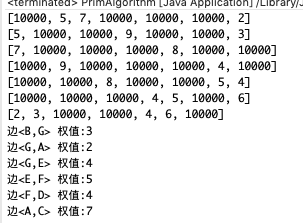


# 14.7 克鲁斯卡尔算法

## 14.7.1 应用场景-公交站问题


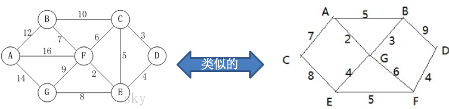

1. 某城市新增7个站点(A, B, C, D, E, F, G) ，现在需要修路把7个站点连通。
2. 各个站点的距离用边线表示(权) ，比如 A – B 距离 12公里
3. 问:如何修路保证各个站点都能连通，并且总的修建公路总里程最短?


## 14.7.2 克鲁斯卡尔算法介绍


1. 克鲁斯卡尔(Kruskal)算法，是用来求加权连通图的最小生成树的算法。
2. 基本思想:按照权值从小到大的顺序选择n-1条边，并保证这n-1条边不构成回路。
3. 具体做法:首先构造一个只含n个顶点的森林，然后依权值从小到大从连通网中选择边加入到森林中，并使森林中不产生回路，直至森林变成一棵树为止。


## 14.7.3 克鲁斯卡尔算法图解说明


在含有 n 个顶点的连通图中选择 n-1 条边，构成一棵极小连通子图，并使该连通子图中 n-1 条边上权值之和达到 最小，则称其为连通网的最小生成树。

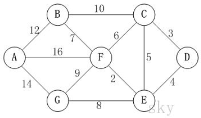

例如，对于如上图所示的连通网可以有多棵权值总和不相同的生成树。

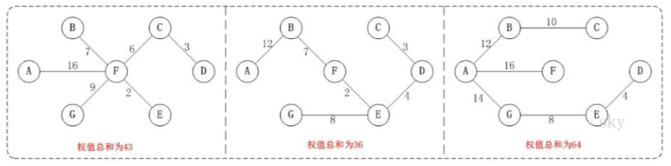


### 1、克鲁斯卡尔算法图解

对克鲁斯卡尔进行演示(假设，用数组 R 保存最小生成树结果)。

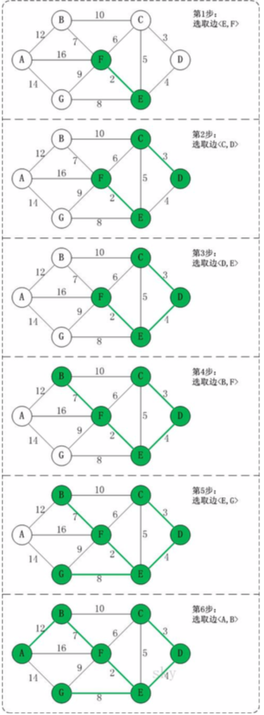

第 **1** 步:将边<E,F>加入 R 中。 边<E,F>的权值最小，因此将它加入到最小生成树结果 R 中。

第 **2** 步:将边<C,D>加入 R 中。 上一步操作之后，边<C,D>的权值最小，因此将它加入到最小生成树结果 R 中。

第 **3** 步:将边<D,E>加入 R 中。 上一步操作之后，边<D,E>的权值最小，因此将它加入到最小生成树结果 R 中。

第 **4** 步:将边<B,F>加入 R 中。 上一步操作之后，边<C,E>的权值最小，但<C,E>会和已有的边构成回路;因此，跳过边<C,E>。同理，跳过边<C,F>。将边<B,F>加入到最小生成树结果 R 中。 

第 **5** 步:将边<E,G>加入 R 中。

上一步操作之后，边<E,G>的权值最小，因此将它加入到最小生成树结果 R 中。 

第 **6** 步:将边<A,B>加入 R 中。

上一步操作之后，边<F,G>的权值最小，但<F,G>会和已有的边构成回路；因此，跳过边<F,G>。同理，跳过边<B,C>。将边<A,B>加入到最小生成树结果 R 中。

此时，最小生成树构造完成!它包括的边依次是:   **<E,F> <C,D> <D,E> <B,F> <E,G> <A,B>**。


### 2、克鲁斯卡尔算法分析

根据前面介绍的克鲁斯卡尔算法的基本思想和做法，我们能够了解到，克鲁斯卡尔算法重点需要解决的以下两个问 题：

**问题一** 对图的所有边按照权值大小进行排序。

**问题二** 将边添加到最小生成树中时，怎么样判断是否形成了回路。

问题一很好解决，采用排序算法进行排序即可。

问题二，处理方式是:记录顶点在"最小生成树"中的终点，顶点的终点是"在最小生成树中与它连通的最大顶点"。 然后每次需要将一条边添加到最小生存树时，判断该边的两个顶点的终点是否重合，重合的话则会构成回路。


### 3、如何判断是否构成回路-举例说明(如图)

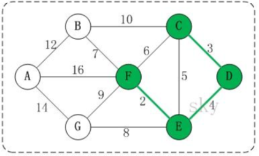

在将<E,F> <C,D> <D,E>加入到最小生成树 R 中之后，这几条边的顶点就都有了终点:

1. C 的终点是 F
2. D 的终点是 F
3. E 的终点是 F
4. F 的终点是 F

关于终点的说明：

就是将所有顶点按照从小到大的顺序排列好之后;某个顶点的终点就是"与它连通的最大顶点"。

因此，接下来，虽然<C,E>是权值最小的边。但是 C 和 E 的终点都是 F，即它们的终点相同，因此，将<C,E> 加入最小生成树的话，会形成回路。这就是判断回路的方式。也就是说，我们加入的边的两个顶点不能都指向同一个终点，否则将构成回路。【后面有代码说明】


## 14.7.4 代码实现


```java
package com.atguigu.kruskal;

import java.util.Arrays;

public class KruskalCase {

	private int edgeNum; //边的个数
	private char[] vertexs; //顶点数组
	private int[][] matrix; //邻接矩阵
	//使用 INF 表示两个顶点不能连通
	private static final int INF = Integer.MAX_VALUE;
	
	public static void main(String[] args) {
		char[] vertexs = {'A', 'B', 'C', 'D', 'E', 'F', 'G'};
		//克鲁斯卡尔算法的邻接矩阵  
	      int matrix[][] = {
	      /*A*//*B*//*C*//*D*//*E*//*F*//*G*/
	/*A*/ {   0,  12, INF, INF, INF,  16,  14},
	/*B*/ {  12,   0,  10, INF, INF,   7, INF},
	/*C*/ { INF,  10,   0,   3,   5,   6, INF},
	/*D*/ { INF, INF,   3,   0,   4, INF, INF},
	/*E*/ { INF, INF,   5,   4,   0,   2,   8},
	/*F*/ {  16,   7,   6, INF,   2,   0,   9},
	/*G*/ {  14, INF, INF, INF,   8,   9,   0}}; 
	      //大家可以在去测试其它的邻接矩阵，结果都可以得到最小生成树.
	      
	      //创建KruskalCase 对象实例
	      KruskalCase kruskalCase = new KruskalCase(vertexs, matrix);
	      //输出构建的
	      kruskalCase.print();
	      kruskalCase.kruskal();
	}
	
	//构造器
	public KruskalCase(char[] vertexs, int[][] matrix) {
		//初始化顶点数和边的个数
		int vlen = vertexs.length;
		
		//初始化顶点, 复制拷贝的方式
		this.vertexs = new char[vlen];
		for(int i = 0; i < vertexs.length; i++) {
			this.vertexs[i] = vertexs[i];
		}
		
		//初始化边, 使用的是复制拷贝的方式
		this.matrix = new int[vlen][vlen];
		for(int i = 0; i < vlen; i++) {
			for(int j= 0; j < vlen; j++) {
				this.matrix[i][j] = matrix[i][j];
			}
		}
		//统计边的条数
		for(int i =0; i < vlen; i++) {
			for(int j = i+1; j < vlen; j++) {
				if(this.matrix[i][j] != INF) {
					edgeNum++;
				}
			}
		}
		
	}
	public void kruskal() {
		int index = 0; //表示最后结果数组的索引
		int[] ends = new int[edgeNum]; //用于保存"已有最小生成树" 中的每个顶点在最小生成树中的终点
		//创建结果数组, 保存最后的最小生成树
		EData[] rets = new EData[edgeNum];
		
		//获取图中 所有的边的集合 ， 一共有12边
		EData[] edges = getEdges();
		System.out.println("图的边的集合=" + Arrays.toString(edges) + " 共"+ edges.length); //12
		
		//按照边的权值大小进行排序(从小到大)
		sortEdges(edges);
		
		//遍历edges 数组，将边添加到最小生成树中时，判断是准备加入的边否形成了回路，如果没有，就加入 rets, 否则不能加入
		for(int i=0; i < edgeNum; i++) {
			//获取到第i条边的第一个顶点(起点)
			int p1 = getPosition(edges[i].start); //p1=4
			//获取到第i条边的第2个顶点
			int p2 = getPosition(edges[i].end); //p2 = 5
			
			//获取p1这个顶点在已有最小生成树中的终点
			int m = getEnd(ends, p1); //m = 4
			//获取p2这个顶点在已有最小生成树中的终点
			int n = getEnd(ends, p2); // n = 5
			//是否构成回路
			if(m != n) { //没有构成回路
				ends[m] = n; // 设置m 在"已有最小生成树"中的终点 <E,F> [0,0,0,0,5,0,0,0,0,0,0,0]
				rets[index++] = edges[i]; //有一条边加入到rets数组
			}
		}
		//<E,F> <C,D> <D,E> <B,F> <E,G> <A,B>。
		//统计并打印 "最小生成树", 输出  rets
		System.out.println("最小生成树为");
		for(int i = 0; i < index; i++) {
			System.out.println(rets[i]);
		}
		
		
	}
	
	//打印邻接矩阵
	public void print() {
		System.out.println("邻接矩阵为: \n");
		for(int i = 0; i < vertexs.length; i++) {
			for(int j=0; j < vertexs.length; j++) {
				System.out.printf("%12d", matrix[i][j]);
			}
			System.out.println();//换行
		}
	}

	/**
	 * 功能：对边进行排序处理, 冒泡排序
	 * @param edges 边的集合
	 */
	private void sortEdges(EData[] edges) {
		for(int i = 0; i < edges.length - 1; i++) {
			for(int j = 0; j < edges.length - 1 - i; j++) {
				if(edges[j].weight > edges[j+1].weight) {//交换
					EData tmp = edges[j];
					edges[j] = edges[j+1];
					edges[j+1] = tmp;
				}
			}
 		}
	}
	/**
	 * 
	 * @param ch 顶点的值，比如'A','B'
	 * @return 返回ch顶点对应的下标，如果找不到，返回-1
	 */
	private int getPosition(char ch) {
		for(int i = 0; i < vertexs.length; i++) {
			if(vertexs[i] == ch) {//找到
				return i;
			}
		}
		//找不到,返回-1
		return -1;
	}
	/**
	 * 功能: 获取图中边，放到EData[] 数组中，后面我们需要遍历该数组
	 * 是通过matrix 邻接矩阵来获取
	 * EData[] 形式 [['A','B', 12], ['B','F',7], .....]
	 * @return
	 */
	private EData[] getEdges() {
		int index = 0;
		EData[] edges = new EData[edgeNum];
		for(int i = 0; i < vertexs.length; i++) {
			for(int j=i+1; j <vertexs.length; j++) {
				if(matrix[i][j] != INF) {
					edges[index++] = new EData(vertexs[i], vertexs[j], matrix[i][j]);
				}
			}
		}
		return edges;
	}
	/**
	 * 功能: 获取下标为i的顶点的终点(), 用于后面判断两个顶点的终点是否相同
	 * @param ends ： 数组就是记录了各个顶点对应的终点是哪个,ends 数组是在遍历过程中，逐步形成
	 * @param i : 表示传入的顶点对应的下标
	 * @return 返回的就是 下标为i的这个顶点对应的终点的下标, 一会回头还有来理解
	 */
	private int getEnd(int[] ends, int i) { // i = 4 [0,0,0,0,5,0,0,0,0,0,0,0]
		while(ends[i] != 0) {
			i = ends[i];
		}
		return i;
	}
 
}

//创建一个类EData ，它的对象实例就表示一条边
class EData {
	char start; //边的一个点
	char end; //边的另外一个点
	int weight; //边的权值
	//构造器
	public EData(char start, char end, int weight) {
		this.start = start;
		this.end = end;
		this.weight = weight;
	}
	//重写toString, 便于输出边信息
	@Override
	public String toString() {
		return "EData [<" + start + ", " + end + ">= " + weight + "]";
	}
	
	
}
```

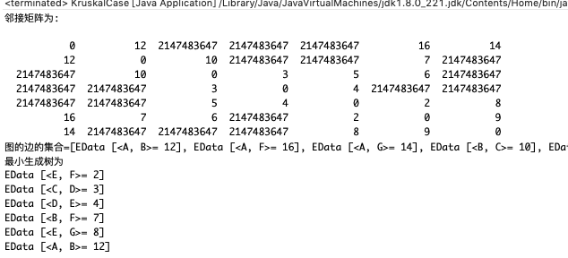


# 14.8 迪杰斯特拉算法

## 14.8.1 应用场景-最短路径问题


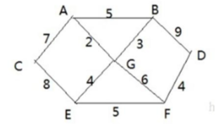

1. 战争时期，胜利乡有7个村庄(A,B,C,D,E,F,G)，现在有六个邮差，从G点出发，需要分别把邮件分别送到 A,B,C,D,E,F 六个村庄
2. 各个村庄的距离用边线表示(权) ，比如 A – B 距离 5 公里
3. 问:如何计算出G村庄到其它各个村庄的最短距离?
4. 如果从其它点出发到各个点的最短距离又是多少?


## 14.8.2 迪杰斯特拉(Dijkstra)算法介绍


迪杰斯特拉(Dijkstra)算法是典型最短路径算法，用于计算一个结点到其他结点的最短路径。它的主要特点是以起始点为中心向外层层扩展(广度优先搜索思想)，直到扩展到终点为止。


## 14.8.3 迪杰斯特拉(Dijkstra)算法过程


1. 设置出发顶点为v，顶点集合V{v1,v2,vi...}，v到V中各顶点的距离构成距离集合Dis，Dis{d1,d2,di...}，Dis 集合记录着 v 到图中各顶点的距离(到自身可以看作 0，v 到 vi 距离对应为 di)。
2. 从Dis中选择值最小的di并移出Dis集合，同时移出V集合中对应的顶点vi，此时的v到vi即为最短路径。
3. 更新Dis集合，更新规则为:比较v到V集合中顶点的距离值，与v通过vi到V集合中顶点的距离值，保留值较小的一个(同时也应该更新顶点的前驱节点为 vi，表明是通过 vi 到达的)。
4. 重复执行两步骤，直到最短路径顶点为目标顶点即可结束。


## 14.8.4 图解


| d                                                            | d    |
| ------------------------------------------------------------ | ---- |
| 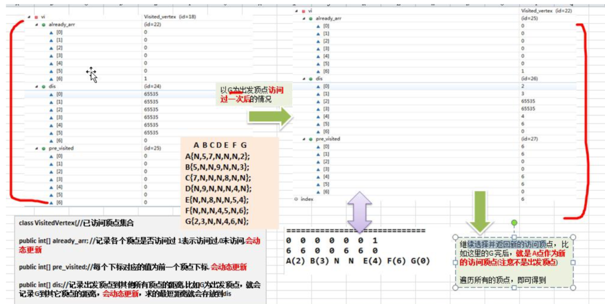 |      |


## 14.8.5 代码实现


```java
package com.atguigu.dijkstra;

import java.util.Arrays;

public class DijkstraAlgorithm {

	public static void main(String[] args) {
		char[] vertex = { 'A', 'B', 'C', 'D', 'E', 'F', 'G' };
		//邻接矩阵
		int[][] matrix = new int[vertex.length][vertex.length];
		final int N = 65535;// 表示不可以连接
		matrix[0]=new int[]{N,5,7,N,N,N,2};  
        matrix[1]=new int[]{5,N,N,9,N,N,3};  
        matrix[2]=new int[]{7,N,N,N,8,N,N};  
        matrix[3]=new int[]{N,9,N,N,N,4,N};  
        matrix[4]=new int[]{N,N,8,N,N,5,4};  
        matrix[5]=new int[]{N,N,N,4,5,N,6};  
        matrix[6]=new int[]{2,3,N,N,4,6,N};
        //创建 Graph对象
        Graph graph = new Graph(vertex, matrix);
        //测试, 看看图的邻接矩阵是否ok
        graph.showGraph();
        //测试迪杰斯特拉算法
        graph.dsj(6);//G
        graph.showDijkstra();
	}

}

class Graph {
	private char[] vertex; // 顶点数组
	private int[][] matrix; // 邻接矩阵
	private VisitedVertex vv; //已经访问的顶点的集合

	// 构造器
	public Graph(char[] vertex, int[][] matrix) {
		this.vertex = vertex;
		this.matrix = matrix;
	}
	
	//显示结果
	public void showDijkstra() {
		vv.show();
	}

	// 显示图
	public void showGraph() {
		for (int[] link : matrix) {
			System.out.println(Arrays.toString(link));
		}
	}
	
	//迪杰斯特拉算法实现
	/**
	 * 
	 * @param index 表示出发顶点对应的下标
	 */
	public void dsj(int index) {
		vv = new VisitedVertex(vertex.length, index);
		update(index);//更新index顶点到周围顶点的距离和前驱顶点
		for(int j = 1; j <vertex.length; j++) {
			index = vv.updateArr();// 选择并返回新的访问顶点
			update(index); // 更新index顶点到周围顶点的距离和前驱顶点
		} 
	}
	
	
	
	//更新index下标顶点到周围顶点的距离和周围顶点的前驱顶点,
	private void update(int index) {
		int len = 0;
		//根据遍历我们的邻接矩阵的  matrix[index]行
		for(int j = 0; j < matrix[index].length; j++) {
			// len 含义是 : 出发顶点到index顶点的距离 + 从index顶点到j顶点的距离的和 
			len = vv.getDis(index) + matrix[index][j];
			// 如果j顶点没有被访问过，并且 len 小于出发顶点到j顶点的距离，就需要更新
			if(!vv.in(j) && len < vv.getDis(j)) {
				vv.updatePre(j, index); //更新j顶点的前驱为index顶点
				vv.updateDis(j, len); //更新出发顶点到j顶点的距离
			}
		}
	}
}

// 已访问顶点集合
class VisitedVertex {
	// 记录各个顶点是否访问过 1表示访问过,0未访问,会动态更新
	public int[] already_arr;
	// 每个下标对应的值为前一个顶点下标, 会动态更新
	public int[] pre_visited;
	// 记录出发顶点到其他所有顶点的距离,比如G为出发顶点，就会记录G到其它顶点的距离，会动态更新，求的最短距离就会存放到dis
	public int[] dis;
	
	//构造器
	/**
	 * 
	 * @param length :表示顶点的个数 
	 * @param index: 出发顶点对应的下标, 比如G顶点，下标就是6
	 */
	public VisitedVertex(int length, int index) {
		this.already_arr = new int[length];
		this.pre_visited = new int[length];
		this.dis = new int[length];
		//初始化 dis数组
		Arrays.fill(dis, 65535);
		this.already_arr[index] = 1; //设置出发顶点被访问过
		this.dis[index] = 0;//设置出发顶点的访问距离为0
				
	}
	/**
	 * 功能: 判断index顶点是否被访问过
	 * @param index
	 * @return 如果访问过，就返回true, 否则访问false
	 */
	public boolean in(int index) {
		return already_arr[index] == 1;
	}
	
	/**
	 * 功能: 更新出发顶点到index顶点的距离
	 * @param index
	 * @param len
	 */
	public void updateDis(int index, int len) {
		dis[index] = len;
	}
	/**
	 * 功能: 更新pre这个顶点的前驱顶点为index顶点
	 * @param pre
	 * @param index
	 */
	public void updatePre(int pre, int index) {
		pre_visited[pre] = index;
	}
	/**
	 * 功能:返回出发顶点到index顶点的距离
	 * @param index
	 */
	public int getDis(int index) {
		return dis[index];
	}
	
	
	/**
	 * 继续选择并返回新的访问顶点， 比如这里的G 完后，就是 A点作为新的访问顶点(注意不是出发顶点)
	 * @return
	 */
	public int updateArr() {
		int min = 65535, index = 0;
		for(int i = 0; i < already_arr.length; i++) {
			if(already_arr[i] == 0 && dis[i] < min ) {
				min = dis[i];
				index = i;
			}
		}
		//更新 index 顶点被访问过
		already_arr[index] = 1;
		return index;
	}
	
	//显示最后的结果
	//即将三个数组的情况输出
	public void show() {
		
		System.out.println("==========================");
		//输出already_arr
		for(int i : already_arr) {
			System.out.print(i + " ");
		}
		System.out.println();
		//输出pre_visited
		for(int i : pre_visited) {
			System.out.print(i + " ");
		}
		System.out.println();
		//输出dis
		for(int i : dis) {
			System.out.print(i + " ");
		}
		System.out.println();
		//为了好看最后的最短距离，我们处理
		char[] vertex = { 'A', 'B', 'C', 'D', 'E', 'F', 'G' };
		int count = 0;
		for (int i : dis) {
			if (i != 65535) {
				System.out.print(vertex[count] + "("+i+") ");
			} else {
				System.out.println("N ");
			}
			count++;
		}
		System.out.println();
		
	}

}
```

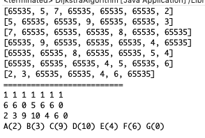


# 14.9 弗洛伊德算法

## 14.9.1 弗洛伊德(Floyd)算法介绍


1. 和Dijkstra算法一样，弗洛伊德(Floyd)算法也是一种用于寻找给定的加权图中顶点间最短路径的算法。该算法 名称以创始人之一、1978 年图灵奖获得者、斯坦福大学计算机科学系教授罗伯特·弗洛伊德命名。
2. 弗洛伊德算法(Floyd)计算图中各个顶点之间的最短路径。
3. 迪杰斯特拉算法用于计算图中某一个顶点到其他顶点的最短路径。
4. 弗洛伊德算法 VS 迪杰斯特拉算法:迪杰斯特拉算法通过选定的被访问顶点，求出从出发访问顶点到其他顶点的最短路径;弗洛伊德算法中每一个顶点都是出发访问点，所以需要将每一个顶点看做被访问顶点，求出从每 一个顶点到其他顶点的最短路径。


## 14.9.2 弗洛伊德(Floyd)算法图解分析


1. 设置顶点vi到顶点vk的最短路径已知为Lik，顶点vk到vj的最短路径已知为Lkj，顶点vi到vj的路径为Lij， 则 vi 到 vj 的最短路径为:min((Lik+Lkj),Lij)，vk 的取值为图中所有顶点，则可获得 vi 到 vj 的最短路径。
2. 至于vi到vk的最短路径Lik或者vk到vj的最短路径Lkj，是以同样的方式获得。
3. 弗洛伊德(Floyd)算法图解分析-举例说明

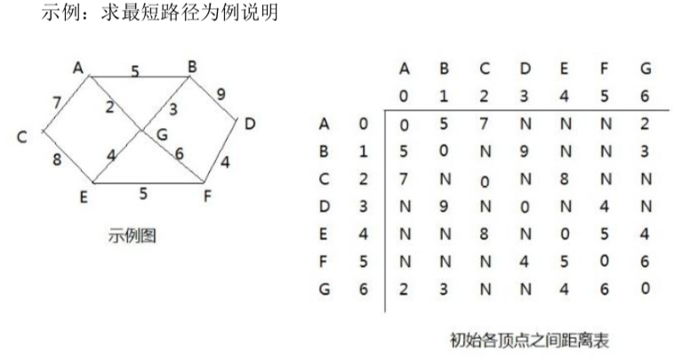

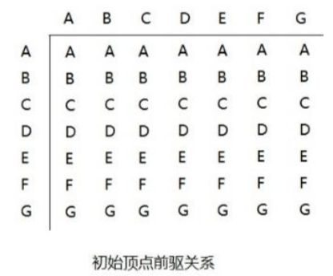

弗洛伊德算法的步骤:

第一轮循环中，以 A(下标为:0)作为中间顶点【即把 A 作为中间顶点的所有情况都进行遍历, 就会得到更新距离表 和 前驱关系】 距离表和前驱关系更新为:

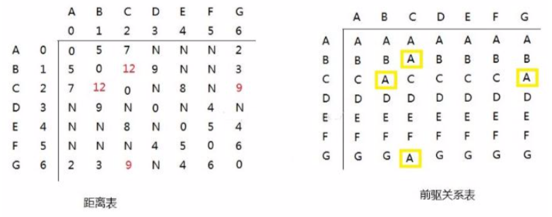

分析如下:

1. 以 A 顶点作为中间顶点是，B->A->C 的距离由 N->9，同理 C 到 B;C->A->G 的距离由 N->12，同理 G 到 C
2. 更换中间顶点，循环执行操作，直到所有顶点都作为中间顶点更新后，计算结束

| d                                                            | d    |
| ------------------------------------------------------------ | ---- |
| 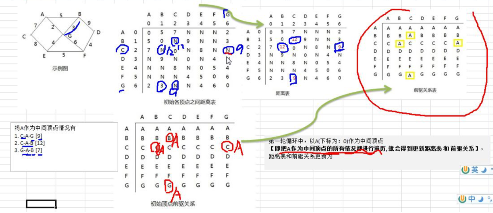 |      |


## 14.9.3 弗洛伊德(Floyd)算法最佳应用-最短路径


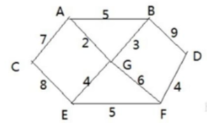

1. 胜利乡有7个村庄(A, B, C, D, E, F, G)
2. 各个村庄的距离用边线表示(权) ，比如 A – B 距离 5 公里
3. 问:如何计算出各村庄到其它各村庄的最短距离?
4. 代码实现

```java
package com.atguigu.floyd;

import java.util.Arrays;

public class FloydAlgorithm {

	public static void main(String[] args) {
		// 测试看看图是否创建成功
		char[] vertex = { 'A', 'B', 'C', 'D', 'E', 'F', 'G' };
		// 创建邻接矩阵
		int[][] matrix = new int[vertex.length][vertex.length];
		final int N = 65535;
		matrix[0] = new int[] { 0, 5, 7, N, N, N, 2 };
		matrix[1] = new int[] { 5, 0, N, 9, N, N, 3 };
		matrix[2] = new int[] { 7, N, 0, N, 8, N, N };
		matrix[3] = new int[] { N, 9, N, 0, N, 4, N };
		matrix[4] = new int[] { N, N, 8, N, 0, 5, 4 };
		matrix[5] = new int[] { N, N, N, 4, 5, 0, 6 };
		matrix[6] = new int[] { 2, 3, N, N, 4, 6, 0 };

		// 创建 Graph 对象
		Graph graph = new Graph(vertex.length, matrix, vertex);
		// 调用弗洛伊德算法
		graph.floyd();
		graph.show();
	}

}

// 创建图
class Graph {
	private char[] vertex; // 存放顶点的数组
	private int[][] dis; // 保存，从各个顶点出发到其它顶点的距离，最后的结果，也是保留在该数组
	private int[][] pre;// 保存到达目标顶点的前驱顶点

	// 构造器
	/**
	 * 
	 * @param length 大小
	 * @param matrix 邻接矩阵
	 * @param vertex 顶点数组
	 */
	public Graph(int length, int[][] matrix, char[] vertex) {
		this.vertex = vertex;
		this.dis = matrix;
		this.pre = new int[length][length];
		// 对pre数组初始化, 注意存放的是前驱顶点的下标
		for (int i = 0; i < length; i++) {
			Arrays.fill(pre[i], i);
		}
	}

	// 显示pre数组和dis数组
	public void show() {

		// 为了显示便于阅读，我们优化一下输出
		char[] vertex = { 'A', 'B', 'C', 'D', 'E', 'F', 'G' };
		for (int k = 0; k < dis.length; k++) {
			// 先将pre数组输出的一行
			for (int i = 0; i < dis.length; i++) {
				System.out.print(vertex[pre[k][i]] + " ");
			}
			System.out.println();
			// 输出dis数组的一行数据  各个点的的最短路径
			for (int i = 0; i < dis.length; i++) {
				System.out.print("(" + vertex[k] + "->" + vertex[i] + "：" + dis[k][i] + ") ");
			}
			System.out.println();
			System.out.println();

		}

	}

	// 弗洛伊德算法, 比较容易理解，而且容易实现
	public void floyd() {
		int len = 0; // 变量保存距离
		// 对中间顶点遍历， k 就是中间顶点的下标 [A, B, C, D, E, F, G]
		for (int k = 0; k < dis.length; k++) { //
			// 从i顶点开始出发 [A, B, C, D, E, F, G]
			for (int i = 0; i < dis.length; i++) {
				// 到达j顶点 // [A, B, C, D, E, F, G]
				for (int j = 0; j < dis.length; j++) {
					len = dis[i][k] + dis[k][j];// => 求出从i 顶点出发，经过 k中间顶点，到达 j 顶点距离
					if (len < dis[i][j]) {// 如果len小于 dis[i][j]
						dis[i][j] = len;// 更新距离
						pre[i][j] = pre[k][j];// 更新前驱顶点
					}
				}
			}
		}
	}
}
```

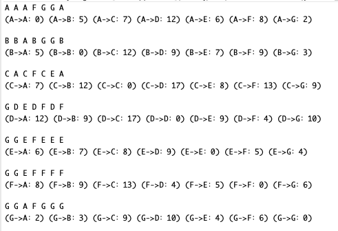


# 14.10 马踏棋盘算法

## 14.10.1 马踏棋盘算法介绍和游戏演示


1. 马踏棋盘算法也被称为骑士周游问题
2. 将马随机放在国际象棋的8×8棋盘Board\[0~7][0~7]的某个方格中，马按走棋规则(马走日字)进行移动。要求每个方格只进入一次，走遍棋盘上全部 64 个方格。
3. 游戏演示:http://www.4399.com/flash/146267_2.htm

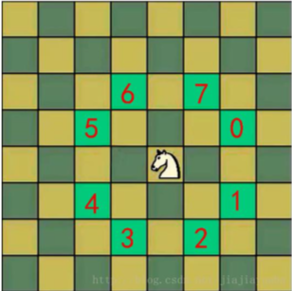


## 14.10.2 思路分析


| d                                                            | d    |
| ------------------------------------------------------------ | ---- |
| 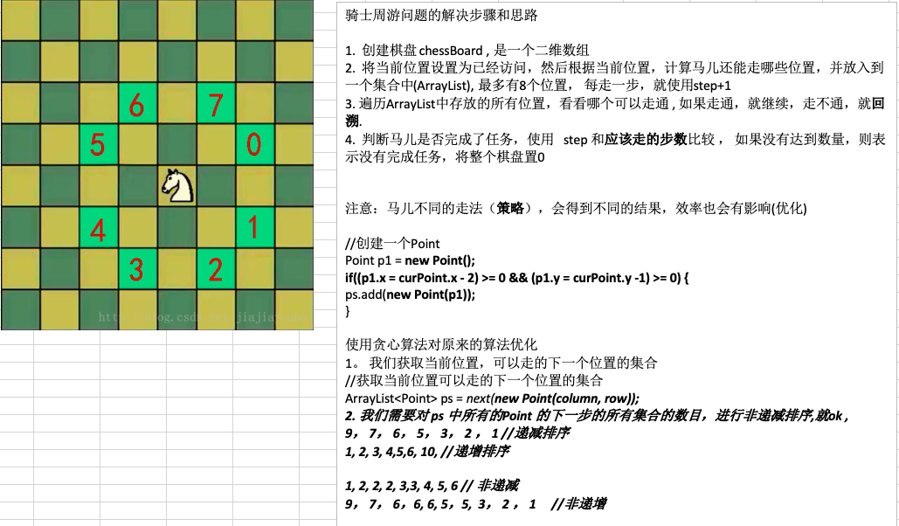 |      |


## 14.10.3 代码实现


```java
package com.atguigu.horse;

import java.awt.Point;
import java.util.ArrayList;
import java.util.Comparator;

public class HorseChessboard {

	private static int X; // 棋盘的列数
	private static int Y; // 棋盘的行数
	//创建一个数组，标记棋盘的各个位置是否被访问过
	private static boolean visited[];
	//使用一个属性，标记是否棋盘的所有位置都被访问
	private static boolean finished; // 如果为true,表示成功
	
	public static void main(String[] args) {
		System.out.println("骑士周游算法，开始运行~~");
		//测试骑士周游算法是否正确
		X = 8;
		Y = 8;
		int row = 1; //马儿初始位置的行，从1开始编号
		int column = 1; //马儿初始位置的列，从1开始编号
		//创建棋盘
		int[][] chessboard = new int[X][Y];
		visited = new boolean[X * Y];//初始值都是false
		//测试一下耗时
		long start = System.currentTimeMillis();
		traversalChessboard(chessboard, row - 1, column - 1, 1);
		long end = System.currentTimeMillis();
		System.out.println("共耗时: " + (end - start) + " 毫秒");
		
		//输出棋盘的最后情况
		for(int[] rows : chessboard) {
			for(int step: rows) {
				System.out.print(step + "\t");
			}
			System.out.println();
		}
	}
	
	/**
	 * 完成骑士周游问题的算法
	 * @param chessboard 棋盘
	 * @param row 马儿当前的位置的行 从0开始 
	 * @param column 马儿当前的位置的列  从0开始
	 * @param step 是第几步 ,初始位置就是第1步 
	 */
	public static void traversalChessboard(int[][] chessboard, int row, int column, int step) {
		chessboard[row][column] = step;
		//row = 4 X = 8 column = 4 = 4 * 8 + 4 = 36
		visited[row * X + column] = true; //标记该位置已经访问
		//获取当前位置可以走的下一个位置的集合 
		ArrayList<Point> ps = next(new Point(column, row));
		//对ps进行排序,排序的规则就是对ps的所有的Point对象的下一步的位置的数目，进行非递减排序
		sort(ps);//最后采用的优化 不优化时候用时一般是 39秒(优化后是60ms)
		//遍历 ps
		while(!ps.isEmpty()) {
			Point p = ps.remove(0);//取出下一个可以走的位置
			//判断该点是否已经访问过
			if(!visited[p.y * X + p.x]) {//说明还没有访问过
				traversalChessboard(chessboard, p.y, p.x, step + 1);
			}
		}
		//判断马儿是否完成了任务，使用   step 和应该走的步数比较 ， 
		//如果没有达到数量，则表示没有完成任务，将整个棋盘置0
		//说明: step < X * Y  成立的情况有两种
		//1. 棋盘到目前位置,仍然没有走完
		//2. 棋盘处于一个回溯过程
		if(step < X * Y && !finished ) {
			chessboard[row][column] = 0;
			visited[row * X + column] = false;
		} else {
			finished = true;
		}
		
	}
	
	/**
	 * 功能： 根据当前位置(Point对象)，计算马儿还能走哪些位置(Point)，并放入到一个集合中(ArrayList), 最多有8个位置
	 * @param curPoint
	 * @return
	 */
	public static ArrayList<Point> next(Point curPoint) {
		//创建一个ArrayList
		ArrayList<Point> ps = new ArrayList<Point>();
		//创建一个Point
		Point p1 = new Point();
		//表示马儿可以走5这个位置
		if((p1.x = curPoint.x - 2) >= 0 && (p1.y = curPoint.y -1) >= 0) {
			ps.add(new Point(p1));
		}
		//判断马儿可以走6这个位置
		if((p1.x = curPoint.x - 1) >=0 && (p1.y=curPoint.y-2)>=0) {
			ps.add(new Point(p1));
		}
		//判断马儿可以走7这个位置
		if ((p1.x = curPoint.x + 1) < X && (p1.y = curPoint.y - 2) >= 0) {
			ps.add(new Point(p1));
		}
		//判断马儿可以走0这个位置
		if ((p1.x = curPoint.x + 2) < X && (p1.y = curPoint.y - 1) >= 0) {
			ps.add(new Point(p1));
		}
		//判断马儿可以走1这个位置
		if ((p1.x = curPoint.x + 2) < X && (p1.y = curPoint.y + 1) < Y) {
			ps.add(new Point(p1));
		}
		//判断马儿可以走2这个位置
		if ((p1.x = curPoint.x + 1) < X && (p1.y = curPoint.y + 2) < Y) {
			ps.add(new Point(p1));
		}
		//判断马儿可以走3这个位置
		if ((p1.x = curPoint.x - 1) >= 0 && (p1.y = curPoint.y + 2) < Y) {
			ps.add(new Point(p1));
		}
		//判断马儿可以走4这个位置
		if ((p1.x = curPoint.x - 2) >= 0 && (p1.y = curPoint.y + 1) < Y) {
			ps.add(new Point(p1));
		}
		return ps;
	}

	//根据当前这个一步的所有的下一步的选择位置，进行非递减排序, 减少回溯的次数
	public static void sort(ArrayList<Point> ps) {
		ps.sort(new Comparator<Point>() {

			@Override
			public int compare(Point o1, Point o2) {
				//获取到o1的下一步的所有位置个数
				int count1 = next(o1).size();
				//获取到o2的下一步的所有位置个数
				int count2 = next(o2).size();
				if(count1 < count2) {
					return -1;
				} else if (count1 == count2) {
					return 0;
				} else {
					return 1;
				}
			}
			
		});
	}
}
```

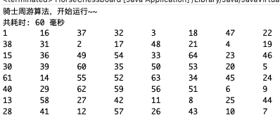

