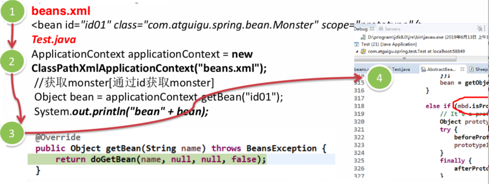

# 1.1 先看几个经典的面试题  

1) 有请使用UML类图画出原型模式核心角色

2) 原型设计模式的深拷贝和浅拷贝是什么，并写出深拷贝的两种方式的源码(重写 clone方法实现深拷贝、使用序列化来实现深拷贝)

3) 在Spring框架中哪里使用到原型模式，并对源码进行分析 

beans.xml
 \<bean id="id01" class="com.atguigu.spring.bean.Monster" scope="==prototype=="/> 

4)  Spring中原型bean的创建，就是原型模式的应用 

5) 代码分析+Debug源码 

# 1.2 设计模式的重要性 

1) 软件工程中，设计模式(design pattern)是对软件设计中普遍存在(反复出现) 的各种问题，所提出的解决方案。这个术语是由埃里希·伽玛(Erich Gamma)等人 在1990年代从建筑设计领域引入到计算机科学的 

2) 大厦VS简易房

3) 拿实际工作经历来说, 当一个项目开发完后，如果客户提出增新功能，怎么办?

4) 如果项目开发完后，原来程序员离职，你接手维护该项目怎么办? (维护性[可读性、 规范性])。

5) 目前程序员门槛越来越高，一线IT公司(大厂)，都会问你在实际项目中使用过什么设计模式，怎样使用的，解决了什么问题。

6) 设计模式在软件中哪里?面向对象(oo)=>功能模块[设计模式+算法(数据结构)]=>框架[使用到多种设计模式]=>架构 [服务器集群]。

7) 如果想成为合格软件工程师，那就花时间来研究下设计模式是非常必要的。

# 1.3  设计模式的目的

编写软件过程中，程序员面临着来自==耦合性，内聚性以及可维护性，可扩展性，重用性，灵活性==等多方面的挑战，设计模式是为了让程序(软件)，具有更好

1) 代码重用性 (即:相同功能的代码，不用多次编写)

2) 可读性 (即:编程规范性,便于其他程序员的阅读和理解)

3) 可扩展性 (即:当需要增加新的功能时，非常的方便，称为可维护)

4) 可靠性 (即:当我们增加新的功能后，对原来的功能没有影响)

5) 使程序呈现高内聚，低耦合的特性

