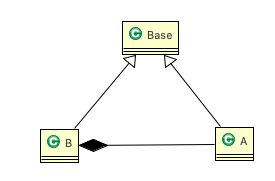
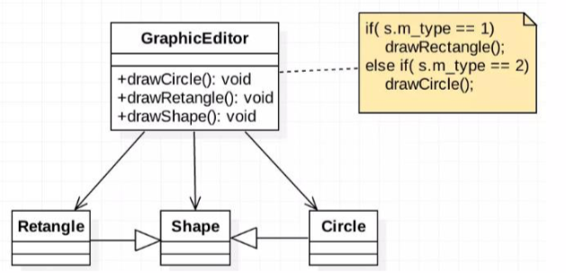
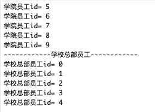
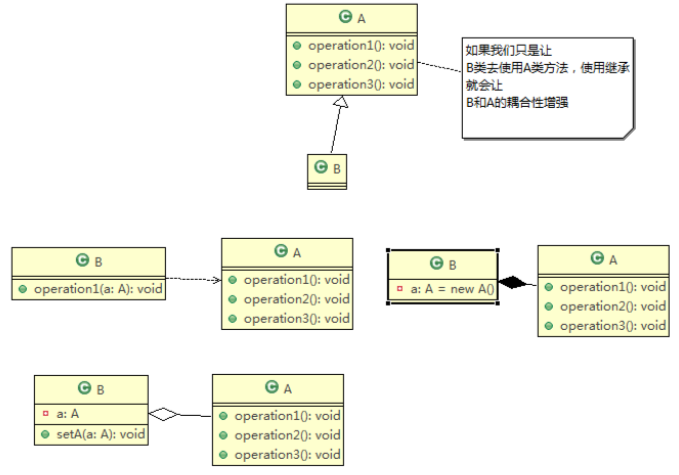

[toc]

# 2.1 设计模式七大原则 

设计模式原则，其实就是==程序员在编程时，应当遵守的原则==，也是各种设计模式的基础(即:==设计模式为什么，这样设计的依据==)

设计模式常用的七大原则有: 

1. 单一职责原则
2. 接口隔离原则
3. 依赖倒转(倒置)原则 
4. 里氏替换原则 
5. 开闭原则
6. 迪米特法则 
7. 合成复用原则 


# 2.2 单一职责原则 

## 2.2.1 基本介绍 

对类来说的，==即一个类应该只负责一项职责==。如类A负责两个不同职责:职责1，职责2。 当职责1需求变更而改变A时，可能造成职责2执行错误，所以需要将类A的粒度分解为 A1，A2 

## 2.2.2 应用实例 

以交通工具案例

1. 方案1 [分析说明] 

```java
package com.atguigu.principle.singleresponsibility;

public class SingleResponsibility1 {

	public static void main(String[] args) {
		// TODO Auto-generated method stub
		Vehicle vehicle = new Vehicle();
		vehicle.run("摩托车");
		vehicle.run("汽车");
		vehicle.run("飞机");
	}

}

// 交通工具类
// 方式1
// 1. 在方式1 的run方法中，违反了单一职责原则
// 2. 解决的方案非常的简单，根据交通工具运行方法不同，分解成不同类即可
class Vehicle {
	public void run(String vehicle) {
		System.out.println(vehicle + " 在公路上运行....");
	}
}
```

2. 方案2 [分析说明] 

```java
package com.atguigu.principle.singleresponsibility;

public class SingleResponsibility2 {

	public static void main(String[] args) {
		// TODO Auto-generated method stub
		RoadVehicle roadVehicle = new RoadVehicle();
		roadVehicle.run("摩托车");
		roadVehicle.run("汽车");
		
		AirVehicle airVehicle = new AirVehicle();
		airVehicle.run("飞机");
	}
}

//方案2的分析
//1. 遵守单一职责原则
//2. 但是这样做的改动很大，即将类分解，同时修改客户端
//3. 改进：直接修改Vehicle 类，改动的代码会比较少=>方案3

class RoadVehicle {
	public void run(String vehicle) {
		System.out.println(vehicle + "公路运行");
	}
}

class AirVehicle {
	public void run(String vehicle) {
		System.out.println(vehicle + "天空运行");
	}
}

class WaterVehicle {
	public void run(String vehicle) {
		System.out.println(vehicle + "水中运行");
	}
}
```

3. 方案3 [分析说明] 

```java
package com.atguigu.principle.singleresponsibility;

public class SingleResponsibility3 {

	public static void main(String[] args) {
		// TODO Auto-generated method stub
		Vehicle2 vehicle2  = new Vehicle2();
		vehicle2.run("汽车");
		vehicle2.runWater("轮船");
		vehicle2.runAir("飞机");
	}

}

//方式3的分析
//1. 这种修改方法没有对原来的类做大的修改，只是增加方法
//2. 这里虽然没有在类这个级别上遵守单一职责原则，但是在方法级别上，仍然是遵守单一职责
class Vehicle2 {
	public void run(String vehicle) {
		//处理
		System.out.println(vehicle + " 在公路上运行....");
	}
	
	public void runAir(String vehicle) {
		System.out.println(vehicle + " 在天空上运行....");
	}
	
	public void runWater(String vehicle) {
		System.out.println(vehicle + " 在水中行....");
	}
	
	//方法2.
	//..
	//..
	
	//...
}
```

## 2.2.3 单一职责原则注意事项和细节 

1. 降低类的复杂度，一个类只负责一项职责。

2. 提高类的可读性，可维护性
3. 降低变更引起的风险
4. 通常情况下，==我们应当遵守单一职责原则==，只有逻辑足够简单，才可以在代码级违反单一职责原则；只有类中方法数量足够少，可以在方法级别保持单一职责原则

 


# 2.3 接口隔离原则(Interface Segregation Principle) 

## 2.3.1 基本介绍 

1. 客户端不应该依赖它不需要的接口，即一个类对另一个类的依赖应该建立在最小的接口上 

2. 先看一张图: 

   

3. 类A通过接口Interface1依赖类B，类C通过接口Interface1依赖类D，如果接口 Interface1对于类A和类C来说不是最小接口， 那么类B和类D必须去实现他们不需要的方法。 

4. 按隔离原则应当这样处理: 

   将==接口 Interface1== 拆分为==独立的几个接口(这里我们拆分成 3 个接口)==，类 A 和类 C 分别与他们需要的接口建立依赖关系。也就是采用接口隔离原则 

## 2.3.2 应用实例

1. 类A通过接口Interface1依赖类B，类C通过接口Interface1依赖类D，请编写代码完成此应用实例。 
2. 没有使用接口隔离原则代码 

```java
package com.atguigu.principle.segregation;

public class Segregation1 {

	public static void main(String[] args) {
		// TODO Auto-generated method stub

	}

}

//接口
interface Interface1 {
	void operation1();
	void operation2();
	void operation3();
	void operation4();
	void operation5();
}

class B implements Interface1 {
	public void operation1() { System.out.println("B 实现了 operation1"); }
	public void operation2() { System.out.println("B 实现了 operation2"); }
	public void operation3() { System.out.println("B 实现了 operation3"); }
	public void operation4() { System.out.println("B 实现了 operation4"); }
	public void operation5() { System.out.println("B 实现了 operation5"); }
}

class D implements Interface1 {
	public void operation1() { System.out.println("D 实现了 operation1"); }
	
	public void operation2() { System.out.println("D 实现了 operation2"); }
	public void operation3() { System.out.println("D 实现了 operation3"); }
	public void operation4() { System.out.println("D 实现了 operation4"); }
	public void operation5() { System.out.println("D 实现了 operation5"); }
}

class A { //A 类通过接口Interface1 依赖(使用) B类，但是只会用到1,2,3方法
	public void depend1(Interface1 i) { i.operation1(); }
	public void depend2(Interface1 i) { i.operation2(); }
	public void depend3(Interface1 i) { i.operation3(); }
}
  
class C { //C 类通过接口Interface1 依赖(使用) D类，但是只会用到1,4,5方法
	public void depend1(Interface1 i) { i.operation1(); }
	public void depend4(Interface1 i) { i.operation4(); }
	public void depend5(Interface1 i) { i.operation5(); }
}
```

## 2.3.3 应传统方法的问题和使用接口隔离原则改进 

1. 类A通过接口Interface1依赖类B，类C通过接口Interface1依赖类D，如果接口Interface1对于类A和类C 

   来说不是最小接口，那么类 B 和类 D 必须去实现他们不需要的方法 

2. 将==接口Interface1拆分为独立的几个接口==，类A和类C分别与他们需要的接口建立依赖关系。也就是采用接口 隔离原则 

3. 接口Interface1中出现的方法，根据实际情况拆分为三个接口 


4. 代码实现 

```java
package com.atguigu.principle.segregation.improve;

public class Segregation1 {

	public static void main(String[] args) {
		// TODO Auto-generated method stub
		// 使用一把
		A a = new A();
		a.depend1(new B()); // A类通过接口去依赖B类
		a.depend2(new B());
		a.depend3(new B());

		C c = new C();

		c.depend1(new D()); // C类通过接口去依赖(使用)D类
		c.depend4(new D());
		c.depend5(new D());
	}
}

// 接口1
interface Interface1 {
	void operation1();
}

// 接口2
interface Interface2 {
	void operation2();
	void operation3();
}

// 接口3
interface Interface3 {
	void operation4();
	void operation5();
}

class B implements Interface1, Interface2 {
	public void operation1() { System.out.println("B 实现了 operation1"); }
	public void operation2() { System.out.println("B 实现了 operation2"); }
	public void operation3() { System.out.println("B 实现了 operation3"); }
}

class D implements Interface1, Interface3 {
	public void operation1() { System.out.println("D 实现了 operation1"); }
	public void operation4() { System.out.println("D 实现了 operation4"); }
	public void operation5() { System.out.println("D 实现了 operation5"); }
}

class A { // A 类通过接口Interface1,Interface2 依赖(使用) B类，但是只会用到1,2,3方法
	public void depend1(Interface1 i) { i.operation1(); }
	public void depend2(Interface2 i) { i.operation2(); }
	public void depend3(Interface2 i) { i.operation3(); }
}

class C { // C 类通过接口Interface1,Interface3 依赖(使用) D类，但是只会用到1,4,5方法
	public void depend1(Interface1 i) { i.operation1(); }
	public void depend4(Interface3 i) { i.operation4(); }
	public void depend5(Interface3 i) { i.operation5(); }
}
```


# 2.4 依赖倒转原则(Dependence Inversion Principle )

## 2.4.1 基本介绍 

1. 高层模块不应该依赖低层模块，二者都应该依赖其抽象。
2. ==抽象不应该依赖细节，细节应该依赖抽象==。
3. 依赖倒转(倒置)的中心思想是==面向接口编程==。
4. 依赖倒转原则是基于这样的设计理念:相对于细节的多变性，抽象的东西要稳定的多。以抽象为基础搭建的架 构比以细节为基础的架构要稳定的多。在 java 中，抽象指的是接口或抽象类，细节就是具体的实现类。
5. 使用==接口或抽象类==的目的是制定好==规范==，而不涉及任何具体的操作，把==展现细节的任务交给他们的实现类==去完 成  

## 2.4.2 应用实例

请编程完成 Person 接收消息的功能。 

1. 实现方案1+分析说明 

```java
package com.atguigu.principle.inversion;

public class DependecyInversion {

	public static void main(String[] args) {
		Person person = new Person();
		person.receive(new Email());
	}

}

class Email {
	public String getInfo() { return "电子邮件信息: hello,world"; }
}

//完成Person接收消息的功能
//方式1分析
//1. 简单，比较容易想到
//2. 如果我们获取的对象是 微信，短信等等，则新增类，同时Perons也要增加相应的接收方法
//3. 解决思路：引入一个抽象的接口IReceiver, 表示接收者, 这样Person类与接口IReceiver发生依赖
//   因为Email, WeiXin 等等属于接收的范围，他们各自实现IReceiver接口就ok, 这样我们就符号依赖倒转原则
class Person {
	public void receive(Email email ) {
		System.out.println(email.getInfo());
	}
}
```

2. 实现方案2(依赖倒转)+分析说明 

```java
package com.atguigu.principle.inversion.improve;

public class DependecyInversion {

	public static void main(String[] args) {
		//客户端无需改变
		Person person = new Person();
		person.receive(new Email());
		
		person.receive(new WeiXin());
	}

}

//定义接口
interface IReceiver { public String getInfo();}

class Email implements IReceiver {
	public String getInfo() { return "电子邮件信息: hello,world"; }
}

//增加微信
class WeiXin implements IReceiver {
	public String getInfo() { return "微信信息: hello,ok"; }
}

//方式2
class Person {
	//这里我们是对接口的依赖
	public void receive(IReceiver receiver ) {
		System.out.println(receiver.getInfo());
	}
}
```

## 2.4.3 依赖关系传递的三种方式和应用案例 

1. 接口传递 

```java
package com.atguigu.principle.inversion.improve;

public class DependencyPass {

    public static void main(String[] args) {
        ChangHong changHong = new ChangHong();
        OpenAndClose openAndClose = new OpenAndClose();
        openAndClose.open(changHong);
    }
}

// 方式1： 通过接口传递实现依赖
// 开关的接口
interface IOpenAndClose {
    public void open(ITV tv); //抽象方法,接收接口
}

interface ITV { //ITV接口
    public void play();
}

class ChangHong implements ITV {
    @Override
    public void play() {
        System.out.println("长虹电视机，打开");
    }
}

// 实现接口
class OpenAndClose implements IOpenAndClose {
    public void open(ITV tv) {
        tv.play();
    }
}
```

2. 构造方法传递 

```java
package com.atguigu.principle.inversion.improve;

public class DependencyPass {

    public static void main(String[] args) {
        ChangHong changHong = new ChangHong();
        //通过构造器进行依赖传递
        OpenAndClose openAndClose = new OpenAndClose(changHong);
        openAndClose.open();
    }
}

// 方式2: 通过构造方法依赖传递
interface IOpenAndClose {
    public void open(); //抽象方法
}

interface ITV { //ITV接口
    public void play();
}

class ChangHong implements ITV {
    @Override
    public void play() {
        System.out.println("长虹电视机，打开");
    }
}

class OpenAndClose implements IOpenAndClose {
    public ITV tv; //成员

    public OpenAndClose(ITV tv) { //构造器
        this.tv = tv;
    }

    public void open() {
        this.tv.play();
    }
}

```

3. setter方式传递 

```java
package com.atguigu.principle.inversion.improve;

public class DependencyPass {

    public static void main(String[] args) {
        ChangHong changHong = new ChangHong();
        //通过setter方法进行依赖传递
        OpenAndClose openAndClose = new OpenAndClose();
        openAndClose.setTv(changHong);
        openAndClose.open();
    }
}

// 方式3 , 通过setter方法传递
interface IOpenAndClose {
    public void open(); // 抽象方法

    public void setTv(ITV tv);
}

interface ITV { // ITV接口
    public void play();
}

class ChangHong implements ITV {
    @Override
    public void play() {
        System.out.println("长虹电视机，打开");
    }
}

class OpenAndClose implements IOpenAndClose {
    private ITV tv;

    public void setTv(ITV tv) {
        this.tv = tv;
    }

    public void open() {
        this.tv.play();
    }
}
```

## 2.4.4 依赖倒转原则的注意事项和细节

1. 低层模块尽量都要有抽象类或接口，或者两者都有，程序稳定性更好。
2. 变量的声明类型尽量是抽象类或接口，这样我们的变量引用和实际对象间，就存在一个缓冲层，利于程序扩展和优化。
3. 继承时遵循里氏替换原则。


# 2.5 里氏替换原则(Liskov Substitution Principle)

## 2.5.1 OO中的继承性的思考和说明 

1. 继承包含这样一层含义:父类中凡是已经实现好的方法，实际上是在设定规范和契约，虽然它不强制要求所有 的子类必须遵循这些契约，但是如果子类对这些已经实现的方法任意修改，就会对整个继承体系造成破坏。 
2. ==继承在给程序设计带来便利的同时，也带来了弊端==。比如使用继承会给程序带来==侵入性==，程序的可移植性降低， 增加对象间的耦合性，如果一个类被其他的类所继承，则当这个类需要修改时，必须考虑到所有的子类，并且父类修改后，所有涉及到子类的功能都有可能产生故障。
3. 问题提出:==在编程中，如何正确的使用继承?== => ==里氏替换原则== 

## 2.5.2 基本介绍

1. 里氏替换原则(Liskov Substitution Principle)在1988年，由麻省理工学院的以为姓里的女士提出的。 
2. 如果对每个类型为T1的对象o1，都有类型为T2的对象o2，使得以T1定义的所有程序P在所有的对象o1都代换成o2时，程序P的行为没有发生变化，那么类型T2是类型T1 的子类型。==换句话说，所有引用基类的地方必须能透明地使用其子类的对象==。 
3. 在使用继承时，遵循里氏替换原则，==在子类中尽量不要重写父类的方法==。
4. 里氏替换原则告诉我们，继承实际上让两个类耦合性增强了，==在适当的情况下，可以通过聚合，组合，依赖 来解决问题==。  

## 2.5.3 一个程序引出的问题和思考 

该看个程序, 思考下问题和解决思路 

```java
package com.atguigu.principle.liskov;

public class Liskov {

	public static void main(String[] args) {
		A a = new A();
		System.out.println("11-3=" + a.func1(11, 3));//11-3=8
		System.out.println("1-8=" + a.func1(1, 8));//1-8=-7

		System.out.println("-----------------------");
		B b = new B();
		System.out.println("11-3=" + b.func1(11, 3));//11-3=14//这里本意是求出11-3
		System.out.println("1-8=" + b.func1(1, 8));//1-8=9
		System.out.println("11+3+9=" + b.func2(11, 3));//11+3+9=23
	}

}

// A类
class A {
	// 返回两个数的差
	public int func1(int num1, int num2) { return num1 - num2; }
}

// B类继承了A
// 增加了一个新功能：完成两个数相加,然后和9求和
class B extends A {
	//这里，重写了A类的方法, 可能是无意识
	public int func1(int a, int b) { return a + b; }

	public int func2(int a, int b) { return func1(a, b) + 9; }
}
```

## 2.5.4 解决方法

1. 我们发现原来运行正常的相减功能发生了错误。原因就是类B无意中重写了父类的 方法，造成原有功能出现错误。在实际编程中，我们常常会通过重写父类的方法完成新的功能，这样写起来虽然简单，但整个继承体系的复用性会比较差。特别是运行多态比较频繁的时候。

2. 通用的做法是:==原来的父类和子类都继承一个更通俗的基类==，原有的继承关系去掉， ==采用依赖，聚合，组合等关系代替==。
3. 改进方案 



代码实现 

```java
package com.atguigu.principle.liskov.improve;

public class Liskov {

	public static void main(String[] args) {
		A a = new A();
		System.out.println("11-3=" + a.func1(11, 3));//11-3=8
		System.out.println("1-8=" + a.func1(1, 8));//1-8=-7

		System.out.println("-----------------------");
		B b = new B();
		//因为B类不再继承A类，因此调用者，不会再func1是求减法
		//调用完成的功能就会很明确
		System.out.println("11+3=" + b.func1(11, 3));//11+3=14//这里本意是求出11+3
		System.out.println("1+8=" + b.func1(1, 8));//1+8=9
		System.out.println("11+3+9=" + b.func2(11, 3));//11+3+9=23
		
		//使用组合仍然可以使用到A类相关方法
		System.out.println("11-3=" + b.func3(11, 3));//11-3=8//这里本意是求出11-3
	}
}

//创建一个更加基础的基类
class Base {
	//把更加基础的方法和成员写到Base类
}

// A类
class A extends Base {
	// 返回两个数的差
	public int func1(int num1, int num2) { return num1 - num2; }
}

// B类继承了A
// 增加了一个新功能：完成两个数相加,然后和9求和
class B extends Base {
	//如果B需要使用A类的方法,使用组合关系
	private A a = new A();
	
	//这里，重写了A类的方法, 可能是无意识
	public int func1(int a, int b) { return a + b; }

	public int func2(int a, int b) { return func1(a, b) + 9; }
	
	//我们仍然想使用A的方法
	public int func3(int a, int b) { return this.a.func1(a, b); }
}
```


# 2.6 开闭原则(OpenClosedPrinciple) 

## 2.6.1 基本介绍 

1. 开闭原则(OpenClosedPrinciple)是编程中==最基础、最重要==的设计原则

2. 一个软件实体如类，模块和函数应该==对扩展开放(对提供方)，对修改关闭(对使用方)==。用抽象构建框架，用实现扩展细节。
3.  当软件需要变化时，尽量==通过扩展==软件实体的行为来实现变化，而==不是通过修改==已有的代码来实现变化。
4. 编程中遵循其它原则，以及使用设计模式的目的就是==遵循开闭原则==。 

## 2.6.2 看下面一段代码 

1. 类图设计，如下: 



2. 代码演示

```java
package com.atguigu.principle.ocp;

public class Ocp {

	public static void main(String[] args) {
		//使用看看存在的问题
		GraphicEditor graphicEditor = new GraphicEditor();
		graphicEditor.drawShape(new Rectangle());
		graphicEditor.drawShape(new Circle());
		graphicEditor.drawShape(new Triangle());//新增的画三角形
	}
}

//这是一个用于绘图的类 [使用方]
class GraphicEditor {
	//接收Shape对象，然后根据type，来绘制不同的图形
	public void drawShape(Shape s) {
		if (s.m_type == 1)
			drawRectangle(s);
		else if (s.m_type == 2)
			drawCircle(s);
		else if (s.m_type == 3) //新增类型增加的代码
			drawTriangle(s);
	}

	//绘制矩形
	public void drawRectangle(Shape r) { System.out.println(" 绘制矩形 "); }
	//绘制圆形
	public void drawCircle(Shape r) { System.out.println(" 绘制圆形 "); }
	//新增绘制三角形
	public void drawTriangle(Shape r) {//新增类型增加的代码
		System.out.println(" 绘制三角形 ");
	}
}

//Shape类，基类
class Shape {
	int m_type;
}

class Rectangle extends Shape {
	Rectangle() { super.m_type = 1; }
}

class Circle extends Shape {
	Circle() { super.m_type = 2; }
}

//新增画三角形
class Triangle extends Shape {
	Triangle() { super.m_type = 3; }
}
```

## 2.6.3 方式 1 的优缺点 

1. 优点是比较好理解，简单易操作。
2. 缺点是违反了设计模式的ocp原则，即==对扩展开放(提供方)，对修改关闭(使用方)==。即当我们给类增加新功能的时候，尽量不修改代码，或者尽可能少修改代码。
3. 比如我们这时要新增加一个图形种类三角形，我们需要做如上修改，修改的地方较多。


## 2.6.4 改进的思路分析 

思路:把创建 ==Shape 类做成抽象类==，并提供一个==抽象的 draw 方法==，让==子类去实现即可==，这样我们有新的图形种类时，只需要让新的图形类继承 Shape，并实现 draw 方法即可，==使用方的代码就不需要修== -> 满足了开闭原则。

```java
package com.atguigu.principle.ocp.improve;

public class Ocp {

	public static void main(String[] args) {
		GraphicEditor graphicEditor = new GraphicEditor();
		graphicEditor.drawShape(new Rectangle());
		graphicEditor.drawShape(new Circle());
		graphicEditor.drawShape(new OtherGraphic());
	}
}

//这是一个用于绘图的类 [使用方]
class GraphicEditor {
	//接收Shape对象，调用draw方法
	public void drawShape(Shape s) { s.draw(); }
}

//Shape类，基类
abstract class Shape {
	int m_type;
	public abstract void draw();//抽象方法
}

class Rectangle extends Shape {
	Rectangle() { super.m_type = 1; }
	@Override
	public void draw() { System.out.println(" 绘制矩形 "); }
}

class Circle extends Shape {
	Circle() { super.m_type = 2; }
	@Override
	public void draw() { System.out.println(" 绘制圆形 "); }
}

//新增一个图形
class OtherGraphic extends Shape {
	OtherGraphic() { super.m_type = 4; }
	@Override
	public void draw() { System.out.println(" 绘制其它图形 ");}
}
```


# 2.7 迪米特法则(DemeterPrinciple)  

## 2.7.1 基本介绍 

1. 一个对象应该对其他对象保持最少的了解。
2. 类与类关系越密切，耦合度越大。
3. 迪米特法则(DemeterPrinciple)又叫==最少知道原则==，即==一个类对自己依赖的类知道的越少越好==。也就是说，对于被依赖的类不管多么复杂，都尽量将逻辑封装在类的内部。对外除了提供的 public 方法，不对外泄露任何信息。
4. 迪米特法则还有个更简单的定义:只与直接的朋友通信
5. ==直接的朋友==:每个对象都会与其他对象有==耦合关系==，只要两个对象之间有耦合关系，我们就说这两个对象之间 是朋友关系。耦合的方式很多，依赖，关联，组合，聚合等。其中，我们称出现==成员变量，方法参数，方法返 回值==中的类为直接的朋友，而出现在==局部变量中的类不是直接的朋友==。也就是说，陌生的类最好不要以局部变 量的形式出现在类的内部。 

## 2.7.2 应用实例 

1. 有一个学校，下属有各个学院和总部，现要求打印出学校总部员工ID和学院员工的id 
2. 编程实现上面的功能, 看代码演示



```java
package com.atguigu.principle.demeter;

import java.util.ArrayList;
import java.util.List;

//客户端
public class Demeter1 {

	public static void main(String[] args) {
		//创建了一个 SchoolManager 对象
		SchoolManager schoolManager = new SchoolManager();
		//输出学院的员工id 和  学校总部的员工信息
		schoolManager.printAllEmployee(new CollegeManager());
	}
}

//学校总部员工类
class Employee {
	private String id;
	public void setId(String id) { this.id = id; }
	public String getId() { return id; }
}

//学院的员工类
class CollegeEmployee {
	private String id;
	public void setId(String id) { this.id = id; }
	public String getId() { return id; }
}


//管理学院员工的管理类
class CollegeManager {
	//返回学院的所有员工
	public List<CollegeEmployee> getAllEmployee() {
		List<CollegeEmployee> list = new ArrayList<CollegeEmployee>();
		for (int i = 0; i < 10; i++) { //这里我们增加了10个员工到 list
			CollegeEmployee emp = new CollegeEmployee();
			emp.setId("学院员工id= " + i);
			list.add(emp);
		}
		return list;
	}
}

//学校管理类

//分析 SchoolManager 类的直接朋友类有哪些 Employee、CollegeManager
//CollegeEmployee 不是 直接朋友 而是一个陌生类，这样违背了 迪米特法则 
class SchoolManager {
	//返回学校总部的员工
	public List<Employee> getAllEmployee() {
		List<Employee> list = new ArrayList<Employee>();
		
		for (int i = 0; i < 5; i++) { //这里我们增加了5个员工到 list
			Employee emp = new Employee();
			emp.setId("学校总部员工id= " + i);
			list.add(emp);
		}
		return list;
	}

	//该方法完成输出学校总部和学院员工信息(id)
	void printAllEmployee(CollegeManager sub) {
		
		//分析问题
		//1. 这里的 CollegeEmployee 不是  SchoolManager的直接朋友
		//2. CollegeEmployee 是以局部变量方式出现在 SchoolManager
		//3. 违反了 迪米特法则 
		
		//获取到学院员工
		List<CollegeEmployee> list1 = sub.getAllEmployee();
		System.out.println("------------学院员工------------");
		for (CollegeEmployee e : list1) {
			System.out.println(e.getId());
		}
		//获取到学校总部员工
		List<Employee> list2 = this.getAllEmployee();
		System.out.println("------------学校总部员工------------");
		for (Employee e : list2) {
			System.out.println(e.getId());
		}
	}
}
```

## 2.7.3 应用实例改进 

1. 前面设计的问题在于SchoolManager中，**CollegeEmployee**类并不是**SchoolManager**类的直接朋友(分析) 
2. 按照迪米特法则，应该避免类中出现这样非直接朋友关系的耦合。
3. 对代码按照迪米特法则进行改进。


```java
package com.atguigu.principle.demeter.improve;

import java.util.ArrayList;
import java.util.List;

//客户端
public class Demeter1 {

	public static void main(String[] args) {
		System.out.println("~~~使用迪米特法则的改进~~~");
		//创建了一个 SchoolManager 对象
		SchoolManager schoolManager = new SchoolManager();
		//输出学院的员工id 和  学校总部的员工信息
		schoolManager.printAllEmployee(new CollegeManager());
	}
}

//学校总部员工类
class Employee {
	private String id;
	public void setId(String id) { this.id = id; }
	public String getId() { return id; }
}

//学院的员工类
class CollegeEmployee {
	private String id;
	public void setId(String id) { this.id = id; }
	public String getId() { return id; }
}

//管理学院员工的管理类
class CollegeManager {
	//返回学院的所有员工
	public List<CollegeEmployee> getAllEmployee() {
		List<CollegeEmployee> list = new ArrayList<CollegeEmployee>();
		for (int i = 0; i < 10; i++) { //这里我们增加了10个员工到 list
			CollegeEmployee emp = new CollegeEmployee();
			emp.setId("学院员工id= " + i);
			list.add(emp);
		}
		return list;
	}
	
	//输出学院员工的信息
	public void printEmployee() {
		//获取到学院员工
		List<CollegeEmployee> list1 = getAllEmployee();
		System.out.println("------------学院员工------------");
		for (CollegeEmployee e : list1) {
			System.out.println(e.getId());
		}
	}
}

//学校管理类
class SchoolManager {
	//返回学校总部的员工
	public List<Employee> getAllEmployee() {
		List<Employee> list = new ArrayList<Employee>();
		
		for (int i = 0; i < 5; i++) { //这里我们增加了5个员工到 list
			Employee emp = new Employee();
			emp.setId("学校总部员工id= " + i);
			list.add(emp);
		}
		return list;
	}

	//该方法完成输出学校总部和学院员工信息(id)
	void printAllEmployee(CollegeManager sub) {
		
		//分析问题
		//1. 将输出学院的员工方法，封装到CollegeManager
		sub.printEmployee();
	
		//获取到学校总部员工
		List<Employee> list2 = this.getAllEmployee();
		System.out.println("------------学校总部员工------------");
		for (Employee e : list2) {
			System.out.println(e.getId());
		}
	}
}
```

## 2.7.4 迪米特法则注意事项和细节 

1. 迪米特法则的核心是==降低类之间的耦合==。

2. 但是注意:由于每个类都减少了不必要的依赖，因此迪米特法则只是要求降低类间(对象间)耦合关系，并不是 

   要求完全没有依赖关系 


# 2.8 合成复用原则(Composite Reuse Principle) 

## 2.8.1 基本介绍 

原则是尽量使用合成/聚合的方式，而不是使用继承 



# 2.9 设计原则核心思想

1. 找出应用中可能需要变化之处，把它们独立出来，不要和那些不需要变化的代码混在一起。 
2. 针对接口编程，而不是针对实现编程。
3. 为了交互对象之间的==松耦合设计==而努力 

