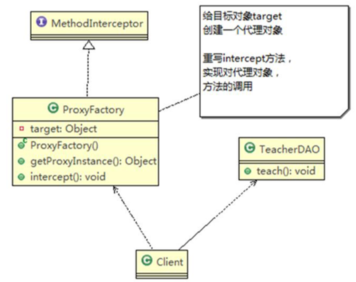
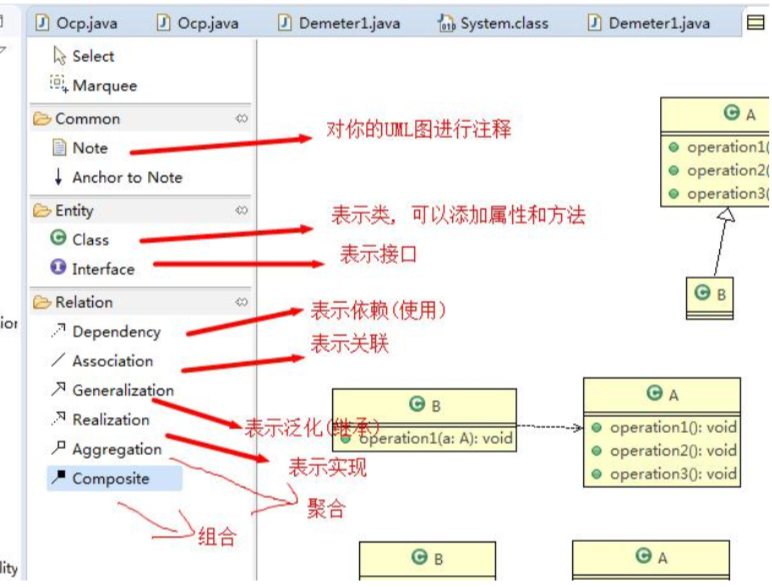
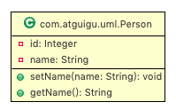
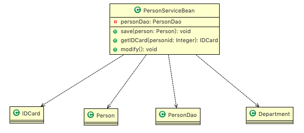
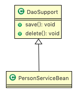
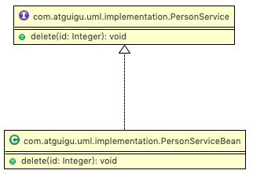
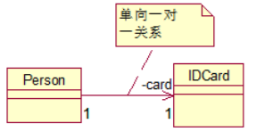
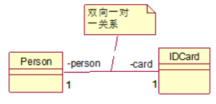
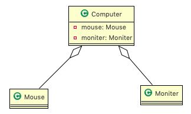
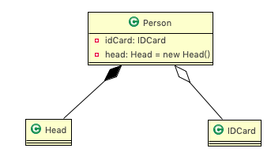

# 3.1 基本介绍 

1. UML——Unified modeling language UML (统一建模语言)，是一种用于软件系统分析和设计的语言工具，它用 于帮助软件开发人员进行思考和记录思路的结果。
2. UML 本身是一套符号的规定，就像数学符号和化学符号一样，这些符号用于描述软件模型中的各个元素和他 们之间的关系，比如类、接口、实现、泛化、依赖、组合、聚合等，如下图: 





3. 使用UML来建模，常用的工具有 Rational Rose , 也可以使用一些插件来建模。


# 3.2 UML 图

画 UML 图与写文章差不多，都是把自己的思想描述给别人看，关键在于思路和条理，UML 图分类: 

1. 用例图(usecase)
2. 静态结构图:==类图==、对象图、包图、组件图、部署图
3. 动态行为图:交互图(时序图与协作图)、状态图、活动图 

说明：

1. 类图是描述类与类之间的关系的，是UML图中最核心的 

# 3.3 UML 类图 

1. 用于描述系统中的==类**(**对象**)**本身的组成和类**(**对象**)**之间的各种静态关系==。 

2. 类之间的关系:==依赖、泛化(继承)、实现、关联、聚合与组合==。


3. 类图简单举例

```java
package com.atguigu.uml;

public class Person{ //代码形式->类图
	private Integer id;
	private String name;
	public void setName(String name){
		this.name=name;
	}
	public String getName(){
		return  name;
	}
}
```



# 3.4 类图—依赖关系(Dependence) 

只要是在==类中用到了对方，那么他们之间就存在依赖关系==。如果没有对方，连编绎都通过不了。 

```java
package com.atguigu.uml.dependence;
public class PersonServiceBean {
	private PersonDao personDao;// 类
	public void save(Person person) {}
	public IDCard getIDCard(Integer personid) { return null; }
	public void modify() { Department department = new Department(); }
}
```

```java
package com.atguigu.uml.dependence;
public class PersonDao {}
```

```java
package com.atguigu.uml.dependence;
public class IDCard {}
```

```java
package com.atguigu.uml.dependence;
public class Person {}
```

```java
package com.atguigu.uml.dependence;
public class Department {}
```

对应的类图：



小结：

1. 类中用到了对方
2. 如果是类的成员属性 
3. 如果是方法的返回类型 
4. 是方法接收的参数类型 
5. 方法中使用到 

# 3.5 类图—泛化关系(generalization) 

==泛化关系实际上就是继承关系==，他是==依赖关系==的特例 

```java
package com.atguigu.uml.generalization;
public abstract class DaoSupport{
	public void save(Object entity){}
	public void delete(Object id){}
}
```

```java
package com.atguigu.uml.generalization;
public class PersonServiceBean extends DaoSupport {}
```

对应的类图：



小结：

1. 泛化关系实际上就是继承关系
2. 如果A类继承了B类，我们就说A和B存在泛化关系 

# 3.6 类图—实现关系(Implementation) 

==实现关系实际上就是 **A** 类实现 **B** 接口==，他是==依赖关系==的特例 

```java
package com.atguigu.uml.implementation;
public interface PersonService {
	public void delete(Integer id);
}
```

```java
package com.atguigu.uml.implementation;
public class PersonServiceBean implements PersonService{
	@Override
	public void delete(Integer id) {
		System.out.println("delete..");
	}
}
```

对应的类图：



# 3.7 类图—关联关系(Association) 

==关联关系实际上就是类与类之间的联系==，他是==依赖关系==的特例 

关联具有导航性:即双向关系或单向关系 

关系具有多重性:如"1"(表示有且仅有一个)，"0..."(表示0个或者多个)， "0，1"(表示0个或者一个)，"n...m"(表示n到 m个都可以),"m...*"(表示至少m 个)。 

单向一对一关系 

```java
public class Person { private IDCard card;}
public class IDCard{}
```



双向一对一关系 

```java
public class Person { private IDCard card; }
public class IDCard{ private Person person; }
```



# 3.8 类图—聚合关系(Aggregation) 

聚合关系(Aggregation)表示的是==整体和部分的关系，整体与部分可以分开==。聚合关系是==关联关系==的特例，所以他具有关联的==导航性与多重性==。

```java
package com.atguigu.uml.aggregation;

public class Computer {
	private Mouse mouse; //鼠标可以和computer分离
	private Moniter moniter;//显示器可以和Computer分离
	public void setMouse(Mouse mouse) {
		this.mouse = mouse;
	}
	public void setMoniter(Moniter moniter) {
		this.moniter = moniter;
	}
}
```

```java
package com.atguigu.uml.aggregation;
public class Moniter {}
```

```java
package com.atguigu.uml.aggregation;
public class Mouse {}
```

对应的类图：



# 3.9 类图—组合关系(Composition) 

组合关系:也是整体与部分的关系，但==是整体与部分不可以分开==。

再看一个案例:在程序中我们定义实体:Person 与 IDCard、Head, 那么 Head 和 Person 就是组合，IDCard 和 Person 就是聚合。 

但是如果在程序中 Person 实体中定义了对 IDCard 进行级联删除，即删除 Person 时连同 IDCard 一起删除，那 么 IDCard 和 Person 就是组合了。

```java
package com.atguigu.uml.composition;

public class Person {
    private IDCard card; //聚合关系
    private Head head = new Head(); //组合关系
}
```

```java
package com.atguigu.uml.composition;
public class IDCard {}
```

```java
package com.atguigu.uml.composition;
public class Head {}
```

对应的类图：



