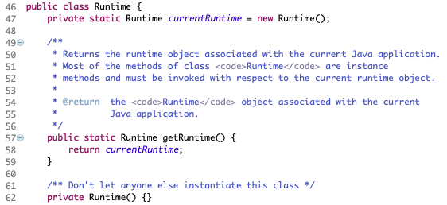

# 5.1 单例设计模式介绍 

所谓类的单例设计模式，就是采取一定的方法保证在整个的软件系统中，对某个类==只能存在一个对象实例==，并且该类只提供一个取得其对象实例的方法(静态方法)。 

比如 Hibernate 的 SessionFactory，它充当数据存储源的代理，并负责创建 Session 对象。SessionFactory 并不是轻量级的，一般情况下，一个项目通常只需要一个 SessionFactory 就够，这是就会使用到单例模式。 

# 5.2 单例设计模式八种方式 

1. ==饿汉式(静态常量)==
2. ==饿汉式(静态代码块)==
3. 懒汉式(线程不安全)
4. 懒汉式(线程安全，同步方法)
5. 懒汉式(线程安全，同步代码块)
6. ==双重检查==
7. ==静态内部类==
8. ==枚举== 

# 5.3 饿汉式(静态常量) 

## 5.3.1 使用步骤

1. 构造器私有化 (防止 new )
2. 类的内部创建对象
3. 向外暴露一个静态的公共方法。getInstance 

## 5.3.2 代码实现

```java
package com.atguigu.singleton.type1;

public class SingletonTest01 {

	public static void main(String[] args) {
		//测试
		Singleton instance = Singleton.getInstance();
		Singleton instance2 = Singleton.getInstance();
		System.out.println(instance == instance2); // true
		System.out.println("instance.hashCode=" + instance.hashCode());//instance.hashCode=865113938
		System.out.println("instance2.hashCode=" + instance2.hashCode());//instance2.hashCode=865113938
	}

}

//饿汉式(静态变量)
class Singleton {
	//1. 构造器私有化, 外部能new
	private Singleton() {}
	//2.本类内部创建对象实例
	private final static Singleton instance = new Singleton();
	//3. 提供一个公有的静态方法，返回实例对象
	public static Singleton getInstance() {
		return instance;
	}
	
}
```

## 5.3.3 优缺点

1. 优点:这种写法比较简单，就是在类装载的时候就完成实例化。避免了线程同步问题。

2. 缺点:在类装载的时候就完成实例化，没有达到Lazy Loading的效果。如果从始至终从未使用过这个实例，则会造成内存的浪费。

3. 这种方式基于classloder机制避免了多线程的同步问题，不过，instance在类装载时就实例化，在单例模式中大多数都是调用getInstance方法， 但是导致类装载的原因有很多种，因此不能确定有其他的方式(或者其他的静态方法)导致类装载，这时候初始化instance就没有达到lazy loading的效果。

4. 结论:这种单例模式==可用==，==可能==造成内存浪费  

   

# 5.4 饿汉式(静态代码块) 

## 5.4.1 使用步骤

1. 构造器私有化 (防止 new )
2. 类的内部创建对象，静态代码块中初始化
3. 向外暴露一个静态的公共方法。getInstance 

## 5.4.2 代码实现

```java
package com.atguigu.singleton.type2;
//饿汉式(静态变量)
class Singleton {
	//1. 构造器私有化, 外部能new
	private Singleton() {}
	//2.本类内部创建对象实例
	private  static Singleton instance;
	static { // 在静态代码块中，创建单例对象
		instance = new Singleton();
	}
	//3. 提供一个公有的静态方法，返回实例对象
	public static Singleton getInstance() {
		return instance;
	}
}
```

## 5.4.3 优缺点 

1. 这种方式和上面的方式其实类似，只不过将类实例化的过程放在了静态代码块中，也是在类装载的时候，就执 行静态代码块中的代码，初始化类的实例。优缺点和上面是一样的。 
2. 结论:这种单例模式==可用==，但是==可能==造成内存浪费 


# 5.5 懒汉式(线程不安全) 

## 5.5.1 代码实现

```java
package com.atguigu.singleton.type3;
class Singleton {
	private static Singleton instance;
	private Singleton() {}
	//提供一个静态的公有方法，当使用到该方法时，才去创建 instance
	//即懒汉式
	public static Singleton getInstance() {
		if(instance == null) {
			instance = new Singleton();
		}
		return instance;
	}
}
```

## 5.5.2 优缺点

1. 起到了Lazy Loading的效果，但是只能在单线程下使用。 
2. 如果在多线程下，一个线程进入了if (singleton == null)判断语句块，还未来得及往下执行，另一个线程也通过了这个判断语句，这时便会产生多个实例。所以在多线程环境下不可使用这种方式。
3. 结论:在实际开发中，==不要使用==这种方式。


# 5.6 懒汉式(线程安全，同步方法) 

## 5.6.1 代码实现

```java
package com.atguigu.singleton.type4;
// 懒汉式(线程安全，同步方法)
class Singleton {
	private static Singleton instance;
	private Singleton() {}
	//提供一个静态的公有方法，加入同步处理的代码，解决线程安全问题
	//即懒汉式
	public static synchronized Singleton getInstance() {
		if(instance == null) {
			instance = new Singleton();
		}
		return instance;
	}
}
```

## 5.6.2 优缺点

1. 解决了线程不安全问题
2. 效率太低了，每个线程在想获得类的实例时候，执行getInstance()方法都要进行同步。而其实这个方法只执行一次实例化代码就够了，后面的想获得该类实例，直接return就行了。方法进行同步效率太低。
3. 结论:在实际开发中，==不推荐使用==这种方式。


# 5.7 懒汉式(线程安全，同步代码块) 

## 5.7.1 代码实现

```java
// 懒汉式(线程安全，同步代码块) 
class Singleton {
	private static Singleton instance;
	private Singleton() {}
	//提供一个静态的公有方法，加入同步处理的代码，解决线程安全问题
	//即懒汉式
	public static Singleton getInstance() {
		if(instance == null) {
			synchronized(Singleton.class){
				instance = new Singleton();
			}
		}
		return instance;
	}
}
```

## 5.7.2 优缺点

1. 这种方式，本意是想对第四种实现方式的改进，因为前面同步方法效率太低， 改为同步产生实例化的的代码块。
2. ==但是这种同步并不能起到线程同步的作用==。跟第3种实现方式遇到的情形一致，假如一个线程进入了if (singleton == null)判断语句块，还未来得及往下执行， 另一个线程也通过了这个判断语句，这时便会产生多个实例。
3. 结论:在==实际开发中，不能使用==这种方式 


# 5.8 双重检查 

## 5.8.1 代码实现

```java
package com.atguigu.singleton.type6;
// 懒汉式(线程安全，双重检查)
class Singleton {
	private static volatile Singleton instance;
	private Singleton() {}
	//提供一个静态的公有方法，加入双重检查代码，解决线程安全问题, 同时解决懒加载问题
	//同时保证了效率, 推荐使用
	public static synchronized Singleton getInstance() {
		if(instance == null) {
			synchronized (Singleton.class) {
				if(instance == null) {
					instance = new Singleton();
				}
			}
		}
		return instance;
	}
}
```

## 5.8.2 优缺点

1. Double-Check概念是多线程开发中常使用到的，如代码中所示，我们进行了两次`if (singleton == null)`检查，这样就可以保证线程安全了。 
2. 这样，实例化代码只用执行一次，后面再次访问时，判断`if (singleton == null)`， 直接return实例化对象，也避免的反复进行方法同步。
3. 线程安全、延迟加载、效率较高 
4. 结论:在实际开发中，==推荐使用==这种单例设计模式 


# 5.9 静态内部类 

## 5.9.1 代码实现

```java
package com.atguigu.singleton.type7;
// 静态内部类完成， 推荐使用
class Singleton {
	private static volatile Singleton instance;
	
	//构造器私有化
	private Singleton() {}
	
	//写一个静态内部类,该类中有一个静态属性 Singleton
	private static class SingletonInstance {
		private static final Singleton INSTANCE = new Singleton(); 
	}
	
	//提供一个静态的公有方法，直接返回SingletonInstance.INSTANCE
	public static synchronized Singleton getInstance() {
		return SingletonInstance.INSTANCE;
	}
}
```

## 5.9.2 优缺点

1. 这种方式采用了类装载的机制来保证初始化实例时只有一个线程。 
2. 静态内部类方式在Singleton类被装载时并不会立即实例化，而是在需要实例化时，调用getInstance方法，才会装载SingletonInstance类，从而完成Singleton的实例化。 
3. 类的静态属性只会在第一次加载类的时候初始化，所以在这里，JVM帮助我们保证了线程的安全性，在类进行初始化时，别的线程是无法进入的。
4. 优点:==避免了线程不安全==，利用静态内部类特点实现延迟加载，效率高。
5. 结论:==推荐使用==。


# 5.10 枚举 

## 5.10.1 代码实现

```java
package com.atguigu.singleton.type8;
//使用枚举，可以实现单例, 推荐
enum Singleton {
	INSTANCE; //属性
	public void sayOK() {
		System.out.println("ok~");
	}
}
```

## 5.10.2 优缺点

1. 这借助JDK1.5中添加的枚举来实现单例模式。不仅能避免多线程同步问题，而 且还能防止反序列化重新创建新的对象。 
2. 这种方式是Effective Java作者Josh Bloch 提倡的方式 
3. 结论:==推荐使用== 。


# 5.11 单例模式在 JDK 应用的源码分析 

我们JDK中，java.lang.Runtime就是经典的单例模式(饿汉式) 




# 5.12 单例模式注意事项和细节说明 

1. 单例模式保证了系统内存中该类只存在一个对象，节省了系统资源，对于一些需要频繁创建销毁的对象，使用单例模式可以提高系统性能。
2. 当想实例化一个单例类的时候，必须要记住使用相应的获取对象的方法，而不是使用new。
3. 单例模式==使用的场景==:需要==频繁的进行创建和销毁的对象==、创建对象时耗时过多或耗费资源过多(即:==重量级对象==)，但又经常用到的对象、==工具类对象==、频繁访问数据库或文件的对象(比如==数据源==、==session工厂==等) 。

