# 5.1 懒汉式(线程不安全)调试


懒汉式单例的简单 实现 LazySimpleSingleton:

```java
package com.gupaoedu.vip.pattern.singleton.lazy;
public class LazySimpleSingleton {
    private LazySimpleSingleton(){}
    //静态块，公共内存区域
    private static LazySimpleSingleton lazy = null;
    public synchronized static LazySimpleSingleton getInstance(){
        if(lazy == null){
            lazy = new LazySimpleSingleton();
        }
        return lazy;
    }
}
```

然后写一个线程类 ExectorThread 类:

```java
package com.gupaoedu.vip.pattern.singleton.test;
public class ExectorThread implements Runnable{
    @Override
    public void run() {
        LazySimpleSingleton singleton = LazySimpleSingleton.getInstance();
        System.out.println(Thread.currentThread().getName() + ":" + singleton);
    }
}
```

客户端测试代码:

```java
package com.gupaoedu.vip.pattern.singleton.test;
public class LazySimpleSingletonTest {
    public static void main(String[] args) {
        Thread t1 = new Thread(new ExectorThread());
        Thread t2 = new Thread(new ExectorThread());
        t1.start();
        t2.start();
        System.out.println("End");
    }
}
```

用线程模式调试，手动控制线程的 执行顺序来跟踪内存的变化状态。先给 ExectorThread 类打上断点，右键点击断点，切换为 Thread 模式，如下图:

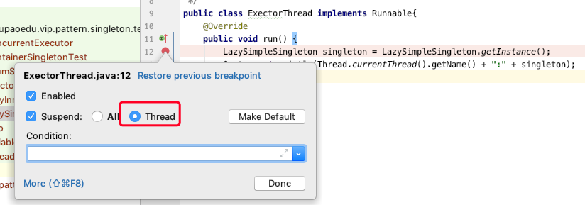


然后，给 LazySimpleSingleton 类打上断点，同样标记为 Thread 模式:

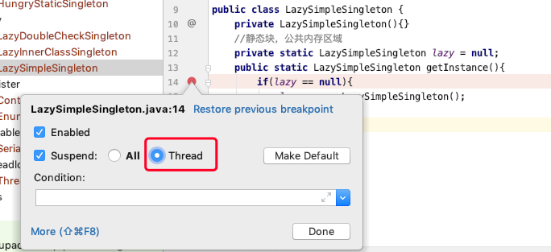

切回到客户端测试代码，同样也打上断点，同时改为 Thread 模式，如下图:

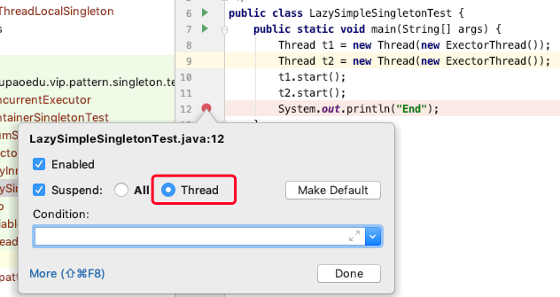

开始 debug 之后，会看到 debug 控制台可以自由切换 Thread 的运行状态:

选中线程0，按F8，运行到检查为空

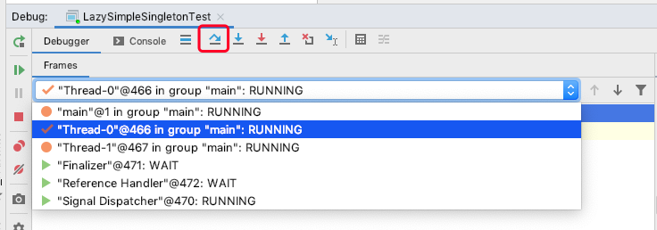

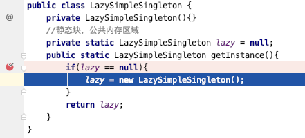

再选中线程1，按F8运行到同样位置

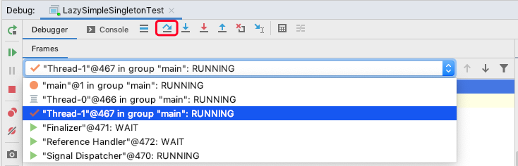

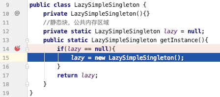

然后一直F8，直到线程1运行完毕。

然后再选择线程0，一直F8直到线程0运行完毕。

可以看到console输出了两个对象，地址不同：

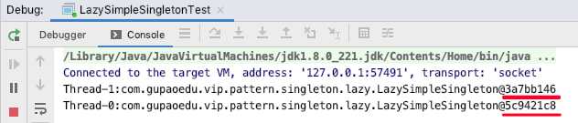


给 `getInstance()` 加上 synchronized 关键字，是这个方法变成线程同步方法:

```java
public class LazySimpleSingleton {
    private LazySimpleSingleton(){}
    //静态块，公共内存区域
    private static LazySimpleSingleton lazy = null;
    public synchronized static LazySimpleSingleton getInstance(){
        if(lazy == null){
            lazy = new LazySimpleSingleton();
        }
        return lazy;
    }
}
```

这时候，我们再来调试。当我们将其中一个线程执行并调用 getInstance()方法时，另一个线程在调用 `getInstance()` 方法，线程的状态由 RUNNING 变成了 MONITOR，出现阻塞。直到第一个线程执行完这个方法，第二个线程才恢复 RUNNING 状态继续调用 `getInstance()` 方法。如下图所示:

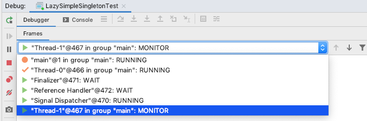


# 5.2 反射破坏单例


大家有没有发现，上面介绍的单例模式的构造方法除了加上 private 以外，没有做任何处理。如果我们使用反射来调用其构造方法，然后，再调用 `getInstance()` 方法，应该就会两个不同的实例。现在来看一段测试代码，以 LazyInnerClassSingleton 为例:

```java
package com.gupaoedu.vip.pattern.singleton.lazy;
//懒汉式单例
public class LazyInnerClassSingleton {
    private LazyInnerClassSingleton(){}
    public static final LazyInnerClassSingleton getInstance(){
        return LazyHolder.LAZY;
    }
    //默认不加载
    private static class LazyHolder{
        private static final LazyInnerClassSingleton LAZY = new LazyInnerClassSingleton();
    }
}
```

```java
package com.gupaoedu.vip.pattern.singleton.test;
public class LazyInnerClassSingletonTest {

    public static void main(String[] args) {
        try{
            //很无聊的情况下，进行破坏
            Class<?> clazz = LazyInnerClassSingleton.class;

            //通过反射拿到私有的构造方法
            Constructor c = clazz.getDeclaredConstructor(null);
            //强制访问，强吻，不愿意也要吻
            c.setAccessible(true);

            //暴力初始化
            Object o1 = c.newInstance();

            //调用了两次构造方法，相当于new了两次
            //犯了原则性问题，
            Object o2 = c.newInstance();
            System.out.println(o1 == o2); //false

        }catch (Exception e){
            e.printStackTrace();
        }
    }
}
```

显然，是创建了两个不同的实例。现在，我们在其构造方法中做一些限制，一旦出现多次重复创建，则直接抛出异常。来看优化后的代码:

```java
//史上最牛 B 的单例模式的实现方式
public class LazyInnerClassSingleton {
    //默认使用LazyInnerClassGeneral的时候，会先初始化内部类
    //如果没使用的话，内部类是不加载的
    private LazyInnerClassSingleton(){
        if(LazyHolder.LAZY != null){
            throw new RuntimeException("不允许创建多个实例");
        }
    }

    //每一个关键字都不是多余的
    //static 是为了使单例的空间共享
    //保证这个方法不会被重写，重载
    public static final LazyInnerClassSingleton getInstance(){
        //在返回结果以前，一定会先加载内部类
        return LazyHolder.LAZY;
    }

    //默认不加载
    private static class LazyHolder{
        private static final LazyInnerClassSingleton LAZY = new LazyInnerClassSingleton();
    }
}
```

再运行测试代码，会得到以下结果:

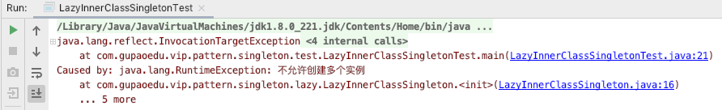

至此，史上最牛 B 的单例写法便大功告成。


# 5.3 序列化破坏单例


当我们将一个单例对象创建好，有时候需要将对象序列化然后写入到磁盘，下次使用时再从磁盘中读取到对象，反序列化转化为内存对象。反序列化后的对象会重新分配内存， 即重新创建。那如果序列化的目标的对象为单例对象，就违背了单例模式的初衷，相当于破坏了单例，来看一段代码:

```java
package com.gupaoedu.vip.pattern.singleton.seriable;
//反序列化时导致单例破坏
public class SeriableSingleton implements Serializable {

    //序列化就是说把内存中的状态通过转换成字节码的形式
    //从而转换一个IO流，写入到其他地方(可以是磁盘、网络IO)
    //内存中状态给永久保存下来了

    //反序列化
    //讲已经持久化的字节码内容，转换为IO流
    //通过IO流的读取，进而将读取的内容转换为Java对象
    //在转换过程中会重新创建对象new

    public  final static SeriableSingleton INSTANCE = new SeriableSingleton();
    private SeriableSingleton(){}

    public static SeriableSingleton getInstance(){
        return INSTANCE;
    }
}
```

编写测试代码:

```java
package com.gupaoedu.vip.pattern.singleton.test;
public class SeriableSingletonTest {
    public static void main(String[] args) {

        SeriableSingleton s1 = null;
        SeriableSingleton s2 = SeriableSingleton.getInstance();

        FileOutputStream fos = null;
        try {
            fos = new FileOutputStream("SeriableSingleton.obj");
            ObjectOutputStream oos = new ObjectOutputStream(fos);
            oos.writeObject(s2);
            oos.flush();
            oos.close();


            FileInputStream fis = new FileInputStream("SeriableSingleton.obj");
            ObjectInputStream ois = new ObjectInputStream(fis);
            s1 = (SeriableSingleton)ois.readObject();
            ois.close();

            System.out.println(s1);
            System.out.println(s2);
            System.out.println(s1 == s2);

        } catch (Exception e) {
            e.printStackTrace();
        }
    }
}
```

运行结果:

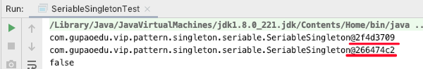

运行结果中，可以看出，反序列化后的对象和手动创建的对象是不一致的，实例化了两 次，违背了单例的设计初衷。那么，我们如何保证序列化的情况下也能够实现单例？其实很简单，只需要增加 `readResolve()` 方法即可。来看优化代码:

```java
package com.gupaoedu.vip.pattern.singleton.seriable;
public class SeriableSingleton implements Serializable {
    public  final static SeriableSingleton INSTANCE = new SeriableSingleton();
    private SeriableSingleton(){}

    public static SeriableSingleton getInstance(){
        return INSTANCE;
    }

    private Object readResolve(){
        return  INSTANCE;
    }
}
```

再看运行结果:

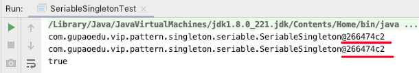

大家一定会关心这是什么原因呢?为什么要这样写?看上去很神奇的样子，也让人有些费解。不如，我们一起来看看 JDK 的源码实现以一清二楚了。我们进入 ObjectInputStream 类的 `readObject()`方法，代码如下:

```java
public final Object readObject()
    throws IOException, ClassNotFoundException
{
    if (enableOverride) {
        return readObjectOverride();
    }

    // if nested read, passHandle contains handle of enclosing object
    int outerHandle = passHandle;
    try {
        Object obj = readObject0(false);
        handles.markDependency(outerHandle, passHandle);
        ClassNotFoundException ex = handles.lookupException(passHandle);
        if (ex != null) {
            throw ex;
        }
        if (depth == 0) {
            vlist.doCallbacks();
        }
        return obj;
    } finally {
        passHandle = outerHandle;
        if (closed && depth == 0) {
            clear();
        }
    }
}
```

我们发现在 `readObject` 中又调用了我们重写的 `readObject0()`方法。进入 `readObject0()` 方法，代码如下:

```java
private Object readObject0(boolean unshared) throws IOException { 
    //...
    case TC_OBJECT:
    return checkResolve(readOrdinaryObject(unshared));
    //...                                       
}
```

我们看到 TC_OBJECTD 中判断，调用了 ObjectInputStream 的 `readOrdinaryObject()` 方法，我们继续进入看源码:

```java
private Object readOrdinaryObject(boolean unshared)
    throws IOException
{
   //...
    Object obj;
    try {
        obj = desc.isInstantiable() ? desc.newInstance() : null;
    } catch (Exception ex) {
        throw (IOException) new InvalidClassException(
            desc.forClass().getName(),
            "unable to create instance").initCause(ex);
    }
  	//...
    return obj;
}
```

发现调用了 ObjectStreamClass 的 `isInstantiable()`方法，而 `isInstantiable()`里面的代码如下:

```java
boolean isInstantiable() {
    requireInitialized();
    return (cons != null);
}
```

代码非常简单，就是判断一下构造方法是否为空，构造方法不为空就返回 true。意味着，只要有无参构造方法就会实例化。

这时候，其实还没有找到为什么加上` readResolve()`方法就避免了单例被破坏的真正原因。我再回到 ObjectInputStream 的 `readOrdinaryObject()`方法继续往下看:

```java
private Object readOrdinaryObject(boolean unshared)
    throws IOException
{
   //...
    Object obj;
    try {
        obj = desc.isInstantiable() ? desc.newInstance() : null;
    } catch (Exception ex) {
        throw (IOException) new InvalidClassException(
            desc.forClass().getName(),
            "unable to create instance").initCause(ex);
    }

    //...
    if (obj != null &&
        handles.lookupException(passHandle) == null &&
        desc.hasReadResolveMethod())
    {
        Object rep = desc.invokeReadResolve(obj);
        if (unshared && rep.getClass().isArray()) {
            rep = cloneArray(rep);
        }
        if (rep != obj) {
            // Filter the replacement object
            if (rep != null) {
                if (rep.getClass().isArray()) {
                    filterCheck(rep.getClass(), Array.getLength(rep));
                } else {
                    filterCheck(rep.getClass(), -1);
                }
            }
            handles.setObject(passHandle, obj = rep);
        }
    }

    return obj;
}
```

判断无参构造方法是否存在之后，又调用了 `hasReadResolveMethod()`方法，来看代码:

```java
boolean hasReadResolveMethod() {
    requireInitialized();
    return (readResolveMethod != null);
}
```

逻辑非常简单，就是判断 readResolveMethod 是否为空，不为空就返回 true。那么 readResolveMethod 是在哪里赋值的呢？通过全局查找找到了赋值代码在私有方法 `ObjectStreamClass()`方法中给 readResolveMethod 进行赋值，来看代码:

```java
readResolveMethod = getInheritableMethod(cl, "readResolve", null, Object.class);
```

上面的逻辑其实就是通过反射找到一个无参的 `readResolve()`方法，并且保存下来。现在再回到 ObjectInputStream 的 `readOrdinaryObject()`方法继续往下看， 如果 `readResolve()`存在则调用 `invokeReadResolve()`方法，来看代码:

```java
Object invokeReadResolve(Object obj)
    throws IOException, UnsupportedOperationException
{
    requireInitialized();
    if (readResolveMethod != null) {
        try {
            return readResolveMethod.invoke(obj, (Object[]) null);
        } catch (InvocationTargetException ex) {
            Throwable th = ex.getTargetException();
            if (th instanceof ObjectStreamException) {
                throw (ObjectStreamException) th;
            } else {
                throwMiscException(th);
                throw new InternalError(th);  // never reached
            }
        } catch (IllegalAccessException ex) {
            // should not occur, as access checks have been suppressed
            throw new InternalError(ex);
        }
    } else {
        throw new UnsupportedOperationException();
    }
}
```

我们可以看到在 `invokeReadResolve()`方法中用反射调用了 `readResolveMethod` 方法。 通过 JDK 源码分析我们可以看出，虽然，增加 `readResolve()`方法返回实例，解决了单例被破坏的问题。但是，我们通过分析源码以及调试，我们可以看到实际上实例化了两 次，只不过新创建的对象没有被返回而已。那如果，创建对象的动作发生频率增大，就意味着内存分配开销也就随之增大，难道真的就没办法从根本上解决问题吗？下面我们来==注册式单例==也许能帮助到你。


# 5.4 注册式单例

## 5.4.1 枚举登记


注册式单例又称为登记式单例，就是将每一个实例都登记到某一个地方，使用唯一的标识获取实例。注册式单例有两种写法:一种为==容器缓存==，一种为==枚举登记==。先来看枚举 式单例的写法，来看代码，创建 EnumSingleton 类:

```java
package com.gupaoedu.vip.pattern.singleton.register;
public enum EnumSingleton {
    INSTANCE;
    private Object data;
    public Object getData() {
        return data;
    }
    public void setData(Object data) {
        this.data = data;
    }
    public static EnumSingleton getInstance(){
        return INSTANCE;
    }
}
```

来看测试代码:

```java
package com.gupaoedu.vip.pattern.singleton.test;
public class EnumSingletonTest {
    public static void main(String[] args) {
        try {
            EnumSingleton instance1 = null;

            EnumSingleton instance2 = EnumSingleton.getInstance();
            instance2.setData(new Object());

            FileOutputStream fos = new FileOutputStream("EnumSingleton.obj");
            ObjectOutputStream oos = new ObjectOutputStream(fos);
            oos.writeObject(instance2);
            oos.flush();
            oos.close();

            FileInputStream fis = new FileInputStream("EnumSingleton.obj");
            ObjectInputStream ois = new ObjectInputStream(fis);
            instance1 = (EnumSingleton) ois.readObject();
            ois.close();

            System.out.println(instance1.getData());
            System.out.println(instance2.getData());
            System.out.println(instance1.getData() == instance2.getData());

        }catch (Exception e){
            e.printStackTrace();
        }
    }
}
```

运行结果:

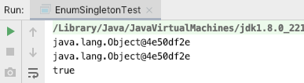

没有做任何处理，我们发现运行结果和我们预期的一样。那么枚举式单例如此神奇，它的神秘之处在哪里体现呢?下面我们通过分析源码来揭开它的神秘面纱。

下载一个非常好用的 Java 反编译工具 Jad(下载地址:https://varaneckas.com/jad/)， 解压后配置好环境变量(这里不做详细介绍)，就可以使用命令行调用了。找到工程所在的 class 目录，复制 EnumSingleton.class 所在的路径，如下图:

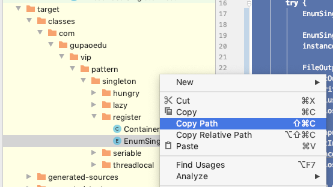

然后切回到命令行，切换到工程所在的 Class 目录，输入命令 jad 后面输入复制好的路 径，我们会在 Class 目录下会多一个 EnumSingleton.jad 文件。打开 EnumSingleton.jad 文件我们惊奇又巧妙地发现有如下代码:

```java
static {
	INSTANCE = new EnumSingleton("INSTANCE", 0); 
    $VALUES = (new EnumSingleton[] {
		INSTANCE 
    });
}
```

原来，枚举式单例在静态代码块中就给 INSTANCE 进行了赋值，是饿汉式单例的实现。 至此，我们还可以试想，序列化我们能否破坏枚举式单例呢？我们不妨再来看一下 JDK 源码，还是回到 ObjectInputStream 的 `readObject0()`方法:

```java
private Object readObject0(boolean unshared) throws IOException {
    //...
	case TC_ENUM:
		return checkResolve(readEnum(unshared));
	//...                                                          
}

```

我们看到在 `readObject0()`中调用了 `readEnum()`方法，来看 `readEnum()`中代码实现:

```java
private Enum<?> readEnum(boolean unshared) throws IOException {
    if (bin.readByte() != TC_ENUM) {
        throw new InternalError();
    }

    ObjectStreamClass desc = readClassDesc(false);
    if (!desc.isEnum()) {
        throw new InvalidClassException("non-enum class: " + desc);
    }

    int enumHandle = handles.assign(unshared ? unsharedMarker : null);
    ClassNotFoundException resolveEx = desc.getResolveException();
    if (resolveEx != null) {
        handles.markException(enumHandle, resolveEx);
    }

    String name = readString(false);
    Enum<?> result = null;
    Class<?> cl = desc.forClass();
    if (cl != null) {
        try {
            @SuppressWarnings("unchecked")
            Enum<?> en = Enum.valueOf((Class)cl, name);
            result = en;
        } catch (IllegalArgumentException ex) {
            throw (IOException) new InvalidObjectException(
                "enum constant " + name + " does not exist in " +
                cl).initCause(ex);
        }
        if (!unshared) {
            handles.setObject(enumHandle, result);
        }
    }

    handles.finish(enumHandle);
    passHandle = enumHandle;
    return result;
}
```

我们发现枚举类型其实通过类名和 Class 对象类找到一个唯一的枚举对象。因此，枚举对象不可能被类加载器加载多次。那么反射是否能破坏枚举式单例呢？来看一段测试代码:

```java
package com.gupaoedu.vip.pattern.singleton.test;
public class EnumSingletonTest {
    public static void main(String[] args) {
        try {
            Class clazz = EnumSingleton.class;
            Constructor c = clazz.getDeclaredConstructor();
            c.setAccessible(true);
			c.newInstance();
        }catch (Exception e){
            e.printStackTrace();
        }
    }
}
```

运行结果:

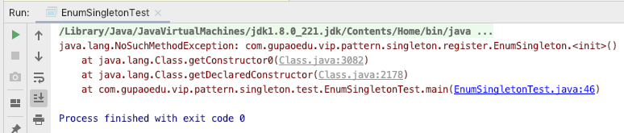

报的是 java.lang.NoSuchMethodException 异常，意思是没找到无参的构造方法。这时候，我们打开 java.lang.Enum 的源码代码，查看它的构造方法，只有一个 protected的构造方法，代码如下:

```java
protected Enum(String, int ordinal)
{ 
    this.name = name;
	this.ordinal = ordinal;
}
```

那我们再来做一个这样的测试:

```java
package com.gupaoedu.vip.pattern.singleton.test;
public class EnumSingletonTest {
    public static void main(String[] args) {
        try {
            Class clazz = EnumSingleton.class;
            //Constructor c = clazz.getDeclaredConstructor();
            Constructor c = clazz.getDeclaredConstructor(String.class,int.class);
            c.setAccessible(true);
			//c.newInstance();
            EnumSingleton enumSingleton = (EnumSingleton)c.newInstance("Tom",666);
        }catch (Exception e){
            e.printStackTrace();
        }
    }
}
```

运行结果：

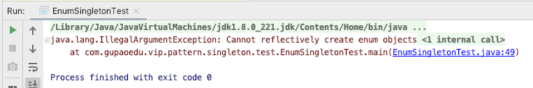

这时错误已经非常明显了，告诉我们 Cannot reflectively create enum objects，不能用反射来创建枚举类型。还是习惯性地想来看看 JDK 源码，进入 Constructor 的 `newInstance()`方法:

```java
public T newInstance(Object ... initargs)
    throws InstantiationException, IllegalAccessException,
IllegalArgumentException, InvocationTargetException
{
    if (!override) {
        if (!Reflection.quickCheckMemberAccess(clazz, modifiers)) {
            Class<?> caller = Reflection.getCallerClass();
            checkAccess(caller, clazz, null, modifiers);
        }
    }
    if ((clazz.getModifiers() & Modifier.ENUM) != 0)
        throw new IllegalArgumentException("Cannot reflectively create enum objects");
    ConstructorAccessor ca = constructorAccessor;   // read volatile
    if (ca == null) {
        ca = acquireConstructorAccessor();
    }
    @SuppressWarnings("unchecked")
    T inst = (T) ca.newInstance(initargs);
    return inst;
}
```

在 `newInstance()`方法中做了强制性的判断，如果修饰符是 Modifier.ENUM 枚举类型， 直接抛出异常。到这为止，我们是不是已经非常清晰明了呢？枚举式单例也是《Effective Java》书中推荐的一种单例实现写法。在 JDK 枚举的语法特殊性，以及反射也为枚举保驾护航，让枚举式单例成为一种比较优雅的实现。 


## 5.4.2 容器缓存


接下来看注册式单例还有另一种写法，容器缓存的写法，创建 ContainerSingleton 类:

```java
package com.gupaoedu.vip.pattern.singleton.register;
//Spring中的做法，就是用这种注册式单例
public class ContainerSingleton {
    private ContainerSingleton(){}
    private static Map<String,Object> ioc = new ConcurrentHashMap<String,Object>();
    public static Object getInstance(String className){
        synchronized (ioc) {
            if (!ioc.containsKey(className)) {
                Object obj = null;
                try {
                    obj = Class.forName(className).newInstance();
                    ioc.put(className, obj);
                } catch (Exception e) {
                    e.printStackTrace();
                }
                return obj;
            } else {
                return ioc.get(className);
            }
        }
    }
}
```

写一下测试代码:

```java
package com.gupaoedu.vip.pattern.singleton.test;
public class ContainerSingletonTest {
    public static void main(String[] args) {
        try {
            long start = System.currentTimeMillis();
            ConcurrentExecutor.execute(new ConcurrentExecutor.RunHandler() {
                public void handler() {
                    Object obj = ContainerSingleton.getInstance("com.gupaoedu.vip.pattern.singleton.test.Pojo");;
                    System.out.println(System.currentTimeMillis() + ": " + obj);
                }
            }, 10,6);
            long end = System.currentTimeMillis();
            System.out.println("总耗时：" + (end - start) + " ms.");
        }catch (Exception e){
            e.printStackTrace();
        }
    }
}
```

运行结果：

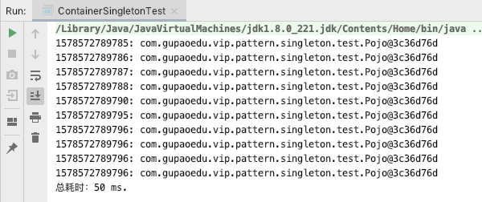

容器式写法适用于创建实例非常多的情况，便于管理。但是，是非线程安全的。到此， 注册式单例介绍完毕。我们还可以来看看 Spring 中的容器式单例的实现代码:

```java
public abstract class AbstractAutowireCapableBeanFactory extends AbstractBeanFactory implements AutowireCapableBeanFactory {
    /** Cache of unfinished FactoryBean instances: FactoryBean name --> BeanWrapper */
    private final Map<String, BeanWrapper> factoryBeanInstanceCache = new ConcurrentHashMap<>(16); 
    //...
}
```


# 5.5 ThreadLocal 线程单例


ThreadLocal 不能保证其创建的对象是全局唯一，但是能保证在单个线程中是唯一的，天生的线程安全。下面我 们来看代码:

```java
package com.gupaoedu.vip.pattern.singleton.threadlocal;
//伪线程安全
//使用ThreadLocal来实现多数据源动态切换
//讲Spring源码的时候，我们会给大家手写ORM并且实现多数据源动态切换
//数据源路由
public class ThreadLocalSingleton {
    private static final ThreadLocal<ThreadLocalSingleton> threadLocalInstance =
            new ThreadLocal<ThreadLocalSingleton>(){
                @Override
                protected ThreadLocalSingleton initialValue() {
                    return new ThreadLocalSingleton();
                }
            };

    private ThreadLocalSingleton(){}

    public static ThreadLocalSingleton getInstance(){
        return threadLocalInstance.get();
    }
}
```

写一下测试代码:

```java
package com.gupaoedu.vip.pattern.singleton.test;
public class ThreadLocalSingletonTest {
    public static void main(String[] args) {

        System.out.println(ThreadLocalSingleton.getInstance());
        System.out.println(ThreadLocalSingleton.getInstance());
        System.out.println(ThreadLocalSingleton.getInstance());
        System.out.println(ThreadLocalSingleton.getInstance());
        System.out.println(ThreadLocalSingleton.getInstance());

        Thread t1 = new Thread(new ExectorThread());
        Thread t2 = new Thread(new ExectorThread());
        t1.start();
        t2.start();
        System.out.println("End");
    }
}
```

```java
package com.gupaoedu.vip.pattern.singleton.test;
public class ExectorThread implements Runnable{
    @Override
    public void run() {
        System.out.println(Thread.currentThread().getName() + ":" + ThreadLocalSingleton.getInstance());
        System.out.println(Thread.currentThread().getName() + ":" + ThreadLocalSingleton.getInstance());
        System.out.println(Thread.currentThread().getName() + ":" + ThreadLocalSingleton.getInstance());
        System.out.println(Thread.currentThread().getName() + ":" + ThreadLocalSingleton.getInstance());
    }
}
```

运行结果：

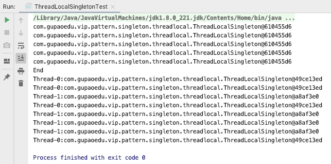

可以看出，不同的线程对象不同，但是同一线程，对象是保持单例的。ThreadLocal是如何实现的了，我们看下源码，ThreadLocal 将所有的对象全部放在静态内部类 ThreadLocalMap 中，为每个线程都提供一个对象，实际上是以空间换时间来实现线程间隔离的。

```java
private T setInitialValue() {
    T value = initialValue();
    Thread t = Thread.currentThread();
    ThreadLocalMap map = getMap(t);
    if (map != null)
        map.set(this, value); //以线程为key，对象为值
    else
        createMap(t, value);
    return value;
}
```

获取的时候根据线程从 ThreadLocalMap中取出：

```java
public T get() {
    Thread t = Thread.currentThread();
    ThreadLocalMap map = getMap(t);
    if (map != null) {
        ThreadLocalMap.Entry e = map.getEntry(this);
        if (e != null) {
            @SuppressWarnings("unchecked")
            T result = (T)e.value;
            return result;
        }
    }
    return setInitialValue();
}
```

ThreadLocal 的单例属于注册式容器


# 5.6 单例模式小结


优点：

* 单例模式可以保证内存里只有一个实例，减少了内存开销。

* 可以避免对资源的多重占用。 
* 设置全局访问点，严格控制访问。

缺点：

* 没有接口，扩展困难。
* 如果要扩展单例对象，只有修改代码，没有其他途径。

单例模式看起来非常简单，实现起来其实也非常简单。但是在面试中却是一个高频面试题。


重点：

* 私有化构造器
* 保证线程安全
* 延迟加载
* 防止序列化和反序列化破坏单例
* 防止反射攻击单例