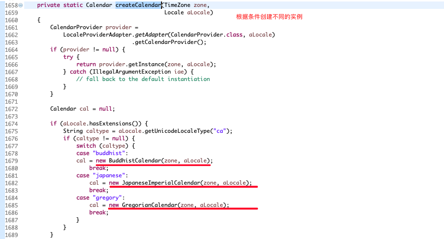

# 6.1 引出问题 

## 6.1.1 看一个具体的需求 

看一个披萨的项目:要便于披萨种类的扩展，要便于维护 

1. 披萨的种类很多(比如 GreekPizz、CheesePizz 等)
2. 披萨的制作有 prepare,bake,cut,box
3. 完成披萨店订购功能。 

## 6.1.2 使用传统的方式来完成 


编写 OrderPizza.java 去订购需要的各种 Pizza 


```java
package com.atguigu.factory.simplefactory.pizzastore.pizza;
//将Pizza 类做成抽象
public abstract class Pizza {
	protected String name; //名字

	//准备原材料, 不同的披萨不一样，因此，我们做成抽象方法
	public abstract void prepare();
	//烘烤
	public void bake() { System.out.println(name + " baking;"); }
	//切割
	public void cut() { System.out.println(name + " cutting;"); }
	//打包
	public void box() { System.out.println(name + " boxing;"); }

	public void setName(String name) { this.name = name; }
}
```

```java
package com.atguigu.factory.simplefactory.pizzastore.pizza;
public class CheesePizza extends Pizza {
	@Override
	public void prepare() { System.out.println(" 给制作奶酪披萨 准备原材料 "); }
}
```

```java
package com.atguigu.factory.simplefactory.pizzastore.pizza;
public class GreekPizza extends Pizza {
	@Override
	public void prepare() { System.out.println(" 给希腊披萨 准备原材料 "); }
}
```

```java
package com.atguigu.factory.simplefactory.pizzastore.pizza;
public class PepperPizza extends Pizza {
	@Override
	public void prepare() { System.out.println(" 给胡椒披萨准备原材料 "); }
}
```


```java
package com.atguigu.factory.simplefactory.pizzastore.order;

import java.io.BufferedReader;
import java.io.IOException;
import java.io.InputStreamReader;

import com.atguigu.factory.simplefactory.pizzastore.pizza.CheesePizza;
import com.atguigu.factory.simplefactory.pizzastore.pizza.GreekPizza;
import com.atguigu.factory.simplefactory.pizzastore.pizza.PepperPizza;
import com.atguigu.factory.simplefactory.pizzastore.pizza.Pizza;

public class OrderPizza {

	// 构造器
	public OrderPizza() {
		Pizza pizza = null;
		String orderType; // 订购披萨的类型
		do {
			orderType = getType();
			if (orderType.equals("cheese")) {
				pizza = new GreekPizza();
				pizza.setName(" 奶酪披萨 ");
			} else if (orderType.equals("greek")) {
				pizza = new CheesePizza();
				pizza.setName(" 希腊披萨 ");
			} else if (orderType.equals("pepper")) {
				pizza = new PepperPizza();
				pizza.setName(" 胡椒披萨 ");
			} else {
				break;
			}
			//输出pizza 制作过程
			pizza.prepare();
			pizza.bake();
			pizza.cut();
			pizza.box();
			
		} while (true);
	}
	
	// 写一个方法，可以获取客户希望订购的披萨种类
	private String getType() {
		try {
			BufferedReader strin = new BufferedReader(new InputStreamReader(System.in));
			System.out.println("input pizza 种类:");
			String str = strin.readLine();
			return str;
		} catch (IOException e) {
			e.printStackTrace();
			return "";
		}
	}
}
```

```java
package com.atguigu.factory.simplefactory.pizzastore.order;

//相当于一个客户端，发出订购
public class PizzaStore {
	public static void main(String[] args) {
		new OrderPizza();
	}
}
```


## 6.1.3 传统的方式的优缺点 

1. 优点是比较好理解，简单易操作。
2. 缺点是违反了设计模式的ocp原则，即==对扩展开放，对修改关闭==。即当我们给类增加新功能的时候，尽量不修改代码，或者尽可能少修改代码。
3. 比如我们这时要新增加一个Pizza的种类(Pepper披萨)，我们需要新增PepperPizza类和修改OrderPizza类(扩展开放满足，修改关闭不满足)。


4. 改进的思路分析：
   1. ==分析==: 修改代码可以接受，但是如果我们在其它的地方也有创建Pizza的代码，就意味着，也需要修改，而创建Pizza的代码，==往往有多处==。 
   2. ==思路==: 把创建Pizza对象封装到一个类中，这样我们有新的Pizza种类时，只需要修改该类就可，==其它有创建到Pizza对象的代码就不需要修改了==-> ==简单工厂模式== 


# 6.2 简单工厂模式 

## 6.2.1 基本介绍 

1. 简单工厂模式是属于创建型模式，是工厂模式的一种。==简单工厂模式是由一个工厂对象决定创建出哪一种产品类的实例==。简单工厂模式是工厂模式家族中最简单实用的模式 。

2. 简单工厂模式:定义了一个创建对象的类，由这个类来**封装实例化对象的行为**(代码)。 
3. 在软件开发中，当我们会用到大量的创建某种、某类或者某批对象时，就会使用到工厂模式。


## 6.2.2 简单工厂


```java
package com.atguigu.factory.simplefactory.pizzastore.improve.order;

import com.atguigu.factory.simplefactory.pizzastore.pizza.CheesePizza;
import com.atguigu.factory.simplefactory.pizzastore.pizza.GreekPizza;
import com.atguigu.factory.simplefactory.pizzastore.pizza.PepperPizza;
import com.atguigu.factory.simplefactory.pizzastore.pizza.Pizza;

//简单工厂类
public class SimpleFactory {

	//更加orderType 返回对应的Pizza 对象
	public Pizza createPizza(String orderType) {
		Pizza pizza = null;

		System.out.println("使用简单工厂模式");
		if (orderType.equals("greek")) {
			pizza = new GreekPizza();
			pizza.setName(" 希腊披萨 ");
		} else if (orderType.equals("cheese")) {
			pizza = new CheesePizza();
			pizza.setName(" 奶酪披萨 ");
		} else if (orderType.equals("pepper")) {
			pizza = new PepperPizza();
			pizza.setName("胡椒披萨");
		}
		
		return pizza;
	}

}
```

```java
package com.atguigu.factory.simplefactory.pizzastore.improve.order;

import java.io.BufferedReader;
import java.io.IOException;
import java.io.InputStreamReader;
import com.atguigu.factory.simplefactory.pizzastore.pizza.Pizza;

public class OrderPizza {
	//定义一个简单工厂对象
	SimpleFactory simpleFactory;
	Pizza pizza = null;
	
	//构造器
	public OrderPizza(SimpleFactory simpleFactory) {
		setFactory(simpleFactory);
	}
	
	public void setFactory(SimpleFactory simpleFactory) {
		String orderType = ""; //用户输入的
		
		this.simpleFactory = simpleFactory; //设置简单工厂对象
		
		do {
			orderType = getType(); 
			pizza = this.simpleFactory.createPizza(orderType);
			
			//输出pizza
			if(pizza != null) { //订购成功
				pizza.prepare();
				pizza.bake();
				pizza.cut();
				pizza.box();
			} else {
				System.out.println(" 订购披萨失败 ");
				break;
			}
		}while(true);
	}

}
```

```java
package com.atguigu.factory.simplefactory.pizzastore.improve.order;

//相当于一个客户端，发出订购
public class PizzaStore {
	public static void main(String[] args) {
		//使用简单工厂模式
		new OrderPizza(new SimpleFactory());
	}
}
```


## 6.2.3 静态工厂


```java
package com.atguigu.factory.simplefactory.pizzastore.improve.order;

import com.atguigu.factory.simplefactory.pizzastore.pizza.CheesePizza;
import com.atguigu.factory.simplefactory.pizzastore.pizza.GreekPizza;
import com.atguigu.factory.simplefactory.pizzastore.pizza.PepperPizza;
import com.atguigu.factory.simplefactory.pizzastore.pizza.Pizza;

//简单工厂类
public class SimpleFactory {
	//简单工厂模式 也叫 静态工厂模式 
	public static Pizza createPizza2(String orderType) {
		Pizza pizza = null;

		System.out.println("使用简单工厂模式2");
		if (orderType.equals("greek")) {
			pizza = new GreekPizza();
			pizza.setName(" 希腊披萨 ");
		} else if (orderType.equals("cheese")) {
			pizza = new CheesePizza();
			pizza.setName(" 奶酪披萨 ");
		} else if (orderType.equals("pepper")) {
			pizza = new PepperPizza();
			pizza.setName("胡椒披萨");
		}
		return pizza;
	}

}
```

```java
package com.atguigu.factory.simplefactory.pizzastore.improve.order;

import java.io.BufferedReader;
import java.io.IOException;
import java.io.InputStreamReader;
import com.atguigu.factory.simplefactory.pizzastore.pizza.Pizza;

public class OrderPizza2 {

	Pizza pizza = null;
	String orderType = "";
	// 构造器
	public OrderPizza2() {
		do {
			orderType = getType();
			pizza = SimpleFactory.createPizza2(orderType);

			// 输出pizza
			if (pizza != null) { // 订购成功
				pizza.prepare();
				pizza.bake();
				pizza.cut();
				pizza.box();
			} else {
				System.out.println(" 订购披萨失败 ");
				break;
			}
		} while (true);
	}

	// 写一个方法，可以获取客户希望订购的披萨种类
	private String getType() {
		try {
			BufferedReader strin = new BufferedReader(new InputStreamReader(System.in));
			System.out.println("input pizza 种类:");
			String str = strin.readLine();
			return str;
		} catch (IOException e) {
			e.printStackTrace();
			return "";
		}
	}
}
```

```java
package com.atguigu.factory.simplefactory.pizzastore.improve.order;

//相当于一个客户端，发出订购
public class PizzaStore {
	public static void main(String[] args) {
		//使用静态工厂模式 
		new OrderPizza2();
	}
}
```


# 6.3 看一个新的需求 

披萨项目新的需求:客户在点披萨时，可以点不同口味的披萨，比如 北京的奶酪pizza、 北京的胡椒pizza 或者是伦敦的奶酪pizza、伦敦的胡椒pizza。 

思路1

使用==简单工厂模式==，创建==不同的简单工厂类==，比如 BJPizzaSimpleFactory、LDPizzaSimpleFactory 等等.从当前这个案例来说，也是可以的，但是考虑到项目的规模，以及软件的可维护性、可扩展性并不是特别好

思路 2 

使用工厂方法模式 

# 6.4  工厂方法模式 

## 6.4.1 基本介绍

1. 工厂方法模式设计方案:将披萨项目的实例化功能抽象成抽象方法，在不同的口味点餐子类中具体实现。 
2. 工厂方法模式:定义了一个创建对象的抽象方法，由子类决定要实例化的类。工厂方法模式将对象的实例化推迟到子类。 

## 6.4.2 UML类图


## 6.4.3 代码实现

```java
package com.atguigu.factory.factorymethod.pizzastore.order;

import java.io.BufferedReader;
import java.io.IOException;
import java.io.InputStreamReader;
import com.atguigu.factory.factorymethod.pizzastore.pizza.Pizza;

public abstract class OrderPizza {

	//定义一个抽象方法，createPizza , 让各个工厂子类自己实现
	abstract Pizza createPizza(String orderType);
	
	// 构造器
	public OrderPizza() {
		Pizza pizza = null;
		String orderType; // 订购披萨的类型
		do {
			orderType = getType();
			pizza = createPizza(orderType); //抽象方法，由工厂子类完成
			//输出pizza 制作过程
			pizza.prepare();
			pizza.bake();
			pizza.cut();
			pizza.box();
		} while (true);
	}

	// 写一个方法，可以获取客户希望订购的披萨种类
	private String getType() {
		try {
			BufferedReader strin = new BufferedReader(new InputStreamReader(System.in));
			System.out.println("input pizza 种类:");
			String str = strin.readLine();
			return str;
		} catch (IOException e) {
			e.printStackTrace();
			return "";
		}
	}

}
```

```java
package com.atguigu.factory.factorymethod.pizzastore.order;

import com.atguigu.factory.factorymethod.pizzastore.pizza.BJCheesePizza;
import com.atguigu.factory.factorymethod.pizzastore.pizza.BJPepperPizza;
import com.atguigu.factory.factorymethod.pizzastore.pizza.Pizza;

public class BJOrderPizza extends OrderPizza {

	@Override
	Pizza createPizza(String orderType) {
		Pizza pizza = null;
		if(orderType.equals("cheese")) {
			pizza = new BJCheesePizza();
		} else if (orderType.equals("pepper")) {
			pizza = new BJPepperPizza();
		}
		return pizza;
	}

}
```

```java
package com.atguigu.factory.factorymethod.pizzastore.order;

import com.atguigu.factory.factorymethod.pizzastore.pizza.LDCheesePizza;
import com.atguigu.factory.factorymethod.pizzastore.pizza.LDPepperPizza;
import com.atguigu.factory.factorymethod.pizzastore.pizza.Pizza;

public class LDOrderPizza extends OrderPizza {

	@Override
	Pizza createPizza(String orderType) {
		Pizza pizza = null;
		if(orderType.equals("cheese")) {
			pizza = new LDCheesePizza();
		} else if (orderType.equals("pepper")) {
			pizza = new LDPepperPizza();
		}
		return pizza;
	}

}
```

```java
package com.atguigu.factory.factorymethod.pizzastore.order;

public class PizzaStore {

	public static void main(String[] args) {
		String loc = "bj";
		if (loc.equals("bj")) {
			//创建北京口味的各种Pizza
			new BJOrderPizza();
		} else {
			//创建伦敦口味的各种Pizza
			new LDOrderPizza();
		}
	}

}
```


# 6.5 抽象工厂模式 

## 6.5.1 基本介绍 

1. 抽象工厂模式:定义了一个==interface 用于创建相关或有依赖关系的对象簇==，而无需指明具体的类。
2. 抽象工厂模式可以将简单工厂模式和工厂方法模式进行整合。 
3. 从设计层面看，抽象工厂模式就是对简单工厂模式的改进(或者称为进一步的抽象)。 
4. 将工厂抽象成==两层==，==AbsFactory(抽象工厂)== 和 ==具体实现的工厂子类==。程序员可以根据创建对象类型使用对应 的工厂子类。这样将单个的简单工厂类变成了工厂簇，更利于代码的维护和扩展。 

## 6.5.2 UML类图


## 6.5.3 代码实现

```java
package com.atguigu.factory.absfactory.pizzastore.order;

import com.atguigu.factory.absfactory.pizzastore.pizza.Pizza;

//一个抽象工厂模式的抽象层(接口)
public interface AbsFactory {
	//让下面的工厂子类来 具体实现
	public Pizza createPizza(String orderType);
}
```

```java
package com.atguigu.factory.absfactory.pizzastore.order;

import com.atguigu.factory.absfactory.pizzastore.pizza.BJCheesePizza;
import com.atguigu.factory.absfactory.pizzastore.pizza.BJPepperPizza;
import com.atguigu.factory.absfactory.pizzastore.pizza.Pizza;

//这是工厂子类
public class BJFactory implements AbsFactory {

	@Override
	public Pizza createPizza(String orderType) {
		System.out.println("~使用的是抽象工厂模式~");
		Pizza pizza = null;
		if(orderType.equals("cheese")) {
			pizza = new BJCheesePizza();
		} else if (orderType.equals("pepper")){
			pizza = new BJPepperPizza();
		}
		return pizza;
	}

}
```

```java
package com.atguigu.factory.absfactory.pizzastore.order;

import com.atguigu.factory.absfactory.pizzastore.pizza.LDCheesePizza;
import com.atguigu.factory.absfactory.pizzastore.pizza.LDPepperPizza;
import com.atguigu.factory.absfactory.pizzastore.pizza.Pizza;

public class LDFactory implements AbsFactory {

	@Override
	public Pizza createPizza(String orderType) {
		System.out.println("~使用的是抽象工厂模式~");
		Pizza pizza = null;
		if (orderType.equals("cheese")) {
			pizza = new LDCheesePizza();
		} else if (orderType.equals("pepper")) {
			pizza = new LDPepperPizza();
		}
		return pizza;
	}

}
```

```java
package com.atguigu.factory.absfactory.pizzastore.order;

import java.io.BufferedReader;
import java.io.IOException;
import java.io.InputStreamReader;
import com.atguigu.factory.absfactory.pizzastore.pizza.Pizza;

public class OrderPizza {

	AbsFactory factory;

	// 构造器
	public OrderPizza(AbsFactory factory) {
		setFactory(factory);
	}

	private void setFactory(AbsFactory factory) {
		Pizza pizza = null;
		String orderType = ""; // 用户输入
		this.factory = factory;
		do {
			orderType = getType();
			// factory 可能是北京的工厂子类，也可能是伦敦的工厂子类
			pizza = factory.createPizza(orderType);
			if (pizza != null) { // 订购ok
				pizza.prepare();
				pizza.bake();
				pizza.cut();
				pizza.box();
			} else {
				System.out.println("订购失败");
				break;
			}
		} while (true);
	}

	// 写一个方法，可以获取客户希望订购的披萨种类
	private String getType() {
		try {
			BufferedReader strin = new BufferedReader(new InputStreamReader(System.in));
			System.out.println("input pizza 种类:");
			String str = strin.readLine();
			return str;
		} catch (IOException e) {
			e.printStackTrace();
			return "";
		}
	}
}
```

```java
package com.atguigu.factory.absfactory.pizzastore.order;
public class PizzaStore {
	public static void main(String[] args) {
		new OrderPizza(new LDFactory());
	}
}
```


# 6.6 工厂模式在Calendar的源码分析 

JDK 中的 Calendar 类中，就使用了简单工厂模式





# 6.7 工厂模式小结 

1. 工厂模式的意义

   将实例化对象的代码提取出来，放到一个类中统一管理和维护，达到和主项目的依赖关系的解耦。从而提高项目的扩展和维护性。

2. 三种工厂模式 (简单工厂模式、工厂方法模式、抽象工厂模式) 

3. 设计模式的==依赖抽象==原则 

4. 创建对象实例时，不要直接 new 类, 而是把这个new 类的动作放在一个工厂的方法中，并返回。有的书上说，变量不要直接持有具体类的引用。 

5. 不要让类继承具体类，而是继承抽象类或者是实现interface(接口) 

6. 不要覆盖基类中已经实现的方法。 