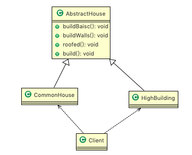
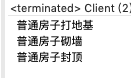
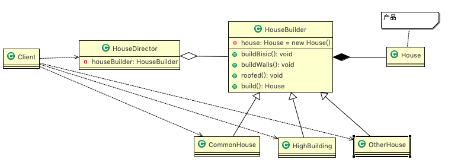
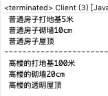
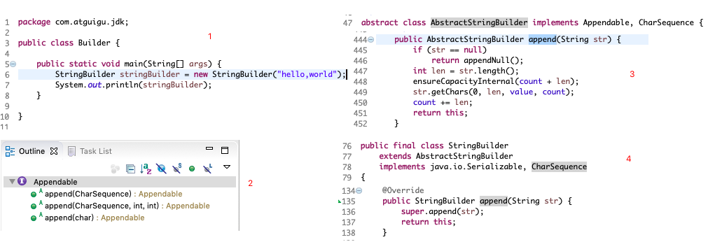

# 8.1 盖房项目需求 

1. 需要建房子:这一过程为打桩、砌墙、封顶
2. 房子有各种各样的，比如普通房，高楼，别墅，各种房子的过程虽然一样，但是要求不要相同的. 


# 8.2 传统方式解决盖房需求 

## 8.2.1 思路分析(图解) 



## 8.2.2 代码实现

```java
package com.atguigu.builder;

public abstract class AbstractHouse {
	//打地基
	public abstract void buildBasic();
	//砌墙
	public abstract void buildWalls();
	//封顶
	public abstract void roofed();
	
	public void build() {
		buildBasic();
		buildWalls();
		roofed();
	}
	
}
```

```java
package com.atguigu.builder;

public class CommonHouse extends AbstractHouse {

	@Override
	public void buildBasic() {
		System.out.println(" 普通房子打地基 ");
	}

	@Override
	public void buildWalls() {
		System.out.println(" 普通房子砌墙 ");
	}

	@Override
	public void roofed() {
		System.out.println(" 普通房子封顶 ");
	}

}
```

```java
package com.atguigu.builder;

public class Client {

	public static void main(String[] args) {
		CommonHouse commonHouse = new CommonHouse();
		commonHouse.build();
	}

}
```



## 8.2.3 传统方式的问题分析

1. 优点是比较好理解，简单易操作。
2. 设计的程序结构，过于简单，没有设计缓存层对象，程序的扩展和维护不好。也就是说，这种设计方案，把产 品(即:房子) 和创建产品的过程(即:建房子流程) 封装在一起，耦合性增强了。 
3. 解决方案:将产品和产品建造过程解耦 => ==建造者模式==。


# 8.3 建造者模式

## 8.3.1 基本介绍

1. 建造者模式(BuilderPattern)又叫==生成器模式==，是一种对象==构建模式==。它可以将复杂对象的建造过程抽象出来(抽象类别)，使这个抽象过程的不同实现方法可以构造出不同表现(属性)的对象。 
2. 建造者模式是一步一步创建一个复杂的对象，它允许用户只通过指定复杂对象的类型和内容就可以构建它们， 用户不需要知道内部的具体构建细节。 

## 8.3.2 建造者模式的四个角色 

1. Product(产品角色): 一个具体的产品对象。 
2. Builder(抽象建造者): 创建一个 Product 对象的各个部件指定的==接口/抽象类==。 
3. ConcreteBuilder(具体建造者): 实现接口，构建和装配各个部件。 
4. Director(指挥者): 构建一个使用 Builder 接口的对象。它主要是用于创建一个复杂的对象。它主要有两个作用，一是:隔离了客户与对象的生产过程，二是:负责控制产品对象的生产过程。

## 8.3.3 原理类图 


## 8.3.4 盖房子UML图



## 8.3.5 代码实现

```java
package com.atguigu.builder.improve;

//产品->Product
public class House {
	private String baise;
	private String wall;
	private String roofed;
	
    //getter setter toString... 
	
}
```

```java
package com.atguigu.builder.improve;

// 抽象的建造者
public abstract class HouseBuilder {

	protected House house = new House();

	//将建造的流程写好, 抽象的方法
	public abstract void buildBasic();
	public abstract void buildWalls();
	public abstract void roofed();
	
	//建造房子好， 将产品(房子) 返回
	public House buildHouse() {
		return house;
	}
	
}
```

```java
package com.atguigu.builder.improve;

//ConcreteBuilder(具体建造者)
public class CommonHouse extends HouseBuilder {

	@Override
	public void buildBasic() { System.out.println(" 普通房子打地基5米 "); }
	@Override
	public void buildWalls() { System.out.println(" 普通房子砌墙10cm "); }
	@Override
	public void roofed() { System.out.println(" 普通房子屋顶 "); }

}
```

```java
package com.atguigu.builder.improve;

//ConcreteBuilder(具体建造者)
public class HighBuilding extends HouseBuilder {

	@Override
	public void buildBasic() { System.out.println(" 高楼的打地基100米 "); }
	@Override
	public void buildWalls() { System.out.println(" 高楼的砌墙20cm "); }
	@Override
	public void roofed() { System.out.println(" 高楼的透明屋顶 "); }

}
```

```java
package com.atguigu.builder.improve;

//Director(指挥者)，这里去指定制作流程，返回产品
public class HouseDirector {
	
	HouseBuilder houseBuilder = null;

	//构造器传入 houseBuilder
	public HouseDirector(HouseBuilder houseBuilder) {
		this.houseBuilder = houseBuilder;
	}

	//通过setter 传入 houseBuilder
	public void setHouseBuilder(HouseBuilder houseBuilder) {
		this.houseBuilder = houseBuilder;
	}
	
	//如何处理建造房子的流程，交给指挥者
	public House constructHouse() {
		houseBuilder.buildBasic();
		houseBuilder.buildWalls();
		houseBuilder.roofed();
		return houseBuilder.buildHouse();
	}
	
}
```

```java
package com.atguigu.builder.improve;

public class Client {
	public static void main(String[] args) {
		//盖普通房子
		CommonHouse commonHouse = new CommonHouse();
		//准备创建房子的指挥者
		HouseDirector houseDirector = new HouseDirector(commonHouse);
		//完成盖房子，返回产品(普通房子)
		House house = houseDirector.constructHouse();
		
		System.out.println("--------------------------");
		//盖高楼
		HighBuilding highBuilding = new HighBuilding();
		//重置建造者
		houseDirector.setHouseBuilder(highBuilding);
		//完成盖房子，返回产品(高楼)
		houseDirector.constructHouse();
	}
}
```



# 8.4 建造者模式在 JDK 的应用和源码分析 

java.lang.StringBuilder 中的建造者模式 

| ddddddddddddddddddddddddddddddddddddddddddddddddddddddddddddddddddddddddddddddddddddddddddddddddddddd | d    |
| ------------------------------------------------------------ | ---- |
|  |      |


* Appendable 接口定义了多个 append 方法(抽象方法), 即 Appendable 为抽象建造者, 定义了抽象方法

* AbstractStringBuilder 实现了 Appendable 接口方法，这里的 AbstractStringBuilder 已经是建造者，只是不能实例化 

* StringBuilder 即充当了指挥者角色，同时充当了具体的建造者，建造方法的实现是由 AbstractStringBuilder 完成, 而 StringBuilder 继承了 AbstractStringBuilder 


# 8.5 建造者模式的注意事项和细节

1. 客户端(使用程序)==不必知道产品内部组成的细节，将产品本身与产品的创建过程解耦，使得相同的创建过程可 以创建不同的产品对象==。

2. 每一个具体建造者都相对独立，而与其他的具体建造者无关，因此可以很方便地替换具体建造者或增加新的具 体建造者， ==用户使用不同的具体建造者即可得到不同的产品对象==。 

3. ==可以更加精细地控制产品的创建过程==。将复杂产品的创建步骤分解在不同的方法中，使得创建过程更加清晰，也更方便使用程序来控制创建过程。

4. ==增加新的具体建造者无须修改原有类库的代码==，指挥者类针对抽象建造者类编程，系统扩展方便，符合"开闭 原则"。

5. 建造者模式所创建的产品一般具有较多的共同点，其组成部分相似，如果==产品之间的差异性很大，则不适合使用建造者模式==，因此其使用范围受到一定的限制。

6. 如果产品的内部变化复杂，可能会导致需要定义很多具体建造者类来实现这种变化，导致系统变得很庞大，因 此在这种情况下，要考虑是否选择建造者模式。

7. 抽象工厂模式VS建造者模式 

   抽象工厂模式实现对产品家族的创建，一个产品家族是这样的一系列产品:具有不同分类维度的产品组合，采 用抽象工厂模式不需要关心构建过程，只关心什么产品由什么工厂生产即可。而建造者模式则是要求按照指定 的蓝图建造产品，它的主要目的是通过==组装零配件而产生一个新产品==。

   

    