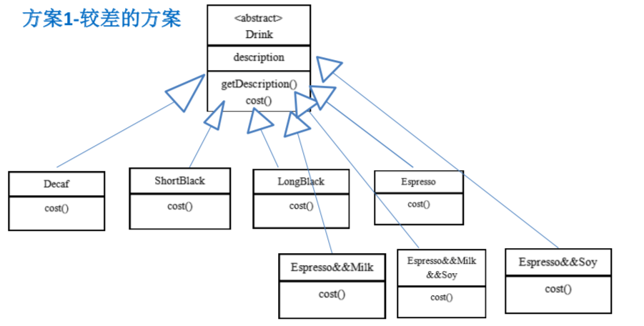
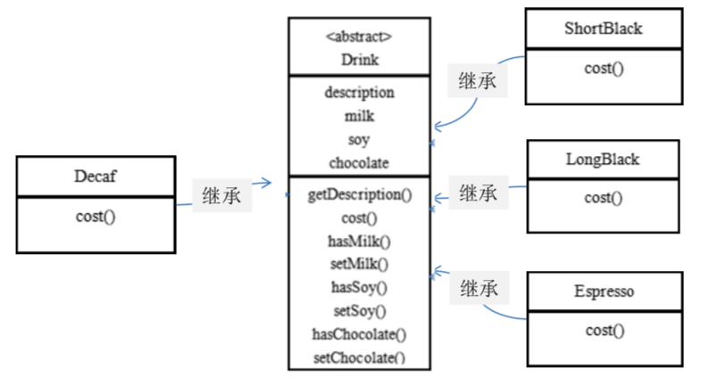
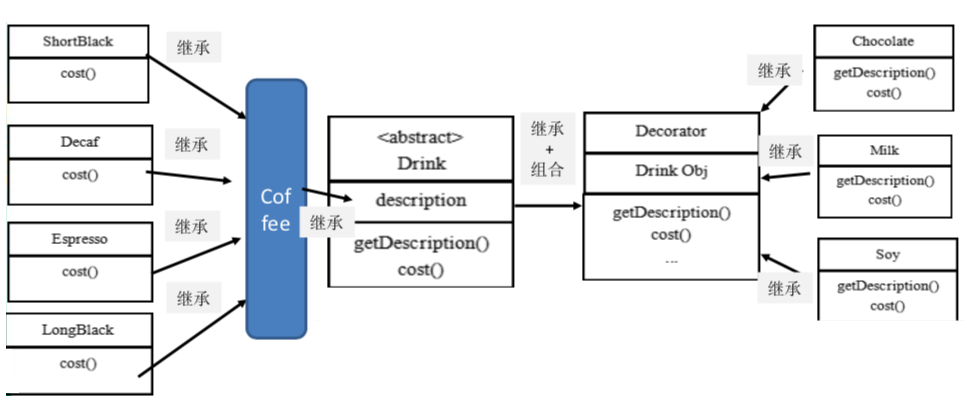
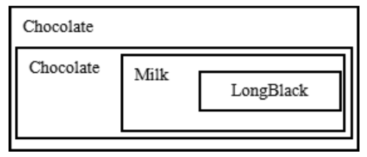
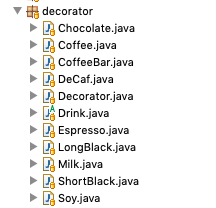
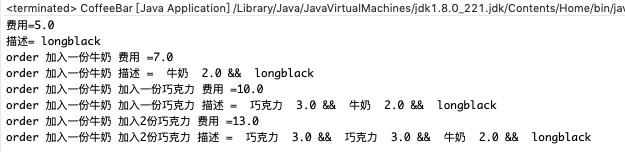
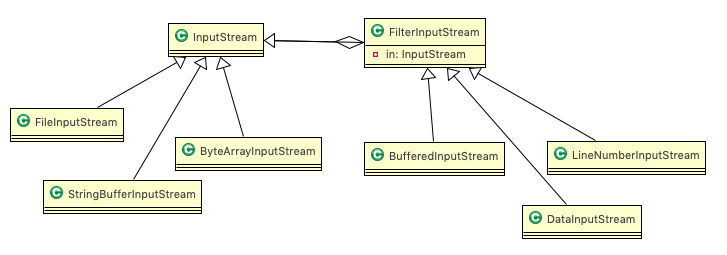

# 11.1星巴克咖啡订单项目(咖啡馆) 


1. 咖啡种类/单品咖啡:Espresso(意大利浓咖啡)、ShortBlack、LongBlack(美式咖啡)、Decaf(无因咖啡) 
2. 调料:Milk、Soy(豆浆)、Chocolate
3. 要求在扩展==新的咖啡种类==时，具有良好的扩展性、改动方便、维护方便 
4. 使用OO的来计算不同种类咖啡的费用:客户可以点单品咖啡，也可以单品咖啡+调料组合 


# 11.2 传统方案

## 11.2.1 方案1




## 11.2.2 方案1-问题分析 


1. Drink 是一个抽象类，表示饮料 

2. des 就是对咖啡的描述, 比如咖啡的名字 

3. cost() 方法就是计算费用，Drink 类中做成一个抽象方法。

4. Decaf 就是单品咖啡， 继承 Drink, 并实现 cost 

5. Espress && Milk 就是单品咖啡+调料， 这个组合很多 

6. 问题:这样设计，会有很多类，当我们==增加一个单品咖啡，或者一个新的调料，类的数量就会倍增==，就会出现 

   类爆炸 

   

## 11.2.3 方案2


前面分析到方案 1 因为==咖啡单品+调料组合==会造成类的倍增，因此可以做改进，将调料内置到 Drink 类，这样就==不会造成类数量过多==。从而提高项目的维护性(如图) 



说明: milk,soy,chocolate 可以设计为 Boolean,表示是否要添加相应的调料。


## 11.2.4 方案2-问题分析


1. 方案2可以控制类的数量，不至于造成很多的类
2. 在==增加或者删除调料种类时==，代码的维护量很大
3. 考虑到用户可以添加多份调料时，可以将hasMilk 返回一个对应int 
4. 虑使用==装饰者模式== 


# 11.3 装饰者模式

## 11.3.1 基本介绍


==动态的==将新功能==附加到对象上==。在对象功能扩展方面，它比继承更有弹性，装饰者模式也体现了==开闭原则(ocp)。==


## 11.3.2 装饰者模式(Decorator)原理 


1. 装饰者模式就像打包一个快递 

   主体:比如:陶瓷、衣服 (Component) // 被装饰者 

   包装:比如:报纸填充、塑料泡沫、纸板、木板(Decorator) 

2. Component主体:比如类似前面的Drink 

3. ConcreteComponent:具体的主体，比如前面的各个单品咖啡

4. Decorator: 装饰者，比如各调料

   

在如图的 Component 与 ConcreteComponent 之间，如果 ConcreteComponent 类很多,还可以设计一个缓冲层，将共有的部分提取出来，抽象层一个类。


## 11.3.3 装饰者模式解决星巴克咖啡订单 



1. Drink 类就是前面说的抽象类， Component 
2. ShortBlack 就单品咖啡 
3. Decorator 是一个装饰类，含有一个被装饰的对象(Drink obj) 
4. Decorator 的cost 方法进行一个费用的叠加计算，递归的计算价格 


## 11.3.4 装饰者模式下的订单


2 份巧克力+一份牛奶的 LongBlack 



1. Milk包含了LongBlack
2. 一份Chocolate包含了(Milk+LongBlack)
3. 一份Chocolate包含了(Chocolate+Milk+LongBlack)
4. 这样不管是什么形式的单品咖啡+调料组合，通过递归方式可以方便的组合和维护。 


## 11.3.5 代码实现




```java
package com.atguigu.decorator;
public abstract class Drink {
	public String des; // 描述
	private float price = 0.0f;
	public String getDes() {
		return des;
	}
	public void setDes(String des) {
		this.des = des;
	}
	public float getPrice() {
		return price;
	}
	public void setPrice(float price) {
		this.price = price;
	}
	//计算费用的抽象方法
	//子类来实现
	public abstract float cost();
}
```

```java
package com.atguigu.decorator;
public class Coffee extends Drink {
	@Override
	public float cost() {
		return super.getPrice();
	}
}
```

```java
package com.atguigu.decorator;
public class ShortBlack extends Coffee{
	public ShortBlack() {
		setDes(" shortblack ");
		setPrice(4.0f);
	}
}
```

```java
package com.atguigu.decorator;
public class DeCaf extends Coffee {
	public DeCaf() {
		setDes(" 无因咖啡 ");
		setPrice(1.0f);
	}
}
```

```java
package com.atguigu.decorator;
public class Espresso extends Coffee {
	public Espresso() {
		setDes(" 意大利咖啡 ");
		setPrice(6.0f);
	}
}
```

```java
package com.atguigu.decorator;
public class LongBlack extends Coffee {
	public LongBlack() {
		setDes(" longblack ");
		setPrice(5.0f);
	}
}
```


```java
package com.atguigu.decorator;
public class Decorator extends Drink {
	private Drink obj;
	public Decorator(Drink obj) { //组合
		this.obj = obj;
	}
	@Override
	public float cost() {
		// getPrice 自己价格
		return super.getPrice() + obj.cost();
	}
	
	@Override
	public String getDes() {
		// obj.getDes() 输出被装饰者的信息
		return des + " " + getPrice() + " && " + obj.getDes();
	}
}
```

```java
package com.atguigu.decorator;
//具体的Decorator， 这里就是调味品
public class Chocolate extends Decorator {
	public Chocolate(Drink obj) {
		super(obj);
		setDes(" 巧克力 ");
		setPrice(3.0f); // 调味品 的价格
	}
}
```

```java
package com.atguigu.decorator;
public class Milk extends Decorator {
	public Milk(Drink obj) {
		super(obj);
		setDes(" 牛奶 ");
		setPrice(2.0f); 
	}
}
```

```java
package com.atguigu.decorator;
public class Soy extends Decorator{
	public Soy(Drink obj) {
		super(obj);
		setDes(" 豆浆  ");
		setPrice(1.5f);
	}
}
```


```java
package com.atguigu.decorator;
public class CoffeeBar {
	public static void main(String[] args) {
		// 装饰者模式下的订单：2份巧克力+一份牛奶的LongBlack
		// 1. 点一份 LongBlack
		Drink order = new LongBlack();
		System.out.println("费用=" + order.cost());
		System.out.println("描述=" + order.getDes());

		// 2. order 加入一份牛奶
		order = new Milk(order);
		System.out.println("order 加入一份牛奶 费用 =" + order.cost());
		System.out.println("order 加入一份牛奶 描述 = " + order.getDes());

		// 3. order 加入一份巧克力
		order = new Chocolate(order);
		System.out.println("order 加入一份牛奶 加入一份巧克力 费用 =" + order.cost());
		System.out.println("order 加入一份牛奶 加入一份巧克力 描述 = " + order.getDes());

		// 4. order 再加入一份巧克力
		order = new Chocolate(order);
		System.out.println("order 加入一份牛奶 加入2份巧克力 费用 =" + order.cost());
		System.out.println("order 加入一份牛奶 加入2份巧克力 描述 = " + order.getDes());
	}
}
```




# 11.4 装饰者模式在 JDK 应用的源码分析 


Java的IO结构，FilterInputStream就是一个装饰者 



```java
public abstract class InputStream implements Closeable{} //是一个抽象类，即Component
public class FilterInputStream extends InputStream { //是一个装饰者类Decorator
    protected volatile InputStream in //被装饰的对象 
}
class DataInputStream extends FilterInputStream implements DataInput { //FilterInputStream 子类
```

```java
package com.atguigu.jdk;
import java.io.DataInputStream;
import java.io.FileInputStream;

public class Decorator {

	public static void main(String[] args) throws Exception{
		//说明
		//1. InputStream 是抽象类, 类似我们前面讲的 Drink
		//2. FileInputStream 是  InputStream 子类，类似我们前面的 DeCaf, LongBlack
		//3. FilterInputStream  是  InputStream 子类：类似我们前面 的 Decorator 修饰者
		//4. DataInputStream 是 FilterInputStream 子类，具体的修饰者，类似前面的 Milk, Soy 等
		//5. FilterInputStream 类 有  protected volatile InputStream in; 即含被装饰者
		//6. 分析得出在jdk 的io体系中，就是使用装饰者模式
		
		DataInputStream dis = new DataInputStream(new FileInputStream("d:\\abc.txt"));
		System.out.println(dis.read());
		dis.close();
	}
}
```

