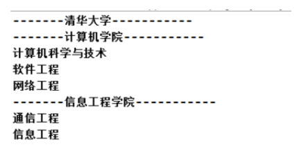
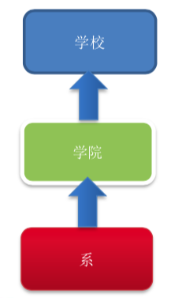
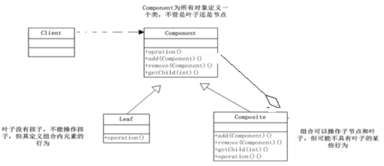
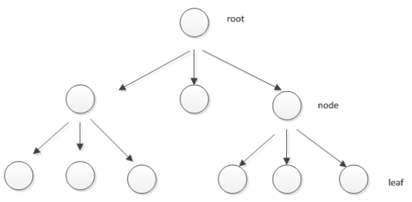
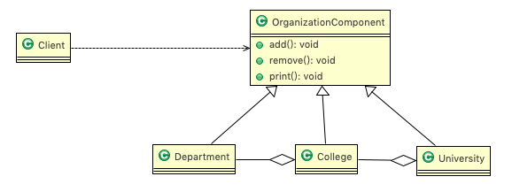
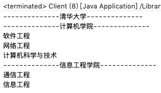
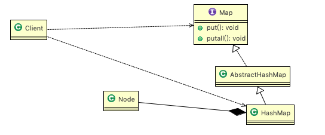

# 12.1 学校院系展示需求


编写程序展示一个学校院系结构:需求是这样，要在一个页面中展示出学校的院系组成，一个学校有多个学院，一个学院有多个系。如图:




# 12.2 传统方案解决

## 12.2.1 类图





## 12.2.2 问题分析 


1. 将==学院看做是学校的子类，系是学院的子类==，这样实际上是站在组织大小来进行分层次的 
2. 实际上我们的要求是 :在一个页面中展示出学校的院系组成，一个学校有多个学院，一个学院有多个系， 因此这种方案，==不能很好实现的管理的操作==，比如==对学院、系的添加，删除，遍历==等 
3. 解决方案:把学校、院、系都看做是==组织结构==，他们之间没有继承的关系，而是 一个树形结构，可以更好的实现管理操作。 => ==组合模式== 


# 12.3 组合模式

## 12.3.1 基本介绍


1. 组合模式(Composite Pattern)，又叫部分整体模式，它创建了对象组的树形结 构，将对象组合成树状结构以表示"==整体-部分=="的层次关系。 
2. 组合模式==依据树形结构来组合对象==，用来表示部分以及整体层次。 
3. 这种类型的设计模式属于结构型模式。 
4. 组合模式使得==用户对单个对象和组合对象的访问具有一致性==，即:组合能让客户以一致的方式处理个别对象以及组合对象。


## 12.3.2 原理类图





1. **Component** : 这是组合中对象声明接口，在适当情况下，实现所有类共有的接口默认行为，用于访问和管理 Component 子部件，Component 可以是抽象类或者接口。
2. **Leaf :** 在组合中表示叶子节点，叶子节点没有子节点。 
3. **Composite** : 非叶子节点， 用于存储子部件， 在 Component 删除。 


## 12.3.3 解决的问题 


当我们的要处理的对象可以生成一颗树形结构，而我们要对树上的节点和叶子进行操作时，它能够提供一致的方式，而不用考虑它是节点还是叶子。

 


## 12.3.4 解决学校院系的类图





## 12.3.5 代码实现


```java
package com.atguigu.composite;

public abstract class OrganizationComponent {

	private String name; // 名字
	private String des; // 说明
	
	protected  void add(OrganizationComponent organizationComponent) {
		//默认实现
		throw new UnsupportedOperationException();
	}
	
	protected  void remove(OrganizationComponent organizationComponent) {
		//默认实现
		throw new UnsupportedOperationException();
	}

	//构造器
	public OrganizationComponent(String name, String des) {
		super();
		this.name = name;
		this.des = des;
	}

	//setter getter...
	
	//方法print, 做成抽象的, 子类都需要实现
	protected abstract void print();
	
}
```


```java
package com.atguigu.composite;

import java.util.ArrayList;
import java.util.List;

//University 就是 Composite , 可以管理College
public class University extends OrganizationComponent {

	List<OrganizationComponent> organizationComponents = new ArrayList<OrganizationComponent>();

	// 构造器
	public University(String name, String des) {
		super(name, des);
	}

	// 重写add
	@Override
	protected void add(OrganizationComponent organizationComponent) {
		organizationComponents.add(organizationComponent);
	}

	// 重写remove
	@Override
	protected void remove(OrganizationComponent organizationComponent) {
		organizationComponents.remove(organizationComponent);
	}

	@Override
	public String getName() {
		return super.getName();
	}

	@Override
	public String getDes() {
		return super.getDes();
	}

	// print方法，就是输出University 包含的学院
	@Override
	protected void print() {
		System.out.println("--------------" + getName() + "--------------");
		//遍历 organizationComponents 
		for (OrganizationComponent organizationComponent : organizationComponents) {
			organizationComponent.print();
		}
	}

}
```

```java
package com.atguigu.composite;

import java.util.ArrayList;
import java.util.List;

public class College extends OrganizationComponent {

	//List 中 存放的Department
	List<OrganizationComponent> organizationComponents = new ArrayList<OrganizationComponent>();

	// 构造器
	public College(String name, String des) {
		super(name, des);
	}

	// 重写add
	@Override
	protected void add(OrganizationComponent organizationComponent) {
		//  将来实际业务中，Colleage 的 add 和  University add 不一定完全一样
		organizationComponents.add(organizationComponent);
	}

	// 重写remove
	@Override
	protected void remove(OrganizationComponent organizationComponent) {
		organizationComponents.remove(organizationComponent);
	}

	@Override
	public String getName() {
		return super.getName();
	}

	@Override
	public String getDes() {
		return super.getDes();
	}

	// print方法，就是输出University 包含的学院
	@Override
	protected void print() {
		System.out.println("--------------" + getName() + "--------------");
		//遍历 organizationComponents 
		for (OrganizationComponent organizationComponent : organizationComponents) {
			organizationComponent.print();
		}
	}
}
```

```java
package com.atguigu.composite;

public class Department extends OrganizationComponent {

	//没有集合
	
	public Department(String name, String des) {
		super(name, des);
	}

	//add , remove 就不用写了，因为他是叶子节点
	
	@Override
	public String getName() {
		return super.getName();
	}
	
	@Override
	public String getDes() {
		return super.getDes();
	}
	
	@Override
	protected void print() {
		System.out.println(getName());
	}
}
```


```java
package com.atguigu.composite;

public class Client {

	public static void main(String[] args) {
		//从大到小创建对象 学校
		OrganizationComponent university = new University("清华大学", " 中国顶级大学 ");
		
		//创建 学院
		OrganizationComponent computerCollege = new College("计算机学院", " 计算机学院 ");
		OrganizationComponent infoEngineercollege = new College("信息工程学院", " 信息工程学院 ");
		
		//创建各个学院下面的系(专业)
		computerCollege.add(new Department("软件工程", " 软件工程不错 "));
		computerCollege.add(new Department("网络工程", " 网络工程不错 "));
		computerCollege.add(new Department("计算机科学与技术", " 计算机科学与技术是老牌的专业 "));
		
		infoEngineercollege.add(new Department("通信工程", " 通信工程不好学 "));
		infoEngineercollege.add(new Department("信息工程", " 信息工程好学 "));
		
		//将学院加入到 学校
		university.add(computerCollege);
		university.add(infoEngineercollege);
		
		university.print();//学校打印
		//infoEngineercollege.print();
	}

}
```




# 12.4 在JDK集合的源码分析  


Java的集合类-HashMap就使用了组合模式 





# 12.5 组合模式的注意事项和细节 


1. 简化客户端操作。客户端只需要面对一致的对象而不用考虑整体部分或者节点叶子 的问题。 
2. 具有较强的扩展性。当我们要更改组合对象时，我们只需要调整内部的层次关系，客户端不用做出任何改动。
3. 方便创建出复杂的层次结构。客户端不用理会组合里面的组成细节，容易添加节点或者叶子从而创建出复杂的树形结构。
4. 需要==遍历组织机构，或者处理的对象具有树形结构时==，非常==适合使用组合模式==。
5. 要求较高的抽象性，==如果节点和叶子有很多差异性的话==，比如很多方法和属性都不一样，==不适合==使用组合模式。 