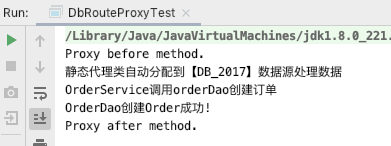
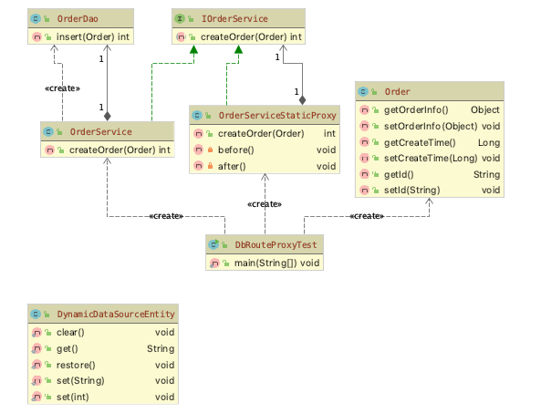
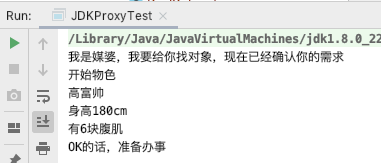
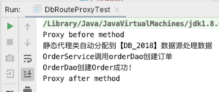
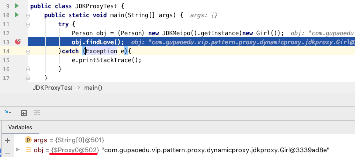
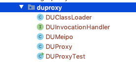
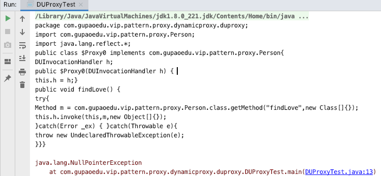
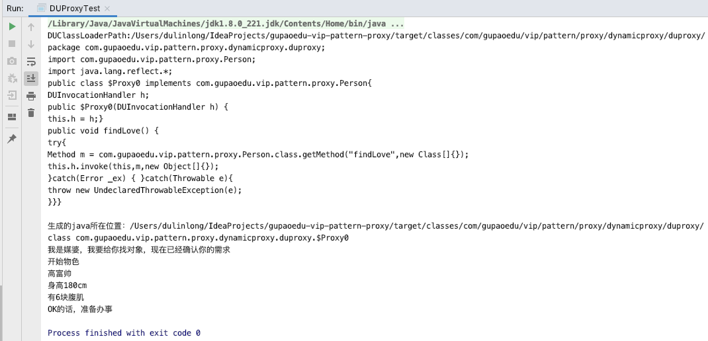

# 15.1 代理模式的应用场景


在生活中，我们经常见到这样的场景，如:租房中介、售票黄牛、婚介、经纪人、快递、 事务代理、非侵入式日志监听等，这些都是代理模式的实际体现。代理模式(Proxy Pattern)的定义也非常简单，是指为其他对象提供一种代理，以控制对这个对象的访问。 代理对象在客服端和目标对象之间起到中介作用，代理模式属于结构型设计模式。使用代理模式主要有两个目的:一保护目标对象，二增强目标对象。

我们每天都在用的一种静态代理模式：三层架构

对数据库进行分库分表


# 15.2 静态代理


在分布式业务场景中，我们通常会对数据库进行分库分表， 分库分表之后使用 Java 操作时，就可能需要配置多个数据源，我们通过设置数据源路由来动态切换数据源。先创建 Order 订单实体:

```java
package com.gupaoedu.vip.pattern.proxy.dbroute;
public class Order {
    private Object orderInfo;
    //订单创建时间进行按年分库
    private Long createTime;
    private String id;

    public Object getOrderInfo() {
        return orderInfo;
    }

    public void setOrderInfo(Object orderInfo) {
        this.orderInfo = orderInfo;
    }

    public Long getCreateTime() {
        return createTime;
    }

    public void setCreateTime(Long createTime) {
        this.createTime = createTime;
    }

    public String getId() {
        return id;
    }

    public void setId(String id) {
        this.id = id;
    }
}
```

创建 OrderDao 持久层操作类:

```java
public class OrderDao {
    public int insert(Order order){
        System.out.println("OrderDao创建Order成功!");
        return 1;
    }
}
```

创建 IOrderService 接口:

```java
public interface IOrderService {
    int createOrder(Order order);
}
```

创建 OrderService 实现类:

```java
public class OrderService implements IOrderService {
    private OrderDao orderDao;

    public OrderService(){
        //如果使用Spring应该是自动注入的
        //我们为了使用方便，在构造方法中将orderDao直接初始化了
        orderDao = new OrderDao();
    }

    public int createOrder(Order order) {
        System.out.println("OrderService调用orderDao创建订单");
        return orderDao.insert(order);
    }
}
```

接下来使用静态代理，主要完成的功能是，根据订单创建时间自动按年进行分库。根据开闭原则，原来写好的逻辑我们不去修改，通过代理对象来完成。先创建数据源路由对象，我们使用 ThreadLocal 的单例实现，DynamicDataSourceEntry 类:

```java
package com.gupaoedu.vip.pattern.proxy.dbroute.db;
public class DynamicDataSourceEntity {

    // 默认数据源
    public final static String DEFAULT_SOURCE = null;
    private final static ThreadLocal<String> local = new ThreadLocal<String>();

    private DynamicDataSourceEntity(){}

     // 清空数据源 
    public static void clear() { local.remove(); }

    //获取当前正在使用的数据源名字
    public static String get() { return local.get(); }

    //还原当前切面的数据源 
    public static void restore() { local.set(DEFAULT_SOURCE); }

     //设置已知名字的数据源
    public static void set(String source) { local.set(source); }

     //根据年份动态设置数据源 
    public static void set(int year) { local.set("DB_" + year); } 
}                                        
```

创建切换数据源的代理 OrderServiceSaticProxy 类:

```java
package com.gupaoedu.vip.pattern.proxy.dbroute.proxy;
public class OrderServiceStaticProxy implements IOrderService {
    private SimpleDateFormat yearFormat = new SimpleDateFormat("yyyy");

    private IOrderService orderService;

    public OrderServiceStaticProxy(IOrderService orderService) {
        this.orderService = orderService;
    }

    public int createOrder(Order order) {
        before();
        Long time = order.getCreateTime();
        Integer dbRouter = Integer.valueOf(yearFormat.format(new Date(time)));
        System.out.println("静态代理类自动分配到【DB_" + dbRouter + "】数据源处理数据");
        DynamicDataSourceEntity.set(dbRouter);

        this.orderService.createOrder(order);
        DynamicDataSourceEntity.restore();
        after();
        return 0;
    }

    private void before() {
        System.out.println("Proxy before method.");
    }

    private void after() {
        System.out.println("Proxy after method.");
    }
}
```

来看测试代码:

```java
package com.gupaoedu.vip.pattern.proxy.dbroute;
public class DbRouteProxyTest {
    public static void main(String[] args) {
        try {
            Order order = new Order();
            SimpleDateFormat sdf = new SimpleDateFormat("yyyy/MM/dd");
            Date date = sdf.parse("2017/02/01");
            order.setCreateTime(date.getTime());
            
            OrderServiceStaticProxy orderService = new OrderServiceStaticProxy(new OrderService());
            orderService.createOrder(order);
        } catch (Exception e) {
            e.printStackTrace();
        }

    }
}
```

运行效果:



符合我们的预期效果。现在我们再来回顾一下类图，看是不是和我们最先画的类结构一致:




# 15.3 动态代理


动态代理和静态对比基本思路是一致的，只不过动态代理功能更加强大，随着业务的扩展适应性更强。如果还以找对象为例，使用动态代理相当于是能够适应复杂的业务场景。 不仅仅只是父亲给儿子找对象，如果找对象这项业务发展成了一个产业，进而出现了媒婆、婚介所等这样的形式。那么，此时用静态代理成本就更大了，需要一个更加通用的解决方案，要满足任何单身人士找对象的需求。我们升级一下代码，先来看 JDK 实现方式:


## 15.3.1 JDK 实现方式


创建媒婆(婚介)JDKMeipo 类:

```java
package com.gupaoedu.vip.pattern.proxy.dynamicproxy.jdkproxy;
public class JDKMeipo implements InvocationHandler {

    private Object target;
    public Object getInstance(Object target) throws Exception{
        this.target = target;
        Class<?> clazz = target.getClass();
        return Proxy.newProxyInstance(clazz.getClassLoader(),clazz.getInterfaces(),this);
    }

    public Object invoke(Object proxy, Method method, Object[] args) throws Throwable {
        before();
        Object obj = method.invoke(this.target,args);
        after();
       return obj;
    }

    private void before(){
        System.out.println("我是媒婆，我要给你找对象，现在已经确认你的需求");
        System.out.println("开始物色");
    }

    private void after(){
        System.out.println("OK的话，准备办事");
    }
}
```

创建单身客户 Girl 类:

```java
package com.gupaoedu.vip.pattern.proxy.dynamicproxy.jdkproxy;
public class Girl implements Person {
    public void findLove() {
        System.out.println("高富帅");
        System.out.println("身高180cm");
        System.out.println("有6块腹肌");
    }
}
```

测试代码:

```java
package com.gupaoedu.vip.pattern.proxy.dynamicproxy.jdkproxy;
public class JDKProxyTest {

    public static void main(String[] args) {
        try {
            Person obj = (Person) new JDKMeipo().getInstance(new Girl());
            obj.findLove();
        }catch (Exception e){
            e.printStackTrace();
        }
    }
}
```

运行结果：



上面的案例理解了话，我们再来看数据源动态路由业务，帮助小伙伴们对动态代理加深 一下印象。创建动态代理的类 OrderServiceJDKDynamicProxy，代码如下:

```java
package com.gupaoedu.vip.pattern.proxy.dbroute.proxy;
public class OrderServiceJDKDynamicProxy implements InvocationHandler {

    private SimpleDateFormat yearFormat = new SimpleDateFormat("yyyy");
    Object proxyObj;

    public Object getInstance(Object target){
        this.proxyObj = target;
        Class<?> clazz = target.getClass();
        return Proxy.newProxyInstance(clazz.getClassLoader(),clazz.getInterfaces(),this);
    }

    public Object invoke(Object proxy, Method method, Object[] args) throws Throwable {
        before(args[0]);
        Object object = method.invoke(proxyObj,args);
        after();
        return object;
    }

    private void after() {
        System.out.println("Proxy after method");
        //还原成默认的数据源
        DynamicDataSourceEntity.restore();
    }

    //target 应该是订单对象Order
    private void before(Object target) {
        try {
            //进行数据源的切换
            System.out.println("Proxy before method");

            //约定优于配置
            Long time = (Long) target.getClass().getMethod("getCreateTime").invoke(target);
            Integer dbRouter = Integer.valueOf(yearFormat.format(new Date(time)));
            System.out.println("静态代理类自动分配到【DB_" + dbRouter + "】数据源处理数据");
            DynamicDataSourceEntity.set(dbRouter);
        }catch (Exception e){
            e.printStackTrace();
        }
    }
}
```

测试代码:

```java
package com.gupaoedu.vip.pattern.proxy.dbroute;
public class DbRouteProxyTest {
    public static void main(String[] args) {
        try {
            Order order = new Order();
            SimpleDateFormat sdf = new SimpleDateFormat("yyyy/MM/dd");
            Date date = sdf.parse("2018/02/01");
            order.setCreateTime(date.getTime());

            IOrderService orderService = (IOrderService) new OrderServiceJDKDynamicProxy().getInstance(new OrderService());
//            OrderServiceStaticProxy orderService = new OrderServiceStaticProxy(new OrderService());
            orderService.createOrder(order);
        } catch (Exception e) {
            e.printStackTrace();
        }
    }
}
```

运行结果：



依然能够达到相同运行效果。但是，动态代理实现之后，我们不仅能实现 Order 的数据源动态路由，还可以实现其他任何类的数据源路由。当然，有比较重要的约定，必须要求实现 getCreateTime()方法，因为路由规则是根据时间来运算的。当然，我们可以通过接口规范来达到约束的目的，在此就不再举例。


## 15.3.2 高仿真 JDK Proxy 手写实现


不仅知其然，还得知其所以然。既然 JDK Proxy 功能如此强大，那么它是如何实现的呢? 我们现在来探究一下原理，并模仿 JDK Proxy 自己动手写一个属于自己的动态代理。 我们都知道 JDK Proxy 采用字节重组，重新生的对象来替代原始的对象以达到动态代理 的目的。JDK Proxy 生成对象的步骤如下:

1. ==拿到被代理对象的引用，并且获取到它的所有的接口，反射获取。==
2. ==JDK Proxy 类重新生成一个新的类、同时新的类要实现被代理类所有实现的所有的接口。==
3. ==动态生成 Java 代码，把新加的业务逻辑方法由一定的逻辑代码去调用(在代码中体 现)。==
4. ==编译新生成的 Java 代码.class。==
5. ==再重新加载到 JVM 中运行。==

以上这个过程就叫字节码重组。



可以看出生成了一个 $Proxy0 的对象。

JDK 中有一个规范，在 ClassPath 下只要是$开头的 class 文件一般都是自动生成的。那么我们有没有办法看到代替后的对象的真容呢?做一个这样测试，我们从内存中的对象字节码通过文件流输出到一个新的 class 文件。来看测试代码:

```java
package com.gupaoedu.vip.pattern.proxy.dynamicproxy.jdkproxy;
public class JDKProxyTest {
    public static void main(String[] args) {
        try {
            Person obj = (Person) new JDKMeipo().getInstance(new Girl());
            obj.findLove();

            //$Proxy0
            byte [] bytes = ProxyGenerator.generateProxyClass("$Proxy0",new Class[]{Person.class});
            FileOutputStream os = new FileOutputStream("$Proxy0.class");
            os.write(bytes);
            os.close();
        }catch (Exception e){
            e.printStackTrace();
        }
    }
}
```

运行之后，看到工程下生成了$Proxy0.class。


利用反编译工具查看 class 的源代码(idea自带反编译，所以在idea中可以直接查看)。

```java
//
// Source code recreated from a .class file by IntelliJ IDEA
// (powered by Fernflower decompiler)
//

import com.gupaoedu.vip.pattern.proxy.Person;
import java.lang.reflect.InvocationHandler;
import java.lang.reflect.Method;
import java.lang.reflect.Proxy;
import java.lang.reflect.UndeclaredThrowableException;

public final class $Proxy0 extends Proxy implements Person {
    private static Method m1;
    private static Method m3;
    private static Method m2;
    private static Method m0;

    public $Proxy0(InvocationHandler var1) throws  {
        super(var1);
    }

    public final boolean equals(Object var1) throws  {
        try {
            return (Boolean)super.h.invoke(this, m1, new Object[]{var1});
        } catch (RuntimeException | Error var3) {
            throw var3;
        } catch (Throwable var4) {
            throw new UndeclaredThrowableException(var4);
        }
    }

    public final void findLove() throws  {
        try {
            super.h.invoke(this, m3, (Object[])null);
        } catch (RuntimeException | Error var2) {
            throw var2;
        } catch (Throwable var3) {
            throw new UndeclaredThrowableException(var3);
        }
    }

    public final String toString() throws  {
        try {
            return (String)super.h.invoke(this, m2, (Object[])null);
        } catch (RuntimeException | Error var2) {
            throw var2;
        } catch (Throwable var3) {
            throw new UndeclaredThrowableException(var3);
        }
    }

    public final int hashCode() throws  {
        try {
            return (Integer)super.h.invoke(this, m0, (Object[])null);
        } catch (RuntimeException | Error var2) {
            throw var2;
        } catch (Throwable var3) {
            throw new UndeclaredThrowableException(var3);
        }
    }

    static {
        try {
            m1 = Class.forName("java.lang.Object").getMethod("equals", Class.forName("java.lang.Object"));
            m3 = Class.forName("com.gupaoedu.vip.pattern.proxy.Person").getMethod("findLove");
            m2 = Class.forName("java.lang.Object").getMethod("toString");
            m0 = Class.forName("java.lang.Object").getMethod("hashCode");
        } catch (NoSuchMethodException var2) {
            throw new NoSuchMethodError(var2.getMessage());
        } catch (ClassNotFoundException var3) {
            throw new NoClassDefFoundError(var3.getMessage());
        }
    }
}
```

我们发现$Proxy0 继承了 Proxy 类，同时还实现了我们的 Person 接口，而且重写了 `findLove()`等方法。而且在静态块中用反射查找到了目标对象的所有方法，而且保存了所有方法的引用，再重写的方法用反射调用目标对象的方法。

`findLove() `中调用了`super.h.invoke(this, m3, (Object[])null)`，这个 h 是什么？我么看下 Proxy类中的定义

```java
protected InvocationHandler h;
public static Object newProxyInstance(ClassLoader loader,
                                          Class<?>[] interfaces,
                                          InvocationHandler h)
```

是由 `newProxyInstance`方法的第三个参数传入的，也就是将自己写的 JDKMeipo类传入。

```java
public Object getInstance(Object target) throws Exception{
    this.target = target;
    Class<?> clazz = target.getClass();
    return Proxy.newProxyInstance(clazz.getClassLoader(),clazz.getInterfaces(),this);
}
```

相当于调用 `$Proxy0.findlove()`就调用了 `JDKMeipo.invoke()`方法


小伙伴们此时一定在好奇， 这些代码是哪里来的呢?其实是 JDK 帮我们自动生成的。现在，我们根据 JDKMeipo中所需的JDK类，我们全部自己实现，自己来动态生成源代码、动态完成编译，然后，替代目标对象并执行。


首先替换为自己的类，打好架子



替换 JDKMeipo，都采用自己的实现类：

```java
package com.gupaoedu.vip.pattern.proxy.dynamicproxy.duproxy;
import java.lang.reflect.Method;
public class DUMeipo implements DUInvocationHandler {

    private Object target;

    public Object getInstance(Object target) throws Exception {
        this.target = target;
        Class<?> clazz = target.getClass();
        return DUProxy.newProxyInstance(new DUClassLoader(), clazz.getInterfaces(), this);
    }

    public Object invoke(Object proxy, Method method, Object[] args) throws Throwable {
        before();
        Object obj = method.invoke(this.target, args);
        after();
        return obj;
    }

    private void before() {
        System.out.println("我是媒婆，我要给你找对象，现在已经确认你的需求");
        System.out.println("开始物色");
    }

    private void after() {
        System.out.println("OK的话，准备办事");
    }
}
```

```java
import java.lang.reflect.Method;
public interface DUInvocationHandler {
    public Object invoke(Object proxy, Method method, Object[] args)
            throws Throwable;
}
```

```java
public class DUProxy {

    public static Object newProxyInstance(DUClassLoader loader,
                                          Class<?>[] interfaces,
                                          DUInvocationHandler h) {
        return null;
    }
}
```

```java
public class DUClassLoader {
}
```

```java
import com.gupaoedu.vip.pattern.proxy.Person;
import com.gupaoedu.vip.pattern.proxy.dynamicproxy.jdkproxy.Girl;
public class DUProxyTest {

    public static void main(String[] args) {
        try {

            //JDK动态代理的实现原理
            Person obj = (Person) new DUMeipo().getInstance(new Girl());
            System.out.println(obj.getClass());
            obj.findLove();

        }catch (Exception e){
            e.printStackTrace();
        }
    }
}
```

这样程序不报错，我们就把架子搭好了，然后进行填充：

首先填充 DUProxy类，此类的功能主要是生成代理类：

```java
package com.gupaoedu.vip.pattern.proxy.dynamicproxy.duproxy;

import java.lang.reflect.Method;
import java.util.HashMap;
import java.util.Map;

public class DUProxy {

    public static final String ln = "\r\n";

    public static Object newProxyInstance(DUClassLoader loader,
                                          Class<?>[] interfaces,
                                          DUInvocationHandler h) {

        //1.动态生成源码
        String src = genateSrc(interfaces);
        System.out.println(src);
        return null;
    }

    //参考之前的$Proxy0这个对象
    private static String genateSrc(Class<?>[] interfaces) {
        StringBuffer sb = new StringBuffer();
        sb.append("package com.gupaoedu.vip.pattern.proxy.dynamicproxy.duproxy;" + ln);
        sb.append("import com.gupaoedu.vip.pattern.proxy.Person;" + ln);
        sb.append("import java.lang.reflect.*;" + ln);
        sb.append("public class $Proxy0 implements " + interfaces[0].getName() + "{" + ln);
        sb.append("DUInvocationHandler h;" + ln);
        sb.append("public $Proxy0(DUInvocationHandler h) { " + ln);
        sb.append("this.h = h;");
        sb.append("}" + ln);
        for (Method m : interfaces[0].getMethods()){
            Class<?>[] params = m.getParameterTypes();

            StringBuffer paramNames = new StringBuffer();
            StringBuffer paramValues = new StringBuffer();
            StringBuffer paramClasses = new StringBuffer();

            for (int i = 0; i < params.length; i++) {
                Class clazz = params[i];
                String type = clazz.getName();
                String paramName = toLowerFirstCase(clazz.getSimpleName());
                paramNames.append(type + " " +  paramName);
                paramValues.append(paramName);
                paramClasses.append(clazz.getName() + ".class");
                if(i > 0 && i < params.length-1){
                    paramNames.append(",");
                    paramClasses.append(",");
                    paramValues.append(",");
                }
            }

            sb.append("public " + m.getReturnType().getName() + " " + m.getName() + "(" + paramNames.toString() + ") {" + ln);
            sb.append("try{" + ln);
            sb.append("Method m = " + interfaces[0].getName() + ".class.getMethod(\"" + m.getName() + "\",new Class[]{" + paramClasses.toString() + "});" + ln);
            sb.append((hasReturnValue(m.getReturnType()) ? "return " : "") + getCaseCode("this.h.invoke(this,m,new Object[]{" + paramValues + "})",m.getReturnType()) + ";" + ln);
            sb.append("}catch(Error _ex) { }");
            sb.append("catch(Throwable e){" + ln);
            sb.append("throw new UndeclaredThrowableException(e);" + ln);
            sb.append("}");
            sb.append(getReturnEmptyCode(m.getReturnType()));
            sb.append("}");
        }
        sb.append("}" + ln);
        return sb.toString();
    }
    private static Map<Class,Class> mappings = new HashMap<Class, Class>();
    static {
        mappings.put(int.class,Integer.class);
    }

    private static String getReturnEmptyCode(Class<?> returnClass){
        if(mappings.containsKey(returnClass)){
            return "return 0;";
        }else if(returnClass == void.class){
            return "";
        }else {
            return "return null;";
        }
    }

    private static String getCaseCode(String code,Class<?> returnClass){
        if(mappings.containsKey(returnClass)){
            return "((" + mappings.get(returnClass).getName() +  ")" + code + ")." + returnClass.getSimpleName() + "Value()";
        }
        return code;
    }

    private static boolean hasReturnValue(Class<?> clazz){
        return clazz != void.class;
    }

    private static String toLowerFirstCase(String src){
        char [] chars = src.toCharArray();
        chars[0] += 32;
        return String.valueOf(chars);
    }
}
```

这样我们就完成了自动生成 $Proxy0 的第一步

运行测试程序可以看到



复制出来放到自建的 $Proxy0.java 中是否报错，进而调整。


后续步骤：

```java
package com.gupaoedu.vip.pattern.proxy.dynamicproxy.duproxy;

import javax.tools.JavaCompiler;
import javax.tools.StandardJavaFileManager;
import javax.tools.ToolProvider;
import java.io.File;
import java.io.FileWriter;
import java.lang.reflect.Constructor;
import java.lang.reflect.Method;
import java.util.HashMap;
import java.util.Map;

public class DUProxy {

    public static final String ln = "\r\n";

    public static Object newProxyInstance(DUClassLoader loader,
                                          Class<?>[] interfaces,
                                          DUInvocationHandler h) {
        try{
            //1.动态生成源码
            String src = genateSrc(interfaces);
            System.out.println(src);

            //2、Java文件输出磁盘
            String filePath = DUProxy.class.getResource("").getPath();
            System.out.println("生成的java所在位置："+ filePath);// /target目录下生成.java文件
            File f = new File(filePath + "$Proxy0.java");
            FileWriter fw = new FileWriter(f);
            fw.write(src);
            fw.flush();
            fw.close();
            //3、把生成的.java文件编译成.class文件
            JavaCompiler compiler = ToolProvider.getSystemJavaCompiler();
            StandardJavaFileManager manage = compiler.getStandardFileManager(null,null,null);
            Iterable iterable = manage.getJavaFileObjects(f);

            JavaCompiler.CompilationTask task = compiler.getTask(null,manage,null,null,null,iterable);
            task.call();
            manage.close();

            //4、编译生成的.class文件加载到JVM中来
            Class proxyClass =  loader.findClass("$Proxy0");
            Constructor c = proxyClass.getConstructor(DUInvocationHandler.class);
            f.delete();

            //5、返回字节码重组以后的新的代理对象
            return c.newInstance(h);

        }catch (Exception e){}


        return null;
    }

    //参考之前的$Proxy0这个对象
    private static String genateSrc(Class<?>[] interfaces) {
        StringBuffer sb = new StringBuffer();
        sb.append("package com.gupaoedu.vip.pattern.proxy.dynamicproxy.duproxy;" + ln);
        sb.append("import com.gupaoedu.vip.pattern.proxy.Person;" + ln);
        sb.append("import java.lang.reflect.*;" + ln);
        sb.append("public class $Proxy0 implements " + interfaces[0].getName() + "{" + ln);
        sb.append("DUInvocationHandler h;" + ln);
        sb.append("public $Proxy0(DUInvocationHandler h) { " + ln);
        sb.append("this.h = h;");
        sb.append("}" + ln);
        for (Method m : interfaces[0].getMethods()){
            Class<?>[] params = m.getParameterTypes();

            StringBuffer paramNames = new StringBuffer();
            StringBuffer paramValues = new StringBuffer();
            StringBuffer paramClasses = new StringBuffer();

            for (int i = 0; i < params.length; i++) {
                Class clazz = params[i];
                String type = clazz.getName();
                String paramName = toLowerFirstCase(clazz.getSimpleName());
                paramNames.append(type + " " +  paramName);
                paramValues.append(paramName);
                paramClasses.append(clazz.getName() + ".class");
                if(i > 0 && i < params.length-1){
                    paramNames.append(",");
                    paramClasses.append(",");
                    paramValues.append(",");
                }
            }

            sb.append("public " + m.getReturnType().getName() + " " + m.getName() + "(" + paramNames.toString() + ") {" + ln);
            sb.append("try{" + ln);
            sb.append("Method m = " + interfaces[0].getName() + ".class.getMethod(\"" + m.getName() + "\",new Class[]{" + paramClasses.toString() + "});" + ln);
            sb.append((hasReturnValue(m.getReturnType()) ? "return " : "") + getCaseCode("this.h.invoke(this,m,new Object[]{" + paramValues + "})",m.getReturnType()) + ";" + ln);
            sb.append("}catch(Error _ex) { }");
            sb.append("catch(Throwable e){" + ln);
            sb.append("throw new UndeclaredThrowableException(e);" + ln);
            sb.append("}");
            sb.append(getReturnEmptyCode(m.getReturnType()));
            sb.append("}");
        }
        sb.append("}" + ln);
        return sb.toString();
    }
    private static Map<Class,Class> mappings = new HashMap<Class, Class>();
    static {
        mappings.put(int.class,Integer.class);
    }

    private static String getReturnEmptyCode(Class<?> returnClass){
        if(mappings.containsKey(returnClass)){
            return "return 0;";
        }else if(returnClass == void.class){
            return "";
        }else {
            return "return null;";
        }
    }

    private static String getCaseCode(String code,Class<?> returnClass){
        if(mappings.containsKey(returnClass)){
            return "((" + mappings.get(returnClass).getName() +  ")" + code + ")." + returnClass.getSimpleName() + "Value()";
        }
        return code;
    }

    private static boolean hasReturnValue(Class<?> clazz){
        return clazz != void.class;
    }

    private static String toLowerFirstCase(String src){
        char [] chars = src.toCharArray();
        chars[0] += 32;
        return String.valueOf(chars);
    }
}
```

```java
package com.gupaoedu.vip.pattern.proxy.dynamicproxy.duproxy;

import java.io.ByteArrayOutputStream;
import java.io.File;
import java.io.FileInputStream;

public class DUClassLoader extends ClassLoader{
    private File classPathFile;
    public DUClassLoader(){
        String classPath = DUClassLoader.class.getResource("").getPath();
        System.out.println("DUClassLoaderPath:"+classPath);
        this.classPathFile = new File(classPath);
    }

    @Override
    protected Class<?> findClass(String name) throws ClassNotFoundException {

        String className = DUClassLoader.class.getPackage().getName() + "." + name;
        if(classPathFile  != null){
            File classFile = new File(classPathFile,name.replaceAll("\\.","/") + ".class");
            if(classFile.exists()){
                FileInputStream in = null;
                ByteArrayOutputStream out = null;
                try{
                    in = new FileInputStream(classFile);
                    out = new ByteArrayOutputStream();
                    byte [] buff = new byte[1024];
                    int len;
                    while ((len = in.read(buff)) != -1){
                        out.write(buff,0,len);
                    }
                    return defineClass(className,out.toByteArray(),0,out.size());
                }catch (Exception e){
                    e.printStackTrace();
                }
            }
        }
        return null;
    }
}
```

运行测试程序：

| dddddddddddddddddddddddddddddddddddddddddddddddddddddddddddddddddddddddddddddddddddddddddddddddddddddddddd | d    |
| ------------------------------------------------------------ | ---- |
|  |      |

到此，手写 JDK 动态代理就完成了。

