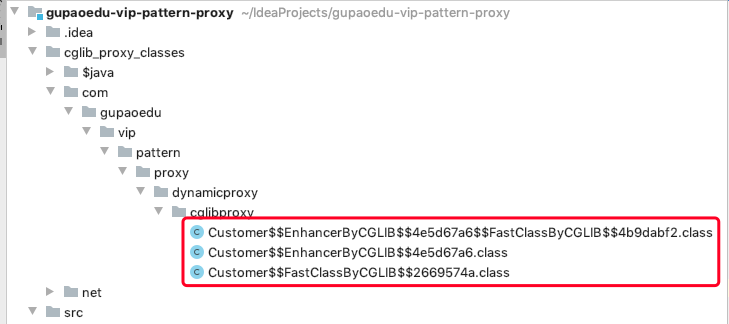
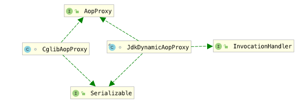

# 15.1 代理模式的应用场景


在生活中，我们经常见到这样的场景，如:租房中介、售票黄牛、婚介、经纪人、快递、 事务代理、非侵入式日志监听等，这些都是代理模式的实际体现。代理模式(Proxy Pattern)的定义也非常简单，是指为其他对象提供一种代理，以控制对这个对象的访问。 代理对象在客服端和目标对象之间起到中介作用，代理模式属于结构型设计模式。使用代理模式主要有两个目的:一保护目标对象，二增强目标对象。

我们每天都在用的一种静态代理模式：三层架构

对数据库进行分库分表


# 15.2 静态代理


在分布式业务场景中，我们通常会对数据库进行分库分表， 分库分表之后使用 Java 操作时，就可能需要配置多个数据源，我们通过设置数据源路由来动态切换数据源。先创建 Order 订单实体:

```java
package com.gupaoedu.vip.pattern.proxy.dbroute;
public class Order {
    private Object orderInfo;
    //订单创建时间进行按年分库
    private Long createTime;
    private String id;

    public Object getOrderInfo() {
        return orderInfo;
    }

    public void setOrderInfo(Object orderInfo) {
        this.orderInfo = orderInfo;
    }

    public Long getCreateTime() {
        return createTime;
    }

    public void setCreateTime(Long createTime) {
        this.createTime = createTime;
    }

    public String getId() {
        return id;
    }

    public void setId(String id) {
        this.id = id;
    }
}
```

创建 OrderDao 持久层操作类:

```java
public class OrderDao {
    public int insert(Order order){
        System.out.println("OrderDao创建Order成功!");
        return 1;
    }
}
```

创建 IOrderService 接口:

```java
public interface IOrderService {
    int createOrder(Order order);
}
```

创建 OrderService 实现类:

```java
public class OrderService implements IOrderService {
    private OrderDao orderDao;

    public OrderService(){
        //如果使用Spring应该是自动注入的
        //我们为了使用方便，在构造方法中将orderDao直接初始化了
        orderDao = new OrderDao();
    }

    public int createOrder(Order order) {
        System.out.println("OrderService调用orderDao创建订单");
        return orderDao.insert(order);
    }
}
```

接下来使用静态代理，主要完成的功能是，根据订单创建时间自动按年进行分库。根据开闭原则，原来写好的逻辑我们不去修改，通过代理对象来完成。先创建数据源路由对象，我们使用 ThreadLocal 的单例实现，DynamicDataSourceEntry 类:

```java
package com.gupaoedu.vip.pattern.proxy.dbroute.db;
public class DynamicDataSourceEntity {

    // 默认数据源
    public final static String DEFAULT_SOURCE = null;
    private final static ThreadLocal<String> local = new ThreadLocal<String>();

    private DynamicDataSourceEntity(){}

     // 清空数据源 
    public static void clear() { local.remove(); }

    //获取当前正在使用的数据源名字
    public static String get() { return local.get(); }

    //还原当前切面的数据源 
    public static void restore() { local.set(DEFAULT_SOURCE); }

     //设置已知名字的数据源
    public static void set(String source) { local.set(source); }

     //根据年份动态设置数据源 
    public static void set(int year) { local.set("DB_" + year); } 
}                                        
```

创建切换数据源的代理 OrderServiceSaticProxy 类:

```java
package com.gupaoedu.vip.pattern.proxy.dbroute.proxy;
public class OrderServiceStaticProxy implements IOrderService {
    private SimpleDateFormat yearFormat = new SimpleDateFormat("yyyy");

    private IOrderService orderService;

    public OrderServiceStaticProxy(IOrderService orderService) {
        this.orderService = orderService;
    }

    public int createOrder(Order order) {
        before();
        Long time = order.getCreateTime();
        Integer dbRouter = Integer.valueOf(yearFormat.format(new Date(time)));
        System.out.println("静态代理类自动分配到【DB_" + dbRouter + "】数据源处理数据");
        DynamicDataSourceEntity.set(dbRouter);

        this.orderService.createOrder(order);
        DynamicDataSourceEntity.restore();
        after();
        return 0;
    }

    private void before() {
        System.out.println("Proxy before method.");
    }

    private void after() {
        System.out.println("Proxy after method.");
    }
}
```

来看测试代码:

```java
package com.gupaoedu.vip.pattern.proxy.dbroute;
public class DbRouteProxyTest {
    public static void main(String[] args) {
        try {
            Order order = new Order();
            SimpleDateFormat sdf = new SimpleDateFormat("yyyy/MM/dd");
            Date date = sdf.parse("2017/02/01");
            order.setCreateTime(date.getTime());
            
            OrderServiceStaticProxy orderService = new OrderServiceStaticProxy(new OrderService());
            orderService.createOrder(order);
        } catch (Exception e) {
            e.printStackTrace();
        }

    }
}
```

运行效果:


符合我们的预期效果。现在我们再来回顾一下类图，看是不是和我们最先画的类结构一致:


# 15.3 动态代理


动态代理和静态对比基本思路是一致的，只不过动态代理功能更加强大，随着业务的扩展适应性更强。如果还以找对象为例，使用动态代理相当于是能够适应复杂的业务场景。 不仅仅只是父亲给儿子找对象，如果找对象这项业务发展成了一个产业，进而出现了媒婆、婚介所等这样的形式。那么，此时用静态代理成本就更大了，需要一个更加通用的解决方案，要满足任何单身人士找对象的需求。我们升级一下代码，先来看 JDK 实现方式:


## 15.3.1 JDK 实现方式


创建媒婆(婚介)JDKMeipo 类:

```java
package com.gupaoedu.vip.pattern.proxy.dynamicproxy.jdkproxy;
public class JDKMeipo implements InvocationHandler {

    private Object target;
    public Object getInstance(Object target) throws Exception{
        this.target = target;
        Class<?> clazz = target.getClass();
        return Proxy.newProxyInstance(clazz.getClassLoader(),clazz.getInterfaces(),this);
    }

    public Object invoke(Object proxy, Method method, Object[] args) throws Throwable {
        before();
        Object obj = method.invoke(this.target,args);
        after();
       return obj;
    }

    private void before(){
        System.out.println("我是媒婆，我要给你找对象，现在已经确认你的需求");
        System.out.println("开始物色");
    }

    private void after(){
        System.out.println("OK的话，准备办事");
    }
}
```

创建单身客户 Girl 类:

```java
package com.gupaoedu.vip.pattern.proxy.dynamicproxy.jdkproxy;
public class Girl implements Person {
    public void findLove() {
        System.out.println("高富帅");
        System.out.println("身高180cm");
        System.out.println("有6块腹肌");
    }
}
```

测试代码:

```java
package com.gupaoedu.vip.pattern.proxy.dynamicproxy.jdkproxy;
public class JDKProxyTest {

    public static void main(String[] args) {
        try {
            Person obj = (Person) new JDKMeipo().getInstance(new Girl());
            obj.findLove();
        }catch (Exception e){
            e.printStackTrace();
        }
    }
}
```

运行结果：


上面的案例理解了话，我们再来看数据源动态路由业务，帮助小伙伴们对动态代理加深 一下印象。创建动态代理的类 OrderServiceJDKDynamicProxy，代码如下:

```java
package com.gupaoedu.vip.pattern.proxy.dbroute.proxy;
public class OrderServiceJDKDynamicProxy implements InvocationHandler {

    private SimpleDateFormat yearFormat = new SimpleDateFormat("yyyy");
    Object proxyObj;

    public Object getInstance(Object target){
        this.proxyObj = target;
        Class<?> clazz = target.getClass();
        return Proxy.newProxyInstance(clazz.getClassLoader(),clazz.getInterfaces(),this);
    }

    public Object invoke(Object proxy, Method method, Object[] args) throws Throwable {
        before(args[0]);
        Object object = method.invoke(proxyObj,args);
        after();
        return object;
    }

    private void after() {
        System.out.println("Proxy after method");
        //还原成默认的数据源
        DynamicDataSourceEntity.restore();
    }

    //target 应该是订单对象Order
    private void before(Object target) {
        try {
            //进行数据源的切换
            System.out.println("Proxy before method");

            //约定优于配置
            Long time = (Long) target.getClass().getMethod("getCreateTime").invoke(target);
            Integer dbRouter = Integer.valueOf(yearFormat.format(new Date(time)));
            System.out.println("静态代理类自动分配到【DB_" + dbRouter + "】数据源处理数据");
            DynamicDataSourceEntity.set(dbRouter);
        }catch (Exception e){
            e.printStackTrace();
        }
    }
}
```

测试代码:

```java
package com.gupaoedu.vip.pattern.proxy.dbroute;
public class DbRouteProxyTest {
    public static void main(String[] args) {
        try {
            Order order = new Order();
            SimpleDateFormat sdf = new SimpleDateFormat("yyyy/MM/dd");
            Date date = sdf.parse("2018/02/01");
            order.setCreateTime(date.getTime());

            IOrderService orderService = (IOrderService) new OrderServiceJDKDynamicProxy().getInstance(new OrderService());
//            OrderServiceStaticProxy orderService = new OrderServiceStaticProxy(new OrderService());
            orderService.createOrder(order);
        } catch (Exception e) {
            e.printStackTrace();
        }
    }
}
```

运行结果：


依然能够达到相同运行效果。但是，动态代理实现之后，我们不仅能实现 Order 的数据源动态路由，还可以实现其他任何类的数据源路由。当然，有比较重要的约定，必须要求实现 getCreateTime()方法，因为路由规则是根据时间来运算的。当然，我们可以通过接口规范来达到约束的目的，在此就不再举例。


## 15.3.2 高仿真 JDK Proxy 手写实现


不仅知其然，还得知其所以然。既然 JDK Proxy 功能如此强大，那么它是如何实现的呢? 我们现在来探究一下原理，并模仿 JDK Proxy 自己动手写一个属于自己的动态代理。 我们都知道 JDK Proxy 采用字节重组，重新生的对象来替代原始的对象以达到动态代理的目的。JDK Proxy 生成对象的步骤如下:

1. ==拿到被代理对象的引用，并且获取到它的所有的接口，反射获取。==
2. ==JDK Proxy 类重新生成一个新的类、同时新的类要实现被代理类所有实现的所有的接口。==
3. ==动态生成 Java 代码，把新加的业务逻辑方法由一定的逻辑代码去调用(在代码中体 现)。==
4. ==编译新生成的 Java 代码.class。==
5. ==再重新加载到 JVM 中运行。==

以上这个过程就叫字节码重组。


可以看出生成了一个 $Proxy0 的对象。

JDK 中有一个规范，在 ClassPath 下只要是$开头的 class 文件一般都是自动生成的。那么我们有没有办法看到代替后的对象的真容呢?做一个这样测试，我们从内存中的对象字节码通过文件流输出到一个新的 class 文件。来看测试代码:

```java
package com.gupaoedu.vip.pattern.proxy.dynamicproxy.jdkproxy;
public class JDKProxyTest {
    public static void main(String[] args) {
        try {
            Person obj = (Person) new JDKMeipo().getInstance(new Girl());
            obj.findLove();

            //$Proxy0
            byte [] bytes = ProxyGenerator.generateProxyClass("$Proxy0",new Class[]{Person.class});
            FileOutputStream os = new FileOutputStream("$Proxy0.class");
            os.write(bytes);
            os.close();
        }catch (Exception e){
            e.printStackTrace();
        }
    }
}
```

运行之后，看到工程下生成了$Proxy0.class。


利用反编译工具查看 class 的源代码(idea自带反编译，所以在idea中可以直接查看)。

```java
//
// Source code recreated from a .class file by IntelliJ IDEA
// (powered by Fernflower decompiler)
//

import com.gupaoedu.vip.pattern.proxy.Person;
import java.lang.reflect.InvocationHandler;
import java.lang.reflect.Method;
import java.lang.reflect.Proxy;
import java.lang.reflect.UndeclaredThrowableException;

public final class $Proxy0 extends Proxy implements Person {
    private static Method m1;
    private static Method m3;
    private static Method m2;
    private static Method m0;

    public $Proxy0(InvocationHandler var1) throws  {
        super(var1);
    }

    public final boolean equals(Object var1) throws  {
        try {
            return (Boolean)super.h.invoke(this, m1, new Object[]{var1});
        } catch (RuntimeException | Error var3) {
            throw var3;
        } catch (Throwable var4) {
            throw new UndeclaredThrowableException(var4);
        }
    }

    public final void findLove() throws  {
        try {
            super.h.invoke(this, m3, (Object[])null);
        } catch (RuntimeException | Error var2) {
            throw var2;
        } catch (Throwable var3) {
            throw new UndeclaredThrowableException(var3);
        }
    }

    public final String toString() throws  {
        try {
            return (String)super.h.invoke(this, m2, (Object[])null);
        } catch (RuntimeException | Error var2) {
            throw var2;
        } catch (Throwable var3) {
            throw new UndeclaredThrowableException(var3);
        }
    }

    public final int hashCode() throws  {
        try {
            return (Integer)super.h.invoke(this, m0, (Object[])null);
        } catch (RuntimeException | Error var2) {
            throw var2;
        } catch (Throwable var3) {
            throw new UndeclaredThrowableException(var3);
        }
    }

    static {
        try {
            m1 = Class.forName("java.lang.Object").getMethod("equals", Class.forName("java.lang.Object"));
            m3 = Class.forName("com.gupaoedu.vip.pattern.proxy.Person").getMethod("findLove");
            m2 = Class.forName("java.lang.Object").getMethod("toString");
            m0 = Class.forName("java.lang.Object").getMethod("hashCode");
        } catch (NoSuchMethodException var2) {
            throw new NoSuchMethodError(var2.getMessage());
        } catch (ClassNotFoundException var3) {
            throw new NoClassDefFoundError(var3.getMessage());
        }
    }
}
```

我们发现$Proxy0 继承了 Proxy 类，同时还实现了我们的 Person 接口，而且重写了 `findLove()`等方法。而且在静态块中用反射查找到了目标对象的所有方法，而且保存了所有方法的引用，再重写的方法用反射调用目标对象的方法。

`findLove() `中调用了`super.h.invoke(this, m3, (Object[])null)`，这个 h 是什么？我么看下 Proxy类中的定义

```java
protected InvocationHandler h;
public static Object newProxyInstance(ClassLoader loader,
                                          Class<?>[] interfaces,
                                          InvocationHandler h)
```

是由 `newProxyInstance`方法的第三个参数传入的，也就是将自己写的 JDKMeipo类传入。

```java
public Object getInstance(Object target) throws Exception{
    this.target = target;
    Class<?> clazz = target.getClass();
    return Proxy.newProxyInstance(clazz.getClassLoader(),clazz.getInterfaces(),this);
}
```

相当于调用 `$Proxy0.findlove()`就调用了 `JDKMeipo.invoke()`方法


小伙伴们此时一定在好奇， 这些代码是哪里来的呢?其实是 JDK 帮我们自动生成的。现在，我们根据 JDKMeipo中所需的JDK类，我们全部自己实现，自己来动态生成源代码、动态完成编译，然后，替代目标对象并执行。


首先替换为自己的类，打好架子


替换 JDKMeipo，都采用自己的实现类：

```java
package com.gupaoedu.vip.pattern.proxy.dynamicproxy.duproxy;
import java.lang.reflect.Method;
public class DUMeipo implements DUInvocationHandler {

    private Object target;

    public Object getInstance(Object target) throws Exception {
        this.target = target;
        Class<?> clazz = target.getClass();
        return DUProxy.newProxyInstance(new DUClassLoader(), clazz.getInterfaces(), this);
    }

    public Object invoke(Object proxy, Method method, Object[] args) throws Throwable {
        before();
        Object obj = method.invoke(this.target, args);
        after();
        return obj;
    }

    private void before() {
        System.out.println("我是媒婆，我要给你找对象，现在已经确认你的需求");
        System.out.println("开始物色");
    }

    private void after() {
        System.out.println("OK的话，准备办事");
    }
}
```

```java
import java.lang.reflect.Method;
public interface DUInvocationHandler {
    public Object invoke(Object proxy, Method method, Object[] args)
            throws Throwable;
}
```

```java
public class DUProxy {

    public static Object newProxyInstance(DUClassLoader loader,
                                          Class<?>[] interfaces,
                                          DUInvocationHandler h) {
        return null;
    }
}
```

```java
public class DUClassLoader {
}
```

```java
import com.gupaoedu.vip.pattern.proxy.Person;
import com.gupaoedu.vip.pattern.proxy.dynamicproxy.jdkproxy.Girl;
public class DUProxyTest {

    public static void main(String[] args) {
        try {

            //JDK动态代理的实现原理
            Person obj = (Person) new DUMeipo().getInstance(new Girl());
            System.out.println(obj.getClass());
            obj.findLove();

        }catch (Exception e){
            e.printStackTrace();
        }
    }
}
```

这样程序不报错，我们就把架子搭好了，然后进行填充：

首先填充 DUProxy类，此类的功能主要是生成代理类：

```java
package com.gupaoedu.vip.pattern.proxy.dynamicproxy.duproxy;

import java.lang.reflect.Method;
import java.util.HashMap;
import java.util.Map;

public class DUProxy {

    public static final String ln = "\r\n";

    public static Object newProxyInstance(DUClassLoader loader,
                                          Class<?>[] interfaces,
                                          DUInvocationHandler h) {

        //1.动态生成源码
        String src = genateSrc(interfaces);
        System.out.println(src);
        return null;
    }

    //参考之前的$Proxy0这个对象
    private static String genateSrc(Class<?>[] interfaces) {
        StringBuffer sb = new StringBuffer();
        sb.append("package com.gupaoedu.vip.pattern.proxy.dynamicproxy.duproxy;" + ln);
        sb.append("import com.gupaoedu.vip.pattern.proxy.Person;" + ln);
        sb.append("import java.lang.reflect.*;" + ln);
        sb.append("public class $Proxy0 implements " + interfaces[0].getName() + "{" + ln);
        sb.append("DUInvocationHandler h;" + ln);
        sb.append("public $Proxy0(DUInvocationHandler h) { " + ln);
        sb.append("this.h = h;");
        sb.append("}" + ln);
        for (Method m : interfaces[0].getMethods()){
            Class<?>[] params = m.getParameterTypes();

            StringBuffer paramNames = new StringBuffer();
            StringBuffer paramValues = new StringBuffer();
            StringBuffer paramClasses = new StringBuffer();

            for (int i = 0; i < params.length; i++) {
                Class clazz = params[i];
                String type = clazz.getName();
                String paramName = toLowerFirstCase(clazz.getSimpleName());
                paramNames.append(type + " " +  paramName);
                paramValues.append(paramName);
                paramClasses.append(clazz.getName() + ".class");
                if(i > 0 && i < params.length-1){
                    paramNames.append(",");
                    paramClasses.append(",");
                    paramValues.append(",");
                }
            }

            sb.append("public " + m.getReturnType().getName() + " " + m.getName() + "(" + paramNames.toString() + ") {" + ln);
            sb.append("try{" + ln);
            sb.append("Method m = " + interfaces[0].getName() + ".class.getMethod(\"" + m.getName() + "\",new Class[]{" + paramClasses.toString() + "});" + ln);
            sb.append((hasReturnValue(m.getReturnType()) ? "return " : "") + getCaseCode("this.h.invoke(this,m,new Object[]{" + paramValues + "})",m.getReturnType()) + ";" + ln);
            sb.append("}catch(Error _ex) { }");
            sb.append("catch(Throwable e){" + ln);
            sb.append("throw new UndeclaredThrowableException(e);" + ln);
            sb.append("}");
            sb.append(getReturnEmptyCode(m.getReturnType()));
            sb.append("}");
        }
        sb.append("}" + ln);
        return sb.toString();
    }
    private static Map<Class,Class> mappings = new HashMap<Class, Class>();
    static {
        mappings.put(int.class,Integer.class);
    }

    private static String getReturnEmptyCode(Class<?> returnClass){
        if(mappings.containsKey(returnClass)){
            return "return 0;";
        }else if(returnClass == void.class){
            return "";
        }else {
            return "return null;";
        }
    }

    private static String getCaseCode(String code,Class<?> returnClass){
        if(mappings.containsKey(returnClass)){
            return "((" + mappings.get(returnClass).getName() +  ")" + code + ")." + returnClass.getSimpleName() + "Value()";
        }
        return code;
    }

    private static boolean hasReturnValue(Class<?> clazz){
        return clazz != void.class;
    }

    private static String toLowerFirstCase(String src){
        char [] chars = src.toCharArray();
        chars[0] += 32;
        return String.valueOf(chars);
    }
}
```

这样我们就完成了自动生成 $Proxy0 的第一步

运行测试程序可以看到


复制出来放到自建的 $Proxy0.java 中是否报错，进而调整。


后续步骤：

```java
package com.gupaoedu.vip.pattern.proxy.dynamicproxy.duproxy;

import javax.tools.JavaCompiler;
import javax.tools.StandardJavaFileManager;
import javax.tools.ToolProvider;
import java.io.File;
import java.io.FileWriter;
import java.lang.reflect.Constructor;
import java.lang.reflect.Method;
import java.util.HashMap;
import java.util.Map;

public class DUProxy {

    public static final String ln = "\r\n";

    public static Object newProxyInstance(DUClassLoader loader,
                                          Class<?>[] interfaces,
                                          DUInvocationHandler h) {
        try{
            //1.动态生成源码
            String src = genateSrc(interfaces);
            System.out.println(src);

            //2、Java文件输出磁盘
            String filePath = DUProxy.class.getResource("").getPath();
            System.out.println("生成的java所在位置："+ filePath);// /target目录下生成.java文件
            File f = new File(filePath + "$Proxy0.java");
            FileWriter fw = new FileWriter(f);
            fw.write(src);
            fw.flush();
            fw.close();
            //3、把生成的.java文件编译成.class文件
            JavaCompiler compiler = ToolProvider.getSystemJavaCompiler();
            StandardJavaFileManager manage = compiler.getStandardFileManager(null,null,null);
            Iterable iterable = manage.getJavaFileObjects(f);

            JavaCompiler.CompilationTask task = compiler.getTask(null,manage,null,null,null,iterable);
            task.call();
            manage.close();

            //4、编译生成的.class文件加载到JVM中来
            Class proxyClass =  loader.findClass("$Proxy0");
            Constructor c = proxyClass.getConstructor(DUInvocationHandler.class);
            f.delete();

            //5、返回字节码重组以后的新的代理对象
            return c.newInstance(h);

        }catch (Exception e){}


        return null;
    }

    //参考之前的$Proxy0这个对象
    private static String genateSrc(Class<?>[] interfaces) {
        StringBuffer sb = new StringBuffer();
        sb.append("package com.gupaoedu.vip.pattern.proxy.dynamicproxy.duproxy;" + ln);
        sb.append("import com.gupaoedu.vip.pattern.proxy.Person;" + ln);
        sb.append("import java.lang.reflect.*;" + ln);
        sb.append("public class $Proxy0 implements " + interfaces[0].getName() + "{" + ln);
        sb.append("DUInvocationHandler h;" + ln);
        sb.append("public $Proxy0(DUInvocationHandler h) { " + ln);
        sb.append("this.h = h;");
        sb.append("}" + ln);
        for (Method m : interfaces[0].getMethods()){
            Class<?>[] params = m.getParameterTypes();

            StringBuffer paramNames = new StringBuffer();
            StringBuffer paramValues = new StringBuffer();
            StringBuffer paramClasses = new StringBuffer();

            for (int i = 0; i < params.length; i++) {
                Class clazz = params[i];
                String type = clazz.getName();
                String paramName = toLowerFirstCase(clazz.getSimpleName());
                paramNames.append(type + " " +  paramName);
                paramValues.append(paramName);
                paramClasses.append(clazz.getName() + ".class");
                if(i > 0 && i < params.length-1){
                    paramNames.append(",");
                    paramClasses.append(",");
                    paramValues.append(",");
                }
            }

            sb.append("public " + m.getReturnType().getName() + " " + m.getName() + "(" + paramNames.toString() + ") {" + ln);
            sb.append("try{" + ln);
            sb.append("Method m = " + interfaces[0].getName() + ".class.getMethod(\"" + m.getName() + "\",new Class[]{" + paramClasses.toString() + "});" + ln);
            sb.append((hasReturnValue(m.getReturnType()) ? "return " : "") + getCaseCode("this.h.invoke(this,m,new Object[]{" + paramValues + "})",m.getReturnType()) + ";" + ln);
            sb.append("}catch(Error _ex) { }");
            sb.append("catch(Throwable e){" + ln);
            sb.append("throw new UndeclaredThrowableException(e);" + ln);
            sb.append("}");
            sb.append(getReturnEmptyCode(m.getReturnType()));
            sb.append("}");
        }
        sb.append("}" + ln);
        return sb.toString();
    }
    private static Map<Class,Class> mappings = new HashMap<Class, Class>();
    static {
        mappings.put(int.class,Integer.class);
    }

    private static String getReturnEmptyCode(Class<?> returnClass){
        if(mappings.containsKey(returnClass)){
            return "return 0;";
        }else if(returnClass == void.class){
            return "";
        }else {
            return "return null;";
        }
    }

    private static String getCaseCode(String code,Class<?> returnClass){
        if(mappings.containsKey(returnClass)){
            return "((" + mappings.get(returnClass).getName() +  ")" + code + ")." + returnClass.getSimpleName() + "Value()";
        }
        return code;
    }

    private static boolean hasReturnValue(Class<?> clazz){
        return clazz != void.class;
    }

    private static String toLowerFirstCase(String src){
        char [] chars = src.toCharArray();
        chars[0] += 32;
        return String.valueOf(chars);
    }
}
```

```java
package com.gupaoedu.vip.pattern.proxy.dynamicproxy.duproxy;

import java.io.ByteArrayOutputStream;
import java.io.File;
import java.io.FileInputStream;

public class DUClassLoader extends ClassLoader{
    private File classPathFile;
    public DUClassLoader(){
        String classPath = DUClassLoader.class.getResource("").getPath();
        System.out.println("DUClassLoaderPath:"+classPath);
        this.classPathFile = new File(classPath);
    }

    @Override
    protected Class<?> findClass(String name) throws ClassNotFoundException {

        String className = DUClassLoader.class.getPackage().getName() + "." + name;
        if(classPathFile  != null){
            File classFile = new File(classPathFile,name.replaceAll("\\.","/") + ".class");
            if(classFile.exists()){
                FileInputStream in = null;
                ByteArrayOutputStream out = null;
                try{
                    in = new FileInputStream(classFile);
                    out = new ByteArrayOutputStream();
                    byte [] buff = new byte[1024];
                    int len;
                    while ((len = in.read(buff)) != -1){
                        out.write(buff,0,len);
                    }
                    return defineClass(className,out.toByteArray(),0,out.size());
                }catch (Exception e){
                    e.printStackTrace();
                }
            }
        }
        return null;
    }
}
```

运行测试程序：

| dddddddddddddddddddddddddddddddddddddddddddddddddddddddddddddddddddddddddddddddddddddddddddddddddddddddddd | d    |
| ------------------------------------------------------------ | ---- |
|  |      |

到此，手写 JDK 动态代理就完成了。


## 15.3.3 CGLib 调用 API 及原理分析


简单看一下 CGLib 代理的使用，还是以媒婆为例，创建 CglibMeipo 类:

```java
package com.gupaoedu.vip.pattern.proxy.dynamicproxy.cglibproxy;
import net.sf.cglib.proxy.Enhancer;
import net.sf.cglib.proxy.MethodInterceptor;
import net.sf.cglib.proxy.MethodProxy;
import java.lang.reflect.Method;
class CglibMeipo implements MethodInterceptor {


    public Object getInstance(Class<?> clazz) throws Exception{
        //相当于Proxy，代理的工具类
        Enhancer enhancer = new Enhancer();
        enhancer.setSuperclass(clazz);
        enhancer.setCallback(this);
        return enhancer.create();
    }

    public Object intercept(Object o, Method method, Object[] objects, MethodProxy methodProxy) throws Throwable {
        before();
        Object obj = methodProxy.invokeSuper(o,objects);
        after();
        return obj;
    }

    private void before(){
        System.out.println("我是媒婆，我要给你找对象，现在已经确认你的需求");
        System.out.println("开始物色");
    }

    private void after(){
        System.out.println("OK的话，准备办事");
    }
}
```

创建单身客户 Customer 类:

```java
package com.gupaoedu.vip.pattern.proxy.dynamicproxy.cglibproxy;

public class Customer {
    public void findLove(){
        System.out.println("儿子要求：肤白貌美大长腿");
    }
}
```

有个小细节，CGLib 代理的目标对象不需要实现任何接口，它是通过动态继承目标对象实现的动态代理。来看测试代码:

```java
package com.gupaoedu.vip.pattern.proxy.dynamicproxy.cglibproxy;
public class CglibTest {
    public static void main(String[] args) {

        try {
            Customer obj = (Customer) new CglibMeipo().getInstance(Customer.class);
            System.out.println(obj);
            obj.findLove();
        } catch (Exception e) {
            e.printStackTrace();
        }
    }
}
```

CGLib 的实现原理又是怎样的呢?我们可以在测试代码中加上一句代码，将 CGLib 代理 后的 class 写入到磁盘，然后，我们再反编译一探究竟，代码如下:

```java
package com.gupaoedu.vip.pattern.proxy.dynamicproxy.cglibproxy;

import net.sf.cglib.core.DebuggingClassWriter;

public class CglibTest {
    public static void main(String[] args) {

        try {
            //JDK是采用读取接口的信息
            //CGLib覆盖父类方法
            //目的：都是生成一个新的类，去实现增强代码逻辑的功能

            //JDK Proxy 对于用户而言，必须要有一个接口实现，目标类相对来说复杂
            //CGLib 可以代理任意一个普通的类，没有任何要求

            //CGLib 生成代理逻辑更复杂，效率,调用效率更高，生成一个包含了所有的逻辑的FastClass，不再需要反射调用
            //JDK Proxy生成代理的逻辑简单，执行效率相对要低，每次都要反射动态调用

            //CGLib 有个坑，CGLib不能代理final的方法

            //利用 cglib 的代理类可以将内存中的 class 文件写入本地磁盘
          System.setProperty(DebuggingClassWriter.DEBUG_LOCATION_PROPERTY,"cglib_proxy_classes");

            Customer obj = (Customer) new CglibMeipo().getInstance(Customer.class);
            System.out.println(obj);
            obj.findLove();
        } catch (Exception e) {
            e.printStackTrace();
        }

    }
}
```

重新执行代码，我们会发现在工程目录下 cglib_proxy_class 目录下多了三个 class 文件，如图:



通过调试跟踪，我们发现 Customer\$\$EnhancerByCGLIB\$\$4e5d67a6.class 就是 CGLib 生成的代理类，继承了 Customer 类。反编译后代码是这样的:

```java
//
// Source code recreated from a .class file by IntelliJ IDEA
// (powered by Fernflower decompiler)
//

package com.gupaoedu.vip.pattern.proxy.dynamicproxy.cglibproxy;

import java.lang.reflect.Method;
import net.sf.cglib.core.ReflectUtils;
import net.sf.cglib.core.Signature;
import net.sf.cglib.proxy.Callback;
import net.sf.cglib.proxy.Factory;
import net.sf.cglib.proxy.MethodInterceptor;
import net.sf.cglib.proxy.MethodProxy;

public class Customer$$EnhancerByCGLIB$$4e5d67a6 extends Customer implements Factory {
    private boolean CGLIB$BOUND;
    private static final ThreadLocal CGLIB$THREAD_CALLBACKS;
    private static final Callback[] CGLIB$STATIC_CALLBACKS;
    private MethodInterceptor CGLIB$CALLBACK_0;
    private static final Method CGLIB$findLove$0$Method;
    private static final MethodProxy CGLIB$findLove$0$Proxy;
    private static final Object[] CGLIB$emptyArgs;
    private static final Method CGLIB$finalize$1$Method;
    private static final MethodProxy CGLIB$finalize$1$Proxy;
    private static final Method CGLIB$equals$2$Method;
    private static final MethodProxy CGLIB$equals$2$Proxy;
    private static final Method CGLIB$toString$3$Method;
    private static final MethodProxy CGLIB$toString$3$Proxy;
    private static final Method CGLIB$hashCode$4$Method;
    private static final MethodProxy CGLIB$hashCode$4$Proxy;
    private static final Method CGLIB$clone$5$Method;
    private static final MethodProxy CGLIB$clone$5$Proxy;

    static void CGLIB$STATICHOOK1() {
        CGLIB$THREAD_CALLBACKS = new ThreadLocal();
        CGLIB$emptyArgs = new Object[0];
        Class var0 = Class.forName("com.gupaoedu.vip.pattern.proxy.dynamicproxy.cglibproxy.Customer$$EnhancerByCGLIB$$4e5d67a6");
        Class var1;
        CGLIB$findLove$0$Method = ReflectUtils.findMethods(new String[]{"findLove", "()V"}, (var1 = Class.forName("com.gupaoedu.vip.pattern.proxy.dynamicproxy.cglibproxy.Customer")).getDeclaredMethods())[0];
        CGLIB$findLove$0$Proxy = MethodProxy.create(var1, var0, "()V", "findLove", "CGLIB$findLove$0");
        Method[] var10000 = ReflectUtils.findMethods(new String[]{"finalize", "()V", "equals", "(Ljava/lang/Object;)Z", "toString", "()Ljava/lang/String;", "hashCode", "()I", "clone", "()Ljava/lang/Object;"}, (var1 = Class.forName("java.lang.Object")).getDeclaredMethods());
        CGLIB$finalize$1$Method = var10000[0];
        CGLIB$finalize$1$Proxy = MethodProxy.create(var1, var0, "()V", "finalize", "CGLIB$finalize$1");
        CGLIB$equals$2$Method = var10000[1];
        CGLIB$equals$2$Proxy = MethodProxy.create(var1, var0, "(Ljava/lang/Object;)Z", "equals", "CGLIB$equals$2");
        CGLIB$toString$3$Method = var10000[2];
        CGLIB$toString$3$Proxy = MethodProxy.create(var1, var0, "()Ljava/lang/String;", "toString", "CGLIB$toString$3");
        CGLIB$hashCode$4$Method = var10000[3];
        CGLIB$hashCode$4$Proxy = MethodProxy.create(var1, var0, "()I", "hashCode", "CGLIB$hashCode$4");
        CGLIB$clone$5$Method = var10000[4];
        CGLIB$clone$5$Proxy = MethodProxy.create(var1, var0, "()Ljava/lang/Object;", "clone", "CGLIB$clone$5");
    }

    final void CGLIB$findLove$0() {
        super.findLove();
    }

    public final void findLove() {
        MethodInterceptor var10000 = this.CGLIB$CALLBACK_0;
        if (var10000 == null) {
            CGLIB$BIND_CALLBACKS(this);
            var10000 = this.CGLIB$CALLBACK_0;
        }

        if (var10000 != null) {
            var10000.intercept(this, CGLIB$findLove$0$Method, CGLIB$emptyArgs, CGLIB$findLove$0$Proxy);
        } else {
            super.findLove();
        }
    }

    final void CGLIB$finalize$1() throws Throwable {
        super.finalize();
    }

    protected final void finalize() throws Throwable {
        MethodInterceptor var10000 = this.CGLIB$CALLBACK_0;
        if (var10000 == null) {
            CGLIB$BIND_CALLBACKS(this);
            var10000 = this.CGLIB$CALLBACK_0;
        }

        if (var10000 != null) {
            var10000.intercept(this, CGLIB$finalize$1$Method, CGLIB$emptyArgs, CGLIB$finalize$1$Proxy);
        } else {
            super.finalize();
        }
    }

    final boolean CGLIB$equals$2(Object var1) {
        return super.equals(var1);
    }

    public final boolean equals(Object var1) {
        MethodInterceptor var10000 = this.CGLIB$CALLBACK_0;
        if (var10000 == null) {
            CGLIB$BIND_CALLBACKS(this);
            var10000 = this.CGLIB$CALLBACK_0;
        }

        if (var10000 != null) {
            Object var2 = var10000.intercept(this, CGLIB$equals$2$Method, new Object[]{var1}, CGLIB$equals$2$Proxy);
            return var2 == null ? false : (Boolean)var2;
        } else {
            return super.equals(var1);
        }
    }

    final String CGLIB$toString$3() {
        return super.toString();
    }

    public final String toString() {
        MethodInterceptor var10000 = this.CGLIB$CALLBACK_0;
        if (var10000 == null) {
            CGLIB$BIND_CALLBACKS(this);
            var10000 = this.CGLIB$CALLBACK_0;
        }

        return var10000 != null ? (String)var10000.intercept(this, CGLIB$toString$3$Method, CGLIB$emptyArgs, CGLIB$toString$3$Proxy) : super.toString();
    }

    final int CGLIB$hashCode$4() {
        return super.hashCode();
    }

    public final int hashCode() {
        MethodInterceptor var10000 = this.CGLIB$CALLBACK_0;
        if (var10000 == null) {
            CGLIB$BIND_CALLBACKS(this);
            var10000 = this.CGLIB$CALLBACK_0;
        }

        if (var10000 != null) {
            Object var1 = var10000.intercept(this, CGLIB$hashCode$4$Method, CGLIB$emptyArgs, CGLIB$hashCode$4$Proxy);
            return var1 == null ? 0 : ((Number)var1).intValue();
        } else {
            return super.hashCode();
        }
    }

    final Object CGLIB$clone$5() throws CloneNotSupportedException {
        return super.clone();
    }

    protected final Object clone() throws CloneNotSupportedException {
        MethodInterceptor var10000 = this.CGLIB$CALLBACK_0;
        if (var10000 == null) {
            CGLIB$BIND_CALLBACKS(this);
            var10000 = this.CGLIB$CALLBACK_0;
        }

        return var10000 != null ? var10000.intercept(this, CGLIB$clone$5$Method, CGLIB$emptyArgs, CGLIB$clone$5$Proxy) : super.clone();
    }

    public static MethodProxy CGLIB$findMethodProxy(Signature var0) {
        String var10000 = var0.toString();
        switch(var10000.hashCode()) {
        case -1574182249:
            if (var10000.equals("finalize()V")) {
                return CGLIB$finalize$1$Proxy;
            }
            break;
        case -508378822:
            if (var10000.equals("clone()Ljava/lang/Object;")) {
                return CGLIB$clone$5$Proxy;
            }
            break;
        case 1192015562:
            if (var10000.equals("findLove()V")) {
                return CGLIB$findLove$0$Proxy;
            }
            break;
        case 1826985398:
            if (var10000.equals("equals(Ljava/lang/Object;)Z")) {
                return CGLIB$equals$2$Proxy;
            }
            break;
        case 1913648695:
            if (var10000.equals("toString()Ljava/lang/String;")) {
                return CGLIB$toString$3$Proxy;
            }
            break;
        case 1984935277:
            if (var10000.equals("hashCode()I")) {
                return CGLIB$hashCode$4$Proxy;
            }
        }

        return null;
    }

    public Customer$$EnhancerByCGLIB$$4e5d67a6() {
        CGLIB$BIND_CALLBACKS(this);
    }

    public static void CGLIB$SET_THREAD_CALLBACKS(Callback[] var0) {
        CGLIB$THREAD_CALLBACKS.set(var0);
    }

    public static void CGLIB$SET_STATIC_CALLBACKS(Callback[] var0) {
        CGLIB$STATIC_CALLBACKS = var0;
    }

    private static final void CGLIB$BIND_CALLBACKS(Object var0) {
        Customer$$EnhancerByCGLIB$$4e5d67a6 var1 = (Customer$$EnhancerByCGLIB$$4e5d67a6)var0;
        if (!var1.CGLIB$BOUND) {
            var1.CGLIB$BOUND = true;
            Object var10000 = CGLIB$THREAD_CALLBACKS.get();
            if (var10000 == null) {
                var10000 = CGLIB$STATIC_CALLBACKS;
                if (var10000 == null) {
                    return;
                }
            }

            var1.CGLIB$CALLBACK_0 = (MethodInterceptor)((Callback[])var10000)[0];
        }

    }

    public Object newInstance(Callback[] var1) {
        CGLIB$SET_THREAD_CALLBACKS(var1);
        Customer$$EnhancerByCGLIB$$4e5d67a6 var10000 = new Customer$$EnhancerByCGLIB$$4e5d67a6();
        CGLIB$SET_THREAD_CALLBACKS((Callback[])null);
        return var10000;
    }

    public Object newInstance(Callback var1) {
        CGLIB$SET_THREAD_CALLBACKS(new Callback[]{var1});
        Customer$$EnhancerByCGLIB$$4e5d67a6 var10000 = new Customer$$EnhancerByCGLIB$$4e5d67a6();
        CGLIB$SET_THREAD_CALLBACKS((Callback[])null);
        return var10000;
    }

    public Object newInstance(Class[] var1, Object[] var2, Callback[] var3) {
        CGLIB$SET_THREAD_CALLBACKS(var3);
        Customer$$EnhancerByCGLIB$$4e5d67a6 var10000 = new Customer$$EnhancerByCGLIB$$4e5d67a6;
        switch(var1.length) {
        case 0:
            var10000.<init>();
            CGLIB$SET_THREAD_CALLBACKS((Callback[])null);
            return var10000;
        default:
            throw new IllegalArgumentException("Constructor not found");
        }
    }

    public Callback getCallback(int var1) {
        CGLIB$BIND_CALLBACKS(this);
        MethodInterceptor var10000;
        switch(var1) {
        case 0:
            var10000 = this.CGLIB$CALLBACK_0;
            break;
        default:
            var10000 = null;
        }

        return var10000;
    }

    public void setCallback(int var1, Callback var2) {
        switch(var1) {
        case 0:
            this.CGLIB$CALLBACK_0 = (MethodInterceptor)var2;
        default:
        }
    }

    public Callback[] getCallbacks() {
        CGLIB$BIND_CALLBACKS(this);
        return new Callback[]{this.CGLIB$CALLBACK_0};
    }

    public void setCallbacks(Callback[] var1) {
        this.CGLIB$CALLBACK_0 = (MethodInterceptor)var1[0];
    }

    static {
        CGLIB$STATICHOOK1();
    }
}
```

重写了 Customer 类的所有方法。我们通过代理类的源码可以看到，代理类会获得所有在父类继承来的方法，并且会有 MethodProxy 与之对应，比如 Method CGLIB\$findLove\$0\$Method、MethodProxy CGLIB​\$findLove\$0$Proxy;这些方法在代理类的 findLove()中都有调用。

```java
final void CGLIB$findLove$0() {
    super.findLove();
}

public final void findLove() {
    MethodInterceptor var10000 = this.CGLIB$CALLBACK_0;
    if (var10000 == null) {
        CGLIB$BIND_CALLBACKS(this);
        var10000 = this.CGLIB$CALLBACK_0;
    }

    if (var10000 != null) {
        var10000.intercept(this, CGLIB$findLove$0$Method, CGLIB$emptyArgs, CGLIB$findLove$0$Proxy);
    } else {
        super.findLove();
    }
}
```

调用过程:代理对象调用 this.findLove()方法->调用拦截器 ->methodProxy.invokeSuper->CGLIB\$findLove$0->被代理对象 findLove()方法。 此时，我们发现拦截器 MethodInterceptor 中就是由 MethodProxy 的 invokeSuper 方法调用代理方法的，MethodProxy 非常关键，我们分析一下它具体做了什么。

```java
package net.sf.cglib.proxy;

import java.lang.reflect.InvocationTargetException;
import java.lang.reflect.Method;
import net.sf.cglib.core.AbstractClassGenerator;
import net.sf.cglib.core.CodeGenerationException;
import net.sf.cglib.core.GeneratorStrategy;
import net.sf.cglib.core.NamingPolicy;
import net.sf.cglib.core.Signature;
import net.sf.cglib.reflect.FastClass;
import net.sf.cglib.reflect.FastClass.Generator;

public class MethodProxy {
    private Signature sig1;
    private Signature sig2;
    private MethodProxy.CreateInfo createInfo;
    private final Object initLock = new Object();
    private volatile MethodProxy.FastClassInfo fastClassInfo;

    public static MethodProxy create(Class c1, Class c2, String desc, String name1, String name2) {
        MethodProxy proxy = new MethodProxy();
        proxy.sig1 = new Signature(name1, desc);
        proxy.sig2 = new Signature(name2, desc);
        proxy.createInfo = new MethodProxy.CreateInfo(c1, c2);
        return proxy;
    }
//...
    
    private static class CreateInfo {
        Class c1;
        Class c2;
        NamingPolicy namingPolicy;
        GeneratorStrategy strategy;
        boolean attemptLoad;

        public CreateInfo(Class c1, Class c2) {
            this.c1 = c1;
            this.c2 = c2;
            AbstractClassGenerator fromEnhancer = AbstractClassGenerator.getCurrent();
            if (fromEnhancer != null) {
                this.namingPolicy = fromEnhancer.getNamingPolicy();
                this.strategy = fromEnhancer.getStrategy();
                this.attemptLoad = fromEnhancer.getAttemptLoad();
            }

        }
    }
//...
}
```

继续看 invokeSuper()方法:

```java
public Object invokeSuper(Object obj, Object[] args) throws Throwable {
    try {
        this.init();
        MethodProxy.FastClassInfo fci = this.fastClassInfo;
        return fci.f2.invoke(fci.i2, obj, args);
    } catch (InvocationTargetException var4) {
        throw var4.getTargetException();
    }
}
//...
private static class FastClassInfo {
    FastClass f1;
    FastClass f2;
    int i1;
    int i2;

    private FastClassInfo() {
    }
}
```

上面代码调用过程就是获取到代理类对应的 FastClass，并执行了代理方法。还记得之生成三个 class 文件吗?Customer\$\$EnhancerByCGLIB\$\$4e5d67a6\$\$FastClassByCGLIB\$\$4b9dabf2 就是代理类的 FastClass，Customer\$\$FastClassByCGLIB$\$2669574a 就是被代理类的 FastClass。

CGLib 动态代理执行代理方法效率之所以比 JDK 的高是因为 Cglib 采用了 FastClass 机 制，它的原理简单来说就是:为代理类和被代理类各生成一个 Class，这个 Class 会为代理类或被代理类的方法分配一个 index(int 类型)。这个 index 当做一个入参，FastClass 就可以直接定位要调用的方法直接进行调用，这样省去了反射调用，所以调用效率比 JDK动态代理通过反射调用高。下面我们反编译一个 FastClass 看看:

```java
//
// Source code recreated from a .class file by IntelliJ IDEA
// (powered by Fernflower decompiler)
//

package com.gupaoedu.vip.pattern.proxy.dynamicproxy.cglibproxy;

import java.lang.reflect.InvocationTargetException;
import net.sf.cglib.core.Signature;
import net.sf.cglib.reflect.FastClass;

public class Customer$$FastClassByCGLIB$$2669574a extends FastClass {
    public Customer$$FastClassByCGLIB$$2669574a(Class var1) {
        super(var1);
    }

    public int getIndex(Signature var1) {
        String var10000 = var1.toString();
        switch(var10000.hashCode()) {
        case -1725733088:
            if (var10000.equals("getClass()Ljava/lang/Class;")) {
                return 7;
            }
            break;
        case -1026001249:
            if (var10000.equals("wait(JI)V")) {
                return 1;
            }
            break;
        case 243996900:
            if (var10000.equals("wait(J)V")) {
                return 2;
            }
            break;
        case 946854621:
            if (var10000.equals("notifyAll()V")) {
                return 9;
            }
            break;
        case 1116248544:
            if (var10000.equals("wait()V")) {
                return 3;
            }
            break;
        case 1192015562:
            if (var10000.equals("findLove()V")) {
                return 0;
            }
            break;
        case 1826985398:
            if (var10000.equals("equals(Ljava/lang/Object;)Z")) {
                return 4;
            }
            break;
        case 1902039948:
            if (var10000.equals("notify()V")) {
                return 8;
            }
            break;
        case 1913648695:
            if (var10000.equals("toString()Ljava/lang/String;")) {
                return 5;
            }
            break;
        case 1984935277:
            if (var10000.equals("hashCode()I")) {
                return 6;
            }
        }

        return -1;
    }

    public int getIndex(String var1, Class[] var2) {
        switch(var1.hashCode()) {
        case -1776922004:
            if (var1.equals("toString")) {
                switch(var2.length) {
                case 0:
                    return 5;
                }
            }
            break;
        case -1295482945:
            if (var1.equals("equals")) {
                switch(var2.length) {
                case 1:
                    if (var2[0].getName().equals("java.lang.Object")) {
                        return 4;
                    }
                }
            }
            break;
        case -1039689911:
            if (var1.equals("notify")) {
                switch(var2.length) {
                case 0:
                    return 8;
                }
            }
            break;
        case -679433013:
            if (var1.equals("findLove")) {
                switch(var2.length) {
                case 0:
                    return 0;
                }
            }
            break;
        case 3641717:
            if (var1.equals("wait")) {
                switch(var2.length) {
                case 0:
                    return 3;
                case 1:
                    if (var2[0].getName().equals("long")) {
                        return 2;
                    }
                    break;
                case 2:
                    if (var2[0].getName().equals("long") && var2[1].getName().equals("int")) {
                        return 1;
                    }
                }
            }
            break;
        case 147696667:
            if (var1.equals("hashCode")) {
                switch(var2.length) {
                case 0:
                    return 6;
                }
            }
            break;
        case 1902066072:
            if (var1.equals("notifyAll")) {
                switch(var2.length) {
                case 0:
                    return 9;
                }
            }
            break;
        case 1950568386:
            if (var1.equals("getClass")) {
                switch(var2.length) {
                case 0:
                    return 7;
                }
            }
        }

        return -1;
    }

    public int getIndex(Class[] var1) {
        switch(var1.length) {
        case 0:
            return 0;
        default:
            return -1;
        }
    }

    public Object invoke(int var1, Object var2, Object[] var3) throws InvocationTargetException {
        Customer var10000 = (Customer)var2;
        int var10001 = var1;

        try {
            switch(var10001) {
            case 0:
                var10000.findLove();
                return null;
            case 1:
                var10000.wait(((Number)var3[0]).longValue(), ((Number)var3[1]).intValue());
                return null;
            case 2:
                var10000.wait(((Number)var3[0]).longValue());
                return null;
            case 3:
                var10000.wait();
                return null;
            case 4:
                return new Boolean(var10000.equals(var3[0]));
            case 5:
                return var10000.toString();
            case 6:
                return new Integer(var10000.hashCode());
            case 7:
                return var10000.getClass();
            case 8:
                var10000.notify();
                return null;
            case 9:
                var10000.notifyAll();
                return null;
            }
        } catch (Throwable var4) {
            throw new InvocationTargetException(var4);
        }

        throw new IllegalArgumentException("Cannot find matching method/constructor");
    }

    public Object newInstance(int var1, Object[] var2) throws InvocationTargetException {
        Customer var10000 = new Customer;
        Customer var10001 = var10000;
        int var10002 = var1;

        try {
            switch(var10002) {
            case 0:
                var10001.<init>();
                return var10000;
            }
        } catch (Throwable var3) {
            throw new InvocationTargetException(var3);
        }

        throw new IllegalArgumentException("Cannot find matching method/constructor");
    }

    public int getMaxIndex() {
        return 9;
    }
}
```

FastClass 并不是跟代理类一块生成的，而是在第一次执行 MethodProxy invoke/invokeSuper 时生成的并放在了缓存中。

```java
private void init() {
    if (this.fastClassInfo == null) {
        synchronized(this.initLock) {
            if (this.fastClassInfo == null) {
                MethodProxy.CreateInfo ci = this.createInfo;
                MethodProxy.FastClassInfo fci = new MethodProxy.FastClassInfo();
                fci.f1 = helper(ci, ci.c1);
                fci.f2 = helper(ci, ci.c2);
                fci.i1 = fci.f1.getIndex(this.sig1);
                fci.i2 = fci.f2.getIndex(this.sig2);
                this.fastClassInfo = fci;
            }
        }
    }

}
```

至此，Cglib 动态代理的原理我们就基本搞清楚了，如果对代码细节有兴趣的小伙伴可以 再自行深入研究。


## 15.3.4 CGLib 和 JDK 动态代理对比


1. JDK 动态代理是实现了被代理对象的接口，CGLib 是继承了被代理对象。
2. JDK 和 CGLib 都是在运行期生成字节码，JDK 是直接写 Class 字节码，CGLib 使用 ASM 框架写 Class 字节码，Cglib 代理实现更复杂，生成代理类比 JDK 效率低。
3. JDK 调用代理方法，是通过反射机制调用，CGLib 是通过 FastClass 机制直接调用方法， CGLib 执行效率更高。


# 15.4 代理模式与 Spring

## 15.4.1 代理模式在 Spring 源码中的应用


先看 ProxyFactoryBean 核心的方法就是 `getObject()`方法，我们来看一下源码:

spring-aop-5.0.2.RELEASE.jar

```java
public Object getObject() throws BeansException {
    this.initializeAdvisorChain();
    if (this.isSingleton()) {
        return this.getSingletonInstance();
    } else {
        if (this.targetName == null) {
            this.logger.warn("Using non-singleton proxies with singleton targets is often undesirable. Enable prototype proxies by setting the 'targetName' property.");
        }

        return this.newPrototypeInstance();
    }
}
```

在 `getObject()`方法中，主要调用 `getSingletonInstance()`和 `newPrototypeInstance()`; 在 Spring 的配置中，如果不做任何设置，那么 Spring 代理生成的 Bean 都是单例对象。 如果修改 scope 则每次创建一个新的原型对象。`newPrototypeInstance()`里面的逻辑比较复杂，我们后面的课程再做深入研究，这里我们先做简单的了解。

Spring 利用动态代理实现 AOP 有两个非常重要的类，一个是 JdkDynamicAopProxy 类 和 CglibAopProxy 类，来看一下类图:




## 15.4.2 Spring 中的代理选择原则


1. 当 Bean 有实现接口时，Spring 就会用 JDK 的动态代理。
2. 当 Bean 没有实现接口时，Spring 选择 CGLib。
3. Spring 可以通过配置强制使用 CGLib，只需在 Spring 的配置文件中加入如下代码:

```xml
<aop:aspectj-autoproxy proxy-target-class="true"/>
```


# 15.5 静态代理和动态的本质区别


1. 静态代理只能通过手动完成代理操作，如果被代理类增加新的方法，代理类需要同步新增，违背开闭原则。
2. 动态代理采用在运行时动态生成代码的方式，取消了对被代理类的扩展限制，遵循开闭原则。
3. 若动态代理要对目标类的增强逻辑扩展，结合策略模式，只需要新增策略类便可完成， 无需修改代理类的代码。


# 15.6 代理模式的优缺点


使用代理模式具有以下几个优点:

1. 代理模式能将代理对象与真实被调用的目标对象分离。
2. 一定程度上降低了系统的耦合度，扩展性好。
3. 可以起到保护目标对象的作用。
4. 可以对目标对象的功能增强。

当然，代理模式也是有缺点的:

1. 代理模式会造成系统设计中类的数量增加。
2. 在客户端和目标对象增加一个代理对象，会造成请求处理速度变慢。
3. 增加了系统的复杂度。