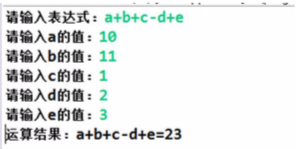
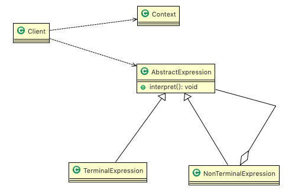
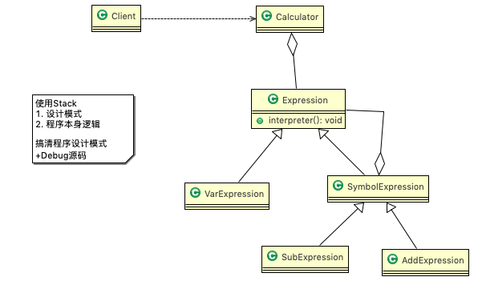
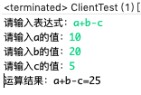
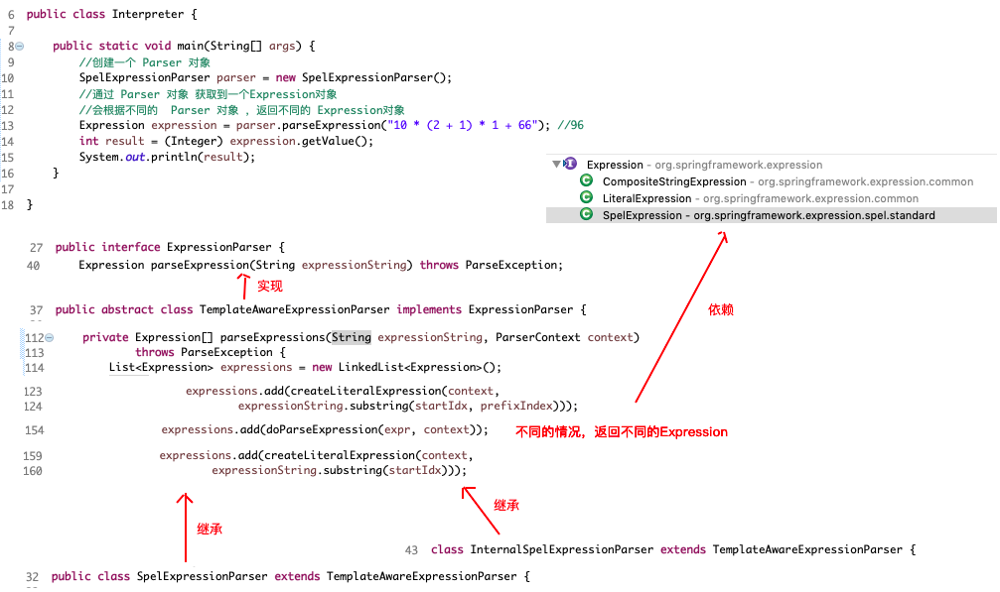

# 23.1 四则运算问题


通过解释器模式来实现四则运算，如计算 a+b-c 的值，具体要求

1. 先输入表达式的形式，比如 a+b+c-d+e, 要求表达式的字母不能重复
2. 再分别输入a ,b, c, d, e 的值
3. 最后求出结果:如图




# 23.2 传统方案解决四则运算问题分析


1. 编写一个方法，接收表达式的形式，然后根据用户输入的数值进行解析，得到结果。

2. 问题分析:如果加入新的运算符，比如 * / ( 等等，不利于扩展，另外让一个方法来解析会造成程序结构混乱，不够清晰。

3. 解决方案:可以考虑使用==解释器模式==， 即: 表达式 -> 解释器(可以有多种) -> 结果。

   

# 23.3 解释器模式

## 23.3.1 基本介绍


1. 在编译原理中，一个算术表达式通过词法分析器形成词法单元，而后这些词法单元再通过语法分析器构建语法分析树，最终形成一颗抽象的语法分析树。这里的词法分析器和语法分析器都可以看做是解释器。
2. 解释器模式(InterpreterPattern):==是指给定一个语言(表达式)，定义它的文法的一种表示==，并==定义一个解释器==，使用该==解释器来解释语言中的句子**(**表达式)==。
3. 应用场景
   * 应用可以将一个需要解释执行的语言中的句子表示为一个抽象语法树
   * 一些重复出现的问题可以用一种简单的语言来表达
   * 一个简单语法需要解释的场景
4. 这样的例子还有，比如编译器、运算表达式计算、正则表达式、机器人等。


## 23.3.2 原理类图




1. Context: 是环境角色,含有解释器之外的全局信息。
2. AbstractExpression: 抽象表达式，声明一个抽象的解释操作，这个方法为抽象语法树中所有的节点所共享。
3. TerminalExpression: 为终结符表达式, 实现与文法中的终结符相关的解释操作。
4. NonTermialExpression: 为非终结符表达式，为文法中的非终结符实现解释操作。
5. 说明:输入ContextheTerminalExpression信息通过Client输入即可。


# 23.4 解释器模式来实现四则

## 23.4.1 思路分析和图解(类图)




## 23.4.2 代码实现


```java
package com.atguigu.interpreter;

import java.util.HashMap;

/**
 * 抽象类表达式，通过HashMap 键值对, 可以获取到变量的值
 */
public abstract class Expression {
	// a + b - c
	// 解释公式和数值, key 就是公式(表达式) 参数[a,b,c], value就是就是具体值
	// HashMap {a=10, b=20, c=5}
	public abstract int interpreter(HashMap<String, Integer> var);
}
```


```java
package com.atguigu.interpreter;

import java.util.HashMap;


/**
 * 变量的解释器
 */
public class VarExpression extends Expression {

	private String key; // key=a,key=b,key=c

	public VarExpression(String key) {
		this.key = key;
	}

	// var 就是{a=10, b=20, c=5}
	// interpreter 根据 变量名称，返回对应值
	@Override
	public int interpreter(HashMap<String, Integer> var) {
		return var.get(this.key);
	}
}
```

```java
package com.atguigu.interpreter;

import java.util.HashMap;

/**
 * 抽象运算符号解析器 这里，每个运算符号，都只和自己左右两个数字有关系，
 * 但左右两个数字有可能也是一个解析的结果，无论何种类型，都是Expression类的实现类
 */
public class SymbolExpression extends Expression {

	protected Expression left;
	protected Expression right;

	public SymbolExpression(Expression left, Expression right) {
		this.left = left;
		this.right = right;
	}

	//因为 SymbolExpression 是让其子类来实现，因此 interpreter 是一个默认实现
	@Override
	public int interpreter(HashMap<String, Integer> var) {
		return 0;
	}
}
```


```java
package com.atguigu.interpreter;

import java.util.HashMap;

/**
 * 加法解释器
 */
public class AddExpression extends SymbolExpression  {

	public AddExpression(Expression left, Expression right) {
		super(left, right);
	}

	//处理相加
	//var 仍然是 {a=10,b=20}..
	//一会我们debug 源码,就ok
	public int interpreter(HashMap<String, Integer> var) {
		//super.left.interpreter(var) ： 返回 left 表达式对应的值 a = 10
		//super.right.interpreter(var): 返回right 表达式对应值 b = 20
		return super.left.interpreter(var) + super.right.interpreter(var);
	}
}
```

```java
package com.atguigu.interpreter;

import java.util.HashMap;

public class SubExpression extends SymbolExpression {

	public SubExpression(Expression left, Expression right) {
		super(left, right);
	}

	//求出left 和 right 表达式相减后的结果
	public int interpreter(HashMap<String, Integer> var) {
		return super.left.interpreter(var) - super.right.interpreter(var);
	}
}
```


```java
package com.atguigu.interpreter;

import java.util.HashMap;
import java.util.Stack;

public class Calculator {

	// 定义表达式
	private Expression expression;

	// 构造函数传参，并解析
	public Calculator(String expStr) { // expStr = a+b-c
		// 安排运算先后顺序
		Stack<Expression> stack = new Stack<>();
		// 表达式拆分成字符数组 
		char[] charArray = expStr.toCharArray();// [a, +, b, -, c]

		Expression left = null;
		Expression right = null;
		//遍历我们的字符数组， 即遍历  [a, +, b, -, c]
		//针对不同的情况，做处理
		for (int i = 0; i < charArray.length; i++) {
			switch (charArray[i]) {
			case '+': //
				left = stack.pop();// 从stack取出left => "a"
				right = new VarExpression(String.valueOf(charArray[++i]));// 取出右表达式 "b"
				stack.push(new AddExpression(left, right));// 然后根据得到left 和 right 构建 AddExpresson加入stack
				break;
			case '-': // 
				left = stack.pop();
				right = new VarExpression(String.valueOf(charArray[++i]));
				stack.push(new SubExpression(left, right));
				break;
			default: 
				//如果是一个 Var 就创建要给 VarExpression 对象，并push到 stack
				stack.push(new VarExpression(String.valueOf(charArray[i])));
				break;
			}
		}
		//当遍历完整个 charArray 数组后，stack 就得到最后Expression
		this.expression = stack.pop();
	}

	public int run(HashMap<String, Integer> var) {
		//最后将表达式a+b-c和 var = {a=10,b=20,c=5}
		//然后传递给expression的interpreter进行解释执行
		return this.expression.interpreter(var);
	}
}
```


```java
package com.atguigu.interpreter;

import java.io.BufferedReader;
import java.io.IOException;
import java.io.InputStreamReader;
import java.util.HashMap;

public class ClientTest {

	public static void main(String[] args) throws IOException {
		String expStr = getExpStr(); // a+b-c
		HashMap<String, Integer> var = getValue(expStr);// var {a=10, b=20, c=5}
		Calculator calculator = new Calculator(expStr);
		System.out.println("运算结果：" + expStr + "=" + calculator.run(var));
	}

	// 获得表达式
	public static String getExpStr() throws IOException {
		System.out.print("请输入表达式：");
		return (new BufferedReader(new InputStreamReader(System.in))).readLine();
	}

	// 获得值映射
	public static HashMap<String, Integer> getValue(String expStr) throws IOException {
		HashMap<String, Integer> map = new HashMap<>();

		for (char ch : expStr.toCharArray()) {
			if (ch != '+' && ch != '-') {
				if (!map.containsKey(String.valueOf(ch))) {
					System.out.print("请输入" + String.valueOf(ch) + "的值：");
					String in = (new BufferedReader(new InputStreamReader(System.in))).readLine();
					map.put(String.valueOf(ch), Integer.valueOf(in));
				}
			}
		}
		return map;
	}
}
```




# 24.5 在 Spring 框架应用的源码剖析

| dddddddddddddddddddddddddddddddddddddddddddddddddddddddddddddddddddddddddddddddddddddddddddddddddddd | d    |
| ------------------------------------------------------------ | ---- |
|  |      |

1. Expression 接口 表达式接口
2. 下面有不同的实现类，比如SpelExpression, 或者CompositeStringExpression。
3. 使用时候，根据你创建的不同的Parser 对象，返回不同的 Expression 对象。

```java
public Expression parseExpression(String expressionString, ParserContext context)
throws ParseException {
	if (context == null) {
		context = NON_TEMPLATE_PARSER_CONTEXT; 
    }
    if (context.isTemplate()) {
		return parseTemplate(expressionString, context); //返回的就是 CompositeStringExpression
    }else {
		return doParseExpression(expressionString, context); //返回的就是 SpelExpression
	}
}
```

4. 使用得当 Expression对象，调用getValue 解释执行表达式，最后得到结果


# 24.6 解释器模式的注意事项和细节


1. 当有一个语言需要解释执行，可将该语言中的句子表示为一个抽象语法树，就可以考虑使用解释器模式，让程序具有良好的扩展性。
2. 应用场景:编译器、运算表达式计算、正则表达式、机器人等。
3. 使用解释器可能带来的问题:解释器模式会引起类膨胀、解释器模式采用递归调用方法，将会导致调试非常复杂、效率可能降低。